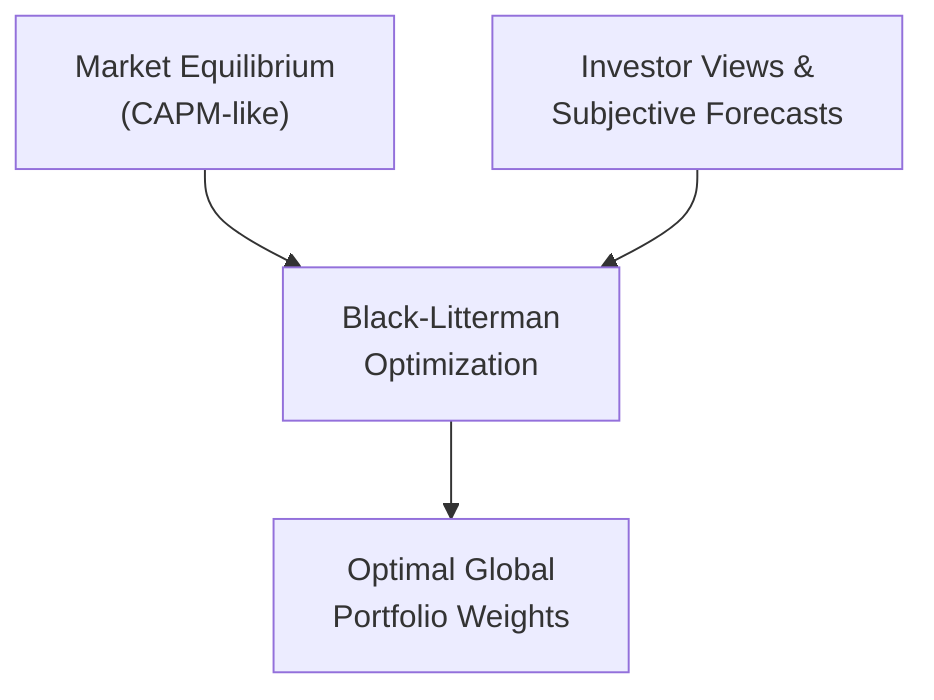

## 14.8 Do Asset Allocation Models Correctly Assess International Investment Opportunities?

When people talk about “asset allocation,” they often mention that classic 60/40 split—60% equities, 40% bonds. It’s almost like this legendary, bulletproof recipe your parents might have passed down, except it’s for building portfolios rather than baking cakes. But, you know, the more I chat with folks who have tried it, the more I realize it might not always be the perfect fit—especially in an international context.

Let’s say you recently inherited some cash and decided to invest it all in a “standard” model portfolio in Canada. Sure, you have your TSX stocks and a chunk of high-quality Canadian bonds. The challenge is, once you factor in all those wonderful cross-border opportunities—like U.S. growth stocks, European dividend payers, or emerging-market bonds—you realize the 60/40 approach may not be capturing the full global spectrum or the inherent risks. So, do these traditional asset allocation models really assess international investment opportunities effectively?

Below, we’ll explore how we can enhance existing models to handle currency risk, geopolitical concerns, and everything else that arises when you step outside your domestic comfort zone. We’ll also see how advanced frameworks, such as the Black-Litterman Model, keep evolving to accommodate global diversification. Finally, we’ll walk through ways to stress test your allocations against those out-of-the-blue economic events that sometimes feel like the finance world’s version of a surprise thunderstorm. Ready? Let’s jump right in.

---

### The Challenges with Traditional Asset Allocation

A typical 60/40 portfolio tends to tilt heavily toward domestic assets, reflecting home-country bias. If you’re in Canada, you might fill up on Canadian equities and government bonds. But as soon as you incorporate markets like the U.S., the UK, or Asia, there’s a swirl of questions:

• Are correlations the same across these regions?  
• Do macro factors, such as interest rate differentials or political conditions, factor in?  
• How do you adjust for currency movements and foreign taxes?

In practice, *home-country bias* can deprive you of diversification benefits that come from introducing varied foreign assets. True, focusing on your domestic market might help you keep track of local news, but you’ll miss global growth drivers. This can be extra significant in nations where the domestic market is small relative to international markets (Canada’s market capitalization compared to the global pool is a good example).

#### A Simple Mermaid Diagram

To visualize how a classic 60/40 approach may evolve when we incorporate international assets, consider this diagram:

In this flowchart, we start with a domestic-centric 60/40. Then we add foreign equities and bonds, which leads us to a more globally diversified structure. The final box (“Enhanced Global Diversification”) acknowledges the broader spread of risks, returns, and correlations.

---

### Incorporating Country- or Region-Specific Risk Factors

When you decide to venture outside your home market, you need to tailor your approach. That means paying attention to the following:

• **Political Risk:** Ever notice how a change in government or sudden policy shift can send a foreign stock market on a rollercoaster ride? Well, that’s political risk.  
• **Currency Risk:** Exchange rates can swing your returns dramatically. Even if a foreign stock is doing just fine, currency depreciation might eat into your gains.  
• **Regulatory or Economic Factors:** Different markets have different rules, interest rate policies, or capital controls. For instance, countries with pegged currencies can face unique macro constraints.

Let’s consider a Canada-based investor allocating money to emerging markets, such as India or Brazil. It’s not just the usual equity volatility. You could also see abrupt currency moves if local political developments spook foreign investors. So, one big tweak to your model is factoring in that currency dimension. Historically, many advisors either hedge the FX risk of foreign bonds or partially hedge equity exposures (although results can vary based on cost and your own risk tolerance).

### Dynamic (Tactical) Allocation Approaches

If you’re feeling like a static 60/40 or a simple domestic/international split is too one-size-fits-all, you might explore *tactical asset allocation (TAA)*. TAA basically means you shift your portfolio weights based on perceived short-term opportunities (or threats!) in the market. Maybe you see a currency war brewing in Asia, so you reduce your allocation there. Or you notice the U.S. is entering a mid-cycle phase with robust growth, and you temporarily increase U.S. equity exposure.

Yes, TAA is tricky—some folks argue it amounts to timing the market. But with careful analysis of leading indicators, valuation metrics, or momentum signals, TAA can offer increments of alpha. I remember once adjusting a client’s emerging market exposure when crude oil prices were spiking, because many emerging economies either rely on commodity exports (like Brazil) or imports (like India). Those nuances can really matter.

---

### The Black-Litterman Model

Now we step into advanced territory. The **Black-Litterman Model** is a quantitative asset allocation framework that merges two powerful ideas:  
1. The market equilibrium approach (like the Capital Asset Pricing Model’s equilibrium concept).  
2. Your own subjective views on certain assets or sectors.

Let’s put it this way: the Black-Litterman Model recognizes global market capitalizations as a starting point, but then it allows you to incorporate your own personal or research-based convictions. Maybe you have a strong conviction that European equities are undervalued, or that certain emerging markets are on an upswing. You can feed those views into the model, which then helps you derive ideal portfolio weights.

#### Black-Litterman in a Diagram

The following diagram breaks it down:

At the top, you have the market equilibrium piece (A). Then in parallel, you have your own personal or institutional views (B). These flow into the Black-Litterman optimization engine (C), which outputs improved global portfolio weights (D). 

In practice, large institutional asset managers or advanced investment advisors often rely on Black-Litterman to systematically factor in global data while fine-tuning weights. This is especially valuable if you have strong opinions about certain markets but still want a structured approach to avoid the pitfalls of guesswork.

---

### Stress Testing & Scenario Analysis

Even if you’ve accounted for all these complexities—political risk, currency fluctuation, region-specific correlations—you might still get blindsided by major, unforeseen economic or geopolitical events. A quick example: the sudden global turmoil we saw in early 2020, or the aftermath of major trade disputes. That’s where **stress testing** and scenario analysis come in.

• **Stress Testing**: You apply extreme (but plausible) shocks to your portfolio, such as a 25% drop in emerging market currencies or a sudden spike in oil prices. You see how your portfolio would perform under those wacky conditions.  
• **Scenario Analysis**: This might be a bit more narrative-based—like if a trade war intensifies, or if a major economy faces default. You’d walk through the expected chain reaction in global markets and see how each part of your asset allocation is affected.

Why do this? Well, if you see that your portfolio is extremely vulnerable to a certain type of shock, you might decide to dial back your exposure or explore hedging strategies (e.g., currency hedges, put options, or substituting local-currency bonds for dollar-denominated ones). For many advisors in Canada, performing scenario analyses on foreign allocations is essential because the Canadian dollar can move dramatically in response to oil prices. If you’re significantly invested in a region that’s also commodity-driven—like Australia or certain South American countries—those correlations can pile up quickly.

---

### Best Practices and Common Pitfalls

#### Best Practices

• **Diversify Across Regions**: Even within “international,” spread across multiple regions—developed, emerging, frontier—to avoid concentration risk.  
• **Account for Currency Exposure**: Decide whether you’ll hedge or not. At least be aware of the potential impact of exchange rates.  
• **Stay Informed**: Keep up with global macro trends, regulatory changes, and CIRO’s updated guidelines. As of 2023, CIRO oversees all investment dealers and mutual fund dealers in Canada. Check out [CIRO’s resources](https://www.ciro.ca) for the latest guidelines on portfolio construction.  
• **Use Portfolio Analytics Tools**: There are robust software platforms like Portfolio Visualizer or Morningstar Direct that let you model international allocations under different scenarios.  

#### Pitfalls

• **Overconfidence in TAA**: Tactical shifts require skill and good data. Without these, you might be just guessing.  
• **Ignoring Correlation Changes**: Correlations among different countries or asset classes aren’t static, especially in a crisis.  
• **Underestimating Costs**: Currency hedging, transaction fees, and taxes can eat into your returns.  
• **Lack of Stress Testing**: Not preparing for worst-case global events can leave you exposed to large drawdowns.

---

### Personal Observations and Aha Moments

I distinctly remember a conversation with a friend who managed a small family office. They’d stuck to a purely domestic approach for years. They rarely ventured beyond Canadian banking stocks, local real estate, and a chunk of federal bonds. Then, after noticing substantial performance in U.S. technology and certain European sectors, they decided to expand internationally. Suddenly, the complexities came rolling in—exchange rates, local regulations, even new withholding tax forms. They realized their usual portfolio model wasn’t really built for that level of complexity. Reworking it to factor in country-specific risks opened their eyes to the difference in diversification benefits. The portfolio eventually had more balanced returns, albeit with the occasional surprise from currency volatility. But overall, they felt the expansion significantly improved their risk-return profile compared to staying only in Canada.

It was a great reminder that real-world investing is more than just “Set it and forget it.” You have to tweak, assess, and adapt—especially when stepping into foreign markets.

---

### Canadian-Specific Regulatory and Institutional Context

Because we’re writing with a Canadian emphasis (but it applies to readers worldwide), it’s worth noting that:

• **CIRO** is the single national self-regulatory body in Canada. CIRO replaced the MFDA (Mutual Fund Dealers Association) and IIROC (Investment Industry Regulatory Organization of Canada), both of which no longer exist as separate entities.  
• **CIPF** (Canadian Investor Protection Fund) is the sole investor protection fund now. If a member firm goes insolvent, CIPF helps protect your assets.  
• For the latest guidelines on how to incorporate international securities within a Canadian-registered plan (e.g., RRSP, TFSA), or how to handle new disclosure requirements, always consult [CIRO’s website](https://www.ciro.ca). They have updated resources that reflect the current (2025) regulatory environment.  

---

### References and Resources

• **CIRO Resources on Portfolio Construction**:  
  – [CIRO Portfolio Construction Guidelines](https://www.ciro.ca)  

• **Portfolio Analytics Software**:  
  – [Portfolio Visualizer](https://www.portfoliovisualizer.com/)  
  – [Morningstar Direct](https://www.morningstar.ca)  

• **Academic Research**:  
  – CFA Institute has published numerous papers on international diversification and cross-border correlations. Consider their whitepapers in the CFA Institute Research Foundation series.  

• **Open-Source Financial Tools**:  
  – R packages (e.g., “PerformanceAnalytics,” “quantmod”) available on [CRAN](https://cran.r-project.org/) for sophisticated portfolio backtesting.  
  – Python libraries (e.g., “PyPortfolioOpt”) for the mathematically inclined.  

---

### Glossary

**Asset Allocation**: The process of dividing an investment portfolio among different asset categories—like stocks, bonds, cash, and alternatives—to achieve risk and return objectives.  

**Tactical Asset Allocation (TAA)**: The practice of adjusting portfolio allocations based on short-term forecasts of economic or market conditions, aiming to take advantage of perceived opportunities or to manage specific risks.  

**Stress Test**: A simulation tool that applies extreme hypothetical scenarios (e.g., a large currency devaluation) to estimate how a portfolio might perform under adverse circumstances.  

**Black-Litterman Model**: An advanced asset allocation framework that combines market equilibrium data with an investor’s subjective views to arrive at optimized portfolio weights, especially useful in global investing contexts.

---

### Bringing It All Together

Do traditional asset allocation models accurately assess international opportunities? Well, maybe not out of the box. But with the right adjustments—like factoring in currency risk, adjusting for country-specific or region-specific political risk, and employing dynamic rebalancing techniques—these models can evolve into powerful, globally diversified frameworks. Advanced options like the Black-Litterman Model can give you a systematic way to incorporate your own views about different regions and asset classes, which is often crucial if you’re a manager or investor with strong convictions.

Don’t forget to run periodic stress tests or scenario analyses. Global investing opens up a treasure trove of diversification possibilities, but it also amplifies the complexity. By taking an informed, flexible, and prepared approach, you can reap the benefits of global markets while staying mindful of the potential pitfalls.

Remember: global diversification is not a “get rich quick” scheme. It’s a method of smoothing out risk and potentially capturing growth in markets that might be outside your home turf. With the right tools and a bit of curiosity, you can navigate these waters in a way that might surprise you by how resilient and rewarding your portfolio can become.

---

## Test Your Knowledge: International Asset Allocation Models Quiz



### In a traditional 60/40 portfolio, what is the most common concern regarding foreign assets?

- [ ] Over-diversification
- [ ] Page limitations in financial filings
- [x] Home-country bias and underrepresentation of foreign markets
- [ ] Private placements are excluded

> **Explanation:** Traditional 60/40 models often concentrate heavily on domestic holdings, leading to home-country bias and insufficient foreign markets representation.

### Which of the following risk factors is inherently amplified during international investing?

- [ ] Dividend reinvestment availability
- [x] Currency fluctuation risk
- [ ] Brokerage fee structures
- [ ] Portfolio turnover rates

> **Explanation:** Currency fluctuation risk is one of the key factors that can positively or negatively affect returns when venturing into foreign markets.

### What is a core characteristic of Tactical Asset Allocation (TAA)?

- [x] It involves short-term adjustments to capture market opportunities.
- [ ] It ensures a fixed, unchanging asset allocation at all times.
- [ ] It does not consider momentum indicators.
- [ ] It only applies to bond investments.

> **Explanation:** TAA dynamically adjusts asset classes based on short-term forecasts, aiming to capture short-lived market trends or avoid emerging risks.

### How does the Black-Litterman Model integrate investor sentiment?

- [ ] By discarding all market equilibrium information
- [ ] Through government mandates
- [x] By combining investor views with a baseline market equilibrium
- [ ] By prohibiting unusual asset class allocations

> **Explanation:** The Black-Litterman Model blends equilibrium returns (mimicking CAPM concepts) with the investor’s subjective views, resulting in refined portfolio weights.

### Which of the following best describes a “Stress Test” in portfolio management?

- [x] A simulation that applies extreme scenarios to estimate potential losses
- [ ] A daily limit on how many trades you can execute
- [x] A guaranteed approach to remove all risk
- [ ] A regulatory rule requiring triple diversification

> **Explanation:** Stress tests apply unlikely but plausible scenarios to gauge how badly the portfolio might be affected, giving managers a sense of worst-case outcomes.

### What is a key advantage of incorporating emerging markets into a Canadian investor’s portfolio?

- [ ] Guaranteed higher returns than domestic stocks
- [ ] Elimination of currency risk
- [ ] Smooth, consistent correlation with Canadian markets
- [x] Potentially higher growth and diversification benefits

> **Explanation:** While emerging markets can be volatile, they may offer higher growth prospects and also exhibit lower correlation with purely domestic assets.

### Why might correlation changes across markets be a major concern?

- [ ] Correlation remains always the same
- [ ] No major risk arises from changing correlations
- [x] Correlations can significantly rise during crises, reducing diversification benefits
- [ ] Changes in correlation typically have zero effect on portfolio returns

> **Explanation:** Correlations can shoot up during market turbulence, undermining the expected diversification benefit from international assets.

### Which of the following is a common challenge when performing Tactical Asset Allocation?

- [x] Overconfidence or lack of precise market intelligence
- [ ] Guaranteed outperformance across all periods
- [ ] Complete immunity to currency risk
- [ ] Elimination of portfolio turnover costs

> **Explanation:** Tactical Asset Allocation may underperform if not informed by reliable data and disciplined processes, making overconfidence a key pitfall.

### How do advanced tools like Portfolio Visualizer support international investing?

- [ ] They only analyze Canadian stocks
- [ ] They guarantee zero fees
- [ ] They prohibit scenario analysis
- [x] They enable backtesting and stress testing of global allocations

> **Explanation:** Tools like Portfolio Visualizer allow investors to blend different regional assets, run scenario analyses, and observe historical performance under various conditions.

### True or False: The Canadian Investor Protection Fund (CIPF) now protects clients’ assets if their member firm becomes insolvent, after merging with the MFDA IPC.

- [x] True
- [ ] False

> **Explanation:** As of 2023, CIPF is the sole investor protection fund in Canada, remaining independent from CIRO but providing coverage if a member firm fails financially.


