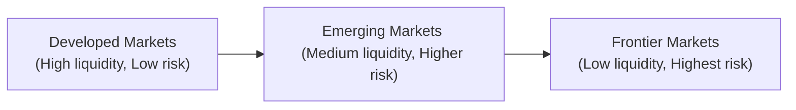
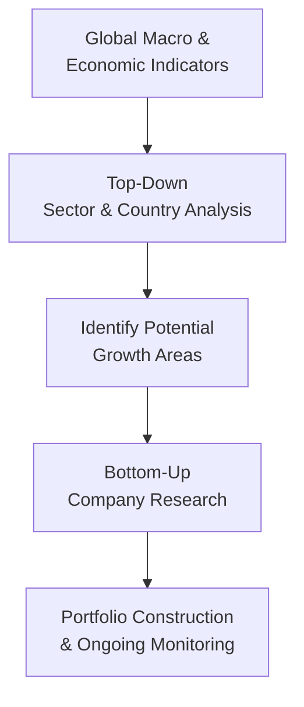

## 14.9 Investing in Emerging and Frontier Markets

Picture this: You’re hanging out with a friend who’s super excited about investing in fast-growing countries, telling you all about how people in certain markets are rapidly adopting new technologies, transitioning into modern cities, and unleashing creative entrepreneurial ideas. You’ve heard that these “emerging” and “frontier” markets can sometimes skyrocket in value, yet you’re also a bit nervous because you’ve read about political instability, liquidity challenges, and currency risks. Well, you’re definitely onto something interesting—emerging and frontier markets can offer that extra “oomph” for a portfolio’s returns. But let’s be honest: they come with a unique set of complexities. Let’s break it down, shall we?

---

### Defining Emerging and Frontier Markets

Before we jump into the nitty-gritty, let’s clarify what we mean by emerging and frontier markets:

• Emerging Markets: These are countries with economies transitioning from lower-income or middle-income status toward higher-income classification. They typically have robust growth potential, somewhat established financial infrastructures, and increasing global integration—but they're not yet on par with fully developed markets like Canada or the United States.

• Frontier Markets: Think of them as the “younger siblings” of emerging markets—smaller, less liquid, and often with limited financial infrastructure. Frontier markets might be a bit more volatile (sometimes a lot more), have thinner trading volumes, and can be harder to access. Because of these constraints, they typically represent higher risk but also can generate higher returns—like an untouched gold vein, if you will.

Here’s a simple illustration of how one might conceptually visualize the progression from developed to frontier markets:

While this flow is a conceptual look at broad categories, real-world classification isn’t always so black and white. Agencies like MSCI, FTSE, and S&P have their own criteria for determining whether a country is considered “emerging” or “frontier,” often factoring in market accessibility, liquidity, and regulatory framework.

---

### Key Economic Drivers

Emerging and frontier markets tend to share certain catalytic growth drivers that distinguish them from developed markets:

• Demographics: Many of these economies have younger and rapidly expanding populations. This demographic dividend can drive consumer demand, increase the labor force, and spur economic growth.

• Urbanization: As families move from rural to urban areas, the construction of new housing, roads, and public services boosts demand for materials, labor, and financing. Urbanization also fosters a more concentrated and accessible consumer base.

• Rapid Industrialization: Emerging economies often experience a surge in manufacturing, infrastructure spending, and technological adoption. For example, a country transitioning from agriculture to manufacturing can quickly see a spike in GDP.

• Technological Leapfrogging: It may sound surprising, but some frontier markets skip entire technology phases, jumping straight to mobile banking or digital services. This can create opportunities for investors in companies that provide these advanced solutions.

• Resource Endowment: Let’s say a country has a wealth of natural resources (oil, metals, or agricultural commodities). That can be a driving force for economic development—and also a magnet for foreign investors.

---

### Unique Challenges in Emerging and Frontier Markets

I’ll admit—when I first looked at investing in a frontier country’s stock exchange, the sheer absence of reliable data almost made me drop the idea. Inconsistent or outdated financial reporting, limited research coverage, and less efficient capital markets are often par for the course here. Here are some challenges you might face:

• Political & Regulatory Risk: Governing structures can be fragile, with sudden policy changes that may catch foreign investors off-guard. Monitoring local politics and regulatory developments becomes a must.

• Market Liquidity: Thin trading volumes in many frontier markets can lead to outsized price swings. Getting in and out of positions might take significantly longer than in developed markets.

• Infrastructure Gaps: Just because there’s a stock exchange doesn’t mean it’s seamlessly integrated with global systems. Settlement processes may be opaque or subject to delays.

• Currency Fluctuations: Ever had the experience of seeing strong local market returns, only to find them erased by currency devaluations? That’s a real possibility in these markets.

• Transaction Costs & Taxes: Brokerage fees, local taxes, or foreign investor rules can be higher or more complicated than you’d expect. It’s vital to account for these “hidden” costs.

• Regulatory Framework: Regulations can be less mature or enforced unequally, leading to uncertainty about shareholder protections, market transparency, or dispute resolution.

---

### Volatility & Correlation

When you hear about emerging or frontier markets in day-to-day financial news, the word “volatile” often shows up. Indeed, they can exhibit wide price swings in both directions. However, these markets also have a reputation for having lower correlations with developed markets. In theory, that can provide some decent diversification benefits. But note: in times of a major global financial crisis—think 2008 or the early moments of 2020—correlations tend to spike, and diversification benefits may not be as robust as you’d hope.

To illustrate the concept of correlation mathematically, recall:


\rho_{XY} = \frac{\mathrm{Cov}(X, Y)}{\sigma_X \sigma_Y},


where \\(\mathrm{Cov}(X, Y)\\) is the covariance between assets X and Y, \\(\sigma_X\\) is the standard deviation of X, and \\(\sigma_Y\\) is the standard deviation of Y. In practical terms, keep in mind that emerging or frontier markets might move independently during normal times, but in a global crisis, “all ships sink together,” as the saying goes.

---

### Investment Strategies

OK, so you’ve decided you want exposure to an emerging or frontier market. You’ll need a strategy that helps you navigate macro-level risk while still picking out the high-potential firms or sectors:

**Top-Down Analysis**: This approach starts with the big-picture factors—macro indicators like GDP growth, inflation, and political stability—before zeroing in on specific sectors or securities. For instance, if you see that a particular emerging economy is investing heavily in renewable energy, you might focus on local companies that manufacture solar panels or wind turbines.

**Bottom-Up Analysis**: Here, you focus on an individual company’s fundamentals—cash flows, earnings growth, competitive advantages—regardless of macroeconomic conditions. This can be trickier in frontier markets because data might be scarce or unreliable, so you often have to dig deeper into local media reports or on-the-ground research.

Below is a simple visual representation of how top-down and bottom-up approaches work together:

Combining both tactics often yields the best results: top-down identifies the most promising regions or sectors, while bottom-up ensures you pick quality companies within those spaces.

---

### Practical Examples and Case Studies

• **Infrastructure Boom in Asia**: Over the past decade, several Asian economies have pumped billions into roads, railways, and digital infrastructure. Investors who spotted this trend and selected strong construction or engineering firms (using fundamental analysis) benefitted from robust returns.

• **African Consumer Growth**: Countries like Kenya, Ghana, or Nigeria have rising middle classes with a taste for consumer goods, mobile payments, and healthcare services. However, currency volatility (e.g., the Nigerian naira) can significantly influence the real returns.

• **Digital Leapfrogging in Frontier Markets**: Some smaller Southeast Asian nations bypassed traditional banking and jumped straight to mobile money platforms. Investors who recognized the adoption potential of such technologies got in early on digital payment ventures that soared in value.

Now, a disclaimer: not all stories have a happy ending. Political turmoil, regulatory clampdowns, or commodity price collapses can drastically change environments. A region that seemed unstoppable a few years ago might be struggling with capital outflows today. Consistent vigilance is part of the job.

---

### Best Practices and Common Pitfalls

**Best Practices**  
• Conduct Thorough Due Diligence: This might mean traveling to the region and meeting with local management teams, or leveraging local research analysts who know the landscape.  
• Diversify Wisely: Don’t put all your capital into a single country or sector; ensure broad geographic and sector spreads.  
• Hedge Currency Risk: If you’re worried about local currencies plunging, consider currency-hedged funds or forward contracts.  
• Stay Up-to-Date with Regulations: Keep a close eye on new laws, capital controls, or tax changes. CIRO (Canadian Investment Regulatory Organization) provides regulatory guidance for dealing with speculative investment products, reminding advisors and clients that international assets can carry distinct operational and compliance risks.

**Common Pitfalls**  
• Underestimating Liquidity Risk: You may not be able to exit a position at a “fair” price if trading volume evaporates.  
• Political Misread: People often overlook local sentiment. Elections or leadership changes may usher in policies that abruptly alter the investment climate.  
• Overpaying for Hot Sectors: Sentiment can run wild, pushing valuations to unsustainable levels.  
• Excessive Leverage: Borrowing to invest in inherently volatile markets magnifies gains but blows up losses too.

---

### Regulatory Considerations & Canadian Context

If you’re a Canadian investor—or advising Canadian clients—remember that CIRO oversees investment advisors and deals specifically with guidance on complex or speculative products that may fall under high-volatility international investments. Also, the Canadian Investor Protection Fund (CIPF) offers coverage if a CIRO member firm goes insolvent, though it doesn’t protect against market losses or currency fluctuations.

Historically, Canadian investors had different self-regulatory organizations (the MFDA and IIROC) up until 2023, when they fused into CIRO. So if you come across older documents referencing MFDA or IIROC, just remember they’re the defunct predecessors now replaced by CIRO as the single new entity. You can find current and official updates on the CIRO website (https://www.ciro.ca), which also includes notices on best practices for investing in emerging-market securities, especially regarding disclosure, suitability, and risk management.

---

### Glossary of Terms

• **Urbanization**: The ongoing shift of population from rural to urban areas, contributing to growth in infrastructure, real estate, and consumer demand.  
• **Frontier Markets**: The smallest, most illiquid and least developed capital markets that are just starting to integrate with the global financial system.  
• **Top-Down Analysis**: Research that focuses on broad macroeconomic or industry trends before identifying specific investment candidates.  
• **Bottom-Up Analysis**: An approach that zeroes in on company fundamentals—like earnings, cash flow, and market share—prior to sector or country considerations.

---

### Putting It All Together

Investing in emerging and frontier markets can be exciting—there’s undeniable growth potential, along with the possibility of unearthing dynamic companies that become tomorrow’s global giants. But, you know, it is also significantly more complex. The interplay of macroeconomic shifts, political risk, liquidity constraints, and inconsistent regulations demands a careful, disciplined approach.

If you’re considering adding emerging or frontier market exposure to your portfolio, a solid place to start is with the well-known indexes or ETFs representing these markets. These baskets can spread risk across multiple countries and industries, hopefully mitigating single-country upheavals. Alternatively, you might go “all-in” with an active strategy—just be sure you or your advisor thoroughly understand both the micro-level fundamentals of chosen companies and the macro-level environment. And remember, no investment return is guaranteed, especially in markets that can swing significantly in response to local and global economic changes.

---

### References and Further Resources

• **World Bank “Doing Business” Reports**: Provides data on regulatory frameworks, business entry requirements, and overall ease of doing business in many emerging or frontier markets.  
• **EMTA (Emerging Markets Traders Association)**: Offers industry practices, data, and a network for professionals dealing in emerging market securities.  
• **CIRO**: Canada’s self-regulatory organization for investment dealers. Visit https://www.ciro.ca for the latest regulatory notices, including guidelines on speculative and international investments.  
• **Open-Source Financial Tools**: Platforms like Python’s pandas and the R language can help analyze time-series data for capital flows and returns in less-covered markets.  
• **Local Exchanges and News Outlets**: Keep an eye on local business newspapers, commentary from local economists, and the official websites of stock exchanges to get updated insights.

---

## Test Your Knowledge: Emerging and Frontier Market Investing Quiz



### Which of the following best describes frontier markets?

- [ ] They are the same as emerging markets.
- [ ] They are highly regulated and highly liquid.
- [ ] They have GDP and market liquidity on par with developed nations.
- [x] They are smaller, less liquid markets, often with limited financial infrastructure.

> **Explanation:** Frontier markets are considered the smallest, least liquid, and often most underdeveloped capital markets, characterized by higher risk and potentially higher returns than emerging markets.

### What is one core reason that emerging markets can potentially offer higher returns?

- [ ] They have minimal political risks.
- [x] They typically experience faster economic growth with younger populations.
- [ ] They have the strictest financial regulations in the world.
- [ ] They move perfectly in sync with developed markets.

> **Explanation:** Emerging markets often benefit from accelerating demographic changes, industrialization, and higher growth rates relative to developed markets, which can translate into higher potential returns.

### During a severe global downturn, how might emerging market correlations with developed markets change?

- [x] Correlations often rise, reducing diversification benefits.
- [ ] Correlations often drop, increasing diversification benefits.
- [ ] Correlations are unaffected by global downturns.
- [ ] No correlation data is available for emerging markets.

> **Explanation:** While emerging markets may have low correlation with developed markets in normal times, major global crises can drive cross-market correlations higher as risk aversion grows worldwide.

### Which of the following is a potential challenge specific to frontier markets?

- [ ] Highly efficient market mechanisms.
- [x] Limited liquidity and difficulty exiting positions.
- [ ] Full and transparent financial disclosures.
- [ ] Similar volatility levels as the S&P/TSX Composite.

> **Explanation:** Frontier markets often carry limited liquidity, making it difficult for investors to quickly transact without impacting prices significantly.

### Which best describes a top-down investment approach?

- [x] Evaluating macroeconomic, political, and sector trends before selecting specific companies.
- [ ] Singularly focusing on a company’s balance sheet.
- [x] Considering big-picture economic factors, then drilling down on suitable sectors or industries.
- [ ] Relying solely on past stock performance for buy/sell decisions.

> **Explanation:** Top-down analysis starts from global or macroeconomics and sector trends and then moves to identify companies likely to benefit from those overarching changes.

### Which term refers to a population shift from rural to urban areas and is common in emerging markets?

- [x] Urbanization
- [ ] Hedging
- [ ] Dollar-cost averaging
- [ ] Depreciation

> **Explanation:** Urbanization drives infrastructure growth and increased consumer demand, often spurring economic development in emerging markets.

### What does “bottom-up” analysis focus on?

- [x] Company-specific fundamentals such as revenues, margins, and cash flow.
- [ ] Large-scale economic metrics like GDP.
- [x] Detailed research into individual firms regardless of broader market conditions.
- [ ] Solely currency exchange rates.

> **Explanation:** Bottom-up analysis zeroes in on company-level details to determine if an investment is sound, paying less initial attention to macro factors.

### Which organization provides coverage to Canadian investors if a CIRO member firm becomes insolvent?

- [ ] MFDA IPC
- [x] CIPF
- [ ] IIROC
- [ ] World Bank

> **Explanation:** The Canadian Investor Protection Fund (CIPF) is Canada’s sole investor compensation fund. The MFDA IPC merged with CIPF in 2023.

### What is a fundamental risk associated with emerging and frontier markets?

- [ ] No currency fluctuations whatsoever.
- [ ] They are fully immune to global recessions.
- [ ] Near-zero transaction costs.
- [x] Political instability and sudden policy changes.

> **Explanation:** Political uncertainty, security concerns, and volatile policy environments are well-known risks in emerging and frontier markets.

### True or False: CIRO is the current national self-regulatory organization in Canada for investment dealers and market integrity.

- [x] True
- [ ] False

> **Explanation:** CIRO (Canadian Investment Regulatory Organization) was formed in 2023 by amalgamating MFDA and IIROC to be Canada’s new single self-regulatory body overseeing investment dealers and mutual fund dealers.


