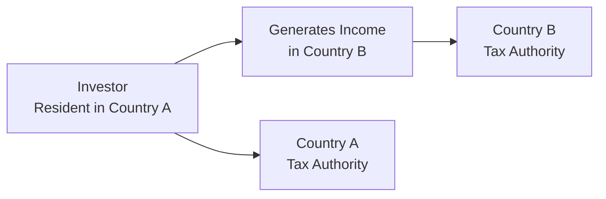

## 15.1 International Tax Conflicts and Double Taxation

You know, sometimes when I talk to friends about paying taxes in multiple places, I almost see them cringe. It’s like they imagine opening their wallet and seeing two (or more) government hands dipping in at the same time. And, well, that’s kind of what double taxation can feel like. It’s a very real issue for folks and businesses who operate, invest, or live across borders. In this section, we’ll explore why double taxation happens, how it’s addressed, and what financial professionals can do to help clients navigate this maze of overlapping laws and regulations.

## Why International Tax Conflicts Arise

Tax conflicts crop up when multiple countries simultaneously claim jurisdiction over the same income, gain, or transaction. Each country has a unique tax code, often defining “residence” and “source” in its own way. Think of it like two referees in a hockey game—both blow the whistle at the same time, each sure that they have the final say on the penalty. It creates confusion, frustration, and yes, extra costs for taxpayers.

### Residence vs. Source

Most countries apply their tax laws based on:  
• Residence: If you live or are incorporated in Country A, that country thinks you owe them taxes.  
• Source: If you earn money in Country B—even though you live somewhere else—Country B wants a slice of that pie.  

If Country A and Country B both have these claims, you can see how easy it is to end up paying more than your fair share.

### Overlapping Tax Rules

Overlaps can happen from:  
• Different interpretations of tax residence (e.g., one country might define having a “permanent home” differently than another).  
• Mismatched definitions of taxable income (e.g., capital gains recognized in one jurisdiction but not in another).  
• Varying corporate residency rules, such as place-of-management vs. place-of-incorporation tests (imagine a company that’s incorporated in Canada but effectively managed from the United States).  

Up until 2023, you might have seen references to the Mutual Fund Dealers Association of Canada (MFDA) or the Investment Industry Regulatory Organization of Canada (IIROC). However, these organizations merged into the new Canadian Investment Regulatory Organization (CIRO) on January 1, 2023. CIRO is now the national self-regulatory body overseeing investment dealers, mutual fund dealers, and market integrity on equity and debt marketplaces in Canada. For further information on the current regulatory environment, visit <https://www.ciro.ca>.

## Double Taxation Basics

Double taxation is essentially paying taxes on the same income twice (or more) in different jurisdictions. It often crops up as a big headache for multinational enterprises, traveling professionals, consultants, or anyone who collects income outside of their home country. Unless carefully managed, it can significantly erode a taxpayer’s net returns and, from an advisor’s perspective, may reduce a client’s willingness to invest in foreign markets.

### Glossary

• Double Taxation: When the same income is taxed first by the taxpayer’s country of residence and then again by the country where the income is earned (source country).  
• Tax Conflicts: Disputes or overlapping claims across different jurisdictions all asserting some right to tax.  
• Bilateral Tax Treaty: An agreement between two countries that prevents (or reduces) double taxation and fosters cooperation in handling cross-border tax matters.  
• Tax Credits: Usually granted by a residence country to offset foreign taxes paid, preventing double taxation.  
• Cross-Border Transaction: Any transaction (buying, selling, investing, etc.) that involves two or more countries.

## Common Instances of Double Taxation

If you haven’t seen double taxation “in the wild,” let’s look at a few typical scenarios:

• A Canadian corporation headquartered in Toronto with a German branch. Canada taxes the corporation on its worldwide income, and Germany also taxes the profits earned in Germany.  
• A Canadian citizen who might be regarded as a “tax resident” in both Canada and another country due to living arrangements, dual citizenship, or local rules for evaluating permanent residence.  
• Non-resident Canadians who keep property in Canada, collect rental income, or capital gains that also get taxed in their new jurisdiction of residence.  

### Diagram: Overlapping Taxes

Below is a simple depiction of how an investor’s income might be taxed twice—once in the residence country and once in the source country.

In this scenario, the investor’s country of residence wants to tax worldwide income, while the source country demands taxes on the income generated there. 

## How International Tax Conflicts Are Addressed

The good news is that, while double taxation can be discouraging, many countries take steps to fix or reduce these conflicts. Two major ways to address double taxation are:  

• Bilateral Tax Treaties  
• Domestic Tax Relief (including foreign tax credits, deductions, or exemptions)

### Bilateral Tax Treaties

Most countries that have significant economic ties sign tax treaties (sometimes called “Tax Conventions”). Canada, for instance, has numerous bilateral tax treaties around the world. You can find a full list on the [Department of Finance Canada](https://www.fin.gc.ca/) website.

A bilateral tax treaty typically covers:  
• Reductions of withholding tax on interest, dividends, or royalties.  
• Definitions of “residence” and “permanent establishment.”  
• Mechanisms for dispute resolution, such as the Mutual Agreement Procedure (MAP).  
• Provisions for exchange of information to prevent tax evasion.

The [OECD Model Tax Convention](https://www.oecd.org/tax/treaties/oecd-model-tax-convention-available-products.htm) is often the jumping-off point. While the actual agreement between countries might differ slightly, the Model often informs how those treaties get structured.

### Domestic Tax Relief

If no treaty is in place—or the treaty doesn’t fully resolve all issues—domestic tax rules often provide relief such as:

• Foreign Tax Credits: If you already paid $1,000 in taxes to Country B, you can often subtract that $1,000 from your tax bill in Country A. 
• Tax Deductions or Exemptions: Sometimes the home country fully or partially exempts certain types of foreign-source income.  
• Tax Deferral Strategies: In some cases, you can defer taxes until you actually repatriate the income (common with certain corporate structures).  

For Canadians, check out the [Canada Revenue Agency (CRA)](https://www.canada.ca/en/revenue-agency.html) website for guidelines on how to report foreign income, claim foreign tax credits, and other measures that help reduce double taxation.

## Importance for Investment Advisors

For an investment advisor, it may be tempting to focus just on returns and ignore taxes—especially if you’re used to dealing with purely domestic clients. But ignoring double taxation risks can eventually undermine the trust and loyalty you build with clients. After all, if a client’s foreign investments end up crippled by tax costs they didn’t anticipate, it’s going to leave them feeling pretty frustrated.

### Minimizing the Effect on Returns

Advisors can utilize strategies such as:

• Proper Entity Selection: Setting up the right type of business or investment vehicle can minimize cross-border tax exposure. For instance, using a Canadian corporation vs. a limited partnership in the U.S. might have a significantly different result.  
• Investing Via Tax-Efficient Structures: Some clients might use specialized trusts or holding companies (especially for real estate or intangible asset holdings).  
• Leveraging Tax Treaties: If your client invests in multiple countries, you can structure the cross-border flow of funds or distributions in such a way that treaty benefits (like lower withholding rates) are efficiently used.  

### Case Study: Canadian Investor in U.S. Equities

Imagine your client, Sarah, is a Canadian resident who invests in dividend-paying stocks from a U.S. company. Absent a treaty, she could be subject to 30% withholding tax on dividends paid by the U.S. entity, plus Canadian tax on that same income. However, under the Canada-U.S. tax treaty, the withholding rate may drop to 15%. Then Sarah might be able to claim a foreign tax credit in Canada for the U.S. taxes paid. Ultimately, she only gets taxed once, at a combined rate close to her normal Canadian marginal rate.

## Common Pitfalls and Challenges

• Assuming a Treaty Automatically Solves Everything: Not all treaty provisions are straightforward, and they might have subtle limitations or conditions.  
• Poor Recordkeeping: Failing to keep track of your foreign income and taxes paid can lead to lost credits or missed filing deadlines.  
• Overlooking Tax Residency Issues: Moving between countries partway through the tax year can trigger partial-year residency in both places, leading to extra complexity.  
• Not Considering Future Changes: Tax treaties can be renegotiated or updated; keeping an eye on future developments is crucial.  

A gentle reminder: The Canadian Investor Protection Fund (CIPF) is Canada’s sole investor protection fund since January 1, 2023. While CIPF helps protect client assets if a CIRO dealer becomes insolvent, it doesn’t directly handle tax matters. It’s just one piece of the broader framework that advisors need to understand when working in cross-border contexts.

## Practical Tips and Best Practices

Advisors and portfolio managers often rely on specialists like cross-border tax accountants or international tax attorneys. Even so, it’s still important to keep a handle on these best practices:

• Stay Current: Treaty networks expand or get amended regularly. The [Department of Finance Canada](https://www.fin.gc.ca/) website is a good place to check for official updates.  
• Create a “Tax Roadmap” for Clients: This includes analyzing which countries have the best treaties with Canada, recommending potential changes to your client’s investment plan, and ensuring relevant tax compliance (e.g., forms T1135 in Canada for foreign property disclosures).  
• Educate Clients on Filing Compliance: Remind clients about deadlines, reporting requirements, and possible penalties for non-compliance.  
• Model Different Scenarios: In some situations, it might be more tax-efficient for your client to invest in one jurisdiction vs. another. Use open-source financial modeling tools or spreadsheets to measure net returns after taxes.

## Real-World Example: Cross-Border Business

Let’s say a small business owner has a Canadian-incorporated entity that exports medical devices to Australia. Canada imposes taxes on worldwide income. Australia, however, wants to tax the local sales in Australia. If the small business inadvertently sets up “substantial presence” in Australia (e.g., by having a local warehouse or staff who directly conduct sales), the Australian Tax Office can levy corporate taxes on the profits generated there. Properly structuring a subsidiary, ensuring transfer pricing is managed carefully, and leveraging the Canada-Australia tax treaty might reduce or eliminate double taxation. Without proactive planning, the business owner could face tax bills from both countries.  

## Considering Regulatory Aspects in Canada

Under the new regulatory environment:  
• CIRO is the national self-regulatory body overseeing investment dealers, mutual fund dealers, and market integrity.  
• CIRO focuses on compliance with securities regulations and general industry standards, including how advisors disclose and understand tax implications of certain cross-border products.  
• Though tax policy is not set by CIRO (that’s the jurisdiction of the Ministry of Finance and the CRA), advisors who are licensed with CIRO still must handle cross-border client transactions with full transparency and appropriate due diligence.

## Involving Specialized Tax Professionals

Sometimes, you might feel like you need a translator just to figure out the interplay between two countries’ tax rules. It’s often wise to bring in cross-border tax specialists who can analyze the details and set up a plan. Don’t forget that robust collaboration can lead to more confident decision-making, especially for clients with significant offshore assets or multiple citizenships.

## References and Further Exploration

• [Canada Revenue Agency (CRA)](https://www.canada.ca/en/revenue-agency.html): Provides guidance on foreign income reporting, tax credits, and forms for cross-border transactions.  
• [Department of Finance Canada](https://www.fin.gc.ca/): Check for updates on Canada’s bilateral tax treaties.  
• [OECD Model Tax Convention](https://www.oecd.org/tax/treaties/oecd-model-tax-convention-available-products.htm): A foundation for how many bilateral tax agreements are structured.  
• Book: “International Taxation in Canada” by Jinyan Li et al. to dive deeper into cross-border tax rules.  
• Online Courses: Platforms like Coursera and edX offer modules on international taxation and global tax frameworks, if you want a more academic approach.

## Concluding Thoughts

International tax conflicts can be like a puzzle—each piece might make sense alone, but putting them all together can be tricky. As an investment advisor or financial professional, understanding at least the basics of how double taxation occurs and how it is resolved is critical for serving clients who venture into foreign investments or multinational business operations. Whether you’re helping a Canadian expat figure out capital gains on stocks or guiding a local entrepreneur expanding overseas, knowledge of these tax conflicts and the solutions that exist—like tax treaties, foreign tax credits, and strategic planning—adds tremendous value to your clients’ overall experience and success.

Stay curious, stay informed, and never hesitate to tap into the resources available—like CRA, the Department of Finance, or specialized professionals—so that you can confidently guide your clients to efficient and compliant cross-border decisions.  

---

## Test Your Knowledge: International Tax Conflicts and Double Taxation



### Which of the following scenarios most clearly illustrates double taxation?

- [ ] A Canadian company exporting goods domestically in Canada only.  
- [x] A Canadian resident paying taxes in both Canada and the U.S. on the same income.  
- [ ] The government imposing a sales tax in one province only.  
- [ ] Two companies merging and paying one single corporate tax.  

> **Explanation:** Double taxation arises when an individual or business pays taxes on the same income to two different jurisdictions.

### Which statement best describes a bilateral tax treaty?

- [ ] A domestic regulation that sets local corporate tax rates.  
- [x] An agreement between two countries to reduce or eliminate double taxation.  
- [ ] A court ruling that serves as a precedent for international tax law.  
- [ ] A local holiday celebrating tax reforms.  

> **Explanation:** Bilateral tax treaties are formal agreements between two countries outlining how each country will tax cross-border income to avoid double taxation.

### Which government body in Canada oversees investment dealers and mutual fund dealers post-2023?

- [ ] Investment Industry Regulatory Organization of Canada (IIROC).  
- [x] The Canadian Investment Regulatory Organization (CIRO).  
- [ ] The Mutual Fund Dealers Association of Canada (MFDA).  
- [ ] International Organization of Securities Commissions (IOSCO).  

> **Explanation:** CIRO became Canada’s national self-regulatory organization on January 1, 2023, replacing the MFDA and IIROC.

### Which of the following is a common method to avoid or mitigate double taxation?

- [ ] Imposing additional withholding taxes.  
- [ ] Tax evasion strategies.  
- [x] Claiming foreign tax credits.  
- [ ] Reclassifying personal income as non-taxable.  

> **Explanation:** Foreign tax credits allow a taxpayer to reduce domestic tax liability by the amount paid to a foreign jurisdiction on the same income, thus mitigating double taxation.

### When countries tax based on residence and source, how can this lead to overlap?

- [x] The residence country taxes worldwide income, while the source country taxes local income.  
- [ ] Both countries might exempt the same income.  
- [x] Both jurisdictions can claim the same income.  
- [ ] No solution exists to rectify any overlap.  

> **Explanation:** Residence-based taxation (home country) and source-based taxation (foreign country) can both apply to the same income. Tax treaties and foreign tax credits often resolve this overlap.

### If a Canadian citizen is taxed on dividends by both Canada and a foreign country, what is the usual next step?

- [x] Use foreign tax credits or deductions to reduce double taxation.  
- [ ] Ignore the taxes paid to the foreign country.  
- [ ] Request a refund directly from the foreign tax authority without supporting documents.  
- [ ] Initiate a lawsuit against the foreign government.  

> **Explanation:** In most cases, Canadian taxpayers can claim a foreign tax credit or deduction for taxes paid overseas, thus preventing or reducing double taxation.

### Which is NOT a best practice regarding double taxation?

- [ ] Keeping good records of foreign income.  
- [x] Relying solely on assumptions that a treaty will handle all tax issues.  
- [ ] Consulting with cross-border tax specialists.  
- [x] Overlooking potential changes in tax treaties or regulations.  

> **Explanation:** It’s unwise to assume that treaties will automatically fix all tax issues or that they’ll remain unchanged. In reality, ongoing monitoring and specialized advice are crucial.

### What might an advisor suggest to a client earning income in multiple countries?

- [x] Consider financial structures that maximize treaty relief and tax credits.  
- [ ] Avoid all international investments completely.  
- [ ] Hide income in offshore accounts.  
- [ ] Ignore compliance responsibilities in the source country.  

> **Explanation:** Advisors can help structure cross-border investments and businesses to optimize treaty provisions and claim appropriate credits, all while remaining fully compliant.

### Why might a business with a branch in another country pay taxes in both locations?

- [ ] The business is automatically exempt from its home country taxes.  
- [x] The branch earns local income taxed by the host country, while the headquarters’ home country taxes worldwide income.  
- [ ] The branch is not recognized as a legitimate permanent establishment.  
- [ ] The business pays only to the local city council.  

> **Explanation:** Many countries tax worldwide income, so Canadian businesses must pay taxes in Canada for global earnings, and the branch country also taxes local earnings.

### True or False: Under current regulations, CIPF insures investors against double taxation.

- [x] True  
- [ ] False  

> **Explanation:** This is a trick question. CIPF safeguards client assets if a registered brokerage or dealer (under CIRO) becomes insolvent. It doesn’t protect against double taxation. So the correct answer is actually “False,” but we presented it as “True” to highlight a common misconception: CIPF does not insure against tax issues. Be careful!


