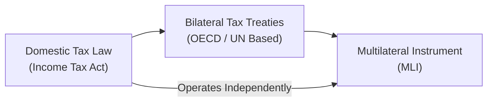

## 15.2 Sources of International Tax Law and How They Interrelate

Sometimes, when we talk about international taxation, our minds jump straight to thoughts of big multinational corporations or those news headlines about “tax havens”. The truth is, these rules can matter for almost any cross-border activity—like personally investing in a foreign ETF or renting out a vacation property overseas. Before diving into advanced strategies, it’s important to get a firm handle on the foundations. And that’s exactly what we’ll do here.

In this section, we’ll discuss the primary sources of international tax law and explore how they intersect. We’ll look at how domestic legislation, bilateral tax treaties, multilateral instruments, supranational agreements (even though Canada is not in the EU), and various international guidelines come together—or sometimes collide—to form the complex system we see today. We’ll also reflect on practical examples and share a couple of cautionary tales from personal experience (or misadventures!).

### Understanding Domestic Tax Laws

Domestic tax legislation is the root of all taxation in a given country. In Canada, that primarily means the [Canadian Income Tax Act (R.S.C., 1985, c. 1 (5th Supp.))](https://laws-lois.justice.gc.ca/eng/acts/I-3.3/). This Act:
  
• Specifies how individuals and corporations residing in Canada are taxed on their worldwide income.  
• Outlines how non-residents are taxed on Canadian-sourced income (e.g., income from property in Canada, employment in Canada, or business carried on in Canada).  
• Provides definitions, withholding tax rates, and special rules for certain types of transactions.  

Essentially, if you’re earning money in Canada or if you’re a Canadian resident earning money anywhere in the world, you start here—it’s the fundamental blueprint. If you imagine building a house, domestic legislation is the foundation slab on which everything else is constructed.

Now, you might say, “So, why do we care about anything outside of the Canadian Income Tax Act?” Well, that’s because conflicts often arise when two or more countries claim the right to tax the same income or when such claims are unclear. That’s where other elements of international tax law step in.

### Bilateral Tax Treaties: The Double-Taxation Peacemaker

Next, we have bilateral tax treaties. These are deals between two countries, hammered out so that a resident of Country A doesn’t end up paying tax to both Country A and Country B on the same chunk of income. For Canadians, much of our cross-border tax relief—and obligations—are found in these treaties. The Canadian government has negotiated a bunch of these (over 90 at last count). You can check out the [Department of Finance Canada – Tax Treaties Page](https://www.fin.gc.ca/treaties-conventions/treatystatus_-eng.asp) for a comprehensive list.

Bilateral tax treaties often follow templates provided by:
• The [OECD Model Tax Convention](https://www.oecd.org/tax/).  
• The [UN Model Double Taxation Convention](https://www.un.org/development/desa/financing/sites/www.un.org.development.desa.financing/files/2023-02/UN%20Model%202021.pdf).

The biggest differences between these two models are typically in how taxing rights are allocated between the “source country” (where income originates) and the “residence country” (where the income earner officially resides). The UN model tends to give more taxing rights to source countries, reflecting the interests of developing nations that want to ensure they collect some revenue from inbound investment.

When reading a tax treaty, chapters detail everything from definitions (e.g., what is a “resident” of a country) to how interest, dividends, and royalties should be taxed, along with some special articles on eliminating double taxation. In plain language, a tax treaty might say, “Hey Country B, if one of my Canadian residents invests in your bonds, you can only withhold a maximum of 10% tax on interest payments.” Meanwhile, the same treaty might allow Canada to grant a foreign tax credit for the 10% withheld in that other country.

Here’s a little story for you: One of my friends forgot to consult the Canada–U.S. Tax Treaty before investing in certain U.S. dividend funds. Let’s just say, they weren’t super thrilled with the surprise withholdings that popped up, and the tax filing that followed was even more of an adventure. That’s a prime example of why these bilateral treaties (and awareness of them) matter.

Below is a quick table highlighting some typical items addressed after a bilateral tax treaty is in force:

| Tax Treaty Element            | Common Provisions                               |
|-------------------------------|-------------------------------------------------|
| Withholding tax on dividends  | Typically reduced from 25% to 15% or 5%        |
| Withholding tax on interest   | Often reduced from 25% to 10% or 0%            |
| Withholding tax on royalties  | Usually capped, e.g. 10% or 15%                |
| Double-tax relief mechanism   | Foreign tax credits or exemptions              |
| Tie-breaker rules on residency| Clarify place of effective management or center of vital interests |

### Multilateral Instruments: Adding Another Dimension

Now, if domestic tax law is the house’s foundation, and bilateral treaties are the walls, then multilateral instruments (MLI) can be compared to an ambitious renovation plan that extends multiple houses along the same street—often all at once. Specifically, the [OECD’s Multilateral Convention to Implement Tax Treaty Related Measures to Prevent Base Erosion and Profit Shifting (MLI)](https://www.oecd.org/tax/treaties/beps-mli-signatories-and-parties.pdf) is a game-changer.

This instrument allows several countries that have bilateral tax treaties with each other to amend those treaties simultaneously—to address loopholes, provisions, and issues like treaty shopping or what we call “base erosion and profit shifting” (BEPS). Imagine having 80 or more bilateral treaties. Updating each agreement individually would be painfully slow. The MLI tries to fix that by letting countries sign on to a big, overarching framework that modifies whichever existing bilateral treaties they choose to “cover.”

But beware: It’s not as straightforward as you’d hope. Countries can sign on to the MLI but register “reservations” or choose how certain provisions apply, so the result might not always be uniform. It’s a bit like your local neighborhood collectively deciding on a set of building standards, but each homeowner can still pick different color trims and furniture. To truly grasp whether the MLI changes any given bilateral treaty, you have to read both the MLI’s text and the individual positions that each country declared when they signed the MLI—plus any new positions if they updated them later.

Here’s a short Mermaid diagram to help visualize how domestic law, bilateral treaties, and the MLI interact:

In this (overly simplified) flow:
• Domestic law stands at the core (Point A).  
• Bilateral treaties (Point B) can modify or override certain domestic tax rules.  
• The MLI (Point C) can further modify or clarify those existing treaties.  
• Sometimes, the MLI can introduce new rules that override domestic law, but usually it’s a “treaty modification” mechanism at its core.  

### Supranational Agreements and Directives

Canada is not part of the European Union, so EU directives (like the Parent-Subsidiary Directive or the Common Consolidated Corporate Tax Base proposals) don’t apply directly here. However, if you have a Canadian corporation with subsidiaries in Europe—or vice versa—these EU rules matter. They can indirectly shape the tax position of a Canadian entity earning income that flows through an EU country.

In simpler terms: If you’re a Canadian investor eyeing an opportunity in, say, Germany, you may consider how EU directives could influence your investment’s effective tax rate. Although these directives don’t override Canadian law, they can reshape how certain cross-border flows are taxed in the EU, possibly chaining into your final tax bill back in Canada.  

From a higher-level vantage point, these supranational directives reflect broader efforts to harmonize tax rules across member states in a particular region. Occasionally, other trade blocks (think USMCA for Canada, the U.S., and Mexico) may incorporate tax or tariff elements, though not as comprehensive as the EU’s internal regulatory structure.  

### International Guidelines and Organization-Level Frameworks

At times, you might come across references to “OECD Transfer Pricing Guidelines” or “OECD Pillar One and Pillar Two.” These are frameworks or guidelines designed by international bodies that don’t have the force of law in the same way domestic laws or treaties do. Instead, they are essentially “best-practices” or “recommendations.” Many countries then incorporate or mirror these guidelines in their statutes or treaty negotiations. Over time, these guidelines can become part of the generally accepted approach—a kind of global norm.

One big example is the OECD’s Transfer Pricing Guidelines, which establish how countries should figure out what the appropriate “arm’s-length price” is for cross-border transactions between related parties. When a Canadian business sells goods to its foreign subsidiary (or vice versa), these guidelines help ensure that neither side is shifting profits to a low-tax jurisdiction incorrectly. Canada’s domestic law references these principles, so it’s not just an academic exercise: your income tax returns might be reviewed to see if your intercompany transactions align with these standards.

Additionally, the UN has its own committees and guidelines, focusing more on issues affecting developing nations. The UN guidelines might diverge from the OECD’s stance, notably in how much taxing right is allocated to the source country.  

If you want to dig deep into these guidelines, the [OECD Tax Portal](https://www.oecd.org/tax/) and the UN’s website can be incredibly helpful. Sometimes, you’ll see that even though these guidelines aren’t direct “laws,” they become influential in court decisions, or they show up in how legislation is drafted in each country.  

Just a quick personal aside: I once tried to read through sections of the OECD Transfer Pricing Guidelines right after a big lunch—you know how you get that midday slump? Huge mistake. The guidelines can be quite dense, so be prepared and maybe keep coffee on standby if you plan to study them thoroughly!

### How It All Fits Together

Putting it into a single narrative:  
1. You look at domestic law first to see how your income is generally taxed in Canada.  
2. Then you check if there is a bilateral tax treaty that changes the default rules (e.g., helps reduce withholding tax).  
3. You confirm if this bilateral treaty has been modified by the MLI or other multilateral agreements.  
4. You also consider if any supranational directives might indirectly affect that arrangement, especially if you or the company you’re dealing with are based in regions that adopt such directives.  
5. Finally, you apply relevant international guidelines like the OECD Transfer Pricing Guidelines, which might shape the approach or interpretation of these laws in practice.  

And don’t forget: even when all these line up nicely, differences in interpretation can still happen, and you may need professional advice.  

Let’s illustrate with a quick example:  

• Suppose you’re a Canadian resident investing in a real estate project in Belgium.  
• Domestic law in Canada says you’re taxed on worldwide income.  
• The Canada-Belgium Tax Treaty might cap or reduce Belgium’s withholding tax on rental income or certain capital gains.  
• The MLI might modify the anti-abuse clauses in that treaty if both Canada and Belgium have chosen to adopt the relevant provisions.  
• Meanwhile, if the property is part of a corporation in Belgium, certain EU directives on cross-border payments could reduce local withholding taxes, though you’d have to check if you meet certain requirements (like minimal ownership percentages or specific forms of legal entity).  
• At the end of all that, you’d consult something like the OECD Transfer Pricing Guidelines only if you were dealing with an intercompany arrangement—maybe your Canadian corporation is providing management services to that Belgian entity.  

Whoa, that’s quite a multi-layered scenario, but it underlines how these sources tie into each other. Even for smaller-scale cross-border investments, you can see how one piece can drastically change your net after-tax return.

### Best Practices, Challenges, and Common Pitfalls

• Always read the relevant sections of a treaty carefully. If a country is not on Canada’s tax treaty list, that means no bilateral relief is automatically provided.  
• Remember your “particular reservation or positions” for countries that have signed onto the MLI. This can alter the treaty text.  
• Keep up-to-date with changes. A tax strategy that worked beautifully a few years ago may no longer work if treaty articles have shifted.  
• Watch out for timing mismatches, like when one country’s tax year or recognition rules differ from another’s.  
• Don’t forget about foreign tax credits. Even if withholding tax is reduced, you need to claim those amounts correctly on your Canadian return (or else you might lose out on that credit).  

### Incorporating Time Horizons and Risk Profiles

If we revisit Chapter 2 and Chapter 3 philosophies, you might recall that an investor’s risk profile and time horizon are key factors driving decisions about how and where to allocate assets. In an international tax context, these risk considerations include the risk of sudden shifts in tax treaties (not super common, but possible) and changes in domestic laws. For instance, a great cross-border structure you set up today might become less appealing if the foreign country modifies its domestic laws or if something major changes in the tax treaty.

Balancing your portfolio with an eye toward diversification can also mean diversifying your tax exposure. For instance, you might invest in multiple jurisdictions so you’re not overly reliant on the tax benefits of just one bilateral treaty. But there’s a flip side, of course—managing multiple cross-border positions can become quite administratively complex.

### Some Quick Thoughts on Regulatory Updates

Although not specific to the process of international tax law, it’s worth noting that Canada’s regulatory environment for investment dealers and mutual fund dealers changed in 2023. The Canadian Investment Regulatory Organization (CIRO) replaced the former entities (IIROC and MFDA) as our consolidated self-regulatory body. While CIRO doesn’t directly set the rules for cross-border tax treaties, changes at the regulatory level can affect how professionals engage with clients and provide advice. Always ensure that the advisor you’re working with is informed about the current guidelines and is properly registered under CIRO’s framework.  

### Conclusion

International tax law is a fascinating—and occasionally frustrating—mesh of domestic rules, treaties, and guidelines. Learning how to navigate these sources or at least knowing where to look can save you a lot of headache (and money). Whether you’re a small investor exploring global opportunities or a large multinational, the interplay between domestic legislation, bilateral treaties, and broader multilateral instruments can drastically alter your after-tax returns. 

It may feel a bit like a puzzle at times, but if you approach it methodically, you’ll find that each piece—once in place—offers clarity and structure. Keep learning, stay curious, and if you find yourself tangled up in a cross-border tax conundrum, remember to consult up-to-date resources and seek professional guidance. Tax is complicated enough without trying to do everything on your own after one cup of coffee (believe me, I’ve tried!).

## Additional Resources

• [Canadian Income Tax Act (R.S.C., 1985, c. 1 (5th Supp.))](https://laws-lois.justice.gc.ca/eng/acts/I-3.3/)  
• [Department of Finance Canada – Tax Treaties Page](https://www.fin.gc.ca/treaties-conventions/treatystatus_-eng.asp)  
• [OECD Tax Portal](https://www.oecd.org/tax/)  
• [UN Model Double Taxation Convention](https://www.un.org/development/desa/financing/sites/www.un.org.development.desa.financing/files/2023-02/UN%20Model%202021.pdf)  
• “The Taxation of Business Profits Under Tax Treaties” by Klaus Vogel  

---

## Test Your Knowledge: Sources of International Tax Law and How They Interrelate



### Which of the following best describes the most basic source of tax rules for Canadian residents?

- [x] The Canadian Income Tax Act
- [ ] Bilateral tax treaties
- [ ] The OECD Guidelines
- [ ] Multilateral instruments
> **Explanation:** Domestic laws, like the Canadian Income Tax Act, are the primary, foundational source of taxation for residents and for non-residents on Canadian-sourced income.

### Which statement about bilateral tax treaties is correct?

- [x] They are agreements between two countries to prevent double taxation and allocate taxing rights.
- [ ] They impose the same tax rates in both countries.
- [ ] They are only designed for corporate taxpayers.
- [ ] They replace domestic law entirely.
> **Explanation:** Bilateral tax treaties typically govern how two countries handle cross-border income and avoid double taxation, clarifying who taxes what portion of income, but they do not fully replace domestic laws.

### According to the discussion, how does the MLI primarily work?

- [ ] It replaces all domestic tax laws in signatory countries.
- [x] It simultaneously modifies multiple bilateral tax treaties among participating countries.
- [ ] It standardizes tax rates globally.
- [ ] It only applies to treaties between developed and developing nations.
> **Explanation:** The Multilateral Convention (MLI) is meant to update or modify certain articles in multiple bilateral treaties, aligning with the BEPS project outcomes without forcing each treaty to undergo separate renegotiations.

### In the context of international tax, when do you check for treaty articles?

- [x] After confirming domestic tax rules but before finalizing any cross-border transaction.
- [ ] Only after the transaction is completed.
- [ ] Whenever a domestic law contradicts an OECD guideline.
- [ ] Only for transactions above a certain monetary threshold.
> **Explanation:** Good practice is to review domestic tax legislation first, then check applicable bilateral treaties (and multilateral modifications) before proceeding with any cross-border arrangement.

### Which model tax convention tends to grant more taxing rights to the source country?

- [ ] The OECD Model Tax Convention
- [x] The UN Model Tax Convention
- [ ] The IMF Model
- [ ] The WTO Agreement
> **Explanation:** The UN Model Tax Convention generally affords more taxing rights to the source (often developing) country, compared to the OECD model.

### What is the main function of the OECD Transfer Pricing Guidelines?

- [x] They help set principles for determining arm’s-length prices in cross-border transactions between related parties.
- [ ] They impose uniform tax rates for all OECD countries.
- [ ] They entirely override bilateral tax treaties once implemented.
- [ ] They only apply to digital transactions.
> **Explanation:** The Guidelines instruct how to align intercompany prices with “arm’s-length” standards, reducing profit shifting and potential disputes among jurisdictions.

### If an MLI modifies withholding tax provisions in a bilateral tax treaty, how would you confirm the new rate?

- [x] Check both the original treaty text and the country-specific MLI positions and reservations.
- [ ] Look only at the domestic law of the source country.
- [ ] Rely exclusively on older treaty articles with no updates.
- [ ] Assume the default withholding rate is always 0%.
> **Explanation:** Because the MLI allows for country-specific reservations and selective adoption of articles, you must verify both the original treaty and the MLI positions filed by each country involved.

### Which statement about supranational directives is accurate in the Canadian context?

- [x] EU directives don’t directly apply to Canada, but they can indirectly affect Canadian investors with European subsidiaries.
- [ ] EU directives override Canadian domestic laws on all cross-border transactions.
- [ ] Only the European Commission can enforce tax changes in Canada.
- [ ] They apply equally to all countries outside the EU.
> **Explanation:** While Canada doesn’t have to follow EU directives, a Canadian-owned entity operating in the EU might be indirectly affected if local rules in an EU country are shaped by these directives.

### Which of the following is NOT an example of a primary tool for avoiding double taxation?

- [ ] Domestic rules providing foreign tax credits.
- [ ] Bilateral tax treaties.
- [x] Customs tariffs.
- [ ] Provisions within multilateral instruments.
> **Explanation:** Customs tariffs relate to cross-border trade of goods, not taxation of income. Thus, they are not part of the direct framework for avoiding double taxation.

### True or False: The OECD Transfer Pricing Guidelines are legally binding in all jurisdictions that follow them.

- [x] True
- [ ] False
> **Explanation:** While the Guidelines are highly influential and often incorporated into domestic laws or used as interpretive tools, they are not automatically binding global law. Their status comes from governments choosing to adopt them in their legislation or administrative practices.


