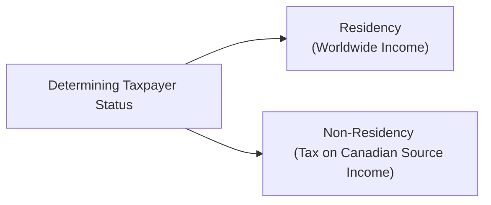
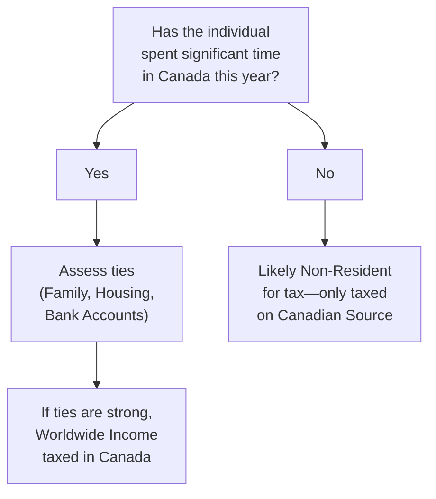

## 15.3 Jurisdiction to Tax

Imagine for a moment that you’re chatting with a friend who’s about to move abroad, or maybe they’ve got a house in Canada but work for a company in the United States. The first question that might pop up is: who has the right to tax them? Canada? The U.S.? Possibly both, or maybe neither. These questions can sometimes become unbelievably complicated, and that’s precisely where the concept of “jurisdiction to tax” comes in.

Jurisdiction to tax is, at its core, a country’s legal authority to impose taxes on individuals, corporations, and even transactions. Typically, this authority hinges on two main principles:

• Residence-Based Taxation  
• Source-Based Taxation  

Understanding how these principles work—and how they might conflict with each other—can make a huge difference in managing a client’s finances efficiently, especially in cross-border scenarios. In Canada, the Canada Revenue Agency (CRA) enforces tax rules based primarily on residency, but there’s also a source-based element that taxes certain incomes of non-residents when that income arises from Canadian sources. Let’s explore how this works.

---

### Why Jurisdiction to Tax Matters

Have you ever met someone who ended up paying taxes in two places at once because they didn’t quite get the rules right? Double taxation is a real risk. Or, on the other hand, some folks forget to pay taxes in a country where they do owe, possibly racking up penalties they never saw coming.

From an Investment Management Techniques perspective, advisors need to be crystal clear about these jurisdictional issues. If you’re helping a client who has businesses or investments in multiple countries, missteps in understanding which country can tax what income could lead to hefty tax bills—or even bigger headaches down the road. It’s not just about paying taxes: it’s about paying the right taxes to the right jurisdiction under the right rules.

---

### Residence-Based Taxation: The Main Pillar

Residence-based taxation means a country taxes an individual or corporation on worldwide income because that individual or corporation is considered a “resident” of that country. If you’re a Canadian tax resident, guess what: you pay Canadian tax on your global income. That includes investment income from a mutual fund in Europe or a business in the U.S. This is a key reason why determining residency is so crucial.

#### Individual Residence

For individuals, residency can be surprisingly nuanced. Let’s say you normally live in Calgary, but for nine months of the year, you’re working in Dubai. Are you still a Canadian resident for tax purposes? Well, it depends on factors like the extent of your ties to Canada (your home, your spouse and kids, your personal bank accounts, or whether you still own a car here). The CRA offers guidance in publications such as [CRA Guidance on Residency Status](https://www.canada.ca/en/revenue-agency/services/forms-publications/publications/it2213/archived-itus2213-determination-individuals-residence-status.html). These criteria can sometimes feel a bit subjective, so many clients end up seeking expert advice.

Personal anecdote: I had a friend who moved to Asia for work, but she left her spouse in Toronto, kept her condo there, and frequently popped back for visits. The CRA ultimately decided she remained a tax resident because her significant family ties were all here in Canada. She was pretty surprised—she thought that simply living overseas would free her from Canadian taxes, but that’s not how it works.

#### Corporate Residence

For corporations, Canada generally looks at where the “central management and control” of the corporation is exercised. This concept has its roots in a famous old legal case, De Beers Consolidated Mines Ltd. v Howe (1906), which stated that residency is essentially determined by where a company’s key decisions are made. The CRA provides some additional guidance at [CRA Guidance for Corporations](https://www.canada.ca/en/revenue-agency/services/tax/businesses/topics/corporations/residence-corporations.html).

So, if the board of directors for a U.S.-incorporated company meets exclusively in Toronto to make strategic decisions, that U.S. company might still be treated as a Canadian resident for tax purposes. In practice, many multinational businesses maintain separate boards or carefully plan meeting locations to avoid unintentionally becoming resident in a second jurisdiction.

---

### Source-Based Taxation: The Other Main Pillar

While residence-based taxation is the big one in Canada, source-based taxation can also come into play, particularly if you’re not a resident. Let’s say you’re a non-resident investor from Germany who holds real estate in Vancouver that generates rental income. Even though you’re not a Canadian resident, Canada will likely tax you on the Canadian-source income from that property. Source-based taxation ensures the country where the income is generated gets a piece of the pie.

#### When Conflicts Arise

Sometimes, a taxpayer might be considered a resident by more than one country, especially if they—like my friend—spend significant time in both places and have strong personal or economic ties to both. That’s called dual residency. Meanwhile, the same income might be said to have multiple “sources” by multiple jurisdictions. Each jurisdiction could claim a right to tax that income. This is where double taxation treaties or “tax treaties” step in to resolve conflicts by distributing taxing rights, preventing the same income from being taxed twice (or more!) in multiple countries.

---

### Unpacking Residency Tests

Residency rules can look somewhat arcane, but they’re meant to reflect the idea of who’s really anchored to a particular country. Here are the usual building blocks:

• Physical Presence: You might think it’s a simple question of how many days you spend each year in a specific country. In the U.S., for instance, the “Substantial Presence Test” is fairly formulaic. In Canada, it’s more about significant ties, although spending 183 days or more in Canada a year is often a bright-line factor.  
• Significant Ties: Having a home, spouse, children, or local financial accounts in the country can be an indicator that you remain a resident even when you’re not physically present.  
• Deemed Residency Rules: Some jurisdictions have default or “deemed” rules to capture certain individuals—like government employees posted abroad or folks who maintain certain ties after traveling.  

For corporations, the central management and control test is key. Sometimes we talk about “mind and management,” meaning we look at where the top strategic decisions are truly made. This is not always straightforward; the issue sometimes goes beyond official addresses on corporate paperwork.

---

### Flowchart: Residence-Based vs. Source-Based Taxation

To visualize the interplay between residence-based and source-based taxation, let’s look at a simple diagram. Think of it as a snapshot illustrating how an individual’s residency might point them toward paying tax on worldwide income, while a non-resident paying tax in Canada would be taxed only on Canadian-sourced income:

In the flowchart above, if you determine that a taxpayer is considered a resident of Canada, they’re going to be taxed on anything they earn anywhere in the world. If it turns out they’re not a resident, they may only be taxed on specifically defined Canadian-sourced income (such as employment income for work physically performed in Canada, rental income from property located in Canada, or certain capital gains related to Canadian real estate).

---

### Cross-Border Scenarios: Case Studies

Let’s walk through a couple of scenarios that illustrate these principles in action.

#### Scenario One: The Tech Consultant

Sarah is a Canadian citizen who’s providing software consulting services to a U.S. tech firm. She physically performs most of her work in the U.S., even though she lives in Ottawa. The company deposits her pay into her Canadian bank account. Because Sarah is still a Canadian resident (her family and home are in Ottawa, and she’s only traveling for work), Canada will tax her on her worldwide income. In the U.S., she may also be subject to certain U.S. taxes for the days she physically works there. The Canada-U.S. Tax Treaty likely provides relief from double taxation, but she needs to file returns in both countries and then claim credits or treaty exemptions.  

#### Scenario Two: The Corporate Head Office Switch

A corporation was originally formed under the laws of the Cayman Islands, but the key CEO, CFO, and the board of directors meet exclusively in Toronto. Although the corporation is not technically incorporated in Canada, the “central management and control” location might lead the CRA to consider it a resident corporation of Canada. That means it’s subject to Canadian corporate tax on its worldwide income. It’s not unusual for multinational enterprises to carefully structure where board meetings are held to manage tax residency outcomes.

---

### Potential Conflicts and Resolutions

• Dual Residency: You can be deemed a resident in more than one country. In such situations, a tax treaty might “tie-break” which country gets to treat you as a resident. These tie-breaker rules often consider the location of a permanent home, the center of vital interests (like family and social connections), your habitual abode, and, ultimately, your citizenship if earlier tests don’t break the tie.  

• Multiple Sourcing: What if both Country A and Country B claim that the same piece of business income was generated within their respective borders? This is more common with digital or service-based businesses. Tax treaties address these intricacies too, often by allocating taxing rights to the country of effective management or the country where the service is performed.  

• Relief for Double Taxation: When a tax treaty fails to fully eliminate issues—or there’s no treaty in place—advisors may consider foreign tax credits, exemptions, or tax planning strategies that respect the rules of both jurisdictions.

---

### Planning Considerations for Investment Advisors

If you’re an investment advisor, you need to stay on top of these jurisdictional rules for several reasons:

• Compliance: Not only do you want to keep your clients on the right side of the law, but you also want to ensure they don’t overpay or underpay taxes.  
• Optimal Asset Location: You might recall in Chapter 3 that “asset location” deals with strategically placing investments in vehicles and jurisdictions that maximize after-tax returns. Understanding the interplay of residence vs. source-based taxation is essential for that.  
• Cost-Efficient Investments: As explained in Chapter 17 on impediments to wealth accumulation, taxes can significantly eat away at returns. Advisors can help mitigate that through careful cross-border tax planning.  

Personally, I’ve seen numerous clients initially focus on what’s hot in the market (e.g., snapping up foreign real estate or overseas securities) without first checking if they’re going to face nasty tax surprises in multiple jurisdictions. Getting clarity beforehand saves a lot of pain!

---

### The Importance of Regulatory Awareness

Much like other aspects of Canadian financial regulation, such as those supervised by CIRO (the Canadian Investment Regulatory Organization, which took over the roles of the historical MFDA and IIROC), tax compliance is monitored by the CRA. Advisors who guide clients in cross-border ventures should be equipped to provide accurate tax knowledge or else direct them to specialized tax professionals.

Advisors also need to maintain awareness of any changes in rules or guidelines from authorities like the CRA. The new SRO environment under CIRO, effective since 2023, mainly impacts dealer and advisor registration, investor protection, and compliance oversight, but it’s wise to keep an eye on how regulatory developments might affect cross-border investment issues (e.g., new protective measures or international information-sharing agreements).

---

### Challenges and Common Pitfalls

1. Misinterpreting Residency: Many folks think “I’m out of Canada for six months, so I’m not a resident!” But the CRA’s residency tests are more nuanced. Missing that detail can lead to unfiled returns, penalties, or hefty interest charges.  
2. Underestimating Ties: Even small personal or economic ties to Canada can lead to residency classification. For example, maintaining a condo, a driver’s license, or a spouse in Canada may be enough to keep you within the Canadian tax net.  
3. Overlooking Source Rules: Non-residents often don’t realize that rental income or certain types of capital gains from Canadian properties are still subject to Canadian tax. A failure to properly withhold or remit taxes can result in big liabilities.  
4. Ignoring Foreign Taxes or Credits: In cross-border matters, credit or deduction for foreign tax paid can help reduce the total burden. Not applying these credits properly is a common oversight.  

---

### Best Practices for Advisors and Clients

• Gather All Relevant Information: Always start by clarifying your client’s domicile, personal ties, corporate structures, and the location where the actual income-generating activities happen.  
• Leverage Tax Treaties: When a client is dealing with two countries, check if there’s a tax treaty. The treaty might reduce or eliminate double taxation.  
• Seek Specialized Advice: In complex situations—like when determining corporate residency or dealing with large cross-border M&A deals—consult a specialized tax lawyer or CPA who focuses on international tax.  
• Keep Abreast of Regulatory Updates: Bookmark the CRA’s updates, CIRO bulletins, and the websites for relevant global institutions if you have clients operating across multiple jurisdictions.  
• Communicate Proactively: Let your clients know early in the relationship about the significance of disclosing all cross-border ties. Surprises (especially tax ones) can be minimized with upfront dialogue.

---

### Additional Visual Overview

Consider the following diagram illustrating a simplified decision tree for an individual with potential ties to Canada but also with foreign income:

This simple flow emphasizes how an advisor or individual might approach an initial residency determination. Real life is, of course, more complicated, but you can see the general approach: first look at physical presence, then examine ties, then confirm the final classification.

---

### References for Further Exploration

1. [CRA Guidance on Residency Status](https://www.canada.ca/en/revenue-agency/services/forms-publications/publications/it2213/archived-itus2213-determination-individuals-residence-status.html).  
2. [CRA Guidance for Corporations](https://www.canada.ca/en/revenue-agency/services/tax/businesses/topics/corporations/residence-corporations.html).  
3. “Central Management and Control” – De Beers Consolidated Mines Ltd. v Howe (1906).  
4. Organization for Economic Co-operation and Development (OECD) Model Tax Convention on Income and on Capital.  
5. CPA Canada’s online modules on “International Taxation and Residence Principles.”  
6. CIRO updates on cross-jurisdictional securities transactions and compliance (https://www.ciro.ca).

---

### Final Thoughts

Jurisdiction to tax may not exactly be cocktail-party conversation, but when you or your clients are dealing with cross-border investments, it becomes super important. The interplay between residence-based and source-based systems can feel like a labyrinth, and the stakes are high—nobody wants to pay unnecessary taxes or end up in trouble for overlooking tax obligations abroad.

The good news is that with careful planning, reliance on credible resources like the CRA and specialized professionals, and a sturdy understanding of residence and source rules, you can help your clients stay compliant while preserving their wealth. Whether you’re aiming to optimize asset location, harness foreign tax credits, or avoid double taxation through treaties, your knowledge in this area can genuinely make all the difference.

Remember: keep asking questions, track your clients’ moves, and always, always consult the right authorities and experts when in doubt. After all, taxes can be complicated, but they don’t have to be a complete mystery.

---

## Test Your Knowledge: Jurisdiction to Tax and Cross-Border Taxation



### Which principle allows a country to tax an individual on their worldwide income if that person is considered a resident?

- [x] Residence-based taxation
- [ ] Source-based taxation
- [ ] Tariff-based taxation
- [ ] Consumption-based taxation

> **Explanation:** Residence-based taxation means that once you’re considered a resident, you typically owe taxes on all of your personal income worldwide.

### In Canada, what test is most relevant to determining corporate residency for tax purposes?

- [x] Central management and control
- [ ] Incorporation location
- [ ] Director citizenship
- [ ] Shareholder composition

> **Explanation:** Canada looks at where the central management and control of the corporation is exercised to determine tax residency, rooted in legal precedents like De Beers Consolidated Mines Ltd. v Howe.

### Which factor often contributes significantly to an individual being deemed a Canadian resident for tax purposes?

- [x] Significant ties, such as a spouse or permanent home in Canada
- [ ] Holding only a Canadian passport
- [ ] Making investments in Canadian stocks
- [ ] Doing all business activities online

> **Explanation:** The CRA looks at personal and economic ties, including family and housing. A Canadian passport alone isn’t necessarily conclusive of residency.

### What can happen if both Country A and Country B claim a taxpayer as a resident?

- [x] Potential for dual residency and double taxation
- [ ] Automatic exemption from taxes in both countries
- [ ] No taxation obligation anywhere
- [ ] The taxpayer must pay only consumption-based tax

> **Explanation:** Dual residency can create double taxation issues, which tax treaties and foreign tax credits aim to resolve.

### Which type of income might a non-resident of Canada still be taxed on?

- [x] Income defined as Canadian-source, such as rental income from a Canadian property
- [ ] Any source of income worldwide
- [x] Gain from the sale of Canadian real estate
- [ ] Capital gains from foreign stock markets

> **Explanation:** Canada typically taxes non-residents only on Canadian-source income, like real estate rental income or certain gains on Canadian property. Gains from foreign assets are generally excluded unless special rules apply.

### What is one common pitfall when individuals assume they are non-residents?

- [x] Believing that leaving Canada for over six months automatically severs tax residency
- [ ] Filing for a formal tax departure with the CRA
- [ ] Cancelling a Canadian driver’s license
- [ ] Using a foreign credit card

> **Explanation:** A big mistake is assuming that simply being out of Canada physically for half the year alone ends Canadian tax residency. You must look at all “significant ties.”

### Which of the following is a method used to address double taxation when two countries tax the same income?

- [x] Tax treaty tie-breaker rules
- [ ] Submitting a private relief request to CIRO
- [x] Claiming foreign tax credits
- [ ] Denying residency in both countries

> **Explanation:** Tax treaties and foreign tax credits are the main tools to reduce or eliminate double taxation. CIRO, Canada’s current national self-regulatory body, ensures regulatory compliance but is not directly involved in awarding relief from double taxation.

### In cross-border scenarios, which approach is often used for corporate tax planning to avoid unintended residency?

- [x] Carefully planning where the board of directors convenes
- [ ] Moving employees without prior notice
- [ ] Closing all foreign branches
- [ ] Restructuring only after a tax audit occurs

> **Explanation:** Corporations often schedule board meetings and corporate decision-making outside Canada to avoid being seen as having central management and control in Canada.

### Why might a Canadian resident working abroad still file a Canadian tax return?

- [x] They remain subject to Canadian tax on their worldwide income
- [ ] They want to avoid fulfilling local tax obligations
- [ ] It’s optional for all non-residents
- [ ] They only owe GST/HST in Canada but no other taxes

> **Explanation:** Because Canada imposes tax on worldwide income for residents, even if those residents are working abroad, they typically continue filing a Canadian tax return.

### True or False? A taxpayer can permanently eliminate Canadian tax liability simply by acquiring property in another country and spending over half the year there.

- [x] True
- [ ] False

> **Explanation:** Actually, this is a bit of a trick. Many people think it’s automatically true, but it really depends on which ties remain back in Canada. If the question is strictly about overstating the ease of severing Canadian tax residency, many discover that ties to Canada are critical in determining status, not just time abroad. However, if they clearly sever all ties (no spouse, no property, etc.), it can be possible. So while the statement might be “true” in an overly simplified sense, real-world situations are often more complex, meaning your personal details could flip this answer.  


