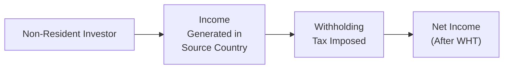
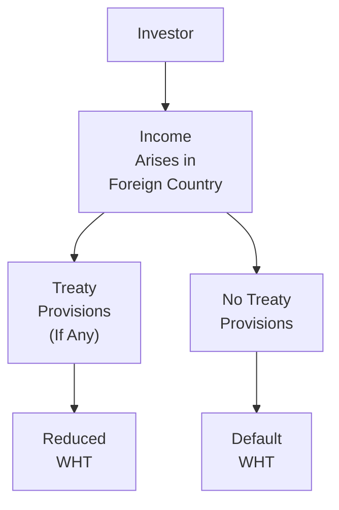

## 15.4 Source Country Taxation

Picture this: you visit a foreign country—maybe you’re there on a business trip, or perhaps you inherited a small condo from an uncle and decided to rent it out. Suddenly, you notice that the local government is taking a chunk of the income you earned. That chunk is what we typically call “source country taxation.” Many folks find these rules pretty confusing at first, and, honestly, I had my fair share of head-scratches when I stumbled across this concept years ago. But once we break it down, you’ll see that source country taxation is just a logical system that ensures countries get a share of income generated within their borders.

Drawing on practices from the Canada Revenue Agency (CRA), the Organisation for Economic Co-operation and Development (OECD), and tax regulations around the globe, this section explores how different jurisdictions impose source-based taxes on non-residents. We’ll also look at practical ways to handle these taxes to avoid eating into your hard-earned returns. After all, the better you understand these rules, the more prepared you’ll be to structure your cross-border investments productively.

---

## What Is Source Country Taxation?

Under source-based taxation, a country exercises its right to tax any income that arises (or is deemed to arise) within its borders. The logic is straightforward: if you’re receiving any economic benefit from a particular jurisdiction—like rent on a condo, dividends from a local company, or wages from a short-term employment contract—then the government in that jurisdiction wants a share.

Common examples of income subject to source-based taxation include:  
• Employment or business income earned while physically working in the source country.  
• Investment income (e.g., dividends, interest, royalties) paid by entities located in the source country.  
• Capital gains from the sale of property (including real estate) or other assets situated in the source country.  

### Understanding the Source Rules

At the heart of source country taxation are “source rules,” which outline what types of activities or assets tie the income to that jurisdiction. It’s these rules that help us figure out whether your investment dividends in, say, a Canadian mining company, or your wages from a short-term contract in Brazil, are going to be taxed by that country.

Sometimes, the lines can get a little fuzzy. For instance, let’s say you’re a consultant who performs all your work remotely for a British Columbia-based business while living in Toronto. You might think, “Well, I’m definitely in Canada!” Indeed, but if you’re actually crossing borders (physically or digitally) and receiving economic benefits from different provinces or countries, the “source” of your income might be subject to different interpretations, especially if it spans multiple jurisdictions. That is one reason why reading official policies (e.g., from the CRA, or OECD Commentaries on source rules) can be so helpful.

---

## Why Source Country Taxation Matters

Whether you invest in international equity markets (like we discuss in Chapter 14: International Investing) or simply earn interest from a foreign bank account, source country taxation can significantly reduce your net returns. Whether you’re brand-new to cross-border investing or you’ve dabbled in it for decades, you’ll want to pay attention to the details of how your income is taxed at the source.

Below is a simplified Mermaid diagram showing a typical flow of source country taxation for a non-resident investor:

The investor (A) generates income in the source country (B). The local authority requires a withholding tax (C), and the investor ends up with net income after withholding (D).

### Withholding Taxes

If you’ve ever received a foreign dividend payment and saw a smaller amount hit your account than you expected, that’s, well, probably withholding tax. Under source country taxation, governments often require payers (like local companies or financial institutions) to withhold a fixed percentage of your interest, dividends, or royalties. Once withheld, these amounts are remitted directly to the local tax authority on your behalf.

For instance, Canada regularly applies withholding taxes on interest, dividends, or royalty payments to non-residents. If you’re a non-resident who invests in Canadian stocks and you receive dividends from those stocks, the Canadian payer typically withholds a certain percentage of that payout. Many countries do something similar in different ways—some might call it “non-resident tax,” others might call it “withholding tax,” but the underlying concept remains the same.

### Double Taxation and Tax Treaties

One of the biggest nightmares for cross-border investors is the potential for double taxation: imagine you pay taxes in the source country, only to be taxed again in your home country. Yikes! That’s where tax treaties come into play.

Under a bilateral tax treaty, two countries come together to set up rules that determine how (and how much) each country can tax a particular type of income. These treaties are huge because they often slash withholding rates for interest, dividends, and royalties below the “default” domestic rate. For example, if a treaty says, “non-resident dividend withholding tax shall not exceed 15%,” and the domestic rate in that country is 25%, you only have to pay 15%—provided you fill out the correct forms and remain eligible under that treaty.

### Realistic Example

Let’s say you’re a resident of Country X investing in a large infrastructure project in Canada. If no treaty existed, you might face a 25% withholding tax on your returns. However, with a bilateral treaty in place, that rate can go down to, say, 10% or 15%. Naturally, that saving can be a big deal—especially if you’re investing a significant amount.

It’s also important to cement your eligibility for treaty benefits. Every country has procedures (and forms—lots of forms!) to claim the reduced rate. To see the official list of Canada’s withholding tax rates for different countries and different types of income, you might have a look at the [CRA Withholding Tax Rates](https://www.canada.ca/en/revenue-agency/services/forms-publications/publications/ic76-12r6.html). For a broader, global perspective, the [OECD Commentary on Source Rules](https://www.oecd.org/tax/treaties/) is an incredible resource.

---

## Key Sources of Income Subject to Source Country Taxation

The categories of income that often get caught by source country taxation can be broken down into three major headings:  
1. Employment or Business Income  
2. Investment Income (Dividends, Interest, Royalties)  
3. Capital Gains on Real Property  

### 1. Employment or Business Income

If you physically perform work in another country, that income might be taxed by that country. Even short-term gigs or consulting contracts can trigger potential source-based taxation. Now, for many cross-border employees, the potential headache can be reduced through tax treaty provisions or a foreign tax credit in their home country, but the process can still be complicated.

### 2. Investment Income (Dividends, Interest, Royalties)

Foreign-source investment income typically faces withholding tax. For example:  
• Dividends paid by companies located in the source country.  
• Interest paid by local banks to foreigners.  
• Royalties for the use of intellectual property in the local jurisdiction.  

Depending on your tax residency, foreign tax authorities may automatically assume a default withholding rate if you don’t properly fill out their forms. This can be more than you’d theoretically owe under a treaty. So, it’s always wise to check the official forms (like the Canadian NR301, for example, for non-resident tax treaty relief). 

### 3. Capital Gains on Real Property

Real property (like real estate) is typically considered situated in the jurisdiction where it physically exists. If you’re a non-resident selling property in a particular country, be prepared for that government to potentially impose capital gains tax on your sale. Canada, for instance, has CRA requirements for non-resident sellers of Canadian real estate. If you fail to comply, the government can impose withholding or even hold up the sale until the proper processes are followed.  

It’s worth noting that some treaties and local laws also consider ownership in certain resource properties (oil, gas, or mining) or even certain shares that derive their value from real property as having a source in that jurisdiction. Keep an eye on these provisions because they can heavily impact your cross-border investment structures.

---

## How Withholding Taxes Are Applied

Let’s expand a little on the practical side of withholding taxes.

### The Mechanism

• Payer’s Responsibility: Say a Canadian company pays dividends to a U.S. shareholder. The Canadian company is mandated by law to withhold a fixed percentage before distributing the remaining net amount to the shareholder.  
• Remittance: The withheld portion is then remitted to the Canadian government by the company.  
• Documentation: The company issues a slip (such as the NR4 in Canada) to the shareholder indicating gross income and the amount withheld. The shareholder then uses this documentation to claim (where relevant) a foreign tax credit or tax treaty benefits back home.

### Treaty Relief

Under tax treaties, the rate of withholding can be reduced, often anywhere from 25% down to 15%, 10%, 5%, or even 0%, depending on various conditions (e.g., ownership thresholds, type of income, or the nature of the recipient, such as a pension fund or government entity).

Below is an illustrative example in a table format:

| Type of Income | Default Canadian WHT | Potential Treaty Rate (Example Only) |
|---------------:|----------------------:|--------------------------------------:|
| Dividends      | 25%                  | 15%                                   |
| Interest       | 25%                  | 10%                                   |
| Royalties      | 25%                  | 10% or 0% (certain types)             |  
| Capital Gains (Real Property) | Varies | May apply tax-specific provisions     |

(Numbers and rates are for discussion purposes; always check the official CRA website and relevant treaty documents for the real deal.)

---

## Strategic Considerations for Investors

### Optimize the Holding Structure

If you’re heavily involved in cross-border investing, you may have heard about international holding companies or specialized fund structures. By using a properly constructed holding entity in a country that has favorable tax treaties, you might reduce source-based withholding without creating a new mess of tax obligations in your home jurisdiction. Naturally, this gets complicated fast, so consult professional tax advisors or recognized references like Wolters Kluwer’s TaxWorks.

### Make the Most of Tax Treaties and Credits

Many times, even if you do end up paying withholding tax to a foreign country, you can often claim a foreign tax credit in your home country, effectively eliminating double taxation (though not always perfectly). Familiarize yourself with how your local tax laws allow you to offset or claim relief for taxes paid abroad. In a best-case scenario, you might end up neutral—meaning you don’t owe more than if you’d just earned the income at home. But that depends on timely and accurate paperwork, so watch those deadlines.

### Stay Current on Regulations

Tax rules change faster than we’d like to admit. A few years ago, you might have read something about the Investment Industry Regulatory Organization of Canada (IIROC) when dealing with certain registration details, but from 2023 onward, we now have the Canadian Investment Regulatory Organization (CIRO) overseeing investment dealers and mutual fund dealers. If you’re looking at older references to MFDA or IIROC, remember that these are now defunct SROs—CIRO is the go-to for current rules and compliance updates, especially for investment management within Canada.

Similarly, changes to tax treaties, new protocols, or even new unilateral measures can alter how source country taxation gets applied. Don’t be caught by surprise—check reputable sources like the [CRA Withholding Tax Rates](https://www.canada.ca/en/revenue-agency/services/forms-publications/publications/ic76-12r6.html) page, or the [OECD Commentary on Source Rules](https://www.oecd.org/tax/treaties/) if you’re going global.

---

## Working Through a Brief Case Study

Let’s put this into a simplified real-life context—maybe you can relate to a story like this!

“I used to chat with a friend, Sophie, who had a small business in the U.S. but was living in Canada. She had set up some IP licensing agreements with U.S. companies for a health tech product she’d developed. Every quarter, Sophie would get a tidy sum in royalties. However, each time, she noticed around 30% of the payment was withheld. Initially, she thought the U.S. business was shorting her. It turns out, that was the standard withholding tax that the U.S. imposes on payments to non-resident recipients.

Sophie discovered that the Canada-U.S. Tax Treaty allows for a reduced withholding rate on certain royalties—sometimes down to 10% or even 0% (depending on the nature of the intellectual property). She filed a few forms, including the beneficial owner statement and the certificate of residency from Canada’s tax authorities, and, voilà, her withholding dropped substantially to 10%. She then took this official documentation to claim a foreign tax credit in Canada. So effectively, she minimized her double tax exposure and got a better net return on her royalties.”

Moral of Sophie’s story? Know your treaties. And if you’re not sure, ask. Because in the end, it’s those small steps—like filing the right form or establishing the right holding structure—that can lead to huge tax savings.

---

## Potential Pitfalls

### Inadequate Treaty Documentation

You can’t just assume the lower treaty withholding rate is automatic. If you forget to provide the required documents (like a certificate of residency) or fill in the relevant tax forms in time, you might get hit with the default domestic withholding rate, which is usually higher.

### Overlooking Capital Gains Provisions

Many foreign investors, especially those dabbling in real estate or resource properties, forget to check whether existent treaties modify capital gains taxation rights. Canada, for example, has specific provisions on properties that derive their value from real estate (like shares of a real estate company). It’s easy to miss and often leads to unwelcome surprises when you try to sell.

### Tax Residency Complications

Maybe you’re a remote worker who invests and also splits your time between multiple countries. The question “Where are you resident for tax purposes?” can be tricky, especially if you meet the criteria for dual residency. If you land in that bucket, make sure you carefully check the tie-breaker rules in any relevant tax treaties.

---

## Best Practices

• Know Your Source: Always determine where your income arises. Look into local laws and definitions.  
• Use Clear Recordkeeping: Keep your statements, invoices, residency certificates, and relevant forms in a well-organized folder or digital repository.  
• Leverage Tax Professionals: If you have substantial cross-border activities, a tax accountant or international tax lawyer can often save you far more than the fee they charge.  
• Stay Informed: Tax laws can change, treaties get renegotiated, and new guidelines show up. If you want to keep your cross-border strategy sharp, keep reading official updates and possibly subscribe to professional tax publications like Wolters Kluwer’s TaxWorks.  

---

## Additional Resources

• [CRA Withholding Tax Rates](https://www.canada.ca/en/revenue-agency/services/forms-publications/publications/ic76-12r6.html): For accurate and updated info on withholding taxes in Canada.  
• [OECD Commentary on Source Rules](https://www.oecd.org/tax/treaties/): Helps you understand how international tax treaties interpret and define certain source rules.  
• “Essentials of Canadian Income Tax Law” by Nancy Caldwell et al.: A user-friendly book that lays out the basics of Canadian tax law.  
• Wolters Kluwer’s TaxWorks: A professional tax publication series that offers deep dives into inbound and outbound investment structures.  

If you want to see how these concepts interact with broader portfolio management practices, check Chapters 16 and 17 of this textbook, where we discuss managing investment risk and impediments to wealth accumulation, including the role of taxes in shaping overall returns.

---

This second diagram highlights the idea that once income arises in a foreign country, you check for a tax treaty (C). If it applies, you often get a reduced withholding tax (D); otherwise, you may be stuck with the default withholding rate (F).

In short, if you’re serious about cross-border investing, keep source country taxation top of mind. Done right, it’s just another piece of the puzzle you can navigate. Done without proper planning, it can become an expensive oversight.  

Now that we’ve walked through the nuts and bolts of source country taxation, let’s see how much stuck with you!

---

## Test Your Knowledge: Source Country Taxation and Cross-Border Income



### Which of the following best describes source country taxation?

- [x] Tax imposed by the jurisdiction where income arises, regardless of the taxpayer’s residence.
- [ ] Tax imposed exclusively on residents within that source country.
- [ ] Tax that applies only to salaries and wages, not dividends.
- [ ] An optional taxation method for international investors.

> **Explanation:** Source country taxation refers to the idea that a country has taxing rights over income generated within its borders, regardless of the taxpayer’s residency.

### Under a typical bilateral tax treaty, how are withholding tax rates generally affected?

- [ ] They always increase to match domestic rates.
- [x] They can be reduced below the default domestic rate.
- [ ] They remain unchanged but are applied more consistently.
- [ ] They’re replaced entirely by a new global tax rate.

> **Explanation:** Tax treaties often reduce the withholding tax rates applied to dividends, interest, or royalties paid to non-residents.

### Which of the following is most likely to be subject to source-based withholding taxes?

- [x] Royalties from a patent used in the source country.
- [ ] Inventory shipments that never reach the source country.
- [ ] Consulting services performed exclusively in the investor’s home country.
- [ ] Intra-family loans without any written contract.

> **Explanation:** Royalties derived from intellectual property used in the source country are generally viewed as locally generated income and thus subject to withholding.

### Which of the following Canadian authorities deals with overseeing investment dealers and mutual fund dealers post-2023?

- [ ] The Investment Industry Regulatory Organization of Canada (IIROC)
- [ ] The Mutual Fund Dealers Association of Canada (MFDA)
- [x] The Canadian Investment Regulatory Organization (CIRO)
- [ ] The Canada Border Services Agency (CBSA)

> **Explanation:** Since June 1, 2023, IIROC and the MFDA have amalgamated into CIRO, which now oversees investment dealers, mutual fund dealers, and market integrity.

### What happens if a non-resident fails to file the appropriate tax forms to claim a treaty-reduced withholding rate?

- [x] The default or higher domestic withholding rate is applied.
- [ ] The payer automatically reduces the rate with no need for documentation.
- [ ] No tax is withheld at all.
- [x] They are permanently exempted from source country taxation.

> **Explanation:** If proper paperwork isn’t filed, the default domestic withholding rate is generally applied—often higher than the treaty rate.

### Which type of income is least likely to trigger source country tax under typical rules?

- [ ] Dividend income from a local corporation.
- [ ] Capital gains on local real estate.
- [ ] Employment income earned while physically in the source country.
- [x] Passive rental income from an unrelated third country.

> **Explanation:** Passive rental income from property located in another (unrelated) jurisdiction generally wouldn’t be subject to the source country’s withholding, assuming the property isn’t situated in that source country.

### If a country taxes all property sales within its borders, what key principle is it adhering to?

- [ ] Residence-based taxation.
- [x] Source-based taxation on capital gains.
- [ ] Global intangible low-tax regime (GILTI).
- [ ] Transfer pricing regulations.

> **Explanation:** Taxing the sale of property physically located in a country is a core element of source-based taxation, especially regarding real property.

### Which scenario might justify using a holding company to minimize source-based withholding?

- [x] When a treaty agreement with the holding company’s jurisdiction offers a much lower withholding rate.
- [ ] If the investor wants to pay the default domestic withholding rate.
- [ ] If the property is intangible and located in the investor’s home country.
- [ ] When the investor’s home country has no double taxation risk.

> **Explanation:** By using a holding company in a jurisdiction that has a beneficial treaty with the source country, investors can often reduce withholding rates on cross-border income.

### Which of the following best illustrates a common pitfall in source country taxation?

- [x] Forgetting to file forms to claim a reduced rate and facing higher withholding.
- [ ] Claiming withholding refunds every month as a non-resident.
- [ ] Moving all assets into intangible property to avoid taxes.
- [ ] Never receiving any tax slips when paying withholding.

> **Explanation:** A typical pitfall is failing to claim treaty benefits due to insufficient documentation, leading to higher withholding rates.

### Source country taxation:

- [x] Can be mitigated through tax treaties and foreign tax credits.
- [ ] Is impossible to reduce without renouncing citizenship in one’s home country.
- [ ] Only applies to short-term visitors.
- [ ] Eliminates the need to pay taxes in one’s home jurisdiction.

> **Explanation:** Source country taxation can often be managed or mitigated through treaty benefits and foreign tax credits. It doesn’t eliminate a taxpayer’s domestic obligations.


