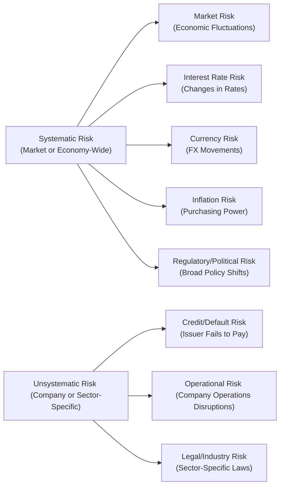

## 16.1 What Are Investment Risks?

Investment risk, in a nutshell, is the possibility that your returns could fall short of expectations — or worse, that you could lose some of your money. Whenever we put our dollars (or any other currency) into an opportunity, whether it’s a bouquet of tech stocks or a savings bond, there’s uncertainty. And uncertainty is a fancy way of saying that the future payoff isn’t guaranteed. The market might slide into a recession, a promising gadget company might suddenly recall its products, or inflation might ramp up and chew away the purchasing power of our returns.

I remember years ago, a friend of mine — let’s call him Carlos — invested in a small biotech start-up because he read an exciting article. It promised revolutionary treatments and potential approvals from major health authorities. Well, guess what? It turned out the approval process took longer than expected, the company’s share price dipped, and Carlos got way more “experience” than he bargained for. The key takeaway is that no matter how much research you do, risk is always present. So, let’s explore what risk really is, how it can show up in your portfolio, and how to think about managing this ever-present companion in your investment journey.

**Understanding the Concept of Investment Risk**

At its core, “investment risk” means things may not go exactly as planned. You might earn less than expected, break even, or encounter outright losses. This uncertainty can come from factors like overall economic conditions, company-specific developments, or shifts in public policy. If you’re reading this, chances are you want to know how to help clients (or yourself!) manage these ups and downs. Institutions such as the Canadian Investment Regulatory Organization (CIRO) keep an eye on how advisors communicate risk to clients and help ensure everyone practices good disclosure and suitability. In short, risk is the name of the game. It’s everywhere, so the trick is learning to manage it.

**Systematic vs. Unsystematic Risk**

There are two high-level categories that people often reference:

- **Systematic Risk (Market Risk)**: This is the risk that affects an entire market or a broad segment of the market. For instance, if a serious recession hits or if the global market tumbles, virtually every portfolio can feel some pain. Think of systematic risk as a storm that the entire ocean experiences, affecting both large ships and small speedboats alike. Investors can’t eliminate it through diversification, but other strategies (like using certain derivatives) can help manage it.

- **Unsystematic Risk (Specific Risk)**: This is the risk tied to a particular company or industry. A huge product recall or disastrous lawsuit can devastate a firm’s share price while the rest of the market continues on its merry way. Thankfully, investors can reduce unsystematic risk by building a well-diversified portfolio. If your portfolio is spread across different industries, geographies, and asset classes, the meltdown of one company or sector is less likely to sink your entire ship.

Below is a quick visual showing the two categories of risk and their subtypes:

This diagram shows a simplified breakdown. “Systematic Risk” includes anything that’s outside a company’s control (i.e., broad market and economic factors). “Unsystematic Risk” concerns company-level threats that you can often mitigate by not putting all your eggs in one basket.

**Additional Categories of Risk**

While systematic and unsystematic risk create the big-picture view, it helps to see how risk can pop up in specific ways:

- **Market Risk**: This is a major part of systematic risk. It’s about the possibility that your investment’s value will fluctuate due to shifts in market sentiment or global events (e.g., geopolitical tension or pandemic news). Even the best research can’t avoid the ups and downs of the broader market.

- **Credit (Default) Risk**: When you invest in bonds or lend money to a corporation or government, you face the risk that the issuer might default on its coupon (interest) or principal payments. If you’re working with a corporate bond from a financially shaky company, well, keep an eye on that credit rating.

- **Liquidity Risk**: Ever tried to sell an odd piece of real estate or a rare collectible and discovered there aren’t many buyers? That’s liquidity risk. It refers to how quickly and easily you can convert an asset into cash without taking a significant hit on its price.

- **Interest Rate Risk**: For bondholders, especially, interest rates are everything. If rates go up, existing bonds tend to lose market value because new bonds offer higher yields. On the flip side, if rates drop, bond prices can climb.

- **Currency (Foreign Exchange) Risk**: Whenever you invest in assets denominated in a foreign currency, your returns can shift due to exchange rate changes. You might think you’ve made a profit in another country’s currency, only to see some of that evaporate when you convert back to Canadian dollars.

- **Inflation Risk**: Inflation is like a slow leak in the tire of your purchasing power. Even if your investment grows at 3% per year, if inflation is 4%, you might feel like you’re going backward in real (inflation-adjusted) terms.

- **Regulatory/Political Risk**: Governments and regulatory bodies can quickly change the rules of the game. A sudden shift in tax policy or a political event can influence entire industries. For example, new emissions standards might weigh more heavily on certain companies, raising their costs and lowering their share prices.

**A Quick Case Study**

A good friend once shared a story about buying a small fleet of taxis just before ride-sharing services exploded across the city. At the time, it seemed like a brilliant idea — a near-monopoly in some areas. But new regulations and disruptive technology (ride-share apps) quickly changed the industry’s landscape, and his investment took a significant blow. That’s a neat illustration of unsystematic risk (company- or industry-specific) aligned with regulatory/political risk. If he’d diversified his capital across different industries, the hit in one sector might not have stung quite so fiercely.

**Aligning Risk with Investor Objectives, Horizon, and Tolerance**

Every client or investor has unique goals, time horizons, and comfort levels with volatility. For instance, someone approaching retirement might be less tolerant of major swings in their portfolio compared to a tech-savvy professional in their early 30s. Typically:

- If you need your money soon (short time horizon), you might prefer less volatile investments.  
- If you’ve got decades to invest, you can handle a bit more short-term bumpiness.  

One key skill for advisors is balancing these factors. You want to ensure your clients’ portfolios reflect both their willingness (psychological tolerance) and capacity (their financial situation) to handle risk. This is a core practice aligned with the Know Your Client (KYC) rules that CIRO enforces. By understanding your client’s risk capacity and tolerance, you can suggest strategies that align with their financial reality.

**Professional Conduct and Regulatory Standards: Gathering Risk Tolerance**

Advisors in Canada operate under the direct oversight of CIRO. Before 2023, we had the Mutual Fund Dealers Association (MFDA) and the Investment Industry Regulatory Organization of Canada (IIROC), but starting June 1, 2023, these were amalgamated into a single self-regulatory organization known as CIRO. This consolidation was partly to simplify and unify regulatory oversight. CIRO now governs multiple aspects of investment dealer and mutual fund dealer activities, ensuring investor protection and market integrity.

Under CIRO rules, advisors have to collect detailed information on each client’s risk appetite, financial situation, and objectives. This obligation is sometimes called “Know Your Client” (KYC). The primary purpose is to ensure that the recommended investments are suitable and that clients have a realistic understanding of both potential returns and the possibility of setbacks. For example, if a client indicates a low risk tolerance and a short time horizon, but their portfolio is loaded with high-volatility stocks and leveraged ETFs, you’d have a mismatch that could be flagged by regulators.

**Practical Tools and Techniques for Assessing and Mitigating Risk**

- **Diversification**: By spreading your investments across various asset classes (stocks, bonds, real estate, etc.) and different industries or geographical regions, unsystematic risk can be trimmed significantly.  
- **Asset Allocation**: The strategic split between equities, cash equivalents, bonds, and alternative assets is often considered the biggest determinant of risk and return.  
- **Hedging Instruments**: Options, futures, or even certain types of forward contracts can help mitigate systematic risk. For instance, buying an index put option could help protect your equity portfolio during a market downturn.  
- **Risk Modeling with Open-Source Tools**: Platforms like Python (along with NumPy, Pandas, and PyTorch) or R (with packages like quantmod) let you crunch historical data and create practical, data-driven risk models. If you’re comfortable coding, these tools can be a cost-effective way to do in-depth analyses.  
- **Staying Informed**: Monitoring economic indicators from credible sources such as the Bank of Canada (https://www.bankofcanada.ca/) helps gauge market risk. Keeping an eye on government announcements, interest rate updates, and major macroeconomic events never goes out of style.

**Glossary**

- **Systematic Risk**: Risk affecting the entire market; can’t be diversified away entirely.  
- **Unsystematic Risk**: Company- or industry-specific risk that can be reduced via diversification.  
- **Market Risk**: Fluctuations in asset prices due to overall market conditions.  
- **Credit (Default) Risk**: The chance that a bond issuer might fail to pay interest or principal on time.  
- **Liquidity Risk**: Uncertainty around liquidating an asset at a fair price without delay.  
- **Interest Rate Risk**: Sensitivity of fixed-income securities to changes in interest rates.  
- **Currency Risk**: Impact of exchange rate fluctuations on returns from foreign investments.  
- **Inflation Risk**: Erosion of real investment returns due to rising prices.  
- **Regulatory Risk**: Exposure to changing government policies or regulations.

**Conclusion**

Investment risk is part of the deal whenever you enter financial markets. But one investor’s nightmare might be another’s opportunity if they’ve structured their portfolio to handle major market shifts, or if they’ve diversified across enough areas. The approach you (or your client) choose should flow naturally from big-picture life goals, time horizons, and how many sleepless nights you can handle. It’s not just about piling on returns; it’s about knowing how you would react if the market took a nosedive tomorrow. Understanding these concepts is essential for any investment advisor operating under CIRO’s regulatory framework in Canada — and, really, for any investor worldwide.

**Additional Resources and References**

- Visit the [Canadian Investment Regulatory Organization (CIRO)](https://www.ciro.ca/) for the latest regulatory requirements and guidelines around risk disclosure and client suitability.  
- Browse the [Canadian Securities Administrators (CSA)](https://www.securities-administrators.ca/) for updates on national instruments related to risk classification.  
- For macro-level data, see the [Bank of Canada](https://www.bankofcanada.ca/) website (interest rates, monetary policy statements, etc.).  
- Explore open-source tools like [Python’s NumPy](https://numpy.org/) and [Pandas](https://pandas.pydata.org/) or [R’s quantmod package](https://cran.r-project.org/web/packages/quantmod/index.html) for advanced portfolio analytics.  
- The CFA Institute’s “Investment Risk and Performance” series offers in-depth articles on risk measurement and risk management.  
- “The Handbook of Fixed Income Securities” by Frank J. Fabozzi (particularly useful for understanding interest rate risk and credit risk).  
- Consider online courses such as Coursera’s “Investment Management” specialization or edX’s “Risk Management for Banking and Financial Markets” for structured learning.

Anyway, that wraps up our deep dive into the nature of investment risks. Whether you’re working as an advisor or exploring your own financial next steps, keep learning about different risk factors and how they interplay. Markets might be unpredictable, but your knowledge and strategy can help you navigate toward more confident decision-making.

---

## Test Your Knowledge: Investment Risk Fundamentals



### Which statement best describes “investment risk”?
- [ ] The guarantee of positive returns on an investment.
- [x] The possibility that investment returns may be lower than expected or result in a loss.
- [ ] A method to avoid all forms of uncertainty.
- [ ] A measure that ensures immediate payment of returns.

> **Explanation:** Investment risk is fundamentally about uncertainty and the possibility of not meeting expected returns.

### What is the key difference between systematic and unsystematic risk?
- [x] Systematic risk impacts the entire market, while unsystematic risk is company- or industry-specific.
- [ ] Systematic risk is avoidable through diversification, while unsystematic risk is not.
- [ ] Both are completely eliminated through a balanced portfolio.
- [ ] There is no difference; the terms are interchangeable.

> **Explanation:** Systematic risk applies broadly to markets or economic structures, while unsystematic risk reflects the unique circumstances of a specific firm or sector.

### A sudden shift in government tax policy that affects all corporations equally is an example of:
- [ ] Unsystematic risk.
- [x] Systematic risk.
- [ ] Liquidity risk.
- [ ] Credit risk.

> **Explanation:** Policy changes that apply to an entire market or economy introduce systematic risk because they affect most or all market participants.

### Which type of risk involves a bond issuer’s failure to make scheduled payments?
- [ ] Market risk.
- [ ] Interest rate risk.
- [ ] Inflation risk.
- [x] Credit (default) risk.

> **Explanation:** Credit risk is the possibility that a borrower will fail to meet payment obligations (interest or principal) on a debt security.

### Which action can help reduce unsystematic risk?
- [x] Diversifying a portfolio across different industries.
- [ ] Investing solely in one fast-growing technology company.
- [x] Holding a combination of stocks, bonds, and real estate.
- [ ] Timing the market’s peaks and troughs perfectly.

> **Explanation:** Diversification can mitigate unsystematic risk. By not concentrating all investments in one company or sector, you reduce exposure to any single point of failure.

### What is inflation risk?
- [x] The possibility that the real value of investment returns will be reduced by rising costs of goods and services.
- [ ] The possibility of a company defaulting on its bonds.
- [ ] The risk of sudden government policy changes.
- [ ] The risk of having too many holdings in a single sector.

> **Explanation:** Inflation risk occurs when prices rise and erode the real (inflation-adjusted) rate of return on an investment.

### If an investor holds assets in various countries, a depreciation in the CAD (Canadian dollar) relative to those foreign currencies could:
- [x] Potentially increase the returns when converted back to CAD.
- [ ] Remove all diversification benefits.
- [x] Subject the investor to currency risk.
- [ ] Have no effect on the portfolio whatsoever.

> **Explanation:** Holding foreign assets exposes an investor to currency risk. If the CAD depreciates, converting returns back into CAD could enhance gains, but it also adds uncertainty.

### Which risk is particularly relevant to fixed-income investors when interest rates rise?
- [x] Interest rate risk.
- [ ] Liquidity risk.
- [ ] Regulatory risk.
- [ ] That is a systematic risk only relevant for equities.

> **Explanation:** When interest rates go up, existing bond prices often fall because new bonds may offer higher yields.

### Which is NOT typically considered a systematic risk factor?
- [x] A product recall at a single auto manufacturer.
- [ ] A global pandemic.
- [ ] A nationwide recession.
- [ ] Central bank monetary policy changes.

> **Explanation:** A product recall at one company is an example of unsystematic risk because it’s a company-specific event.

### True or False: A longer investment horizon generally allows investors to take on more risk because they can ride out short-term market fluctuations.
- [x] True
- [ ] False

> **Explanation:** With a longer time horizon, investors can generally afford more volatility, since there is more time to recover from potential downturns.


