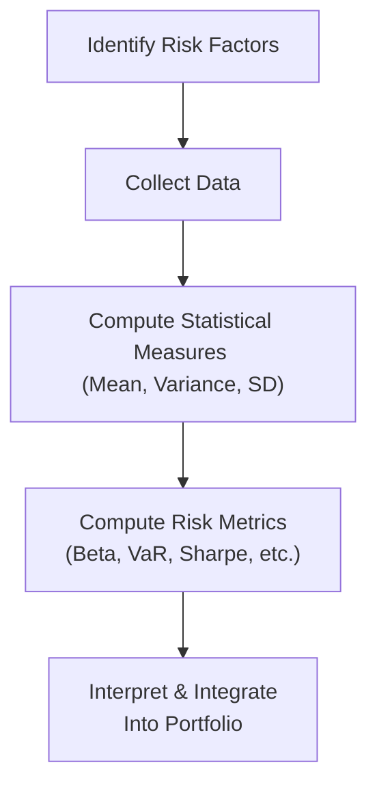

## 16.2 Measuring Investment Risk

Picture this: You’re sitting across from a client who’s new to investing—or maybe it’s your uncle or a close friend, someone who’s super anxious about how stock market ups and downs might affect their hard-earned money. You might say, “Well, you know, let’s look at the standard deviation, the beta, and maybe run a Value at Risk analysis.” And then you see their eyes glaze over, right? We’ve all been there. Measuring investment risk can sound complicated, but in reality, it’s about understanding a few statistical tools and applying them in a way that makes sense for your client’s goals and comfort level.

This section dives deep into those tools. Think of it as a detective kit for analyzing and quantifying how volatile an asset or a portfolio is likely to be, what might be the biggest possible loss you could face on a bad day, and how to compare different investments based on their risk-adjusted returns. It’s not about scaring people off. It’s about making the unknown a little more knowable, so we can make more confident, data-driven decisions.

We’ll explore time-tested metrics like standard deviation, variance, beta, alpha, correlation, Value at Risk (VaR), and the Sharpe and Sortino ratios. We’ll also talk about how those metrics get applied in real-world scenarios—like designing a client’s portfolio or satisfying our cozy friend, the regulator. Throughout, let’s keep in mind that each methodology has its limits and that human emotions can, of course, throw all our spreadsheets out the window. But that’s part of the journey: using these tools for structure, while acknowledging the behavioral side of finance.

---

### The Role of Statistical Concepts in Measuring Risk

When we talk about “risk” in investments, most people want a single number: “How likely am I to lose money?” or “What’s the biggest potential drawdown in a worst-case scenario?” We can’t always give a simple, bulletproof answer—markets can be chaotic, as we’ve all seen. But by using specific statistical methods, we get approximations that help us plan, measure, and compare.

Below is a simple flowchart illustrating how many advisors (and investment professionals in general) move from raw data to meaningful risk metrics:

In other words, we first figure out what we’re measuring (e.g., returns, price fluctuations), collect relevant data (e.g., daily returns for the last five years), crunch those numbers to find averages and volatilities, and then derive advanced metrics that help us answer real-world questions: how does this asset move with the market, what’s my potential loss, and how has the investment performed relative to the risk-free rate?

---

### Standard Deviation: The Foundation of Volatility Analysis

Standard Deviation (σ) is the bread-and-butter measure of how widely individual returns vary around their average (mean) return. But let’s talk a bit about how it’s used in everyday portfolio discussions.

• If you have a high standard deviation, it suggests that the investment’s returns dance around dramatically—sometimes very high, sometimes very low—relative to its average.  
• A low standard deviation means the investment’s returns stay closer to the average; it’s more predictable (although not necessarily high-returning, of course).

#### Quick example of standard deviation
Let’s say you have an asset whose annual returns over the last five years are (+5%, +6%, +7%, +4%, +8%). The mean (average) return is 6%. If these returns don’t vary much around 6%, then the standard deviation would be low. Now, compare that to another investment that returned (+20%, -10%, +5%, +30%, -15%)—the mean might still be positive, but oh boy, the standard deviation is way higher. That second investment is jumping around a lot more, meaning you’re taking on more volatility risk.

From a regulatory standpoint here in Canada, advisors use metrics like standard deviation when they classify products into risk buckets (e.g., “low,” “medium,” or “high” risk). Tools approved by the Canadian Investment Regulatory Organization (CIRO) often factor standard deviation or volatility-based measures into “Know Your Product” (KYP) guidelines. That helps ensure you’re recommending something that fits your client’s risk tolerance, capacity, and objectives.

---

### Beta: Measuring Market-Related Risk

Beta (β) zeroes in on “systematic risk.” This is risk that’s baked into the entire market—think of it like the tides that lift (or lower) all boats simultaneously. Beta measures how sensitive a particular investment or portfolio is to those tides.

- A beta of 1.0 means an investment typically moves in line with the market. If the market goes up 2%, you’d expect your investment to also go up about 2%.  
- A beta above 1.0 means the investment is more sensitive than the market. If the market climbs 2% and your investment’s beta is 1.5, you might see a 3% increase. On the flip side, it can also drop more than the market on bad days.  
- A beta below 1.0 means the investment is less sensitive to market moves. This might be something like a utility stock or a government bond. Remember, less sensitivity may mean more stability, but often lower potential upside.

From a portfolio construction angle, if you have a client who’s risk-averse but still wants some market exposure, you might combine a couple of lower-beta assets with some moderate- to high-beta assets. The combined effect can produce a more balanced, comfortable ride. Many open-source libraries like PyPortfolioOpt in Python or the R PerformanceAnalytics package let you calculate beta easily by comparing your investment’s returns against the returns of a benchmark like the S&P/TSX Composite or the S&P 500.

---

### Alpha: How Much Did You Really Earn Beyond the Benchmark?

Alpha (α) is the difference between an investment’s actual returns and the returns you’d expect based on its beta and market conditions. It aims to measure skill—or luck, depending on your perspective—in active management.

- A positive alpha means the investment performed better than expected given its level of market exposure.  
- A negative alpha suggests underperformance compared to what the market-based model would predict.  

So, if your portfolio has a beta of 1, and the market soared 10%, expectations for your portfolio might also be around 10%. If you ended the year at 12%, your alpha is +2%. Alpha can be a powerful marketing tool for asset managers to demonstrate they’re adding “value.” But keep in mind, alpha lumps together every possible reason for outperformance, including random chance or short-term anomalies.

---

### Value at Risk (VaR): Knowing the Worst-Case Scenario (Sort Of)

Value at Risk (VaR) is a more advanced metric that’s sometimes described as “the maximum expected loss over a certain period with a given confidence level.” For instance, “There’s a 95% chance that we won’t lose more than X% in a day.”

• A 5% VaR of, say, $50,000 means there’s only a 5% chance that losses will exceed $50,000 over the specified time window (e.g., a day, a month).  
• In practice, VaR can be calculated using different approaches:  
  - Historical VaR, which looks at past returns and sees how bad losses have been in real-world data.  
  - Parametric VaR (often called Variance-Covariance VaR), relying on statistical assumptions like normal distribution.  
  - Monte Carlo VaR, which does scenario simulations many times over.

VaR has its critics: Some folks say it doesn’t capture tail risk well—meaning catastrophic, black swan events can and do exceed VaR predictions. However, VaR remains an important risk management checkpoint for many institutional investors and is considered by regulators to be a key piece in capital allocation decisions. For Canadian advisors, it can also come into play when analyzing complex products or derivative strategies under CIRO’s guidelines—though you must remember that past data doesn’t guarantee future performance.

---

### Sharpe Ratio: Risk-Adjusted Performance

The Sharpe ratio is a classic measure to see how much “bang for your buck” you’re getting from a risk perspective. Formally, it’s:


\text{Sharpe Ratio} = \frac{R_p - R_f}{\sigma_p}


Where:  
- \\( R_p \\) is the portfolio’s return,  
- \\( R_f \\) is the risk-free rate (e.g., the yield on a T-bill),  
- \\( \sigma_p \\) is the standard deviation (volatility) of the portfolio’s returns.

The higher the Sharpe ratio, the better your risk-adjusted returns. Suppose your portfolio has an annual return of 8%, the risk-free rate is 2%, and your annual standard deviation is 10%. Then your Sharpe ratio is \\( (0.08 - 0.02) / 0.10 = 0.60 \\). Compare that to a portfolio with the same 8% return but a standard deviation of 5%—its Sharpe ratio would be \\( (0.08 - 0.02) / 0.05 = 1.20 \\), which is comfortably higher.

Remember, the Sharpe ratio uses total volatility as the denominator. That includes upside and downside volatility. If you’re sensitive to the fact that some volatility is good (i.e., the upside), you might prefer the Sortino ratio.

---

### Sortino Ratio: Focusing on Downside Deviations

The Sortino ratio modifies the Sharpe ratio to focus on downside risk. Instead of total standard deviation, it uses standard deviation of negative returns—often called downside deviation.


\text{Sortino Ratio} = \frac{R_p - R_f}{\text{Downside Deviation}}


This approach tries to answer something like: “How well am I being compensated for the times the investment actually drops below a certain threshold?” Because, you know, many investors don’t mind upside volatility. They usually only mind losing money or not meeting their financial obligations.

---

### Correlation: Understand How Assets Move Together

Correlation is like the social “chemistry” among different securities, moving between -1.0 and +1.0. If two assets have a perfect positive correlation (+1.0), they move in lockstep. If one is up 3%, the other is also up 3%. Perfect negative correlation (-1.0) means one zigs while the other zags.

In building a diversified portfolio, you generally want to include investments whose correlations to each other are low or even negative. That helps smooth out the overall ride. If your entire portfolio is highly correlated with the S&P/TSX Composite, for instance, you might be in for a rough time if that index tanks. But if you add some global bonds, real estate, or alternative assets that move differently, you can reduce total portfolio volatility.

Many of us in Canada love to add U.S. or international equities to reduce home-biased risk. We might also sprinkle in a commodity or bond fund to lower overall correlation. The advantage is that, when one asset class is taking a beating, another might be holding steady or even going up. Of course, correlations can change over time—particularly during market crises, when everything can trend toward a correlation of +1 in a so-called “flight to safety.” But correlation is still one of the most important tools in the risk measurement toolbox.

---

### Applying These Metrics in Real Life

For advisors, each of these measures—standard deviation, beta, alpha, VaR, Sharpe ratio, Sortino ratio, correlation—helps paint a picture of how a client’s investments might behave. Let’s look at a sample scenario:

Imagine you’re working with Taylor, a moderately conservative investor who wants stable income but is also open to some growth. Taylor is especially worried about big drawdowns. You might do the following:

• Start by calculating the standard deviation of each proposed investment—maybe a balanced mutual fund, a few individual dividend stocks, and an alternative investment, like a real estate income trust (REIT). This helps Taylor see how much each investment typically fluctuates.  
• Then incorporate correlation analysis. Maybe the REIT has a lower correlation to the equities in the portfolio, which helps reduce overall volatility.  
• Consider beta. If some dividend stocks have a beta below 1, they may provide a bit of buffer against market downturns.  
• Evaluate VaR. You run some quick Historical VaR numbers at 95% confidence to estimate potential losses over a month.  
• Finally, put it all together into a risk-adjusted return lens using the Sharpe or Sortino ratio. Show that the REIT might have a slightly lower absolute return but a higher risk-adjusted return, which is valuable for a risk-conscious investor like Taylor.

In doing so, you’re also ticking the boxes that CIRO and other Canadian regulators want to see: a thorough understanding of your client’s risk profile and a robust approach to “Know Your Product.” By quantifying everything, you can set more realistic expectations and align your advice with both the rules and what’s best for your client.

---

### Best Practices and Common Pitfalls

• Overreliance on Historical Data: Markets evolve, and past volatility patterns might not repeat. For instance, if you rely solely on the calm years, you might be in for a shock if a crisis hits.  
• Underestimating Tail Risks: VaR gives a sense of the likely worst-case scenario, but it might overlook extreme events (the dreaded black swans).  
• Correlation Breakdown in Crises: Assets that are lightly correlated in normal times might become much more correlated in panic mode.  
• Skin in the Game: Don’t rely solely on metrics. Have ongoing conversations with clients to gauge how they’re feeling. Behavior and bias play huge roles in how risk is perceived and managed.

In my experience, you can have all the fancy charts in the world, but if your client freaks out at a little volatility, your plan can go out the window. That’s why risk profiling (introduced in Chapter 2) is so critical in bridging the gap between raw numbers and actual decision-making.

---

### Regulatory and Ethical Considerations

From a regulatory standpoint, especially under CIRO’s oversight in Canada, advisors must show that the recommended portfolio is suitable. That typically involves:

• Understanding the client’s risk tolerance and risk capacity.  
• Using recognized metrics (like standard deviation or Sharpe ratio) to illustrate an investment’s volatility.  
• Documenting this discussion thoroughly (objectives, constraints, KYP, KYC).  
• Monitoring for changes in the client’s circumstances or the investments’ risk profiles.

Remember, the old IIROC and MFDA are historically relevant but have been merged into the new SRO known as CIRO since 2023. If you used to rely on guidelines from those defunct organizations, you’ll now find updated materials from CIRO at https://www.ciro.ca. CIPF (Canadian Investor Protection Fund) also consolidated its coverage obligations. If your client is concerned about insolvency risk, CIPF continues to protect eligible assets if a member firm becomes insolvent.

---

### Quick Reference Table: Key Risk Measures

Below is a simple table that compares and contrasts a few of the main metrics discussed:

| Risk Metric   | Focus                           | Formula / Concept                                | Primary Use                                         |
|---------------|---------------------------------|--------------------------------------------------|-----------------------------------------------------|
| Standard Deviation | Overall volatility of returns    | \\(\sqrt{\text{Variance}}\\)                     | Quick volatility check                               |
| Beta (β)      | Sensitivity to market movements | Covariance(asset, market)/Variance(market)       | Evaluate systematic risk, helps with portfolio beta |
| Alpha (α)     | Performance vs. expected return | \\( R_p - [ R_f + \beta (R_m - R_f) ] \\)          | Gauging active management skill                     |
| VaR           | Potential maximum loss          | Historical, Parametric, Monte Carlo approaches   | Regulatory & scenario analysis of worst-case losses |
| Sharpe Ratio  | Risk-adjusted return            | \\(\frac{R_p - R_f}{\sigma_p}\\)                  | Helps compare investments with different volatility |
| Sortino Ratio | Downside-risk-adjusted return   | \\(\frac{R_p - R_f}{\text{Downside Deviation}}\\) | Focuses on negative returns only                     |
| Correlation   | Co-movement                     | Ranges from -1.0 to +1.0                         | Asset allocation, diversification                    |

---

### Tips for Bringing It All Together

1. Use Multiple Metrics: Don’t rely on just standard deviation or just VaR. Each reveals a slightly different angle, and combined, they give you a more complete risk profile.  
2. Context is Key: A high Sharpe ratio doesn’t automatically mean an investment is “best.” You have to consider the client’s constraints, liquidity needs, and time horizon.  
3. Dynamic Updates: Keep risk measurements updated regularly. Market conditions shift, correlations evolve, and a client’s personal situation may change.  
4. Communicate with Analogies: Sometimes, show how correlation or standard deviation might relate to real-life experiences, such as the unpredictability of weather vs. the unpredictability of market swings.  
5. Integrate with Behavioral Insights: Tie these risk metrics back to Chapter 2’s discussion on behavioral biases. Numbers alone won’t do the trick if fear or greed takes over.

---

### Additional References for Further Exploration

- **CIRO**: Canada’s new self-regulatory organization for investment dealers and mutual fund dealers. Updated guidelines and resources at [https://www.ciro.ca](https://www.ciro.ca).  
- **Canadian Securities Institute (CSI)**: Courses and educational modules, with robust materials on measuring portfolio risk.  
- **GIPS (Global Investment Performance Standards)**: [https://www.cfainstitute.org/en/ethics-standards/gips-standards](https://www.cfainstitute.org/en/ethics-standards/gips-standards). A global framework for performance reporting and ethics in performance measurement.  
- **CFA Institute Investment Series** – “Managing Investment Portfolios: A Dynamic Process” by John L. Maginn et al. Thorough coverage of modern portfolio theory, risk metrics, and performance management.  
- **Khan Academy & Investopedia**: Free, easy-to-digest tutorials on everything from basic probability to advanced finance topics.  
- **Open-Source Tools**:  
  - **PyPortfolioOpt** (Python): Automates portfolio optimization and risk metric calculations.  
  - **PerformanceAnalytics** (R): Offers a wide range of statistical functions for analyzing risk and returns.

If you want to really roll up your sleeves, you can import your asset returns data into these tools and generate standard deviation, VaR, correlation matrices, and more.

---

All in all, measuring investment risk is about finding ways to put numbers around that uneasy feeling in our gut when markets get choppy. While these measures aren’t perfect, they can offer clarity, confidence, and a better framework for making decisions—whether you’re an advisor navigating regulatory guidelines or just an adventurous investor hoping to keep a handle on potential downsides. By balancing what the data tells us with the human elements of investing, you can guide clients (or yourself) toward portfolios that feel comfortable and align with everyday realities.

## Check Your Understanding of Measuring Investment Risk



### Which of the following best describes the Sharpe Ratio?

- [ ] A measure of how closely a portfolio tracks its benchmark.  
- [x] A risk-adjusted performance measure comparing excess returns to total volatility.  
- [ ] A measure of downside risk only.  
- [ ] A statistical tool exclusively used for tail risk assessment.  

> **Explanation:** The Sharpe Ratio takes a portfolio’s excess return over a risk-free rate and divides that by the portfolio’s standard deviation, indicating how much return you’re receiving per unit of risk.

### When an investment has a beta of 1.2, what does that imply?

- [x] The investment is more sensitive than the market and will likely move 20% more than the market’s movements.  
- [ ] The investment is guaranteed to yield 20% more return than the market.  
- [ ] The investment is positively but weakly correlated to the market.  
- [ ] The investment’s returns are independent of market returns.  

> **Explanation:** A beta of 1.2 typically signals that if the market moves by a certain percentage, the investment is likely to move by about 1.2 times that amount. That’s sensitivity, not a guarantee of outperformance.

### Which statement is correct about Value at Risk (VaR)?

- [ ] It guarantees a maximum level of loss on any given day.  
- [ ] It focuses exclusively on tail risk beyond the 99th percentile.  
- [x] It estimates the maximum likely loss over a specified period at a chosen confidence level.  
- [ ] It cannot be calculated using historical methods.  

> **Explanation:** VaR is an estimate of potential loss at a certain confidence level (e.g., 95% or 99%) over a given time horizon, often derived using historical data or statistical modeling.

### A portfolio’s alpha (α) represents:

- [ ] Its total volatility relative to a benchmark.  
- [x] The difference between actual returns and expected returns based on market risk (beta).  
- [ ] A projection of future risk premia in the market.  
- [ ] The correlation of the portfolio with other asset classes.  

> **Explanation:** Alpha is the difference between a portfolio’s realized returns and its expected returns given its level of systematic risk (as measured by beta).

### What is the key difference between the Sharpe Ratio and the Sortino Ratio?

- [ ] The Sharpe Ratio measures downside risk only, while the Sortino Ratio includes both upside and downside volatility.  
- [ ] They are effectively the same measure and interchangeable in all contexts.  
- [ ] The Sortino Ratio is calculated using the risk-free rate in the numerator instead of returns.  
- [x] The Sharpe Ratio uses total standard deviation in its denominator, while the Sortino Ratio focuses only on downside volatility.  

> **Explanation:** The Sortino Ratio refines the Sharpe approach by looking only at downside deviation instead of total standard deviation, thus emphasizing negative variations in performance.

### A correlation coefficient of -1.0 between two assets means:

- [ ] The assets move together in perfect sync.  
- [ ] The assets have no relationship.  
- [x] The assets move exactly opposite to each other.  
- [ ] The assets are both less volatile than the market.  

> **Explanation:** A correlation of -1.0 is perfect negative correlation, where one asset’s gain is another asset’s loss at a one-to-one ratio.

### Suppose you have an investment that produced 10% returns when the market returned 8%, and your investment’s beta is 1. If the risk-free rate is 2%, how much is alpha?

- [x] +2%  
- [ ] +0%  
- [ ] -2%  
- [ ] +8%  

> **Explanation:** If beta is 1, your investment is expected to match the market’s return (8%), so the alpha is the difference between your actual return (10%) and the expected market return (8%) = +2%.

### If you want to specifically measure only the potential losses from negative returns (rather than all volatility), which metric should you use?

- [ ] Standard Deviation  
- [ ] Sharpe Ratio  
- [x] Sortino Ratio  
- [ ] Correlation Coefficient  

> **Explanation:** The Sortino Ratio focuses on downside deviation, thus capturing only negative returns in its measure of risk.

### In practical portfolio construction, a primary reason to measure correlation is to:

- [ ] Determine the maximum potential drawdown in a single asset.  
- [ ] Evaluate alpha relative to a benchmark.  
- [x] Discover how different assets move together and identify diversification benefits.  
- [ ] Assess downside-only risk for one security.  

> **Explanation:** Correlation helps you understand how assets co-move. Low or negative correlations can offer powerful diversification benefits, reducing overall portfolio volatility.

### True or False: Value at Risk (VaR) perfectly captures all extreme (tail) events.

- [ ] True  
- [x] False  

> **Explanation:** VaR offers a statistical estimate but does not guarantee protection against extreme tail events. It provides a threshold of potential losses but may underestimate rare, catastrophic scenarios.


