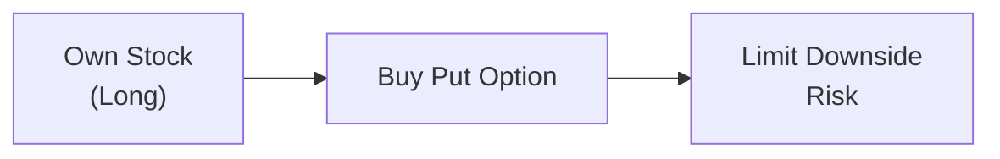
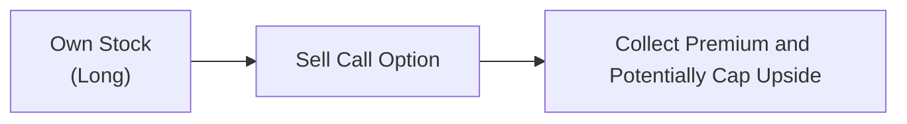
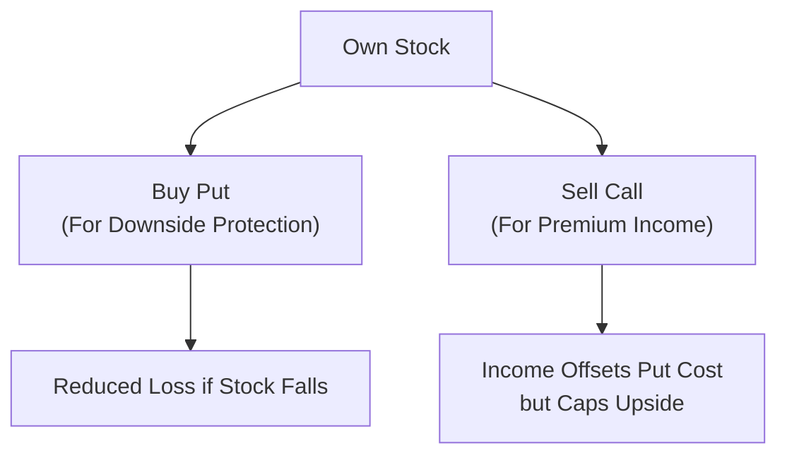

## 16.4 How to Use Options to Reduce Investment Risk

Have you ever clutched your phone, nervously watching the market slip while you fought the urge to sell your stock holdings? Investing can be an emotional roller coaster, right? Well, that’s where options can help settle some nerves. I remember the first time I bought a protective put—it felt almost magical to know that I could lock in a minimum exit price if things went south. But, of course, options aren’t magic. They come with premiums, trade-offs, and some complexities. The good news? Once you understand the basics, options can become very handy tools in your arsenal for limiting downside risk. Let’s talk about how that works.

Options, at their core, are derivative contracts giving the holder the right—but not the obligation—to buy or sell an underlying asset at a specified strike price on or before a certain expiration date. They’re often used to hedge risk, which makes them extremely relevant to Chapter 16’s theme: managing your client’s investment risk. In this section, we’ll look at different ways to protect portfolios using options, some practical strategies that can reduce exposure to big price swings, and the critical trade-offs you need to consider.

Before we dive into specific strategies, let’s make sure we’re on the same page with a quick refresher on some key concepts and definitions:

• Option: A contract granting the right (not the obligation) to buy (call) or sell (put) an underlying security at a specified strike price until its expiration date.  
• Strike Price: The price at which the underlying security can be purchased or sold.  
• Option Premium: The amount paid or received for buying or selling an option.  
• Call Option: Gives you the right to buy the underlying security.  
• Put Option: Gives you the right to sell the underlying security.

Also keep in mind that the market for these instruments in Canada is typically facilitated on the Montréal Exchange (https://www.m-x.ca/). Their website offers a wealth of information, including option chain data, contract specifications, and educational resources. Alongside that, the Options Industry Council (https://www.optionseducation.org/) provides open-access courses and solid reference materials on derivatives.  

Let’s explore how to put options to work to reduce your clients’ investment risk.

### Why Use Options for Risk Reduction?

Options can do more than just speculate on price movements: they can help protect stock portfolios from downward moves, generate income that offsets mild losses, and reduce volatility. That said, each strategy comes with costs—mainly, the option premium—plus certain constraints and potential missed opportunities. Advisors need to weigh the premium cost against the level of protection desired. Also, you’ll want to ensure you comply with the Canadian Investment Regulatory Organization (CIRO) guidelines for client suitability, especially regarding derivatives knowledge, trading authority, and risk disclosure.  

To illustrate, let me share a quick personal experience: I once had a client who was incredibly bullish on a particular tech stock but worried about a market correction. We used a protective put. Yes, it cost a bit, but the client was able to sleep at night. And I was able to keep them invested in a stock that fit their growth goals because we had a floor in place. Sure, the premium was effectively an “insurance cost.” But that peace of mind was worth it.

### Protective Put

The protective put is arguably the most straightforward option strategy for risk management. All it means is you buy a put option on a stock (or an ETF) you already own. If the stock price falls sharply, the put gives you the right to sell the stock at the strike price, limiting your downside. If the stock rallies, you keep the gains (less the cost of the put). It’s like taking out an insurance policy on your car. You hope not to use it, but when you need it, you’re really glad it’s there.

• Scenario: You have 100 shares of DreamCo, trading at CAD 50 per share.  
• You buy a put option with a strike price of CAD 48, paying CAD 1 per share in premium.  
• If DreamCo drops to CAD 40, you can exercise the put and sell your shares at CAD 48, limiting your loss.  
• Your maximum loss is now CAD 3 per share (the drop from 50 to 48, plus the premium of 1). Without the put, your loss would have been CAD 10 per share.  

Below is a simple flowchart to illustrate how a protective put transaction is structured:

• A["Own Stock   (Long)"]: You already own shares of a stock or ETF.  
• B["Buy Put Option"]: You purchase a put option with a suitable strike price.  
• C["Limit Downside   Risk"]: If the stock price plunges, the put option can be exercised or sold, reducing potential losses.

The cost of the put option reduces your net returns if the market doesn’t drop, but it also reduces your losses if the market does drop. Think of it like paying for insurance. Not free, but valuable if something goes wrong.

### Covered Call

Sometimes, your clients may already own a portfolio of equities and wonder if there’s a way to cushion the downside risk slightly—while generating a bit of extra income. The covered call is a strategy where you hold a stock (or ETF) and write (sell) a call option on that position to collect a premium. The reason it’s called “covered” is you own the underlying stock, so if your call gets exercised, you can deliver those shares.

• For example, suppose you own 200 shares of MapleTech at CAD 60 a share.  
• You write (sell) two call contracts with a strike price of CAD 65, receiving CAD 2 per share in premium.  
• If MapleTech trades above 65 at expiration, the calls might be exercised, and you have to sell your shares at 65. You make a profit from 60 to 65 plus the premium of 2. However, if MapleTech soars to 75, you miss out on those extra gains above 65.  
• If MapleTech stays flat or drops, you keep the premium, which offsets some of your losses, but you still face downside risk below your breakeven point (stock purchase price minus premium earned).  

Writing a covered call collects immediate income but caps your upside at the strike price. Because you’ve received the premium, you reduce your cost basis slightly, helping offset small losses. But if the stock has a dramatic drop, the premium alone might not be enough to protect you fully. It’s a limited safety net.

Here’s a quick flowchart:

• A["Own Stock   (Long)"]: You hold shares of the underlying.  
• B["Sell Call Option"]: You write a call, receiving premium income.  
• C["Collect Premium and Potentially Cap Upside"]: Premium offsets some downside, but you might have to sell your shares if the stock rallies above the strike price.

### Collar

What if you combined a protective put and a covered call on the same stock you own? That’s a collar. You buy a put for downside protection and simultaneously write a call to offset the cost of the put (at least partly). So, you end up with a corridor for your stock’s returns—you place a floor and a ceiling on how much you can lose or gain over the period.

• Collar structure:  
  1) Buy the underlying stock (if not already owned).  
  2) Buy a put option (expense).  
  3) Write a call option (income).  

Often, the premiums offset each other to some degree. If the market tanks, your put helps protect your position. If the stock shoots up, your call may be exercised—you’ll profit up to the strike price but miss any gains above that level. The collar strategy can drastically reduce the volatility of a stock position, but it also imposes an “opportunity cost” if the stock rallies strongly.

Here’s how you might visualize the collar strategy:

### The Trade-Off: Premiums vs. Protection

Every option bought or sold carries a premium, and that premium impacts your net returns. If your protective put never gets used because the stock price rises, you lose that premium. But if it saves your portfolio from a crash, it’s worth every penny. Similarly, with the covered call, you gain premium income, but you might end up capping significant upside if your stock surges.

Advisors need to strike the right balance. Sometimes, it might feel like you’re hesitating to pay “extra costs” for these hedges, but there is comfort in the knowledge that your portfolio is more stable—especially crucial for clients with lower risk tolerance or shorter time horizons.

### Implied Volatility and Its Effect on Option Prices

One of the major determinants of option pricing is implied volatility (IV). This is essentially the market’s forecast of the underlying’s future volatility. The higher the implied volatility, the higher the premiums. If you’re buying options, high implied volatility can feel expensive. If you’re writing options, high implied volatility means higher premiums for you, but also a higher expectation of price swings.

I recall one year when a client insisted on buying puts right before major earnings announcements because the stock was prone to big moves. The implied volatility was sky high, so the puts were not cheap. But guess what—as soon as the earnings event passed and the stock remained reasonably stable, IV cratered, and the put’s value sank. Timing and knowledge of implied volatility behavior can matter just as much as the stock’s actual price direction.

### The Greeks: Delta, Gamma, Theta, Vega

The so-called “Greeks” measure different types of risk and sensitivity in an option’s price:

• Delta (Δ): How much the option price changes for a CAD 1 change in the underlying stock.  
• Gamma (Γ): The rate of change of delta itself as the underlying moves.  
• Theta (Θ): How much value an option loses each day as expiration nears (time decay).  
• Vega (ν): How sensitive the option price is to changes in implied volatility.

If you’re going to help clients manage their positions with options, it’s helpful to keep an eye on these Greeks. For instance, if you buy a protective put (which typically has a negative delta), your overall portfolio delta might be adjusted to reflect the partial hedge. Understanding how gamma can accelerate gains or losses near the option strike, how theta can erode option premiums over time, and how vega can increase or decrease the cost of the hedge is crucial for professional option risk management.

For a rough example: if you have a protective put with a delta of –0.3, a quick move downward in the stock price by CAD 1 might cause the put to gain about CAD 0.30 in value, partially offsetting your losing stock position. Gamma measures how that –0.3 might shift to –0.4 or –0.5 if the underlying price continues to drop, thus changing the hedge ratio. While we usually can’t see the future, we can at least measure these sensitivities to anticipate potential changes.

### Regulatory Considerations with Options in Canada

From a regulatory standpoint in 2025 Canada, all references to the defunct MFDA or IIROC now fall under the umbrella of the Canadian Investment Regulatory Organization (CIRO). CIRO enforces proficiency requirements for advisors looking to trade in options on behalf of clients. If you operate a discretionary account or do covered options strategies for your clients, you must meet CIRO’s professional exams and maintain the necessary licensing. Always ensure you meet Know-Your-Client (KYC) obligations, so clients understand the risks involved with derivatives. You also want to keep their risk profiles updated, because these strategies, while they reduce certain risks, still involve complexities and potential pitfalls.  

Furthermore, the Canadian Investor Protection Fund (CIPF) remains the sole investor protection fund after merging with the MFDA’s former insurance protection entity. Although CIPF coverage doesn’t guarantee you against market losses, it plays a critical role if a member firm becomes insolvent. For resources on staying compliant with regulatory requirements, check out the CIRO website (https://www.ciro.ca).

### Practical Examples and Best Practices

Let’s walk through a simplified scenario:

• Protective Put Example:  
  - Investor owns 500 shares of NorthernHarvest at CAD 100 each.  
  - They buy 5 put contracts (each covering 100 shares) with a strike price of CAD 95, paying CAD 2.50 per share in premium, or CAD 1,250 total.  
  - If the stock plunges to CAD 80, the investor can sell shares at CAD 95, limiting the downside to CAD 5 per share plus the premium.  
  - If the stock stays above CAD 95 at expiration, the options expire worthless, and the investor keeps their shares but is out CAD 1,250.  

• Covered Call Example:  
  - Investor owns 300 shares of PrairieLakes at CAD 40 each.  
  - They sell 3 calls with a strike of CAD 45, receiving a premium of CAD 1.20 per share.  
  - If PrairieLakes trades above 45 at expiration, the calls might be exercised, so the investor sells at 45. They earn CAD 5 per share in capital gains plus CAD 1.20 per share in premium.  
  - If the stock stays below 45 by expiration, the calls expire worthless, and the investor keeps the premium.  

• Collar Example:  
  - Same PrairieLakes scenario but suppose the investor is worried about potential downside.  
  - They buy a put with a strike of CAD 38 (pay a premium of CAD 1) and sell a call with a strike of CAD 45 (receive a premium of CAD 1.20).  
  - Net cost: –CAD 0.20 per share.  
  - The stock’s floor is effectively around CAD 38 (minus net premium), and the ceiling is CAD 45.  

In real life, the math can get more intricate, and you need to factor in commissions, taxes (which can vary if you’re in a retirement account or taxable account), and short-term option expiry issues. But these examples show how the strategies work.

### Common Pitfalls and Challenges

• Overpaying premiums in a high-implied-volatility environment.  
• Using exotic options (like barrier options or weeklies) without fully understanding the complexities.  
• Failing to update or roll over positions before expiration.  
• Over-hedging, leading to large option costs that eat into your portfolio returns.  
• Underestimating the risk that your call options might be assigned early (especially for American-style options).  
• Not monitoring how your Greeks shift as markets move.

It’s easy to fall into these pitfalls when you’re juggling busy days or if you’re new to derivatives. A careful approach is always recommended, along with constant learning and sometimes professional consultation with specialized derivatives strategists.

### References and Further Exploration

• Montréal Exchange (https://www.m-x.ca/): Official source for Canadian listed options, trading data, contract specs, and educational materials.  
• Options Industry Council (https://www.optionseducation.org/): Free courses, webinars, and resources for teaching the basics (and not-so-basics) of options.  
• CIRO (https://www.ciro.ca): For updated regulatory guidelines, licensing, and continuing education requirements.  
• “Options as a Strategic Investment” by Lawrence G. McMillan: A comprehensive guide for advanced strategies.  
• “Option Volatility & Pricing” by Sheldon Natenberg: Deep dive into volatility, the Greeks, and pricing mechanics.  
• Online Modules: Interactive Brokers’ Traders’ Academy, CME Institute, and various financial e-learning platforms also have extensive courses on options.

One last note: maybe you’re reading all this and thinking, “Options sound complicated!” But hopefully, you can see that once you understand the fundamentals, each strategy has a clear purpose in risk management. Start small, maybe with a protective put on a single stock position, and watch how the payoff works. Over time, you can layer on more advanced strategies, like rolling over puts or combining them with covered calls to form collars. Just remember that no strategy is free—each has a cost, an upside limit, or both.

Now that we’ve covered how to hedge risk with options, consider adding these tools to your advisory toolkit if you think your clients can benefit from a greater sense of security and more stable portfolio returns. And always stay up-to-date with CIRO’s requirements to ensure your usage of options is consistent with the current regulatory environment.

---

## Test Your Knowledge: Options Strategies for Risk Management



### Which of the following best describes a protective put?
- [ ] Selling a put option to reduce downside risk.  
- [x] Buying a put option while owning the underlying asset.  
- [ ] Buying a call option while owning the underlying asset.  
- [ ] Writing a call option and put option simultaneously.  

> **Explanation:** A protective put involves purchasing a put option on a stock you already own, effectively providing downside protection.

### In a covered call strategy, why is it called “covered”?
- [ ] Because the option premium only partially “covers” your losses.  
- [ ] Because you are buying a call option to protect your short position.  
- [x] Because you own the underlying asset, ensuring you can deliver it if the option is exercised.  
- [ ] Because it eliminates any downside risk on the underlying stock.  

> **Explanation:** A call is said to be “covered” when the seller already owns the underlying asset, so they can deliver it if the call is exercised.

### What is the primary benefit of a collar strategy?
- [ ] It eliminates all upside and downside risk.  
- [x] It sets both a floor (using a purchased put) and a ceiling (by selling a call), reducing volatility.  
- [ ] It guarantees unlimited upside profit while limiting downside.  
- [ ] It is always a net premium credit strategy.  

> **Explanation:** A collar combines a protective put for downside protection and a covered call to help offset the put’s premium, limiting both losses and gains.

### Implied volatility (IV) in options pricing represents:
- [ ] The interest rate that affects bond prices.  
- [ ] The difference between a call and a put premium at the same strike.  
- [x] The market’s forecast of an underlying asset’s price fluctuations.  
- [ ] The guaranteed volatility measure mandated by CIRO.  

> **Explanation:** Implied volatility is the market’s estimation of how much an asset is expected to move over the life of the option.

### Which Greek measures an option’s sensitivity to time decay?
- [ ] Delta  
- [ ] Gamma  
- [x] Theta  
- [ ] Vega  

> **Explanation:** Theta measures how much an option loses or gains in value with the passage of one day, all else being equal.

### When might a covered call strategy outperform simply holding the stock?
- [x] When the stock price remains relatively flat or goes up slightly.  
- [ ] When the stock price doubles rapidly in a short period.  
- [ ] When the stock’s implied volatility is extremely low.  
- [ ] When the stock is extremely volatile and constantly moving.  

> **Explanation:** If a stock remains flat or sees a moderate rise, the premium from the covered call adds income. If the stock soars unexpectedly, the call seller misses out on gains above the strike price.

### One risk of the covered call strategy is:
- [x] Missing out on significant upside if the stock rallies past the call’s strike price.  
- [ ] Double premium payments on both the call and the underlying.  
- [ ] No downside risk at all.  
- [ ] Requirement to purchase more shares if the stock drops.  

> **Explanation:** A covered call caps the potential upside at the call’s strike price, causing you to forfeit gains above that level.

### If you buy a put option with a delta of –0.4, what does that signify?
- [x] If the underlying stock drops by CAD 1, the put’s value is expected to increase by CAD 0.40 (approximately).  
- [ ] The option decays by CAD 0.40 every day.  
- [ ] The option’s value will always move in sync with the stock price.  
- [ ] Implied volatility doubles if the stock moves by CAD 1.  

> **Explanation:** Delta measures how much the option’s price will move given a small change in the underlying; for a put option, delta is typically negative.

### In a collar trade, the premium from the call:
- [ ] Fully eliminates the cost of the put every time.  
- [x] Partially offsets (or may fully offset) the premium paid for the put.  
- [ ] Always exceeds the cost of the put.  
- [ ] Has no effect on total trade cost.  

> **Explanation:** When establishing a collar, the premium from the short call can partially or sometimes fully offset the expense of buying the put.

### A central regulatory requirement before using options on behalf of clients in Canada is:
- [x] Holding the necessary proficiency and license under CIRO’s standards.  
- [ ] Completing an annual membership with the defunct MFDA.  
- [ ] Filing a special derivative tax form with CIPF.  
- [ ] Maintaining unlimited capital to shore up potential losses.  

> **Explanation:** CIRO mandates specific licensing requirements and proficiency standards for advisors who trade derivatives for their clients.  


