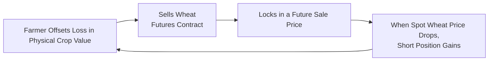
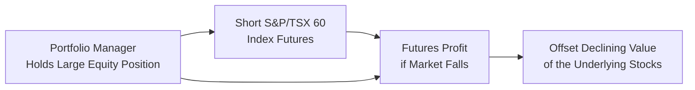

## 16.5 How to Use Futures Contracts to Reduce Investment Risk

Futures contracts are powerful financial tools you can use to protect (or “hedge,” in industry parlance) your portfolio against possible drops in asset prices, unexpected shifts in commodity costs, or even sudden stock market downturns. Before diving in, I’d like to talk about a friend of mine up in Saskatchewan—let’s call him Sam. He’s a wheat farmer, and for years, he’d fret about the price of wheat dropping right before harvest. One memorable season, Sam found himself facing a dipping market that hurt his income right when his crop was almost ready to sell. Eventually, a neighboring farmer mentioned that he should seriously look at wheat futures.

Sam’s story highlights something that investment managers see all the time: price risk. By using futures, Sam could have locked in a fair price for his crop, even when the market’s spot price threatened to fall below his break-even point. After he shifted into using wheat futures, he didn’t have to worry so much—he’d hedged the risk of price swings. In a similar way, large equity holders—maybe even you or your clients—can “short” equity index futures to protect against a market sell-off. Let’s unravel how this works, why it matters, and how to navigate some hidden pitfalls along the way.

---

### Understanding Futures Contracts

A futures contract is a legally binding agreement to buy or sell a particular underlying asset at a pre-agreed price on a specific date in the future. Assets can run the gamut from commodities like wheat, gold, or crude oil to financial instruments such as government bonds, foreign currencies, or stock market indices.

• Standardization. Futures contracts on regulated exchanges, such as the Montréal Exchange (https://www.m-x.ca/) in Canada or CME Group in the U.S., come with preset standardized features. These include the size of the contract, quantities deliverable, and delivery dates.

• Pricing. The contract’s price changes throughout the trading day, reflecting supply and demand as well as interest rates, storage costs, and other factors. If you’ve entered into a contract to sell wheat futures at $10 per bushel, you’re legally bound to deliver those bushels (or settle in cash, depending on the contract) at that price upon contract expiration (unless you close out or “offset” your position beforehand by entering the opposite transaction).

• Mark-to-Market. Unlike spot market transactions, futures expose you to daily profit-and-loss adjustments. Each day, your account is credited or debited based on that day’s price moves. If the contract you’re shorting falls in price, you receive a credit. If it rises, you face a debit and may need to top up your margin.

**Margin Differentiation Tip**: Many new futures traders mix up margin with a down payment, but it’s more like “collateral.” In futures trading, margin is typically a fraction of the full value of the contract. That makes futures highly leveraged instruments. Consequently, both potential gains and potential losses are amplified. However, it’s crucial to satisfy two kinds of margin:

• Initial Margin. The amount you need to deposit to open a futures position.  
• Maintenance Margin. The minimum account balance required to keep the position open. If your funds drop below that level, you’ll get a “margin call,” requiring you to add cash or risk having your position liquidated.

---

### Why Futures Contracts Reduce Investment Risk

“Locking in price” is the most straightforward concept behind futures hedging. Farmers, mining companies, or any business that procures raw materials can lock in a sale or purchase price. If the market goes against them (falling prices for a seller or rising prices for a buyer), the futures contract offsets the loss.

Consider Sam’s example: He’s worried about the potential dip in wheat price. If Sam short-sells wheat futures at $10 per bushel and the cash price later falls to $8 per bushel, his physical crop will fetch a lower spot price. Yet, the short futures contract he holds generates a profit of $2 per bushel (assuming perfect correlation for simplicity). In effect, Sam locks in $10. That’s powerful risk management.

This same approach (a short hedge) works if your client owns shares in a particular index, say the S&P/TSX 60, and is worried about a downturn. The investor can short index futures. If the market declines, any losses in the equity portion of the portfolio are (ideally) offset by gains on the futures position.

---

### A Quick Look at the Two Principal Hedge Types

• **Short Hedge**: This is commonly used by producers or investors who hold the underlying asset. Selling (shorting) futures means that if the spot price drops, your underlying asset’s value declines, but your futures position yields a gain. This can smooth out your net returns.

• **Long Hedge**: This is often used by users or consumers of a commodity or a financial instrument who will need to purchase the asset in the future. A good example is your local bakery needing to secure wheat for bread production. If the bakery is worried about price spikes, it can buy (go long) wheat futures. If the spot price rises, yes, the bakery pays more in the spot market, but its futures position makes a profit—again offsetting their total cost.

---

### The Mechanics in Action: Diagram of a Foolproof Hedge?

Well, “foolproof hedge” might be a stretch, but let’s illustrate how a short hedge tends to work using a simple Mermaid diagram:

• Step 1: Farmer (or commodity producer) short sells a wheat futures contract.  
• Step 2: Futures price and physical price are expected to move in tandem.  
• Step 3: If the actual spot price goes down, the farmer’s short futures position gains value.  
• Step 4: The gain in the futures contract helps offset the loss in physical inventory, thus stabilizing the farmer’s revenue.

---

### Equity Hedging with Futures

Now, let’s flip the scenario to equity markets. Suppose you manage a Canadian equity portfolio heavy in large-cap stocks that mirror the S&P/TSX 60. If you suspect a downturn is imminent (maybe the GDP outlook is weak or you see a major policy shift from the Bank of Canada), you could short an S&P/TSX 60 Index futures contract. If markets decline, the short futures position should, in theory, produce gains that counterbalance the portfolio’s stock losses.

Here’s a simplified illustration:

---

### Basics of Margin Requirements

Futures margin is a relatively small deposit—often around 3-12% of the contract’s notional value, though it can fluctuate based on market volatility. That’s dramatically lower than the full purchase price for a stock position, which can be 50% or more under standard margin rules, or 100% if no margin is used.

What does that mean for risk? Simple: amplified exposures. If your futures trade moves in your favor, your returns look fantastic, especially compared to the small margin outlay. (Yay, everything’s great, right?) But if it goes against you, the losses get magnified. That means you could be on the hook for margin calls that exceed your initial deposit. As an advisor, you want to keep a close eye on these daily price fluctuations—and your potential margin calls.

#### A Table Comparing Futures vs. Stocks

| Feature                  | Stocks                     | Futures Contracts                               |
|--------------------------|----------------------------|-------------------------------------------------|
| **Outright Ownership**   | Yes, partial share of a firm | No direct ownership of the underlying asset     |
| **Margin Requirements**  | Higher (up to 50% or more)  | Lower (3-12% typically)                         |
| **Leverage**             | Lower leverage             | Higher leverage, amplifying gains/losses        |
| **Settlement**           | T+2 (usually)                | Daily mark-to-market, final settlement at expiration |
| **Risk of Margin Calls** | Moderate                   | High, due to daily price fluctuations           |

---

### Mark-to-Market: A Double-Edged Sword

Futures are settled daily. This process, known as mark-to-market, means that your gains or losses are “realized” at the end of each trading day. If you have a short position in an equity index and the index soars, you’ll see an immediate debit from your account, and you may have to top up your cash to meet the maintenance margin. While daily settlement ensures your profits aren’t stuck in a multi-month limbo, it can also generate a flurry of margin calls if things don’t go your way. Be psychologically and financially prepared.

---

### Basis Risk: The Imperfect Hedge

One important concept many novices overlook is **basis risk**. Basis risk arises when the futures price and the spot price of the underlying asset fail to move in perfect sync. The difference between the spot price and the futures price at any time is called the “basis.” Even if prices generally track each other, the difference can widen or narrow unpredictably. That’s a key reason why no hedge is “perfect.”

• For Sam the wheat farmer, if the futures market becomes erratic—say there’s unexpected demand for near-term wheat deliveries—then the basis might shift. By harvest time, the spot-futures spread could distort, meaning Sam’s net hedged position deviates somewhat from the ideal scenario.

• For an equity manager, the basis might involve dividend yields or changes in interest rates that cause the futures to trade at a premium or discount to the spot index. The goal is still to offset risk, but you won’t always match up penny-for-penny.

---

### A Practical Numerical Example: Wheat Farmer Hedge

Imagine Sam expects 10,000 bushels of wheat from his harvest in three months. Wheat futures are trading at $10 per bushel, so Sam sells 2 futures contracts (each contract covering 5,000 bushels):

• Notional value per contract = $10 x 5,000 bushels = $50,000  
• Total notional value for 2 contracts = $100,000  

In reality, Sam just needs to post, say, $7,000 in initial margin. This is his real out-of-pocket cost. Three months later, the spot price is $8 per bushel. That means Sam’s physical wheat is worth $2 less per bushel—ouch. But his short futures position yields:

$$
\text{Profit} = (\text{Initial Futures Price} - \text{Final Futures Price}) \times \text{Contract Size}
$$

$$
= ( \$10 - \$8 ) \times 10,000 \, \text{bushels} = \$20,000
$$

This \$20,000 gain (minus transaction costs and slight basis risk) offsets the loss on his physical crop, effectively ensuring Sam nets \$10 per bushel for the wheat. The farmer’s underlying asset (his actual wheat) lost \$2 per bushel in the spot market, but the short futures made \$2 per bushel, balancing out overall.

---

### Daily Settlement and Margin Calls

If the price of wheat had instead soared to \$12, Sam’s short position would have lost \$2 per bushel. He would have faced a margin call to cover these losses. That’s why we say that leverage cuts both ways. If you’re not prepared for sudden margin calls, a futures hedge can become stressful.

As an advisor, you’ll need to highlight this to clients: If your margin deposit is too small, or if you don’t have liquid funds ready to meet a margin call, you could face forced liquidation. That defeats the hedge’s purpose, potentially leaving the underlying asset exposed.

---

### Regulatory Considerations in Canada

As of June 1, 2023, the Mutual Fund Dealers Association of Canada (MFDA) and the Investment Industry Regulatory Organization of Canada (IIROC) merged to form the Canadian Investment Regulatory Organization (CIRO). It oversees investment dealer and mutual fund dealer participants, plus the integrity of equity and debt marketplaces.

For futures trading, advisors in Canada should stay up to date with CIRO’s proficiency requirements, regulation, and guidelines. Allocating derivatives into a client’s portfolio typically requires special qualifications and a robust “know your product” approach. You must verify that the client’s risk profile and sophistication match the complexities of futures. While CIRO does not specifically exist to hamper your trading style, it does require that you handle derivatives responsibly and ensure your clients understand the risks.

The Canadian Investor Protection Fund (CIPF) is now Canada’s sole investor protection fund. Should a CIRO member firm become insolvent, CIPF helps protect client assets, including certain positions in futures. For more info, head to https://www.ciro.ca or https://www.cipf.ca.

---

### Cross-Border Reflections

In the U.S., futures are regulated by the Commodity Futures Trading Commission (CFTC). Canadians looking to trade U.S. futures might need to account for cross-border tax considerations, differences in contract specifications, and currency risks. Keep an eye on how the Canada-U.S. tax treaty or other bilateral trade agreements may affect the net returns from your futures positions. Also, differences in currency rates can create additional basis risk if you’re trading a U.S. dollar-denominated contract while your liabilities are in Canadian dollars.

---

### Potential Pitfalls

1. **Overleveraging**: Because margins are small, it’s easy to open big futures positions. If the market runs against you, the blow can be severe.  
2. **Margin Calls**: Missing a margin call can force liquidation when you least expect it.  
3. **Basis Risk**: Perfect hedges rarely exist. Be prepared for the possibility of small inefficiencies.  
4. **Monitoring**: Futures require daily supervision due to mark-to-market. If you’re used to buy-and-hold investing, you must adjust your monitoring habits.  
5. **Regulatory & Tax Complexities**: Each product type and location has unique rules. You’ll need to confirm compliance with CIRO in Canada or CFTC if trading in the U.S.  
6. **Costs**: Commission, exchange fees, and potential adverse “rollover” when you extend your futures hedge can eat into profits.

---

### Best Practices for Advisors and Investors

• **Set Clear Hedging Objectives**: Determine what portion of your portfolio you want to hedge and why. Over-hedging can lead to missed upside if the market rally catches you off guard.

• **Consider Hedge Ratio**: A 100% hedge covers all your underlying exposure, but partial hedges can be more flexible. Perhaps you only want to hedge 50% if you’re uncertain about the direction or timing.

• **Track Basis Risk**: Keep an eye on the spread between futures and spot prices. Adjust your hedge if the spread widens beyond historical norms.

• **Maintain Sufficient Margin**: If you’re using leverage, watch your account balance daily (or more). Avoid positions that put you at risk of margin calls you can’t handle.

• **Regulatory Compliance**: Check CIRO’s rules to ensure your proficiency in derivatives. If you’re an advisor, keep records of your client’s knowledge level and risk tolerance. You don’t want to improperly recommend advanced hedging strategies to novices.

• **Diversify**: Even with futures, diversification matters. Don’t rely solely on derivatives to mitigate your entire risk. Options, exchange-traded funds (ETFs), or dynamic asset allocation can also complement your hedging toolkit.

---

### Extra Tools and Resources

• **The Montréal Exchange (https://www.m-x.ca/)**: Offers in-depth guides, live data, and educational resources specifically tailored to Canadian futures trading.  
• **CIRO (https://www.ciro.ca/)**: The go-to for compliance and member regulation rules in Canada.  
• **CFTC (https://www.cftc.gov/)**: The U.S. commodity futures regulator, with plenty of beginner-friendly and advanced materials.  
• **CME Group**: Known for providing interactive learning about various futures products.  
• **Textbooks**:  
  - “Futures and Options Markets” by Colin A. Carter  
  - “Futures, Options, and Other Derivatives” by John C. Hull (a Canadian author with tons of practical info)  

---

### Conclusion

Futures contracts may initially seem mysterious—like some exotic financial wizardry—but in reality, they’re straightforward risk management tools that can lock in future prices, buffer your portfolio, and help ensure predictable outcomes. They do, however, come with their own complexities: margin calls, daily mark-to-market, and the pesky basis risk. By understanding these nuances and adopting a well-designed strategy, you can wield futures to fortify your portfolio against volatility in commodities, equities, or even interest rates.

Remember that your ultimate goal is to match your hedging strategy to your (or your client’s) financial situation, timeline, and risk tolerance. As Sam the wheat farmer discovered, a well-timed short futures position can preserve profitability and cut down on sleepless nights—thus letting you concentrate on harvest rather than fretting over daily price ticks. The same is true in financial markets: a thoughtful hedge helps you rest easier. Just be mindful of the margin calls!

---

## Test Your Knowledge on Using Futures Contracts to Reduce Investment Risk



### Which of the following best describes a futures contract?

- [x] A standardized legal agreement to buy or sell an asset at a set price on a future date
- [ ] A short-term loan to be repaid by a certain date
- [ ] A guarantee of unlimited profit in commodities
- [ ] An over-the-counter (OTC) private deal without regulations

> **Explanation:** A futures contract is standardized and traded on exchanges, meaning it's regulated and has defined delivery agreements. It’s not a private, unregulated, or unbounded profit arrangement.

### Which of the following scenarios exemplifies a short hedge using futures?

- [ ] A bakery buying wheat futures to protect against higher wheat prices
- [ ] A restaurant buying currency futures to lock in exchange rates
- [x] A wheat farmer selling wheat futures to lock in a future selling price
- [ ] An investor buying index futures to gain leveraged exposure to the market

> **Explanation:** A short hedge involves selling futures to hedge against potential declines. The wheat farmer locks in prices today, thus limiting downside from a drop in wheat market prices.

### What is the primary purpose of margin in a futures contract?

- [ ] To pay for the entire cost of the contract upfront
- [x] To serve as collateral for potential losses in the contract
- [ ] To avoid losses altogether
- [ ] To guarantee you can hold the contract without any additional cash

> **Explanation:** Margin acts as collateral, ensuring traders can meet losses that might arise from adverse price movements. It’s not purchasing the entire contract value; that’s part of the leverage advantage in futures.

### What does basis risk refer to in the context of futures contracts?

- [ ] The certainty that futures and spot prices will always move hand in hand
- [x] The risk arising from differences between spot prices and futures prices
- [ ] A guarantee that all hedges are perfect
- [ ] An interest charge for holding long positions

> **Explanation:** Basis risk highlights the possibility that the spot and futures price won’t move in perfect unison, creating a mismatch in your hedge.

### In a short hedge example, if the underlying asset price decreases and the futures price decreases simultaneously, the short futures position typically:

- [x] Gains value, partially or fully offsetting the spot asset’s loss
- [ ] Loses value, magnifying the spot asset’s loss
- [x] Generates an immediate margin call
- [ ] Is unaffected by market movements

> **Explanation:** When you hold a short futures position on an underlying asset you also own (or plan to sell), a decline in the spot price usually means the short futures gain value, compensating for the loss on the spot asset. (Note: You could still face margin calls over time if there are short-term price spikes before the net outcome.)

### Which of the following is a potential disadvantage of futures contracts for risk management?

- [ ] They allow you to lock in future prices
- [ ] They have relatively low margin requirements
- [x] They require daily mark-to-market and can trigger margin calls
- [ ] They are regulated by a national authority

> **Explanation:** While many features of futures are beneficial, daily mark-to-market settlement can lead to frequent margin calls, especially if the market moves against your position.

### How can an equity manager use equity index futures to hedge a large portfolio?

- [ ] By buying futures to gain more leverage
- [x] By shorting futures to protect against a market decline
- [x] By going long on currency futures to offset currency fluctuations
- [ ] By buying commodity futures to diversify

> **Explanation:** Typically, a manager holding a large basket of stocks may short an equity index future (like the S&P/TSX 60) so that if the market falls, gains on the short futures can offset stock losses. Meanwhile, currency futures could hedge currency risk if the portfolio has foreign exposures.

### Why might a futures hedge not be 100% effective?

- [x] Due to basis risk and possible changes in the relationship between spot and futures prices
- [ ] Because the futures exchange enforces a guaranteed perfect hedge
- [ ] Since higher margin always leads to lower risk
- [ ] Because regulators require partial hedging only

> **Explanation:** Basis risk can cause small mismatches between the futures position and the underlying asset. No rule or regulation enforces a perfect hedge.

### Imagine an investor is concerned about a potential drop in the TSX. Which statement is most accurate?

- [x] Short-selling TSX index futures could help offset losses if the market declines
- [ ] Buying TSX index futures is the only way to hedge
- [ ] This investor has no recourse but to sell all shares outright
- [ ] CIRO prohibits futures hedging in Canada

> **Explanation:** The most common hedge against a falling stock market is to short index futures, thereby offsetting potential losses in the underlying equity positions. CIRO certainly allows hedging by qualified professionals.

### True or False: Using futures for hedging eliminates all risk.

- [x] True
- [ ] False

> **Explanation:** This is a trick question—no derivative eliminates all risk. Futures reduce exposure to price movements in recognized ways, but they introduce other risks like basis risk, counterparty risk (albeit reduced on an exchange), and potential margin calls.


