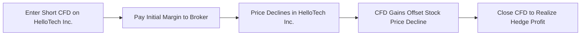

## 16.6 How to Use Contracts for Difference to Reduce Investment Risk

Contracts for Difference—often simply called CFDs—can be a powerful tool for both retail and professional investors who want to manage risk without buying or selling an underlying asset. If you’re wondering how, in a market where everything from stocks to gold can swing up or down in the blink of an eye, we can somehow keep our exposure in check using an instrument we never actually “touch,” then you’re in for a treat. Let’s dive into the key aspects of CFDs, understand how they reduce investment risk, and explore a few real-world examples (and, well, a few personal truths I’ve learned myself) along the way.

### Introduction and Basic Idea

I still remember the first time I heard about CFDs. A friend—who, incidentally, was brand-new to investing—told me, “So, you can bet on apple futures or Apple stock without actually owning an apple or an Apple share?” He was joking, but in a weird way, it’s not too far off. A Contract for Difference is a derivative allowing you to profit or suffer losses based on the price movement of an underlying asset without ever having direct ownership of it.

But why on earth would someone want that? Suppose you hold a pile of tech stocks. If the market hits a rocky patch, you might want to offset or hedge that exposure. Traditional tools include options and futures. CFDs are similar, except they are often traded over-the-counter (OTC) with brokers or specialized CFD providers. In these transactions, you (the client) and the CFD provider agree on an opening price of the CFD. When you close out the contract, the difference between the opening price and the closing price is cash-settled—hence the name “Contract for Difference.”

### Leveraged Instruments and Hedging Advantages

One of the big draws with CFDs is leverage. If you’re new to margin lingo, “leverage” simply means controlling a larger investment with relatively small upfront capital. For instance, you might be required to post only 10% of the trade’s notional value as margin. Smaller capital outlay can mean big returns if the market moves in your favor. Of course, the flip side is that if Mr. Market turns against you, losses can be magnified just as quickly. It’s no surprise that regulators worldwide, including Canada’s provincial securities regulators, keep a close eye on CFD offerings.

Why do investors use CFDs to manage risk? In a nutshell, you can go short more easily with a CFD than with many other instruments. Let’s say you hold substantial equity positions in your client’s portfolio—positions that you’re worried might decline in the near term. One approach is to enter a short CFD on the same stock or a correlated market index. If the stock price declines, losses from the actual share holdings may be partially or fully offset by profits on the CFD position.

In other words, you’re using a short CFD as a hedge. In an ideal scenario, the gain on the CFD could balance out losses on your underlying shares, effectively reducing your net risk. But remember: leveraged instruments can produce volatility in your account faster than you might expect.

### Key Use Cases

• Hedging Equity Exposure. Let’s say you own 1,000 shares of BigCanadianBank Inc. (a fictional bank, but let’s pretend it’s huge, well-known, and a stable part of your client’s portfolio). There’s some tricky economic data on the horizon, and you’re concerned about a short-term slump in the banking sector. You could open a short CFD on 1,000 shares of BigCanadianBank Inc. If the bank’s stock falls by 5%, your short CFD position gains roughly that 5%, offsetting the loss in the physical shares.

• Anticipating Market Needs. Perhaps you know that, two months down the line, you’ll need to buy more shares of a commodity producer for your clients. You’re worried that commodity prices might rise, making those shares more expensive. One strategy is to open a long CFD position now, effectively locking in the current price. If the underlying commodity producer’s share price goes up, your CFD gains can offset your higher cost when you actually purchase the shares.

• Hedging a Basket of Assets. Some investors use CFDs on an index—like a broad-based equity index—to hedge a whole basket of holdings. If you anticipate a dip in the overall market, a short index CFD can help cushion potential losses across your portfolio.

### Counterparty Risk and Regulatory Environment

Because CFDs are often traded over-the-counter, your primary relationship is with the CFD provider itself. That means counterparty risk is important: if your broker or provider experiences a liquidity crunch or goes under, your open positions might be at risk. As a result, it’s super important to deal only with reputable, well-capitalized CFD providers. In Canada, the Canadian Investment Regulatory Organization (CIRO) oversees compliance matters for registered investment dealers and marketplace integrity. Keep up to date on their bulletins regarding OTC derivative products—particularly for any constraints or guidelines around retail-facing CFD promotions.

You should also check the relevant provincial regulator in your jurisdiction. The Ontario Securities Commission (OSC), the Autorité des marchés financiers (AMF) in Quebec, and other provincial authorities provide guidance on how CFDs can be marketed and sold. If you’re acting in an advisory role, you must ensure everything you do is in line with these rules. And if you do mention IIROC or MFDA in historical contexts, remember that they have been amalgamated into CIRO since January 1, 2023.

### Transaction Costs That Can Erode Returns

When you’re just getting started with CFDs, you might think, “Great, so if I short a CFD on my stock, I’ll be cushioned perfectly from any downward movement.” But don’t forget the costs. Typical expenses associated with trading CFDs can include:

• Spreads. The difference between the bid and ask price might be wider than in the underlying market, especially if it’s a thinly traded CFD.
• Commissions. Some CFD brokers charge commissions on each trade. Depending on the broker, these can be a flat fee or based on trade volume.
• Overnight Financing. If you hold a position overnight, the broker might debit or credit your account based on the interest rate differential. This is sometimes called the “swap” or “rollover” fee. If you keep the position for multiple days or weeks, the financing cost can add up quickly.
• Potential Administrative Charges. Some CFDs might carry special adjustments, like dividend adjustments, especially for equity CFDs.

In short, if the daily financing or cost of carry is too high, your returns could be consumed by fees, particularly in sideways or slowly moving markets. Don’t forget to keep an eye on those quotes for “buy” and “sell” (or “offer” and “bid”) because if the spread is large, your hedge might not be as cost-effective as you hope.

### Practical Example with a Diagram

Let’s imagine you’ve got a technology stock in your client’s portfolio—call it HelloTech Inc. You expect a short-term drop and want to keep your shares for the dividend or for long-term capital gains. Instead of selling the stock, you open a short CFD for risk management.

Below is a simple flowchart to show how a CFD transaction might unfold:

• Step 1: You enter a short CFD for 100 shares of HelloTech Inc. at, say, CAD 50/share.  
• Step 2: You post an initial margin, maybe 10% (CAD 500).  
• Step 3: Over the next two weeks, HelloTech Inc.’s share price slides to CAD 45.  
• Step 4: Your short CFD position gains roughly CAD 5 per share (about CAD 500 total), counteracting the unrealized loss on your actual shares.  
• Step 5: You close the CFD position, capturing the hedge PnL.  

In your actual portfolio, your HelloTech Inc. position has fallen in value by the same CAD 500. So, effectively, you have (roughly) net zero gain or loss on the combined positions—helping you ride out the dip without losing your shirt. Sure, you’re going to pay some commissions and financing costs over that period. That’s the “price” of your insurance, so to speak.

### The All-Important Matter of Suitability

Before recommending CFDs, you actually need to think: “Is this something my client can handle?” Because, let’s be real, while CFDs have that “hedging magic,” they can also produce hair-raising losses if used incorrectly. If the market swings in the opposite direction of your short or long CFD, you could face a margin call. That’s when your broker basically says: “Hey, your account equity is no longer sufficient. We need some fresh funds here, or we’ll close your position.” And that can happen quickly.

For that reason, it’s crucial to ensure that leveraged products match the client’s risk tolerance, risk capacity, and overall goals. If you’re not sure about their risk profile, reference earlier sections of this book, particularly the chapters on Understanding a Client’s Risk Profile (Chapter 2) and Managing Your Client’s Investment Risk (Chapter 16) in general. Don’t skip those steps. Even highly sophisticated clients can be caught off guard by volatility. So tread carefully and keep an open, well-documented record of your rationale.

### Best Practices and Common Pitfalls

• Know Your Broker. Check the creditworthiness, licensing, and reputation of the CFD provider. If they’re not properly registered or regulated, you might be in for a nasty surprise if something goes awry.  
• Start Small. If you or your client have never used a CFD, it’s wise (like, unbelievably wise) to start with a small position or a demo account. Many brokers in Canada and elsewhere offer practice accounts for paper trading.  
• Monitor Margins. Because of the leverage factor, your required margin can fluctuate. Price movements can trigger margin calls. Keep an eye on your free cash in the account.  
• Understand Fees. Spreads, commissions, and overnight financing can make or break your hedge. Do the math or ask your broker for a cost breakdown before entering the trade.  
• Be Wary of Over-Hedging. Hedging is great, but if you constantly hedge every small movement, you might lock yourself into high fees or miss out on potential gains if the market recovers.  
• Regulatory Compliance. In Canada, check out CIRO bulletins and your provincial securities commission’s guidelines on permissible leverage limits, disclosure rules, and marketing best practices for CFDs.

### Table: Comparing Direct Ownership to Using CFDs for Hedging

| Aspect                   | Direct Stock Ownership                  | CFD Position (Short or Long)                                              |
|--------------------------|-----------------------------------------|---------------------------------------------------------------------------|
| Ownership                | Full ownership, voting rights           | No underlying ownership, no voting rights                                |
| Capital Outlay           | Pay full share price                    | Pay margin, can be as low as a fraction of notional value                |
| Leverage                 | Typically none (unless margin is used)  | High leverage typically offered                                          |
| Transaction Costs        | Brokerage commissions, potential ECN fees | Spreads, CFD commissions, overnight financing                           |
| Dividends                | Receive dividends (if you’re long)      | May require adjustments; short positions might need to pay dividend equivalents |
| Short Selling            | Must find shares to borrow (if allowed) | Straightforward to go short via CFD                                      |
| Regulatory Considerations| Standard securities regulations         | Additional disclosure, margin requirements, and counterparty risk considerations |

### Personal Reflections

I confess, the first time I tried hedging a small position with a CFD, I froze up when my broker’s margin call popped up on my screen. The market had jumped in the opposite direction. I realized quickly that I needed to have proper risk controls in place—like a stop-loss or enough free cash to ride out the volatility. So one piece of heartfelt advice: if you’re new to leveraging CFDs, keep your position sizes modest. They can be super helpful but can also be super stressful if used too loosely.

### Tools and Resources

If you’re comfortable with coding and open-source analytics, you might consider tools like Python combined with libraries such as QuantLib for advanced CFD pricing simulations. Be sure to check the appropriate licensing constraints for commercial use. Big consolidated terminals such as Bloomberg or Refinitiv Eikon can provide robust data if your firm has them.

For further reading:  
• “Mastering CFDs: A Step-by-Step Guide to Strategies for Trading CFDs” by David James Norman  
• For broker comparisons or details on CFD practice accounts, check out reputable financial sites or the websites of major dealers like Interactive Brokers or TD Direct Investing.  
• For official, recognized trainings, you can look into trainer-led CFD seminars or derivative product courses through recognized institutions like the Canadian Securities Institute (CSI) or compliance sessions with CIRO.  
• Provincial regulators such as the Ontario Securities Commission (OSC) or Autorité des marchés financiers (AMF) provide relevant rules on margin and disclosures, so do your homework.

### Glossary

• Contract for Difference (CFD): A derivative instrument allowing you to profit (or lose) from price movements in an underlying asset without owning it.  
• Leverage (CFDs): Use of margin or borrowed capital to increase exposure, amplifying both gains and losses.  
• Counterparty Risk (CFDs): The risk that the CFD provider might fail to meet contractual obligations (e.g., due to insolvency).  
• Overnight Financing: The charge or credit applied to your CFD position if held overnight, reflecting the interest rate environment.  
• Short Position: A trade setup that profits from a drop in the asset’s price.  
• Long Position: A trade setup that profits from a rise in the asset’s price.  
• Over-the-Counter (OTC): A market where instruments are traded directly between parties rather than on a centralized exchange.  
• Margin Call: A broker’s request for additional capital to maintain a leveraged position when equity falls below a required threshold.

### Conclusion

Contracts for Difference can be a worthwhile part of your toolkit if you need to reduce investment risk, hedge positions, or gain temporary speculative exposure to specific markets. The ability to go short without the complexities of borrowing shares makes CFDs attractive, but the leverage involved can quickly magnify gains and losses. The regulatory environment in Canada—governed by CIRO and provincial securities commissions—requires that advisors and investors alike fully understand product risks, suitability requirements, and the nuances of each broker’s terms.

Ultimately, the key to using CFDs effectively is knowledge. Keep your eyes wide open to transaction costs, margin requirements, and your CFD provider’s stability. Combine them with robust risk management strategies, and you’ll have a flexible hedge for your portfolio. Misuse them, and you could face more risk than you bargained for. Proceed wisely.

---

## Test Your Knowledge: Contracts for Difference (CFD) and Risk Management



### Which of the following best describes a Contract for Difference (CFD)?

- [ ] A short-term bond that pays fixed interest.
- [x] A derivative that allows you to profit (or lose) from price changes without owning the underlying asset.
- [ ] An insurance product that guarantees against any losses on a stock.
- [ ] A direct share purchase in the underlying company.

> **Explanation:** A CFD is a derivative contract that tracks price movements without requiring ownership of the underlying asset. It settles in cash based on the difference in price between opening and closing the position.

### Why might an investor choose to open a short CFD position on a stock they already own?

- [x] To hedge against a near-term decline in the stock’s price.
- [ ] To double their overall exposure in the same direction.
- [ ] To avoid transaction costs in the spot market.
- [ ] Because short CFD positions are always profitable.

> **Explanation:** A short CFD can offset losses if the stock price declines. It’s a hedge strategy to manage downside risk. However, it doesn’t guarantee profits.

### What is the primary regulatory consideration when dealing with CFDs in Canada?

- [ ] There are no regulations for CFDs in Canada.
- [ ] CFDs must be traded on a public exchange.
- [x] CFDs are subject to CIRO requirements and provincial securities legislation.
- [ ] CFDs are entirely prohibited for all Canadian residents.

> **Explanation:** CFDs fall under the oversight of CIRO and provincial regulators (e.g., OSC, AMF). These bodies set rules and can impose restrictions on selling or marketing CFDs to retail investors.

### Which of the following is a key disadvantage (and potential hazard) of CFD trading?

- [ ] Full ownership in the underlying asset.
- [x] Leverage magnifying potential losses.
- [ ] Guaranteed returns due to interest rate parity.
- [ ] Eliminating all market risk.

> **Explanation:** The leverage inherent in CFDs can quickly magnify losses. If your trade moves against you, the losses can be larger than your initial margin.

### Which costs are typically associated with holding CFD positions overnight?

- [x] Overnight financing charges.
- [ ] Government bond coupons.
- [x] Spread and possibly commission fees.
- [ ] No costs at all if positions are closed intraday.

> **Explanation:** CFD positions may carry overnight financing charges, plus any spread or commission fees applied by the broker. Closing your position intraday might avoid the overnight financing cost.

### Which statement about counterparty risk in CFDs is correct?

- [x] It’s the risk that the CFD provider might fail.
- [ ] It doesn’t exist because CFDs settle daily.
- [ ] It’s only relevant for exchange-traded CFDs.
- [ ] It’s guaranteed by the Canadian government.

> **Explanation:** Since most CFDs are over-the-counter products, the provider’s creditworthiness matters. If they become insolvent, you may not be able to realize gains or retrieve initial collateral.

### How can a short CFD position be used effectively in a portfolio?

- [x] It can hedge against a potential drop in prices.
- [ ] It guarantees a profit whenever prices fall and locks in the full upside.
- [x] It can offset losses on the underlying asset.
- [ ] It eliminates the need for initial margin.

> **Explanation:** Short CFDs can offset portfolio losses by generating gains while the underlying asset’s price declines. Of course, you need margin to enter the CFD position.

### What is the main difference between direct stock ownership and a CFD long position?

- [x] With direct stock ownership, you have voting rights; with a CFD, you do not.
- [ ] You pay no commissions with direct stock ownership.
- [ ] CFDs always require more capital than owning the stock fully.
- [ ] CFD holders are entitled to more dividends than shareholders.

> **Explanation:** Owning the shares provides you with certain shareholder rights, such as voting and dividends (directly). CFDs only track price movements and dividends are handled through cash adjustments, not actual dividend payouts to the contract holder.

### Why might an advisor recommend caution with CFDs to a new or risk-averse client?

- [x] Because margin calls can occur rapidly if losses mount.
- [ ] CFDs have no spreads or fees.
- [ ] The technology to trade CFDs is untested.
- [ ] They are only legal in offshore jurisdictions.

> **Explanation:** The use of leverage can result in fast and large losses, triggering margin calls. Advisors typically would ensure clients understand these risks fully.

### A hedge using CFDs involves:

- [x] True
- [ ] False

> **Explanation:** A hedge using CFDs involves entering positions (often short) that offset potential losses in the underlying portfolio.  


