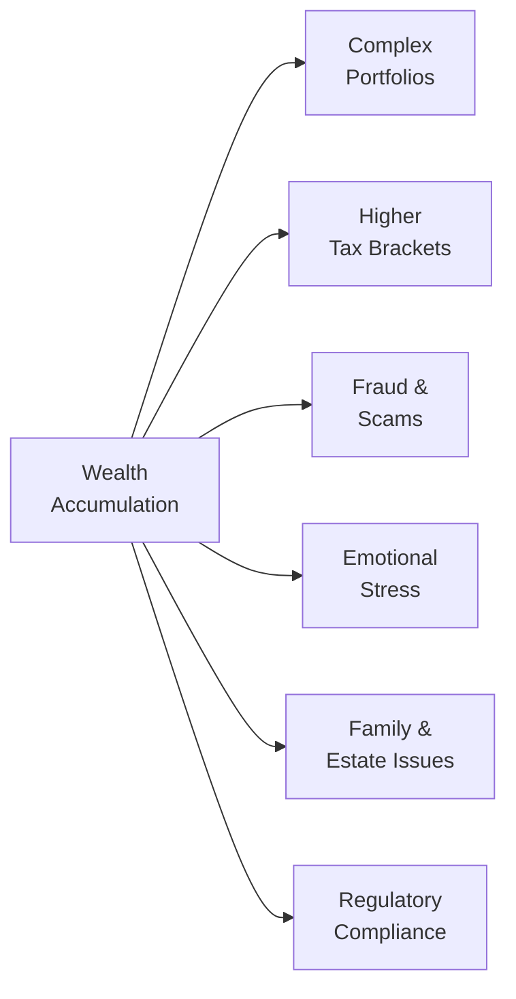

## 17.1 The Burdens of Wealth Accumulation

Wealth accumulation is often viewed in quite a positive light—after all, who wouldn’t want more resources to safeguard their future, support their family, or give generously to philanthropic causes? But, as someone once told me over coffee, “The more you have, the more you have to lose. And that can be pretty overwhelming.” In other words, as your assets and investment capital grow, so do the potential complexities and obligations. Wealth can impose a number of unique burdens involving complex tax rules, estate planning intricacies, emotional strains, family dynamics, and increased exposure to fraudulent schemes.

This section dives into these burdens of wealth accumulation in comprehensive detail. We’ll look at how high net worth (HNW) individuals and families are impacted both financially and psychologically by their expanding portfolios—and why wealth can sometimes feel like more of a challenge than a windfall.

---

## Understanding the Nature of “Burdens”

When we talk about the “burdens” of wealth, we aren’t suggesting that wealth is inherently negative. Rather, it means that once you cross certain financial thresholds, all sorts of new considerations arise:

• Your annual tax filing may become more complicated, with additional forms or schedules.  
• You may find yourself subject to higher fees or legislative surcharges in certain investment accounts.  
• Safeguarding your assets from fraud or investment scams might require more vigilance.  
• You might face pressure (psychological or social) to generously support family members or philanthropic causes.  

The Canadian Investment Regulatory Organization (CIRO), formed in 2023 from the merger of the defunct MFDA and IIROC, expects its Approved Persons (financial advisors, investment dealers, and mutual fund dealers) to fully understand these complexities when advising clients. Maintaining compliance and ensuring proper oversight are especially key for wealthier clients, who may hold sophisticated or relatively illiquid assets, such as private equity placements or derivative instruments (see Chapter 2 for more on risk profile considerations).

---

## Complexity in Portfolio Construction

Let’s say you started saving in your early twenties, diligently pouring surplus cash into a couple of well-chosen mutual funds or exchange-traded funds (ETFs). As your income grew, you opened additional brokerage accounts, purchased real estate, or ventured into digital assets. Over a few decades, your portfolio might start to look like something of a “patchwork quilt” of financial products. The bigger it gets, the more complicated it becomes.

Some specific complexities include:

• Diversification Across Multiple Asset Classes: HNW investors often have equities, fixed income, real estate, private equity deals, hedge funds, digital assets, and even collectibles. Managing correlations and risk exposures across these categories can be truly daunting.  
• Global Holdings: Many affluent individuals pursue international investment opportunities (see Chapter 14 on International Investing). This can involve currency risk, political risk, varying regulations from jurisdiction to jurisdiction, and additional tax reporting.  
• Legal Structures and Trusts: Trusts and holding companies are often used for asset protection and estate planning, adding layers of legal and administrative complexity.  

Those expansions in your portfolio require specialized knowledge—both on your part and on the part of any advisors you consult. The more you expand into sophisticated or unconventional instruments, the more you need a team of professionals—ranging from tax lawyers to specialized portfolio managers—to keep your finances running smoothly.

---

## Elevated Tax Concerns

One of the more immediate burdens high net worth individuals face is taxation. In Canada, once your income surpasses certain thresholds, you may be placed into higher tax brackets. This means:

• More tax owing on each additional dollar of income as you climb higher on the marginal rate scale.  
• Potential surcharges or alternative minimum taxes might come into play, depending on the nature of your income.  
• Extra filing obligations or the need to file in multiple jurisdictions if you own property, companies, or other assets abroad.

A common phenomenon is the “tax bracket surprise”—where the net amount you get to keep after crossing a bracket is significantly less than anticipated. Furthermore, HNW investors often generate multiple flavors of income, such as dividends, capital gains, interest, rental income, and business income, all of which may be taxed differently (see Chapter 17.2 for tax-minimization portfolio approaches).

For official guidelines on tax regulations, you can refer to the Canada Revenue Agency (CRA) at:
[https://www.canada.ca/en/revenue-agency.html](https://www.canada.ca/en/revenue-agency.html)

---

## Estate Planning and Intergenerational Wealth Transfer

Hand in hand with the complexity of portfolio construction, large estates demand thoughtful estate planning and intergenerational wealth transfer strategies. Estate planning is the process of organizing your finances and legal documentation in a way that ensures a smooth distribution of your assets after death, be it to heirs, charities, or other parties you designate. 

Estate planning can include:

• Writing a will that outlines the distribution of real estate, investments, personal property, and other assets.  
• Creating trusts to reduce probate fees, minimize taxes, or protect assets from creditors and lawsuits.  
• Setting up power of attorney for personal care or for property, so someone can manage your affairs if you become incapacitated.  
• Considering philanthropic intentions by establishing a charitable foundation or donor-advised fund.

Intergenerational wealth transfer refers to the actual passage of assets from one generation to the next. This transfer can be intricate because the more wealth there is, the more likely your heirs may need guidance and education on how to manage it. You may also face sensitive decisions, such as how to structure inheritance to avoid family conflicts. For instance, you might decide that each child receives the same share, or you might structure it so that one child who’s deeply involved in your family-owned business inherits more of that entity’s shares.

If you’re looking for an in-depth resource, the book “Estate Planning in Canada” by Kevin Wark offers detailed strategies, while the Canadian Investor Protection Fund (CIPF)—now the sole protection fund for investment accounts in Canada—can safeguard assets held with member firms if insolvency occurs.

---

## Vulnerability to Fraud and Scams

I once knew a friend of a friend—let’s call him Vijay—who came into a sizable inheritance in his mid-40s. He was a personable, friendly guy and wasn’t afraid to network with new people. But as word of his fortune spread among his acquaintances, Vijay noticed something surprising: the number of “investment opportunities” flooding his inbox suddenly skyrocketed. 

Wealthy individuals are prime targets for scammers and unscrupulous operators. Common scams include:

• Ponzi Schemes: Fraudsters pay existing investors with funds collected from new investors instead of actual profit from allocations.  
• Phishing Attacks: Emails and phone calls that appear legitimate but aim to steal credentials or personal data.  
• Bogus Real Estate Ventures: Questionable property deals that turn out to be worthless or riddled with hidden liabilities.  

The best defense? Vigilance and, frankly, a lot of healthy skepticism. Always ensure that you (or your advisor) can verify an opportunity’s legitimacy. Use official regulatory resources—like [https://www.ciro.ca](https://www.ciro.ca)—to check if a broker or dealer is registered and in good standing.

---

## Emotional and Psychological Burdens

The financial side of wealth accumulation gets most of the headlines, but the psychological aspects can be just as significant. When you have more to protect, you may experience increased stress and anxiety—particularly about market downturns or global pandemics that threaten your nest egg. Anxiety can lead to insomnia, tension at home, or even panic selling.

Additionally, wealth often comes with heightened social expectations. You might feel compelled to maintain a certain lifestyle or status among peers and family. Or, you might feel guilty for not sharing more of your wealth with loved ones who are struggling financially.

Another subtle but real phenomenon is the “fear of losing it all.” As your wealth grows, the idea of blowing it can be terrifying. In some cases, individuals are triggered to invest in overly conservative assets out of fear, missing out on potential higher returns. In other cases, they might jump into risky opportunities hoping to sustain or accelerate wealth growth. Balancing these emotional impulses can require professional psychological or financial guidance. The Journal of Wealth Management article “Managing the Emotional Dimensions of Wealth” dives deeper into coping strategies and the role financial therapy can play.

---

## The Role of Regulatory Oversight

Because HNW investors often deal with complex products—like derivative contracts (Chapter 16), private equity funds (Chapter 13), or advanced tax shelters—complying with regulatory guidelines can feel cumbersome. However, robust regulations exist largely for investor protection and market integrity.

CIRO enforces rules and regulations that help prevent unethical behavior and protect client interests. For the typical wealthy investor, this might mean:

• Increased “know your client” (KYC) procedures from advisors to ensure you’re suitable for more sophisticated products.  
• Transparency and disclosure requirements when dealing with leveraged or derivative strategies (see also Chapter 3 on Asset Allocation Strategies).  
• Strict guidelines around how dealers can market private placements or alternative investments.  

Yet, regulatory compliance can be a two-way street: HNW individuals sometimes find themselves needing to provide more personal financial information and documentation before advisors can proceed with certain trades or products. It can feel like a hassle, but the outcome is generally a safer and more transparent marketplace.

For more on how Canada’s regulatory environment supports investor protection and financial stability, consider exploring the Financial Consumer Agency of Canada (FCAC) at [https://www.canada.ca/en/financial-consumer-agency.html](https://www.canada.ca/en/financial-consumer-agency.html).

---

## Shifting Family Dynamics and Philanthropic Obligations

Let’s shift the conversation to family and social matters, which can get, well, complicated. High net worth families might meet with friction among siblings or extended relatives over inheritance, business leadership, or philanthropic directions. Even if everyone has good intentions, differences in financial philosophies and personal goals can create contention.

Philanthropy also becomes a bigger consideration. Many wealthy individuals feel a sense of responsibility to “give back.” This can lead to establishing charitable foundations, extensive volunteering, or large donations to specific causes. While it’s rewarding, philanthropic involvement adds another layer of complexity to time management and financial oversight. Some wealthy families create philanthropic committees to decide how and where donations should be made, essentially running their own mini “foundation board.”

---

## Strategies and Tools for Managing These Burdens

Wealthy or not, we’re all just people trying to navigate life’s complexities. Fortunately, there are practical steps for managing the burdens that come with increased wealth.

• Diversify But Simplify: While diversification is important, aim to keep your portfolio manageable by consolidating holdings where feasible. Too many accounts or platforms can lead to confusion.  
• Leverage Technology: Employ portfolio management software or online dashboards to track your assets, returns, and tax implications in real time.  
• Seek Professional Guidance: Align yourself with a competent advisory team—tax accountants, estate lawyers, and financial advisors who comprehend the intricacies of HNW investing.  
• Formalize a Wealth Plan: Written strategies that outline your financial goals, risk tolerance, estate planning intentions, and philanthropic wishes can help keep everything aligned.  
• Educate Yourself and Your Heirs: Encourage family members to learn about managing wealth responsibly. Communication and education can fend off misunderstandings and disputes.  
• Prioritize Personal Wellbeing: Recognize that wealth can come with high emotional stress. Many wealthy families find that engaging in counseling or wealth-therapy sessions fosters healthier relationships and lowers anxiety.  

If you’d like a more structured learning path, the “Advanced Retirement Management Strategies” online course by CSI provides insights about tax and legal complexities relevant to wealth accumulation.

---

## A Real-World Scenario: Sudden Wealth Through a Business Sale

Imagine a scenario: Brianna, a 54-year-old Canadian entrepreneur, sells her tech startup for CA$25 million. Before this, her net worth was modest, consisting of a retirement account, a mortgage-free home, and a few well-chosen stocks.

Suddenly, Brianna’s world changes. She now must consider:

1. Major Tax Events: Capital gains on the sale. She consults with her accountant on strategies like lifetime capital gains exemptions, but her net proceeds still push her to an elevated tax bracket.  
2. Estate Restructuring: She establishes a holding company and a family trust to effectively manage wealth distribution, particularly with her two adult kids in mind.  
3. Emotional Pressure: Friends and extended family come knocking, hoping for business investments or outright gifts. She experiences guilt and stress over how to handle these requests.  
4. Regulatory Scrutiny: Brianna’s new investment advisor requires thorough KYC updates and risk profile adjustments, as she now qualifies for “accredited investor” status, exposing her to private equity deals and hedge funds that previously weren’t on the table.  

By assembling a team of advisors—accountants, estate lawyers, a seasoned investment manager, and even a family therapist—Brianna manages to chart a stable course. She invests part of her new wealth into a diversified mix of equities, bonds, and alternatives and sets aside a philanthropic budget that aligns with her personal passions in environmental causes.

---

## Visualizing the Complexity of Wealth Accumulation

Below is a simplified Mermaid.js diagram illustrating some of the components that feed into the burdens of wealth accumulation. Each node represents a critical factor you might face as your wealth grows.

• “Complex Portfolios” can lead to an overwhelming array of choices and correlations.  
• “Higher Tax Brackets” involves greater tax obligations and the need for sophisticated strategies.  
• “Fraud & Scams” multiply as malicious actors target you.  
• “Emotional Stress” often grows with the responsibilities of preserving a higher net worth.  
• “Family & Estate Issues” encompass managing beneficiary expectations, philanthropic goals, and generational differences.  
• “Regulatory Compliance” underscores the increased scrutiny and legal obligations you might face.

---

## Best Practices and Conclusion

Yes, wealth can be a blessing with strings attached, but many strategies and resources exist to help you handle the responsibilities. By focusing on education, technology, and assembling a network of reputable experts, you can alleviate much of the anxiety and complexity that comes with being “asset-rich.”

Time and again, one of the strongest themes is prevention: staying informed, doing regular compliance checks, verifying the integrity of potential investments, and communicating openly with your advisors and family. The Financial Consumer Agency of Canada offers resources on managing money, taxes, and financial planning for Canadians of all income levels.

To conclude, the burdens of wealth are real, but they can be effectively managed. Recognize that wealth, in many ways, is a resource meant to serve your life goals, not the other way around. With proper planning, ongoing education, and the right professional guidance, you can embrace the opportunities that wealth offers—while minimizing its burdens.

---

## Glossary Highlights

• High Net Worth (HNW) Investor: An individual or family with substantial investable assets, often over $1 million and sometimes measured by more stringent thresholds.  
• Intergenerational Wealth Transfer: Passing assets from one generation to the next, potentially involving trusts and complex legal mechanisms.  
• Estate Planning: Organizing and documenting how an individual’s assets will be preserved, managed, and distributed after death.  
• Philanthropy: Donating money, time, or resources to charitable causes as a way to benefit society.  
• Financial Fraud: Deceptive practices—like Ponzi schemes or phishing attacks—that aim to illegally acquire someone’s money or property.  
• CIRO (Canadian Investment Regulatory Organization): Canada’s self-regulatory body overseeing investment firms and market integrity.  
• CIPF (Canadian Investor Protection Fund): Canada’s sole investor protection fund, ensuring client assets are covered if a member firm collapses.

---

## References & Further Exploration

• CIRO Website: [https://www.ciro.ca](https://www.ciro.ca)  
• Canada Revenue Agency (CRA): [https://www.canada.ca/en/revenue-agency.html](https://www.canada.ca/en/revenue-agency.html)  
• Financial Consumer Agency of Canada (FCAC): [https://www.canada.ca/en/financial-consumer-agency.html](https://www.canada.ca/en/financial-consumer-agency.html)  
• Book: “Estate Planning in Canada” by Kevin Wark  
• Online Course: CSI’s “Advanced Retirement Management Strategies”  
• Article: “Managing the Emotional Dimensions of Wealth” in the Journal of Wealth Management  

These resources will guide you further into the technicalities of taxation, regulation, estate planning, and the psychological or emotional facets of wealth accumulation and management. Enjoy your reading and, as always, stay curious and proactive when making investment-related decisions.

---

## Test Your Knowledge: The Burdens of Wealth Accumulation



### Which of the following is a major tax concern for individuals who reach higher income brackets?
- [ ] Reduced reporting obligations
- [x] More complex tax filing requirements
- [ ] Fewer surcharges and fees
- [ ] No connection to capital gains
> **Explanation:** As individuals move into higher income brackets, they often face additional filing obligations, potential surcharges, and more intricate forms of income to report.

### What is one primary driver behind elevated stress levels relating to accumulated wealth?
- [ ] Lack of investment opportunity
- [ ] Decrease in regulatory scrutiny
- [x] Fear of losing a large asset base
- [ ] Decline in estate planning needs
> **Explanation:** A common fear among high net worth individuals is the possibility of losing what they’ve built. This can trigger anxiety and overly conservative or risky investment decisions.

### In Canada, which organization enforces rules and guidelines to protect investors, including high net worth individuals?
- [ ] The Mutual Fund Dealers Association
- [ ] The Investment Industry Regulatory Organization of Canada
- [x] The Canadian Investment Regulatory Organization (CIRO)
- [ ] Canada Pension Plan Investment Board
> **Explanation:** CIRO is Canada’s national self-regulatory body formed by the merger of MFDA and IIROC. It oversees investment dealers, mutual fund dealers, and market integrity.

### Why might a wealthy individual consider using trusts or holding companies as part of their estate plan?
- [ ] To completely eliminate all taxes
- [ ] To avoid using a will
- [x] To reduce probate fees and provide asset protection
- [ ] To stop all intergenerational wealth transfers
> **Explanation:** Trusts and holding companies can help reduce probate fees, provide better liability protection, and streamline intergenerational wealth transfers.

### Which emotional burden is commonly cited by high net worth individuals?
- [ ] A feeling of boredom and apathy
- [ ] A fear that they will be taxed too little
- [x] Anxiety about market downturns and preserving capital
- [ ] Reduced family obligations
> **Explanation:** As wealth grows, individuals often worry more about market volatility and their ability to protect the capital they’ve accumulated.

### Which of the following is a recommended strategy for managing the burdens of wealth accumulation?
- [x] Consolidate accounts where possible to prevent fragmentation
- [ ] Acquire as many small accounts with different advisors
- [ ] Hide assets to avoid taxes
- [ ] Restrict communication with family and heirs
> **Explanation:** Consolidating accounts can simplify portfolio management, provide clearer oversight, and reduce administrative burdens.

### According to the text, why might wealthy individuals be more prone to fraudulent schemes?
- [ ] They have lower financial literacy
- [ ] They typically have no investment advisors
- [x] Scammers see them as lucrative targets with more money to steal
- [ ] They are fully protected by CIRO from all fraud
> **Explanation:** Wealthy individuals can draw attention from scammers, who realize the potential for larger payouts from HNW targets.

### How can philanthropic activities contribute to the burdens of wealth accumulation?
- [ ] By eliminating all tax benefits
- [ ] By removing the need for any financial advisors
- [ ] By preventing the creation of family trusts
- [x] By placing additional obligations on time, money, and decision-making
> **Explanation:** Philanthropy is often fulfilling, yet it can increase demands on a wealthy individual’s time and require careful strategic planning regarding large-scale donations.

### Which government agency in Canada provides official guidelines and resources on taxes, including those related to high net worth individuals?
- [x] The Canada Revenue Agency (CRA)
- [ ] The Canadian Investor Protection Fund (CIPF)
- [ ] Financial Industry Regulatory Authority (FINRA)
- [ ] Canada Deposit Insurance Corporation (CDIC)
> **Explanation:** The CRA is responsible for administering tax laws and collecting taxes. They offer official guidance on tax obligations for individuals of all wealth levels.

### The “fear of losing it all” often disrupts decision-making. Which statement best describes its effect?
- [x] It may cause individuals to invest too conservatively or react emotionally to market swings.
- [ ] It always leads to more balanced portfolios.
- [ ] It eliminates all risk in portfolio construction.
- [ ] It has no bearing on an investor’s behavior.
> **Explanation:** Fear of loss can prompt emotionally charged decisions—like panic selling in a downturn—or cause individuals to avoid beneficial growth opportunities, resulting in an overly conservative approach.


