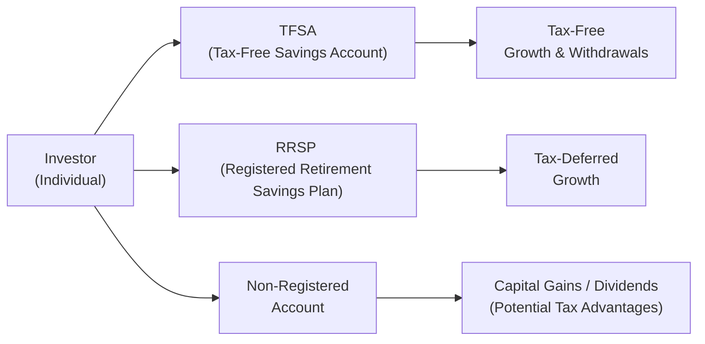

## 17.2 Tax-Minimization Portfolio Management Strategies

Taxation, huh? Even the word sometimes makes folks cringe. I remember back in the day, I’d get my T4 slip around mid-February and sigh at the thought of sorting out all those numbers. But over the years, I’ve realized something super important: while paying taxes is inevitable, there are ways to arrange your investments—legitimately, of course—to reduce or defer that tax bite. In this section, we’ll walk through many of the popular tax-minimization strategies available to Canadians. We’ll explore asset location tips, structuring investments, income splitting, capital loss harvesting, and cross-border considerations. I’ll also sprinkle in a few personal anecdotes and examples so we can see how these concepts play out in real life.

Remember, though, everyone’s situation is unique. The tax law is complex, plus it changes over time. So it’s key to consult with a qualified professional—an accountant, tax advisor, or lawyer—before you make any major moves. But for now, let’s explore the main ideas behind reducing your tax load and keeping more of your hard-earned wealth working for you.

---

## Asset Location

We often talk about asset allocation—meaning how you split your money among stocks, bonds, alternative investments, and so on (refer to Chapter 3: Asset Allocation and Investment Strategies for an in-depth breakdown). But asset location is about where you physically place those investments, such as in Registered Retirement Savings Plans (RRSPs), Tax-Free Savings Accounts (TFSAs), or non-registered (taxable) accounts.

• RRSPs: Contributions are tax-deductible, and the funds grow tax-deferred. But be mindful: once you withdraw funds from your RRSP, you’ll pay full marginal tax rates on them as ordinary income.  
• TFSAs: While there’s no tax deduction on contributions, the money grows and can be withdrawn tax-free.  
• Non-registered (Taxable) Accounts: Investments are subject to annual taxation on dividends and interest, as well as capital gains when you sell. However, the capital gains are taxed at only 50% of one’s marginal rate. Eligible dividends receive preferential taxation (the dividend tax credit), but interest income is fully taxable.

### Matching Asset Types to Accounts
The general rule of thumb:  
• Interest-bearing investments (like bonds or GICs) are often best held in RRSPs (or other tax-deferred accounts) because interest income is taxed at your full marginal rate if held in a non-registered account.  
• Growth-oriented and capital-gains-bearing assets might fit well in TFSAs and non-registered accounts. TFSAs let you realize gains without any tax. In non-registered accounts, you can at least take advantage of the capital gains inclusion rate (currently 50% in Canada).  
• Dividend-paying Canadian stocks can be worthwhile in non-registered accounts because of the dividend tax credit, but some folks prefer them in their TFSAs too, particularly when they expect robust dividend growth.  

There’s no one-size-fits-all approach here. Some prefer holding high-growth stocks in a TFSA for unlimited tax-free upside. Others keep them in an RRSP for immediate tax deductions on contributions. The key is striking a balance that makes sense for your time horizon, risk tolerance, and current tax situation. Ultimately, you want to place investments in an account that aligns with how they’ll be taxed when returns come in.

Below is a simplified diagram of how asset location strategies might look:

In this diagram:  
• An individual can place different investment marbles in distinct baskets: TFSAs, RRSPs, or non-registered accounts.  
• TFSAs produce tax-free growth.  
• RRSPs allow tax-deferred growth.  
• Non-registered accounts can still be used effectively, especially if you want flexibility or prefer to use capital gains rules or the dividend tax credit.

---

## Structuring Investments

Sometimes, individuals or families might decide to hold their investments in a corporation, trust, or holding company. Why? Depending on how these entities are set up, they can provide tax deferral or facilitate income splitting among family members.

• Holding Companies: The basic idea is to earn investment income within a corporate entity where, in some cases, the corporate tax rate on certain types of income can be lower than personal tax rates. When profits are eventually paid out to you as a dividend, you’d pay personal taxes at that time. So the corporate structure may allow for the deferral of personal tax. It doesn’t eliminate taxes entirely, but deferral can be meaningful.  
• Family Trusts: A trust can distribute income to multiple beneficiaries—such as children or other family members—who might be in a lower tax bracket. Be mindful that Canadian tax legislation has anti-avoidance measures in place to prevent abuse, and trust arrangements can be quite complex.

### Income Splitting within Corporate Structures
Let’s say you’re a professional with an incorporated entity. You can pay yourself a salary (deductible to the corporation but taxable to you), or you can distribute income as dividends. You can also possibly employ family members in legitimate roles, transferring some income to them at possibly lower tax brackets. This used to be simpler before the federal government introduced more stringent “tax on split income” (TOSI) rules. Nonetheless, it remains a tactic if carefully structured under the law.

---

## Splitting Income

Income splitting is basically about shifting some of your investment income to family members who pay taxes at a lower rate than you do. It can involve spousal RRSP contributions, setting up trusts for children, or even paying a child a salary if they’re truly working for you or your business. 

• Spousal RRSP Contributions: If you make more money than your spouse, contributing to a spousal RRSP can save tax both now (you get the deduction) and in the future (the spouse might withdraw in lower tax brackets in retirement). Just watch out for possible “attribution rules” if withdrawals are made soon after the contributions.  
• Family Trusts: Let’s say you want to help pay for your child’s post-secondary education. You could create a family trust that invests in income-generating assets, distributing that income to your child as needed, potentially at their lower marginal rate. But do keep the General Anti-Avoidance Rule (GAAR) in your mind’s eye.  

### A Quick Anecdote
I have a close friend who set up a spousal RRSP because she makes significantly more than her partner. She contributed for a few years, got the tax deductions, and when her partner retired earlier, they started drawing from that RRSP in a year when his income was very modest, which minimized the couple’s overall tax liability. They swear by it. But remember, it’s essential to plan carefully—CRA’s spousal attribution rules are a bit quirky if withdrawals happen too soon after contributions.

---

## Capital Loss Harvesting

It’s not fun to sell an investment at a loss. But sometimes, those losses can help ease your tax burden by offsetting capital gains either in the current year or carried back up to three years (or forward indefinitely). This tactic is generally referred to as “capital loss harvesting.”

• Mechanism: If you have realized a large capital gain on another investment, you might sell a losing position specifically to realize the capital loss. The net effect is that it can reduce or wipe out the taxable capital gains.  
• Superficial Loss Rule: Watch out! If you or someone “affiliated” with you (like a spouse or a company you control) repurchases the same security shortly before or after selling it (within 30 days), the CRA denies the loss for tax purposes. This can be an easy trap to fall into if you’re not aware of the rule.  

### Strategy Example
Suppose you realize a $10,000 capital gain in March. Then in October, you notice that a stock you own is sitting at a $6,000 loss. You could consider selling that losing stock, capturing a $6,000 capital loss that offsets part of the earlier $10,000 gain. You’d then only be taxed on the $4,000 net capital gain. That said, if you still like the losing stock’s long-term prospects, be sure not to buy it back within 30 days in the same account or in your spouse’s account—otherwise, you’ll run afoul of the superficial loss rule and lose the chance to claim the loss immediately.

---

## International Tax Considerations

It’s a big world out there, and cross-border investments can offer diversification and growth, as discussed in Chapter 14: International Investing. But each country has its own set of tax rules, and you don’t want to be double-taxed on your returns. Canada has tax treaties with many other countries to mitigate or eliminate double taxation.  

• Withholding Taxes: When you receive interest, dividends, or other income from a foreign source, that country may withhold a certain percentage in taxes. You can often get credit for these amounts on your Canadian tax return, but the details can be complicated.  
• Residency Rules: The concept of “tax residency” is vital. If you spend more than a certain amount of time in another jurisdiction, or if you’re deemed a resident for other reasons (like having a permanent home there), that country may want to tax your worldwide income.  
• U.S. Estate Tax: Canadian residents who invest in U.S. assets could be subject to U.S. estate tax, depending on the size of their U.S. holdings. This is an area where professional advice is worth its weight in gold (or maybe TSX stocks).  

### Cross-Border Entities
Some investors set up offshore corporations or trusts, often seeking tax deferral or other structural benefits. While legal if done properly, these structures are heavily scrutinized. The CRA and global tax authorities share more and more information, and they have powerful anti-avoidance frameworks. Make sure you’re in compliance—ignoring or sidestepping reporting requirements can lead to severe penalties.

---

## Practical Examples and Case Studies

### Example 1: The Retired Couple’s RRIF vs. TFSA
Imagine you’re a retired couple in your early 70s. You have an RRIF (which used to be your RRSP) and a TFSA. Let’s say you hold dividend-paying stocks of major Canadian banks in both. The RRIF pays out mandatory withdrawals each year, all taxed as income. Meanwhile, the TFSA dividends are tax-free. Sometimes, it might be wise to move some of your higher-dividend stocks into the TFSA (within your contribution limits) so you’re not paying tax on that dividend income. The RRIF might then hold GICs or bonds, which are taxed fully as interest anyway.  

### Example 2: The Capital Loss Shuffle
A friend of mine realized a massive gain on a biotech stock. She was thrilled—until tax time came around, and she faced a big capital-gains bill. A few months later, the market dipped, and she decided to sell a few underperformers, generating capital losses that offset half of that previous gain. By carefully timing her sales, she reduced her total taxable capital gain substantially.  

### Example 3: Splitting Income with a Family Trust
Consider an entrepreneur with a spouse and two adult children. If she sets up a family trust that invests in dividend-paying ETFs, the trust could distribute dividends to family members each year, taxed in their hands at presumably lower brackets. The entrepreneur defers or reduces her own tax burden. The trust, of course, must file its own tax returns, observe trustee fiduciary duties, and respect the “tax on split income” rules. But if it’s all done properly, it can be a worthwhile arrangement.

---

## Best Practices, Pitfalls, and Challenges

• Keep Good Records: Whether you’re harvesting losses or splitting income among family members, thorough documentation is essential. This includes keeping track of the adjusted cost base (ACB) of each investment, settlement dates, and the nature of income earned.  
• Watch for Anti-Avoidance: The Income Tax Act (Canada) has broad anti-avoidance provisions—often referred to as GAAR—that allow the CRA to deem a transaction’s purpose if it appears to lack economic substance and aims primarily to avoid taxes.  
• Long-Term Perspective: Don’t let the tax tail wag the dog. Some people get so fixated on tax savings that they forget about the underlying investment’s quality or its alignment with their goals. It’s often worth paying a bit of tax if the investment is solid and meets your needs.  
• Mind Your Time Horizon: If you plan to withdraw funds soon, maybe a TFSA is more flexible than an RRSP. If retirement is far off, an RRSP may offer more tax-deferral benefits.  
• Coordination with Advisors: Chances are, you have an investment advisor and a tax advisor (maybe they’re the same person, maybe they’re not). Make sure they communicate. Strategies that look great on paper can unravel if your advisors aren’t on the same page.

---

## Glossary

Income Splitting  
: A strategy to allocate income from one family member to another in a lower tax bracket to reduce overall taxes.  

Capital Loss Harvesting  
: A technique in which realized capital losses offset capital gains on a tax return, reducing your taxable gain liability.  

Tax Deferral  
: The process of postponing the payment of taxes to a later date. Often accomplished through registered accounts or certain corporate investment structures.  

Anti-Avoidance Rules (GAAR)  
: Provisions in the Income Tax Act (Canada) designed to prevent the use of transactions that lack economic substance and are primarily intended to avoid or reduce taxes.

---

## Directories, References, and Further Resources

Below are some resources if you want to explore topics such as advanced strategies, corporate holding structures, or just browse relevant Canadian regulations:

• [CRA Tax Planning Guides](https://www.canada.ca/en/revenue-agency/services/tax/businesses/topics.html) – Guidance on compliance and tax planning from the Canada Revenue Agency.  
• [Canadian Securities Administrators (CSA)](https://www.securities-administrators.ca) – National policies and rules that often affect how investments can be structured.  
• Book: “Tax-Efficient Investing in Canada” by Robert Ironside – A deeper look at advanced strategies and case studies, often focusing on real-life scenarios.  
• Article: “A Review of Corporate Holding Structures for Canadian Investors” in the Canadian Tax Journal – Explores the pros and cons of using corporations to hold investments.  
• [TaxTips.ca](https://www.taxtips.ca/) – Another helpful online resource for Canadian income tax, personal finance, and investment info.  
• [CIRO](https://www.ciro.ca) – The Canadian Investment Regulatory Organization oversees investment dealers, mutual fund dealers, and marketplace integrity. As of January 1, 2023, the MFDA and IIROC no longer exist separately and are fully amalgamated into CIRO.

For a big-picture overview of how taxes fit into your broader roadmap, see Chapter 16: Managing Your Client’s Investment Risk to understand how tax can also influence risk capacity. Also consider reading Chapter 18: Portfolio Monitoring and Performance Evaluation, as tax is an ongoing factor that should be monitored regularly.

---

## Concluding Thoughts

Anyway, as we wrap up, let’s remember that tax planning is not about tax evasion or using shady, borderline maneuvers. Instead, it’s about using legitimate rules to keep more of your returns in your pocket. Always keep your broader financial goals in sight. Maybe it’s a cottage for the family, a comfortable retirement, or philanthropic pursuits. By combining smart asset location, leveraging structures like family trusts or holding companies, and employing strategies such as capital loss harvesting, you can optimize for one of the major impediments to wealth accumulation—taxes—while still championing your life’s broader ambitions.

Thanks for sticking around for this deep dive. I know tax can be super complex, but hopefully this helps lighten the load and demystify a few strategies. And please don’t forget—be absolutely sure to consult with an advisor before making any big changes.

---

## Test Your Knowledge: Tax-Minimization Portfolio Management Strategies



### Which of the following statements best describes the concept of asset location in a Canadian context?

- [x] Determining which accounts (e.g., RRSP, TFSA, non-registered) hold specific asset classes to minimize taxes.
- [ ] Allocating a higher percentage of equities in your retirement portfolio.
- [ ] Investing in Canadian equities to receive dividend tax credits.
- [ ] Allocating capital primarily in foreign currency accounts to bypass capital gains.

> **Explanation:** Asset location is about strategically placing different types of assets into different tax-advantaged or taxable accounts. This ensures more tax-efficient growth and income.

### Capital loss harvesting involves which of the following primary actions?

- [x] Realizing a loss on an underperforming security to offset capital gains.
- [ ] Contributing more savings to your RRSP.
- [ ] Converting Canadian dollars into U.S. dollars.
- [ ] Borrowing funds to invest in high-yield dividend stocks.

> **Explanation:** Capital loss harvesting is used to reduce net taxable capital gains by realizing losses on selected investments. 

### Which statement accurately describes how spousal RRSPs can help reduce a family’s overall tax burden?

- [x] The higher-income spouse contributes, gets the deduction, and the lower-income spouse withdraws at a later date at a lower rate.
- [ ] Both spouses must contribute equally in the same tax year. 
- [ ] The lower-income spouse makes contributions to shield the spouse’s income. 
- [ ] Any contribution by a higher-income spouse is taxed immediately if withdrawn before 65.

> **Explanation:** A spousal RRSP is intended to provide a tax deduction to the contributor while enabling the beneficiary spouse to eventually withdraw funds (ideally at a lower tax rate).

### In Canada, which of the following statements is true regarding withholding taxes for cross-border investments?

- [x] Dividends from foreign sources are often subject to withholding tax in the country of origin.
- [ ] Withholding tax never applies when you invest in U.S. stocks.
- [ ] Withholding tax rates are the same across all countries regardless of tax treaties.
- [ ] Withholding taxes cannot be claimed as a foreign tax credit on your Canadian return.

> **Explanation:** Many countries withhold a portion of investment income at source, though Canada has tax treaties that may reduce or allow credits for these amounts.

### A potential pitfall when attempting capital loss harvesting is:

- [x] The superficial loss rule, which disallows a loss if you repurchase the same security within 30 days.
- [ ] The compounding effect of interest income in an RRSP.
- [x] Forgetting to track your adjusted cost base properly, causing inaccurate tax reporting.
- [ ] The annual limit on TFSA contributions.

> **Explanation:** A key pitfall is accidentally triggering the superficial loss rule by repurchasing identical securities within the restricted 30-day period. Additionally, poor record-keeping can lead to cost base errors.

### Which of the following best describes the reason for placing high-interest or fully taxable investment income within a tax-sheltered account?

- [x] Interest is fully taxed at one’s marginal tax rate in non-registered accounts.
- [ ] Interest income qualifies for the dividend tax credit when held in a TFSA.
- [ ] The CRA waives all taxes on interest income if held in a non-registered account.
- [ ] Non-registered accounts provide complete tax deferral on interest income.

> **Explanation:** Because interest income is taxed at the full marginal rate, it is more tax-efficient to hold such assets in registered accounts like RRSPs or TFSAs.

### How can a Canadian holding corporation potentially offer tax advantages to an investor?

- [x] It may allow for tax deferral on investment income until dividends are paid out personally.
- [ ] It completely eliminates personal tax on all dividends.
- [x] It guarantees that capital gains are never taxed, regardless of withdrawals.
- [ ] It allows unlimited spousal RRSP deductions regardless of contribution room.

> **Explanation:** A holding corporation can sometimes provide tax deferral, though personal tax is owed when income eventually flows to the individual.

### Why is it important to monitor “residency rules” when investing internationally?

- [x] Residency often determines which country has taxing rights over worldwide income.
- [ ] Investments held abroad are never subject to withholding taxes.
- [ ] Residency rules do not apply unless you hold at least five foreign properties.
- [ ] Only your foreign income is taxed in Canada, not your total income.

> **Explanation:** Canadian residents are taxed in Canada on their worldwide income, and other countries may also claim the right to tax certain income if residency or permanent establishment rules are met. This can lead to double taxation if not structured properly.

### What is the main purpose of the General Anti-Avoidance Rule (GAAR) in the Income Tax Act?

- [x] To combat transactions or structures that lack economic substance and exist primarily to avoid taxes.
- [ ] To reduce an individual’s total tax liabilities to zero.
- [ ] To allow unlimited capital loss carrybacks.
- [ ] To ensure capital dividends are taxed at the marginal rate.

> **Explanation:** GAAR is a Canadian legislative tool giving the CRA authority to override aggressive tax strategies that appear designed to circumvent the spirit of the Income Tax Act.

### Adhering to best practices in tax-minimization often involves seeking professional advice. Which of the following statements is TRUE?

- [x] Consulting a tax professional is recommended because tax rules are complex and can change frequently.
- [ ] DIY tax planning without knowledge of CRA regulations is usually sufficient.
- [ ] Once you set up a tax strategy, it never requires re-evaluation.
- [ ] Anti-avoidance rules only apply to corporations with over $10M in assets.

> **Explanation:** Tax planning requires ongoing revisions due to ever-changing laws and personal circumstances. Engaging a professional reduces mistakes and keeps your strategy current.


