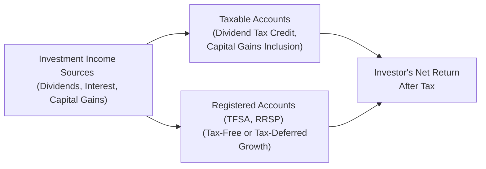

## 17.3 Tax-Efficient Investments

Sometimes, when people first dive into the world of investing, they get so focused on returns that taxes slip to the bottom of their priority list. I once chatted with a friend who was really excited about a big dividend he’d received on a stock—until she realized how much the government would eventually take from that payout in her taxable account. It was a wake-up call: understanding tax implications can be just as important as picking the right stocks or funds.  

This section tackles the ins and outs of tax-efficient investing in Canada. We’ll walk through some popular strategies and highlight best practices, potential pitfalls, and how to structure a portfolio with taxes in mind. Whether you’re reading this as a newcomer or a seasoned pro who wants a refresher, there’s something here that can help you save (or at least not lose) hard-earned money.  

CIRO (the Canadian Investment Regulatory Organization) is now the single national self-regulatory body for investment dealers and mutual fund dealers. This unification, effective since the merger of the MFDA and IIROC in 2023, simplifies a lot of rules and oversight. But the key tax considerations remain grounded in federal laws and regulations set by the Canada Revenue Agency (CRA).  

Below, we’ll explore dividend-paying equities, capital gains, tax considerations for registered accounts, and more. If you need a broader context, feel free to jump back to Chapter 16 on managing investment risk or Chapter 17.1 on burdens of wealth accumulation.  

## Dividend-Paying Equities

Many Canadian corporations distribute a portion of their profits to shareholders as dividends. Dividends can be awesome because:
• They may provide predictable income.  
• They can enjoy favorable tax treatment in Canada.  

In Canada, eligible dividends from taxable Canadian corporations qualify for the dividend tax credit (DTC). Here’s how it works: if you’re an individual investor who receives these dividends, you’re allowed to “gross up” and then claim a tax credit that lowers your overall tax payable. Essentially, the government is recognizing that the corporation has already paid tax on its earnings—so you get a break.  

That said, your actual benefit from the dividend tax credit depends on your marginal tax rate. If you’re in a higher tax bracket, the advantage might be more limited compared to someone with a lower marginal rate (crazy, right?). So, talk to an advisor or do the math: sometimes, high-yield dividends are particularly attractive for folks in middle-income brackets.  

Let’s illustrate: Suppose you receive $1,000 in eligible dividends from a Canadian corporation. You might need to gross up that amount by 38% for tax-filing purposes, meaning you report $1,380 of dividend income. Then, your dividend tax credit reduces the tax payable on this reported income. In many cases, it ends up being far less tax than if you’d earned $1,000 in interest income.  

## Capital Gains vs. Ordinary Income

Another piece of the puzzle is how capital gains are taxed relative to ordinary income. In Canada, only 50% of a capital gain is included in your taxable income. That’s significant if you’re looking at long-term growth strategies.  

If you buy a stock at $10 and sell it at $15, you get a capital gain of $5 per share. Half of that $5 (i.e., $2.50) is included in your taxable income. By contrast, if you’d earned $5 in interest from a bond, you’d have to include the entire $5 as ordinary income for tax purposes (fully taxable at your marginal rate).  

Holding onto growth-oriented securities (like equities that may appreciate) for the long term can be one of the simplest and most powerful ways to build wealth with favorable tax treatment—especially if those gains are realized only when you liquidate your holdings.  

One personal cautionary tale: I had a colleague who day-traded. He was flipping stocks so quickly that he ended up with little to no capital gains advantage—some of those profits were considered business income, fully taxable at high rates. So, if you’re too active, the CRA may consider your gains as business income.  

## Registered Accounts and Tax-Free Growth

In Chapter 17.2, we touched briefly on some tax nuances. But here, let’s dig in more. Registered plans like the Tax-Free Savings Account (TFSA) and Registered Retirement Savings Plan (RRSP) are cornerstones of many Canadian investment strategies. They allow you to shield (TFSA) or defer (RRSP) tax on your investment income, capital gains, and dividends.

### Tax-Free Savings Account (TFSA)

The TFSA is a tax-sheltered environment for Canadian residents aged 18 and older. The key advantage: contributions to a TFSA are not tax-deductible, but the growth (interest, dividends, capital gains) and withdrawals are totally tax-free.  

People often ask what the best assets to hold in a TFSA are. Because you’re not taxed on growth or interest, you might consider assets with high growth potential (like growth-oriented equities) or income-producing securities (like dividend-paying stocks or certain ETFs). That income is sheltered from taxes.  

Also note: the TFSA contribution limit changes periodically and typically increases each calendar year. Unused room accumulates, so if you don’t use it this year, it carries forward. You can confirm the annual limits and any specific rules around contributions and withdrawals via the CRA’s TFSA info pages:  
[https://www.canada.ca/en/revenue-agency/services/tax/individuals/topics.html](https://www.canada.ca/en/revenue-agency/services/tax/individuals/topics.html)

### Registered Retirement Savings Plan (RRSP)

Your RRSP is basically a tax-deferred growth account. Contributions are tax-deductible (well, usually), so they reduce your taxable income in the year you contribute. But withdrawals are taxed as ordinary income in the future, presumably at a lower tax rate if you expect to be in a lower bracket in retirement.  

The CRA sets annual limits on how much you can put into your RRSP. Overcontrubuting can be painful (there’s a penalty tax), so always keep an eye on your notice of assessment, or use one of those open-source tools like Wealthsimple or TurboTax to track your contribution room.  

A practical approach: hold assets that might otherwise lead to higher immediate tax liability in an RRSP, such as interest-earning bonds. Why? Because in an RRSP, that accrued interest is tax-deferred until you withdraw from the plan, possibly when you’re in a lower marginal bracket.  

Below is a quick snapshot illustrating the flow of investment income into various account types. Notice how TFSA or RRSP structures can significantly alter your net return:

## Flow-Through Shares (Resource Sector)

Flow-through shares, often found in Canada’s resource and energy sectors, are a pretty niche product but can be alluring for certain risk-tolerant investors. These shares let resource companies pass on eligible exploration expenditures to shareholders, who can then deduct those costs from their own taxable income.  

Why is this a big deal? Because you effectively reduce your taxable income—potentially receiving a tax break in the present while also benefiting if the exploration project eventually hits pay dirt. That said, flow-through shares carry higher risk, as exploration ventures can flop or take forever to become profitable.  

If you love the idea of investing in Canada’s resource sector and have an appetite for speculation, flow-through shares might be worth exploring. (Definitely chat with a knowledgeable advisor, though—these can be super complicated, and the devil is in the details.)  

## Preferred Shares vs. Bonds

Let’s say you want reliable income from your portfolio. You might consider bonds, which typically pay a fixed coupon, or you might consider preferred shares, which often pay a fixed dividend.  

From a tax viewpoint, preferred dividends from Canadian corporations often qualify for the dividend tax credit, meaning a lighter tax bill than the interest you’d get from a bond (which is fully taxed at your marginal rate).  

However, bonds can be more predictable, especially if backed by stable governments or corporations. Preferred shares, on the other hand, can be sensitive to equity-like risks (e.g., they rank behind the company’s bonds in a bankruptcy scenario). But if you’re comfortable taking on a bit more risk for potentially better tax treatment (and maybe a higher yield), preferred shares may be a neat solution.  

It’s a balancing act between risk tolerance and tax efficiency:  

• If you’re very conservative, you might lean toward higher-credit-quality bonds (but pay more tax).  
• If you want to boost after-tax returns and can handle some extra volatility, preferred shares might offer a nice middle ground.  

## Key Terms (Glossary)

Dividend Tax Credit  
: A credit available to individuals receiving dividends from taxable Canadian corporations. It’s non-refundable, but it reduces overall tax liability by recognizing that the company has already been taxed on its earnings.  

TFSA Contribution Limit  
: The maximum annual amount you can contribute to a TFSA. It’s adjusted periodically by the government, and unused contribution room accumulates.  

Marginal Tax Rate  
: The rate of tax you pay on the next dollar of taxable income. It’s crucial when deciding how and where to invest to optimize after-tax returns.  

Flow-Through Shares  
: Special shares issued by resource companies. The company’s qualified exploration expenses “flow through” to individual shareholders, offering tax deductions for those investors.  

## Additional Resources

• CRA Dividend Information:  
[https://www.canada.ca/en/revenue-agency/services/forms-publications/publications/t4012.html](https://www.canada.ca/en/revenue-agency/services/forms-publications/publications/t4012.html)  

• TFSA & RRSP Rules:  
[https://www.canada.ca/en/revenue-agency/services/tax/individuals/topics.html](https://www.canada.ca/en/revenue-agency/services/tax/individuals/topics.html)  

• Book: “Winning the Tax Game” by Tim Cestnick  
Provides a deeper look at Canadian tax strategies and invests a lot of time on how to structure your investments to reduce taxes.  

• CSI’s “Taxation course”  
If you’re pursuing a deeper understanding or want a recognized credential, the Canadian Securities Institute offers an in-depth Taxation course.  

• Open-Source Tools for Modeling Tax Scenarios  
Check out Wealthsimple, TurboTax, or other online calculators. It sounds simple, but plugging in your actual numbers is the best way to get a sense of the potential tax outcomes.  

• CIRO (Canadian Investment Regulatory Organization):  
[https://www.ciro.ca](https://www.ciro.ca)  
At the time of writing, this is the current self-regulatory organization overseeing investment dealers and mutual fund dealers in Canada.

## Common Pitfalls and Best Practices

A few common traps:  
• Not minding “lost” TFSA room: The TFSA is one of those “use it or keep it for later” deals. Occasionally, people overcontribute or forget about their limit. Keep track!  
• Overlooking differences in tax treatments: Sometimes folks buy GICs in a taxable account and put slow-growth stocks in their TFSA. They could consider flipping that pairing to fully shelter interest income.  
• Not planning for your future tax bracket: If you’ll be in a significantly higher bracket in retirement, an RRSP might not be your best friend. If you think your bracket will drop, the RRSP can shine.  
• Putting all your eggs in a high-risk basket: If you love the idea of flow-through shares, fine—but be aware of the elevated risk and potential for capital losses.  

Meanwhile, a few best practices:  
• Think “after-tax return,” not just “headline yield.” Sometimes a 4% dividend yield can crush a 5% interest yield once taxes are considered.  
• Consider your overall financial goals and time horizon. High growth or higher speculation might be better suited to TFSAs or RRSPs, depending on your bracket.  
• Leverage technology or advisors to track your CRA data, ensure you’re not missing out on any credits, and remain in compliance with CIRO guidelines.  

## Practical Example

Let’s blend everything we learned here into a quick scenario. Imagine:

• Vanessa has a marginal tax rate of around 35%. She’s got $20,000 of room in her TFSA, $15,000 of unused RRSP space, and $50,000 in a taxable brokerage account.  

• She wants to invest $70,000 in total. She picks a few dividend-paying Canadian stocks, some growth-oriented U.S. equities, and Canadian bonds.  

• She decides to put the bonds in her RRSP because interest income is fully taxable. If she places the bonds into her RRSP, she defers interest taxation until withdrawing from the plan.  

• She puts the bulk of her high-growth U.S. equities in her TFSA, because all future capital gains will be tax-free (no wicked capital gains surprise).  

• She puts the dividend-paying Canadian stocks into her taxable account, recognizing that she can get the dividend tax credit.  

• She’s leveraged the best part of each account’s tax benefits and spread out her investments in a way that aims to maximize after-tax returns and match her risk tolerance.  

Anyway, the net effect is that she’s paying substantially less in taxes now. And hopefully, she’ll do the same in the future.  

## Conclusion

At the end of the day, tax efficiency is a key pillar of successful wealth accumulation—especially relevant for Canadians who want to make the most of registered accounts and special corporate structures like flow-through shares. Dividends, capital gains, and registered account instruments all bring unique advantages, but each strategy fits different circumstances.  

Stay tuned for the rest of this chapter, where we continue to discuss how taxes, inflation, and costs can slowly chip away at your wealth, plus advanced strategies to mitigate those effects. And always remember to consult with a qualified tax specialist or financial advisor, because a generic blueprint is never a perfect replacement for personalized advice.  

-----

## Test Your Skills: Tax-Efficient Investing Essentials



### In Canada, why do eligible dividends generally come with a more favorable tax treatment?

- [x] They qualify for the dividend tax credit.
- [ ] They are 100% tax-free.
- [ ] They cannot be taxed once reinvested.
- [ ] They count as capital gains.

> **Explanation:** Eligible dividends from taxable Canadian corporations are “grossed up” for tax purposes but come with a dividend tax credit that reduces the investor’s overall tax payable.  

### Which of the following best illustrates a capital gain?

- [x] Buying stock at $10 and selling it at $15.
- [ ] Earning a $1.00 dividend on a $20 stock.
- [ ] Receiving monthly interest payments from a bond.
- [ ] Reinvesting ETF distributions in cash.

> **Explanation:** A capital gain arises when you sell a security at a higher price than you purchased it.  

### A key advantage of the TFSA is:

- [x] Withdrawals are tax-free.
- [ ] Contributions are tax-deductible without limit.
- [ ] Investment losses can be deducted from other income.
- [ ] Earnings in the account can only be reinvested in bonds.

> **Explanation:** TFSA withdrawals (including contributions and gains) are tax-free. However, contributions are not tax-deductible.  

### Flow-through shares are appealing to investors because:

- [x] They can pass along tax deductions for resource exploration to shareholders.
- [ ] They guarantee above-market returns.
- [ ] They are only available in low-risk treasury markets.
- [ ] Their dividends are always tax-free.

> **Explanation:** Flow-through shares allow certain expenses (like resource exploration) to be “flowed through” to investors, providing potential tax deductions. They are considered higher risk, especially in the resource and exploration sectors.  

### Why might an investor choose preferred shares over bonds for income?

- [x] Preferred share dividends may receive a dividend tax credit.
- [ ] Bonds do not qualify for RRSP contributions.
- [x] Preferred shares might offer higher after-tax yield.
- [ ] Bonds can only be sold at maturity.

> **Explanation:** Preferred shares pay dividends that often qualify for a dividend tax credit, which can be more tax-efficient than the fully taxable interest from bonds.  

### RRSP contributions:

- [x] Are tax-deductible (subject to limits).
- [ ] Are fully taxed each year upon contribution.
- [ ] Cannot be used to invest in equities.
- [ ] Do not have any withdrawal consequences.

> **Explanation:** RRSP contributions lower your taxable income in the year you contribute, but withdrawals are taxed as ordinary income in the future.  

### What is a key difference between TFSAs and RRSPs?

- [x] TFSA withdrawals are tax-free, while RRSP withdrawals are taxed.
- [ ] RRSPs are only allowed for declared day traders.
- [x] RRSP contributions tend to lower your taxable income in the year you contribute.
- [ ] TFSAs do not allow for capital gains.

> **Explanation:** With a TFSA, you put in after-tax dollars but enjoy tax-free growth and withdrawals. With an RRSP, you get a deduction now, but you pay tax when you withdraw in retirement.  

### Which of the following might lead the CRA to classify an individual’s gains as business income rather than capital gains?

- [x] Frequent and speculative trading resembling a business activity.
- [ ] Holding a single dividend-paying stock for a decade.
- [ ] Making only one large investment per year.
- [ ] Contributing to a TFSA.

> **Explanation:** If the CRA determines that an investor is trading frequently and commercially, those profits could be taxed as business income at higher rates.  

### A common pitfall in TFSA usage is:

- [x] Overcontribution leading to penalty taxes.
- [ ] Never being able to withdraw your funds until age 55.
- [ ] Paying capital gains tax on stocks held there.
- [ ] Forfeiting any chance to hold dividend-paying assets.

> **Explanation:** One major error is putting more than allowed into your TFSA, which triggers penalty taxes. TFSA rules are fairly flexible, but do have contribution limits.  

### True or False: Preferred shares always have less risk than common shares and no risk of price decreases.

- [x] True
- [ ] False

> **Explanation:** This is a tricky one! Many people assume “always less risk.” Preferred shares are usually less volatile than common shares, at least in terms of priority for dividend payments and upon liquidation. However, “always less risk” can be an overstatement if market conditions are bad. In general, though, preferred shares do offer a level of stability compared to common shares.  


