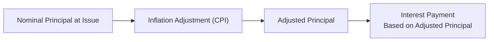
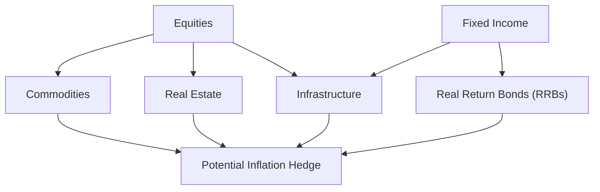

## 17.4 Inflation-Sensitive Assets

Inflation. It’s a word we hear in the news a lot, and maybe our eyes glaze over because, well, we’ve got more interesting stuff on our minds. But the truth is, inflation hits our pockets directly, and for long-term investors, it can slowly (sometimes not so slowly) erode wealth. That’s where inflation-sensitive assets come into play. They’re specifically designed—or at least naturally inclined—to maintain or even increase their value when inflation goes up. The net effect? You preserve more of your purchasing power and reduce the chances that rising prices do a vanishing act on your returns.

Let’s walk through a few key examples of inflation-sensitive assets, including Real Return Bonds, commodities, real estate, and infrastructure. Along the way, I’ll share a few personal notes on what makes these assets so interesting, plus some practical insights on how they fit into a Canadian investor’s portfolio.

---

### Why Inflation-Sensitive Assets Are Important

I still remember the first time I realized just how sneaky inflation can be. I was a teenager saving up for a gaming console. My plan was to wait for a sale. But then, the price crept up little by little—almost unnoticed. By the time I had enough cash, the console was more expensive than when I started saving. Inflation worked against me. On a personal consumer level, that’s just annoying. But scale that up to a retirement fund or a long-term investment portfolio, and you see how inflation can be downright destructive if left unchecked.

From an investment standpoint, “inflation-sensitive” basically means an asset is built in such a way that it benefits (or at least isn’t badly harmed) by higher inflation. So if everyone else sees their returns eaten away by rising prices, the holder of inflation-sensitive assets could be in better shape.

#### Purchasing Power

A quick definition to keep things fresh in our minds: Purchasing power is how many goods or services you can buy with a dollar. If your $1 buys you a can of soda today but only half a can tomorrow, that’s a loss of purchasing power. Inflation is the culprit. So any asset that helps you keep pace with or exceed the rate of inflation effectively preserves your purchasing power.

---

### Real Return Bonds (RRBs)

Real Return Bonds (RRBs) in Canada are often the first stop for investors looking for straightforward, inflation-protected income. Issued by the Government of Canada, RRBs have their principal value indexed to the Consumer Price Index (CPI). In other words, if inflation increases the CPI, the principal on your bond goes up. And because the coupon payments are a percentage of that inflation-adjusted principal, those payments grow as well.

It might help to see a quick diagram of how the mechanics work:

- A["Nominal Principal at Issue"]: You start out with a face value when the bond is issued.  
- B["Inflation Adjustment (CPI)"]: The principal is adjusted over time based on changes to the Consumer Price Index.  
- C["Adjusted Principal"]: This new principal amount is effectively “indexed” to account for inflation.  
- D["Interest Payment Based on Adjusted Principal"]: Coupon payments (interest) are now calculated on the inflation-adjusted principal, meaning they rise with inflation.

#### Example of an RRB

Suppose you purchase a Government of Canada Real Return Bond with a face value of C$1,000 and a coupon of 2%. If inflation for the year is 3%, the principal is adjusted to C$1,030 (C$1,000 × 1.03). The 2% coupon is now calculated on the adjusted principal, so it’s 2% of C$1,030 = C$20.60, instead of C$20. Over time, these small adjustments can add up, making RRBs an attractive choice when trying to hedge inflation in a bond portfolio.

However, be mindful of interest rate risk—if nominal yields rise for reasons outside of inflation expectations, the market price of an RRB can still swing. So think of RRBs as a stable inflation hedge, but not magically immune to all forms of risk.

Best Practices:
• Ensure they align with an investor’s time horizon—RRBs can be a powerful hedge over the long haul.  
• Watch real yield vs. nominal yield differentials. If real yields are too low, you might pick up inflation protection but lose on total return.  

---

### Commodities

Commodities—like gold, oil, wheat, and metals—often react to inflation in unique ways. In times of rising prices, physical commodities can become more expensive, which may boost returns for investors holding them. This can be done through futures contracts, commodity ETFs, or commodity-related equity investments (like shares of mining or energy companies).

#### Why Commodities Can Hedge

• Tangible Value  
Commodities aren’t just paper assets; they’re raw materials with fundamental uses. If the prices of raw materials rise, so does the notional value of many commodity investments.

• Diversification Benefits  
Traditionally, commodities have low correlations with stocks and bonds. They may offer a measure of protection when equities or fixed income assets suffer from a sudden jolt of inflation.

But just because they can hedge inflation doesn’t make them bulletproof. Commodity prices can also be volatile. For example, if you invested solely in oil and the economy hits a major downturn, oil prices can collapse. It’s wise to treat commodities as a portion of an overall diversified mix.

Case in Point:  
In the early 2000s, commodity prices soared alongside China’s rapid industrial expansion, providing robust returns. But the 2008 crisis showed that commodities can also plummet quickly if global demand contracts.  

---

### Real Estate

Real estate is one of those assets that people often say “hedges inflation” because of the potential for rents and property values to rise over time. If the cost of living goes up, then in many markets, landlords may be able to charge higher rents, and property owners often see rising property values (though not always, of course).

#### Practical Considerations

• Location, Location, Location  
We hear this so often it becomes cliché, but it’s still critical. Not all regions or neighborhoods appreciate the same way. Some might skyrocket due to population growth, others might stagnate.

• Financing Costs  
If inflation spikes and central banks respond by raising interest rates, mortgages can become more expensive. High financing costs might cut into real estate returns or reduce new buyer demand in the market.

• Market Cycles  
Real estate can go through boom-bust cycles. At times it outperforms inflation significantly; other times, oversupply or economic recessions can weigh heavily on property prices.

Despite potential pitfalls, real estate remains among the most popular inflation hedges for both institutional and retail investors. Whether you invest directly in property or indirectly through Real Estate Investment Trusts (REITs), it’s typically seen as one of the main ways to preserve purchasing power over the long run.

---

### Infrastructure

Infrastructure investing is a fancy term for owning a stake in real assets such as toll roads, utilities, pipelines, airports, or renewable energy projects. Many infrastructure assets have contractual revenue streams tied to inflation. For example, a toll road may have the legal right to increase toll rates each year in line with CPI. That means revenue—and potential dividends—adjust upward when inflation rises.

#### Why Infrastructure Can Work

• Long-Term Stable Cash Flows  
Infrastructure projects often operate under long-term concessions or contracts. They can deliver cash flows for decades.

• Inflation Linkage  
Many deals include explicit inflation escalation clauses. Essential services (like utilities) can pass along price increases to customers—though sometimes these hikes might need regulatory approval.

• Low Volatility?  
In theory, infrastructure is less volatile than commodities or certain segments of the equity market. However, large capital expenditures (building a pipeline or a solar farm) can pose risks, and regulatory changes might also impact profitability.

Consider a scenario where a pension fund invests in a pipeline that has a 20-year contract with inflation-linked tariff adjustments. Every year, if the CPI index goes up by 2%, the pipeline operator can charge 2% more. Hence, the investment cash flow is partially protected against inflation.

---

### Putting It All Together

How do these various assets fit in a broader portfolio strategy? Let’s look at a quick overview diagram:

From the diagram:
• Equities and fixed income are standard portfolio pillars, but you add commodities, real estate, infrastructure, and RRBs to help address inflationary risks.  
• Each asset class contributes a different factor to the hedge. Commodities reflect raw material price changes. RRBs are directly indexed to CPI. Real estate and infrastructure have the potential to raise cash flows in response to inflation.  

---

### Glossary

• **Purchasing Power**: The amount of goods or services that can be purchased with a unit of currency. It declines when inflation rises.  
• **Real Return Bonds (RRBs)**: Canadian government bonds whose principal and interest payments adjust with inflation (tracked by the Consumer Price Index).  
• **Inflation Hedge**: An asset or strategy that aims to mitigate the adverse effects of inflation on a portfolio.  
• **Infrastructure Investment**: Capital allocated to tangible systems such as roads, utilities, or energy pipelines, often featuring stable, long-term income streams indexed to inflation.  

---

### Balancing Risk and Reward

Investors must be aware that no single asset or method can perfectly safeguard against price-level increases. Securities with explicit CPI linkage (RRBs) might have interest rate risk. Commodities might be highly volatile. Real estate could slump if the broader economy weakens. Infrastructure can face regulatory and political risks. The key is constructing a balanced allocation—tailored to each client’s risk tolerance and time horizon—rather than betting the farm on just one type of inflation hedge.

---

### Regulatory Notes and Canadian Context

In Canada, the national self-regulatory organization is the Canadian Investment Regulatory Organization (**CIRO**). CIRO oversees investment dealers and mutual fund dealers and upholds market integrity on equity and debt marketplaces. Historically, the Investment Industry Regulatory Organization of Canada (IIROC) and the Mutual Fund Dealers Association of Canada (MFDA) were separate bodies, but they amalgamated into CIRO as of January 1, 2023. 

When you’re dealing with assets like RRBs or other alternative investments such as commodities or infrastructure funds, always consult the latest CIRO guidance. CIRO’s website at [https://www.ciro.ca](https://www.ciro.ca) provides resources to help you navigate compliance and suitability requirements, especially if you’re considering alternative investments in a retail client’s portfolio.

Finally, remember that the Canadian Investor Protection Fund (CIPF) is now the sole investor protection fund in Canada, replacing the former MFDA IPC.

---

### Practical Tools, References, and Resources

1. **Bank of Canada Inflation Indicators**: [https://www.bankofcanada.ca](https://www.bankofcanada.ca)  
   - Official inflation reports, overnight rates, and monetary policy statements.  
   - Also features an “Inflation Calculator” to see how prices have changed historically.

2. **CIRO Guidance on Alternative Investments**: [https://www.ciro.ca](https://www.ciro.ca)  
   - Check the latest guidelines on best practices for offering commodities, REITs, or infrastructure investments to clients.

3. **Book: “Strategic Fixed Income Investing” by Sean Pugliese and Mark Satov**  
   - Offers in-depth analysis on how inflation impacts bond markets, with special sections on Real Return Bonds (RRBs).

4. **Article: “Inflation Hedging: A Canadian Perspective” in The Canadian Journal of Economics**  
   - Scholarly insight into the historical alignment between inflation rates and performance of traditional versus alternative investments.

5. **Open-Source Tools**  
   - Check out the Bank of Canada’s “Inflation Calculator” for real-time data and historical trends.

---

### Final Thoughts

Inflation is a bit like the slow drip of a leaky faucet—it may take a while for the water bill to show the impact, but eventually it adds up. Luckily, with the right allocation to inflation-sensitive assets—like Real Return Bonds, commodities, real estate, and infrastructure—you can take steps to protect your portfolio from that slow, steady drip eating away your purchasing power. Just keep in mind that no single approach is perfect, and it’s always wise to speak with a qualified advisor (who is fully up to date on CIRO guidance) about how these pieces fit into your unique financial situation.

In my experience, folks who diversify and keep inflation on their radar tend to weather the storm better than those who ignore it until it’s too late. But hey, we can’t predict the future, and maybe inflation retreats (fingers crossed), but it’s always good to have these strategies in our toolkit—just in case.

---

## Test Your Knowledge: Inflation-Sensitive Assets and Strategies



### How do Real Return Bonds (RRBs) offer inflation protection for Canadian investors?

- [x] Their principal is adjusted based on inflation, and interest is paid on the adjusted principal.
- [ ] They pay a fixed interest rate, regardless of the inflation rate.
- [ ] They offer inflation protection by only paying coupon payments at maturity.
- [ ] They have no correlation with the CPI or inflation rates.

> **Explanation:** RRBs are indexed to inflation, so the principal and coupon rise with the CPI, providing investors with a built-in hedge against inflation.

### What is one key limitation of commodities as an inflation hedge?

- [ ] They never reflect actual raw material prices.
- [ ] They are only available to institutional investors.
- [x] They can experience significant price volatility and market swings.
- [ ] They guarantee high returns in all economic conditions.

> **Explanation:** Commodities do provide an inflation hedge, but they can be highly volatile and may suffer major price declines during economic downturns.

### In the context of real estate as an inflation-sensitive asset, which factor is often considered the biggest driver of property value appreciation?

- [ ] Future interest rates
- [x] Location
- [ ] Stock market correlations
- [ ] National currency devaluation

> **Explanation:** While real estate values can be influenced by many factors, “location, location, location” remains a primary determinant of property value.

### Which of the following statements describes a key characteristic of infrastructure investments as an inflation hedge?

- [x] They often feature contractual revenue streams linked to inflation.
- [ ] They are immune to political and regulatory changes.
- [ ] They pay fixed returns that do not change over time.
- [ ] They are easily traded and highly liquid like most stocks.

> **Explanation:** Infrastructure projects typically have mechanisms (like toll road pricing) that adjust for inflation, offering a level of protection against rising prices.

### Which of the following is true about Canadian Inflation-Linked Instruments like RRBs?

- [x] They include a consumer price index (CPI) adjustment to the bond’s principal.
- [ ] Their interest is completely detached from the principal value.
- [x] They can offer a real yield over inflation.
- [ ] They are entirely free from interest rate risk.

> **Explanation:** RRBs adjust principal by the CPI (providing real yield over inflation), but they still carry some interest rate risk like any bond instrument.

### Which of these statements about real estate as an inflation hedge is generally correct?

- [x] Rental income can increase during inflationary periods, boosting returns.
- [ ] Real estate is always perfectly correlated with inflation.
- [ ] Residential mortgages always remain low when inflation is high.
- [ ] Location has no bearing on property values over long horizons.

> **Explanation:** Because landlords often raise rents in line with inflation, real estate can provide an inflation-adjusted income stream, though many other factors also come into play.

### When thinking about commodities in a portfolio, why might an investor also consider equity markets?

- [x] Commodity-related equities (e.g., mining stocks) sometimes capture commodity price momentum while offering liquidity.
- [ ] Commodities and equities always move in the same direction.
- [x] Commodity equities can provide dividends and stock-based returns not available through direct commodity ownership.
- [ ] Equities are completely immune to inflation.

> **Explanation:** Investing in commodity-producing companies allows exposure to rising commodity prices but with the added dimension of potential capital gains and dividends from equity ownership.

### Which asset class is most likely to have explicitly inflation-linked contractual returns?

- [ ] Traditional corporate bonds
- [x] Infrastructure assets (e.g., toll roads, regulated utilities)
- [ ] Common shares of technology companies
- [ ] High-yield bonds

> **Explanation:** Many infrastructure assets have regulated or contractual mechanisms allowing rate increases that are tied to inflation, an appealing characteristic for inflation-sensitive investing.

### According to CIRO’s guidance, what is the primary consideration when recommending inflation-sensitive assets to retail clients?

- [x] Suitability based on clients’ risk tolerance, investment objectives, and time horizon.
- [ ] Guaranteed inflation-proof returns.
- [ ] Avoiding any reference to real returns or inflation hedges in discussions with clients.
- [ ] Only focusing on commodity-based instruments.

> **Explanation:** CIRO regulations emphasize the importance of ensuring that recommended products match the client’s profile and investment goals, rather than offering a universal guarantee.

### True or False: Real Return Bonds (RRBs) are completely free from market price fluctuations once inflation is accounted for.

- [x] True
- [ ] False

> **Explanation:** Actually, the statement is a bit tricky. While RRBs are indexed to inflation, they can still experience price volatility from interest rate changes and other market factors. However, because the coupon and principal are adjusted for inflation, the “real value” of future payments is protected in terms of purchasing power. Thus, in terms of inflation specifically, they’re effectively protected.  


