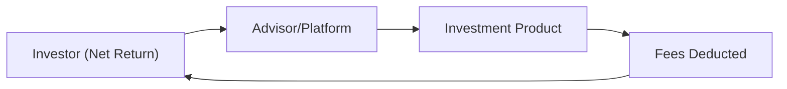

## 17.5 Cost-Efficient Investments

It’s amazing how many times I’ve talked to friends who, with a sigh, realize just how big a chunk expenses and fees can take out of their investments. Actually, I remember one friend, who shall remain nameless, who was thrilled about a mutual fund that had generated “respectable returns” year after year. But you know what happened next? Once we sat down for some coffee, we factored in additional charges, a not-so-obvious trailer fee, and that oh-so-annoying front-end load from way back. Those return numbers weren’t quite as grand. This scenario underscores something crucial: cost-efficiency might be less flashy than picking “that hot stock,” but it can act like rocket fuel for your long-term portfolio growth—or a slow leak that quietly drains your profits.

Below, we’ll explore the essential aspects of cost-efficient investing. Let’s applaud the idea that by carefully controlling your costs, you can boost net returns in a way that compounds over time. In plain English: controlling fees is one of the simplest, most effective ways to improve investment performance and mitigate impediments to wealth accumulation (as discussed in preceding sections of this chapter). Let’s dive in.

### The Significance of Cost-Efficiency in Investing
All of us want to see our account balances trend up over time. After all, you’re putting your capital at risk in the markets, whether it’s equities, bonds, or alternative asset classes. The last thing you want is for an excessive fee structure to nibble away at your returns. Especially over the span of decades, even a 1% difference in fees can translate into a substantially lower ending portfolio value.

• Small Differences Make a Big Impact: Think of the difference between a management expense ratio (MER) of 2.0% versus 1.0%. Over 30 years, that 1% gap can produce a difference of tens of thousands—or even hundreds of thousands—of dollars in final portfolio size.  
• Compounding Erodes or Amplifies: Fees compound just like returns. The more you save on costs, the more your investments earn on the principal that remains, leading to that beautiful cycle called compound growth.

### Management Fees and Expenses
Let’s talk about management fees—often referred to in mutual funds as the management expense ratio (MER). Essentially, it’s the percentage that a fund charges annually for managing your money. ETFs and index funds typically carry lower MERs, while actively managed funds, specialty products, certain closed-end funds, and alternative investments may charge more. In the Canadian market, MERs can vary widely even among similar asset classes. Here’s what you should know:

• MER (Management Expense Ratio): This typically includes management fees, operating expenses, and taxes (like GST/HST). It’s charged regardless of your fund’s performance, so even in a down year, you pay.  
• Trading Expense Ratio (TER): Some funds disclose a separate measure that captures the costs associated with trading inside the fund, like broker commissions or fees on transactions.  
• Importance of Transparency: Under CIRO regulations, Canadian investors must be able to see exactly what they’re paying, especially amid increases in cost disclosure requirements introduced by the Canadian Securities Administrators (CSA).  

In a fee-based account (discussed further below), you might see these charges broken down clearly so there’s no confusion.

### Index Funds and ETFs
If you ask me, one of the biggest “aha” moments in investing is when you realize how powerful lower-cost index funds and ETFs can be, especially in efficient markets such as large-cap equities.  

• Passive vs. Active: Passive investing attempts to track a benchmark index, while active investing tries to beat it. Studies often show that many active managers struggle to outperform their benchmarks consistently, especially after fees.  
• Lower MERs: Many index funds charge MERs well below 1.0%, and some ETFs in Canada and the U.S. can have annual expense ratios near 0.05%–0.10%. This means more of your money stays invested rather than going toward fees.  
• Diversification and Simplicity: ETFs allow you to invest in broad market segments—Canadian equities, global equities, fixed income, and more. For example, you can buy a single ETF that holds a well-diversified basket of Canadian stocks, or you can get global exposure with just one product.

If you suspect you’ll benefit from a cost-effective, “set it and forget it” approach, index funds and ETFs are probably worth exploring in detail.

### Fee-Based vs. Commission-Based Structures
Well, here’s a subject that can trigger debates over dinner. Should you pay your advisor with a flat fee (based on your portfolio size) or should you go the commission-based route?

• Fee-Based:  
  – Typically charges a percentage (e.g., 1%–1.5%) of assets under management or charges a flat monthly/annual retainer.  
  – Known for providing more transparent pricing: you see exactly what you pay.  
  – May encourage advisors to focus on growing your portfolio rather than making frequent transactions.  

• Commission-Based:  
  – You pay transaction costs every time you buy or sell, and possibly trailing commissions on certain products.  
  – Can be beneficial for investors with a low trading frequency.  
  – But there’s a chance of conflicts of interest if an advisor gains more from recommending certain products (i.e., the dreaded “pushy” sales pitch for a fund with a higher trailer fee).

Which structure is best? It depends. If you’re a buy-and-hold investor, you might pay less overall with commissions. If you crave ongoing advice or more frequent portfolio adjustments, a fee-based approach can provide a stable cost structure and reduce any incentive to churn your account.

### Trailer Fees and Transparency
For years, traditional mutual funds in Canada came attached to trailer fees (also referred to as trailer commissions)—ongoing payments to advisors for as long as you hold the fund. These fees are included in the MER, but the portion specifically earmarked for your advisor can be as high as 1.0%. Now, with new CIRO guidelines and CSA cost disclosure rules, funds must show exactly how much is paid in trailers (if any). 

• The Move Toward Fee Disclosure: Historically, trailer fees were not always clearly separated in statements. Today, new statements (alongside key investor documents) openly show how much your advisor is paid on each fund.  
• Shift to Low/No-Load: Many mutual fund products have begun launching series without trailer fees—this is often labeled a “D-series,” “F-series,” or “low-load” version—especially for fee-based platforms where clients already pay a separate advisory fee.

From a purely cost-efficient viewpoint, make sure to choose the fund class that best suits your needs and is consistent with how you pay your advisor.

### Robo-Advisors
Maybe it sounds futuristic, but robo-advisors have been around for a while now and are increasingly popular among younger as well as cost-conscious investors. Essentially, these are digital portfolio management platforms that use algorithms to build and rebalance your portfolio according to your risk tolerance and goals.

• Low Fees: Robo-advisors typically use low-cost ETFs, so the MER can be quite modest. Their platform fee also tends to be lower than traditional advisory fees—ranging from around 0.25% to 0.75% on average.  
• Automated Rebalancing: Portfolios are monitored and automatically adjusted to your chosen asset allocation.  
• Accessibility: Many have no (or low) minimum account size—great for new investors who want a straightforward, disciplined approach without paying high fees.

It’s worth noting that while robo-advisors can work well for many people, some still prefer the human touch of a full-service advisor. Others do a hybrid approach—part robo, part human. Either way, the cost savings can be significant, particularly for simpler investment strategies.

### A Glimpse at a Hypothetical Cost Comparison
Let’s look at a hypothetical scenario. Suppose an investor—call her “Sue”—has $100,000 to invest. She’s comparing two options:

• High-Fee Mutual Fund:  
  – MER: 2.2%  
  – Expected annual gross return: 7.0% (so net is around 4.8% after fees).  

• Low-Cost ETF Portfolio:  
  – MER: 0.2%  
  – Expected annual gross return: 7.0% (so net is around 6.8% after fees).  

Over 20 years, assuming these simplified conditions hold true each year (big assumption, but for illustrative purposes, it’s okay), the difference in final portfolio value can be staggering. That’s a lot of new tires, family vacations, or philanthropic donations left on the table if you’re paying higher fees.  

In real life, the difference could be smaller or larger, but the principle remains: watch your costs, and you’ll likely come out ahead in the long run.

### Common Pitfalls and Misconceptions
• “Active Management is Always Worth the Higher Fee.” Actually, many active managers fail to beat their benchmark net of fees, especially in efficient markets like large-cap U.S. equities. There are exceptions (e.g., certain niche or specialized managers), but lower fees often correlate with better net returns over time on a broad scale.  
• “Trailer Fees Don’t Affect Me.” If you hold mutual funds in a commission-based account, trailer fees may be embedded. Even if you don’t pay them directly by writing a check, they reduce your net returns—and that matters a lot.  
• “ETF Fees Are Always Low.” It’s mostly true that ETFs offer a low average cost, but check for the possibility of hidden complexities (like large bid-ask spreads, specialized or leveraged ETFs with higher expense ratios, or extra costs associated with currency hedging).  
• “I Don’t Trade Much, So Commission Doesn’t Matter.” Even if you trade rarely, your overall cost structure might still hinge on expense ratios and trailer fees.

### Practical Example: Advisor Compensation
Imagine you’re dealing with an advisor who’s suggesting a managed mutual fund with a 1% trailing commission, plus a 1% management fee for a total MER of around 2%. Meanwhile, the same fund family offers an F-series version (for a fee-based account) at only 1%. If you’re already paying your advisor 1% in a fee-based structure, you wouldn’t want that additional 1% trailer built in—unless you enjoy paying double.  

I once had a friend call me up, frustrated that despite paying a direct 1% for his advisor, he later discovered he was also in a mutual fund series that included a built-in trailer. Not a great moment. The lesson? Understand your product’s fee structure and whether it aligns with your advisor’s compensation model.

### Regulatory Considerations
In Canada, cost transparency is now heavily influenced by regulations from CIRO and the CSA. Because the Mutual Fund Dealers Association (MFDA) and the Investment Industry Regulatory Organization of Canada (IIROC) amalgamated into the Canadian Investment Regulatory Organization (CIRO) effective January 1, 2023, references to those old bodies are basically historical. CIRO’s current rules emphasize clarity of fees. You should receive comprehensive statements showing management fees, trailing commissions (if applicable), and any other costs.  

• CIRO Fee Disclosure Guidelines:  
  https://www.ciro.ca  

• CSA Regulatory Instruments on Cost Disclosure:  
  https://www.securities-administrators.ca  

These resources provide official guidance on how firms must present cost information to Canadian investors.

### Mermaid Diagram: Basic Fee Flow
Below is a simple diagram illustrating a high-level flow of investment costs from the investor’s perspective:

• A (“Investor”) contributes capital.  
• B (“Advisor/Platform”) might charge a direct fee (if fee-based) or could earn a commission from the product.  
• C (“Investment Product”) has an embedded management fee or expense ratio.  
• Those fees (D) reduce the returns that flow back to the investor.  

This cyclical flow helps illustrate how each component impacts your final net return.

### Best Practices for Reducing Costs
• Compare MERs: Whether it’s mutual funds or ETFs, check the MER. Reading the management report of fund performance (MRFP) can be eye-opening.  
• Negotiate With Advisors: Many advisors will negotiate fees—especially for higher asset levels or if you want a simpler, mostly passive portfolio.  
• Use Fee-Based/F-Series for Mutual Funds: If you already pay your advisor a fee, it might save you money to use F-series funds without embedded trailers.  
• Consider Robo-Advisors: They can be an excellent, cost-effective option for straightforward portfolios.  
• Evaluate Your Trading Needs: If you trade less frequently, you might skip a wrap account or unlimited-transaction platform in favor of a cheaper commission-based model.  

### Potential Challenges
• Behavioral Biases: Sometimes we want the “latest and greatest” hot fund, ignoring that chasing returns can lead to high turnover and higher costs. Remind yourself that the ultimate priority is to keep fees as low as possible without sacrificing the core of your strategy or ignoring your risk tolerance.  
• Complexity of Fee Schedules: Some platforms have tiered structures or specialized charges (like short-term trading fees in certain funds). Keep your eyes peeled for these complexities.  
• Product Availability: Not all brokerages offer the same lineup of low-cost products—some restrict access to certain ETF families or mutual funds.

### Conclusion
At the end of the day, cost-efficient investments aren’t merely a “nice to have.” They can literally be the difference between a comfortable retirement and running out of steam in your later years. By monitoring management fees, exploring index funds and ETFs, picking the right compensation structure for your advisor, and leveraging the transparency that CIRO regulations require, you can set yourself up for success.

Sure, it might feel more exciting to talk about advanced technical analysis (check out Chapter 8) or alternative investments (Chapter 13). But never underestimate how controlling costs can quietly accumulate into something extraordinary over the decades. You can be cost-savvy without sacrificing returns or feeling that you’re missing out. In fact, you might just end up with more money in your pocket, which is kind of the whole point of investing in the first place—right?

### References & Further Exploration
• CIRO Fee Disclosure Guidelines:  
  https://www.ciro.ca  

• CSA Regulatory Instruments on Cost Disclosure:  
  https://www.securities-administrators.ca  

• “The Role of ETFs in a Low-Cost Portfolio” by Morningstar Canada  
• “Common Sense on Mutual Funds” by John C. Bogle  
• Online Tools for ETF comparison and screening:  
  – JustETF (Europe-based, but includes data relevant to various markets)  
  – ETF.com (U.S.-focused but has broad educational content)  

---

## Test Your Knowledge: Cost-Efficient Investments



### Which of the following best explains why cost-efficiency in investing is important?
- [ ] It ensures you always buy the safest investments on the market.
- [x] It preserves more of your gross returns over the long run.
- [ ] It guarantees that you outperform all active managers.
- [ ] It eliminates the need for any diversification.

> **Explanation:** Cost-efficiency is essential because fees and expenses directly reduce your returns. By minimizing costs, you keep a larger portion of your gross earnings, enhancing long-term wealth accumulation.

### What is the main advantage of investing in ETFs compared to actively managed mutual funds?
- [x] Lower management fees.
- [ ] Guaranteed higher returns.
- [ ] Fund managers with better track records.
- [ ] No risk of market downturns.

> **Explanation:** ETFs typically have lower expense ratios, which can significantly improve an investor’s net returns over time. They do not guarantee higher returns, but the lower fees help preserve gains.

### In a commission-based account, how are advisors usually compensated?
- [x] Through fees on each trade and possibly trailer commissions from mutual funds.
- [ ] By charging a quarterly or annual percentage of assets under management.
- [ ] Through a fixed, flat fee regardless of transactions.
- [ ] Via government subsidies.

> **Explanation:** Commission-based advisors generally receive a fee or commission each time you trade, and may also receive ongoing trailer fees embedded in certain mutual fund products.

### Why are trailer fees sometimes criticized?
- [ ] They are never disclosed to the investor.
- [ ] They are paid by the advisor to the investor.
- [x] They may create conflicts of interest and are often not immediately transparent to the investor.
- [ ] They always exceed 5% of a fund’s expense ratio.

> **Explanation:** Trailer fees can encourage some advisors to favor certain funds over others due to higher compensation. Although they must now be disclosed, they can still create conflicts of interest.

### Which statement best describes a fee-based account?
- [x] The advisor charges a flat fee or a percentage of assets under management for their service.
- [ ] The advisor is paid only when the investment makes a profit.
- [x] It often eliminates the need for traditional trailer fees on mutual funds.
- [ ] It is exclusively used for high-frequency trading.

> **Explanation:** In a fee-based account, the advisor’s compensation is transparent, typically as a percentage of assets managed or a flat fee, and this structure often avoids traditional trailer fees.

### Which platform typically provides automated portfolio management at a relatively low cost?
- [x] Robo-advisors.
- [ ] Hedge funds.
- [ ] High-frequency trading desks.
- [ ] Private equity funds.

> **Explanation:** Robo-advisors use algorithms to manage diversified portfolios, most often through low-cost ETFs, keeping fees overall lower than many traditional channels.

### In Canada, which organization currently oversees regulatory compliance for investment and mutual fund dealers?
- [x] CIRO.
- [ ] IIROC (Investment Industry Regulatory Organization of Canada).
- [x] MFDA (Mutual Fund Dealers Association).
- [ ] OSFI (Office of the Superintendent of Financial Institutions).

> **Explanation:** CIRO is the national self-regulatory body that replaced the MFDA and IIROC after their amalgamation on January 1, 2023. However, the MFDA and IIROC are defunct and only referenced historically.

### What is a key difference between an F-series mutual fund and a traditional mutual fund with a trailer fee?
- [x] F-series funds usually exclude ongoing trailer commissions.
- [ ] F-series funds always have higher MERs.
- [ ] F-series funds are only available to institutional investors.
- [ ] Traditional mutual funds exclusively hold fixed-income assets.

> **Explanation:** F-series mutual funds typically omit the embedded trailer commission, making them suitable for fee-based accounts where the advisor compensation is separate.

### Why might an investor compare a fund’s MER to its Trading Expense Ratio (TER)?
- [x] To fully understand all layers of costs associated with owning the fund.
- [ ] Because the TER usually leads to guaranteed returns.
- [ ] Because MER is largely irrelevant for equity funds.
- [ ] Because a higher MER always means a lower TER.

> **Explanation:** Both MER and TER represent different layers of costs. MER covers management and other expenses, while TER generally includes trading costs. Evaluating both provides a clearer picture of total fund expenses.

### When comparing an active fund with a 2.0% MER to an ETF with a 0.2% MER, which statement is true?
- [x] The ETF retains more of your gross returns because its fees are lower.
- [ ] The active fund always outperforms the index by at least 2%.
- [ ] The active fund never charges an advisor trailer fee.
- [ ] The ETF is risk-free regardless of market conditions.

> **Explanation:** The ETF charges a much smaller fee, which helps preserve more of an investor’s gross returns. There is no guaranteed outperformance or absence of risk.


