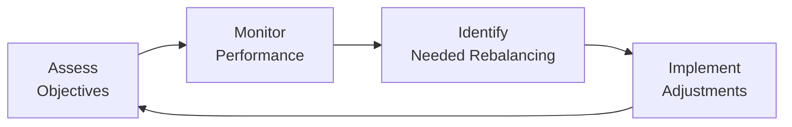

## 18.1 Portfolio Monitoring

Have you ever driven on a long road trip without checking your fuel gauge or your tires’ condition? I once considered driving from Toronto to Montreal—about 500 kilometers—on an empty tank of gas. Actually, I guess “considered” is a strong word: I was just so busy loading up the car that I nearly forgot to check fuel. Luckily, I realized my oversight just in time. In many ways, managing a portfolio is no different. You can set an investment strategy, choose your asset allocation, and be on your merry way—but if you fail to monitor the portfolio as you go, you may discover (too late) that your plan no longer fits your journey. Portfolio monitoring is your dashboard, your ongoing check that all the important performance and risk indicators remain healthy and aligned with the plan you set out in the beginning.

In this section, we’ll look at the essentials of portfolio monitoring: what it entails, why it’s so crucial, how to do it effectively, and how to know when it’s time to rebalance or make strategic shifts. Let’s also weave in some anecdotes, real-world examples, and a few best practices. By the time you’re done reading, you’ll be ready to keep a close, constructive eye on your investments (or your clients’ investments) without driving off into the metaphorical ditch.

### The Purpose of Portfolio Monitoring

Portfolio monitoring is the continuous process of assessing a portfolio’s composition, risk exposure, and performance. It’s all about making sure the investment decisions remain aligned with the client’s—possibly your own—Investment Policy Statement (IPS). Recall from earlier chapters that an IPS is a written document outlining the investor’s objectives, constraints, risk tolerance, time horizon, and overall strategies for achieving financial goals. The IPS serves as the foundation of the portfolio, essentially telling you where you want to go and how you’d like to get there.

But markets evolve, and so do investors’ personal circumstances. A portfolio that’s perfectly balanced today could be misaligned tomorrow. Maybe a life event alters the client’s risk tolerance. Maybe the market’s volatility creeps upward, or maybe new regulations in a specific sector cause that sector to become more (or less) appealing. Monitoring lets you see these shifts in real time. 

### Key Elements of Portfolio Monitoring

Let’s break down some common monitoring activities and see how they come together in practice:

• Reviewing asset allocations relative to the target.  
• Tracking market conditions and macroeconomic indicators.  
• Evaluating sector and security weightings for any sign of concentration risk.  
• Monitoring cash flows—inflows like dividends and interest, plus outflows like withdrawals.  
• Assessing how market volatility affects the portfolio’s expected returns and overall risk.  
• Updating metrics on the securities held (e.g., credit ratings, dividend policies).  
• Identifying underperforming assets and exploring whether it’s time to replace them.  
• Considering the client’s evolving circumstances, such as life events or changes to their investing objectives.

These elements make up the cycle of monitoring—essentially a recurring process of checking, analyzing, adjusting, and moving forward. Let’s imagine a friend of mine, “Amber.” Amber has a mid-sized equity portfolio, mostly Canadian and U.S. stocks, plus a little bit of Canadian fixed income. She meets with her advisor regularly. In one meeting, Amber mentions she might be moving to part-time work soon. Right away, her advisor considers whether that might change the monthly contributions or her risk capacity (see Chapter 2.8 for more on risk capacity). Because portfolio monitoring is ongoing, this conversation quickly flows into an examination of how Amber’s changing job circumstances should impact her allocation. Alternatively, if Amber’s risk profile remains the same, the advisor might do nothing—yet. But having that conversation is part of the natural monitoring loop.

### Keeping Tabs on Asset Allocation and Concentration Risk

Asset allocation monitoring is arguably the anchor of any portfolio review. This involves comparing the actual current weightings of various asset classes with the target allocations defined in the IPS. If you designated 60% equities and 40% fixed income, but equities have grown to become 70% due to market appreciation, that’s a sign. It might mean it’s time to rebalance to maintain risk at the desired level. (We’ll talk more about rebalancing in just a bit.)

Closely related is concentration risk: the danger of being overexposed to a single stock, sector, or region. Market fluctuations in that one area can severely impact the entire portfolio. Think about all the cautionary tales from the early 2000s tech bubble. Many people had huge allocations to a single high-flying tech stock. Great—until it wasn’t. With portfolio monitoring, you can spot that scenario well before it becomes a big problem. Often, advanced screening tools can produce reports showing that, say, 25% of your total portfolio is in energy stocks or 10% is in a single small-cap name. That’s your cue to evaluate whether to trim back or keep an eye on those exposures.

### Watching Market Conditions and Macroeconomic Indicators

Markets are dynamic, subject to constant ups and downs. A shift in central bank interest rates can ripple through bond yields, which in turn can affect equities. Changes in economic growth forecasts, inflation, unemployment, or even trade policies can all have implications for your portfolio. By monitoring relevant macro data, you can adjust your strategy or your holdings so that you’re not caught off guard.

Let’s say you’re managing a fixed income portfolio in Canada, and the Bank of Canada signals rate hikes over the next year. That’s your chance to revisit bonds’ duration (a measure of sensitivity to interest rate changes—see Chapter 11.2 for more). Shortening the duration might help offset the negative price impact of rising rates.

### Monitoring Cash Flows

Cash flow is another big topic. If you’ve got income-oriented securities—like dividend-paying stocks or coupon-paying bonds—those payments become part of the portfolio’s inflows. On the outflow side, maybe the investor is drawing funds for retirement, or making monthly withdrawals for living expenses, or occasionally depositing lumps sums from bonuses or tax refunds. Monitoring these ins and outs can reveal patterns or potential shortfalls. You might realize you’re not generating enough income to cover distributions, forcing you to sell securities at inopportune times. Or you might notice a surplus building up in cash that you prefer to reinvest in more profitable opportunities.

### Evaluating Security-Specific Factors

Some advisors (and self-directed investors) track fundamentals like credit ratings on fixed income holdings, dividend policies for equities, or earnings data for companies. A sudden downgrade in credit rating might be a red flag to reduce or exit a bond position. A corporate dividends cut might signal the company is strapped for cash or facing difficulties. These micro-level data points can be just as crucial as broader macro indicators, particularly for investors who hold individual stocks or bonds instead of broad index funds or ETFs.

### Rebalancing Strategies

Rebalancing is the process of bringing a portfolio back in line with its target allocations after market movement has caused some drift. You can do it periodically (e.g., every quarter or every year) or based on a threshold (e.g., rebalance only when an asset class deviates by more than 5% from its target). Some people even combine both methods: check once a quarter, and only rebalance if the allocation has drifted beyond a certain threshold.

In practice, rebalancing can be tricky. You’ll typically be selling your “winners” (assets that have grown) and buying your “losers” (assets that haven’t grown as much). That can feel counterintuitive—but that’s exactly how rebalancing manages risk. It keeps your allocation from being dominated by just one runaway success that could come crashing down.

If you’re working with a balanced mutual fund, an asset allocation ETF, or a wrap product (discussed in Chapter 12.5), rebalancing might be done automatically by the product manager. Otherwise, it’s entirely on you or your advisor to remain diligent in rebalancing. 

Below is a simple diagram illustrating how continuous monitoring and rebalancing processes often flow in a cycle:

As you can see, portfolio monitoring is never “finished.” It’s a continuous loop. Once you adjust or rebalance, you go back to reassessing your (or your client’s) current objectives and constraints to ensure everything still fits.

### Communication with Clients

At the core of monitoring is the understanding that portfolios are about people’s financial futures. Every time you notice something in the portfolio that warrants attention, you should also consider how to communicate it with the client. In Canada, the Canadian Investment Regulatory Organization (CIRO) expects advisors to maintain open communication about risks, costs, and conflicts of interest. Historically, IIROC and MFDA had these requirements, but since the amalgamation, it’s now CIRO that sets the compliance standards across the board for investment dealers and mutual fund dealers.

Regular statements, monthly or quarterly performance reports, and annual check-ins are common. But when the markets get rocky or the client’s circumstances change, you might want more frequent touch points. For instance, if your client is approaching retirement, you’ll discuss how the portfolio is positioned for this new stage of life. If the client has had a sudden influx of cash, you may propose ways to invest that cash effectively, consistent with the IPS.

### Case Study: Monitoring a Retirement Portfolio

Imagine Charlotte, a 61-year-old retiree in Ottawa. She’s built her portfolio with a plan to retire at age 65. She holds a mix of equities, bonds, and REITs (Real Estate Investment Trusts). Let’s say she meets with you every six months to go over distribution rates, portfolio returns, and risk exposure. Recently, Charlotte inherited a property from a relative in Halifax—congratulations to Charlotte, but that changes her net worth mix and possibly increases her real estate exposure.

With consistent monitoring, you’d flag that her total net worth is now highly concentrated in real estate (both her personal home and an inherited property). You talk to Charlotte about the potential volatility in real estate markets and consider whether to reduce some investment in real estate funds or REITs to keep her portfolio balanced. Maybe she decides to keep the property as a rental, in which case you might adjust the portfolio to account for that new rental income stream. That’s a prime example of how real-life changes necessitate new steps in portfolio monitoring.

### Tools and Techniques

If you’re working in a professional advisory context, specialized software can automatically update daily or even intraday valuations, run risk analytics, and generate alerts when allocations deviate from set thresholds. Common software solutions range from large proprietary systems offered by major institutions to open-source tools. In the open-source realm, many folks turn to Python libraries like pandas and NumPy or use R packages such as PerformanceAnalytics to:

• Calculate performance metrics (returns, volatility, Sharpe Ratio, etc.).  
• Track correlation between assets.  
• Run Value-at-Risk (VaR) simulations.  
• Construct custom plots showing an asset’s or the total portfolio’s drawdowns.

Even if you don’t want to code from scratch, you can find quite a few free or low-cost portfolio tracking websites that let you quickly see how well your holdings are doing. For do-it-yourself investors, advanced spreadsheets (like Google Sheets or Excel, possibly with add-ons) can handle a surprisingly large amount of analysis.

### Regulatory Considerations in Canada

As of 2025, CIRO stands as the unified self-regulatory organization overseeing the activities historically managed by IIROC and MFDA (both of which no longer exist as separate entities). CIRO’s rulebook typically outlines advisor responsibilities regarding portfolio reviews, disclosure, and transparency about fees and conflicts.

Meanwhile, the Canadian Securities Administrators (CSA) have a hand in establishing harmonized regulation across provinces, including rules about how investment performance must be disclosed. This might include guidelines around performance reporting frequency, method of calculating returns, or other aspects of client reporting. 

Additionally, the CFA Institute’s Global Investment Performance Standards (GIPS) provide a framework that’s respected worldwide. Although GIPS is voluntary (unless mandated by certain institutions or client agreements), many asset managers adopt these standards to ensure consistency and to build trust.

### Glossary of Key Terms

• **Investment Policy Statement (IPS):** The foundational written document spelling out the investor’s objectives, constraints, and strategies.  
• **Concentration Risk:** Situations where the portfolio depends too heavily on a single asset, sector, or region.  
• **Credit Rating:** An evaluation of a borrower’s ability to meet its debt obligations. Downgrades can signal an increased likelihood of default.  
• **Rebalancing Threshold:** A certain percentage (or absolute amount) of deviation from target allocation that triggers rebalancing trades.  
• **Volatility:** A measure of the variability of returns, often used in risk analysis.  
• **Cash Flow:** The net movement of money in and out of the portfolio through income, dividends, contributions, and withdrawals.

### Best Practices

• **Use a Dashboard:** Create or use an automated dashboard to get a quick, high-level view of performance, risk, and cash flow daily (or at least weekly).  
• **Schedule Regular Reviews:** Don’t wait until year-end to see if your portfolio is off track. If you prefer threshold-based rebalancing, set an alert that prompts you when market moves cause significant drift.  
• **Document Everything:** Maintain records, especially if you’re an advisor. This helps you demonstrate compliance with CIRO’s guidelines and fosters transparency.  
• **Integrate Life Changes:** Life events such as marriage, divorce, relocation, or changes in employment status often require immediate reevaluation of the IPS.  
• **Stay Informed on Regulations:** Keep up with changes to CIRO policies and CSA guidelines. They can influence what you can hold in a portfolio or how you communicate risk to clients.  
• **Open Communication:** Don’t forget the “human element.” The advisor-client relationship works best with transparent dialogue and consistent expectations.  

### Common Pitfalls

• **Ignoring Small Drifts:** Sometimes ignoring a 1–2% drift can be okay, but letting it grow may create unintended risk.  
• **Over-Trading:** Rebalancing every time the market hiccups can rack up transaction costs and taxes—be mindful.  
• **Emotional Decisions:** A big one, especially in volatile markets. Emotional rebalancing is a recipe for selling low and buying high.  
• **Neglecting Fees:** Something that looks like a small management fee can add up to big differences in net returns over the long haul.  
• **Lack of Clear Thresholds:** Without a well-defined rule (e.g., “rebalance if X or Y occurs”), it’s easy to keep saying, “We’ll rebalance next month.”  

### Sample Table: Portfolio Monitoring Checklist

Below is an example of how you might keep track of important tasks:

| Monitoring Task                      | Frequency      | Notes                                  |
|-------------------------------------|----------------|----------------------------------------|
| Compare actual vs. target allocation| Monthly/Quarterly | Use threshold triggers (±5%).        |
| Check sector/industry exposures     | Quarterly      | Watch for excess concentration risk.   |
| Review credit ratings on bonds      | Quarterly      | Check for any downgrades or warnings. |
| Analyze macro indicators            | Ongoing        | Fed/BoC interest rate announcements.   |
| Evaluate transaction costs          | Annually       | Confirm fees remain competitive.       |
| Confirm client objectives           | Semi-Annually  | Life changes, risk tolerance updates.  |

### Additional References and Resources

• **CIRO (https://www.ciro.ca)**: Canada’s self-regulatory organization for investment dealers and mutual fund dealers.  
• **Canadian Securities Administrators (CSA)**: Various provincial regulators functioning under an umbrella for consistent regulation across Canada.  
• **Global Investment Performance Standards (GIPS)**: Voluntary ethics-based standards for performance reporting.  
• **Open-Source Financial Tools**:  
  - Python: pandas, NumPy, matplotlib, statsmodels  
  - R: PerformanceAnalytics, quantmod  
• **Books & Articles**:  
  - “Investment Analysis and Portfolio Management” by Frank K. Reilly and Keith C. Brown  
  - “Portfolio Management in Practice” by the CFA Institute  
• **Online Courses**:  
  - Canadian Securities Institute (CSI)–Advanced Investment Advice  
  - CFA Institute–online modules on portfolio monitoring & rebalancing  

As we’ve discovered, portfolio monitoring is more than just checking performance—it's a constant process of ensuring relevance, alignment, and quality. Just like checking that your car’s engine runs smoothly before you hit the highway, portfolio monitoring is how you avoid nasty surprises and ensure a smooth ride to your investment destination.

--------------------------------------------------------------------------------

## Test Your Knowledge: Portfolio Monitoring Quiz



### Which of the following is typically included in ongoing portfolio monitoring? 
- [x] Reviewing actual vs. target asset allocations
- [ ] Tracking only the performance of top-performing assets
- [ ] Eliminating all holdings that have experienced a recent price decline
- [ ] Avoiding visits with clients unless the market is up by 10%

> **Explanation:** Monitoring involves comparing actual vs. target allocations, among other tasks. Detailed performance reviews (even of underperforming assets) are crucial, and continuous client communication is essential.

### What is concentration risk in a portfolio context?
- [x] Having a large part of the portfolio in a single asset or sector
- [ ] The risk of having too many different asset classes
- [ ] The chance that a portfolio analysis gets too long
- [ ] A technique for diversifying internationally

> **Explanation:** Concentration risk arises when the portfolio depends too heavily on a single asset, issuer, or sector. This can lead to outsized losses if that asset or sector experiences a downturn.

### Why might an advisor recommend rebalancing an equity-heavy portfolio following a stock market rally?
- [x] To manage and contain risk within the client’s targeted allocation
- [ ] Because every time stocks go up, they must come down
- [ ] To maximize transaction costs
- [ ] To punish the winners and reward the losers

> **Explanation:** Rebalancing ensures the portfolio risk profile remains aligned with the IPS. When equities rally, they may exceed their target weighting, creating elevated risk. Rebalancing trims these positions back to the target.

### When discussing market conditions during portfolio monitoring, which macroeconomic factor is often most relevant for bond portfolios?
- [x] Central bank interest rate policies 
- [ ] Company dividend announcements 
- [ ] Changes to the S&P/TSX composition 
- [ ] Commodity prices for agricultural goods

> **Explanation:** Bond portfolios are heavily influenced by interest rate policies. When central banks change rates, bond yields and prices typically adjust accordingly.

### Which of the following best describes the role of credit ratings in monitoring? 
- [x] They help assess the risk of default in the portfolio’s bond holdings
- [ ] They indicate how well a company’s stock will perform during a bull market
- [x] They provide insight into the financial health of governments and corporations
- [ ] They measure liquidity risk in emerging markets only

> **Explanation:** Credit ratings assess the financial health and default risk ofissuers (governments, corporations) that have issued debt. Monitoring those ratings helps gauge the bond holdings’ risk profile.

### How do rebalancing thresholds typically work in a portfolio?
- [x] They trigger a rebalancing trade when an asset class drifts beyond a certain percentage from its target
- [ ] They require daily portfolio turnover, regardless of market conditions
- [ ] They only apply when overweight assets are underperforming
- [ ] They eliminate losses by preventing price fluctuations

> **Explanation:** Rebalancing thresholds are pre-set rules so that if an asset class exceeds (or falls below) the desired target allocation by a specified percentage, an automatic or scheduled rebalance is triggered.

### In Canada, which organization now provides national self-regulatory oversight for both investment dealers and mutual fund dealers?
- [x] CIRO
- [ ] The defunct MFDA
- [x] The defunct IIROC
- [ ] The U.S. Securities and Exchange Commission

> **Explanation:** As of 2025, CIRO (Canadian Investment Regulatory Organization) is the amalgamated self-regulator, replacing the historical IIROC and MFDA. The SEC is a U.S. regulator, not a Canadian one.

### Why is client communication a key component of portfolio monitoring?
- [x] Clients should be aware of any recommended changes and the reasons behind them
- [ ] Advisors must keep all monitoring activities confidential 
- [ ] It’s only necessary if the portfolio is losing money
- [ ] Communication is irrelevant once the client signs the IPS

> **Explanation:** Effective portfolio monitoring includes transparency with the client—discussing performance, fees, and any suggested shifts to maintain trust and alignment.

### Which of the following tools can be used for open-source portfolio monitoring and data analysis?
- [x] Python libraries like pandas and NumPy
- [ ] Only expensive proprietary trading systems
- [ ] Spreadsheet software that lacks financial functions
- [ ] Random gaming applications

> **Explanation:** Python libraries (pandas/NumPy) and R packages (like PerformanceAnalytics) are widely used among both professionals and amateurs for portfolio monitoring, thanks to their robust data-handling and analytical capabilities.

### True or False: Rebalancing may involve selling high-performing assets to buy those that have underperformed. 
- [x] True
- [ ] False

> **Explanation:** Rebalancing often means selling some “winners” that have grown beyond their target allocation and buying “losers” that have become underrepresented. It’s a fundamental risk management practice.


