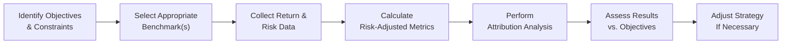

## 18.2 Performance Evaluation

You know, back when I first started checking the performance of my own tiny portfolio (we’re talking pocket-change investing days), I remember feeling both excited and completely overwhelmed. I could see the numbers going up or down, but I had no clue if my results were actually good relative to the market. And that’s the big question, right? Because “up” doesn’t always mean “good,” and “down” doesn’t always mean “bad.” Performance evaluation is the science—some might even say art—of dissecting your returns to see just how well (or poorly) your portfolio is doing. Let’s walk through the key components step by step, from the basics of benchmarking all the way to advanced attribution techniques and official Canadian regulatory frameworks.

### Why Does Performance Evaluation Matter?

Performance evaluation is crucial. It’s about measuring whether your portfolio’s returns line up with your objectives. And since every investor has different objectives—think retirement goals, tax considerations, or personal constraints—it becomes absolutely essential to track how well the portfolio meets those specific expectations. Maybe your top priority is long-term capital appreciation, or maybe you need stable income. A thoughtful and thorough performance evaluation helps you see whether you’re on track and, if not, how to fix it. This is especially true for investment advisors who must demonstrate to clients (and regulators such as CIRO) that they’re making prudent and suitable decisions according to the client’s risk profile.

### Key Concepts in Performance Evaluation

Before we dive deeper, let’s go over some fundamental ideas and terms. Sure, you might have heard of the Sharpe Ratio and Jensen’s Alpha. But let’s define them concisely:

• Benchmark: A standard yardstick (like the S&P/TSX Composite for Canadian equities) that helps compare a portfolio’s performance against the broader market or specific segments of that market.  
• Absolute Returns: This is the raw gain or loss over a set time—often represented as a percentage.  
• Relative Returns: How the portfolio performed compared to something else, like a benchmark or another portfolio.  
• Sharpe Ratio: A measure of risk-adjusted performance, taking the portfolio’s excess returns over the risk-free rate and dividing by the standard deviation of those excess returns.  
• Treynor Ratio: Another measure of risk-adjusted performance, but it focuses on systematic risk (beta) instead of total volatility.  
• Jensen’s Alpha: The extra return (above what traditional asset pricing models predict, like the CAPM) that might indicate the portfolio manager’s skill.  
• Attribution Analysis: Dissects the returns to figure out how much stems from asset allocation, security selection, market timing, and other factors.

### Benchmarking

It’s easy to think you’re making loads of money until you realize everyone else is making more (or vice versa!). Benchmarks are basically your signpost for whether your performance is “good, bad, or average” in market context. If you’re primarily invested in Canadian equities, a relevant benchmark might be the S&P/TSX Composite Index. For U.S. equities, folks often look at the S&P 500. If your portfolio invests in Canadian fixed income securities, the FTSE Canada Universe Bond Index might be a good choice.

The trick is choosing a benchmark that aligns with your investment strategy. If your portfolio holds small-cap stocks and you measure yourself against a large-cap benchmark, you’re comparing apples to oranges. Not only is that unhelpful, but it can also mislead you into thinking your returns need serious improvement (or are more stellar) when in reality you’re just using the wrong yardstick.

### Absolute vs. Relative Returns

Let’s say your portfolio gained 5% over the past year. Is that good? Well, it depends. If the overall equity market sank 2%, then 5% is impressive. If the market soared 20%, then 5% might be less thrilling. Absolute return measures are straightforward: “Did I make money or lose money?” But they don’t necessarily provide context as to whether that result is strong or weak for the risk you took.

Relative returns give you that perspective: “Am I above or below the market performance?” or “How do I compare to an index or peer group?” In professional money management, relative returns often take center stage. After all, you want to know whether your investment skill is beating a “do-nothing,” passive approach that just mimics a benchmark.

### Risk-Adjusted Measures

If there’s one thing that nearly every new (and seasoned) investor underestimates, it’s risk. A 10% return from a super-stable blue-chip portfolio is usually more noteworthy than a 10% return from an incredibly volatile penny-stock portfolio. That’s where risk-adjusted metrics shine. They tell us: “How much risk did you take to get that return?”

• Sharpe Ratio:  
  – Formula: (Portfolio Return − Risk-Free Rate) ÷ Standard Deviation of Excess Return.  
  – The idea is simple: For every unit of total risk, how much excess return did the portfolio generate?  
  – A higher Sharpe ratio suggests your portfolio was more efficient at converting risk into returns.

• Treynor Ratio:  
  – Focuses only on systematic risk by using the portfolio’s beta in the denominator.  
  – The formula is (Portfolio Return − Risk-Free Rate) ÷ Beta.  
  – If you’ve dialed into a certain market or sector, Treynor can highlight whether you’re being compensated well for that market-specific risk.

• Jensen’s Alpha:  
  – Often referred to simply as “alpha,” it’s the difference between the actual return and what the Capital Asset Pricing Model (CAPM) would predict you should earn for the risk you’re taking.  
  – A positive alpha implies you’ve outperformed the “expected” return (often considered a sign of manager skill), while a negative alpha indicates underperformance.

These measures can be super helpful, but they each have limitations. For instance, the Sharpe Ratio might punish a portfolio that hedges effectively (reducing volatility). Treynor relies heavily on beta, but beta itself assumes a certain linear relationship with the market that may not always hold. Jensen’s Alpha draws from the CAPM, which may not always reflect real-world complexities, like changing correlations or multifactor influences.

### Performance Attribution

Whenever I chat with my colleagues—especially those who actively pick stocks—they get pretty pumped about performance attribution. Why? Because it allows them to say, “Hey, I didn’t just get lucky. My stock picks in the technology sector actually drove most of the gains.” Performance attribution generally breaks down your returns into several buckets:

• Asset Allocation: Did your overall division between equities, bonds, cash, and alternatives add or subtract value compared to a neutral benchmark? For example, if you weighed heavily in Canadian equities during a bull run in Canada, that could be a positive asset allocation effect.  
• Sector Selection: Within equities, did you lean into or avoid specific sectors such as energy, tech, financials, or healthcare?  
• Security Selection: Once you decided on a sector, did you pick the specific stocks or bonds that outperformed the rest?  
• Timing Effect: When did you get in or out? This is about the entry and exit timing for positions. Good timing can enhance returns; poor timing can hamper an otherwise solid strategy.

Attribution is powerful because, if done meticulously, it can reveal whether your portfolio manager’s skill truly added value—or if the portfolio just rode broad market trends. Many advisors show clients a table or a chart that tallies these effects, helping them see each building block of the total return.

### Style Analysis

Style analysis is like understanding your personal fashion sense—are you typically wearing “growth” outfits or do you stick to a “value” wardrobe? Likewise, in investing, “style” refers to the characteristics of the securities you choose. Growth investing focuses on companies expected to grow faster than average (often tech or disruptive industries), whereas value investing zeroes in on “undervalued” companies that might be overlooked by the market. There’s also momentum investing, which seeks the latest winners, hoping they’ll keep winning.

Style analysis is important because if a fund manager claims they’re a “value” investor, but you notice a lot of high-tech, high-PE ratio names in the portfolio, there’s a mismatch. It can also reveal how much style drift might be responsible for performance. For instance, a portfolio might have swung into growth stocks right as the market soared for those segments—leading to outperformance that may or may not persist.

### Consistency and Persistence

One big question that’s always on investors’ minds is whether performance is repeatable. Did your portfolio manager just get lucky one quarter because of a random biotech stock? Or do they have a track record of beating the benchmark consistently, year after year?

Consistency matters. You’re not just looking at a single time window; you want to see how the portfolio performs across different market cycles. Some look at rolling periods (e.g., rolling five-year returns). This helps see if the performance is robust or if it’s just riding a short-term wave. Persistence can also feed into your risk management. If a manager is known to be “boom or bust,” you’ll want to reflect on whether you’re comfortable with that style.

### Client-Specific Factors

Of course, real-life investing isn’t purely about maximizing your alpha. Clients have taxes to worry about, personal liquidity needs, constraints on how much risk they can handle, ethical preferences (like responsible investing), or a desire to avoid certain sectors. Better performance measurement also takes these nuances into account.

For instance:  
• A higher-turnover strategy might produce net gains before taxes, but the realized taxes could reduce net returns considerably for a taxable investor.  
• Certain securities might deliver better pre-tax returns, but if the client’s primary objective is stable after-tax income or principal preservation, the manager might prefer a different approach.  
• Performance results should be presented net of fees (such as management and advisory fees) to show the true returns a client achieves.

### Canadian Regulatory Considerations

In Canada, performance reporting is subject to both industry self-regulation and oversight from the Canadian Securities Administrators (CSA). As of January 1, 2023, the Mutual Fund Dealers Association (MFDA) and the Investment Industry Regulatory Organization of Canada (IIROC) have been replaced by the Canadian Investment Regulatory Organization (CIRO). CIRO is responsible for monitoring how dealers disclose performance and risk-related information to clients, so it’s vital for advisors to stay compliant with these guidelines.

• CIRO guidelines on client reporting: They highlight what dealers must include when reporting performance to clients (e.g., annualized percentage returns, fees, disclaimers).  
• CSA’s National Instrument 31-103: Sets standards for client relationship models, including how performance information should be provided.  
• GIPS (Global Investment Performance Standards): A set of international standards from the CFA Institute that many Canadian asset managers adopt for transparent and consistent performance presentation.

If you want official updates, you can always look up https://www.ciro.ca for the latest resources.

### Tools and Frameworks

Thanks to the wonders of technology, robust performance evaluation isn’t limited to big institutions. You can try the following tools:

• Portfolio Visualizer (online and web-based) offers modules for factor analysis, asset allocation backtesting, and risk metrics.  
• Morningstar Direct (subscription-based) is popular among advisors for in-depth analytics and manager research.  
• R Packages (like “tseries,” “quantmod,” or “PerformanceAnalytics”) provide open-source ways to slice and dice performance data.

Many of these tools let you calculate risk-adjusted metrics, run attributions, and track performance over time. It’s worth noting that the learning curve can vary, so if you’re new to coding, start with user-friendly tools and work your way up.

### Best Practices and Common Pitfalls

• Use the Right Benchmark. Pick a benchmark that closely resembles what’s in your portfolio. By the way, combining multiple benchmarks (e.g., weighting them by target asset allocation) can get you closer to an “apples-to-apples” comparison.  
• Keep Your Timeframes Consistent. When you measure returns and risk, ensure everything lines up consistently (e.g., if your portfolio performance is annualized, do the same for the benchmark).  
• Remember that Ratios Can Distort Reality. A single, eye-popping Sharpe Ratio might come from a short timeframe with limited volatility. Always cross-check with longer periods.  
• Watch Out for Survivorship Bias. If you’re looking at historical manager performance, remember that funds with poor performance might have closed or merged, distorting the data set.  
• Factor in Fees and Taxes. Clients care about net returns, not just gross returns.  
• Avoid Chasing Past Performance. Just because a sector soared in the last three years doesn’t guarantee it will keep soaring. Performance evaluation is a retrospective tool, so combine it with forward-looking risk assessments.

### A Simple Process Flow

Sometimes visualizing how performance evaluation works can be super helpful. Below is a Mermaid diagram illustrating a streamlined approach:

In this figure:  
• You start by clarifying client objectives.  
• Then you select an appropriate benchmark.  
• Next, gather return and risk data.  
• Calculate relevant metrics (Sharpe, Treynor, etc.).  
• Do an attribution breakdown.  
• Assess if you’ve met your objectives.  
• Adjust accordingly and repeat the cycle.

### Real-World Example

Let’s take a hypothetical scenario:  
• You manage a balanced portfolio with 60% equities and 40% fixed income.  
• You use a custom benchmark that’s 60% S&P/TSX Composite and 40% FTSE Canada Universe Bond Index.  
• Over the year, your portfolio returns 8%. During the same period, your custom benchmark returns 7%.  
• Next, you find out the Sharpe Ratio for the portfolio is 1.20, compared to 1.15 for the benchmark.  
• You run an attribution analysis and discover that security selection in technology stocks contributed +1.0% relative to the benchmark, while overweighting in certain cyclical industries subtracted 0.5%. Timing effects added a net 0.2%.

Overall, you outperformed your benchmark by 1% (8% vs. 7%), and the attribution analysis confirms that good stock picks in tech were key. The manager can then communicate to clients: “Look, we generated 8%, which is above the 7% benchmark. Our Sharpe Ratio is slightly higher, indicating we took on a slightly better risk/return trade-off. Here are the main reasons we succeeded.” That narrative is powerful both for the client and for refining your own strategy.

### Additional Resources

• Books & Articles:  
  – “CFA Program Curriculum” (Levels I, II, and III) provides an in-depth exploration of performance evaluation methodologies.  
• Online Courses:  
  – CSI’s Investment Management Techniques (IMT®) covers advanced performance and portfolio methods, diving deeper into risk measurement and analytical frameworks.  
  – Coursera specializations on investment analysis and portfolio management feature modules on performance measurement and attribution.  

### Final Thoughts

Performance evaluation is about more than just numbers on a statement. It’s the narrative of how your investment decisions, market conditions, and manager skill come together (or sometimes collide). And while it can get pretty technical—I’ve definitely “nerded out” over an Excel pivot table more than once—the fundamentals remain straightforward: choose your benchmark wisely, understand risk-adjusted metrics, dissect the sources of returns, and present everything in a client-friendly way that factor in personal constraints. Combine these elements with consistent monitoring (as discussed in the broader context of Chapter 18), and you’ll have a powerful system for guiding investment decisions and optimizing portfolio outcomes.

Now that we’ve unpacked performance evaluation, hopefully you feel a bit more confident in understanding what’s behind the numbers. If you find that your actual performance review still seems murky, remember that ongoing learning is part of the deal—especially as new tools, regulations, and market conditions evolve in Canada and beyond. Keep exploring, keep questioning, and keep refining your approach.

---

## Test Your Knowledge: Performance Evaluation Essentials



### Which term describes the portfolio’s performance compared to a standard yardstick like the S&P/TSX Composite Index?

- [ ] Absolute Return
- [x] Relative Return
- [ ] Total Return
- [ ] Net Return

> **Explanation:** Relative return emphasizes performance versus a benchmark. Absolute return doesn’t provide a direct market comparison.

### Which of the following best reflects the usefulness of the Sharpe Ratio?

- [x] It measures excess return per unit of total risk.
- [ ] It focuses solely on systematic risk as measured by beta.
- [ ] It compares your portfolio to peer funds only.
- [ ] It indicates the likelihood of a fund’s survival over time.

> **Explanation:** The Sharpe Ratio is derived by dividing the excess return (over the risk-free rate) by the total volatility (standard deviation) of the portfolio.

### In performance evaluation, what is the primary role of a benchmark?

- [x] To act as a reference point for comparing portfolio returns.
- [ ] To guarantee a minimum acceptable return.
- [ ] To eliminate all unsystematic risk.
- [ ] To determine the exact tax owed on portfolio gains.

> **Explanation:** Benchmarks track a certain market (like Canadian equities) and allow investors to gauge if the portfolio is underperforming or outperforming that market portion.

### Jensen’s Alpha is used to:

- [x] Evaluate how much of a portfolio’s return can be attributed to manager skill beyond market expectations.
- [ ] Calculate total volatility in the market.
- [ ] Measure the risk-free rate in the capital markets.
- [ ] Compare bond yields to stock dividends.

> **Explanation:** Jensen’s Alpha is the difference between the portfolio’s actual return and the expected return (given the portfolio’s risk level under CAPM).

### Which of the following factors is NOT typically included in performance attribution?

- [ ] Asset Allocation
- [ ] Sector Selection
- [x] Broker Selection
- [ ] Security Selection

> **Explanation:** Performance attribution commonly includes asset allocation, sector or industry allocation, and security selection. Broker choice is typically not a component of return attribution.

### Style analysis primarily helps identify:

- [x] Whether the fund follows a growth, value, or momentum approach and if it aligns with stated objectives.
- [ ] Whether a manager invests strictly in small-cap stocks.
- [ ] If a portfolio is over-leveraged.
- [ ] When the manager entered or exited positions.

> **Explanation:** Style analysis focuses on characterizing the portfolio’s investment approach, such as growth vs. value.

### Which regulatory body oversees investment dealers in Canada as of 2025?

- [x] CIRO
- [ ] IIROC
- [ ] MFDA
- [ ] OSC

> **Explanation:** In 2025, IIROC and MFDA are defunct and have merged into the Canadian Investment Regulatory Organization (CIRO).

### A main difference between the Sharpe Ratio and the Treynor Ratio is that:

- [ ] The Sharpe Ratio uses beta while the Treynor Ratio uses standard deviation.
- [x] The Sharpe Ratio considers total risk, while the Treynor Ratio considers only systematic risk.
- [ ] Both only consider systematic risk.
- [ ] The Treynor Ratio is always larger than the Sharpe Ratio.

> **Explanation:** The Sharpe Ratio uses standard deviation (total risk) in the denominator, while the Treynor Ratio uses beta (systematic risk).

### When performance is measured “net of fees,” it means:

- [x] All management and advisory costs are deducted from the returns before reporting to the client.
- [ ] Only transaction fees are removed, not management fees.
- [ ] All returns are reported without accounting for any fees. 
- [ ] The returns are multiplied by the fees but not subtracted.

> **Explanation:** Net-of-fees returns remove the impact of management and advisory costs, providing a realistic net result for the client.

### Performance evaluation is best described as a process of:

- [x] Measuring returns against benchmarks and risk parameters to assess results.
- [ ] Selecting only the best-performing stocks each quarter.
- [ ] Guaranteeing future returns based on past performance.
- [ ] Avoiding all risk in a portfolio.

> **Explanation:** Performance evaluation is about understanding how returns stack up against investor objectives, benchmarks, and the level of risk taken, rather than guaranteeing future results.


