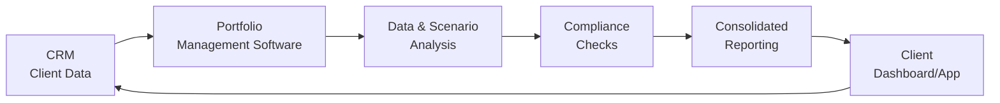
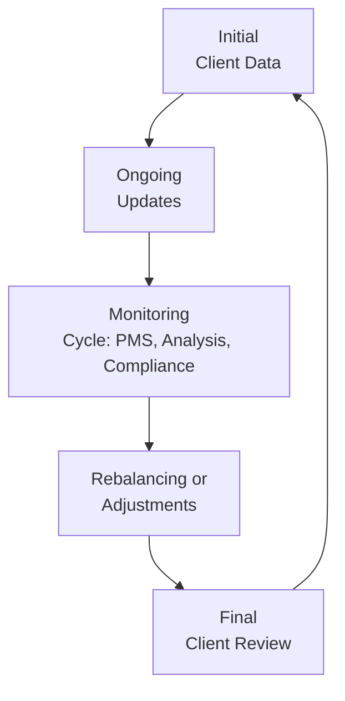

## 18.3 Tools and Techniques for Monitoring

Have you ever glanced at your investment account on a Friday afternoon and thought, “Wait, something here looks off?” I’ll never forget a time early in my career when I stayed up way too late analyzing a client’s holdings using a jumbled spreadsheet. A single typo caused me to misreport the client’s total returns. Honestly, it was humbling. That moment taught me how crucial solid monitoring tools are. Now, we have a wealth of tech solutions that streamline these processes—making it easier to avoid the headaches and errors that can creep in when we track portfolios manually.

Monitoring is at the heart of portfolio management. It sounds pretty straightforward: “Just keep an eye on things.” But once you start juggling multiple clients, regulatory requirements, and a swirl of market data, it can be downright overwhelming. This is where technology stands out as a real game-changer. From time-saving automations to advanced analytics, the right set of monitoring tools helps advisors stay on top of every relevant detail. And importantly, it keeps your client relationships strong, because you’re able to highlight any issues (or unexpected opportunities) almost the minute they appear.

Below, we’ll discuss many of the most common tools and techniques used for monitoring in investment management. We’ll walk through practical tips on how to use them—and also sprinkle in some real-world scenarios so you can see how all these fancy acronyms and dashboards translate into day-to-day advising.

Monitoring and the Bigger Picture of Portfolio Management

Monitoring a portfolio is closely related to the broader topics introduced in Chapter 18: Portfolio Monitoring and Performance Evaluation. Specifically, the concept of “Portfolio Monitoring” from Section 18.1 sets the stage by explaining the importance of continuous oversight. You might also recall from Chapters 16.1 to 16.3 that risk measurement and diversification analyses are integral to deciding when to act on monitored data. And in Chapter 3.2, we touched on how asset allocation strategies can shift over time—yet another aspect you’ll need to keep a watchful eye on.

In the Canadian market, we are always mindful of the oversight responsibilities spelled out by the Canadian Investment Regulatory Organization (CIRO). If you’re a registered representative, you’ve probably learned that thorough monitoring is vital not just for your client’s well-being, but also for maintaining compliance. With that in mind, let’s jump into the key tools and techniques that keep modern advisors sleeping a bit more soundly at night.

Client Relationship Management (CRM) Systems

One foundational tool is the CRM system. I can’t stress how often I’ve leaned on a CRM to locate a stray client note or recall a conversation from eight months ago. Think of a CRM system as a central repository for all your client data: from their risk profiles, contact details, and objectives, to that random piece of feedback they gave during your last call. Not only can a CRM help you store data, it also helps you manage tasks, set reminders, and keep historical records in an organized fashion.

• Contact and Preference Tracking: CRMs let you record a client’s risk tolerance, investment goals, or any special instructions—like their preference for ethical or responsible investments.  
• Ties Directly to Compliance: CRMs can serve as an evidence trail of your communications. Should an audit ever occur, you have a backlog of all your exchanges, disclaimers, or updates.  
• Integration with Other Systems: Most CRM solutions integrate nicely with portfolio management software, letting you quickly see account balances and performance metrics on the same platform.  

Let’s say you have a client who typically meets you for lunch every quarter to go over performance. A CRM can alert you when that lunch is coming up, remind you of any special topics you needed to address (maybe they’re curious about cryptocurrency), and show you the latest statements in one easy view. Simple, right? Not having to rummage through old emails or file folders for those details is more than worth the price of admission.

Portfolio Management Software

If a CRM is your central hub of client data, portfolio management software is the nerve center of your actual investments. A robust portfolio management system (PMS) handles tasks such as real-time tracking, performance calculations, and analytics. Typical software in the Canadian market includes solutions like Advent, RBC Advisor tools, Albridge, or other FinTech offerings. The hallmark of a good PMS is that it provides a consolidated view of your clients’ holdings, showing everything from bond coupon payments to risk metrics like beta or standard deviation.

• Real-Time Positions and Performance: No more waiting for end-of-day uploads or manual spreadsheets. You can pull up an account and see precisely where it stands—often refreshing every few minutes.  
• Portfolio Analytics: These systems typically come with built-in or add-on modules for performance attribution, risk contributions, and other sophisticated analytics.  
• Custom Reporting: Some clients need a succinct, one-page snapshot; others want a 20-page breakdown by asset class. A decent PMS lets you generate custom reports on demand.  

When I first got my hands on a real-time portfolio dashboard, it felt like a total revelation. Instead of exporting data from my old spreadsheets every week, I could just log in and see (and quickly interpret) everything. Sure, dashboards can get pretty fancy—some systems even spin up interactive pie charts that let you toggle on and off certain asset classes. But what matters most is that these platforms arm you with instant insights. You’ll avoid nasty surprises, because you’re able to see risk exposures or big sector skews as soon as they start forming.

Data Aggregation and Analysis Tools

Now, let’s talk about the truly exciting part: data aggregation and analysis. Tools like Python, R, Power BI, and Tableau can be integrated right into your workflow to bring a deeper layer of customization. For example, if you’re partial to Python or R, you can harness numerous open-source libraries to import real-time price feeds, run scenario analyses, or produce visually stunning interactive charts.

• Scenario Testing: With these tools, you can run what-if analyses. Want to know how a portfolio might respond if the equity market drops 15% or if interest rates spike 1%? These scripts will simulate it for you.  
• Risk Metrics: Tools like Python or R let you easily compute or backtest risk metrics—Value at Risk (VaR), Sharpe ratios, or specific betas. If you can dream it, you can most likely code it.  
• Bespoke Dashboards: Platforms like Power BI or Tableau turn that raw data into user-friendly, dynamic dashboards that you can share with colleagues or clients.  

One of my favorite personal projects was building a small Python script that analyzed correlations between different client holdings. I’ll be honest: I mostly built it out of curiosity. But it soon became a cornerstone in monthly monitoring. It quickly showed me when certain holdings became too correlated—indicating a hidden risk I might have missed otherwise.

Of course, if you’re not a programming buff, there’s no shame in toggling some simpler analytics in your PMS or using specialized BI tools that come with a friendlier user interface. The main point is you’re testing the portfolio under multiple conditions so that you—and your client—aren’t blindsided by market changes. We first introduced these topics in “16.2 Measuring Investment Risk” and “16.3 How Diversification Can Reduce Investment Risk.” The same foundational work applies here, but on the ongoing, day-to-day side of things.

Mobile Apps and Dashboards for Clients

We live in an era where it’s common for clients to whip out their phones and check the daily changes in their investment accounts. You may have a friend who glances at a Robinhood or Wealthsimple app 12 times a day—admittedly, that might be too frequent! But that’s the modern reality: clients expect easy access to information.

• Client-Accessible Dashboards: Many advisory firms create or license a branded client portal, where clients can log in to see positions, account value, and historical performance.  
• Push Notifications: If something significant happens—like the portfolio’s daily change surpasses a certain threshold—a notification can be automatically triggered.  
• Secure Messaging: Some of these apps let you chat directly with your client, eliminating the need for less secure email threads.  

I once had a client who traveled constantly for work. This person loved that they could check their portfolio while waiting to board flights, feeling they stayed in the loop. Truth be told, it also meant fewer anxious phone calls to me wondering if they were “still on track.” Something about having a real-time or near-real-time feed puts certain clients at ease. 

However, be mindful of the potential for “over-monitoring.” Sometimes, seeing daily fluctuations can spur emotional decision-making. We discuss behavioral finance aspects in Chapters 2.1 to 2.7, describing how investor biases could push people to panic-sell on a dip that is actually just short-term noise. Part of your job is helping your clients recognize that daily or monthly performance is not the full story.

Compliance Monitoring Tools

Let’s now delve into the area that can rapidly turn into a compliance nightmare if neglected: overseeing mandates, regulatory guidelines, and conflicts of interest. Organizations operating under CIRO must be vigilant about staying within their mandates—both for the well-being of their clients and to avoid regulatory trouble. 

• Automatic Alerts: Suppose you have a client with a specific investment policy that forbids any equity with a dividend yield under 1%. Advanced compliance systems can instantly flag a violation if a stock in the portfolio deviates below that threshold.  
• Documentation and Audit Trails: Tools that log every step in rebalancing or order placement, ensuring that the firm has a complete record if regulators come knocking.  
• Restricted and Grey Lists: If you’re part of a larger firm with insider information about certain issuers, compliance tools ensure those securities remain off-limits.  

Historically, these checks were done by staff physically flipping through statements or logs (not exactly the swiftest approach). Now, integrated compliance modules or specialized solutions can help you respond to potential issues in near real-time. In Canada, you can find official guidance and best practices around these compliance processes in resources from CIRO, as well as certain guidance documents from the CSA (Canadian Securities Administrators). Having robust compliance monitoring is not just about avoiding penalties; it’s about building trust and credibility in your advisory practice.

Consolidated Reporting and the Quest for a 360° View

A question I come across a lot: “Do we have to split everything up if the client holds multiple accounts with me or invests in both personal and corporate accounts?” The answer is: not at all. Good consolidated reporting merges all the data for different account types—RRSP, TFSA, corporate holdings, etc.—into an overarching snapshot. This can be unbelievably helpful for the client who doesn’t want to track five different statements every month.

• Unified Performance Metrics: Summarize the entire portfolio’s risk, return, and asset mix across different accounts.  
• Goal-Based Analysis: With consolidated data, you can see how each pot is contributing to the client’s broader objectives—such as retirement or a child’s education fund.  
• Efficiency for the Advisor: You save loads of time (and possible errors) by leaning on software that does the heavy lifting in aggregation and reporting.  

In some advanced setups, you can also integrate external data feeds. For example, you might capture a client’s 401(k)/RRSP in one system while also plugging in a spouse’s margin account. If you adopt scenario testing, you can run macro stress tests on the entire family’s finances in one shot, versus doing them piecemeal. It’s a slick approach that fosters deeper client trust and transparency.

Practical Example: Monitoring a Balanced Portfolio

Imagine you’re overseeing a balanced retirement portfolio with 60% equities and 40% fixed income. Over the past quarter, your analysis reveals that equity has grown to 65% due to robust market gains, while fixed income weighting has dipped to 35%. That might be a signal to rebalance. But let’s layer in even more detail:

• CRM records: The client wants to keep moderate risk, so an equity shift from 60% to 65% might be outside their comfort zone.  
• Portfolio Management Software: Shows the new asset allocations and highlights that the equity portion’s beta has increased from 0.9 to 1.1.  
• Data Analysis Tool: A quick scenario test in R suggests that if equities drop 10%, your client’s total portfolio drop is now larger than you’d projected initially.  
• Compliance Monitoring: Confirms the shift doesn’t violate any stated restrictions, but flags that additional documentation may be necessary if the rebalancing is not done.  
• Final Client Dashboard: Once you rebalance, the new allocation updates automatically, and the client can see a fresh overview that same day via their mobile app.  

All of these steps happen more or less behind the scenes for the client, but the synergy of these monitoring tools ensures you keep a close eye on the portfolio’s risk, compliance, and alignment with the client’s goals. It’s a prime illustration of how coordinated technology can save time, reduce errors, and provide a real sense of control over the investment process.

Mermaid Diagram: Simplified Monitoring Workflow

Below is a simplified flowchart showing how monitoring tools might come together in an advisory context:

• CRM stores critical client info.  
• PMS tracks real-time portfolio data and alerts.  
• Analysis tools refine risk, performance, and scenario tests.  
• Compliance checks highlight red flags or policy breaches.  
• Consolidated reporting compiles everything into a cohesive view.  
• Finally, data is pushed to or pulled from the client’s dashboard, feeding back into the CRM with updated notes or actions.

Another Look: The Monitoring Cycle

One could also visualize monitoring as a continuous cycle. You store and track your initial data in a CRM, sync with your portfolio management software, and feed that data into compliance checks. Any resulting changes or rebalancing instructions feed back into the system, ensuring your CRM is always up to date.

This cyclical process emphasizes the iterative nature of monitoring—rather than a one-and-done approach, it is constantly evolving in real time.

Best Practices, Pitfalls, and Challenges

Like anything in finance, monitoring has best practices as well as pitfalls:

• Best Practices:  
  – Keep your software current: Nothing’s more frustrating than discovering your dashboard is giving stale data due to a missed system update.  
  – Document everything: Whether you’re making changes or not, keep thorough notes. This helps if regulators or the client ever question your actions.  
  – Integrate compliance from day one: Don’t wait until you’re about to place a trade. Build compliance checks right into your daily routine—like an autopilot system for your firm.  

• Common Pitfalls:  
  – Over-reliance on automation: Sure, technology is amazing, but it’s still crucial to apply your own critical thinking to interpret those color-coded risk warnings.  
  – Data Overload: You can measure literally hundreds of metrics, but which matter most for your client? Focus on the ones that align with your client’s objectives and constraints.  
  – Security Lapses: Working with so many data feeds introduces cybersecurity vulnerabilities. Make sure your software is robustly tested and that your staff follows safe practices (like using strong passwords and multi-factor authentication).  

• Challenges:  
  – Cost: Some of these enterprise-level solutions can be pricey. Small or independent advisors may have to compromise on certain features.  
  – Learning Curve: Tools like Python or R are powerful but can also be intimidating for those without a programming background.  
  – Keeping Clients Informed: Not all clients want (or can handle) the flood of data. Part of your job is curating what they see to keep them from feeling overwhelmed or anxious.  

Regulatory Context in Canada

As you already know if you’ve read the earlier chapters, the CSA (Canadian Securities Administrators) creates many of the frameworks for trade supervision and account oversight. Meanwhile, the Canadian Investment Regulatory Organization (CIRO) provides self-regulatory guidance for compliance measures and best practices.

Historically, the Investment Industry Regulatory Organization of Canada (IIROC) and the Mutual Fund Dealers Association of Canada (MFDA) were separate SROs, but both were amalgamated into CIRO. If you’re subject to these requirements, using robust compliance tools is essential to avoid running afoul of policies on KYC (Know Your Client), KYP (Know Your Product), and other relevant obligations. CIRO’s website at https://www.ciro.ca provides up-to-date guidance, notices, and bulletins that outline the procedures your tools should facilitate—from generating risk alerts to ensuring no conflicts exist between your personal trades and client trades.

Glossary Highlights

• CRM (Client Relationship Management): Software to manage customer data, communications, and objectives throughout the client lifecycle.  
• Scenario Testing (What-If Analysis): Techniques used to predict how a portfolio might behave under various market or economic conditions.  
• Risk Metrics: Quantitative measures such as beta, standard deviation, and Value at Risk to assess potential returns and downside.  
• Consolidated Reporting: Reporting that brings together multiple client accounts (e.g., RRSP, TFSA, taxable investment accounts) into a single, complete picture.  

Additional Resources

• CIRO (https://www.ciro.ca): Official national self-regulatory body for investment dealers and mutual fund dealers in Canada, offering regulatory guidance and investor protection resources.  
• Power BI (https://powerbi.microsoft.com/): Microsoft’s business intelligence tool.  
• Tableau (https://www.tableau.com/): Another leading data visualization and BI platform.  
• Python (https://www.python.org/): Popular open-source programming language used in finance for data analysis.  
• R (https://cran.r-project.org/): Open-source language and software for statistical computing and data visualization.  
• QuantLib (http://quantlib.org/): An open-source library for quantitative finance, widely used for risk analysis and pricing.  
• CSA (https://www.securities-administrators.ca/): Canadian Securities Administrators, for regulatory instruments and notices.  

Closing Thoughts

Monitoring is not just about crunching data. It’s about ensuring a portfolio stays true to a client’s evolving situation, risk tolerance, and compliance constraints. With the modern technology available, advisors have a range of options that go far beyond simple spreadsheets. Yes, there is always a bit of a learning curve, but the benefits—in time savings, increased accuracy, and better client communication—are immense.

Keep in mind also that the market is dynamic. That means your monitoring processes and tools should evolve, too. Try out new analytics dashboards, refine your scenario testing methods, or incorporate AI-driven insights as they become more accessible. Whatever roads you choose, ensure you’re upholding the fundamental principle that your client’s well-being remains at the center of every monitoring decision.

And, if you’re like me—slightly suspicious of new technology at first—remember that the objective is to free up time for meaningful, human-to-human conversations with your clients. When you rely on your chosen tech stack, you can stop worrying about basic data tasks and focus on guiding your client’s financial future with real insight and empathy.

Happy monitoring!

## Test Your Knowledge of Portfolio Monitoring Tools and Techniques



### Which tool primarily stores and organizes client-specific data, such as investment objectives and conversation notes?

- [ ] Portfolio management software
- [x] CRM system
- [ ] Compliance monitoring software
- [ ] Data aggregation application

> **Explanation:** A CRM (Client Relationship Management) system is designed to capture and organize client information, including risk profiles and objectives. It ensures all relevant client data is accessible and trackable in one place.

### What is the main advantage of real-time portfolio management software over manual spreadsheets?

- [ ] It provides more colorful charts
- [ ] It always guarantees better investment returns
- [x] It updates positions and analytics continuously
- [ ] It replaces the need for any compliance monitoring

> **Explanation:** Real-time portfolio management software provides immediate updates to positions, performance metrics, and other analytics, which manual spreadsheets cannot achieve efficiently. This continuous update capability reduces delays and errors.

### Which of the following is an example of a “what-if” analysis technique in portfolio management?

- [x] Scenario testing
- [ ] Tracking foreign exchange rates
- [ ] Making a new client contact record in the CRM
- [ ] Setting up consolidated reporting for multiple accounts

> **Explanation:** Scenario testing (or what-if analysis) involves modeling the potential impact of specific market or economic changes on a portfolio's performance, helping advisors anticipate risks and opportunities.

### A client peeks at their portfolio every day via a mobile app and becomes anxious about short-term dips. What concept from the book best explains this behavior?

- [x] Behavioral finance and investor biases
- [ ] Risk capacity constraints
- [ ] Consolidated reporting advantages
- [ ] Beta normalization

> **Explanation:** Frequent monitoring can amplify short-term anxieties and biases, as explored in Chapter 2’s coverage of behavioral finance. Daily fluctuations may trigger knee-jerk emotional decisions.

### Which of the following is NOT a key function of compliance monitoring tools?

- [x] Monitoring interest rate forecasts
- [ ] Providing automatic alerts for regulatory violations
- [ ] Logging every rebalancing or trade step
- [ ] Managing restricted and grey lists

> **Explanation:** Compliance monitoring tools focus on ensuring client accounts adhere to regulations and mandates. Monitoring broad economic indicators like interest rates may be done elsewhere, such as in portfolio analytics systems or scenario testing.

### What is a practical benefit of consolidated reporting?

- [ ] Eliminates the need for data analysis tools
- [x] Integrates multiple accounts and asset classes into a single overview
- [ ] Ensures regulatory compliance in all provinces
- [ ] Reduces the volatility of an equity-heavy portfolio

> **Explanation:** Consolidated reporting provides a big-picture view of multiple accounts, enabling both the client and the advisor to understand the total position and risk more easily. It does not automatically reduce risk or ensure compliance.

### Which technology often uses open-source libraries to customize portfolio analysis and backtesting?

- [ ] CRM desktop software
- [ ] Compliance alert system
- [ ] Stock exchange feed aggregator
- [x] Python or R programming

> **Explanation:** Python and R offer numerous open-source libraries (e.g., Pandas, NumPy, ggplot2) that help finance professionals perform custom analysis, backtesting, and data visualization efforts.

### In a scenario where an equity weighting grows beyond a client’s comfort zone, which tools would be most beneficial for prompt detection and rebalancing?

- [x] Portfolio management software and scenario analysis tools
- [ ] CRM system only
- [ ] Email notifications from a data vendor
- [ ] Historical accounting statements

> **Explanation:** Real-time portfolio management software provides instant insight into drifting asset allocations, and scenario analysis tools help advisors see the potential impact of that drift. Together, they guide timely rebalancing decisions.

### What might be a downside of providing clients with a mobile app that shows daily changes in their portfolio?

- [ ] They are locked out of seeing performance data
- [x] They might overreact to short-term fluctuations
- [ ] They will have incomplete holdings information
- [ ] They cannot communicate with their advisor

> **Explanation:** While mobile apps offer greater transparency, they can also lead to clients reacting emotionally to normal daily market volatility and making impulsive decisions due to perceived short-term losses.

### True or False: A fully automated system requires no human oversight once properly configured.

- [x] True
- [ ] False

> **Explanation:** This is a trick question in a sense. While we might think a fully automated system can handle everything, in practice, human oversight remains crucial. However, from a purely literal standpoint, a “fully automated system” might be used without human interaction—but that is rarely advisable in real scenarios. The best approach is always to combine automation with human judgement.


