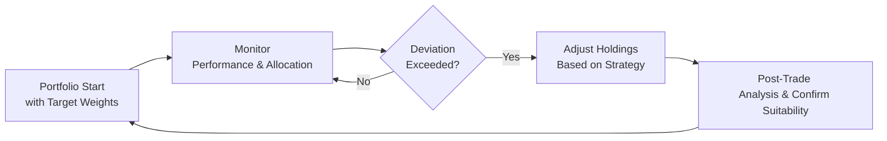

## 18.4 Rebalancing and Adjustments

Rebalancing is one of those topics that sounds bland at first—meh, just moving things around in a portfolio, right? But if I’m being honest, it can be quite exciting once you realize how integral it is to managing both risk and return. It’s also true that if you ignore rebalancing, you might wind up with a portfolio that drifts far from your original plan. In other words, you started with a customized mix—like 60% equities and 40% bonds—then markets change, and before you know it, you’re at 75% equities and 25% bonds, which might make you sweat more than you’d like during market downturns.

In this section, we’ll dive into strategies that help you keep your portfolio in line with your risk tolerance, investment objectives, and constraints. We’ll look at calendar-based rebalancing, threshold-based rebalancing, hybrid approaches, and see why so-called “all-in” vs. “gradual” adjustments can make a big difference. We’ll also discuss the practical aspects, including tax implications and transaction costs. Finally, we’ll show how technology and government regulations (mostly overseen today by the Canadian Investment Regulatory Organization, or CIRO) shape your rebalancing choices.

Feel free to treat this as your go-to rebalancing guide—one that addresses not only the mechanics but also the softer aspects like investor psychology and the “fear of missing out” (FOMO) in letting your “winners” run. My own experience? I was once so proud of a rapidly growing tech stock that my portfolio eventually ballooned to 85% in equities. That big equity concentration actually kept me up at night. Once I decided to rebalance, I finally slept better. And that’s the real bottom line: staying true to your risk tolerance so you can sleep at night.

---

### Why Rebalance?

Rebalancing is about realigning your portfolio’s asset mix to an original target or strategic allocation. If markets remain constant (though they rarely do), you wouldn’t need it at all. However, in reality, some assets rise in value while others may, at least temporarily, lag behind. Over time, your portfolio drifts away from your carefully chosen allocations. This drift can increase (or reduce) your overall risk. 

• In a rising equity market, equities can swell to an uncomfortably large slice of your portfolio.  
• In a falling equity market, your stock position may contract below your comfort level if you’re underexposed to possible rebounds.  

Rebalancing corrects these imbalances. By trimming overweight assets (“winners”) and reinvesting in underweight positions (“losers”), you effectively follow the classic “buy low, sell high” mantra. Strange as it might sound, rebalancing can help discipline your decision-making and reduce emotionally driven investment mistakes.

From a compliance standpoint, Canadian regulations such as CIRO’s (formerly MFDA and IIROC’s) rules require ongoing monitoring of client accounts to ensure they remain suitable. The Canadian Securities Administrators (CSA) also emphasize that advisors have a fiduciary responsibility to act in the best interests of their clients. Turning a blind eye to a portfolio that has deviated significantly from its stated risk profile could potentially violate these requirements.

---

### Core Rebalancing Strategies

There are quite a few rebalancing techniques, each with its own personality. Let’s look at four main categories:

#### Calendar-Based Rebalancing
Calendar-based rebalancing is deciding in advance that on a set schedule—say quarterly or annually—you will review your portfolio and bring it back to target weights. For example, you might plan to rebalance on the first Monday of every quarter. Advantages to this approach include simplicity, predictability, and a habit-forming routine for both you and your client.

However, the downside is that markets don’t follow your calendar. If your equity holdings deviate significantly mid-quarter, you might wait too long to take action. Conversely, if deviations are small, you might be making unnecessary trades that trigger transaction costs or taxes. 

#### Threshold-Based Rebalancing
Threshold-based rebalancing only kicks in when your asset class weights move beyond certain tolerance bands. For example, you might say: “If any asset class is more than 5% above or below its target weighting, then rebalance.” This approach can help you avoid making tiny trades and only rebalance when it really matters. On the flip side, a volatile market might trigger rebalancing more often than you’d like.

Thresholds can be absolute (e.g., 5% above or below) or proportional (e.g., a 20% relative change from the target weight). This can be especially useful in markets where some assets might have rapid short-term fluctuations, while others are more stable.

#### Hybrid Approach
A hybrid approach mixes the globe of calendar-based rebalancing with threshold triggers. You might evaluate your portfolio every quarter but only rebalance if the asset weightings have strayed by more than 3% from the initial target. This helps you capture that sense of routine while avoiding too many minor adjustments.

I’ve personally found the hybrid approach useful for clients who prefer scheduled check-ins yet don’t want to trade unless it’s truly necessary. It’s like synching an alarm clock (the schedule) with a sensor (the tolerance band). That way, we catch big deviations promptly but skip the smaller ones that don’t matter as much.

#### All-In vs. Gradual Rebalancing
When it’s time to rebalance, you face an additional choice: should you rebalance your entire portfolio in one go, or do it in smaller chunks over time?  

• All-In (Immediate): Sell your overweighted assets and top up your underweighted positions in one big transaction. This approach is fairly direct and resets your portfolio promptly. However, you may incur large transaction costs and realize gains or losses all in one shot (with potential tax consequences).  

• Gradual Rebalancing (Tactical Shifts): You can do a series of smaller trades. For example, maybe you’ll rebalance a portion of your overweight equities every couple of weeks or months. This can reduce the immediate impact of market volatility and spread out taxes. But it takes longer, and there’s a chance that if the market moves against you, you’ll miss some opportunities or be slower to mitigate risk.  

Which approach is best? That usually depends on the client’s risk tolerance, liquidity needs, and transaction cost profile. If your client invests through an entity that has minimal trading costs and is okay with short-term volatility, an all-in rebalancing might be perfectly fine. If taxes or abrupt moves are a big concern, you could “dollar-cost-average” your way back to your strategic allocation.

---

### Practical Example of Rebalancing

Let’s say Sarah starts with a $100,000 portfolio, wanting 60% in equities and 40% in fixed income. Over the course of a year, equities rise significantly, pushing her equity exposure to 70% of the portfolio, while fixed income is now 30%.

• Original: $60,000 (equity) + $40,000 (fixed income)  
• After 1 Year: ~$70,000 (equity) + ~$30,000 (fixed income)  

If Sarah is comfortable with a 60/40 mix, she might choose to trim $10,000 out of equities and add that to fixed income to restore the 60/40 blend. This is a basic illustration, but in reality, you might have multiple asset classes (like real estate, commodities, international equities, etc.). The concept is the same: move money from what’s high to what’s low, as long as that aligns with your strategic plan.

Maybe Sarah wants to rebalance gradually because she’s worried about a potential short-term equity upswing—“Could I be selling my winners right before they keep winning?” She might move only $5,000 initially, watch the market, then rebalance the rest later if conditions remain stable (or if her threshold triggers fire again). 

While that might soothe short-term anxiety, it also partially defeats the purpose of timely realignment. After all, the entire point of rebalancing is to maintain a pre-agreed risk-return profile. That’s where an advisor might use performance metrics or historical correlations to break down the risk of staying overweight in equities longer than planned.

---

### Psychological and Behavioral Considerations

There’s a significant behavioral side to rebalancing. It might feel counterintuitive to sell positions when they’ve done well or buy more of what’s lagging. Many investors (my friend Dave included) try to hang on to their winners, worried they might be selling too soon. Others get nervous about “throwing good money after bad” in what appears to be a losing asset. Meanwhile, savvy advisors see rebalancing as a disciplined system that forces you to keep risk within acceptable bounds.

A well-defined Investment Policy Statement (IPS), referencing Chapter 1 of this book, can detail exactly how and when you will rebalance. That way, you’re not making decisions based purely on emotion or short-term market noise.

---

### Regulatory Environment and Advisor Responsibilities

Under CIRO regulations (the self-regulatory organization that replaced the former MFDA and IIROC), advisors in Canada have a duty to ensure client portfolios remain suitable over time. Suitability implies more than just an initial “okay, let’s set you at 60/40.” There’s an ongoing requirement to see if the client’s life circumstances or the portfolio’s asset mix has changed enough to warrant adjustments.

Additionally, the Canadian Securities Administrators (CSA) highlight the fiduciary obligation to act in the client’s best interest. If rebalancing is needed to keep the portfolio aligned with the client’s risk tolerance, ignoring that step—or indefinitely postponing it—may be viewed as negligence. In most cases, leaving an overgrown equity position or ignoring that big slump in fixed income can cause compliance headaches down the road. A well-articulated rebalancing strategy is part of the solution.

---

### Transaction Costs and Tax Implications

Let’s face it—trading isn’t free. Whether you pay commissions, bid-ask spreads, or deal with possible redemption fees, costs can add up quickly if you’re rebalancing frequently. Plus, rebalancing often triggers capital gains in a taxable account. If you’re forced to sell some equities that have done very well, you may face a large tax bill. One approach to reduce taxes is to rebalance in tax-advantaged accounts (like certain registered plans) first, leaving taxable accounts to be rebalanced less frequently.

Also consider:

• Harvesting losses in a down market to offset capital gains.  
• Using incoming cash flows (like dividends or new contributions) to rebalance without selling.  
• Carefully timing rebalancing around an investor’s personal tax calendar or at year-end.  

Some advisors also prefer to “tilt” rebalancing toward the end of the tax year, taking advantage of possible tax-loss harvesting. However, keep in mind that waiting too long could subject the portfolio to unintended risk. It’s always a balancing act. 

---

### Automatic Rebalancing Tools

We live in a fantastic era of fintech and robo-advisors (see Chapter 4). Many platforms can automatically rebalance client accounts once a month or whenever an asset allocation threshold is reached. This is especially appealing for clients who want a “set it and forget it” approach. 

You can also use robust open-source software libraries like QuantLib or Python-based solutions to design custom rebalancing triggers. Of course, while technology can handle the mechanical aspects of rebalancing, you still need an advisor’s judgment to determine the correct triggers, frequency, and overarching strategy. If you fully automate everything, you may act on short-term noise or place trades at inopportune times. It’s a good practice to log rebalancing events and remain vigilant about how they align with shifting market conditions or your client’s evolving goals.

Finally, exchange-traded solutions exist that bundle multiple asset classes into a single fund (colloquially known as “one-ticket solutions” or “asset-allocation ETFs”). These instruments typically auto-rebalance internally, keeping the fund at set target weights. For self-directed investors, that can be convenient. Yet you, as the advisor, still need to confirm that the product’s rebalancing pace and weightings match your client’s preferences and constraints.

---

### Implementation Steps and Best Practices

Below is a simplified flow to help visualize rebalancing in a typical advisory setting:

1) Establish Target Weights: Ensure your client’s target allocations are documented, ideally in an IPS.  
2) Monitor Portfolio Performance: Ongoing tracking, either manually or through automation, to see if asset weights have shifted.  
3) Check for Deviations: Compare current allocations to your thresholds. Are you more than 5% off target in tech stocks or real estate?  
4) Execute Rebalancing: Decide on all-in vs. gradual. Factor in taxes, cost, and market conditions.  
5) Post-Trade Analysis: Verify that the portfolio is now aligned with the client’s risk tolerance. Update compliance records to demonstrate suitability.  
6) Rinse & Repeat: Rebalancing is not a one-time deal.  

---

### Challenges and Pitfalls

• Overtrading: Rebalancing too frequently can erode returns through fees, taxes, and market friction.  
• Behavioral Biases: Emotional attachment to winners or reluctance to add to assets that have lagged can paralyze rebalancing efforts.  
• Timing the Market: It’s tempting to believe you can time the perfect day or moment to rebalance. Usually, such attempts become guesswork, especially in volatile conditions.  
• Large Capital Gains: If you hold a concentrated position that has grown significantly, rebalancing might trigger hefty taxes. A well-thought-out plan or a gradual approach can mitigate the impact.  

---

### Real-World Case Study

Imagine Ms. Tan, a Canadian investor who started with $500,000 allocated 70% to equities and 30% to fixed income. After three years of robust market growth, her portfolio soared to $800,000, and now 80% of that is in equities. She’s thrilled because equities are “winning.” But her advisor notices that this drift boosted Ms. Tan’s overall risk beyond what her risk-profile questionnaire (explained in Chapter 2) indicated she should hold.

Her advisor suggests rebalancing back to 70/30. Ms. Tan resists, worried she’ll miss out if stocks keep climbing. The advisor shows various scenarios:  
• If stocks rise another 10%, Ms. Tan gains more on an 80% weighting than on 70%.  
• But if stocks slump by 20%, that 80% weighting means heavier losses.  

Together, they decide on a partial rebalance. She trims back to 75% equities and invests the difference in a short-term bond ETF. This reduces her equity exposure somewhat while letting her participate further in the equity rally. It’s a compromise—ideal? Maybe not. But it suits Ms. Tan’s comfort level and moves her portfolio closer to her authentic risk appetite.

Over time, Ms. Tan’s advisor might schedule another conversation (calendar-based approach) or set a threshold so that if the equity portion drifts above 80%, they rebalance immediately (threshold-based), whichever approach suits Ms. Tan’s style and the formal strategy in her IPS.

---

### References, Regulations, and Tools

For more in-depth information, consider the following Canadian and international resources:

• CIRO (https://www.ciro.ca): New self-regulatory organization that replaced MFDA and IIROC. Look for statements on client suitability and ongoing monitoring obligations.  
• CSA (Canadian Securities Administrators): Offers guidelines on fiduciary duty and obligations to maintain suitable, well-monitored portfolios.  
• Asset-Allocation ETFs: Products available on major exchanges that maintain set allocations internally, offering built-in rebalancing.  
• Open-Source Financial Tools: Look into Python-based frameworks (e.g., PyPortfolioOpt), R-based solutions, or libraries like QuantLib for building custom rebalancing triggers and backtesting.  

---

### Conclusion and Key Takeaways

Rebalancing is about more than just routine housekeeping. It’s a fundamental discipline that can help you optimize risk, adhere to client objectives, and meet regulatory requirements regarding ongoing suitability. Whether you prefer calendar, threshold, or a hybrid strategy, the underlying principle remains the same: keep your portfolio aligned with your target allocations.

Yes, there may be hesitation—maybe you’re worried about selling strong performers too soon or pouring money into underperforming assets. But that hesitation often reflects short-term biases and blind spots. Rebalancing enforces a more rational, long-term stance. It also helps you standardize your advisory process, ensuring your decisions are transparent and well-documented.

If there’s one central theme to internalize, it’s this: rebalancing must be systematic, not haphazard. That might mean automatically rebalancing on a monthly schedule (if it’s right for your client) or using a threshold-based approach so you only rebalance when it truly matters. Either way, as you continue your journey in portfolio management, don’t underestimate the power of a well-executed rebalancing plan. It’s how you stick to your strategic plan in a world that’s constantly in flux.

---

## Test Your Knowledge of Rebalancing and Adjustments



### Which of the following best describes why rebalancing is necessary?

- [ ] It guarantees higher returns than the market.
- [x] It realigns the portfolio to the desired risk-return profile.
- [ ] It ensures only short-term gains are realized.
- [ ] It locks in permanent tax advantages.

> **Explanation:** Rebalancing brings asset weights back to their target levels, maintaining the portfolio’s intended risk profile.  

### Which statement about a hybrid rebalancing approach is most accurate?

- [ ] It triggers trades only according to a firm schedule, ignoring deviations.
- [x] It involves periodic checks combined with threshold limits for when adjustments occur.
- [ ] It rebalance all asset classes daily.
- [ ] It prevents any possible transaction costs.

> **Explanation:** A hybrid approach combines a set review schedule (calendar-based) with tolerance bands (threshold-based) to determine when to rebalance.  

### What is a primary downside of threshold-based rebalancing?

- [ ] It ensures a fully automated solution.
- [ ] It’s always more complex than calendar-based rebalancing.
- [ ] It offers zero tax liabilities.
- [x] It may trigger frequent trades in volatile markets.

> **Explanation:** If market swings are large or rapid, threshold-based methods can lead to multiple rebalances, increasing costs and taxes.  

### In an “all-in” rebalancing scenario, how are tax considerations typically handled?

- [ ] They are inconsequential for large portfolios.
- [x] They may be significant if capital gains are realized in a single large transaction.
- [ ] They are always negligible when selling overweight equities.
- [ ] They are deferred indefinitely through complex hedging strategies.

> **Explanation:** An all-in approach can trigger high realized gains at once, potentially leading to substantial tax liabilities.  

### Which of the following is considered a non-financial advantage of rebalancing?

- [x] Combating emotional investing biases.
- [ ] Guaranteeing protection from all losses.
- [x] Encouraging the discipline of selling high and buying low.
- [ ] Eliminating the need for an Investment Policy Statement.

> **Explanation:** Rebalancing can impose discipline, helping reduce common emotional biases and forcing a “sell high, buy low” behavior, but it doesn’t guarantee zero losses.  

### What is one key reason to consider gradual rebalancing instead of going “all-in”?

- [x] To reduce the immediate impact of a major price move and spread out tax liabilities.
- [ ] To guarantee higher returns in the long run.
- [ ] Because it is required by all Canadian regulations.
- [ ] To avoid ever having to sell equity assets.

> **Explanation:** Gradual rebalancing helps mitigate abrupt transitions and can spread out the tax hit over time.  

### Why might investors resist rebalancing after a significant market rally?

- [x] They fear selling high-performing assets prematurely.
- [ ] They never believe in the concept of market corrections.
- [x] They are emotionally attached to winners and fear missing out on further gains.
- [ ] They prefer entirely random allocations.

> **Explanation:** Behavioral finance teaches us that selling winners is psychologically hard. Investors can have a strong emotional attachment to high-performing positions.  

### What does a hybrid rebalancing model best address in a portfolio?

- [ ] It ensures trades happen every day, including weekends.
- [ ] It eliminates taxes on rebalancing trades.
- [x] It balances regular reviews with thresholds so that rebalancing only occurs when material deviations happen.
- [ ] It mandates constant market timing by the advisor.

> **Explanation:** The hybrid model captures the best of both worlds—periodic reviews plus tolerance bands that trigger rebalancing only when necessary.  

### Which of the following strategies could be used to minimize taxes when rebalancing?

- [x] Harvesting losses to offset realized gains.
- [ ] Only using threshold-based triggers.
- [ ] Converting all assets into cash immediately.
- [ ] Always rebalancing daily regardless of market movements.

> **Explanation:** Loss harvesting is an effective way to keep tax liabilities in check when rebalancing.  

### Rebalancing ensures that:

- [x] An investor’s portfolio remains aligned with the intended risk profile.
- [ ] There are never any losses in equity holdings.
- [ ] The investor times the market perfectly.
- [ ] All asset classes rise equally.

> **Explanation:** Rebalancing helps the portfolio stay matched to the initial (or updated) risk-return targets, but it does not eliminate losses or allow perfect market timing.  


