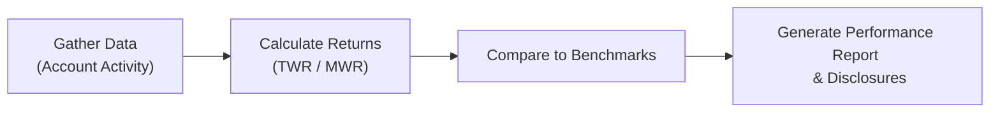

## 18.5 Performance Reporting and Regulatory Considerations

Picture this: you’ve just spent weeks (maybe months!) helping a client structure their investments, carefully picking securities, balancing sectors, and dealing with day-to-day market fluctuations. Then you finally come to the moment of truth—sharing the results in a performance report. It’s like that feeling when you show your parents your report card after finals: you want a clear story of successes, but you also need to explain any shortcomings.

Fair, detailed, and compliant performance reporting is central to good advisor-client relationships. It establishes trust, fosters transparency, and meets regulatory requirements that can, admittedly, feel a bit overwhelming. In Canada, advisors must satisfy the Canadian Investment Regulatory Organization (CIRO) rules, along with guidelines set by the Canadian Securities Administrators (CSA). These regulations regulate the “what” and the “how” of performance reporting—ranging from showing money-weighted return calculations to clarifying benchmark comparisons.

Below, we’ll break down the main elements of comprehensive performance reporting, explore the key differences between time-weighted and money-weighted returns, discuss best practices for emails and statements, and highlight the regulatory environment that shapes everything from disclaimers to risk disclosures. I’ll also share some personal stories and pitfalls I’ve witnessed along the way, so we can learn from real-life mishaps and success stories.

Remember, the overarching goal is simple: help clients see how their investments have performed, what factors contributed to that performance, and what fees were incurred in the process—no matter how complicated the underlying math or compliance rules may appear.

---

### Why Is Performance Reporting So Important?

Before we get into specifics, let’s clarify why performance reporting is more than a formality. I once worked with a client who had received statements from a prior advisor but still felt clueless about everything going on. She saw a bunch of lines with numbers, something about returns, a long list of fees, and ended up with more confusion than clarity. She admitted to me: “I feel like my money is trapped in a black box.”

Clear performance reporting demystifies that "black box." It provides:

• Insights into whether past recommendations achieved (or missed) intended goals.  
• A way to manage expectations based on market movements and portfolio strategies.  
• Transparency about costs and fees, which fosters trust.  
• Context for how certain asset classes perform relative to others.  
• In the Canadian context, evidence that the advisor is following relevant regulations from CIRO and meeting the obligations set forth by the CSA’s National Instruments and Staff Notices.  

When your clients receive a well-structured report, it’s easier for them to appreciate both the upsides and downsides of your strategy. It also spares you from those awkward calls where you try to explain “Well, your portfolio is down 5% but that’s actually good news because everything else is down 10% and, oh yeah, you also withdrew money this quarter.” Instead, your clients see what’s happening in a logical, organized manner.

---

### Building an Effective Performance Report

While the exact format of a performance report might vary from firm to firm (and even client to client), there are core ingredients that remain constant. Typically, CIRO members in 2025 must align with the current guidelines around transparency and disclosure. Let’s break down each key element.

#### Account Activity and Summary

Clients should see the big picture at a glance:  
• Opening and closing balances.  
• Contributions.  
• Withdrawals.  
• Fees deducted (like management fees, commissions, or custodial fees).  

I remember once forgetting to clearly itemize “miscellaneous fees” in a client statement. You can guess how that turned out. The client was left thinking we’d magically charged them for something suspicious. Now, I label every last deduction in plain language. It’s not worth the headache when clients see a number that raises eyebrows, right?

A good practice is also to list any interest or dividends credited during the period. So, if your client invests in REITs that distribute monthly dividends, they should see those deposits as separate line items so they know exactly how their cash inflows add to the portfolio return.

#### Rates of Return

This is where you get to show how successfully the portfolio has grown—or shrunk—over the reporting period. It’s generally accepted that you’ll present returns in two ways:  
• **Time-Weighted Return (TWR)**: A measure that eliminates the effect of externally driven cash flows (like contributions and withdrawals). If a client wants to see how their portfolio manager performed at picking stocks or timing trades, TWR is typically the go-to.  
• **Money-Weighted Return (MWR or IRR)**: A measure that emphasizes the impact of the client’s actual cash flows. If a client invests a large lump sum right before a market dive, MWR will reflect that.  

Advisors in Canada often show both, letting clients understand how their investment timing (MWR) and the manager’s skill (TWR) factor into overall performance. The **CSA** has encouraged more user-friendly disclosures about these return calculations, reminding advisors to keep the disclaimers straightforward yet thorough.

#### Holdings and Asset Allocation

Many clients are curious: “Where is my money, exactly?” A breakdown of holdings makes everything more tangible. List each security—like AliCorp Inc. stock, Provincial Bonds, Exchange-Traded Funds (ETFs), or Real Estate Investment Trusts (REITs)—alongside their respective market values at the close of the period. Advisors often present this in easy-to-read tables or even colorful pie charts.

You might see a table with columns for Asset Name, Ticker, Quantity Held, Market Price, and Market Value. This is sometimes coupled with an Asset Allocation chart (e.g., 60% equities, 40% fixed income). Whether you manage $100 million or $10,000, the same principle applies: clarity fosters engagement.

#### Benchmark Comparisons

Imagine buying a brand-new car and never checking how it performs compared to similar vehicles. You wouldn’t know if it’s doing well or if it’s a complete dud. The same goes for portfolio returns. Benchmarks (like the S&P/TSX Composite Index for Canadian equities or S&P 500 for U.S. equities) let clients see if their portfolio is underperforming, matching, or exceeding the broader market.

The tricky part is selecting the right benchmark. If your client invests in small-cap Canadian tech stocks, the S&P/TSX index might not be the best yardstick—maybe a specialized tech index or a small-cap index is better. Advisors should also specify currency factors and whether the benchmark is net of dividends, because these little details can add up to big differences in perceived performance.

#### Fees and Expenses

Clients hate hidden fees. Actually, we all do. Whether it’s a random “admin fee” from your bank or a “foreign transaction fee” on your credit card, nothing sours a relationship faster than undisclosed costs. So, it’s crucial to break down all management fees, commissions, trailing commissions from mutual funds, and any other fees applicable to the account.

CIRO rules emphasize thorough fee disclosure. Requirements outlined under the Canadian Securities Administrators’ Client Relationship Model regulations (e.g., CRM2 and subsequent updates) further stipulate that fee information be disclosed in a consistent and understandable manner. Clients are legally entitled to see how much money is being paid, to whom, and for what services.

#### Risk Disclosures

Does your client know that a chunk of their portfolio is in emerging market stocks that might spike 10% in one day and drop 12% the next? Or maybe they hold corporate bonds with higher yields but also higher default risk? Performance reports should include disclaimers around major risk factors:

• Market volatility.  
• Liquidity risk (particularly if you hold a thinly traded security).  
• Concentration risks (e.g., if 80% of the assets are in the same sector).  
• Underlying credit risk of bonds.  

At a minimum, clarify that past performance is never a guarantee of future returns. That said, the crucial element is not to bury your disclaimers in footnotes. Keep them visible, relevant, and written in plain language. Your regulator (CIRO, in 2025) wants your disclosure to be more than just legalese.

---

### Navigating the Canadian Regulatory Landscape

If you’re in Canada, you’ll want to remember that, as of June 1, 2023, the Mutual Fund Dealers Association (MFDA) and the Investment Industry Regulatory Organization of Canada (IIROC) have merged into the Canadian Investment Regulatory Organization (CIRO). While references to MFDA or IIROC are purely historical now, the new streamlined environment still draws heavily on both organizations’ previous regulations. Key rules remain around delivering performance reports on schedule, itemizing fees clearly, and dedicating sections to important disclaimers.

Additionally, the **CSA** (Canadian Securities Administrators) unifies provincial securities regulations. The CSA issues National Instruments and Staff Notices that set standards for cost and performance reporting, including the well-known “CRM2” requirements. You might also see references to ongoing updates—like frameworks that further refine how you must present money-weighted returns or how frequently to update clients with performance summaries.

Moreover, the **Canadian Investor Protection Fund (CIPF)** stands apart from CIRO but remains an essential player. In case a member firm becomes insolvent, CIPF helps protect client assets. Performance reports often note CIPF coverage for client peace of mind, though it’s not a direct part of portfolio performance. It’s more like a safety net.

---

### Best Practices for Ongoing Client Communications

The “set it and forget it” mentality doesn’t work in finance. Your official performance reports might go out quarterly or yearly, but your client might have a question about a surprising market plunge tomorrow. Instead of waiting to roll all updates into the next big statement, consider:

• **Regular Email Summaries**: If major events occur (like a corporate earnings surprise or a significant rate hike by the Bank of Canada), a short email summarizing the potential impact on the client’s holdings can be invaluable.  
• **Virtual or In-Person Meetings**: At least a couple of times a year, or as needed, walk through the performance numbers. Show the TWR vs. MWR in everyday language.  
• **Storytelling**: Sometimes, it helps to say something like, “Remember how we invested in that renewable energy fund for its growth potential but took on a bit more volatility? We see that higher volatility in this line item, but we also see the outperformance in the last quarter.”  

That personal touch can reduce confusion and make clients feel like participants in their own financial journey, not just passengers.

---

### Time-Weighted vs. Money-Weighted Returns

Let’s take a closer look at TWR and MWR because I’ve seen so many question marks around these two. People often ask, “Why do I have two different percentages here?” Let’s illustrate with a simplified example:

• You have an initial $100,000. Over the first quarter, your investments go up by 10%. Now your account is $110,000.  
• At the start of the second quarter, you add another $100,000, bringing your total to $210,000. Then, the market slides 5%.  

**Time-Weighted Return** tries to measure how effectively the investment strategy worked, ignoring external cash flows. So it might look like:  
- Q1 Return: +10%  
- Q2 Return: -5%  

If you average those (technically using geometric means), the TWR is around +4.5% over the two quarters. It’s basically saying, “As a pure manager of these funds, ignoring contributions or withdrawals, how did I do in each period?”

**Money-Weighted Return** (MWR), on the other hand, accounts for the fact that you poured additional funds in right before a downturn. Because the extra $100,000 got exposed to a subsequent 5% drop, your actual MWR might be closer to 2% or 3%. It’s the “psychological” return the client sees in their real money, factoring the timing of contributions.

Both are correct but serve different purposes. CIRO’s stance (in line with CSA guidelines) is that MWR is important for reporting to clients, as it shows how their actual dollar amounts have grown or shrunk. Meanwhile, TWR is good for measuring the advisor’s skill at navigating markets, independent of deposit or withdrawal timing. Many performance reports show both, with a short explanation.

---

### Example: A Simplified Performance Report

Here’s a quick example layout—just imagine we coded it neatly into a statement:

--------------------------------------------------------------------------------
ACCOUNT SUMMARY                                           REPORTING PERIOD
Name: Sarah Smith                                               Q1 – 2025
Opening Balance: CAD 100,000.00                              
Contributions: CAD 30,000.00                                 
Withdrawals: CAD 0.00                                       
Fees Deducted: CAD 750.00                                    
Closing Balance: CAD 135,200.00                               

MONEY-WEIGHTED RETURN (MWR): 4.8%                            
TIME-WEIGHTED RETURN (TWR): 5.2%                             

BENCHMARK COMPARISON:                                        
• Portfolio vs. S&P/TSX Composite Index: Portfolio +5.2% vs. +4.5%  
• Asset Allocation (Equities 60%, Fixed Income 30%, Cash 10%)  

RISK DISCLOSURES:
• Market volatility may cause fluctuations.  
• Some funds invested in U.S. securities, subject to currency risk.  
• Past performance is not indicative of future results.  

FEES & EXPENSES DETAIL:
• Management Fee: $450  
• Trading Commissions: $300  

For further information on your statements and portfolio performance methods, refer to the CIRO rulebook, CIPF coverage details, or contact your advisor.
--------------------------------------------------------------------------------

You see how everything is laid out: a quick summary of the money flows, a snapshot of your returns, and a quick reference to how the portfolio stacks up against a relevant benchmark. The disclaimers are short but point clients toward more resources if they want deeper detail.

---

### Visualizing the Performance Reporting Process

Let’s break down the performance reporting process in a simple flowchart. Sometimes a diagram says more than paragraphs of text. Here’s how the process generally works—gather data, calculate returns, compare to benchmarks, and then generate that final report.

• **Gather Data**: Start with verifying your client’s opening balance, transaction history, fees, etc.  
• **Calculate Returns**: Decide whether you’ll use TWR, MWR, or both, and run through the calculations.  
• **Compare to Benchmarks**: Select the right indexes (or custom benchmarks) for your client’s portfolio.  
• **Generate Performance Report & Disclosures**: Present a polished statement or online dashboard with clear disclaimers and breakdowns.

---

### Regulatory Perspective: CIRO, CSA, and More

Now, the big question: “So how do I ensure I actually follow all the rules?” The short answer is that you’ll read up on the relevant sections in the **CIRO rulebook**, keep an eye on **CSA Staff Notices**, and adopt best practices from frameworks like the **Global Investment Performance Standards (GIPS)** if you want to meet and exceed global norms.

• **CIRO**: Effective June 1, 2023, it oversees both the investment dealer and mutual fund dealer segments. It provides regulatory bulletins detailing your obligations for performance reporting, fee disclosures, and client statements.  
• **CSA**: The umbrella for provincial regulators. Watch out for updates to National Instruments (e.g., NI 31-103) and Staff Notices that might refine or expand performance reporting standards.  
• **GIPS**: While not legally mandated in Canada, GIPS is widely recognized as a best-practice framework for performance calculation and reporting. Firms that claim compliance signal a high level of transparency and precision.

**Helpful Resources** include:

- [CIRO (formerly IIROC/MFDA) website](https://www.ciro.ca): Current bulletins, rulebook sections, and resources on performance reporting obligations.  
- CSA Staff Notices on cost and performance reporting.  
- “Client Reporting in the 21st Century” (Journal of Wealth Management): A forward-thinking academic paper reviewing how technology and regulation are shaping client statements.  
- **Open-source tools** for performance analytics:  
  - R’s **PerformanceAnalytics** package.  
  - Python’s **pyfolio** or **quantstats** libraries.  

If you or your in-house staff has coding know-how, you might integrate these libraries to produce automated, custom performance dashboards for clients.

---

### Common Pitfalls and How to Avoid Them

1. **Lack of Explanation for Return Calculations**  
   – Pitfall: Advisors simply display a return figure without clarifying how it was computed.  
   – Fix: Provide a short paragraph or footnote clarifying TWR vs. MWR.  
   – Bonus: Offer both metrics.

2. **Inconsistent Benchmarks**  
   – Pitfall: Using a broad-based equity benchmark for a fixed-income-heavy portfolio. Clients get confused about underperformance or outperformance.  
   – Fix: Ensure the benchmark is relevant. If needed, blend multiple benchmarks or create a custom benchmark reflecting your actual asset allocation.

3. **Insufficient Risk Disclosures**  
   – Pitfall: Omitting disclaimers about market volatility, currency risk, or alternative investment liquidity. Clients might be blindsided when a risk materializes.  
   – Fix: Summarize major risk factors in plain English and invite clients to ask questions.

4. **Hidden Socially Responsible or ESG Screens**  
   – Pitfall: Failing to mention that the portfolio excludes certain stocks or sectors for sustainability or ethical reasons.  
   – Fix: If the client invests under an ESG or Responsible Investment strategy, clearly outline how those choices might affect performance or benchmark comparisons.

5. **Poor Timing of Reports**  
   – Pitfall: Sending statements too late or not consistently.  
   – Fix: Create a regular schedule (quarterly, annually, etc.) and stick to it. Let clients know when to expect statements.

6. **Ignoring Ongoing Communication**  
   – Pitfall: Letting clients first learn about major portfolio changes only when the official statement arrives.  
   – Fix: Proactive phone calls, quick emails, or occasional coffee chats can do wonders for client trust and satisfaction.

---

### Encouraging Engagement and Transparency

Performance reporting doesn’t have to be formal or intimidating. Yes, you have to comply with regulatory obligations, but you can still be friendly, informative, and even a bit creative. Use visuals, define key terms, and prompt your clients to ask questions. After all, the ultimate purpose is to help them understand and feel confident about the path they’re on.

In my own practice, I noticed a huge difference once I started including a small “What’s Next?” section in each report: maybe a one-sentence highlight about rebalancing, or an encouraging reference to recent market trends. This fosters a sense that you’re not just providing data but truly guiding them forward.

---

### Conclusion

Performance reporting is one of the cornerstones of good portfolio management, bridging the gap between day-to-day trading decisions and the client’s ultimate goals. By meeting the latest CIRO regulatory requirements, adhering to CSA Staff Notices, and possibly adopting globally recognized best practices like GIPS, you ensure that your clients not only see “what happened to their money” but do so in a way that’s clear, fair, and regulation-compliant.

So, that’s the scoop. Keep your performance reports honest, transparent, and educational. Upgrade them a little each quarter with new insights, simpler language, or cooler visuals. And always remember: the better your clients understand their portfolio performance, the more likely they’ll be to hang around for the long haul, trusting you with their financial future.

As you continue refining your performance reporting, you might explore advanced analytics tools, experiment with new ways of presenting TWR vs. MWR, or adopt more robust risk disclosures. Don’t forget to stay current with updated CIRO bulletins, CSA regulatory developments, and, of course, keep an eye on global frameworks like GIPS. Lastly, keep building strong relationships through timely communication. With this combination of clarity, compliance, and caring, you’ll be on track to deliver superb performance reporting that truly resonates with your clients.

---

## Test Your Knowledge: Performance Reporting and Regulatory Considerations



### Which of the following statements about money-weighted return (MWR) is correct?

- [x] It reflects the impact of the client’s actual cash flows.
- [ ] It removes the effects of contributions and withdrawals.
- [ ] It always overstates the portfolio manager’s skill.
- [ ] It should never be disclosed to clients.

> **Explanation:** MWR (also known as the internal rate of return, IRR) captures the effect of actual contributions and withdrawals, which can make it more relevant from an investor’s perspective.

### Why is it important to explain how rates of return are calculated in performance reports?

- [x] To ensure clients understand the difference between time-weighted and money-weighted returns.
- [ ] To avoid regulatory scrutiny altogether.
- [ ] To artificially inflate performance figures.
- [ ] To hide the real impact of fees and expenses.

> **Explanation:** Clarifying calculation methods (especially TWR vs. MWR) helps clients comprehend their portfolio performance and fosters transparency.

### Which of the following regulatory bodies or frameworks outlines best practices for performance reporting in Canada today?

- [x] CIRO, the CSA, and CSA Staff Notices.
- [ ] Only IIROC (still active in 2025).
- [ ] Only the MFDA (still active in 2025).
- [ ] There are no recognized regulatory bodies for performance reporting in Canada.

> **Explanation:** Both the CIRO and CSA (with its National Instruments and Staff Notices) remain critical to performance reporting in Canada. IIROC and MFDA no longer exist as separate entities, having merged into CIRO in 2023.

### What is the main difference between time-weighted return (TWR) and money-weighted return (MWR)?

- [x] TWR measures performance without considering the impact of cash flows, while MWR accounts for them.
- [ ] MWR is only calculated weekly, while TWR is only calculated monthly.
- [ ] MWR is mandated by GIPS, whereas TWR is not recognized by GIPS.
- [ ] TWR and MWR are the same.

> **Explanation:** TWR isolates the performance of the investment strategy, ignoring client-driven cash flows. MWR incorporates the specific timing of contributions and withdrawals.

### Which of the following is a recommended tool or framework for global best practices in performance calculation and reporting?

- [x] Global Investment Performance Standards (GIPS).
- [ ] Random Weighted Cash Inflow Standards (RWCIS).
- [ ] Global Money-Weighted Arithmetic Standards (GMWAS).
- [ ] International Index Federation (IIF).

> **Explanation:** GIPS is a globally recognized set of best practices for performance reporting, frequently used in conjunction with local regulatory requirements.  

### According to current Canadian regulations, which risk factors should typically be disclosed in performance reports?

- [x] Possible market volatility, liquidity concerns, and credit risk of the portfolio.
- [ ] Only personal budgeting risks for the client.
- [ ] No risk factors need to be disclosed once the portfolio is established.
- [ ] Only foreign exchange risk.

> **Explanation:** CIRO and CSA guidelines generally require clear disclosure of major risks relevant to the client’s portfolio, including market volatility, liquidity, and credit risks.

### What is the primary purpose of benchmark comparisons in a performance report?

- [x] To give context about whether the portfolio is generally underperforming, matching, or exceeding market performance.
- [ ] To convince clients that all portfolios perform the same.
- [ ] To obscure actual portfolio returns by pointing to random indices.
- [ ] To replace time-weighted returns with simpler metrics.

> **Explanation:** Benchmarks help clients see how their portfolio stands relative to a representative market index, adding a vital frame of reference for performance results.

### What does CIRO require regarding fee disclosure in performance reports?

- [x] All fees must be clearly itemized and explained in plain language.
- [ ] Fees must be disclosed only if they exceed 2% annually.
- [ ] Fee disclosure can be postponed for five years.
- [ ] Advisors should never disclose fees to avoid confusing clients.

> **Explanation:** CIRO regulations (supported by CSA mandates) emphasize thorough fee disclosure in a manner that’s accessible to clients, including itemizing management fees, commissions, and other charges.

### Which statement best describes the role of CIPF in the context of reporting?

- [x] CIPF protects client assets if a member firm becomes insolvent and is separate from performance calculations.
- [ ] CIPF mandates benchmarks for performance reporting.
- [ ] CIPF calculates money-weighted returns for all clients.
- [ ] CIPF is the only SRO in Canada.

> **Explanation:** The Canadian Investor Protection Fund (CIPF) provides coverage if a member firm becomes insolvent. It is not involved in performance calculation or benchmarking; rather, it serves as a safety net for client assets.

### True or False: Adhering to CIRO regulations and CSA National Instruments ensures that an advisor’s performance reporting will always be free of any risks or criticism.

- [x] True
- [ ] False

> **Explanation:** While compliance with CIRO regulations and CSA National Instruments significantly reduces legal and reputational risks, it doesn’t automatically guarantee freedom from all criticism or market uncertainties. That said, it sets a solid, prudent foundation for transparent performance reporting.


