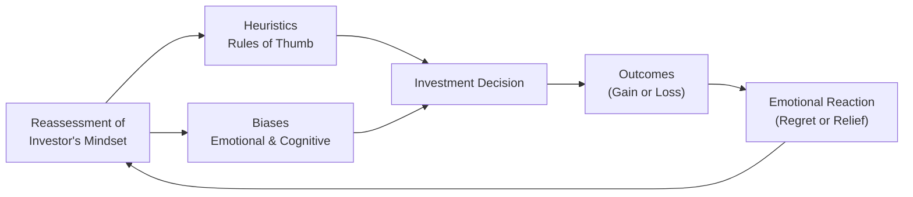

## 2.1 What Is Behavioural Finance?

Imagine you’re talking with a friend who’s freaking out because their favorite tech stock just plummeted. They might say, “Ah, that’s it, I’m out,” even though they still believe in the company’s fundamentals. This tension between what we “know” rationally and what we “feel” emotionally is at the heart of behavioural finance. In short, behavioural finance studies how psychological and emotional factors influence investors—and, by extension, the entire market. Traditional finance theory often assumes people are logical creatures focusing on maximizing returns. But in reality, we’re human, and humans sometimes make questionable choices (like panic-selling if the market sneezes).

This section takes a deep dive into the key concepts of behavioural finance, showing why recognizing cognitive and emotional biases can be just as important as picking the right stocks or bonds. We’ll explore how the work of Daniel Kahneman and Amos Tversky revolutionized our understanding of human decision-making—and how these insights can help you become a better advisor, investor, or both. So let’s buckle up and see how our minds can lead us astray—or, if harnessed correctly, help us invest more wisely.

### Why Behavioural Finance Matters

Think of behavioural finance as a toolkit. Traditional finance starts with the premise that markets are efficient, and that individuals make decisions purely on logic. But real-life experience (followed by evidence-based research) shows a different picture. Investors:

• Get emotional when the market’s volatile.  
• Hold onto losing investments for too long, hoping to “break even” someday.  
• Become overly euphoric when portfolios soar, forgetting to re-check fundamentals.  
• Anchor on past prices or rumor-driven expectations, even if those are no longer relevant.  

From a practical standpoint, behavioural finance helps investment advisors and clients:

• Identify times when fear or greed may overshadow rational analysis.  
• Understand (and possibly correct) emotional or cognitive pitfalls, such as loss aversion or overconfidence.  
• Develop strategies to manage biases—like setting up formal rebalancing rules so that impulsive decisions don’t derail a long-term plan.  

In Canada, advisors must comply with regulatory expectations for suitability and Know Your Client (KYC) processes, as outlined by the Canadian Investment Regulatory Organization (CIRO) and the Canadian Securities Administrators (CSA). Incorporating behavioural finance principles into these processes can lead to more tailored advice and, ultimately, happier clients who understand the method behind the madness.

### The Founding Figures: Kahneman and Tversky

Daniel Kahneman and Amos Tversky are often considered the “godparents” of behavioural finance. Their groundbreaking research in psychology challenged the assumption that individuals are consistently rational when making decisions. Kahneman, a psychologist, even won the Nobel Prize in Economic Sciences for his work related to Prospect Theory—an achievement underscoring the impact of psychology on economics and finance.

Over a series of experiments, Kahneman and Tversky discovered that people use mental shortcuts—heuristics—that can be extremely helpful in everyday life (like deciding the best route to work) but may turn disastrous in high-stakes financial decisions. It turns out that, while we all try to cope wisely with limited information, our shortcuts sometimes lead us astray. If you’ve ever thought, “Eh, I just have a feeling about this stock,” you’re using a form of heuristic—though it may be wise to dig deeper before hitting that “buy” button.

### Key Concepts in Behavioural Finance

Behavioural finance encompasses a wide array of biases, heuristics, and theories that shape how people behave in the markets. Let’s explore some of the most common (and occasionally amusing) phenomena.

#### Heuristics

Heuristics are mental shortcuts or rules of thumb. They’re designed to simplify our decision-making. For instance, “buy what you know” is a heuristic that might nudge you to pick companies whose products you use every day. It might work well sometimes—maybe you discover a gem of a consumer goods stock. But other times, the heuristic can overshadow essential due diligence. You might miss red flags like deteriorating financials or questionable management.

#### Loss Aversion

Have you ever felt double the pain from a $100 loss compared to the pleasure of a $100 gain? That’s loss aversion in action. Put simply, individuals hate losing money more than they like making it. A perfectly rational person might see both outcomes as having the same absolute value. But many of us, well, it just hurts so much more to lose. You might hold onto a losing investment, hoping it will rebound, rather than taking a measured, rational step to sell and redeploy capital into stronger opportunities.  

#### Overconfidence Bias

Investors sometimes (perhaps more often than we care to admit) believe they know more than they actually do. Overconfidence bias can show up when an investor imagines they’re extra skilled at stock picking or seemingly psychic about predicting market tops and bottoms. This can lead to excessive trading, ignoring contradictory evidence, or doubling down when faced with losses, all because we assume “I’ve got this!”

#### Anchoring

Anchoring happens when we get stuck on certain reference points—even if those points are arbitrary or irrelevant. Let’s say an investor bought a stock at $50. That price becomes their psychological anchor, and they evaluate all decisions relative to it: “I won’t sell below $50 because that’s my cost basis!” The problem? Markets don’t care about your personal anchor. The stock’s future price depends on supply, demand, and fundamentals, not on the point where a particular investor came in.

#### Prospect Theory

Prospect Theory, pioneered by Kahneman and Tversky, describes how people typically perceive gains and losses. It contrasts with traditional utility theory, which assumes perfectly rational behavior. According to Prospect Theory:

• We feel losses more intensely than gains of the same magnitude (loss aversion).
• We tend to overweight small probabilities and underweight moderate or high probabilities.
• We evaluate outcomes relative to a reference point (often the status quo or purchase price), rather than purely focusing on final wealth.

So, rather than calmly adding and subtracting utility points, we tend to flinch when we lose money—and this influences our investment decisions more than an equivalent gain would.

### A Simple Case Study

Let’s say you purchased four different stocks in your portfolio: Stock A, B, C, and D. Over six months:

• Stock A rose by 10%.  
• Stock B stayed roughly the same.  
• Stock C fell by 10%.  
• Stock D fell by 50%.  

You suddenly need cash for a home renovation. Which do you sell?

• A purely rational approach might be to pick whichever holding has the worst future prospects, factoring in tax considerations and portfolio strategy.  
• A typical behavioural approach might see folks quickly selling Stock A (because that’s a psychologically comfortable gain to lock in), while they cling to Stock D, refusing to “take the loss.”  

Is it always wrong to hold onto the losers? Not necessarily. Sometimes the losers are undervalued future winners. But if the reason for holding them is only to avoid admitting defeat, well, that’s your bias talking.

### Why This Knowledge Is Critical for Advisors

Understanding behavioural finance is especially crucial for investment advisors. We mention in Chapter 1 that an advisor’s job includes learning about their clients and determining investment objectives and constraints. Now, layering on behavioural insights from this section:

• Advisors can identify if a client is prone to panic selling.  
• Advisors can sense subtle overconfidence in market forecasts.  
• Advisors can help anchor clients on rational benchmarks, not arbitrary reference points.  

Moreover, regulators—now harmonized under CIRO in Canada—place great emphasis on Know Your Client (KYC) processes and suitability (see CSA’s National Instrument 31-103). These aren’t just formalities. They help match a client’s risk tolerance, risk capacity, and other personal factors with appropriate portfolio strategies. Behavioural finance can play a huge role in capturing the intangible “emotional risk tolerance”—the point at which a client might bail on a well-researched plan out of fear.

### Balancing Quantitative and Qualitative Insights

In practice, investment advisors combine numbers-driven models (like Modern Portfolio Theory, Markowitz efficient frontier analysis, or risk-parity models) with qualitative insights:

• Catching early warning signs of client anxiety, such as phone calls after every minor market dip.  
• Recognizing a client’s tendency toward “herding”—following the crowd blindly.  
• Incorporating systematic checks against recency bias (the inclination to give too much weight to recent data versus historical patterns).  

A balanced approach helps advisors craft a more robust asset allocation framework, as introduced in Chapter 3. For instance, an advisor might propose an investment policy statement (IPS) that includes automatic rebalancing triggers, thereby removing some of the emotional guesswork about when to buy or sell.

### Bringing These Insights to Client Conversations

One thing advisors often learn the hard way is that logic alone rarely wins hearts. Addressing the psychological side is key. So how does an advisor broach these delicate topics?

• Relate biases to everyday situations. For loss aversion, highlight how it sometimes resembles the anxiety of missing out on a “deal” at the mall.  
• Keep it simple. Use charts or short narratives instead of bombarding clients with formulas or jargon.  
• Provide context. Emphasize that biases are universal. It’s not that a client is “bad at investing”—it’s that the human brain is wired to prioritize fear over logic.  
• Include stories from your own life. If appropriate, share that time you panicked and sold a mutual fund—only to see it soar months later. This fosters openness and trust.

### Visualizing Behavioural Influences

Below is a simple diagram illustrating how behavioural finance factors feed into investment decisions. You can see heuristics and biases flowing into an investor’s mindset, ultimately affecting decisions and outcomes.

1. An investor’s mindset is shaped by personal experiences and general market info.  
2. These inputs inevitably involve heuristics (personal shortcuts) and biases (emotional or cognitive distortions).  
3. They converge into an investment decision.  
4. The decision results in certain outcomes—either a gain or a loss.  
5. The investor then reacts emotionally (regret, excitement, fear, or relief).  
6. This feeds back and influences the investor’s mindset for the next decision round.

### Practical Tools and Resources

If you’re an advisor looking to strengthen your understanding of behavioural finance—or just a curious investor—here are a few resources to explore:

• CIRO Code of Conduct: https://www.ciro.ca  
  - Provides guidelines and rules for how advisors must serve and protect their clients.  
• CSA National Instrument 31-103: https://www.securities-administrators.ca/  
  - Outlines important suitability and KYC requirements.  
• “Thinking, Fast and Slow” by Daniel Kahneman  
  - A foundational resource on cognitive biases and how our minds process information.  
• “Beyond Greed and Fear” by Hersh Shefrin  
  - Delves deeper into the emotional forces at play in finance decisions.  

Additionally, many open-source financial planning tools or spreadsheet-based calculators allow you to incorporate subjective weighting factors for risk tolerance. These frameworks can prompt you to consider non-quantitative aspects—things like personal comfort with volatility or fear of large drawdowns.

### Common Pitfalls and Best Practices

• Pitfall: Dismissing Behavioural Factors as “Just Emotions.”  
  - Best Practice: Emphasize how even quantitative analysts have emotional blind spots. Encourage ongoing education in identifying these biases.  

• Pitfall: Failing to Document Rationales for Trades.  
  - Best Practice: Maintain a simple trading journal or note section outlining “Why I’m Buying/Selling.” This helps to separate emotional urges from well-thought-out rationale.  

• Pitfall: Blindly Relying on Past Performance.  
  - Best Practice: Use asset allocation guidelines that consider a broader market context. Past performance can’t guarantee future results, as disclaimers often remind us.  

• Pitfall: Making Knee-Jerk Changes in Crises.  
  - Best Practice: Create a robust Investment Policy Statement (IPS) with triggers or intervals for rebalancing that aren’t emotionally driven.  

### Personal Anecdote (A Little More Informal)

I’ll never forget the time I got caught up in overconfidence bias. I read a few articles praising a certain tech company (won’t name it here!), and I just knew I “couldn’t lose”—it was apparently the next big thing. Well, I invested a hefty sum at its all-time high. Pretty soon, the stock tumbled 40%. My first reaction was, “This can’t be happening—I’m right.” I dug in, telling myself the market was just “irrational” or “not realizing the company’s potential.” Talk about anchoring and overconfidence! Eventually, I cut the position at a big loss. But man, that lesson stuck. Now, I triple-check fundamentals, read contrarian opinions, and watch for signs I might be letting my own hype overshadow reality. So yeah—if you’ve been there too, you’re in good company.

### Conclusion

Behavioural finance is more than just a buzzword. It’s a robust field of study that recognizes we’re not always the rational robots that standard economic theory might assume. By understanding key biases like loss aversion, overconfidence, anchoring, and heuristics—and by appreciating how Prospect Theory reframes gains and losses—we can craft better investment strategies. For advisors, weaving behavioural insights into client discussions helps ensure portfolios are not just mathematically balanced, but also psychologically comfortable.

In subsequent sections of this chapter, we’ll dig deeper into the complexities of investor biases, personality types, and how risk tolerance questionnaires sometimes fall short. Together, these topics equip you with a holistic view of what truly shapes a client’s risk profile (Chapter 2). For any investor (pro or novice), the bottom line is: knowing how your mind works is one of the biggest competitive edges you can have in the market.  

----

## Test Your Knowledge: Behavioural Finance Essentials



### Which researchers are most famously associated with pioneering work in behavioural finance?

- [ ] Eugene Fama and Harry Markowitz  
- [ ] John Maynard Keynes and Milton Friedman  
- [x] Daniel Kahneman and Amos Tversky  
- [ ] Robert Shiller and Burton Malkiel  

> **Explanation:** Daniel Kahneman and Amos Tversky conducted groundbreaking studies on cognitive biases and decision-making under uncertainty, which are foundational to behavioural finance.

### Which bias describes the tendency to hold onto a losing investment because you do not want to realize a loss?

- [x] Loss aversion  
- [ ] Anchoring  
- [ ] Confirmation bias  
- [ ] Availability bias  

> **Explanation:** Loss aversion is when we feel losses more strongly than comparable gains and refuse to realize a loss, hoping to avoid the emotional pain of “locking in” that negative outcome.

### What is the primary lesson taught by Prospect Theory?

- [ ] Investors generally aim to maximize total wealth without emotional influences.  
- [x] Individuals value gains and losses differently, often feeling more pain from losses than pleasure from gains.  
- [ ] Markets are always rational and efficient.  
- [ ] Only professional traders exhibit biases.  

> **Explanation:** Prospect Theory, developed by Kahneman and Tversky, demonstrates that people disproportionately value losses more strongly than equal gains and use reference points to evaluate outcomes.

### During an advisor–client meeting, the client says their gut tells them to sell everything because of a slight market dip. Which concept best explains this snap judgment?

- [ ] Anchoring  
- [ ] Hindsight bias  
- [x] Heuristics  
- [ ] Rational expectation  

> **Explanation:** Heuristics are mental shortcuts or rules of thumb that can lead to quick, though sometimes irrational, decisions, such as impulsively selling due to fear from a minor market drop.

### You own a stock that you purchased at $60 per share. It’s now trading at $45, and you refuse to sell because “it’s worth at least $60.” This illustrates:

- [x] Anchoring  
- [ ] Overconfidence  
- [ ] Recency bias  
- [ ] Herding  

> **Explanation:** Anchoring occurs when you fixate on an initial reference point (in this case, your purchase price), even when new changes in the market might render that reference less relevant.

### Which of the following is a useful measure to combat emotional investing?

- [x] Establishing an Investment Policy Statement (IPS) with automatic rebalancing triggers  
- [ ] Relying solely on market rumors to time trades  
- [ ] Only buying assets that are trending on social media  
- [ ] Avoiding any written record of your decisions  

> **Explanation:** A written IPS with predefined rules helps reduce impulsive decisions spurred by emotional reactions to market fluctuations.

### According to behavioural finance, why might investors chase “hot” stocks without proper fundamental analysis?

- [x] Herding behavior  
- [ ] Strict rational choice analysis  
- [ ] The Linus effect  
- [ ] A regulatory requirement  

> **Explanation:** Herding behavior refers to individuals following the crowd’s choices, often ignoring their own research or fundamental analysis, purely because everyone else is doing it.

### Which Canadian regulatory organization focuses on overseeing investment dealers, mutual fund dealers, and market integrity, particularly emphasizing investor protection?

- [x] CIRO  
- [ ] MFDA (Mutual Fund Dealers Association)  
- [ ] IIROC (Investment Industry Regulatory Organization of Canada)  
- [ ] FINRA  

> **Explanation:** As of 2023, the Mutual Fund Dealers Association (MFDA) and the Investment Industry Regulatory Organization of Canada (IIROC) combined into the Canadian Investment Regulatory Organization (CIRO). CIRO now oversees investment dealers, mutual fund dealers, and marketplace integrity.

### What does the term “overconfidence bias” mean in the context of investing?

- [ ] Believing that past performance always predicts future returns  
- [ ] Accepting gains are more important than avoiding losses  
- [x] Overestimating your knowledge and ability to predict market movements  
- [ ] Excessively worrying about rare catastrophic events  

> **Explanation:** Overconfidence bias occurs when investors hold an inflated perception of their market insight or trading skills, thus taking higher risks without acknowledging uncertainties or contrary evidence.

### True or False: Behavioural finance is only relevant for retail investors but not for professional portfolio managers.

- [x] True  
- [ ] False  

> **Explanation:** This is actually a trick statement in the sense that it’s commonly misunderstood. Behavioural finance applies to everyone—retail investors, professional portfolio managers, and even institutions. Emotional and cognitive biases can affect all levels of decision-making.


