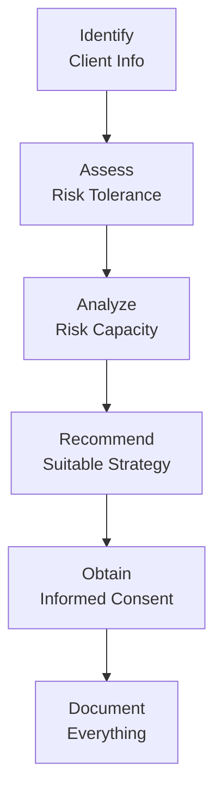

## 2.10 Ethical and Regulatory Considerations in Risk Profiling (Additional Topic)

Imagine yourself sitting down with a new client, coffee or tea in hand, and the two of you are just chatting about their big-picture financial goals. They’re excited about investing in the markets, but they also feel a bit uncertain about the nitty-gritty details—especially the notion of “risk.” As the conversation unfolds, you realize you have both a moral and a legal obligation to ensure that the investments you suggest are suitable for their comfort level, their existing resources, and their future dreams. This balancing act between ethics and regulation is what we explore in this section—because, in my opinion, there’s no better way to serve clients (and sleep well at night) than by doing right by them.

Below, we’ll dive into the intricacies of risk profiling from an ethical perspective, as well as examine the regulatory requirements in Canada grounded by CIRO (Canadian Investment Regulatory Organization) guidelines. We’ll talk about documentation, transparency, disclaimers, and so much more. By the end of this discussion, you’ll hopefully feel more confident in conducting thorough, ethically grounded, and compliant risk assessments that serve your clients’ best interests.

---

## Why Ethics and Regulation Matter in Risk Profiling

When we talk about ethics, we’re talking about principles that shape our decisions—like honesty, integrity, and fairness. When we shift our lens onto regulation, we’re looking at frameworks put in place by institutions (like CIRO) to ensure that financial professionals meet certain standards, including:

• Identifying a client’s risk capacity and risk tolerance.  
• Documenting the client’s information, preferences, objectives, and constraints.  
• Ensuring that any recommendations align with that information.  

### Fiduciary Duty and Suitability Requirement

Within the Canadian context (and in many jurisdictions worldwide), advisors and portfolio managers have a fiduciary-like duty to place their clients’ best interests above their own. This concept is often aligned with or even embedded in the “Suitability Requirement.” In a nutshell:

- Suitability Requirement:  
  A regulatory mandate that investment recommendations must align with an investor’s objectives, time horizon, and risk tolerance.

- Fiduciary Duty:  
  An obligation to act in the best interest of the client, prioritizing their needs over personal or corporate gain.  

If you’re wondering what this means in practice: you cannot just chase high commissions or rely on guesswork. Instead, you use formal processes, build strong relationships with clients, and demonstrate that your decisions align with their well-being.  

---

## Regulatory Framework in Canada: CIRO Requirements

As of January 1, 2023, the Mutual Fund Dealers Association of Canada (MFDA) and the Investment Industry Regulatory Organization of Canada (IIROC) were replaced by the new Canadian Investment Regulatory Organization (CIRO). CIRO is now Canada’s single self-regulatory body overseeing investment dealers, mutual fund dealers, and market integrity on equity and debt marketplaces. For official updates or more detailed guidelines, you can refer to CIRO resources at [https://www.ciro.ca](https://www.ciro.ca).

### Key Takeaways from CIRO Rules

• Thorough KYC (Know Your Client) Process: Member firms are required to gather and maintain detailed client information on an ongoing basis. This includes personal details (like net worth, age, marital status) and more abstract attributes (like attitudes toward market volatility, personal ethics, and sustainability preferences).

• Accurate Risk Profiles: The recommended risk profile must be tailored to each client. A standardized one-size-fits-all approach may not fly under a compliance review.

• Continuous Updating: Clients’ circumstances evolve over time (new jobs, retirements, windfalls, changes in personal temperament, etc.), and so do their risk profiles. CIRO emphasizes that advisors must regularly update KYC documentation to reflect those changes.

• Conflict of Interest Management: Under the CSA’s client-focused reforms, advisors must identify, disclose, or avoid conflicts of interest. This includes explaining how you get paid and how that might impact your recommendations.

• Documentation for Compliance: Advisors—working on behalf of a CIRO-regulated member firm—must be prepared to demonstrate how each recommended solution satisfies the client’s best interests.

---

## Balancing Ethics and Compliance in Risk Profiling

### The Human Side of Risk

We often think of risk as numbers, charts, or formulas. But it’s worth acknowledging that risk tolerance is also about human emotion. Some clients might originally express that they’re “totally okay with risk,” only for them to panic when a market correction occurs. Others might say they are very conservative, but at the first sign of a hot tech stock, they suddenly want in.

From an ethical standpoint, your job is to steer clients gently toward understanding the reality of their risk profile. This is not just about a questionnaire; it’s an ongoing conversation. Maybe you let them vent about their fear of losing everything or their sense of regret if they don’t capitalize on an obvious market trend. Document each conversation, because:

1. It helps you keep track of evolution in the client’s mindset.  
2. It provides compliance evidence that can be retrieved in the future.  

### Transparency and Informed Consent

Clients have the right to know how and why they are labeled as “Aggressive,” “Moderate,” or “Conservative.” Lay out the questionnaire, the weighting system, the methodology—basically, demystify the entire approach to risk profiling. If your client is in the loop, they become a partner in the decision-making process, rather than a bystander.

I remember once having a client who was initially quite enthusiastic about taking on more risk. But once I explained what “volatility” really meant—i.e., that the value of her portfolio could drop 20–30% in a serious downturn—she changed her mind entirely. She just needed that clarity about what an “aggressive” label would actually entail. So, well, informed consent can be a game-changer.

---

## The Risk Profiling Process: An Ethical and Compliance-Oriented Framework

Below is a simplified visual representation of how risk profiling typically unfolds, highlighting the ethical and regulatory checkpoints.

1. **Identify Client Info:** Gather data pertaining to the client’s net worth, income sources, dependents, future financial goals, personal values, and attitudes toward risk.  
2. **Assess Risk Tolerance:** Use qualitative and quantitative measures (e.g., questionnaires, interviews, scenario analyses).  
3. **Analyze Risk Capacity:** Evaluate how much financial risk the client can realistically handle without jeopardizing crucial life goals.  
4. **Recommend Suitable Strategy:** Match the client’s risk profile to the appropriate investment products or allocation strategies.  
5. **Obtain Informed Consent:** Ensure the client fully understands the recommended approach, including potential downsides.  
6. **Document Everything:** Keep thorough records of each step, including communications and disclaimers.  

Following this framework helps you remain compliant with CIRO rules, while also upholding your ethical obligation to ensure that the client invests within a risk profile appropriate to their circumstances and temperament.

---

## Documentation and Its Role in Compliance

### Why Documentation Matters

• **Audit Trail:** When regulators (like CIRO) or compliance officers check your suitability analysis, you must show how you arrived at recommendations.  
• **Legal Protection:** Thorough documentation can serve as a protective measure if there’s ever a dispute about whether you acted ethically and responsibly.  
• **Building Trust with Clients:** A well-organized report of your processes demonstrates professionalism.  

### What Should Be Documented?

• **Client Questionnaires & Surveys:** Retain the client’s answers, even if you note personal observations.  
• **Meeting Notes or Call Recordings (Where Permissible):** Summaries of discussions, especially around risk tolerance and preference changes.  
• **Support for Recommendations:** Reference to market data, official investor resources, or other professional research that shaped your strategy.  
• **Sign-Offs & Electronic Confirmations:** Confirm that the client understands the risks.  

---

## Educating Your Client: Materials and Disclaimers

One of the reasons risk profiling can feel so complicated is that clients may not grasp all the financial jargon. Offering educational materials—like brochures, infographics, or short videos—can help bridge that gap. If you want your clients to make informed decisions, gently guide them through:  

- **Basics of Portfolio Allocation**  
- **How Different Asset Classes Carry Different Risks**  
- **Common Behavioral Biases** (see Section 2.4 of this book)  
- **Historical Market Volatility**  

And don’t forget disclaimers. It might sound tedious, but disclaimers serve two important functions:

1. Clients realize that past performance is not a guarantee of future success.  
2. You, as the advisor, are clarifying the boundaries of your professional engagement.  

---

## Conflict of Interest and the Canadian Regulatory Environment

### Aligning with CSA Client-Focused Reforms

According to the Canadian Securities Administrators (CSA), advisors must place clients’ interests first and address any conflicts of interest inherent in compensation structures or product placements. For instance, if you earn a commission for recommending certain high-fee mutual funds, you must disclose that. This might be awkward at times—some advisors worry clients will think they’re being “sold a product.” The best approach: remain transparent, and have an open conversation about compensation models.  

### CIRO’s Role

Under CIRO’s oversight, compliance teams often conduct spot checks on how advisors handle conflict-of-interest disclosures and risk profiling. If a certain fund selection is suspiciously misaligned with the client’s stated risk tolerance, expect a red flag. Sometimes, you might just get asked a few questions about the rationale. Other times, it could trigger a deeper audit or an inquiry into your recommended strategies.  

---

## Integrating Ethical Principles into Daily Practice

In my experience, the difference between an advisor who just follows rules and one who truly internalizes ethical principles can be dramatic. Some ways to infuse ethics into your day-to-day:

- **Cultural Sensitivity:** Clients from different cultures may have unique perspectives on risk, debt, speculation, or family obligations that shape how they invest.  
- **Empathy and Patience:** Instead of rushing through the process, take time to really hear the client’s story.  
- **Life-Cycle Considerations:** A younger person might have more capacity for risk than a retiree living off fixed income. This nuance matters.  
- **Consistency Checks:** Double-check that your proposed asset allocation does not contradict the client’s comfort level with short-term losses or other constraints.  
- **Continuous Education:** Keep up with changes in regulatory requirements, advanced risk profiling techniques, new asset classes (see Chapter 13), and improved ways to communicate risk concepts.  

---

## Potential Pitfalls in Risk Profiling

• **Overreliance on Questionnaires:** Yes, the risk tolerance questionnaires are important. But they’re not the full story. Always supplement them with personal discussions.  
• **Ignoring Client Updates:** If a client’s personal or financial situation changes significantly (job loss, inheritance, marriage, or new dependents), you must revisit and update the risk profile.  
• **Conflicts of Interest Not Disclosed:** Failing to disclose how fees or commissions work can undermine your entire ethical approach—and violate CIRO or CSA rules.  
• **Vague Documentation:** “We found this investment suitable for the client” is not enough. Show your math (so to speak).  

---

## Real-World Case Study: When Risk Wasn’t Properly Profiled

A few years ago, a firm recommended high-yield bonds to a retiree living on a fixed pension. The client was told, “Oh, it’s a nice balance of income and growth.” The short version of how that ended: the “junk bond” market took a downturn, and the retiree suffered substantial losses. During the compliance review that followed, the firm discovered that the client’s risk tolerance had ultimately been categorized as “Low.” The immediate question was: why was a high-yield (and relatively high-risk) bond recommended?

This scenario highlights that if an advisor either misunderstood or overlooked the client’s risk constraints, dire consequences can follow. Ultimately, the firm faced regulatory scrutiny, had to compensate the client, and made sweeping changes to its KYC processes.

---

## Tools and Resources

### CIRO Rule Book  
Check the latest version of the CIRO Rule Book at [https://www.ciro.ca](https://www.ciro.ca). It’s the cornerstone for understanding compliance obligations, including the specifics of client risk profiling and how to maintain updated records.

### Canadian Securities Administrators (CSA) Notices on Client-Focused Reforms  
These notices provide guidance on addressing conflicts of interest, KYC amendments, and improved suitability requirements. They’re freely available on the official CSA website.

### Free/Open-Source Financial Tools  
• **Open-Source Risk Engine (ORE):** A library of quantitative finance tools for analyzing risk.  
• **Portfolio Visualizer:** While not fully open-source, it does offer free features to help model portfolio risk and returns.  

### Books and Articles for Further Reading  
- “Successful Investor Behavior” by C. DeLurgio and L. T. Hawkins (explores behavioral biases and how they impact risk-taking).  
- “Investment Governance for Fiduciaries” by Michael E. Drew and Adam N. Walk (focus on fiduciary responsibilities and good governance practices).  
- Chapters 2.1–2.9 of this book (Investment Management Techniques, IMT®) for deeper insights into behavioral finance, investor biases, and risk profiling questionnaires.  

---

## Conclusion

Anyway, whenever you approach risk profiling, I’d say the name of the game is “balance.” You’re balancing your ethical obligation to act in your client’s best interests with the regulatory framework (CIRO, CSA, etc.) that ensures market integrity and investor protection. Combining empathy with thorough documentation and transparency fosters trust—trust that can carry you through market ups and downs, changes in personal circumstances, and even those tension-filled compliance audits.

Ethical risk profiling is like building a sturdy bridge between client and advisor: strong foundations on both shores, open lines of communication in the middle, and no rickety shortcuts. By taking the time to do it properly, you’ll offer your clients not just peace of mind, but a true partnership in building—and preserving—their wealth.

---

## Test Your Knowledge: Ethical and Regulatory Considerations in Risk Profiling Quiz



### Which statement best describes the concept of fiduciary duty in relation to risk profiling?

- [x] It refers to an advisor’s obligation to act in the client’s best interest, prioritizing the client’s needs over personal or corporate gain.  
- [ ] It defines the specific formulas used to calculate someone’s risk tolerance.  
- [ ] It focuses exclusively on fulfilling regulatory paperwork, without any genuine concern for the client’s well-being.  
- [ ] It emphasizes the client’s responsibility to educate themselves on market conditions.  

> **Explanation:** Fiduciary duty is about the advisor’s responsibility to put the client’s interests first, which naturally extends to how risk profiling is approached.  

---

### When updating a client’s risk profile, which regulatory body in Canada currently oversees the compliance obligations?

- [ ] MFDA  
- [ ] IIROC  
- [x] CIRO  
- [ ] FINRA  

> **Explanation:** As of 2023, the Mutual Fund Dealers Association of Canada (MFDA) and the Investment Industry Regulatory Organization of Canada (IIROC) were replaced by the new self-regulatory organization, CIRO.  

---

### Which of the following is a key reason for documenting client communications throughout the risk profiling process?

- [x] It provides an audit trail and evidence of alignment with the client’s best interests.  
- [ ] It is rarely required by regulators.  
- [ ] It only matters when clients invest in extremely risky products.  
- [ ] It is optional if the advisor thoroughly explains investments verbally.  

> **Explanation:** Documentation is essential for demonstrating suitability and compliance. It also serves as a reference if there is disagreement in the future.  

---

### Why is it important for advisors to be transparent about how they conduct risk assessments?

- [ ] To burden the client with technical details and jargon.  
- [ ] To avoid necessary compliance checks.  
- [x] To ensure the client is an active partner in decision-making and truly understands their own risk profile.  
- [ ] Because client-focused reforms no longer require transparency if the advisor is licensed.  

> **Explanation:** Transparency fosters a relationship of trust and ensures the client provides informed consent about their investments.  

---

### Which of the following best reflects an unethical practice when recommending an investment based on a client’s risk profile?

- [x] Selecting a product primarily for its high commission without aligning it to the client’s long-term objectives.  
- [ ] Providing educational materials that clarify potential risks and returns.  
- [ ] Documenting detailed notes from client interactions.  
- [ ] Reconfirming changes in risk tolerance after major life events.  

> **Explanation:** Placing personal gain over the client’s risk tolerance and objectives violates both ethical and regulatory standards.  

---

### Which of these statements best explains the term “Suitability Requirement?”

- [ ] Ensuring the advisor’s interests are protected.  
- [ ] Guaranteeing clients earn positive returns.  
- [x] Aligning recommended investments with an investor’s objectives, time horizon, and risk tolerance.  
- [ ] Matching the largest product inventory to the widest client demographic.  

> **Explanation:** The Suitability Requirement ensures that investment recommendations align with the client’s unique variables—objectives, risk tolerance, and time horizon.  

---

### What is an advantage of offering educational materials and disclaimers during the risk profiling process?

- [x] It clarifies the potential risks and empowers clients to make informed decisions.  
- [ ] It replaces the need for professional advice or regulatory oversight.  
- [x] It can reduce misunderstandings where clients may not grasp the implications of their risk choices.  
- [ ] It eliminates the legal requirement for obtaining signatures or e-confirmations.  

> **Explanation:** Providing educational materials and disclaimers is a best practice; it helps ensure clients understand possible outcomes and fosters transparency.  

---

### How should conflicts of interest be managed under Canadian regulations?

- [ ] They can be quietly ignored if they are small.  
- [x] They must be disclosed, or eliminated if possible, so that the client is aware of the advisor’s compensation structure.  
- [ ] They are not relevant to risk profiling discussions.  
- [ ] They are completely unregulated in Canada.  

> **Explanation:** Canadian Securities Administrators (CSA) client-focused reforms require that conflicts of interest be identified and fully disclosed to the client.  

---

### Why are questionnaires alone insufficient for fully capturing a client’s risk tolerance?

- [ ] Because they have no regulatory usefulness under CIRO’s rules.  
- [x] Risk tolerance can be complex and influenced by emotions, personal experiences, and ongoing conversations.  
- [ ] Modern technology has replaced them entirely with robo-advisors.  
- [ ] Clients never fill out questionnaires truthfully.  

> **Explanation:** Questionnaires provide a starting point, but in-depth discussions and ongoing updates are vital to truly understanding a client’s risk tolerance.  

---

### In risk profiling, is it acceptable for an advisor to remain silent about high potential losses if the investment aligns with the client’s “aggressive” label?

- [x] True  
- [ ] False  

> **Explanation:** Even for aggressive investors, the advisor must disclose potential losses so that the client can give truly informed consent. Hiding or downplaying risks is unethical and non-compliant.  


