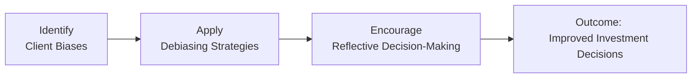

## 2.2 The Relevance of Behavioural Finance to the Investment Advisor

Before we dig into the specific ways behavioral finance shapes the advisory process, let me share a quick personal anecdote. Years ago, when I was still fairly new to this field, I had a client who insisted on cashing out everything whenever the market dropped by even a tiny percentage. They weren't always this way, but after a particularly emotional experience—losing money in a short-lived bear market—they found it nearly impossible to stay invested. All the fundamentals pointed in a certain direction, but fear won out every time. If only I had better understood the psychological underpinnings behind that fear, I might have been able to guide them toward calmer, more rational decisions from the start.

Behavioral finance provides just that: a deeper understanding of why clients act the way they do, even if it seems to go against logic. Rather than assuming everyone's a perfectly rational economic actor (hint: trust me, they’re not), behavioral finance gives us practical tools to identify biases and implement strategies that align each client’s behavior with their long-term goals. In the sections that follow, we’ll explore key biases like herd mentality and regret aversion, dig into “debiasing” techniques, and discover how to foster reflective decision-making. We’ll also see how advisors might train staff to catch early warning signs of distress or bias-driven behavior. All these elements flow directly from the recognition that, at the end of the day, humans are emotional creatures—and that’s okay. The job of an investment advisor is part math and analysis, sure, but it’s also part coach and counselor.

---

### Understanding Behavioral Finance

Behavioral finance, introduced in Chapter 2.1 (What Is Behavioural Finance?), is the study of how psychological factors influence our investment decisions and financial well-being. Traditional finance theories assume people are “rational agents” who always weigh costs and benefits accurately. But real-world investors often let emotions, mental shortcuts, and social pressures shape their decisions.

So, how does this matter for you, the advisor? Well, it impacts everything. The entire client-advisor relationship can benefit from understanding behavioral finance:

• When market volatility spikes and fear takes hold, you can help clients avoid selling at the worst possible time.  
• When optimism abounds—during a bull market run—you can guide clients away from piling into high-risk trades driven by “fear of missing out.”  
• When regret, disappointment, or second-guessing sets in (and it inevitably will), you can help clients analyze and reflect instead of reacting.

If you haven’t noticed already, this is where your “soft skills” become crucial. Essentially, understanding behavioral finance helps you become both a better communicator and a more empathetic advisor, ensuring you can tailor your advice to the psychological realities of your clients.

---

### Common Investor Biases and Their Impact

There are a host of biases that shape client decisions, but we’ll focus on two big ones below. These are biases you’ll likely see throughout your client base, regardless of their net worth or level of sophistication.

#### Herd Mentality
Herd mentality is the tendency of investors to follow the crowd. Even if it’s not in their best interest, many investors feel compelled to do what everyone else in the market is doing. You may recall that time when people rushed headlong into tech stocks at sky-high valuations, or the surging popularity of a new cryptocurrency that soared before crashing—classic herd behavior. Clients often come to you pointing to what their neighbors, colleagues, or online forums are doing, and demand the same. This “keeping up with the Joneses” mindset can lead to poorly timed trades, excessive risk-taking, or the purchase of assets that don’t fit their actual goals.

#### Regret Aversion
Regret aversion is the tendency to avoid making decisions for fear of future remorse. Now, I remember a client who refused to invest in any high-growth sector fund because they’d once made a big bet on a single stock that went bust. Even though the new opportunity was well-researched and diversified, the negative memory stuck like glue, causing them to avoid any similar approach. Regret aversion can freeze clients into inaction or prompt them to choose “safe” (and perhaps suboptimal) investments simply to avoid the sting of regret if things go south.

These two examples are, of course, just the tip of the iceberg. We talk more about many other biases—overconfidence, anchoring, confirmation bias—in other parts of this chapter. But understanding herd mentality and regret aversion gives a good introduction to how powerful behavioral pressures can be.

---

### Debiasing Strategies for Advisors

Spotting biases is half the battle. The other half is helping clients manage—and hopefully overcome—those biases. Debiasing strategies involve creating frameworks, prompts, or processes that push clients toward sound decisions.

Here are some practical tips:

**1. Structured Checklists**  
Encourage clients to review a checklist every time they make a big change in their portfolio. Such a checklist might ask, “Are you selling due to market headlines or in response to your own pre-defined exit criteria?” or “Is this investment aligned with your long-term risk tolerance?” A simple set of yes/no questions can be remarkably effective at curtailing impulsive actions.

**2. Regular Reminders**  
Let’s say you automate monthly emails that highlight relevant performance metrics and tie them back to the client’s goals. The email might remind them: “Your long-term horizon is 15 years. Volatility in the short term is expected; short-term fluctuations need not force a decision.” This simple technique re-anchors them in those original objectives.

**3. Objective Portfolio Rebalancing**  
Rebalancing is a systematic process of realigning a portfolio back to a target asset allocation. Periodic rebalancing, whether quarterly or annually, ensures that neither fear nor greed dominates decisions—it’s just a mechanical, rules-based step that helps maintain the originally agreed risk level.

**4. Cooling-Off Periods**  
When a client emotions spike—maybe from a sudden drop in share prices—suggest they take a cooling-off period of a few days to let their emotions settle. This can prevent panic selling and other knee-jerk moves. For instance, you can say, “Let’s pause for 48 hours before finalizing a decision” or “Let’s plan a follow-up call next week to reassess.” Often, a little emotional distance fosters a more rational choice.

**5. Ongoing Education**  
One of the most undervalued tools is education. Host small seminars, share quick videos, or recommend short articles from reliable financial news sites. When clients better understand market cycles, asset-allocation principles, and the real nature of risk, they’re much less susceptible to fear-driven or impulsive acts.

---

### Encouraging Reflective Decision-Making

A big part of navigating biases is learning how to reflect before acting. Reflective decision-making basically means giving clients (and yourself) time and space to process. It also means encouraging them to consider the evidence, weigh pros and cons, and examine the emotional triggers behind their decisions. Here are some practical ways to incorporate reflection into your advisory practice:

• Journaling: Suggest that clients keep a brief investment journal. Before they make a move, have them write a few sentences about their reasons. Encourage them to re-evaluate these notes if they feel compelled to exit the position prematurely.  
• “Why Am I Doing This?”: Ask them to restate—for each new proposed trade—exactly how it aligns with their stated financial goals. For example, is it about diversifying, creating a new income stream, or chasing returns? That little question can reveal a lot.  
• Pros and Cons: Classic debate strategy. When a client proposes a radical shift like “selling all equities,” ask them to list on paper the benefits and the potential negatives. Not only does this slow down the impulse, but it can also reveal overlooked consequences.

Think of these tactics like brushing your teeth: short, simple tasks done consistently that keep your financial health in good shape. They’re not fancy, but they work.

---

### Training Staff to Identify Behavioral Clues

It’s not just about you as the advisor. Often, a client’s first point of contact is your branch or support staff. Consider training your team to understand the basics of emotional triggers and how to respond empathetically. Maybe a client calls panicking about some headline: If the staff member listening can recognize the difference between a genuine issue and a herd-mentality impulse, they can calm the situation or schedule a timely chat with you. Another scenario: a client sends an email at midnight, anxious about a single stock. A well-trained staff member can reply promptly with reassurance and guidelines, defusing tension before it escalates into rash portfolio decisions.

• Flagging Emails: Have a system where certain keyword-laden emails (e.g., “PANIC SELL”) trigger an alert for you or another experienced team member.  
• Consistent Communication Style: Provide your staff with quick reference scripts—for instance, “We understand this can be concerning; let’s review your long-term goals and your predefined risk tolerance.” Consistency in messaging means clients hear the same calming, balanced perspective.

This shared vigilance across your firm or branch ensures that small emotional fluctuations don’t lead to big mistakes.

---

### Practical Considerations and Implementation

Bringing behavioral finance concepts into day-to-day advisory work demands intentional processes. You already know that Canadian regulations (now under the Canadian Investment Regulatory Organization, or CIRO) require you to collect extensive Know-Your-Client (KYC) information and perform suitability reviews that account for a client’s risk tolerance. Well, guess what? Accounting for behavioral patterns isn’t just a nice add-on—it can significantly help you meet, and even exceed, these regulatory expectations.

According to CIRO guidelines, advisors must ensure that clients fully understand the risks in their portfolios and the rationales behind investment recommendations. By layering behavioral finance insights on top of the required KYC and suitability processes, you can produce an investment approach that is robust both mathematically and psychologically. Think of it as the next logical step in fulfilling your fiduciary duty: once you’ve integrated these psychological insights, you’ll be better prepared to spot early signs that your client’s risk tolerance might be shifting due to an emotional response rather than a genuine change in circumstances.

In addition, the Canadian Investor Protection Fund (CIPF) underscores the importance of effective communication when discussing investment risks. Advisors can tap into CIPF educational materials to help clients gain clarity about how investor protection works. By weaving these discussions into your regular updates, you provide an extra layer of reassurance that can counteract fear-driven decision-making.

From a broader perspective, many open-source financial tools and platforms now integrate behavioral analytics modules. Some robo-advisory services (discussed in Chapter 2.7) offer an optional “emotional check-in” feature that encourages clients to log their mood before making trades. You can partner with or recommend such tools to clients, using them as a supplemental resource. Even something as simple as a free spreadsheet that tracks “emotional states” next to trades can reveal patterns—like that they always want to sell after reading negative news, regardless of the actual fundamentals.

---

### Visualizing the Behavioral Finance Advisory Process

Below is a quick flowchart illustrating how behavioral insights integrate into an advisor’s process. You can refer to it as a roadmap from “initial client interaction” to “portfolio performance outcome,” showing how the integration of behavioral strategies can lead to better, calmer decisions.

• A (“Identify Client Biases”) is where you notice signs of herd mentality, regret aversion, or other biases.  
• B (“Apply Debiasing Strategies”) is where you implement structured checklists, cooling-off periods, objective rebalancing, etc.  
• C (“Encourage Reflective Decision-Making”) is the stage where you ensure each decision is well-thought-out, asking “Why am I doing this?”  
• D (“Outcome: Improved Investment Decisions”) is the ultimate goal, hopefully resulting in a more resilient portfolio that can weather both the highs and lows, while aligning with the client’s risk profile.

---

### Real-World Example: Case Study in Debiasing

Let’s consider a hypothetical scenario: Taylor, a 40-year-old professional with a stable income and a moderate risk tolerance. Taylor’s main bias is herd mentality—Taylor follows online stock forums and is always looking for the next big thing. At one point, Taylor invests heavily in a trendy tech firm near its peak, then regrets that decision after a 30% drop.

As Taylor’s advisor, you start by acknowledging the emotional factor. You ask Taylor to journal about the initial purchase decision. When the next hot stock tip emerges in a forum, you suggest a 48-hour cooling-off period before placing any trade. You also arrange for monthly reminders summarizing Taylor’s long-term goals: children’s education fund, retirement in 25 years, and so forth. Finally, you rebalance Taylor’s portfolio quarterly to avoid overweight positions in newly hyped stocks.

After about a year of these debiasing tactics, Taylor becomes more reflective and less reactive. While they still follow the forums (old habits die hard!), they now typically bring these ideas to you for a measured discussion rather than diving right in. Over time, the performance of Taylor’s portfolio stabilizes, and the investing experience becomes less stressful for everyone involved.

---

### References to Further Reading

• “Behavioral Investor Types,” by Michael M. Pompian – A robust framework for classifying investors based on patterns of behavior and bias.  
• “Thinking, Fast and Slow,” by Daniel Kahneman – A classic exploration of how intuition and reasoning shape our judgments.  
• CIRO Resources (https://www.ciro.ca) – Official guidelines and educational materials on KYC, suitability, and advisor best practices in Canada.  
• Canadian Investor Protection Fund (https://www.cipf.ca) – Learn about coverage limits, claims processes, and educational resources that can help reassure anxious clients.

---

### Conclusion

Behavioral finance is not just a buzzword; it’s a set of ideas and tools that can transform how you guide your clients. By spotting and understanding biases like herd mentality and regret aversion, you tailor your communication to steer clients away from impulsive errors. With debiasing strategies—such as structured checklists, cooling-off periods, and objective rebalancing—you keep decisions aligned with real goals instead of ephemeral emotions. Encouraging reflective decision-making then cements these lessons, giving each client a framework to evaluate investment choices calmly.

Moreover, training your branch or support staff to identify signs of emotional distress or bias in client inquiries can make a real difference. Having a cohesive, well-trained team is a huge plus when fear is on the rise. And in the background, robust tools, consistent processes, and compliance with CIRO requirements help you remain on the right side of regulations while delivering real value.

If there’s one core message to remember, it’s this: investing isn’t solely about numbers and charts. It’s also about people—people who have hopes, fears, regrets, and biases. When we integrate behavioral finance into our day-to-day practice, we acknowledge that investors are human, and we empower them to achieve their financial goals in a way that respects both their rational and emotional selves.

---

## Test Your Knowledge: Behavioral Finance Application in Advisory Services



### Which investor bias involves following the crowd rather than conducting independent research?

- [ ] Regret aversion
- [x] Herd mentality
- [ ] Anchoring bias
- [ ] Confirmation bias

> **Explanation:** Herd mentality describes the tendency to follow the actions of the majority. Investors often jump into popular stocks or market trends simply because everyone else is doing it, rather than conducting an objective analysis.

### What is the main objective of a “cooling-off period” in investment decision-making?

- [ ] To encourage immediate reaction to market news
- [x] To allow time for emotions to settle before finalizing an investment decision
- [ ] To execute trades automatically when indicators are met
- [ ] To eliminate the need for rebalancing

> **Explanation:** A cooling-off period helps clients avoid impulsive moves by giving them time to reflect after a market downturn or other emotional event. This often results in more rational and goal-aligned choices.

### Which of the following is a structured approach to help reduce biases in decision-making?

- [x] A checklist for investment decisions
- [ ] Random portfolio rebalancing
- [ ] Following trends in social media forums
- [ ] Limiting communication with clients during market volatility

> **Explanation:** Structured checklists remind clients (and advisors) to verify if trades align with their long-term plan before acting on emotional impulses.

### How can regret aversion affect investment choices?

- [x] It can lead clients to avoid making decisions for fear of future remorse.
- [ ] It encourages more frequent transaction activity.
- [ ] It results in greater use of leverage.
- [ ] It always leads to higher-risk investments.

> **Explanation:** Regret aversion makes investors hesitant to act because they fear the emotional pain of a wrong choice, often causing them to be overly cautious or to miss out on potential opportunities.

### Which organization in Canada oversees investment advisors and emphasizes the importance of understanding client psychology?

- [x] CIRO
- [ ] MFDA (current SRO)
- [x] CIPF
- [ ] IIROC (current SRO)

> **Explanation:** The Canadian Investment Regulatory Organization (CIRO) is the national self-regulatory body that oversees investment dealers, mutual fund dealers, and market integrity. (MFDA and IIROC are defunct predecessor SROs. CIPF is an investor protection fund, not an SRO, but it also plays a role in investor education.)

### What does an “objective portfolio rebalancing” strategy aim to achieve?

- [x] Keeping portfolio allocations in line with the client’s original risk-return profile
- [ ] Maximizing returns without considering client risk tolerance
- [ ] Persuading clients to hold onto a single stock indefinitely
- [ ] Avoiding any type of fixed plan or schedule

> **Explanation:** Objective rebalancing is a systematic process that ensures the portfolio remains aligned with the client’s desired risk and return parameters by periodically adjusting asset weights.

### Which of the following is an effective strategy when training branch staff to handle emotionally driven client calls?

- [x] Having scripts that reassure clients and remind them of their long-term goals
- [ ] Limiting staff from interacting directly with clients
- [x] Encouraging staff to offer immediate buy/sell instructions without advisor input
- [ ] Instructing staff to ignore any mention of fear or panic

> **Explanation:** By giving front-line staff a consistent approach—usually via scripts that address client concerns and bring the conversation back to their financial objectives—advisors can prevent panic decisions.

### How do “regular reminders” help mitigate biases?

- [x] They re-anchor investors on their long-term goals and risk tolerance.
- [ ] They promote impulsive decision-making.
- [ ] They eliminate the need for staff training.
- [ ] They reduce the usage of cooling-off periods.

> **Explanation:** Regular reminders, such as monthly emails circling back to risk tolerance and investment objectives, help keep clients focused on the bigger picture rather than short-term market swings.

### Why is it beneficial to incorporate behavioral finance insights into the KYC process?

- [x] It equips advisors with a deeper understanding of emotional triggers, leading to more personalized and suitable recommendations.
- [ ] It is completely unnecessary for compliance purposes.
- [ ] It only slows down the account-opening process.
- [ ] It replaces the need to document the client’s risk tolerance.

> **Explanation:** Behavioral finance supplements the standard KYC process by revealing how a client’s biases might influence investment decisions, enabling advisors to offer tailored advice and better address psychological factors.

### True or False: Incorporating behavioral finance into the advisory process can improve client satisfaction and long-term portfolio outcomes.

- [x] True
- [ ] False

> **Explanation:** By recognizing, addressing, and mitigating human biases, advisors can guide clients to steadier, more rational investment behaviors—enhancing both satisfaction and performance over time.


