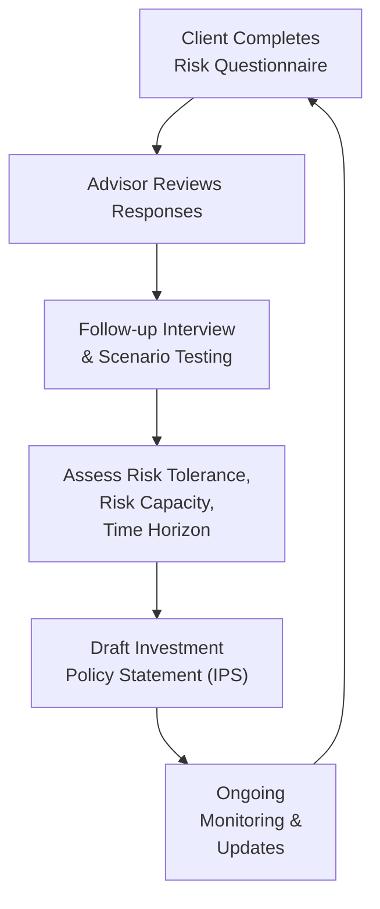

## 2.3 Risk Profile Questionnaires and Their Limitation

Anyone who’s talked to a financial advisor has probably been asked, “Hey, how comfortable are you with risk?” You might have seen it phrased differently—like, “Would you lose sleep if your portfolio value went down 20% in three months?” or “How would you handle a market meltdown?” These sorts of questions often appear in what we call risk profile questionnaires. They help advisors gauge not just your financial strength but also your emotional response to potential losses. The idea is: if you know how you or your client responds to risk, you can craft an investment strategy that suits them better.

Yet, as you might guess, no single questionnaire can capture the complexity of a person’s psychological and financial relationship with risk. After all, real life is a moving target. People’s personal circumstances shift, market factors change, and emotional states ebb and flow. Let’s dig into how these questionnaires work, their typical structure, why they’re helpful, and—importantly—why we should be aware of the limitations.

------

Understanding how risk profile questionnaires fit into the broader financial planning process helps us make sense of them. In Chapter 1, “The Portfolio Management Process,” we explored the importance of knowing client objectives and constraints to build a sound Investment Policy Statement (IPS). Here, in Chapter 2, “Understanding a Client’s Risk Profile,” we focus on the slightly messier, more psychological side of investing: the basic mindsets, preferences, and emotional tendencies that shape investment decisions. Risk profile questionnaires are one big piece of that puzzle.

### What Is a Risk Profile Questionnaire?

A risk profile questionnaire is typically a structured set of questions—sometimes 10, 20, or more—that investors answer to help measure multiple dimensions of how they handle uncertainty:

• Financial capacity for loss (often called “risk capacity”).  
• Emotional tolerance for market drops (“risk tolerance”).  
• Preferred investment horizon (short term vs. long term).  
• Emotional/behavioral factors (like how they react to sudden losses).

In practice, these questionnaires use both quantitative and qualitative approaches. For example, you might see a question like this:

“By how much would your portfolio need to drop in one year before you’d become uncomfortable?”  

And then there might be multiple-choice answers:  
A) 10% drop  
B) 20% drop  
C) 30% drop  
D) More than 30%

There could also be open-ended or scenario-based questions, such as:  
“If your portfolio decreased by 15% in two months during a broad market downturn, how likely would you be to sell some of your investments?”  

Of course, the value in answering these questions is that it provides a snapshot of how someone thinks and feels—at that moment. Advisors often use them as a basis to start deeper conversations. Indeed, these questionnaires commonly shape an Investment Policy Statement by:

• Pinpointing the types of securities that fit a client’s comfort (e.g., more equity vs. more fixed income).  
• Setting an expected return range over a given time horizon.  
• Encouraging clarification on potential scenarios (like recessions, industry collapses, or personal financial emergencies).

### Typical Structure of a Risk Profile Questionnaire

Though every questionnaire has its own flavor, many share a similar structure:

1. Demographic and Financial Data  
   Clients fill in basic info: age, income, net worth, major liabilities, and investment goals (like retirement, buying a home, or saving for children’s education).

2. Time Horizon  
   Questions about when the client plans to use (or needs access to) the invested funds. This is crucial because the shorter the time horizon, the more vulnerable the portfolio is to short-term fluctuations.

3. Risk Capacity  
   Multiple questions focused on how much loss the investor’s budget can sustain without jeopardizing essential goals. For instance, an investor with a stable, high-paying job or large emergency fund has a higher capacity for risk.

4. Risk Tolerance  
   Scenario-based or direct emotional questions. “How do you feel about volatility?” “If your account drops 15%, do you see it as a buying opportunity or cause for panic?” This is where psychological and emotional elements come into play.

5. Behavior Under Stress  
   Hypothetical situations gauge how frequently or severely a client might want to rebalance or even exit the market. Some questionnaires measure behavioral biases as well.

6. Summarized Score or Classification  
   Many tools then provide an overall “score” or classification—like “moderate risk,” “aggressive risk,” or “conservative risk.” Advisors interpret this to align portfolio construction with a client’s risk category.

#### Example: The “Finametrica Risk Profile” Framework

One well-known open-source tool is the “Finametrica Risk Profile” framework. It gathers comprehensive investor data through several detailed questions, creating a more robust profile than a simplistic 5-question quiz. Some advisors who want a deeper, research-backed approach will often adopt it to reduce the subjectivity—yet even then, it’s not a perfect measure. After all, we humans are complicated, and our feelings about money are rarely “one-size-fits-all.”

------

### Why Use Risk Profile Questionnaires?

Let’s be real: it can be awkward to talk about money. People might say one thing but feel another. Or sometimes they just don’t know how to articulate their real feelings about risk. Risk profile questionnaires break the ice with structure, offering an easy entry point for an advisor or the investor to start a serious conversation. From there:

• They Provide a Starting Point. It’s easier to have a discussion when you have some raw data, even if it isn’t perfect.  
• They Help with Regulatory Compliance. In Canada, the Canadian Securities Administrators (CSA) Staff Notice 31-336 has set guidelines emphasizing the importance of understanding client risk profiles. CIRO (the Canadian Investment Regulatory Organization) also expects advisors to do their due diligence. Having a questionnaire on file helps demonstrate that you’ve at least taken steps to figure out a client’s comfort with risk.  
• They Encourage Ongoing Dialogue. Good advisors don’t stop after handing out the questionnaire. Instead, they see it as a first pass. Next comes deeper questioning, scenario discussions, and frequent check-ins.

### The Limitations of Risk Profile Questionnaires

Now, here’s the part you really want to pay attention to. Risk profile questionnaires do a decent job of capturing data points, but they have some serious drawbacks too:

**Oversimplification**  
Life is complex. A multiple-choice question can’t completely capture all aspects of how you might handle a sudden 25% market drop, especially when your spouse, kids, job security, or emotional well-being might be in flux. Some questionnaires frame these complicated emotional factors in just one or two questions. That’s like trying to sum up the entire plot of a big novel in a single sentence—something gets lost.

**Inconsistent Interpretation**  
I remember a scenario a few years back with a friend who was feeling cautious about markets. She took a risk questionnaire and indicated she’d be fine with significant market volatility, simply because she misread the question. She thought they were talking about “tolerance for market unpredictability” in general, not specifically about her personal losses. Another client might select “I can handle a 30% drop” when times are good, not realizing the true emotional pain once markets actually tumble. Current market sentiment can sway answers, so the same client might fill out the questionnaire differently when the market is up vs. down.  

**Static Approach**  
Remember: life changes, sometimes fast. Maybe you’re single and totally fine taking big risks in your 20s, but then at 35, you get married, have a child, and buy a house. Suddenly your capacity for a 30% portfolio drawdown might not be what it used to be. A once-off questionnaire can’t capture the evolving nature of risk tolerance and capacity. Advisors must revisit and update these questionnaires periodically.

------

### Going Beyond the Questionnaire

So, do you just toss out the questionnaire? Absolutely not. But consider it a rough starting point—like the first handshake in a relationship. After that handshake, here are the kinds of steps advisors should take:

**1. Follow-up Interviews**  
Talk in depth about the client’s reasons for each answer. Why do they believe they’re comfortable with a 20% drawdown? Not only does this weed out misunderstandings, but it also uncovers the “why” behind the “what.”

**2. Scenario Discussions**  
Walk clients through hypothetical financial storms (e.g., a recession or a sudden job loss) and see how they react. This conversation can reveal quite a bit about how prepared they are—both emotionally and financially. And doing so can help them grasp the real-world implications of their responses.

**3. Review Personal Circumstances**  
As major life events unfold—marriage, children, new mortgage, business start-ups—do another “temperature check.” Perhaps the original risk assessment is out of date. Draft a revised approach and see if the new or old risk alignment still holds.

**4. Combine Quantitative and Qualitative Data**  
Numbers only tell half the story. A solid risk evaluation merges data-driven insights (like liquidity, net worth, time horizon) with intangible factors (like anxiety about big losses or strong opinions about market timing). It’s about the synergy of “How do you feel?” and “Here’s what the numbers say.”

**5. Leverage Regulatory and Best-Practice Guidelines**  
In Canada, we have the CSA Staff Notice 31-336, which offers best practices on how to gather and interpret client data. CIRO oversees standards for investment dealers, ensuring advisors don’t just conduct a perfunctory questionnaire but actually use it as a building block toward suitable advice.

**6. Ongoing Monitoring**  
A risk profile is rarely “set in stone.” Good advisors set up an annual or semiannual meeting to revisit the client’s risk attitude. If a major event shakes up the client’s world—like a big inheritance, divorce, or job change—I recommend reviewing that risk profile right away.

------

### Practical Example: The Johnson Family

Let’s illustrate some of these limitations. Suppose you have the Johnson family—Rachel and Tom, both 40 years old, with two kids aiming for higher education in a few years. They come to an advisor and fill out a standard risk questionnaire.

• Rachel, a risk averse nurse, suggests she’s only comfortable with minor swings in their portfolio—maybe a 5–10% drawdown.  
• Tom, a tech-savvy individual, says he’s a risk taker who’s fine with a 25% or even 30% short-term drop.  

The resulting “average” might place them in a balanced-medium risk bracket. But if you end up focusing solely on that average, you might mismatch the portfolio. On deeper questioning, you discover that Tom’s risky stance is primarily driven by the fact that he just received a promotion; he feels momentarily invincible. Rachel’s caution is driven by the memory of the 2008 financial crisis, which saw her parents lose a big chunk of retirement savings.  

A more holistic approach might reveal that while Tom’s job is secure in the short term, the family is still reliant on Rachel’s stable nursing income to meet basic costs. The conversation could show that neither extreme (Tom’s “thrill ride” appetite nor Rachel’s fear) is truly accurate. Instead, by exploring their personal stories and using scenario stress tests, the advisor might calibrate an asset allocation that stays within a moderate risk tolerance.

------

### Revisiting the Questionnaires Regularly

Market cycles ebb and flow. Some periods bring meteoric rises (think of certain tech booms), and others bring steep plunges (like a pandemic-driven economic shock). Clients’ personal circumstances also shift—perhaps they need to fund a major renovation, or their health situation changes, or they receive an inheritance. Even their emotional makeup could evolve as they gain more investing experience and become more (or less) comfortable with volatility.

Because of these unpredictable changes, it’s advisable to:

• Schedule annual or semiannual check-ins.  
• Promptly review the questionnaire if there’s a significant personal event.  
• Adjust the Investment Policy Statement as needed.  

We also highlight these points in Chapter 1 when discussing the Portfolio Management Process. By making the risk discussion cyclical rather than one-and-done, advisors remain aligned with a client’s shifting reality.

------

### Role of Canadian Regulatory Frameworks

In Canada, the regulatory environment emphasizes the “Know Your Client” (KYC) and “Know Your Product” (KYP) obligations, which are now overseen by CIRO (the Canadian Investment Regulatory Organization). Previously, IIROC (Investment Industry Regulatory Organization of Canada) and MFDA (Mutual Fund Dealers Association) existed separately, but they amalgamated into CIRO in 2023 (effective June 1, 2023). 

CIRO expects its regulated investment dealers to maintain thorough records of a client’s risk profile, among other details. Further guidelines from the CSA, like Staff Notice 31-336, reinforce the importance of adopting best practices in risk profiling. This is particularly relevant because, while advisors typically rely on risk questionnaires, they can’t solely rely on a short form. The notice recommends in-depth client knowledge gathering and frequent updates. 

------

### Mermaid Diagram: Risk Profiling Flow

Below is a simplified high-level diagram of how a risk profile questionnaire might feed into the broader recommendation process:

In this cycle:

• The client fills out the questionnaire (A).  
• The advisor reviews (B) and uncovers any inconsistencies.  
• By doing deeper interviews and scenario testing (C), the advisor refines the risk profile (D).  
• Based on the refined understanding, the advisor drafts or updates the client’s IPS (E).  
• Finally, there’s an ongoing monitoring loop (F) which eventually leads back to re-evaluating the questionnaire and the entire cycle.

------

### Best Practices for Advisors

• **Combine Multiple Tools**: Instead of relying on one single questionnaire, advisors can tweak and combine multiple question sets or tools (like the Finametrica framework) to add depth and nuance.  
• **Explain the Results**: Clients often see a “risk score” and wonder what it really means. Advisors should interpret it in simple language, reminding clients of the emotional and financial implications.  
• **Address Market Context**: Make it clear that the way a client feels today might differ if markets took a dramatic turn. Encourage them to imagine a tough scenario—like an immediate 10% or 20% drop—and see if their answers would shift.  
• **Personalize Advice**: The ultimate goal is to connect the client’s risk profile with an appropriate investment strategy. That might mean opting for a selection of stable bonds for capital preservation or including growth-oriented equities for younger clients with high capacity and tolerance.  
• **Refer to Regulatory Standards**: Advisors in Canada should remain up-to-date with CIRO regulations and CSA notices, as they evolve to ensure investor protection. Doing so also helps demonstrate the thoroughness of the process if there’s ever any dispute or concern.

------

### Potential Pitfalls and How to Avoid Them

• **Pitfall**: Overreliance on a Single Score  
  **Solution**: Use that score as a starting reference, then dig deeper in follow-up discussions.

• **Pitfall**: Ignore Behavioral Biases  
  Even the best questionnaires might not highlight emotional biases like overconfidence or loss aversion.  
  **Solution**: Encourage scenario analyses or mental walk-throughs of actual past downturns (like 2008 or 2020) to see how a client might have reacted.

• **Pitfall**: Failing to Update Regularly  
  **Solution**: Embed risk-profile reviews in your yearly or semiannual check-in process. If the client’s life changes drastically, do it sooner.

• **Pitfall**: Misreading or Miscommunication  
  **Solution**: Clarify ambiguous questions. Ask the client to rephrase them in their words.

------

### Advisors’ Communication Skills

This aspect ties to Section 1.6 in Chapter 1, “Communication Skills an Investment Advisor Needs.” If an advisor just fires off a questionnaire without any conversation, the final profile might be flawed. Effective communication involves:

• Explaining why the questionnaire matters.  
• Painting real-life pictures of what different risk levels truly mean (e.g., potential for greater returns vs. possibility of deeper losses).  
• Ensuring clients understand that risk tolerance and risk capacity are two different constructs.  

------

### Glossary Check

Before we wrap, let’s recap a few key definitions mentioned throughout this chapter:

• **Risk Capacity**: The financial ability to endure losses without jeopardizing core goals or financial stability.  
• **Risk Tolerance**: The client’s emotional or psychological ability to tolerate fluctuations in investment value. Sometimes referred to as “stomach for risk.”  
• **Time Horizon**: The length of time an investor expects to hold an investment. Longer horizons typically allow for more risk-taking, since there’s time to recover from market dips.

------

### References and Further Reading

• **CSA Staff Notice 31-336** – A guiding document that clarifies regulators’ expectations regarding KYC and risk profiling. You can find more details at the official Canadian Securities Administrators website (https://www.securities-administrators.ca/).  
• **CIRO** – The Canadian Investment Regulatory Organization (https://www.ciro.ca) sets standards for investment dealers and can provide resources about compliance expectations.  
• **Finametrica Risk Profile** – A well-known framework for detailed risk assessment. Various open-source materials and white papers are available by searching “Finametrica risk profiling.”  
• For a broader exploration of how risk capacity can be integrated into asset allocation, see “Chapter 3: Asset Allocation and Investment Strategies.”  
• For deeper discussion on behavioral factors, see “Section 2.4: What Are Investor Biases?” and “Section 2.5: What Are Investor Personality Types?”  

------

### Final Thoughts

I know it can seem a little mechanical at first: “Answer these 12 questions, and we’ll figure out your risk tolerance.” But real life is rarely that neat. A risk profile questionnaire is just the spark to begin a more nuanced discussion. The journey to truly understanding a client’s (or your own) risk appetite is an ongoing process, marked by changing life circumstances, shifting markets, and evolving emotions. So, sure, fill out that form, but don’t treat it as the ultimate truth—treat it as a gateway to a deeper conversation.

------

## Test Your Knowledge: Risk Profile Questionnaires and Their Limitations



### A key purpose of a risk profile questionnaire is:
- [ ] To replace any face-to-face discussion about risk preferences.
- [x] To serve as a structured starting point for deeper conversations about a client’s risk preferences.
- [ ] To precisely forecast how a client will feel about future losses.
- [ ] To eliminate the need for ongoing reviews or updates.

> **Explanation:** Questionnaires help initiate the discovery of a client’s comfort with risk, but do not completely replace discussions or ongoing monitoring.

### Which of the following is a major limitation of risk profile questionnaires?
- [x] They often oversimplify complex emotional and financial factors.
- [ ] They are illegal unless sanctioned by national regulators.
- [ ] They accurately predict how clients will react to market crashes.
- [ ] They are fully dynamic and capture changing investor attitudes over time.

> **Explanation:** Questionnaires can be helpful but frequently reduce nuanced emotional factors to a few multiple-choice questions, risking oversimplification.

### What is meant by “inconsistent interpretation” in the context of risk questionnaires?
- [ ] The questionnaire constantly changes wording, causing confusion.
- [x] Clients may interpret or answer questions differently depending on current market sentiment or misunderstanding.
- [ ] Advisors interpret client answers identically, leading to uniform results.
- [ ] The same questionnaire is used for multiple clients of differing backgrounds.

> **Explanation:** Inconsistent interpretation arises when clients read or understand questions differently over time or during different market conditions.

### Why should risk profile questionnaires be revisited over time?
- [ ] Clients tend to forget the original score, so it must be retaken periodically.
- [ ] Regulatory bodies only allow questionnaires that expire annually.
- [x] Clients’ financial or personal circumstances (and emotional responses) may change, altering their risk tolerance and capacity.
- [ ] They have random expiration dates assigned by default.

> **Explanation:** Risk tolerance and capacity can shift with new life circumstances, changing market conditions, or emotional experiences, making periodic reviews crucial.

### Which statement correctly distinguishes risk tolerance from risk capacity?
- [x] Risk tolerance is the emotional ability to endure losses, while risk capacity is the financial ability to do so.
- [ ] Risk tolerance is purely a mathematical calculation, while risk capacity is purely emotional.
- [x] Risk tolerance measures how well the client sleeps at night, while risk capacity measures how much they can afford to lose.
- [ ] They refer to the same concept and are interchangeable.

> **Explanation:** Risk tolerance deals with the client’s comfort level and mental or emotional reaction to potential portfolio losses, whereas risk capacity concerns the financial or practical ability to accept those losses.

### What is one important reason for advisors to hold follow-up interviews after a client completes a risk questionnaire?
- [x] To clarify client assumptions and verify the questionnaire’s results.
- [ ] To correct the client’s math errors in the questionnaire.
- [ ] To collect subscription fees for advanced services.
- [ ] To ensure the client invests in only one type of mutual fund.

> **Explanation:** Follow-up interviews help refine the answers, uncover misunderstandings, and paint a more accurate picture of the client’s risk profile.

### Which Canadian regulatory notice specifically provides guidance on risk profiling?
- [x] CSA Staff Notice 31-336.
- [ ] CIRO Staff Notice 45-101.
- [x] IIROC Bulletin 29-050 (historically, IIROC no longer exists as a separate entity).
- [ ] New SRO Release 2023-08.

> **Explanation:** CSA Staff Notice 31-336 outlines best practices in risk profiling for advisors in Canada.

### According to best practices, how should an advisor respond if a client’s life circumstances suddenly change (e.g., job loss or divorce)?
- [x] Update the risk questionnaire and revisit the investment plan immediately.
- [ ] Continue with the current plan regardless of changes.
- [ ] Wait until the annual review to assess the changes.
- [ ] Switch the client to an entirely new asset class without discussing risk at all.

> **Explanation:** Significant life changes can alter both risk tolerance and capacity, so reviewing the questionnaire and plan is essential.

### In the context of risk profiles, what is a scenario discussion?
- [x] A hypothetical situation where the advisor explores how a client might react under specific market conditions.
- [ ] A method of adjusting taxes on portfolio gains.
- [ ] A type of short questionnaire focusing only on equities.
- [ ] A real-time test that invests client money in extremely volatile stocks.

> **Explanation:** Scenario discussions present hypothetical market or life events to see how clients react and help refine their risk profiles.

### True or False: Risk profile questionnaires, once completed, provide a permanent and unchangeable measure of a client’s risk preference.
- [x] True
- [ ] False

> **Explanation:** Actually, this is a trick statement. The best answer is “False,” because questionnaires should be revisited regularly as client circumstances and market conditions change. It is not “set in stone.” 


