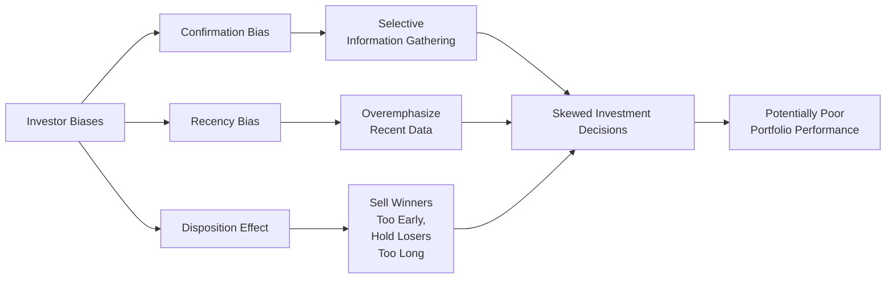

## 2.4 What Are Investor Biases?

Have you ever caught yourself clinging to a belief about a stock—even when new evidence suggested otherwise? Or maybe you found yourself putting way too much weight on what just happened in the market last week, forgetting the bigger story from the past year or more? These kinds of quirks—where our judgments get bent out of shape by how our brains tend to process information—are often referred to as investor biases. They can be sneaky, popping up in subtle ways that affect how we manage our portfolios or guide our clients.

You might recall from the earlier sections (like Section 2.1 on “What Is Behavioural Finance?”) that humans aren’t nearly as rational as classical financial theory suggests. Investor biases are basically patterns of thought and behavior that deviate from rational or optimal decision making. These biases have been studied extensively, especially since the rise of behavioural finance, which merges psychological insights with economic theory.

In this section, we’re going to zoom in on some particularly significant biases: Confirmation Bias, Recency Bias, and the Disposition Effect. These biases are consistently observed in investors across different geographies and experience levels. But before we jump in, let’s set the stage properly by defining what we mean by an investor bias and how it impacts the bigger picture when it comes to portfolio management and risk profiling. Then we’ll explore each bias in detail, talk through real-life anecdotes, and highlight the practical steps you—or your clients—can take to reduce the damage.

---

## The Essence of Investor Biases

At its core, an investor bias is a repeatable—often predictable—pattern of thinking or behavior that distorts balanced judgment. In a perfect world, all of us would weigh every piece of evidence correctly and make decisions purely based on logic and cold, hard data. But in reality, we’re emotionally-driven beings who can (and do) make errors, especially under stress or uncertainty. And the financial markets, with all the volatility and emotional swings, can amplify these biases.

### Why Biases Matter

1. They Affect Portfolio Performance  
   Biased decision-making can lead to non-optimal investment choices—like missing out on a potentially lucrative opportunity or holding on to a loser for too long. Over time, such missteps can erode portfolio returns significantly.  

2. They Impact Client Experience  
   If you’re an investment advisor, recognizing and managing your clients’ biases becomes crucial for maintaining trust and preserving strong client relationships. Clients who consistently make emotionally-driven decisions might blame their advisor for poor performance, even if the real culprit is their own biased perspective.

3. They Influence Risk Profile  
   As we covered in Section 2.3 on “Risk Profile Questionnaires,” we know these forms are only a starting point. But biases play a big role in whether an investor’s actual risk-taking behavior matches their stated risk tolerance. An investor might claim to be aggressive, for instance, but then panic-sell after a small setback, revealing deeper anxieties and biases.

Gain some familiarity with these biases, and you’ll be able to spot them more quickly in yourself and others, which can go a long way in preventing costly mistakes.

---

## Three Core Biases to Watch Out For

Let’s not sugarcoat it—there are many biases that affect investor behavior (overconfidence, anchoring, loss aversion, and so on). But for the scope of this section, we’ll concentrate on three that have a particularly powerful effect: Confirmation Bias, Recency Bias, and the Disposition Effect. These three often show up in tandem and can work in sneaky ways to undermine solid investment strategies.

### 1. Confirmation Bias

#### Definition
Confirmation Bias is the tendency to seek out or interpret new information in a way that reaffirms our existing beliefs, rather than challenges them. If you’ve ever typed something like “Why stock XYZ is a good buy” into a search engine instead of “Is stock XYZ a bad buy?”—well, you might have just demonstrated a hint of confirmation bias.

#### Real-World Example
A friend of mine, let’s call him Mark, was absolutely convinced that a certain biotechnology firm was poised for a massive breakthrough. Every time a negative news item cropped up—like a clinical trial delay—he’d write it off as “just a speed bump.” But if any tiny piece of positive rumor surfaced, he’d hold onto it like a lifeline.

Eventually, this kind of selective perception clouded his judgment so severely that he doubled down on the stock at a very high price—just before the firm announced its major drug had failed its final trials. Mark ended up losing a chunk of money, and he was left asking himself: “Why did I ignore all those warning signs?” It was a classic case of confirmation bias in action.

#### How to Overcome It
• Actively Seek Dissenting Opinions: Encourage yourself or your clients to ask hard questions—like “What if I’m wrong?” and “Where might this logic fail?”  
• Use Data-Driven Approaches: Tools like statistical software (e.g., R or Python libraries) can help. By automating certain aspects of analysis, you can rely more on data than hunches.  
• Invite Third-Party Reviews: Sometimes a neutral party (like a colleague or an external analyst) can spot red flags more readily.  

---

### 2. Recency Bias

#### Definition
Recency Bias is the inclination to overemphasize recent events or data points and underestimate the relevance of older or longer-term trends. It’s sort of like checking the temperature today and forgetting how cold it was just last week when predicting next month’s weather.

#### How It Shows Up
During a market uptrend, investors might become overly optimistic, extrapolating the latest performance far into the future. Conversely, following a sharp market correction, recency bias can lead to an overly pessimistic view (e.g., “stocks will never recover!”).

#### Personal Anecdote
I once got too excited about a rapidly rising tech stock—its 6-month chart was basically straight up. “This thing has amazing momentum,” I thought. But ironically, I overlooked the fact that in its full 5-year chart, the company had undergone repeated boom-bust cycles. Sure enough, after another few months of an uptrend, it crashed again. I basically fell victim to recency bias, ignoring the broader historical context in favor of the latest eye-catching moves.

#### Combating Recency Bias
• Look at Historical Data Ranges: Whenever analyzing performance, zoom out and check data over multiple years (or even decades) rather than just a few months.  
• Diversify the News Sources: If your news feed or social media is filled with short-term market commentary, balance it with deeper research reports or historical case studies.  
• Create an Investment Policy Statement (IPS): As discussed in Chapter 1.5, an IPS outlines your long-term strategy. When tempted to pivot based on fleeting market movements, revisit the IPS to stay level-headed.

---

### 3. Disposition Effect

#### Definition
The Disposition Effect is the tendency to sell winning investments too quickly (cashing in on gains) and hold onto losing investments for too long (hoping to break even someday). It’s often driven by a fear of regret and a reluctance to realize a loss.

#### Example
A classic scenario occurs when someone invests \$10,000 in two stocks. Let’s say Stock A quickly climbs to \$12,000 in value, and Stock B drops to \$8,000. The investor often sells Stock A to “lock in gains”—maybe out of fear the gain might vanish. But they cling desperately to Stock B, telling themselves it will come back. This approach can hamper performance by stunting winners too soon while letting losers drag on, tying up capital that could be better deployed elsewhere.

#### Overcoming the Disposition Effect
• Set Clear Exit Strategies: If a position hits a certain target (either up or down), rebalance accordingly.  
• Reframe Losses: Consider a losing position from a fresh perspective: “If I had fresh capital, would I buy more of this stock right now?” This mental exercise can detach you from the original purchase price.  
• Monitor Performance with Data: Periodically review each holding’s fundamentals, not just its price history. For instance, you can use open-source portfolio-tracking tools or specialized software to keep an eye on key performance metrics.

---

## Identifying and Managing Biases

Recognizing these biases is the first step. The second is actively managing them—both in yourself and your clients. Here are some actions you can take:

• Talk About Biases Directly: During one-on-one meetings, encourage clients to share what drove their previous investment decisions. You’d be surprised how often a simple conversation reveals a recurring pattern of confirmation bias or recency bias.  
• Encourage Self-Reflection: Suggest journaling investment decisions—jotting down the rationale at the time of purchase or sale. Reviewing these notes months or years later can provide a huge wake-up call when biases are spotted in hindsight.  
• Use an Objective Framework: Chapter 1.1 on The Seven Steps of the Portfolio Management Process highlights building an investment strategy grounded in objectives and constraints. A systematic framework can help reduce emotional decision-making.  
• Promote Evidence-Based Education: Provide data-driven insights like historical market returns, diversification benefits, and the role of asset allocation in mitigating risk (refer to Chapter 3.2 on The Asset Allocation Process and Its Benefits). Concrete evidence helps counterbalance emotionally-charged biases.

From a regulatory standpoint, the Canadian Investment Regulatory Organization (CIRO) also emphasizes that ethical decision-making requires advisors to be aware of their own possible blind spots. By extension, advisors should coach clients in recognizing and mitigating these biases. If you’re seeking more insights, you might check out CIRO’s current guidelines on best practices for advisors, which replaced the older IIROC and MFDA guidelines following their amalgamation into CIRO in 2023.

---

## Visualizing the Impact of Biases

Below is a simple flowchart illustrating how investor biases can influence decisions, eventually impacting portfolio outcomes:

As shown, each bias channels into a specific behavior that can eventually lead to decisions that harm a portfolio’s performance. Identifying these is key to taking corrective action.

---

## A Quick Note on Bias Formulas

Sometimes, you might wonder: can we mathematically model how biases shift our perception of probabilities or expected returns? Indeed, in behavioural economics, researchers often try to measure the extent of biases through probability weighting functions. While the details can get a bit technical, here’s a simplified illustration:

$$
p' = \frac{p^\alpha}{p^\alpha + (1 - p)^\alpha} 
$$

Where:  
• \\( p \\) is the objective probability of a favorable event (like a stock’s price increasing).  
• \\( p' \\) is our subjectively biased probability.  
• \\( \alpha \\) indicates the degree of bias. If \\(\alpha = 1\\), there’s no bias. If \\(\alpha < 1\\), the investor tends to overweight the smaller probabilities and underweight the larger ones, which is common in certain biases.

This is more of a conceptual illustration than a formula you’d calculate daily, but it highlights how biases can mathematically warp our perception of risk and probability.

---

## Using Data and Technology to Combat Bias

Thanks to advancements in Fintech (see Chapter 4.1), you’ve got a wide range of tools that can help:

1. Robo-Advisors with Behavioural Prompts  
   Many modern robo-advisory platforms will notice erratic behavior—like panic selling—and gently prompt you to reconsider through notifications.  

2. Open-Source Analysis Tools  
   Python’s pandas, SciPy, or R packages (e.g., tidyverse) allow you to systematically evaluate your investments without letting personal bias creep in. If you find yourself ignoring red flags, an automated analysis might bring them to your attention.

3. AI-Driven Sentiment Analysis  
   Some advanced platforms scan the news and social media to gauge market sentiment. While sentiment analysis can itself be prone to bias, it at least gives you a more neutral, data-backed perspective on what others are talking about.

---

## Managing Client Expectations

Now, it’s one thing to watch out for your own biases; it’s another to manage biases in your clients. Here are a few tips:

• Educate Clients Early: Introduce common biases during the onboarding process. By naming them and explaining them, clients become more vigilant.  
• Provide Hypothetical Scenarios: Offer practice scenarios where clients can “test” themselves. For instance, “What would you do if Stock X soared 30% in a week? What if it dropped 30%?” Explore how they might rationalize their decisions.  
• Use Balanced Performance Reviews: Remind clients of the long-term context of their portfolios during reviews. Show them broader historical performance, not just the last quarter’s results, so they avoid recency bias.

---

## Tying It All Together

What we’ve covered here—Confirmation Bias, Recency Bias, and the Disposition Effect—barely scratches the surface of how our minds can lead us astray. But these three are particularly common and potent. By naming them, seeing how they arise, and applying tangible techniques (like data-driven processes and structured decision-making), we can at least lower their influence.

It’s also worth noting that researchers like Richard Thaler and Cass Sunstein, in their famous book “Nudge,” offer strategies for subtly guiding individuals toward better decisions without limiting their freedom. Advisors can apply “nudges” such as default portfolio rebalancing options or pre-set monthly contributions that encourage healthy behaviors, effectively mitigating the biases that might otherwise prompt frantic trading or ill-timed emotional decisions.

In your journey as an investor or advisor, remember it takes ongoing self-awareness. Biases don’t vanish overnight. But with patience, the right tools, and consistent reflection, you can navigate these psychological pitfalls and foster a more stable, rational, and successful investment journey.

---

## Additional References

- CIRO (https://www.ciro.ca): Canada’s national self-regulatory organization for investment dealers and mutual fund dealers, replaced historical entities (IIROC and MFDA) in 2023.  
- Thaler, R. H., & Sunstein, C. R. (2009). Nudge: Improving Decisions About Health, Wealth, and Happiness. Penguin Books.  
- Barberis, N., & Thaler, R. (2003). A Survey of Behavioral Finance. Handbook of the Economics of Finance.  
- Tversky, A., & Kahneman, D. (1974). Judgment Under Uncertainty: Heuristics and Biases. Science.  
- Python and R Documentation: Official Python (https://www.python.org/doc/) and CRAN R (https://cran.r-project.org) resources for data analysis tools.

---

## Test Your Knowledge: Investor Biases Mastery Quiz



### Which of the following best describes Confirmation Bias?

- [ ] Overestimating the impact of recent events on future outcomes.
- [x] Seeking information that supports your existing belief while ignoring contradictory data.
- [ ] Selling winning investments too early and holding losing investments too long.
- [ ] Believing your portfolio is more diversified than it actually is.

> **Explanation:** Confirmation Bias specifically involves filtering out information that doesn’t match your preconceived notions, and seizing on data that reinforces what you already believe.

---

### Recency Bias influences an investor to:

- [ ] Discount the latest market prices in favor of historical averages.
- [x] Place too much emphasis on recent market trends when making decisions.
- [ ] Avoid relying on any historical performance data for future decisions.
- [ ] Ignore recent data and focus only on the long-term outlook.

> **Explanation:** Recency Bias leads individuals to weigh recent information or market events too heavily, often resulting in rushed judgments.

---

### What is the Disposition Effect?

- [ ] The desire to confirm what an investor already believes.
- [ ] Overemphasizing new information in investment decisions.
- [x] Selling winning investments too soon, while holding onto losing investments too long.
- [ ] Failing to acknowledge global market conditions.

> **Explanation:** The Disposition Effect describes the tendency to lock in gains quickly due to fear of losing them, but to hold onto losing investments hoping they’ll recover.

---

### Which technique can help mitigate Confirmation Bias?

- [x] Actively seeking out opposing viewpoints on your investment thesis.
- [ ] Relying solely on past performance to guide investment choices.
- [ ] Making investment decisions based on social media influence.
- [ ] Avoiding all forms of research before purchasing a stock.

> **Explanation:** Challenging your belief, such as reading negative analyses or consulting with impartial advisors, helps overcome Confirmation Bias.

---

### In overcoming Recency Bias, which strategy would be most effective?

- [x] Reviewing a security’s historical data over multiple years before making decisions.
- [ ] Allocating all capital into short-term market trends.
- [x] Integrating a long-term perspective through an Investment Policy Statement.
- [ ] Basing portfolio adjustments solely on yesterday’s performance.

> **Explanation:** Recency Bias can be mitigated by adopting a longer-term viewpoint and setting guidelines in an IPS, so that short-term swings don’t derail your strategy.

---

### CIRO (Canadian Investment Regulatory Organization) replaced:

- [x] The former IIROC and MFDA.
- [ ] The Bank of Canada.
- [ ] The World Trade Organization.
- [ ] The International Monetary Fund.

> **Explanation:** As of January 2023, CIRO became the main self-regulatory body in Canada, taking over from these former entities.

---

### Which of the following is a recommended best practice for managing a client’s Exposure to the Disposition Effect?

- [x] Establish predefined exit rules for both gains and losses.
- [ ] Base all decisions on short-term technical indicators.
- [x] Regularly re-evaluate positions as if you had fresh capital to invest.
- [ ] Only review the portfolio annually, ignoring intermittent price changes.

> **Explanation:** Setting clear exit strategies and re-evaluating positions through a fresh lens ensures that emotional attachment to the original purchase price does not cloud judgment.

---

### How might a robo-advisor help combat biases?

- [x] By sending behavioral prompts or reminders when it detects panic selling or irregular decisions.
- [ ] By placing trades at random intervals to avoid patterns.
- [ ] By ignoring market data altogether.
- [ ] By only following analyst recommendations without user input.

> **Explanation:** Many robo-advisors are programmed to detect spikes in emotional or reactive trading, and they can prompt users to re-think decisions before proceeding.

---

### An investor strongly believes a promising tech startup will succeed and overlooks all negative news. This is a direct example of:

- [x] Confirmation Bias
- [ ] Anchoring Bias
- [ ] Recency Bias
- [ ] Disposition Effect

> **Explanation:** Ignoring negative information in favor of reaffirming evidence is the hallmark of Confirmation Bias.

---

### True or False: The Disposition Effect often leads investors to hold onto losing investments to avoid realizing a loss.

- [x] True
- [ ] False

> **Explanation:** The Disposition Effect is characterized by a reluctance to sell at a loss, hoping the investment will eventually rebound to the original cost or above.




