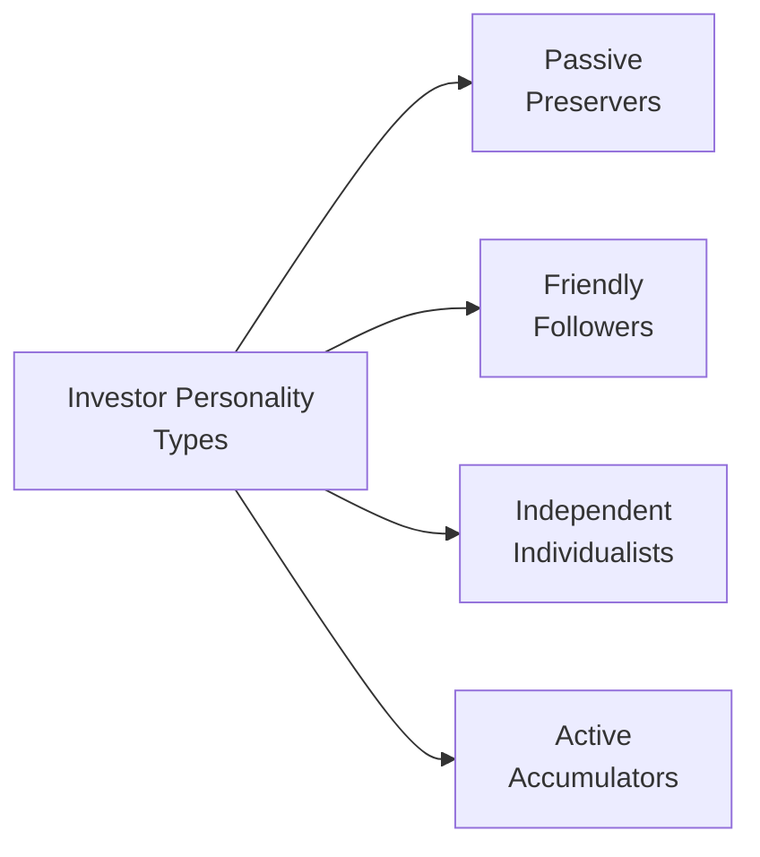

## 2.5 What Are Investor Personality Types?

Imagine you’re talking to a good friend who’s trying to figure out why they make certain moves with their investments—whether it’s stashing all their cash under a mattress, following the latest social-media-driven market frenzy, or going on a stock-buying spree at any hint of bullish news. It’s not just about math or charts or the latest rumors on the street. It’s often about who they are as an investor: their personality, risk tolerance, emotional triggers, and so much more. That’s exactly what we’re going to unpack here: investor personality types and how they shape investment decisions in very real (and sometimes surprising) ways.

Sometimes, the best way to appreciate these differences is to think of folks we know. I personally recall a family friend—let’s call her Marie—who, for years, insisted that keeping money in guaranteed investment certificates (GICs) was the only way to go. Meanwhile, her son, who just got his first job in tech, bought every shiny new cryptocurrency that popped up on Reddit. Two people. Two drastically different approaches. So why is that? Personality (plus a sprinkle of risk attitudes).

Below, we’ll delve into the common categories—Passive Preservers, Friendly Followers, Independent Individualists, and Active Accumulators—and see how advisors can devise strategies to align with each type. We’ll also discuss how these traits can shift over time, how to incorporate personality assessments, and how all of this ties into the official Canadian regulatory landscape overseen by the Canadian Investment Regulatory Organization (CIRO).

---

### Defining Investor Personality Types

Investor personality types refer to the consistent patterns of behavior, attitudes, and emotional responses individuals exhibit when dealing with financial matters. Rather than focusing solely on age or net worth, personality types address how people process information, weigh risks, and respond to market events.

Understanding these types can help advisors:  
• Tailor communication strategies that truly resonate with clients.  
• Manage expectations and reduce the chance of shocking surprises along the journey.  
• Formulate investment plans that align with unique behavioral tendencies, which often proves more effective than a one-size-fits-all approach.

Personality types are not static. Life events—like a job loss, an inheritance, the birth of a child, or a sudden market crash—can trigger significant shifts in investor attitudes. That’s precisely why regulators, such as CIRO in Canada, emphasize the importance of ongoing interaction with clients and updating their profiles as circumstances evolve.

---

### Common Investor Personality Models

While there are many ways to slice and dice investor personalities, one well-known classification for advisors includes four broad groups: Passive Preservers, Friendly Followers, Independent Individualists, and Active Accumulators. Picture them in a simple diagram:

#### Passive Preservers

Passive Preservers are those who prioritize capital preservation and stability over growth. They generally dislike volatility and may be more comfortable with investments that offer steady, albeit lower, returns—think GICs, certain bonds, or insured deposit accounts. Often, these folks have had personal experiences or influences that shaped a risk-averse mindset. Maybe they lived through a big economic downturn and saw loved ones lose their fortunes. Maybe they just can’t sleep at night if they know their money is in something labeled “high risk.”  

• Key Trait: Conservatism  
• Common Bias: Loss Aversion – They feel losses more acutely than the satisfaction from equivalent gains.  
• Likely Asset Allocation: Heavy on low-risk or guaranteed products, such as GICs, high-grade bonds, or stable dividend-paying stocks with robust track records.  

From a practical standpoint, advisors should keep in mind that these clients value security and predictability. Communication might focus on the safety net and consistent return patterns.  

#### Friendly Followers

Friendly Followers are often influenced by others—be it friends, social media, or the latest headlines. They might not necessarily have high confidence in their own research, so they follow the herd. Sometimes that means jumping on a hot trend without fully understanding it.  

• Key Trait: Herd Mentality  
• Common Bias: Confirmation Bias – They look for information supporting the latest big trend, ignoring contradictory evidence.  
• Likely Asset Allocation: A mix of mainstream assets that “everyone else” is buying, possibly leaning toward whatever has been performing well recently.

An advisor’s primary challenge here is to help them pause before reacting to sensational headlines. Gentle education and guidance about the realities and routines of the market can be incredibly valuable.  

#### Independent Individualists

Independent Individualists are, well, independent. They like doing their own homework. They’re often the type reading through annual reports or devouring financial blogs. They can be more confident in making decisions, though they may resist outside advice if they see it as constraining.  

• Key Trait: Self-Reliance  
• Common Bias: Overconfidence Bias – They might overestimate their own skills and discount external perspectives.  
• Likely Asset Allocation: Potentially broad and eclectic, spanning everything from growth stocks to carefully researched niche segments (like a specific sector or region).

The advisor’s role is often more like a partner or collaborator than a traditional authority figure. These clients generally appreciate data-driven discussions, the chance to raise direct questions, and the space to make final decisions.  

#### Active Accumulators

Active Accumulators lean toward aggressive strategies. They aim for high returns, sometimes disregarding the heightened risk that comes along. Many are entrepreneurs or highly ambitious professionals who take calculated risks in other areas of their lives.  

• Key Trait: Aggression or High Ambition  
• Common Bias: Overconfidence (similar to Independent Individualists but typically more extreme) and perhaps Action Bias – the feeling they must always be “doing something” with their portfolio.  
• Likely Asset Allocation: Heavy in equities, alternative investments, leveraged products, or other high-volatility instruments.

When working with Active Accumulators, advisors can channel their enthusiasm into disciplined strategies. For instance, introducing structured rebalancing techniques and scenario analyses can help them see potential drawdowns.

---

### Personality Shifts Over Time

No matter the initial assessment, personality types can evolve:

• Market Upheavals: Even a self-assured Active Accumulator might become more conservative after suffering a steep loss.  
• Major Life Events: Changes such as marriage, the birth of a child, retirement, or a significant health issue can trigger a reevaluation of risk.  
• Shifting Goals: Over time, goals like saving for a child’s education, home ownership, or long-term care needs come into play, naturally changing attitudes toward risk.

CIRO regulations stress the need to keep client records up to date—a detail that resonates strongly in the context of personality changes. If a client experiences a life event that could alter their risk profile, financial advisors are expected to revisit the plan, document the changes, and adjust investment strategies accordingly.

---

### Incorporating Personality Assessments During Onboarding

If you’re an advisor, you’ll want to incorporate personality assessments early in the onboarding process. Tasks might include:  

• Administering a structured questionnaire that digs into risk preferences, decision-making processes, and emotional triggers.  
• Talking about past investment experiences (good and bad) and how they reacted to them.  
• Partnering with third-party tools (including some open-source frameworks) that help gauge behavioral tendencies.  

Because personalities shift, it’s helpful to schedule periodic check-ins—particularly around big market moves or life changes. For example, I had a client (let’s call him Raj) who started off as a Friendly Follower but, after reading more about markets and attending a few educational seminars, morphed into more of an Independent Individualist. We had to reframe our communication style and the depth of data we provided.  

---

### Practical Strategies for Each Personality Type

Investors appreciate personal touches. Make communication relevant to their personality:

• **Passive Preservers:** Speak in terms of capital safety, consistent performance, and low volatility. Offer reassurance and data on historical stability.  
• **Friendly Followers:** Provide timely market updates but also highlight the risks of blindly following trends. Show them credible sources that combine both bullish and bearish views, so they develop a balanced perspective.  
• **Independent Individualists:** Share detailed analyses and research. Engage them in discussions about different viewpoints. Encourage them to cross-check multiple data sources.  
• **Active Accumulators:** Focus on performance potential but keep them grounded with risk management tools. Scenario analysis (like “what if the market drops 20%?”) can be eye-opening.  

---

### Regulatory and Institutional Context in Canada

In Canada, the regulatory landscape underwent a notable shift starting January 1, 2023, with the formation of the Canadian Investment Regulatory Organization (CIRO). CIRO now oversees both investment dealers and mutual fund dealers, among other market functions. This shift combined two predecessor bodies—the Mutual Fund Dealers Association of Canada (MFDA) and the Investment Industry Regulatory Organization of Canada (IIROC)—which are now defunct in their separate capacity. 

Under CIRO’s regulations, advisors must ensure they continue updating Know-Your-Client (KYC) information, which includes not just financial metrics but also an evolving understanding of a client’s psychological and personality-driven outlook. Furthermore:  

• The Canadian Investor Protection Fund (CIPF) is now the sole protection fund, covering client assets if a CIRO member dealer becomes insolvent.  
• Suitability requirements emphasize that recommended investments must align with the client’s risk tolerance, capacity, time horizon, and objectives—which are all influenced by personality.  

It’s a regulatory framework that effectively endorses personalized advice over cookie-cutter recommendations.

---

### Integration With Behavioral Finance

Behavioral finance is the field that blends psychology with traditional finance. The “Behavioral Biases of Investors,” a resource published by the CFA Institute, is a fantastic primer on how deeply ingrained human tendencies affect investment decisions. Many of the biases described in that publication (like overconfidence, anchoring, or herd behavior) closely tie into the personality types we’ve just outlined.

Advisors who integrate behavioral finance insights with personality assessments generally do a better job at:  

• Helping clients understand and potentially correct self-defeating behaviors.  
• Designing portfolios that clients will be more likely to stick with during challenging market phases.  
• Communicating in ways that resonate with each client’s unique mental wiring.

---

### Additional Resources

Below are some handy references and tools for further exploration:

• [CIRO’s Official Website](https://www.ciro.ca) – Stay updated on Canadian regulatory guidelines and latest announcements.  
• [Canadian Investor Protection Fund](https://www.cipf.ca) – Learn more about the sole protection fund for investors in Canada.  
• “Behavioral Biases of Investors” by CFA Institute – Explores various cognitive biases affecting investor decisions.  
• Open-Source Risk Engine (OSRE) – Though primarily for risk analytics, it can also integrate Modules or APIs to factor in risk preferences gleaned from personality assessments.

Advisors may also keep an eye on local continuing education offerings, including online courses and webinars dedicated to behavioral finance, advanced risk profiling, and communications training.

---

### Best Practices and Potential Pitfalls

• **Best Practices**  
  – Keep an open mind. Even if a client appears to be a Passive Preserver today, they might veer into a more aggressive stance tomorrow.  
  – Use both qualitative and quantitative methods. Standard questionnaires are helpful, but so are casual conversations, body language observations, or anecdotal clues.  
  – Document everything. From a compliance and liability standpoint, ensure you keep thorough notes about the client’s expressed values, concerns, and any changes that pop up.

• **Potential Pitfalls**  
  – Overgeneralizing. Not every Passive Preserver is the same; personal nuances matter.  
  – Disregarding life transitions. Missing a major life event can lead to advice that’s disconnected from the client’s reality.  
  – Failing to communicate effectively. Even the best portfolio strategy can fail if it’s not communicated in a way that aligns with the client’s personality.

---

### Conclusion

Investor personality types form the backbone of how people think, feel, and act in the investment arena. Whether you’re dealing with a Passive Preserver seeking stability or an Active Accumulator chasing high returns, recognizing these core traits can be a game-changer when building trust and delivering tailored advice.  

Never forget, personalities aren’t set in stone. They adapt to life events, market experiences, and shifts in personal goals. Incorporating personality assessments early in the onboarding process—and refreshing them periodically—is crucial, especially under the regulatory framework set out by CIRO, which underscores the importance of a thorough and continuously updated Know-Your-Client process.  

Ultimately, matching an investor’s psychological make-up with an appropriate investment plan can pave the way for more satisfying, enduring advisor-client relationships. Whether you’re an advisor or an investor yourself, staying mindful of these personality elements can make the financial journey smoother, more personalized, and—dare we say—just a bit more human.

---

## Test Your Knowledge on Investor Personality Types



### Which of the following best describes a Passive Preserver?

- [x] An investor who prioritizes capital preservation over growth and is willing to sacrifice higher returns for more safety.
- [ ] An investor who frequently seeks confirmation from peers before making decisions.
- [ ] An investor who independently conducts research and prefers a self-directed approach.
- [ ] An investor who is aggressive, ambitious, and comfortable with significant market volatility.

> **Explanation:** A Passive Preserver is conservative, focuses on stability and predictable returns, and prefers avoiding large market fluctuations.

### Which personality type is most likely to be influenced by social proof or media headlines when investing?

- [ ] Passive Preserver
- [x] Friendly Follower
- [ ] Independent Individualist
- [ ] Active Accumulator

> **Explanation:** Friendly Followers often exhibit herd mentality, seeking external validation and jumping into market trends without thorough analysis.

### An Independent Individualist might be prone to which bias in their decision-making?

- [ ] Loss Aversion Bias
- [ ] Herd Mentality
- [x] Overconfidence Bias
- [ ] Recency Bias

> **Explanation:** Independent Individualists often trust their own research and can overestimate their expertise, leading to overconfidence bias.

### Which of the following scenarios might cause a shift in an investor’s personality type from Passive Preserver to something more aggressive?

- [ ] Taking a course in art history
- [ ] Inheriting a valuable but illiquid property
- [x] Receiving a substantial inheritance and deciding to explore higher-riskassets
- [ ] Selling a small inherited business

> **Explanation:** A large influx of capital can embolden an investor, potentially increasing their willingness to accept risk.

### According to CIRO’s regulations on suitability, advisors must:

- [x] Continuously update and reassess a client’s profile as their circumstances change.
- [ ] Only perform an initial risk assessment during the onboarding process.
- [x] Ensure investment choices align with the client’s unique objectives.
- [ ] Rely on guesswork if the client refuses to answer risk questions.

> **Explanation:** CIRO emphasizes an ongoing Know-Your-Client process, revisiting it when key changes occur and aligning investments with the client’s objectives and risk capacity.

### Friendly Followers typically exhibit which of the following behaviors?

- [x] Following market trends based on friends’ or media suggestions
- [ ] Acting aggressively to maximize gains
- [ ] Researching and analyzing every aspect of a potential investment on their own
- [ ] Preferring only stable, predictable returns

> **Explanation:** They rely on external influences and social proof, often seeking confirmation from peers or media rather than forming independent conclusions.

### Which of the following is a recommended practice for advisors dealing with Active Accumulators?

- [x] Engage them with scenario analyses to illustrate potential downside risks.
- [ ] Avoid discussing downside risks proactively.
- [x] Provide robust rebalancing strategies to manage volatility.
- [ ] Allow them complete freedom without discussing potential losses.

> **Explanation:** Active Accumulators generally have a high-risk appetite and benefit from structured approaches like scenario analysis and disciplined rebalancing that help keep overconfidence in check.

### Why is it important to periodically reassess an investor’s personality type?

- [x] Life events and market changes can alter risk preferences over time.
- [ ] Personalities never change once they are formed.
- [ ] Only compliance officers request such updates.
- [ ] It is a requirement by CIPF.

> **Explanation:** Major life events, market movements, and changing personal goals can shift how a client views risk, making regular updates essential.

### Which resource provides an in-depth overview of how psychology impacts different investor types?

- [ ] CIRO’s Official Syllabus on Taxes
- [ ] CMSA (Canadian Mortgage and Securities Association)
- [ ] Open-Source Risk Engine
- [x] “Behavioral Biases of Investors” by CFA Institute

> **Explanation:** The CFA Institute’s publication on “Behavioral Biases of Investors” is a well-respected resource on the psychological factors affecting investment decisions.

### True or False: The Canadian Investor Protection Fund (CIPF) exists primarily to recommend high-risk investments to clients.

- [x] True
- [ ] False

> **Explanation:** Trick question! This statement is false. CIPF’s role is to protect client assets if a CIRO member firm becomes insolvent, not to recommend investments.


