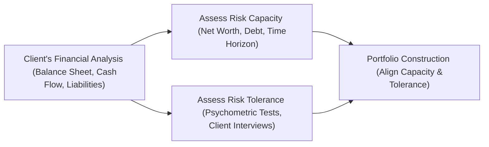

## 2.8 Risk Tolerance vs. Risk Capacity (Additional Topic)

Imagine you’re chatting with a friend who feels perfectly fine riding the wild roller coaster of a high-volatility stock market—yet that same friend happens to have a mountain of student debt, a modest emergency fund, and a family to support. This scenario is precisely what we mean by the difference between “risk tolerance” and “risk capacity”: your friend might feel totally at ease with large, unpredictable swings in portfolio value (high risk tolerance), but lack the financial resources to absorb significant losses (low risk capacity). Advisors who overlook one side of this equation risk building an unsuitable portfolio that could derail a client’s life goals.

Below, we’ll explore how risk tolerance and risk capacity each play a crucial role in understanding a client’s overall risk profile. We’ll look at real-world anecdotes, highlight psychological and financial assessment methods, bring in guidance from Canadian regulators such as CIRO and the CSA (Canadian Securities Administrators), and recommend some open-source tools for analyzing capacity and tolerance alike.

Introduction to Risk Tolerance vs. Risk Capacity

Risk tolerance is about how comfortable someone is with the possibility of losses—or the possibility of a portfolio dropping by 20% or 30% at times without them panicking. It reflects their emotional and psychological perspective on winning or losing money in the markets. In contrast, risk capacity involves hard numbers. It’s the actual ability to endure negative financial outcomes based on factors like net worth, liquidity, cash flow needs, existing debts, and future obligations (such as a mortgage, children’s education, or eldercare).

A mismatch between high tolerance and low capacity (or vice versa) puts clients at risk. An overly aggressive portfolio might crater just when they need their funds, while an overly conservative portfolio may fail to meet growth objectives. Balancing the two concepts is crucial.

Risk Tolerance: The Emotional Side

People often think risk tolerance is simply an attitude: “I’m comfortable taking big chances.” But it’s much more nuanced. It can be shaped by a person’s experiences, personality traits, and even familial or cultural upbringing. Perhaps you’ve encountered relatives who refuse to invest in anything that isn’t a guaranteed deposit certificate—maybe they lived through a devastating market crash and remain skittish. On the other hand, you might have a friend who invests heavily in tech stocks because they started investing right after a major bull run, leading them to believe volatility is easy to manage.

Risk tolerance is typically assessed using questionnaires or psychometric tests. These tests survey how individuals react to hypothetical fluctuation scenarios. For instance, if a client invests CAD 100,000 and the value falls to CAD 80,000, do they “hold tight,” “buy more,” or “sell out ASAP”? The answers offer clues about psychological comfort with volatility, though many risk tolerance questionnaires oversimplify or fail to capture real behavior under stress.

Advisors, then, are wise to combine these questionnaires with honest conversations that explore a client’s experiences with money. Time horizons also matter—someone with 30 years to retirement might be calmer about short-term losses than someone two years away from needing these funds for a down payment.

Risk Capacity: The Financial Side

Risk capacity is grounded in numbers and constraints. It answers questions like:
• Does my client have a large emergency fund?  
• Is their income steady or variable?  
• Are they dealing with substantial debt?  
• Do they have long-term obligations or big upcoming expenses (like a wedding or new business venture)?

These factors heavily influence the amount of potential loss any client can bear without jeopardizing their life plans. A 25-year-old doctor with zero debt and a lucrative employment contract might tolerate a high volatility approach if they’re also psychologically prepared for it and have ample savings. In contrast, a similar 25-year-old who is still paying off student loans, supporting family members, and has only a small emergency fund has far lower risk capacity—despite possibly having an identical appetite for risk from an emotional standpoint.

In Canada, the CSA (through National Instrument 31-103) strongly encourages investment advisors to assess both emotional and financial realities of a client’s situation. CIRO (the Canadian Investment Regulatory Organization) likewise underscores that an advisor’s know-your-client (KYC) obligations extend beyond just a client’s comfort with risk. Focusing on capacity means understanding liabilities such as mortgages, lines of credit, or other recurring obligations that could amplify the impact of a short-term drawdown.

Bringing It All Together

In practice, evaluating risk tolerance vs. risk capacity is like evaluating an athlete’s training program. The athlete might be mentally psyched to run a marathon (high psychological readiness), but if they have a bad knee and can’t physically handle 26.2 miles, no amount of mental enthusiasm will prevent serious harm. We want to ensure the “mindset” and “body” are aligned; that’s precisely what we attempt to do when we weigh risk tolerance against risk capacity in investment management.

Below is a simple flowchart to visualize the parallel processes required for each dimension:

As you can see, both risk capacity and risk tolerance get their own line of analysis, tied together at the stage of portfolio construction. Proper alignment here is crucial, as ignoring either side can lead to mismatched portfolios.

Practical Approaches to Assessing Risk

Psychometric Tests  
Psychometric tools can be extremely helpful for gaining deeper insights into a client’s feelings about risk and reward. These standardized assessments measure emotional attributes like tolerance for uncertainty, impulsiveness, and comfort with potential losses. However, keep in mind that psychometric tests are just a snapshot in time and can be influenced by factors like a recent bull or bear market. They should never be used in isolation.

Financial Analysis (Net Worth, Liabilities, and Cash Flow)  
When it comes to capacity, a thorough look at net worth (assets minus liabilities) and monthly or annual cash flow is essential. If the client has a stable income, moderate fixed expenses, and a healthy reserve of savings, their capacity for risk is likely higher than that of someone living paycheck to paycheck. Also, pay attention to the debt load. A high mortgage, car loan, or consumer debt could reduce a client’s ability to weather a market dip.

Balancing Time Horizons  
Time horizon is another big piece to consider. A client nearing retirement might have a financial plan that shows they’ll need significant distributions in the next few years. That short time horizon reduces capacity: a significant downturn at the wrong time can destroy years of careful saving. On the flip side, a client with a 30-year horizon for retirement might absorb more volatility—provided they’re comfortable with the emotional ride.

Case Study: The Young Professional

Let’s consider a real-world-inspired scenario. A 28-year-old software engineer, whom we’ll call Hannah, has a stable job and a strong appetite for risk. She invests a chunk of her monthly paycheck in small-cap growth stocks. She’s excited about technology innovations and isn’t even slightly rattled when a macro event triggers a 10% daily drop. On the surface, she appears to have high risk tolerance.

Here’s the catch: Hannah is also burdened by a substantial student loan, plus a personal line of credit used to finance her side business. Her finances are stretched, and her emergency fund is just enough to get by for a month. Accordingly, her capacity for risk is pretty low—if her portfolio supports part of her loan repayment plan, a serious downturn might put her in a financial crunch.

In helping Hannah, an advisor might begin by quantifying her monthly liabilities and building out a robust emergency fund. They might dial back overly aggressive bets until Hannah’s debt load (and thus monthly commitments) diminishes. Or, perhaps they’d keep a small portion allocated to high-growth equities while introducing less volatile instruments such as blue-chip stocks or bond ETFs to buffer any market storm. By respecting both Hannah’s tolerance and capacity, the advisor ensures she can reach her goals without succumbing to avoidable pitfalls.

Case Study: The Early Retiree

Now imagine another client, Winston, a 60-year-old nearing retirement. Winston has saved diligently throughout his career, owns his home mortgage-free, and has no major debts. He can afford a temporary dip in portfolio value, though from a psychological perspective he’s far more risk-averse—just seeing a 5% dip might cause him to lose sleep.

Here we have the reverse mismatch. Winston’s risk capacity is fairly high (he has a strong financial foundation, with minimal liabilities). However, his risk tolerance is low. Despite theoretically being able to endure big market swings, Winston’s approach and mental comfort with risk suggests a more moderate or even conservative asset allocation. If an advisor constructs a hyper-aggressive portfolio to match Winston’s capacity but disregards his emotional response, Winston might panic, sell at the worst possible time, and ultimately sabotage his returns. The advisor’s role is to create a balanced plan that Winston can stick with, psychologically and financially.

Regulatory and Professional Guidance

In Canada, before the Mutual Fund Dealers Association and the Investment Industry Regulatory Organization of Canada were folded into the Canadian Investment Regulatory Organization (CIRO), advisors traditionally leaned on “know-your-client” (KYC) and “suitability” guidelines set by their respective defunct predecessor SROs. Today, under CIRO, these guidelines remain foundational, ensuring that dealers and advisors thoroughly understand both the emotional and financial aspects of their clients.

Further, the CSA’s National Instrument 31-103 explicitly addresses the requirement for advisors to assess each client’s financial situation, investment knowledge, and risk tolerance to recommend suitable investments. Part of assessing suitability is measuring risk capacity—recognizing that a client’s net worth, liabilities, and time horizon frame their cushion against potential losses.

On a global note, the “Financial Planning Competency Handbook” by the CFP Board (though U.S.-based) also offers excellent guidance on understanding a client’s financial goals and constraints. It underscores the importance of bridging what a client wants to do with what they can do, financially speaking. By blending the best of these guidelines—CIRO’s KYC rules and the CFP Board’s approach—Canadian advisors and financial planners can provide robust and ethical advice.

Open-Source Tools and Frameworks

While many financial professionals rely on proprietary software for risk assessments, open-source tools can be an invaluable resource—particularly for smaller firms or new advisors building out their technology stack. For instance:

• Riskalyze© offers a well-known “Risk Number,” though that is not fully open-source.  
• PyPortfolioOpt, a Python-based library, can help with portfolio optimization and includes modules for risk assessment.  
• R-based solutions like the “PortfolioAnalytics” package also offer frameworks to measure portfolio volatility and to run scenario analyses.

Using free or low-cost software can supplement your personal interviews and ensure that risk capacity gets a full quantitative breakdown. With these tools, you can run stress tests that illustrate how a portfolio might react during a recession or a rapid inflation scenario—especially useful for explaining risk capacity visually to clients.

Balancing Higher Returns and Peace of Mind

At the end of the day, an advisor’s job is to align the investor’s goals with an appropriate level of risk. That line between potential higher returns (“If I had just held on!”) and emotional well-being (“I can sleep at night!”) is often razor-thin. The sweet spot is generally somewhere in the middle, where the portfolio’s risk aligns with both how the client feels and what they can truly afford to lose if the market heads south.

Common Pitfalls

• Overemphasizing Emotional Comfort: If an advisor focuses only on risk tolerance, a financially capable client may end up in a portfolio that’s too conservative, possibly undermining their long-term objectives.  
• Overemphasizing Financial Capability: On the other hand, ignoring a client’s low tolerance for losses can lead to panic selling and negative outcomes.  
• Failing to Update Assessments: We’re not static creatures. A client who was fine with 30% swings a decade ago might not be comfortable with that level of volatility now—especially if job status, family obligations, or health issues have changed. Advisors need to review risk capacity and tolerance regularly, ideally as part of an annual or biannual plan review.  
• Not Accounting for Different Goals: Some aspects of a person’s life (like retirement savings) might be more risk-averse, whereas other “buckets” (like “mad money” for speculation) might be more tolerant.

Best Practices

• Conduct Ongoing Conversations: Don’t just rely on a single questionnaire. Encourage open dialogue about how the client feels when markets get choppy, or if their financial situation changes.  
• Leverage Multiple Data Sources: Merge psychometric tests with in-depth financial analysis, scenario planning, and “what if” stress tests.  
• Revisit and Adjust: Periodically reevaluate risk tolerance and capacity. A new child, an inheritance, or a job change can drastically shift both.  
• Educate Clients: Clients often don’t understand the distinction between feeling risk-friendly and actually being able to handle losses. Help them appreciate the difference—it builds trust and clarity.

Personal Anecdote: A Moment of Realization

I remember working with a close family friend—let’s call him Tyler—who was totally unfazed by the ups and downs of the crypto market. He’d watch coins surge 20% one day and tumble 40% the next, but never batted an eye. And I thought, “Wow, that’s some serious risk tolerance.” But it turned out Tyler didn’t have any meaningful savings outside of his crypto stake, was supporting aging parents, and had a large personal loan. When we ran a simple scenario showing a 50% decline in his total holdings, he realized he couldn’t pay his bills. That’s when the lightbulb went off that his capacity was nowhere near his tolerance. By restructuring his portfolio with less volatile assets and building a proper cash reserve, Tyler found the right balance and, ironically, discovered he sleeps more peacefully at night.

Conclusion

Risk tolerance and risk capacity might sound like a bunch of jargon, but they’re foundational concepts in constructing suitable investment strategies. The ultimate goal is to ensure your clients can stick to their plan—mentally and financially—through bull and bear markets. As the regulatory environment in Canada continues to evolve with CIRO at the helm, the emphasis on knowing both a client’s emotional comfort and their financial constraints will intensify. By diligently measuring each factor, using both technical tools and personal conversations, you’ll promote better outcomes, reduce investor anxiety, and help clients stay on track toward their goals.

References & Further Reading

• Canadian Securities Administrators (CSA) – National Instrument 31-103 and related companion policies (https://www.securities-administrators.ca)  
• CIRO (Canadian Investment Regulatory Organization) – KYC, suitability, and other guidance (https://www.ciro.ca)  
• Financial Planning Competency Handbook, CFP Board – Guidance on assessing financial status and goals  
• PyPortfolioOpt (Python Library) – https://github.com/robertmartin8/PyPortfolioOpt  
• PortfolioAnalytics (R Library) – https://cran.r-project.org/web/packages/PortfolioAnalytics/index.html  

For advisors and clients who want to explore further, these resources reinforce why thoroughly evaluating both “mindset” and “means” is key to financial success.

---

## Test Your Knowledge: Risk Tolerance vs. Risk Capacity



### Which statement best describes the difference between “risk tolerance” and “risk capacity”?

- [ ] Both terms refer to the same concept, and can be used interchangeably.  
- [x] Risk tolerance is about a client’s comfort with volatility, while risk capacity refers to the financial resources they have to withstand losses.  
- [ ] Risk tolerance only applies to experienced investors, while risk capacity applies to beginners.  
- [ ] Risk capacity is purely psychological, whereas risk tolerance is entirely quantitative.  

> **Explanation:** Risk tolerance is a psychological measure of comfort with fluctuating values, whereas risk capacity refers to a client’s actual financial ability to handle losses.

### Which of the following factors is most relevant to assessing a client’s risk capacity?

- [x] Available emergency funds and external financial obligations  
- [ ] Attitude toward market swings and volatility  
- [ ] Emotional reaction to hypothetical losses  
- [ ] Prior market experiences during major downturns  

> **Explanation:** While attitude and past experiences matter for risk tolerance, risk capacity is best gauged by practical considerations like financial reserves and debt obligations.

### A 30-year-old client with no savings, but who does not mind a 20% portfolio drop, is a clear illustration of:

- [x] High risk tolerance, low risk capacity  
- [ ] High risk capacity, low risk tolerance  
- [ ] Low risk tolerance, high risk capacity  
- [ ] Low risk tolerance, low risk capacity  

> **Explanation:** Although the client may be psychologically comfortable with volatility, the lack of savings indicates a low ability to bear losses.

### What is the primary goal of balancing both risk tolerance and risk capacity?

- [ ] Maximizing the number of trades a client makes  
- [x] Constructing a portfolio the client can stick with through market ups and downs  
- [ ] Minimizing the client’s chances of paying attention to market news  
- [ ] Ensuring the client only invests in fixed-income securities  

> **Explanation:** The point of combining these measures is to craft an investment strategy that aligns with both the client’s comfort level and financial reality, reducing the likelihood of panic selling or overshooting risk levels.

### Why might a pre-retiree with high net worth still opt for a moderately conservative portfolio?

- [x] Low emotional tolerance for volatility, despite having a high capacity  
- [ ] Lack of formal education on advanced investment strategies  
- [x] Desire to protect accumulated wealth as retirement approaches  
- [ ] Stringent regulations prohibiting high-net-worth individuals from taking risks  

> **Explanation:** Even if their finances can handle losses, some clients may prefer moderate approaches due to emotional considerations and the importance of capital preservation near retirement.

### According to CSA National Instrument 31-103, why is it crucial to measure both financial and personal circumstances?

- [x] To recommend suitable investments that align with each investor’s full profile  
- [ ] To provide uniform solutions for every client regardless of specifics  
- [ ] To concentrate solely on short-term trading opportunities  
- [ ] To avoid the use of any standardized assessment tools  

> **Explanation:** CSA NI 31-103 emphasizes suitability, which requires an advisor to consider both the client’s financial ability to handle loss and their comfort level with risk.

### What is a key difference between “risk tolerance questionnaires” and “psychometric tests”?

- [x] Psychometric tests can delve deeper into emotional and intellectual attributes  
- [ ] Risk tolerance questionnaires always yield complete and accurate results  
- [x] Psychometric tests are often standardized and measure personality traits linked to investing  
- [ ] Risk tolerance questionnaires are not used by any Canadian financial advisors  

> **Explanation:** Psychometric tests can more thoroughly analyze personality factors affecting investment decisions, while risk tolerance questionnaires typically focus on scenario-based questions.

### When an advisor constructs a portfolio based purely on a client’s high risk tolerance while ignoring capacity, what is the potential outcome?

- [ ] The client will always exceed their return goals  
- [x] The client could face catastrophic losses they cannot financially handle  
- [ ] The client will become more conservative over time  
- [ ] The client’s portfolio is guaranteed to be fully insured by CIPF  

> **Explanation:** Focusing solely on tolerance might lead to dangerously volatile investments that exceed the client’s financial ability to handle losses.

### Why should advisors periodically re-evaluate a client’s risk tolerance and risk capacity?

- [x] Clients’ financial situations and emotional perspectives can change over time  
- [ ] Regulators require monthly re-submissions of all forms  
- [ ] Market conditions never fluctuate, so it is unnecessary  
- [ ] Most clients misunderstand the concept of risk after one year  

> **Explanation:** Life events, market shifts, and changes in employment or family status can all change a client’s capacity or tolerance, so regular reviews maintain alignment.

### True or False: A mismatch between risk tolerance and risk capacity can increase the likelihood of suboptimal investment decisions.

- [x] True  
- [ ] False  

> **Explanation:** If capacity and tolerance are misaligned, clients might end up panic-selling or missing out on potential returns, leading to suboptimal decisions.


