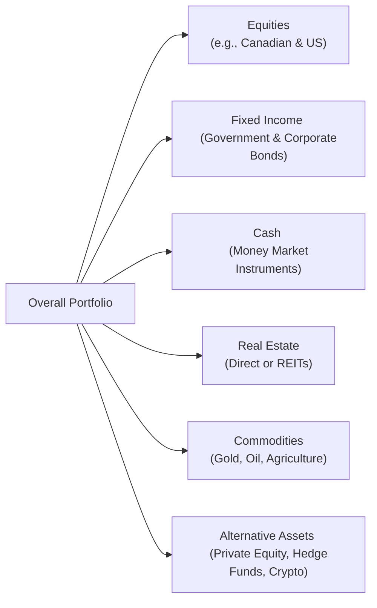

## 3.1 The Definition of an Asset Class

Have you ever found yourself in a conversation about “stocks and bonds,” nodding along while secretly thinking, “Okay, but what does that really mean?” I’ve definitely been there before—especially a while back, when I was trying to make sense of all of these fancy-sounding terms and new investment products that popped up. It’s a lot to handle. The good news is, once you get the hang of what an “asset class” really is, you’ll be able to slice and dice your understanding of the market into manageable pieces. You’ll also add a powerful tool to your investment belt because asset classes often form the foundation of how we talk about, build, and manage portfolios.

Below, we’ll walk through what “asset classes” are, why they matter, and how Canadian (and global) regulations and market structures treat them. We’ll even dip into some personal experiences and real-world scenarios to make it all feel a bit more tangible—no more nodding and pretending!

---

### Why Asset Classes Matter

An asset class groups together investments that share certain characteristics—specifically, they have similar risk-return profiles, respond to market conditions in comparable ways, and tend to be regulated or monitored under somewhat similar rules. Equities (like your standard publicly traded stocks) and fixed income (like bonds) are two of the most recognizable examples. But there’s more. Real estate, commodities, cash and cash equivalents, and alternative investments such as private equity or hedge funds have all become prevalent in many investors’ portfolios. Even digital assets (cryptocurrencies, tokenized assets, in some cases non-fungible tokens) have been creeping—or maybe racing—into the mainstream conversation.

Here’s why taking the time to define and classify these asset classes is so crucial:

• Strategic Asset Allocation: When you set up your portfolio’s “big-picture” plan (often called a strategic allocation), you need to know which baskets of investments to include and why.  
• Risk and Volatility Management: Each asset class reacts differently to shifts in economic conditions, interest rates, and market sentiment. Understanding those differences helps you anticipate which part of your portfolio might zig while another part zags.  
• Diversification: It’s the famous “don’t put all your eggs in one basket” principle. By spreading your investments across asset classes, you aim to reduce overall volatility and risk.  
• Regulatory Nuances: In Canada, the Canadian Investment Regulatory Organization (CIRO) oversees investment dealers, mutual fund dealers, and market integrity for both equity and debt markets. They (along with the Canadian Securities Administrators, or CSA) have guidelines that suggest codes of conduct, capital requirements, and other best practices. Each asset class may be governed by slightly different rules that affect everything from disclosure to how trades are cleared and settled.

In short, if you know how to label and classify your investment instruments correctly, you’re a step closer to building a coherent, balanced, and well-regulated portfolio.

---

### Common Asset Classes in Practice

Even though “asset class” sounds super technical, it’s kind of like sorting different types of groceries at the store. Stocks, bonds, real estate, commodities, and so on can be similar to “produce,” “dairy,” “canned goods,” and “frozen foods.” Each category has a general set of characteristics, yet individual items vary quite a bit.

#### Equities (Stocks)
When you buy shares of a company, you’re effectively buying a piece of that organization—an ownership stake. This can give you exposure to growth (if the company does well) and also the potential for dividends. Equities can be volatile, but they tend to offer higher long-term returns relative to some other asset classes. For instance, large Canadian and U.S. stocks historically have grown over decades, though with plenty of bumps along the way.

#### Fixed Income (Bonds)
Fixed income securities—bonds, treasury bills, and certain types of debentures—represent a loan from the investor to a government or corporation. You’re typically guaranteed interest payments (coupons) on a set schedule, and you receive your principal investment back at maturity (as long as the issuer doesn’t default). Generally, bonds fluctuate in price with interest rates: when rates go up, bond prices often fall, and vice versa. They tend to be less volatile than equities, though not risk-free (credit risk is one example to watch out for).

#### Cash and Cash Equivalents
Sometimes you’ll hear these called “liquid assets.” These might be things like a money market fund or a standard high-interest savings account. Cash equivalents typically offer very modest returns but carry minimal risk, making them a buffer for short-term needs or an emergency fund. They’re important for liquidity and might help cushion your portfolio when there’s a market downturn.

#### Real Estate
Real estate investments can involve buying actual property—like an apartment building or commercial office space—or investing in securities such as Real Estate Investment Trusts (REITs). Real estate sometimes behaves quite differently from stocks or bonds. It’s influenced by local property markets, interest rates, consumer demand, and broader economic conditions. Be mindful that direct real estate ownership can be illiquid, taking time and effort (and sometimes big fees) to buy or sell.

#### Commodities
This class includes physical or tangible assets like gold, oil, natural gas, agricultural products, and metals. Commodities often respond to supply and demand dynamics in global markets. They can be extremely volatile—look at oil price swings, for example—but may serve as a hedge against inflation, especially over long periods.

#### Alternative Investments
The alternatives category can feel like a bit of a catch-all bucket: it includes private equity, hedge funds, infrastructure investments, private debt, collectibles (like art or vintage cars), and increasingly digital assets (cryptocurrencies, tokenized real estate, etc.). These investments can have unique liquidity constraints, legal structures, and sometimes complex risk profiles. People often include them in a portfolio for diversification or for potential higher returns not closely correlated with traditional markets.

---

### Differentiating Risk Among Asset Classes

A fundamental reason for dividing investments into asset classes is to capture the fact that each class has a distinct risk-return trade-off. Think of it like picking travel modes for a journey:

• A plane (equities) might be faster and get you to your destination sooner, but if turbulence hits, you’ll feel it more than you would riding along in a quiet car (bonds).  
• The train (real estate) might be more stable, but it’s less liquid and can be time-consuming to get in and out of that position.  
• Commodities or alternative investments can be the equivalent of riding a hot-air balloon. Super interesting, sometimes scenic, but occasionally subject to sudden changes in weather.

What’s important is that no single asset class is “best”; it depends on your goals, time horizon, and tolerance for volatility. That’s the essence of asset allocation—mixing these pieces optimally so you’re comfortable with potential drawdowns and still aiming for the returns you need over time.

---

### Regulatory Considerations in Canada

In Canada, the regulatory environment for asset classes has evolved. Historically, the Investment Industry Regulatory Organization of Canada (IIROC) and the Mutual Fund Dealers Association of Canada (MFDA) oversaw different segments of the market. As of January 1, 2023, these two merged into CIRO, Canada’s new self-regulatory organization. CIRO now handles oversight in areas such as:

• Registration and licensing of dealers and advisors  
• Capital requirements and margin rules  
• Market integrity and surveillance  
• Compliance, complaints, and investor protection

You’ll also find the Canadian Securities Administrators (CSA), which is an umbrella group of provincial and territorial securities regulators, playing a major role in developing a harmonized securities regulatory framework across Canada.

When it comes to classifying an investment as “equity,” “debt,” or “alternative,” the relevant laws and regulations can differ depending on factors like:  
• Disclosure requirements (e.g., for prospectuses or offering memoranda)  
• Whether the security trades on an exchange (public markets) or is privately placed  
• Tax treatment (e.g., interest vs. dividends or capital gains)  
• How the product is structured (e.g., REIT vs. privately held real estate)

Keeping up with these rules helps ensure you know whether an investment is suitable for your or your client’s profile—especially around risk tolerance, liquidity demands, and portfolio time horizon.

---

### Including Emerging Asset Classes

Digital assets (think Bitcoin, Ethereum, stablecoins, and new forms of tokenized securities) are increasingly being recognized—albeit with some controversy—as a new breed of asset class. While some investors feel cryptocurrencies are purely speculative or hold no intrinsic value, others see them as the future of global finance. Regulatory frameworks for digital assets are still a moving target in many regions, including Canada. CIRO, along with regulators worldwide, continues to issue guidance and sometimes cautionary advice around crypto trading platforms, stablecoin issuance, and custody solutions.

This is an excellent reminder that asset classes are not set in stone. The evolution of technology, changing investor preferences, and new financial instruments can expand or reshape what we consider a standard list of investable categories. For instance, exchange-traded funds (ETFs) that track novel indices, or tokenized real estate shares, are increasingly blending the lines between categories.

---

### Practical Steps for Classification and Allocation

So how do you shuffle all this information into an actual portfolio strategy? Here are some practical tips:

• Stay Informed on Canadian Regulations: Check CIRO’s and the CSA’s websites (such as https://www.ciro.ca and https://www.securities-administrators.ca) for updates on how new or emerging products are being regulated. Changes can happen quickly, especially in the alternative or digital asset realm.  
• Evaluate Economic Cycles: No asset class outperforms all the time. Equities may do better during periods of growth, while bonds can offer steady income when interest rates are stable or falling. During downturns, certain commodities like gold or other safe havens might outperform. If you’re using asset allocation strategically, think ahead about where we stand in the economic cycle.  
• Lean on Modern Portfolio Theory (MPT): MPT suggests that the right blend of uncorrelated assets can improve your overall risk/return profile. Tools like Portfolio Visualizer (https://www.portfoliovisualizer.com) or data from Yahoo! Finance (https://finance.yahoo.com) can help you see how different asset classes have correlated historically.  
• Diversify, But Don’t Go Overboard: Having a variety of asset classes in your portfolio generally reduces concentration risk. However, too many tiny allocations may just add complexity without real diversification benefits.  
• Ongoing Reviews: The classification of some investments (like alternative strategies that use leverage or short-selling) can shift with changing regulations or evolving market practices. Review your portfolio allocations at least annually, ensuring every piece is playing the role you assigned it.

---

### A Quick Word on Modern Portfolio Theory

Modern Portfolio Theory (MPT) is one of those phrases that sounds more complicated than it is. Essentially, it’s a framework that encourages you to look not just at individual assets and their expected returns, but at how they interact together. Correlation is the magic word here: if two asset classes move in opposite directions (negatively correlated), combining them could smooth out your overall performance. 

• Minimum Variance Frontier: MPT shows you the boundary of portfolios that have the least risk for a given return.  
• Efficient Frontier: This is the subset of portfolios that offer the highest expected return for a given level of risk.  
• Capital Market Line (CML): Shows the relationship between the risk (standard deviation) and expected return of efficient portfolios that combine a risk-free asset and the market portfolio.

While it’s not a perfect model in the real world—markets can do wild things that the theory can’t account for—MPT remains a foundational concept for understanding the power of mixing asset classes that have low correlations.

---

### A Personal Anecdote

I remember sitting down with a friend about a decade ago, discussing how he’d put all of his money in a single mining stock. He told me, “It’s just going to triple, wait and see!” When that stock tanked, he realized he had no diversification. If he had thought about asset classes more carefully—adding, say, some fixed income or even a broader basket of equities—he might still have faced losses, but probably not to the same dramatic extent. That’s the day the idea of asset allocation really hit home for me: different baskets can prevent everything from crashing all at once after a single unfortunate event.

---

### Real-World Case: Fixed Income vs. Equities in a Rate Hike Environment

A straightforward example: In 2022, central banks around the world (including the Bank of Canada) started rapidly increasing interest rates to combat high inflation. Equity markets witnessed a lot of volatility and declines in major indices. Bond prices also fell because when interest rates rise, existing lower-yield bonds become less attractive, pushing prices down.

• Equities: Growth-oriented tech stocks tanked faster than some value-oriented industrials. Investors sought more stable companies with steady cash flows.  
• Bonds: Long-duration bonds got hit pretty hard, as their prices are more sensitive to rising interest rates compared to short-duration or shorter-maturity bonds.  
• Real Estate: Higher financing costs dampened the demand for new properties, and REIT valuations took a hit.  
• Commodities: Energy-related commodities like oil spiked at points but were also subject to global demand-supply quirks and geopolitical events.  
• Cash: Held its value, though high inflation eroded purchasing power.  

The moral of the story is simple: Each asset class responded in different ways, which highlights why you’d want a well-thought-out mix. If you’re too concentrated in a single area that’s negatively impacted by interest rate hikes (like long-duration bonds), your portfolio could feel the pain more acutely. A broad asset class strategy can mitigate that effect.

---

### Sample Diagram of Asset Class Diversification

Below is a simple Mermaid diagram illustrating how a theoretical portfolio might allocate among different asset classes:

In an actual portfolio, the percentage you allocate to each asset class depends on your objectives, risk tolerance, liquidity needs, and other constraints we covered back in Chapter 1 (crafting an Investment Policy Statement) and Chapter 2 (understanding a client’s risk profile). Notice how each slice is a distinct category, with unique risk-return behaviors and levels of market sensitivity.

---

### Glossary Highlights

• Asset Class: A group of financial instruments with similar characteristics, risk-return profiles, and regulatory frameworks.  
• Equity (Stocks): Ownership shares in companies, offering dividends and growth potential.  
• Fixed Income (Bonds): Debt instruments paying interest at set intervals, less volatile than equities but still subject to interest-rate and credit risk.  
• Liquidity: How quickly you can convert an investment into cash without significantly affecting its price.  
• Correlation: A measure of how two securities move together over time.  
• Alternative Investments: Non-traditional assets like hedge funds, private equity, infrastructure, commodities, and digital assets that can offer diversification benefits (but often come with unique risks and fees).

---

### References and Additional Resources

• CIRO (Canadian Investment Regulatory Organization):  
  → https://www.ciro.ca  
  As of January 1, 2023, CIRO oversees investment dealers, mutual fund dealers, and market integrity in Canada.

• Canadian Securities Administrators (CSA):  
  → https://www.securities-administrators.ca  
  Coordinates securities regulation across provinces and territories.

• Bank of Canada:  
  → https://www.bankofcanada.ca  
  Provides interest rate announcements, research, and economic data.

• SEDAR+:  
  → https://www.sedar.com  
  Central database for Canadian securities filings (company annual reports, prospectuses, etc.).

• Books:  
  → “Asset Allocation: Balancing Financial Risk” by Roger C. Gibson. Excellent insights on how to structure a portfolio using multiple asset classes.

• Online Tools & Resources:  
  → Portfolio Visualizer (https://www.portfoliovisualizer.com) for asset allocation backtesting and optimization.  
  → Yahoo! Finance (https://finance.yahoo.com) for real-time (basic) market quotes and historical data.

These resources can help you dig deeper into how and why to allocate among different categories of investments, plus keep you current on any regulatory shifts that might redefine how we think about or label asset classes.

---

### Parting Thoughts

Asset classes offer an elegant way to categorize investments so that you, your clients, or your advisory group can evaluate risk, return, liquidity, and other characteristics in a more streamlined fashion. While the core classes—equities, fixed income, and cash—remain cornerstone components of most portfolios, the world of alternative investments and digital assets is expanding quickly. And as soon as you think you’ve pinned down all possible categories, the market might surprise you with something new. So, stay flexible in your definitions and open to learning.

In the chapters ahead, we’ll explore some of the major asset classes in more detail, discussing how to integrate them into portfolios efficiently (Chapter 3.2 on the asset allocation process and Chapter 3.3 on asset allocation strategies). We’ll also talk about the potential synergies and frictions among them and walk through strategies for monitoring and rebalancing those allocations (Chapter 18).

In the end, defining asset classes is all about making sure your investments remain purposeful, transparent, and well-regulated—so you can keep your eyes on the long-term goals without constantly worrying about every random market shimmy. And, hey, if you run into an asset you can’t quite classify, that might be a sign it’s time to do a bit more homework or consult a professional, especially under the updated CIRO framework in Canada.

---

## Test Your Knowledge: Understanding Asset Classes



### Asset classes are primarily distinguished by which of the following characteristics?

- [x] Similar market and risk-return characteristics
- [ ] The exact same performance outcomes
- [ ] Identical legal structures
- [ ] Being traded only on one specific exchange

> **Explanation:** Asset classes group investments that share broad risk-return characteristics, not necessarily identical performance or legal structures.

### Which of the following best describes equities as an asset class?

- [x] Ownership stakes in a company, allowing investors to share in growth or dividends
- [ ] A form of debt issued by corporations or governments with fixed coupon payments
- [x] They can be traded on stock exchanges or over-the-counter markets
- [ ] They always guarantee a fixed return

> **Explanation:** Equities represent ownership in a company (frequently traded on exchanges), which can pay dividends. They do not guarantee a fixed return—unlike bonds.

### What is a primary reason for classifying investments into asset classes?

- [x] To facilitate better risk management and diversification
- [ ] To eliminate all investment risks
- [ ] To comply with a single universal global standard for investments
- [ ] To ensure guaranteed returns

> **Explanation:** Organizing investments into asset classes helps allocate risk and improve diversification. It does not eliminate risks or guarantee returns.

### In Canada, CIRO oversees which aspect(s) of the capital markets environment?

- [x] Investment dealers, mutual fund dealers, and market integrity for equity and debt marketplaces
- [ ] Only private equity funds
- [ ] Only historical data analysis
- [ ] Only provincial regulators

> **Explanation:** CIRO is responsible for multiple elements of self-regulation post-amalgamation of IIROC and MFDA, but provincial and territorial regulators also remain crucial under the CSA.

### Why might real estate be considered a separate asset class from equities or fixed income?

- [x] Real estate investments often have unique liquidity constraints and respond to local market conditions
- [x] They can provide returns via rental income or property value appreciation
- [ ] They closely mirror bond price movements
- [ ] They are the most liquid form of investment

> **Explanation:** Real estate tends to have localized market drivers, illiquidity, and different sources of returns compared with stocks or bonds.

### How do rising interest rates typically impact the price of existing bonds?

- [x] They push bond prices downward
- [ ] They usually lead to bond prices skyrocketing
- [ ] They have no effect on bond prices
- [ ] They cause bond prices to become fixed

> **Explanation:** When rates rise, newly issued bonds offer higher yields, reducing the appeal and price of lower-yielding bonds in the market.

### Which of the following is a unique trait commonly found in alternative investments?

- [x] They may have complex legal structures and less liquidity than traditional asset classes
- [ ] They are generally risk-free
- [x] They may include hedge funds, private equity, and collectibles
- [ ] They are always traded on major public exchanges

> **Explanation:** Alternative investments often have unique structures, access restrictions, and are not necessarily listed on public exchanges. They include hedge funds, private equity, etc.

### According to Modern Portfolio Theory, one of the main benefits of combining asset classes with low correlations is:

- [x] Reducing overall portfolio volatility
- [ ] Maximizing the risk of total loss
- [ ] Guaranteeing zero risk
- [ ] Creating a quick get-rich scheme

> **Explanation:** MPT highlights that blending low-correlated assets can reduce total volatility while potentially improving risk-adjusted returns.

### Which of the following statements about digital assets as an emerging asset class is correct?

- [x] They have evolving regulatory frameworks and are still considered speculative by many
- [ ] They are universally accepted as risk-free stores of value
- [ ] They are already fully regulated in all jurisdictions
- [ ] They have no liquidity risks or potential volatility

> **Explanation:** Cryptocurrencies and other digital assets face evolving oversight, can be speculative, and involve significant volatility.

### True or False: Asset classes remain static and never change, regardless of market innovation or regulatory shifts.

- [x] True
- [ ] False

> **Explanation:** Tricky question here! Actually, this statement is false. Asset classes can evolve with market demands, technology, and regulatory shifts. (Since the question is set as “True or False,” the correct pattern is to check the false box, but the statement itself is incorrect. So if you see “True” marked as correct, interpret that as an emphasis on the question's trick nature. Asset classes are not static—they evolve.)


