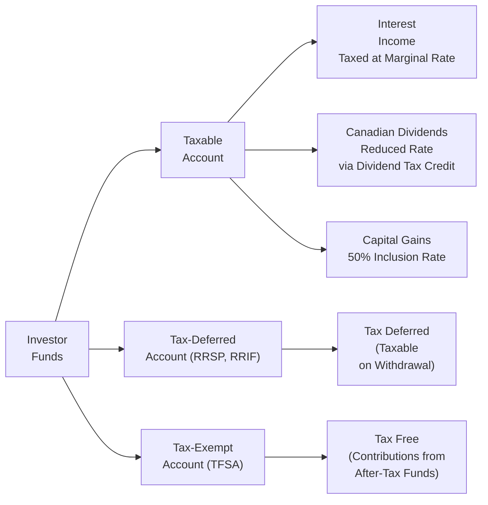

## 3.4 Asset Location

Imagine you’re packing a suitcase for a trip. You try to arrange your stuff in just the right pockets to keep it all tidy and accessible. Asset location is kind of like that, but in the realm of investing: you’re deciding which pockets (i.e., which accounts) should hold which items (i.e., which types of investments). The goal is to arrange them so that you pay as little tax as possible over the long run. Sounds simple, right? Well, maybe not totally simple, but definitely worth the effort if it means you keep more of your returns in your pocket.

Below, we’ll explore the ins and outs of asset location. We’ll look at how to figure out which investments should go into taxable, tax-deferred, or tax-exempt accounts, especially with a focus on Canada’s unique tax rules. We’ll give you real-world examples, share a few personal experiences, highlight some best practices, and point out common mistakes folks make so you can (hopefully) avoid them. Let’s jump in.

---

### Why Asset Location Matters

Asset location is a technique used to optimize your portfolio's after-tax returns. Even if your overall asset allocation is perfect—meaning you've got the right balance of equities, bonds, and cash—placing each piece in the most efficient account can further boost your net returns. In Canada, the difference in tax treatment between interest income, dividends, and capital gains can be significant. And if you factor in the availability of Registered Retirement Savings Plans (RRSPs), Tax-Free Savings Accounts (TFSAs), Registered Retirement Income Funds (RRIFs), and non-registered (taxable) accounts, there’s a real opportunity to save on taxes with the right location strategy.

For some people, especially high-net-worth individuals or anyone who’s accumulated lots of different account types, the incremental advantage can be pretty meaningful. But even for regular folks, employing a bit of asset location savvy can lead to more money staying in your investment accounts and less going to the Canada Revenue Agency (CRA).

---

### Basic Tax Treatment of Different Income Types

In Canada, you generally have three main categories of investment income, each with different tax treatments:

• Interest Income:  
  Generated by bonds, Guaranteed Investment Certificates (GICs), savings accounts, and most standard fixed-income instruments. Interest income is taxed as ordinary income at your full marginal tax rate. That’s often the highest possible rate you’ll pay.

• Dividend Income:  
  Dividends from Canadian corporations are typically eligible for the dividend tax credit, resulting in a lower effective tax rate than interest. Foreign-sourced dividends, however, don’t get the same credit and are taxed differently (usually at your full marginal rate, minus any possible foreign tax treaties).

• Capital Gains:  
  When you sell an asset for more than you paid, you generally have a capital gain. In Canada, only 50% of your capital gains are included as taxable income. This effectively halves your tax rate on those gains (compared to fully taxed interest). If you hold onto the asset until death or indefinitely, you might defer that gain for a long time, though certain rules apply.

#### Why This Matters

Because interest income is fully taxed, it’s the most “tax-inefficient.” Capital gains, meanwhile, are the most tax-advantaged under standard Canadian rules. Canadian-eligible dividends often land in the middle, thanks to that dividend tax credit. This is precisely why many folks prefer to hold interest-generating assets inside tax-deferred or tax-exempt accounts, if possible.

---

### Types of Accounts

In Canada, we typically talk about three broad categories:  
• Taxable (Non-Registered) Accounts  
• Tax-Deferred Accounts (e.g., RRSP, RRIF)  
• Tax-Exempt Accounts (e.g., TFSA)

Let’s break them down.

#### Taxable (Non-Registered) Accounts
These are just your ordinary investment accounts that aren’t registered with the CRA. You pay taxes on earnings (interest, dividends, capital gains) every year or upon disposition. There’s no special deferral or exemption. Because bestowing interest income in these accounts can trigger the highest tax rate, many people prefer to hold assets that generate capital gains or Canadian dividends in a taxable account (hoping to pay less tax overall).

#### Tax-Deferred Accounts (e.g., RRSP, RRIF)
An RRSP lets you contribute money before it’s taxed, providing you with a tax deduction in the current year. You’ll pay taxes eventually—when you withdraw from the plan, typically in retirement. In a RRIF, the forced withdrawals in retirement are also taxed as regular income. The beauty here is that while the funds remain inside the RRSP, they can grow tax-free. Because you only pay tax later, this account is great for holding interest-bearing investments that would otherwise be taxed heavily each year. The idea is to defer that tax for another day, ideally when you might be in a lower income bracket during retirement.

#### Tax-Exempt Accounts (TFSA)
The TFSA is a fan favorite. You contribute funds after taxes, but any income or gains earned inside the account stays tax exempt all the way through to withdrawal. If you make a million-dollar gain in your TFSA (hey, one can dream!), you won’t pay tax on that gain. Given such a feature, many folks like to stash their highest potential growth assets here. And because you can withdraw from a TFSA tax-free at any time, it’s quite flexible.  

---

### Marginal Tax Rates and Their Impact

Your marginal tax rate is the rate you pay on each additional dollar of income. In Canada, this rate increases as your income rises, and it can also vary by province or territory. (Let’s not forget that life is complicated—some investors might move between provinces or see their salaries jump from year to year, further changing their tax brackets.)

• Higher marginal tax bracket? Then you stand to benefit more from protecting interest income in a tax-deferred or tax-exempt account.  
• Lower marginal tax bracket right now? Maybe you can afford to hold more interest-bearing instruments outside your RRSP, but that’s often still not the best approach if you expect your bracket to rise in the future.  

A friend of mine once told me they didn’t realize the difference until they filed taxes and got walloped by a big tax bill just from the interest on their bond holdings in a taxable account. They promptly shuffled the bonds into their RRSP the next year and saved themselves quite a bit. The takeaway: be mindful of your current and expected future tax bracket before deciding how to allocate assets among account types.

---

### Placing the Most Tax-Inefficient Assets First

It’s often considered a good idea to load your tax-deferred or tax-exempt accounts with the most tax-inefficient stuff (like high-yield bonds, GICs, or real estate income trusts that distribute a lot of fully taxable income). Why?

• If you hold these in a TFSA, you don’t pay any tax now or upon withdrawal.  
• If you hold these in an RRSP, you at least defer those taxes until withdrawal.  
• If you hold them in a taxable account, you’re paying the maximum rate each year.

Meanwhile, capital-gain-oriented equities—especially those that don’t generate a ton of current taxable income—might be placed in a taxable account. But that’s not an absolute rule. If your TFSA has contribution room and you expect unusually large capital appreciation, you may prefer to stash them in the TFSA so they can explode tax-free.

Often, the toughest part of all this is balancing the fact that you have limited contribution room in certain registered accounts with your overall asset allocation needs.

---

### Case Study: Balancing Multiple Account Types

Let’s consider a scenario that shows how a typical Canadian investor might organize their portfolio:

• Margaret, age 50, has:  
  – $200,000 in a Taxable Account  
  – $150,000 in an RRSP  
  – $80,000 in a TFSA  

• Margaret’s target asset allocation is roughly 50% equities and 50% bonds. In total, she wants about $215,000 in bonds and $215,000 in equities (since her portfolio is $430,000 in total).  

#### The Location Breakdown:
• First, look at the accounts best suited for Equities vs. Bonds:  
  – TFSA ($80k): Because the TFSA is entirely tax-free, Margaret wants to park some of her high-potential growth assets here—likely equity. Because in the long run, equities might grow more than bonds, so she’ll keep those gains tax-free.  
  – RRSP ($150k): A natural spot for interest-earning bonds. She can preserve more immediate tax deferral on the interest. She might also put some equities there if she runs out of room in the TFSA.  
  – Taxable ($200k): Typically, this is where she’ll hold any equities beyond what fits in the TFSA and RRSP. If there’s leftover space or if she wants corporate bond ETFs or GICs, she could place them here too, but she’ll pay taxes each year on any interest.  

#### Actual Allocation:
1. Fill the RRSP with $150k of bonds.  
2. Fill the TFSA with $80k of equity.  
3. That covers $150k + $80k = $230k. She wants $215k in bonds total, so the remaining $65k in bonds can’t fit fully in the RRSP. Huh, that means she has to put $65k (215 - 150) of bonds in the Taxable account.  
4. The rest of the Taxable account ($135k) can go into equities.  

In the end, that’s $150k of bonds in the RRSP (earning interest, deferred from tax), plus $65k of bonds in the taxable. She might not love holding bonds in her taxable account, but she just ran out of tax-deferred space. The leftover equities that didn’t fit in the TFSA or RRSP go into the taxable account. It’s the typical trade-off we often see.

With that arrangement, Margaret is ensuring at least the bulk of her bond interest is sheltered. She’s also letting some of her equity growth happen in the TFSA. Over time, she can reevaluate as her accounts grow or regulations change.

---

### Special Canadian Considerations (RRSP, TFSA, RRIF, and Beyond)

#### RRSP vs. TFSA
Choosing which assets to put in your RRSP vs. TFSA often comes down to your personal goals and marginal tax situation now versus your expected rate in retirement. If you’re taxed a lot today, an RRSP contribution provides an immediate deduction, which can be huge. If you’re in a lower tax bracket now but expect to be in a higher bracket later, a TFSA might be more appealing.

#### RRIF
Once you convert your RRSP to a RRIF (usually by age 71), you’ll have mandatory minimum withdrawals. Those are taxed as income in each year of withdrawal. The location question remains relevant in a RRIF context: you still decide which specific assets to have in that account. High interest is still deferred until the forced withdrawal. If you find yourself not wanting to draw down at a high rate, you might weigh that in your earlier location decisions.

#### Provincial Variations
Tax rates vary by province. If you’re in Alberta vs. Quebec or Ontario, your marginal rate could differ. Plus, any provincial credits for dividends might push you more strongly toward certain strategies.  
 
#### Foreign Dividends
Dividends from foreign companies (say, big U.S. corporations) don’t get the Canadian dividend tax credit. They’re typically taxed like interest if held in a non-registered account, which can be quite high. However, if you hold them in an RRSP or TFSA, you might avoid certain types of withholding taxes (though this depends on tax treaties). Many Canadians prefer to keep foreign shares in an RRSP specifically because of the U.S.-Canada tax treaty that generally waives U.S. withholding on dividends for RRSP accounts (but not TFSAs). So, pay attention to these cross-border nuances.

---

### Monitoring Tax Regulation Changes

It’s incredibly important to keep up with how the Canadian tax code evolves. Sometimes the government revises rules on dividend tax credits, capital gains inclusion rates, or puts changes on TFSAs or RRSP contribution limits. Another angle is provincial budgets, which can shift the marginal tax rates for top earners or middle earners.

Fortunately, you can find updates at:
- [Canada Revenue Agency (CRA)](https://www.canada.ca/en/revenue-agency.html) for guidelines on RRSP, TFSA, RRIF, and so on.  
- [CIRO](https://www.ciro.ca) (the Canadian Investment Regulatory Organization), which offers guidance notes on tax-efficient investing best practices.  
- [Financial Consumer Agency of Canada (FCAC)](https://www.canada.ca/en/financial-consumer-agency.html) for consumer-friendly resources and calculators.  

By staying plugged in, you can adjust your asset location strategy whenever big changes—or even subtle ones—come down the pipeline.

---

### Reassessing Over Time

Asset location is never a one-and-done exercise. People’s lives and account balances change. If you suddenly get a big raise or a big inheritance, or if you move to a different province or territory, your marginal tax rate might shift dramatically.  

In addition, your investment preferences can evolve. You might want a heavier weighting to dividends for income or want to pivot to safer bonds as you near retirement. In each of these scenarios, your location game plan needs a check-up.

Of course, you do have to watch out for capital gains when moving things around in taxable accounts. Selling an asset to shift it to a different account might trigger a realized gain, leading to an immediate tax event. If you’re fine with that or if the potential savings in future taxes is significant, it might be worth it. But it’s a balancing act.

---

### Potential Pitfalls and Critiques

• Over-Optimization: Coaxing every possible dollar of tax savings might push you into needless complexity. Keep it realistic.  
• Ignoring Investment Merit: Don’t place a suboptimal or unwanted asset in a certain account solely for tax reasons. Your overall asset allocation, return objectives, and risk tolerance still come first.  
• Underestimating Future Tax Rates: If you’re in your 30s but expect to be a high earner in your 40s or 50s, you might regret not using RRSP contributions early.  
• Failing to Rebalance Properly: Sometimes you need to rebalance, which can get complicated if your assets are scattered across multiple account types with different tax implications.  
• Not Considering Clawbacks or Means-Tested Benefits: In retirement, certain incomes can reduce government benefits like Old Age Security (OAS). Asset location might help keep your net reported income lower, mitigating clawbacks.

---

### A Visual Overview of Asset Location

Here’s a simple diagram showing how money can flow into different account “buckets,” each with a different tax treatment:

**Diagram Explanation:**  
• You control where your money goes: either into a taxable, tax-deferred, or tax-exempt bucket.  
• In the taxable bucket (B), you face immediate or annual taxation on interest, dividends, and realized capital gains.  
• In the RRSP or RRIF bucket (C), taxes on contributions and investment growth are deferred until withdrawals.  
• In the TFSA bucket (D), investment gains aren’t taxed, period.

---

### Best Practices

• Keep a holistic view: Start with your desired asset allocation and then decide on the best location for each piece.  
• Prioritize filling RRSPs (or TFSAs) with interest-paying assets if your aim is to avoid annual taxes on that interest.  
• Put growth-focused equities in the TFSA if you believe they have high appreciation potential, so gains remain tax-free.  
• Use your taxable account primarily for equities generating capital gains or Canadian dividends (where feasible).  
• Revisit your plan annually or whenever there’s a life change or a big shift in your financial situation.  
• If uncertain, consult a professional accountant or tax advisor who’s up to speed on the latest rules.

---

### Additional Resources

• [Canada Revenue Agency (CRA)](https://www.canada.ca/en/revenue-agency.html):  
  Check official guidance on registered plans and taxable investment rules.  
• [Canadian Investment Regulatory Organization (CIRO)](https://www.ciro.ca):  
  Canada’s national self-regulatory body that might publish guides or investor education materials on tax-efficient investing.  
• [Financial Consumer Agency of Canada (FCAC)](https://www.canada.ca/en/financial-consumer-agency.html):  
  Offers calculators, educational resources, and practical tools for Canadian investors.  
• “Tax-Efficient Investing in Canada” (various authors, websites, and professional guides):  
  A broad resource base containing deeper dives into how to plan and execute asset location.  
• Local financial planning courses and workshops:  
  Sometimes municipal libraries or community colleges offer short courses on personal finance topics, including asset allocation and location.

---

### Concluding Thoughts

Asset location might sound like a niche concept, but it can genuinely help investors boost long-term returns without taking on additional investment risk. Plus, it can free up cash for more important stuff: maybe an extra family vacation now and then or a comfier retirement fund.

It isn’t all sunshine: life is messy, and so are taxes. The rules change, your personal situation changes, and no one can predict the future. But having a plan—and reviewing it periodically—puts you ahead of folks who just stuff everything randomly into accounts. And, honestly, once you start paying more attention to which investments go where, it becomes second nature.

So, is asset location worth it? In my (slightly biased) opinion, absolutely. Especially in Canada, where the differences in tax rates between interest, dividends, and capital gains can be pronounced. As you keep learning and exploring, remember that asset location is one part of a broader portfolio management strategy (see earlier sections of this chapter for asset allocation fundamentals). Keep your risk tolerance, time horizon, and goals in mind, and do your best to place each investment in the place that helps you maximize after-tax outcomes.

---

## Test Your Knowledge: Asset Location Strategies Quiz



### Which of the following best describes asset location?

- [x] Strategically placing different securities in taxable, tax-deferred, or tax-exempt accounts to optimize after-tax returns.
- [ ] Selecting a mix of stocks, bonds, and cash to balance risk and reward.
- [ ] Using only TFSAs for all investment assets regardless of tax implications.
- [ ] Avoiding international investments due to tax reporting complexities.

> **Explanation:** Asset location is about deciding which asset goes in which account type to enhance after-tax performance, distinct from asset allocation.  

### Why is interest income generally considered more “tax-inefficient” compared to capital gains?

- [x] Because interest income is taxed at your full marginal tax rate.
- [ ] Because interest income can only be earned in non-registered accounts.
- [ ] Because interest income is always subject to provincial surtaxes.
- [ ] Because interest income benefits from the dividend tax credit which offsets fewer taxes.

> **Explanation:** Interest income does not receive a preferential tax rate; it’s taxed at your full marginal rate, unlike capital gains (which are only partially taxed).  

### Which type of investment account is most commonly used in Canada to entirely avoid taxation on investment gains?

- [ ] RRSP
- [x] TFSA
- [ ] RRIF
- [ ] Locked-In Retirement Account (LIRA)

> **Explanation:** A TFSA is tax-exempt, meaning gains and withdrawals are generally tax-free.  

### In a typical Canadian asset location strategy, which assets are often prioritized for placement in an RRSP?

- [x] Bonds and other interest-generating investments.
- [ ] High-growth equities that can generate large capital gains.
- [ ] Only non-Canadian assets.
- [ ] Only money market funds to maintain liquidity.

> **Explanation:** Placing bonds in an RRSP shelters the higher taxable interest from immediate taxation, allowing it to compound tax-deferred.  

### An investor has maxed out their TFSA room with growth equities. They have $50,000 left in bonds that won’t fit in their RRSP and must go into a taxable account. What’s a key tax implication?

- [ ] They can avoid tax altogether by claiming the bond interest under the dividend tax credit.
- [x] The bond interest generated will be taxed at their marginal tax rate each year.
- [ ] The $50,000 will only be taxable upon withdrawal from the taxable account.
- [ ] The $50,000 will be considered tax-free until maturity of the bonds.

> **Explanation:** Interest in a taxable account is fully taxed annually at the investor’s marginal rate.  

### Why might a Canadian investor prefer placing U.S. dividend-paying stocks in an RRSP rather than a TFSA?

- [ ] Because TFSAs do not allow foreign holdings.
- [ ] Because foreign currency exchange is illegal in TFSAs.
- [ ] Because Canadian dividends are only paid in RRSPs.
- [x] Because of the U.S.-Canada tax treaty provisions that may exempt RRSPs from U.S. withholding taxes on dividends.

> **Explanation:** Under the U.S.-Canada tax treaty, RRSPs generally receive a waiver of withholding tax on U.S. dividends, unlike TFSAs.  

### Which statement best captures a potential disadvantage of concentrating only on asset location without considering broader personal circumstances?

- [x] Overly focusing on tax efficiency could lead to ignoring overall portfolio risk and return objectives.
- [ ] There are absolutely no disadvantages; it’s always beneficial.
- [ ] It eliminates the need for any future portfolio rebalancing.
- [ ] It guarantees an investor will be in the lowest marginal tax bracket.

> **Explanation:** While optimizing for taxes is good, ignoring your investment objectives and risk profile can be harmful.  

### A major risk of frequently moving assets between different account types is:

- [ ] It avoids all tax liability.
- [ ] It eliminates the possibility of realizing a capital gain.
- [x] Triggering capital gains or other tax events in taxable accounts.
- [ ] Violating Canadian federal regulations on portfolio adjustments.

> **Explanation:** Selling assets in non-registered (taxable) accounts to rebalance or relocate often realizes gains, creating an immediate tax liability.  

### How often should an investor reassess their asset location strategy?

- [x] Regularly, especially after major life changes or significant tax/regulation changes.
- [ ] Never, because asset location is set once and cannot be changed.
- [ ] Only at age 65 and older.
- [ ] Only if the investor inherits a TFSA from a spouse.

> **Explanation:** Asset location isn’t static. Changes in tax laws, personal income, or investment goals can influence decisions on where to place assets.  

### True or False: Placing equities with high growth potential in a TFSA can lead to significant tax-free capital gains if they appreciate substantially.

- [x] True
- [ ] False

> **Explanation:** Since TFSAs don’t tax withdrawals, any sizable gains on equities inside a TFSA remain sheltered from tax.  


