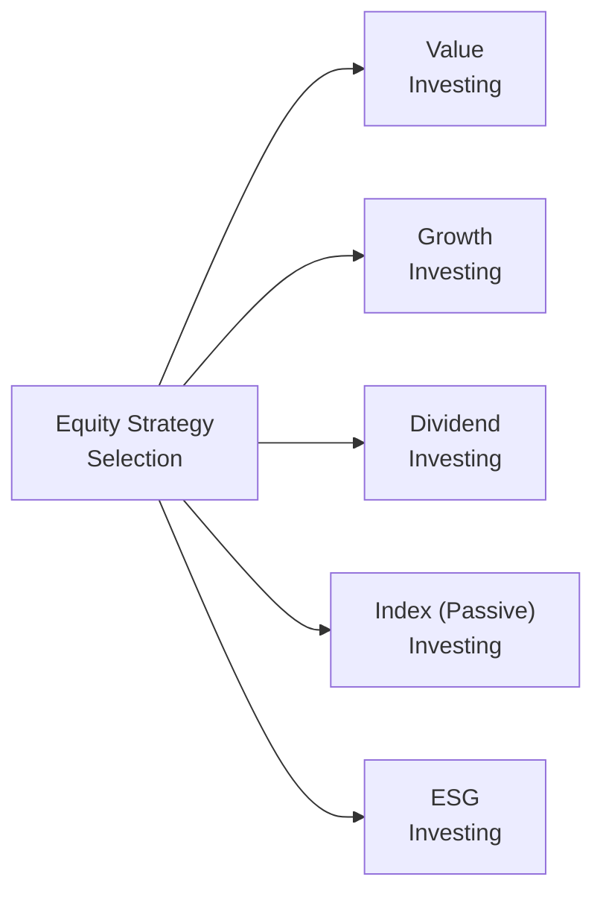

## 3.5 Equity Investment Strategies

Ever had that moment where you're chatting with a friend, and they casually mention they've made a killing in the stock market, leaving you wondering what on earth they've been doing so right? Well, it often boils down to choosing the right equity investment strategies—approaches that guide which stocks to buy, when to sell, and how to manage the risks in between. This section walks you through some of the most common strategies: Value Investing, Growth Investing, Dividend Investing, Index or Passive Investing, and Sector/Socially Responsible/ESG-Focused Investing. We’ll cover real-world examples, highlight potential pitfalls, and give you some personal anecdotes (plus a story or two of my own missteps) that just might help make these concepts a bit friendlier.

But before you dash off to buy your favorite tech stock, remember that all investment decisions in Canada must be aligned with the suitability requirements set by the Canadian Investment Regulatory Organization (CIRO). And if that name is new to you—yes, it’s the body that oversees financial advisors and their responsibilities toward clients. In short, your advisor or you (if you’re self-directed) must ensure each equity position fits your personal goals, risk tolerance, and time horizon.

Let’s dive in.

---

### Value Investing

Have you ever walked into a department store and found a high-quality jacket on the clearance rack for half its usual price? If so, you’ve basically experienced the essence of value investing. Value investing is all about seeking stocks that appear underpriced relative to their intrinsic worth. Often this means looking for companies with low price-to-earnings (P/E) ratios, low price-to-book (P/B) ratios, or some other fundamental indicator that suggests they’re undervalued.

• Common Indicators:  
  – P/E ratio lower than the market average.  
  – P/B ratio that’s below industry peers.  
  – Companies with strong balance sheets but lagging share prices.

• Rationale: Value investors believe the market frequently misprices securities, and over time, a correction occurs (i.e., the stock’s price goes up to better reflect what the company is really worth).

• Potential Risks: Value stocks can be disappointments. Some are “value traps,” meaning they look cheap but are in decline for legitimate reasons, such as outdated product lines or unsustainable debt.

• Anecdote: I once bought shares in a small Canadian telecom I believed was “too cheap to miss.” Turned out it was cheap for a reason. Sales were drying up, competition was fierce, and that gem of an opportunity ended up costing me more than it was worth. So watch out for those traps!

---

### Growth Investing

Growth investing is like cheering for a young athlete with tremendous potential. You’re betting that this up-and-coming star will blossom into a champion. For growth investors, the focus is on companies that are expanding rapidly—whether through increasing sales, skyrocketing earnings, or continuous product innovation.

• Common Indicators:  
  – Above-average revenue and earnings growth.  
  – High reinvestment of profits (growth companies often pay minimal or no dividends).  
  – Businesses with disruptive or innovative product lines that might capture new markets.

• Rationale: Growth companies can provide substantial capital gains if you buy in before the rest of the world notices their full potential. Classic examples include early investments in technology darlings that eventually became household names.

• Potential Risks: Because investors pay a premium for the promise of robust growth, share prices can be significantly inflated. Any hiccup in expected earnings or outlook, and these stocks can take a big plunge.

• Anecdote: I got into a cloud computing company right at the start of its explosive growth—there were nights I literally couldn’t sleep because the stock’s movements were so dramatic. I had to remind myself that long-term success in growth investing is about staying focused on fundamentals, not day-to-day price swings.

---

### Dividend Investing

Dividend investing is a bit like owning rental properties where you collect monthly rents. Except instead of tenants, you have companies paying you a portion of their profits on a regular basis. Investors who adopt this strategy gravitate toward firms paying consistent dividends, often with a history of raising those payouts over time.

• Common Indicators:  
  – Dividend yield (annual dividend per share / current share price).  
  – Dividend growth rate (how fast dividends have increased historically).  
  – Payout ratio (the fraction of net income paid as dividends).

• Rationale: Dividend stocks can provide a stream of income, which can be appealing for retirees, or anyone who needs periodic cash flow. On top of that, many dividend-paying firms are stable, established businesses.

• Potential Risks: Don’t assume dividends are guaranteed. Companies can cut or suspend dividends during tough times. Also, some high-yield stocks may be issuing large payments because their share price has collapsed, hinting at deeper issues.

• Anecdote: My uncle lived off his dividends for years—until one of his core utilities stocks halved its dividend out of the blue. That moment taught me always to check dividend coverage (i.e., can the company realistically afford the dividend?).

---

### Index or Passive Investing

If you’re tired of sifting through financial statements and analyzing chart patterns, index (or passive) investing might be your ticket to simpler investing. By purchasing an exchange-traded fund (ETF) or mutual fund that tracks a broad equity index (like the S&P/TSX Composite Index), you get exposure to a diversified basket of stocks, typically at a modest Management Expense Ratio (MER).

• Common Indicators:  
  – Low fees.  
  – Broad market coverage.  
  – Benchmark returns (your performance should closely match the tracked index).

• Rationale: Studies often show that many active fund managers underperform the market in the long run, especially after fees. Passive investing aims to “be the market” rather than beat it—unburdening you from constant buy/sell decisions.

• Potential Risks: You’ll never outperform the market by definition, which can be frustrating when certain hot sectors skyrocket. Also, if the entire market goes down, your portfolio does too.

• Anecdote: A friend of mine felt left out when our group chat was buzzing about making quick gains in certain technology stocks. He held an S&P/TSX Composite ETF, which felt downright boring. But when the tech bubble burst, guess who fared better overall?

---

### Sector, Socially Responsible, and ESG-Focused Investing

Sector-based investing zeroes in on specific industries—like technology, healthcare, or financial services. ESG (Environment, Social, Governance) investing, meanwhile, focuses on companies that meet certain sustainability or ethical criteria. Socially Responsible Investing (SRI) is similar, but typically screens out “sin” industries such as tobacco, gambling, or coal.

• Common Indicators:  
  – Sector or ESG-related metrics (e.g., carbon intensity, board diversity, employee well-being policies).  
  – Socially responsible or thematic indexes (e.g., MSCI World ESG Leaders Index).  
  – Performance relative to broader market (sectors can be cyclical).

• Rationale: Some investors see moral or ethical responsibilities in how they allocate capital. Others believe ESG-friendly companies may have better long-term risk management and thus outperform in the future.

• Potential Risks: Concentration risk if you lock into a specific sector. Also, while ESG claims are increasingly standardized, be mindful of “greenwashing,” where companies present themselves as more sustainable than they really are.

• Anecdote: I loved the idea of investing in renewable energy companies—no fossil fuels, no guilt. Then I realized many “clean energy” firms had valuations through the roof, driven by hype. So it took some extra scrutiny to pick the right ones without overpaying.

---

### Risk-Return Dynamics

Now, you might ask: “If growth investing can deliver monstrous returns, why bother with anything else?” The short answer: risk. Let’s break down the typical risk-return profiles for each strategy:

• Growth Stocks:  
  – High potential returns, especially in bull markets.  
  – More volatility, so big drawdowns can happen.  
  – Not all companies scale successfully; some can fizzle out.

• Value Stocks:  
  – Potential margin of safety if bought below intrinsic value.  
  – May lag when high-growth sectors dominate.  
  – Risk if the “cheapness” is permanent (the market was right after all).

• Dividend Stocks:  
  – Provides ongoing income, somewhat reducing reliance on market gains.  
  – Shares can still be volatile, and dividends aren’t always guaranteed.  
  – Over-concentration in a few big dividend payers can be risky.

• Index/Passive:  
  – Broad diversification, lower fees.  
  – Market returns (not beating the market).  
  – Reduced stress since there’s less analysis required.

• Sector/ESG:  
  – Aligns investments with personal beliefs or convictions about which sectors will thrive.  
  – Sector-specific or ESG factors can lead to higher concentration risk or overvaluation.  
  – Potentially strong returns if the sector or ESG theme is in favor, or if it truly mitigates certain long-term risks.

---

### Analysis Tools

Selecting the right strategy usually relies on several forms of analysis.

• Fundamental Analysis:  
  – Investors examine financial statements (income statement, balance sheet, cash flow).  
  – Consider economic conditions, industry-specific trends, and company-level catalysts.  
  – Helps estimate intrinsic value.

• Quantitative/Factor Models (Smart Beta):  
  – Using algorithms or factor screens to identify stocks with attributes like “value,” “momentum,” or “low volatility.”  
  – The approach is systematic, often implemented via specialized ETFs.  
  – Helps remove some behavioral biases but can be complex and reliant on historical data holding true.

• Technical Analysis:  
  – Looks at past price action, trading volume, chart patterns.  
  – Purely market-based signals, ignoring fundamentals.  
  – Shorter-term or momentum traders frequently rely on it.

#### Visual Overview

Below is a simple flowchart that summarizes key equity strategy segments you might encounter. Keep in mind this is just a conceptual framework—you can combine different strategies in one portfolio!

The diagram shows how your starting point—defining your approach—branches into various strategy types. In reality, many investors blend multiple approaches. Someone might hold a core index ETF for stability, sprinkle in a few dividend stocks, and add a dash of growth in promising tech companies. This mixing of strategies tailors the portfolio to specific needs and risk tolerances.

---

### Implementation Considerations

Whether you pick stocks directly or opt for a fund, consider these practical steps:

• Evaluate Management Expense Ratios (MERs):  
  – Mutual funds or ETFs that track certain strategies (like dividend-focused or ESG) may have higher fees than plain-vanilla index funds. Ensure the extra cost is justified by potentially better performance or unique exposure.

• Concentration Risk:  
  – Canada’s market is heavily weighted in financials and resources. If you pick only the top Canadian dividend payers, you might end up overly exposed to banks or energy. Diversify as needed, possibly exploring international options (Chapter 14 dives deeper into International Investing).

• Regulatory Compliance:  
  – Advisors in Canada must comply with CIRO rules on product suitability. If you’re self-directed, you still need to ensure your portfolio meets your personal objectives. This is especially important for higher-risk strategies like concentrated sector bets or high-growth picks.

• Time Horizon:  
  – Growth stocks might be appropriate if you have a long-term horizon to ride out volatility. Dividend stocks could be useful for shorter horizons if you want income sooner. Always match your strategy with how soon you need the money.

• Tax Implications:  
  – Dividends from Canadian corporations receive favorable tax treatment in Canada, so that’s a plus for dividend investing. But if you’re investing in international equities, you might face withholding taxes or different tax rules (see Chapter 15 on International Taxation).

• DIY vs. Advisory:  
  – Online screening tools (like Yahoo Finance, TMX Money, or Morningstar Canada) can help you do your own research. But professional advisors might provide added insight, keep you disciplined, and ensure compliance with CIRO guidelines.

---

### Case Study: The Balanced Approach

Let’s imagine you have a client—call her Maria—who’s in her mid-40s, has a stable job, and sees her portfolio as a tool for long-term wealth accumulation. She’s comfortable with some risk but also wants a bit of an income cushion. Here’s a hypothetical allocation:

• 50% Index/Passive:  
  – A broad Canadian equity ETF (tracking the S&P/TSX Composite) and possibly a global equity ETF.  
  – Provides baseline market exposure at low cost.

• 25% Dividend Stocks:  
  – Select a few reliable Canadian dividend aristocrats (firms with long histories of dividend increases).  
  – Aim for stable, established businesses in utilities, telecom, or financials.

• 15% Growth Stocks:  
  – A handful of carefully vetted growth-oriented names, likely in technology or healthcare, to bolster capital appreciation.  
  – Accept higher volatility, but also higher potential gains.

• 10% ESG/Responsible:  
  – Could be an ESG-focused ETF or a specific theme, like renewable energy.  
  – Align with personal values, while also adding sector diversification.

For Maria, balancing stability (like index funds and dividend payers) with a slice of growth makes sense given she has 20+ years to retirement. The ESG component satisfies her values-driven perspective, too.

---

### Personal Reflections

I recall the moment I tried to build my own all-growth portfolio at the age of 25. I was convinced everything was heading for the moon—no sense in investing in “boring” stocks or index funds. Then a global recession hit, and many of my once-promising picks fell off a cliff. It felt brutal. But you learn quickly that a balanced approach with a dash of caution can preserve your sanity. The stock market can be humbling. And that humility can be a powerful teacher.

Anyway, the point is: No one approach is right for everyone. Your choice depends on your personal objectives, risk tolerance, time horizon, and yes—your temperament. Some folks can handle the roller-coaster ride of growth stocks; others prefer the smoother ride (and income) of dividend payers.

---

### Best Practices and Pitfalls

• Best Practices:  
  – Diversify. Even if you’re an ardent value investor, don’t pour your entire net worth into a single “undervalued” stock.  
  – Reassess regularly. Markets and companies change, so keep an eye on valuations and fundamentals.  
  – Keep costs low. If your MERs and trading fees are too high, they chip away at returns.  
  – Stay informed. Regulatory changes (like anything from CIRO regarding investor protection) can affect how you implement strategies.

• Common Pitfalls:  
  – Emotional trading (e.g., panic selling on dips, or fear of missing out—FOMO—during market surges).  
  – Over-concentration in one stock, one sector, or one strategy.  
  – Ignoring macroeconomic factors. Sometimes broader economic shifts can reshape entire industries.  
  – Misidentifying your risk tolerance. Don’t guess—test using risk profile questionnaires, though keep in mind their limitations (see Chapter 2 for more on risk profiling).

---

### Conclusion

Equity investing is a vast, evolving landscape. You can adopt a value approach, waiting for bargains; you can race along with growth stocks; you can steadily collect dividends like rents; or you can simply “be the market” with low-cost index funds. Perhaps you have strong convictions about sustainability and want to focus on ESG-themed plays. There’s no one-size-fits-all solution, and that’s part of the excitement.

Still, it’s crucial to be realistic—every approach carries risks. Balancing your portfolio, ensuring compliance with Canadian regulations, and aligning your strategies with your personal goals is paramount. Take advantage of the many tools and resources out there, and don’t be afraid to consult a qualified advisor if you’re ever in doubt. With the right approach, equity investing can play a meaningful role in wealth accumulation and financial independence.

---

### References and Resources

• CIRO (Canadian Investment Regulatory Organization) – For rules on due diligence and suitability:  
  https://www.ciro.ca

• Yahoo Finance and TMX Money – For basic online equity screening:  
  – https://finance.yahoo.com  
  – https://money.tmx.com

• Morningstar Canada – For mutual fund/ETF ratings, MER data, and performance metrics:  
  – https://www.morningstar.ca

• “Common Stocks and Uncommon Profits” by Philip Fisher – A classic reference on growth investing.

• “Dividends Still Don’t Lie” by Kelley Wright – An excellent resource for dividend investment insights.

• Chapter 2 of this book – For an in-depth look at risk profiling and investor biases.  
• Chapter 14 – If you’re curious about international investing nuances.  
• Chapter 15 – Additional details on international taxation of equity investments.

---

## Test Your Knowledge: Equity Investment Strategies Quiz



### Which of the following best describes value investing?

- [ ] Prioritizing consistently growing dividends over time
- [x] Searching for stocks trading below their intrinsic value
- [ ] Focusing on reinvested profits for high future earnings growth
- [ ] Mimicking an entire market index

> **Explanation:** Value investing chiefly aims to purchase stocks that appear undervalued relative to their fundamentals, assuming their price will normalize upward over time.

### What is a typical characteristic of growth stocks?

- [x] Company earnings growing faster than the market
- [ ] High dividend payout ratios
- [ ] Consistently low price-to-earnings multiples
- [ ] Direct replication of a broad market index

> **Explanation:** Growth stocks generally show revenues and earnings increasing at a rate that outpaces the industry or market average.

### Which statement about dividend investing is accurate?

- [ ] It guarantees stable share prices.
- [ ] It involves buying only low P/E stocks.
- [x] Investors seek stocks that distribute consistent and/or growing dividends.
- [ ] It is exclusively for short-term trading gains.

> **Explanation:** Dividend investors focus on a steady income stream from companies with reliable or increasing dividends, though share price volatility can still occur.

### In passive (index) investing, the investor:

- [x] Attempts to match the performance of a broad market index
- [ ] Tries to outperform the market by analyzing specific stocks
- [ ] Focuses on companies with high debt levels
- [ ] Only invests in short-term government bonds

> **Explanation:** Passive investing, often implemented via index funds or ETFs, aims to replicate the returns of a market index rather than beat it.

### When discussing sector-focused or ESG investing:

- [x] Sector-based strategies concentrate on a specific industry, and ESG considers environmental, social, and governance factors
- [ ] Both strictly prohibit investing in financial companies
- [x] Investors may face higher concentration risk if they focus too narrowly on one sector
- [ ] ESG funds must match returns of the broader market

> **Explanation:** Sector-based portfolios narrow their scope to one industry, while ESG looks at a company’s sustainability or ethical practices. Both can involve concentration risks and do not necessarily match broader market returns.

### Why might a value stock underperform during high-growth market cycles?

- [ ] Low P/E stocks are always overpriced
- [ ] Growth stocks usually pay higher dividends
- [x] Investors may prefer growth-oriented companies, pushing value stocks out of favor
- [ ] Value stocks have infinite capital gains potential

> **Explanation:** In markets where risk appetite is high and growth expectations are soaring, investors typically gravitate toward growth stocks, leaving value stocks behind.

### Which tool is most likely used by a quantitative factor investor?

- [x] A systematic model screening for attributes like momentum or quality
- [ ] Only personal intuition about market cycles
- [x] Databases containing historical performance and factor data
- [ ] Technical indicators such as moving averages

> **Explanation:** Quantitative or factor-based investing relies on screening using modeled data, such as multi-factor databases and systematic algorithms. (Technical moving averages may also be used, but factor investing typically emphasizes fundamental or other data-driven metrics.)

### What is a key benefit of dividend stocks for certain investors?

- [x] They can provide a consistent income stream
- [ ] They guarantee market outperformance in bull markets
- [ ] They are immune to share price drops
- [ ] They pay no dividends

> **Explanation:** Dividend-themed portfolios can generate ongoing income. However, share prices can still be volatile, and dividends can be cut.

### For Canadian investors, which potential advantage does holding Canadian dividend-paying stocks offer?

- [x] Favorable tax treatment of dividends
- [ ] Guaranteed share price appreciation
- [ ] Exemption from all taxes on capital gains
- [ ] Higher risk compared to all other stocks

> **Explanation:** Dividends from eligible Canadian corporations are generally taxed at a lower rate than interest income or foreign dividends, due to the dividend tax credit.

### A major concern for an ESG or sector-specific investor is:

- [x] True
- [ ] False

> **Explanation:** Concentration risk can be substantial if the portfolio is heavily focused on one sector or theme. Market downturns or unexpected changes in regulations can significantly impact these specialized areas.


