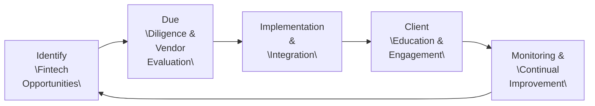

## 4.1 Fintech

Imagine you’re chatting with a friend who has just received a notification on their phone that their portfolio was automatically rebalanced—without them lifting a finger. “Enough with the fancy gimmicks!” your friend exclaims. And you might say, “Actually, that’s Fintech at work, and it’s pretty cool.” Financial Technology, or Fintech, is changing how the world does finance, from routine tasks like paying bills electronically, to the complexities of AI-driven wealth management. In the investment management world—where big data, tight regulation, and client-centric service rule the day—Fintech is especially powerful. Let’s explore how Fintech drives progress, efficiency, and yes, a bit of excitement into your day-to-day investment management practice.

### The Essence of Fintech
Fintech broadly refers to the use of new digital, online, or otherwise technology-aided solutions within the financial services sector. In practice, that includes mobile payment apps, peer-to-peer lending websites, robo-advisors, AI-based trading algorithms, blockchain solutions for settlements, RegTech for compliance, and more. The essence of Fintech is about finding new ways to do old financial tasks—only faster, cheaper, and often more securely.

In an investment context, Fintech aims to do things like:  
• Streamline and automate portfolio rebalancing processes  
• Speed up and enhance the client onboarding experience (for example, via digital identity verification and e-signatures)  
• Deliver seamless compliance with rules set forth by regulators such as the Canadian Investment Regulatory Organization (CIRO)  
• Provide advisors with up-to-date, hyper-accurate analytics through real-time dashboards  
• Deliver machine learning insights that filter through mountains of data to suggest opportunities or potential risks  

Why does it matter? Because technology that simplifies data management, improves compliance oversight, and delivers a better client experience can be the difference between a practice that stays relevant and one left behind. Today’s retail and institutional clients expect fast, personalized, and transparent management of their investments. Fintech is quite literally the toolkit that makes that possible.

### Why Fintech Matters in Investment Management
Sometimes, I’ll recall the moment I realized just how big of a difference digital verification could make in onboarding a new client. A friend of mine, who was new to investing, spent weeks waiting for paperwork to go through. She had to fill out multiple paper forms, mail them in, wait for manual identity checks—and so on. Not surprisingly, by the time the forms were finally processed, she was less than impressed. Compare that to an advisor with a robust Fintech solution that does digital identity verification in minutes: you snap or upload an ID, it’s checked against verification databases, and the system auto-populates the client’s details. All done in a fraction of the time.

This single example highlights how Fintech can address inefficiencies in routine workflows:  
• The time to onboard clients can drop from days (or weeks) to minutes  
• Data entry errors dramatically decrease  
• Client satisfaction can climb because the process is hassle-free  

In addition, Fintech solutions often provide advanced insights via data analytics. Suppose you have a long-standing client with a fairly conservative equity portfolio. An AI-based Fintech tool might notice that the client’s portfolio is overexposed to a certain market sector or that there is a big opportunity in a complementary sector showing robust fundamentals. With real-time data feeds and advanced machine learning systems, these tools can signal valuable changes to the portfolio or highlight risk triggers that require your attention. That’s the power of Fintech in everyday practice.

### Key Innovations and Applications
When we talk about Fintech, we’re talking about a diverse range of technologies. Some solutions have been around for years, while others are brand spanking new. Below are some of the most important to the investment management space.

#### Digital Identity Verification and Onboarding
In line with “know your client” (KYC) and anti-money laundering (AML) rules, verifying an individual’s identity is mandatory for advisory services. Doing this digitally, with the help of AI-powered ID scanning solutions, speeds up the compliance process. Many advisors have cut their onboarding time by over 50% using digital solutions. And of course, it isn’t just about speed. Accuracy often skyrockets because you remove manual steps (like retyping client data). With fewer mistakes and less friction, prospective clients tend to feel more confident.

#### Machine Learning and AI
Machine learning (ML) is a branch of artificial intelligence that allows systems to learn from data and improve without explicit reprogramming. In wealth management, ML can:  
• Forecast returns or volatility based on historical and current data  
• Inspect transactions to detect suspicious activity for regulatory compliance  
• Automate portfolio rebalancing by scanning for pre-set thresholds or real-time shifts in market conditions  

In practice, an ML-based approach might detect patterns in your clients’ day-to-day transactions that point to changes in risk tolerance or liquidity needs, something you might miss if you only do an annual review. By analyzing large troves of data, ML can highlight subtle correlations—perhaps something like “Clients with significant holdings in emerging markets shift to safer assets in response to foreign exchange volatility three months before mainstream analysts notice.” This can be helpful info if the model is reliable and the data is robust.

#### Big Data Analytics
Big data refers to extremely large data sets that are often unwieldy and complex. Large financial institutions, for instance, might handle millions of transactions a day. If your investment firm wanted to do a deep dive into all these data streams to refine trading strategies, you’d want specialized big data analytics solutions. Tools like [Pandas](https://pandas.pydata.org/) (for data manipulation) or [Scikit-Learn](https://scikit-learn.org/stable/) (for machine learning) can uncover patterns, glean new insights, and drive better decisions faster. You can find open-source libraries (like [QuantLib](https://www.quantlib.org/) for pricing models) that help you comb through and make sense of wide-ranging market data.

#### Blockchain
Blockchain is a distributed ledger technology in which transactions are recorded across multiple nodes. Although widely championed for its use in cryptocurrencies, blockchain can also shine in areas like clearing and settlement, where it can reduce operational inefficiencies and eliminate the need for certain intermediaries. In an industry that thrives on trust and transparency, blockchain-based solutions can help reduce fraud risk. Think of it as a digital ledger that everyone on the network can see and verify, so there’s a single source of truth.

#### Cloud Computing
Cloud computing frees advisors and firms from the burden (and sometimes headache) of maintaining expensive hardware in-house. Instead, the computing and data storage tasks are handled securely over the internet by providers such as Amazon Web Services, Microsoft Azure, or Google Cloud Platform. Migrating to the cloud translates into cost savings and easier scalability. However, robust encryption standards and compliance with privacy laws are crucial to keep client data safe. Remember: just because it’s in the cloud doesn’t mean it’s automatically secure.

#### RegTech
RegTech—short for Regulatory Technology—focuses on automating or simplifying compliance tasks. This includes real-time monitoring of transactions, automated reporting, and the use of machine learning to spot suspicious patterns that might indicate market abuse or insider trading. In Canada, ensuring compliance with CIRO guidelines, as well as rules from the Canadian Securities Administrators (CSA), can be significantly easier with RegTech solutions that generate automated compliance reports and help you maintain accurate client records.

### A Quick Look at a Fintech Implementation Roadmap
Anyways, you might be wondering: “How do we actually put all these shiny new tools to work?” The implementation of Fintech solutions is typically a multi-step journey. It’s often good to start small, maybe with an automated client onboarding solution, and then branch out to more complex areas like AI-driven compliance checks. Here is a simplified diagram to illustrate the roadmap:

• Identify “Fintech Opportunities”: Pinpoint tasks or processes that are labor-intensive, data-heavy, or prone to error.  
• Due Diligence & Vendor Evaluation: Research potential Fintech vendors, looking at track record, security protocols, encryption standards, and references.  
• Implementation & Integration: Set up software, train your team, and integrate the tool with existing workflows (e.g., linking your new digital onboarding tool with your CRM).  
• Client Education & Engagement: Ensure clients know how these new tools benefit them. This could mean sending out user-friendly guides or hosting short webinars.  
• Monitoring & Continual Improvement: Fintech never stops evolving. Gather client and staff feedback, and watch out for software updates. Then, start again to identify more opportunities.  

### Compliance Considerations in Canada
Because of the regulatory environment in Canada, advisors must ensure Fintech solutions meet the guidelines set by the relevant authorities. As of 2023, we have a unified regulatory body—CIRO—created from the historical amalgamation of IIROC and MFDA. CIRO is responsible for overseeing investment dealers, mutual fund dealers, and marketplace integrity. Whether you are adopting digital identity verification or automated portfolio management, you need to confirm the software abides by:  
• KYC and AML requirements (robust ID verification, data retention policies, and suspicious transaction monitoring)  
• Secure data storage rules—especially for personally identifiable information (PII) under the Personal Information Protection and Electronic Documents Act (PIPEDA) and relevant provincial legislation  
• Audit trails for potential compliance reviews—these solutions need to be transparent and robust enough for an auditor to see what changes were made, and when  
• Limits on the use of AI and how it influences advice—always ensure that final decisions rest on the advisor’s professional judgment, aligned with the client’s best interest  

Keep in mind that compliance is not a one-and-done exercise. If your Fintech solution regularly updates or adds new features, you have to re-check any regulatory obligations. Even the best solutions can inadvertently open new risk areas, such as cybersecurity vulnerabilities or new data-sharing pathways that might conflict with client privacy regulations.

### Cybersecurity and Data Protection
Let’s be honest, cybersecurity can feel a little like a game of whack-a-mole. In an era of advanced hacking, phishing, and ransomware, robust measures are non-negotiable. At a minimum:  
• Employ encryption, both in-transit (SSL/TLS) and at rest.  
• Vet your Cloud providers carefully: ensure they have a proven track record in safeguarding financial data.  
• Maintain backups and recovery mechanisms. A single ransomware event without backups can be catastrophic.  
• Make sure employees—and clients—understand the basics of cybersecurity hygiene: strong passwords, two-factor authentication, and how to spot phishing attempts.  

### Potential Pitfalls: Common Challenges and How to Overcome Them
Don’t get me wrong, adopting Fintech is not always smooth sailing. Here are some common bumps in the road:

• Resistance to Change: “We’ve always done it this way” is a frequent refrain. Overcome it by demonstrating how the new system saves time or reduces costly errors.  
• Regulatory Hurdles: With more automation often comes the need for more detailed compliance. Keep lines of communication open with regulators and ensure your internal compliance team is intimately involved in any Fintech rollout.  
• Data Overload: Big data can be, well, big. Without knowing which metrics actually matter for your clients, you can easily drown in a sea of data points. Carefully define the Key Performance Indicators (KPIs) you need.  
• Cybersecurity Risks: Digital solutions are potential targets for hacking. Invest in strong encryption, frequent system testing, and staff training.  

### Education and Ongoing Training
It might surprise you to learn that one of the biggest ways to stay competitive in Fintech is simply to keep learning. Fintech solutions evolve rapidly—what’s cutting edge one year can feel outdated the next. Consider continuing education programs to stay nimble. The [CFA Institute’s Fintech Certificate](https://www.cfainstitute.org/) is one option. Internal workshops or third-party seminars also help your team get hands-on exposure to both basic and advanced areas of Fintech. Some advisors even dabble with open-source financial tools like Python’s [Pandas](https://pandas.pydata.org/) library or [Scikit-Learn](https://scikit-learn.org/stable/) to build custom analytics. For Canadians, keep an eye on the [Canadian Securities Administrators (CSA)](https://www.securities-administrators.ca/) for new guidance on Fintech best practices.

### Client Engagement and the Human Touch
While Fintech often focuses on automation, data, and algorithms, remember the human element. Some clients become nervous if they perceive that “robots” will manage their entire portfolio. Emphasize how Fintech works in service of the human advisor rather than as a replacement. Explain that while the portfolio might be rebalanced automatically, you and your team regularly monitor the technology, calibrate the parameters, and step in for big strategic decisions. Sending out a short educational video or newsletter can help your clients understand the advantages of real-time data feeds, AI-based risk analysis, or digital identity checks.

### Real-World Case: Using AI for Compliance
Let’s say you run a medium-sized firm with multiple remote advisors. Maintaining compliance across jurisdictions—especially for cross-border clients—can be daunting. Suppose you integrate a RegTech platform that automatically flags unusual trade patterns, checks them against watchlists, and updates you daily on any red flags. You might discover an advisor’s new client is engaging in advanced, high-volume trades that could hint at insider knowledge. The system promptly notifies you, you investigate, and you either clear the trades or take appropriate action. The system’s logs and analytics feed help you respond swiftly to regulators if needed, saving you from substantial fines or reputational fallout.

### Next Steps for Future-Proofing Your Practice
The financial world doesn’t slow down for anyone. If you ask me, ignoring Fintech is a surefire way to lose your edge. By now, you’ve probably gathered that introducing new technologies should be a measured process. But the results—increased efficiency, competitiveness, and client satisfaction—make the journey worthwhile.

Take a moment to reflect on your current workflows: Is digital onboarding an option? Could your portfolio analytics be more proactive with an AI overlay? Do you have robust compliance monitoring? The key is not to replace your entire practice in one fell swoop, but to gradually integrate Fintech solutions that address your current pain points and align with your long-term strategy.

### For Further Exploration
• [Canadian Investment Regulatory Organization (CIRO)](https://www.ciro.ca/) for official updates and compliance guidelines  
• [Canadian Securities Administrators (CSA)](https://www.securities-administrators.ca/) for national instruments and Fintech-related notices  
• [QuantLib](https://www.quantlib.org/), [Pandas](https://pandas.pydata.org/), and [Scikit-Learn](https://scikit-learn.org/stable/) for open-source libraries that can jumpstart your data analytics and machine learning projects  
• “FinTech Innovation: From Robo-Advisors to Goal Based Investing and Gamification” by Paolo Sironi for in-depth analysis of how Fintech is reshaping wealth management  
• [CFA Institute’s Fintech Certificate](https://www.cfainstitute.org/) to stay current with emerging tools and concepts  

Ultimately, Fintech isn’t about replacing people with machines, but about leveraging machines so that financial professionals can serve clients better in an evolving digital environment. As technology continues to develop, wise advisors will stay curious, adaptable, and ready to seize the efficiencies and insights Fintech can deliver.

---

## Test Your Knowledge: Fintech in Investment Management



### Which of the following is a key advantage of using digital identity verification in client onboarding?
- [x] Shortened completion time and fewer errors
- [ ] Lack of compliance oversight
- [ ] Reduction in data analysis capabilities
- [ ] Deferral of KYC requirements
> **Explanation:** Digital identity verification allows firms to speed up compliance tasks, minimize manual input, and maintain more accurate client data.

### What is one primary role of RegTech in the Fintech landscape?
- [x] Automating and simplifying regulatory compliance processes
- [ ] Eliminating client interaction
- [ ] Discontinuing any form of data analytics
- [ ] Reducing cybersecurity measures
> **Explanation:** RegTech solutions focus on streamlining compliance through tools like automated reporting, KYC checks, and real-time monitoring of suspicious activity.

### Which of the following statements best describes “big data” in investment management?
- [x] Extremely large and complex data sets that require specialized tools for analysis
- [ ] A simple database of client emails frequently used by administrators
- [ ] Paper-based transaction records stored offsite
- [ ] Outdated data with limited relevance
> **Explanation:** Big data refers to massive amounts of data from multiple sources. Efficient tools and methodologies are needed to extract meaningful insights.

### How does blockchain technology enhance the security of financial transaction records?
- [x] It uses a decentralized ledger, making unauthorized changes more difficult
- [ ] It completely erases the need for identity verification
- [ ] It replaces the need for any form of compliance
- [ ] It eliminates the need for client risk profiles
> **Explanation:** Blockchain distributes data across multiple nodes, so transactions are transparent and resistant to tampering, increasing security and trust.

### In which scenario might a machine learning algorithm be especially useful for an investment advisor?
- [x] Identifying subtle trading patterns that suggest early market shifts
- [ ] Mailing quarterly statements to clients
- [x] Flagging unusual or high-risk transactions for further review
- [ ] Eliminating the need to monitor trades altogether
> **Explanation:** ML can identify nuanced patterns or red flags in trading. It will not replace all advisor involvement but serves as an invaluable tool.

### Which of the following best describes the iterative nature of Fintech adoption?
- [x] Implement solutions gradually, evaluate results, then identify new opportunities
- [ ] Implement all solutions at once to minimize confusion
- [ ] Only implement tools used by competitors
- [ ] Avoid upgrading solutions once they’re installed
> **Explanation:** Adopting Fintech is most effective when done in stages, allowing your firm to evaluate performance and tweak the approach as needed.

### A key reason for advisors to engage clients when adopting new Fintech tools is:
- [x] It helps clients understand the benefits and fosters transparency
- [ ] It eliminates the need for regulatory oversight
- [x] It ensures clients will never ask questions again
- [ ] It negates the requirement for risk profiling
> **Explanation:** Customer education helps them appreciate and trust new technological enhancements. They remain informed about changes that affect their investments.

### Which of the following ensures clients’ data is usable if a cyberattack occurs?
- [x] Maintaining secure backups and recovery mechanisms
- [ ] Disabling encryption protocols
- [ ] Allowing unlimited open access to client records
- [ ] Exclusively relying on a single backup location
> **Explanation:** Strong backup and recovery systems ensure that data remains accessible and intact in the event of a cyberattack.

### How can cloud computing benefit investment advisory firms?
- [x] It can reduce hardware costs and increase scalability
- [ ] It discourages clients from using digital technology
- [ ] It replaces the need for data encryption
- [ ] It undermines real-time market updates
> **Explanation:** The cloud offers cost savings and near-instant resource scalability. However, compliance and data protection measures are still essential.

### "Fintech primarily removes the human element from investment advising." Is this statement true or false?
- [x] False
- [ ] True
> **Explanation:** Fintech streamlines and enhances advisor efforts but does not entirely remove the human element. Advisors still provide personal recommendations, handle complex queries, and maintain client relationships.


