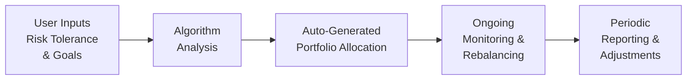

## 4.2 Robo-Advisory Services

If there’s one thing I remember vividly, it’s the day I decided I was too busy to keep tinkering with my own portfolio, especially when I barely had time to read market news. I was chatting with a friend who said, “Why don’t you just try a robo-advisor?” Frankly, I was skeptical at first. I love old-fashioned, human interaction—you know, the reassuring voice on the phone that says, “Don’t panic! Markets move in cycles.” But curiosity got the best of me, and I went online to sign up. Within minutes, I was answering a bunch of risk and goal-oriented questions, and the robo-advisor spat out a portfolio allocation—like magic.

Of course, it’s not actually magic. Robo-advisors use sophisticated algorithms to allocate assets based on a client’s risk profile, financial goals, time horizon, and more. These platforms are basically an outgrowth of the broader Fintech wave we discussed in Section 4.1 (Fintech). They can be more cost-effective than traditional advisory services, and they often have an easy-to-use digital interface that’s super-friendly even if you have zero interest in the behind-the-scenes detail of portfolio construction. However, every time I see a system that promises “one-size-fits-all,” a few questions run through my mind: “How are they validating my risk tolerance? Are they truly fulfilling all required compliance steps? Do they incorporate all my personal quirks and constraints?” Let’s dig deeper into these issues.

---

### What Is Robo-Advisory?

A robo-advisor is a digital platform that automates portfolio management tasks—like asset allocation, security selection, rebalancing, and in some cases, tax optimization. Typically, you log in, fill out an online questionnaire—some are extremely brief, while others can be more elaborate—and the robo-advisor’s **algorithm** uses that information to figure out how best to invest your money.

“Algorithm,” by the way (as defined in the glossary), is just a fancy term for a set of step-by-step instructions a computer program follows to reach a specific outcome. In this context, the outcome is your recommended portfolio. Many robo-advisors also help you estimate how much you’ll need for retirement or short-term goals, and they may use dynamic rebalancing techniques to keep your asset mix in check. 

From a user’s perspective, robo-advisors can remove a lot of friction. You’re no longer scheduling an in-person appointment with a financial advisor to shuffle your portfolio or measure your risk tolerance. And let’s be real: sometimes, scheduling those appointments feels like scheduling a dentist appointment—you know it’s good for you, but you keep putting it off.

---

### Core Features of Robo-Advisory Services

#### 1. Automated Asset Allocation
Robo-advisors rely on **asset allocation** models, dividing your investments among classes like equities, fixed income, and sometimes even alternative assets. The foundation is Modern Portfolio Theory (refer to Chapter 3 for more on asset allocation strategies) which aims to balance risk and return efficiently.

#### 2. Convenient Onboarding
You create an account, complete a questionnaire covering your risk tolerance, timeframe, goals, and liquidity needs, and voilà—the robo-advisor suggests a tailored portfolio. This digital onboarding can reduce the time and documentation overhead for both investor and service provider.

#### 3. Cost Advantages
Traditional portfolio management often charges higher management fees, partly because of overhead from human advisors and office space. Robo-advisors cut out many of these costs, offering relatively low fees. This can be especially appealing for smaller portfolios, where management fees may otherwise feel hefty.

#### 4. Continuous Monitoring and Rebalancing
One big promise of robo-advisory services is real-time or near real-time monitoring. **Rebalancing** (restoring your portfolio to its target allocation as assets move up or down in value) can happen automatically. That’s a big plus if you don’t want to track your holdings every single day.

#### 5. User-Friendly Interfaces and Digital Access
Most robo-advisors have sleek dashboards or smartphone apps. It seems like magic—tap a few buttons and you can see your entire financial picture on the screen. You also have 24/7 access, which is great for folks who like to check in on their account at odd hours.

---

### Where Human Advisors Still Stand Out

Now, let’s not forget that advanced tax strategies, estate planning, specialized retirement planning, and more nuanced, personalized advice often require a real human conversation. Because while an algorithm is brilliant at scouring data for the best possible portfolio configuration, it can’t always handle the emotional side of investing: the panic that might set in when markets fall, or the complicated family situations that affect inheritance planning. 

A **Hybrid Advisory Model** (as the glossary calls it) combines the benefits of robo-services—like automated rebalancing and low costs—with the human insight of a qualified advisor who can identify subtle issues a purely automated platform might miss. In Canada, we see certain banks and wealth management firms offering “hybrid” services where you might interact with a human advisor for special check-ins, but day-to-day investing is largely automated.

---

### Considerations for Canadian Compliance

Canada’s regulatory environment shapes how robo-advisory solutions must be designed. Historically, oversight was done by IIROC (the Investment Industry Regulatory Organization of Canada) for investment dealers and by the MFDA (the Mutual Fund Dealers Association of Canada) for mutual fund dealers. As of January 1, 2023, these two organizations have been merged into CIRO (the Canadian Investment Regulatory Organization), which is now the single self-regulatory body for the Canadian investment industry. 

CIRO establishes rules around suitability, disclosure, ongoing monitoring, and KYC (**Know Your Client**). That KYC process is crucial. Even if a robo-advisor uses a sleek questionnaire, it must still comply with regulatory requirements. Essentially, you can’t have a half-baked set of questions and then tuck a “good luck!” message at the end. The system must gather enough detail to ensure that the recommended portfolios align with the client’s risk capacity, objectives, and constraints.  

To read more on these guidelines, you might want to check out:
- [CIRO’s official website](https://www.ciro.ca/) for current rules and guidance on electronic or digital advice delivery.  
- [CSA Staff Notices](https://www.securities-administrators.ca/) to see how provincial and territorial regulators are approaching robo-advisory services.  

The key question is always: Are these online questionnaires thorough enough to address a client’s personal circumstances and financial knowledge? If not, you could be breaching the **suitability** (another glossary term) requirement. Some advisors integrate short phone or video chats with new clients to confirm the data gleaned from questionnaires. 

---

### Fiduciary Duty in an Automated World

Even when advice is automated, the **fiduciary duty** remains. Fiduciary duty is the ethical and legal responsibility to act in a client’s best interest—no different from a hospital’s duty to provide the highest standard of patient care. Robo-advisors must be transparent about fees, product selection, and potential conflicts of interest. If, for instance, the platform invests your cash in funds it manages internally, that should be clearly disclosed. 

Advisors who recommend a robo-advisory platform also need to ensure the client has the tech skills and comfort to engage with it. Some clients might say, “I can’t stand the idea of not having a person helping me.” In that case, a full-fledged robo-solution wouldn’t be appropriate. A hybrid or fully human approach might be better.

---

### Technology Infrastructure and Security

Robo-advisory platforms rely heavily on technology infrastructure—cloud computing, big data analytics, machine learning, and more. With such reliance comes the need for robust cybersecurity. Identity theft and data breaches can undermine trust in digital advice. Canadian regulators and the broader industry keep a close eye on data privacy and the adequacy of cybersecurity measures. If you’re planning to adopt or recommend a robo-advisor, you’ll want to do a quick check of their security protocols too.

---

### Potential Drawbacks of Going Robo

Like anything, robo-advisors come with potential pitfalls:

1. **Limited Personalization**: Algorithms may not capture certain nuances—like a personal vow to never invest in sin industries, or the complicated patchwork of your family’s finances and businesses. 
2. **Over-Reliance on Algorithms**: If the model or data behind it is flawed, end results can be off the mark. Always remember: “garbage in, garbage out.” 
3. **Communication Gaps**: Some folks prefer a phone call or face-to-face conversation to confirm they’re on the right track. Robo-advisors rely primarily on digital channels for communication. 
4. **Market Downturn Guidance**: The question, “Should I sell when the markets are really plummeting?” can be tough to answer via an app’s frequently asked questions menu. 
5. **Potential Over-Simplification**: KYC and risk profiling are typically done via questionnaires, which, as we discuss in Chapter 2 (Understanding a Client’s Risk Profile), have limitations.  

Despite these limitations, the ongoing improvement in data collection, better user design, and enhancements in artificial intelligence might reduce these drawbacks eventually.

---

### Use Case: Low-Complexity Portfolios

Robo-advisors are often ideal for:
- Young professionals who are new to investing and need a simple, low-cost entry point.
- People with straightforward financial goals, e.g., saving for a home, building an emergency fund, or basic retirement planning.
- Tech-savvy investors who don’t necessarily need or want frequent human interaction.  

However, if you’ve got a more complex financial situation—maybe a family business, complicated trust issues, or a large, multi-generational wealth plan—you might prefer the direct guidance of a dedicated financial professional.

---

### A Quick Visual: How Robo-Advisors Typically Work

Below is a simplified flowchart illustrating how a robo-advisor might operate from initial client input to ongoing rebalancing and reporting.

- **A**: The user starts by submitting data like income, investment objectives, time horizon, and risk comfort level.
- **B**: The automated system processes the data, runs it through an **algorithm**, and determines a recommended portfolio.
- **C**: The user’s money is invested according to the recommended allocation, often in ETFs or mutual funds.
- **D**: The system monitors the account, checking if the allocation drifts from target. If it does, it rebalances automatically.
- **E**: The platform provides ongoing updates. Reports might be monthly, quarterly, or even in real-time.

---

### Hybrid Models and Advisor Roles

Enter the **Hybrid Advisory Model**. If the purely robotic approach seems too hands-off, but you still appreciate the cost advantages, a hybrid model is worth considering. In such arrangements, a human advisor:
- Validates the data from the questionnaire, ensuring it meets **suitability** requirements.  
- Adds a personal touch, discussing advanced topics (tax optimization, estate planning, philanthropic goals).  
- Oversees the automatic rebalancing and suggests adjustments if major life changes occur.  

This model can be a great balance. The day-to-day nuts and bolts are handled by the robo-platform, but you still have a person you can call to chat about your new job or how your inheritance might affect the plan.

---

### Canadian Robo-Advisor Platforms

Several robo-advisor services have taken root in Canada. While we won’t name them all, a couple popular examples include:

- **Wealthsimple**: Known for its low fees, ease of use, and sleek user interface. Offers features like automated rebalancing and socially responsible investment options.
- **CI Direct Investing**: Provides portfolio management with a focus on advice and includes automatic rebalancing. Offers a hybrid approach where you can consult an advisor.

Both platforms are members of CIRO. Your assets are protected by the Canadian Investor Protection Fund (CIPF), which kicked into a merged single protection fund on January 1, 2023, covering you if a member firm goes insolvent.  

---

### Regulatory References and Further Reading

1. **CIRO** (Canadian Investment Regulatory Organization):  
   - [https://www.ciro.ca/](https://www.ciro.ca/)  
   - Outlines rules for investment dealers, mutual fund dealers, and market regulation.
2. **CSA** (Canadian Securities Administrators):  
   - [https://www.securities-administrators.ca/](https://www.securities-administrators.ca/)  
   - Provides Staff Notices and guidelines on online advisory services, emphasizing KYC and suitability compliance.
3. **CFA Institute**:  
   - “The Rise of Robo-Advice: Changing the Face of Investment Management” – an in-depth look at how robo-advice is transforming the industry.
4. **Fintech Cadence**:  
   - [https://fintechcadence.com/](https://fintechcadence.com/)  
   - Offers workshops and sandbox testing opportunities for new Fintech solutions.

---

### Best Practices for Advisors Exploring Robo-Services

- **Validate Risk Questionnaires**: Make sure the platform thoroughly addresses the client’s financial situation and risk behavior. 
- **Review Compliance**: The robo-advisor’s process must adhere to CIRO regulations. Keep an eye on how the algorithm handles suitability.
- **Transparency of Fees and Methodology**: Verify that your clients know exactly what fees they’re paying and how their portfolios are constructed.
- **Adopt a Hybrid Approach** (if needed): Offer your clients a blend of digital convenience and personal intervention for more complex situations.
- **Continuous Monitoring**: Even if the system is automated, an annual or semi-annual review can ensure everything stays on track, especially after big life events.
- **Educate Clients**: Let them know they can always transition to a more personal advisory arrangement if they outgrow the robo-advisor’s scope.

---

### Common Pitfalls and How to Avoid Them

1. **Ignoring Unique Constraints**  
   If the client has unique moral or ethical investment constraints (like not wanting to invest in fossil fuels), double-check if the platform can accommodate specialized mandates.

2. **Underestimating Emotional Support**  
   When markets turn turbulent, your client may yearn for a human conversation. Clarify up front what level of personal guidance your client can expect.

3. **Incomplete KYC**  
   If the robo-advisor’s KYC is too shallow, you might inadvertently recommend an unsuitable strategy. Look for a platform that collects robust data.

4. **Passive Oversight**  
   Even though it’s “set it and forget it,” you still need to oversee the bigger picture. Ask if the platform offers notifications of major market events or rebalancing activities.

5. **Regulatory Misalignment**  
   Failing to keep up with evolving rules on digital advisory is a real risk. Stay current with [CIRO’s website](https://www.ciro.ca/) and [CSA Staff Notices](https://www.securities-administrators.ca/).

---

### Glossary Recap

• **Algorithm**: A set of predefined steps or rules a computer follows to solve a problem or accomplish a task.  
• **Hybrid Advisory Model**: A combination of digital (robo) tools with human advisory touchpoints.  
• **Suitability**: A regulatory requirement that financial recommendations must match the client’s goals, needs, and risk tolerance.  
• **KYC (Know Your Client)**: Gathering detailed info about a client’s financial details, objectives, risk capacity, and personal circumstances.  
• **Asset Allocation**: Splitting a portfolio among various asset classes (e.g., equities, bonds, cash) to manage risk and enhance returns.  
• **Rebalancing**: Adjusting a portfolio to its target allocations after market fluctuations shift the weight of each asset.  
• **Fiduciary Duty**: A legal and ethical obligation to act in the best interest of the client, disclosing potential conflicts of interest and ensuring transparency.

---

### The Future of Robo-Advisory

Robo-advisors are likely to advance in leaps and bounds, especially as machine learning becomes more sophisticated. We might see deeper levels of financial planning, with algorithms factoring in everything from your grocery bill to your child’s college savings plan in real time. And yes, we’ll probably also see more emphasis on alignment with environmental, social, and governance (ESG) criteria—something that’s already happening.

The big takeaway: Robo-advisors aren’t a threat to human advisors; they’re tools that can serve many investors well, especially those with simpler needs or smaller portfolios. Advisors can then focus on the big-picture stuff and complex strategies. It’s a win-win if you ask me.

---

## Test Your Robo-Advisory Knowledge



### Robo-advisors predominantly rely on which key process to generate portfolio recommendations?

- [ ] Manual oversight by a human portfolio manager.
- [x] Algorithmic analysis of client data to recommend asset allocation.
- [ ] Random portfolio selection aided by machine learning.
- [ ] Offline risk assessment done by a specialized compliance department.

> **Explanation:** Robo-advisors use algorithms to analyze a client’s answers relating to risk tolerance, goals, and time horizon, then recommend a suitable portfolio accordingly.

---

### Which organization currently oversees Canadian investment dealers and mutual fund dealers as of 2025?

- [ ] The Investment Industry Regulatory Organization of Canada (IIROC).
- [x] The Canadian Investment Regulatory Organization (CIRO).
- [ ] The Mutual Fund Dealers Association of Canada (MFDA).
- [ ] The Canada Revenue Agency (CRA).

> **Explanation:** MFDA and IIROC no longer exist as separate entities. They merged into CIRO on January 1, 2023. CIRO now regulates all investment dealers, mutual fund dealers, and market integrity activities in Canada.

---

### What is a common limitation when relying solely on online questionnaires for KYC (Know Your Client)?

- [ ] Too much personalized attention.
- [ ] Human advisors can override the results at will.
- [x] Potential incompleteness in capturing a client’s full financial and emotional profile.
- [ ] Lower investment returns.

> **Explanation:** A simple questionnaire might not fully capture complex nuances of a client’s financial life or emotional tolerance for market volatility.

---

### In a robo-advisor setting, which core activity does “rebalancing” refer to?

- [ ] Converting all equity funds to cash.
- [ ] Automating monthly deposits into the account.
- [x] Adjusting the portfolio back to its target allocation when markets shift.
- [ ] Removing assets based on user feedback alone.

> **Explanation:** Rebalancing involves buying or selling certain assets to maintain the intended allocation (e.g., 60% equities and 40% bonds) as market prices fluctuate.

---

### Which term describes the legal and ethical requirement for advisors to act in their clients’ best interest?

- [ ] Duty of Care
- [ ] Risk Profiling
- [ ] Conflict of Interest
- [x] Fiduciary Duty

> **Explanation:** Fiduciary duty requires the advisor or platform to put the client’s interests above their own, disclosing any conflicts of interest.

---

### Which of the following is NOT typically considered a drawback of using a robo-advisor?

- [ ] Limited personalization for unique constraints.
- [x] Immediate personal counseling from a certified therapist.
- [ ] Over-reliance on algorithms.
- [ ] Potential communication gaps with users.

> **Explanation:** Robo-advisors are not designed to provide personal counseling or therapy. The other options—limited personalization, reliance on algorithms, and potential communication gaps—are recognized drawbacks.

---

### A hybrid advisory model best suits which type of client?

- [ ] Someone who wants absolutely no human interaction whatsoever.
- [x] Someone with moderate complexity in their finances and a desire for both digital efficiency and human guidance.
- [ ] Someone who does not trust any digital platform.
- [ ] Someone who invests less than $50 only once a year.

> **Explanation:** A hybrid model is ideal if you want convenience and cost advantages of digital platforms but also value having an advisor to handle complex or nuanced situations.

---

### If an automated platform invests solely in one provider’s funds without disclosure, this could be a breach of what principle?

- [ ] Liquidity
- [ ] Diversification
- [x] Fiduciary duty
- [ ] Marketing rules

> **Explanation:** Not disclosing potential conflicts of interest—like investing exclusively in proprietary funds—may breach the duty to act in the client’s best interest.

---

### What type of clients typically get the most value from pure robo-advisory services?

- [x] Those with straightforward financial goals and simpler portfolios.
- [ ] Billionaires with offshore trusts and inter-generational wealth plans.
- [ ] High net worth individuals needing customized hedge fund allocations.
- [ ] Individuals who refuse to use technology.

> **Explanation:** Investors with typical or less complex goals (saving for retirement, paying for education, etc.) often benefit the most from low-cost, automated solutions.

---

### True or False: Low fees, automated portfolios, and easy onboarding are common advantages of robo-advisory.

- [x] True
- [ ] False

> **Explanation:** By automating asset allocation and reducing overhead, robo-advisors often offer lower fees. Their digital platforms also streamline onboarding and ongoing management.


