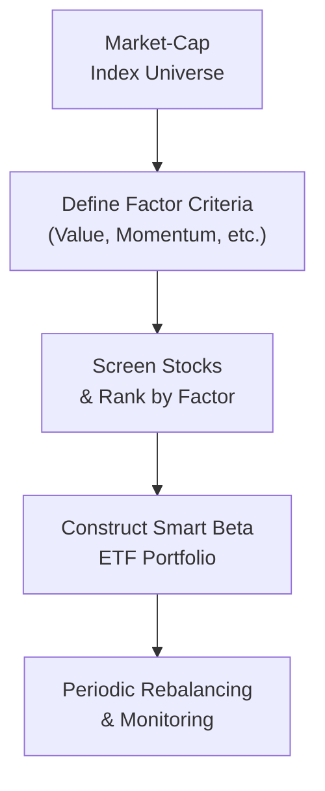
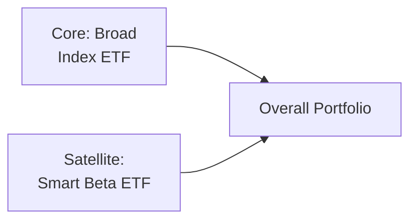

## 4.3 Smart Beta ETFs

Let’s kick this conversation off with a quick story. Years ago, I found myself in a spirited debate with a friend about how to balance a stock portfolio. She insisted that large-cap stocks—like those tracked by traditional market-cap weighted indexes—were the only way to go. I, on the other hand, was discovering these interesting little corners of the ETF world that promised so-called "factor-based" returns. We now call them Smart Beta ETFs. At the time, I was brand new to the concept and (if I’m honest) couldn't fully explain why they might be worth a look. But boy—have things changed. 

In this section, we’ll explore Smart Beta ETFs in detail. We’ll see how they differ from traditional passive strategies, why they aim to capture specific “factors,” and what you, as an advisor or investor, need to keep in mind regarding risk, returns, and even the nitty-gritty of Canadian regulatory compliance. Ready? Let’s dive in.

---

### Brief Introduction to Smart Beta

First things first: what exactly is “Smart Beta” supposed to mean? Essentially, Smart Beta ETFs blend passive index investing with active, rules-based factor selection. Traditional market-cap weighted ETFs, like those tracking the S&P/TSX Composite Index or the S&P 500, weight companies based on their total market value. This approach often results in big companies representing a big chunk of the portfolio—sometimes overshadowing smaller yet potentially more promising firms.

Smart Beta, meanwhile, says: “Sure, index investing is great, but maybe we should systematically tilt the portfolio toward certain characteristics—like undervalued companies, stable earnings, or strong momentum.” In other words, Smart Beta strategies focus on specific “factors.” Each factor represents some measurable company characteristic that academic research suggests could lead to potentially higher risk-adjusted returns over time. However, be warned: these are not surefire ways to always beat the market. They’re just structured attempts (based on academic and practical insights) to gain returns that a traditional index might miss.

Common factors include:
• Value: Emphasizes stocks with low price-to-book or low price-to-earnings ratios.  
• Quality: Targets companies with high profitability, low debt, and robust earnings stability.  
• Momentum: Aims for stocks that have recently exhibited strong performance, with the hope that they continue to do so.  
• Low Volatility: Seeks stocks with stable prices, looking to limit large swings.

Each factor has its own quirks and is sensitive to certain market conditions. And yes, they absolutely can underperform if the market environment doesn’t favor them. A classic example is a value fund lagging during a fast-paced, high-growth (especially tech-driven) market cycle. 

---

### Why Factors Matter

Let’s say you’re intrigued by “value investing,” the notion that cheap stocks might deliver bigger long-term payoffs once their prices “correct” upwards. The value factor invests in such “cheap” stocks systematically, according to rules about price multiples, book values, or other fundamental metrics. If your client strongly believes in the potential of undervalued opportunities, a value-oriented Smart Beta ETF might be appealing.

Likewise, if you have a client who never wants to hear the word “volatility” because it keeps them up at night, a Low Volatility Smart Beta strategy can make sense. It systematically invests in stable, lower-beta (i.e., less sensitive to market fluctuations) stocks, smoothing out some of the violent ups and downs that come with pure market-cap investing. 

---

### How Smart Beta ETFs Work

Smart Beta ETFs typically start with a broad universe of stocks. Then they apply a rules-based methodology for weighting or selecting subsets of stocks based on factor criteria.  

Here’s a simplified overview in a diagram form:

Explanation of the diagram’s flow:
1. Start with a broad market index or universe (like the TSX or a global equity set).  
2. Define your factor criteria (low valuations, high momentum, quality metrics, etc.).  
3. Screen and rank all eligible stocks by these criteria (e.g., top 20% with the lowest price-to-book ratio).  
4. Construct your ETF portfolio to hold a basket of these high-ranked stocks.  
5. Rebalance periodically—maybe quarterly or annually—to maintain exposure to the chosen factor(s).

---

### Advantages of Smart Beta

1. **Targeted Factor Exposure**  
   Smart Beta ETFs let you hone in on specific factors—value, momentum, quality, low volatility, etc.—that you think will outperform. If a client’s investment objective aligns well with a particular factor (say, stable, dividend-paying stocks for consistent income), Smart Beta can be an elegant solution.

2. **Potential for Outperformance**  
   Many academic studies (and more than a few real-world examples) show that certain factors have historically outperformed the broad market over long horizons. There’s no guarantee they will continue to do so, but the potential remains.

3. **Diversification Benefits**  
   Market-cap weighting can lead to sector or stock concentration risk. For instance, tech stocks might balloon within the index. A rules-based approach might spread risk differently, leading to better diversification benefits.

4. **Transparency**  
   Smart Beta ETFs must disclose their factor weightings, rebalancing rules, and holdings (though in practice, some details may remain proprietary). This transparency offers investors a clearer understanding of what they’re getting compared to a actively managed mutual fund.

---

### The Drawbacks and Considerations

1. **Higher Fees**  
   Smart Beta ETFs aren’t always cheap. The expense ratio—though usually lower than an actively managed fund—tends to be higher than your standard passive index ETF. This can eat into your returns, especially in flat or bear markets.

2. **Tracking Error**  
   Because these ETFs track more specialized indexes or factor-driven benchmarks, the ETF’s returns may differ more significantly from the broad market than a traditional index ETF. This phenomenon is known as tracking error. Essentially, you’re deviating from the standard benchmark in hopes of better performance.

3. **Factor Cyclicality**  
   Factors can (and often do) go in and out of favor. A momentum strategy might do great in a bull market but get slammed in a sudden reversal. A value strategy might languish during periods where growth companies dominate (think: major tech booms). That’s why ongoing due diligence is crucial.

4. **Complexity**  
   These products can be more complex than your usual index fund. If you or your client can’t clearly articulate how or why the factor is expected to deliver returns, it might be best to stick to simpler vehicles.

---

### Factor Definitions in Action

1. **Value Factor**  
   Focuses on stocks that appear cheap relative to some fundamental measure. Metrics include low price-to-book, price-to-earnings, price-to-free-cash-flow, and so on. However, “cheap” can remain cheap for frustratingly long periods if the broader market is chasing growth names.

2. **Quality Factor**  
   Targets firms with stable earnings, low debt, and strong corporate governance. The idea is that high-quality companies might endure tough market conditions better and continue to grow steadily.

3. **Momentum Factor**  
   Zeroes in on stocks that have performed well in recent periods, hoping that trend continues. The risk is that momentum can quickly reverse if sentiment shifts.

4. **Low Volatility Factor**  
   Picks stocks with historically lower price fluctuation. This might help reduce large drawdowns, but in roaring bull markets, low-vol strategies can underperform.

---

### Performance Measurement and Due Diligence

Continuous monitoring of a Smart Beta ETF is vital to ensuring it’s still meeting your client’s objectives. Questions you should ask include:  
• Are the factor exposures consistent with the ETF’s stated objective?  
• Does the factor still make sense for your client’s long-term view?  
• Are the fees still competitive compared to newly launched ETFs? (Yes, new Smart Beta funds pop up all the time.)  
• Is the index methodology stable, or have there been changes that might alter results?

It’s useful to look at rolling returns over multiple time frames to capture the cyclical nature of factors. Advisors often measure performance using metrics like the Sharpe ratio (risk-adjusted returns) or the Information ratio (excess returns relative to a benchmark, divided by tracking error). If the fund struggles for a quarter or two, it may (or may not) reflect a failing factor. Sometimes it’s simply a short-term environment in which the factor lags.

---

### Canadian Regulatory Perspective

As of 2023, the Mutual Fund Dealers Association of Canada (MFDA) and the Investment Industry Regulatory Organization of Canada (IIROC) are defunct. They have combined into the Canadian Investment Regulatory Organization (CIRO)—the single self-regulatory organization overseeing investment dealers and mutual fund dealers across Canada. If you encounter references to MFDA or IIROC, bear in mind they’re historical references only.

CIRO’s guidelines stress transparent disclosure of fees and investment strategies. Smart Beta ETFs must clearly communicate the factor(s) they track, the weighting methodology, and the various risks involved. As an advisor, you’re responsible for ensuring that all marketing materials align with these guidelines and that the chosen Smart Beta strategy is suitable for your client. Detailed disclaimers and the client’s risk profiling (see Chapter 2: Understanding a Client’s Risk Profile) become even more important given Smart Beta’s unique risk-return profiles.

Additionally, the Canadian Investor Protection Fund (CIPF) provides investor protection for accounts if a member firm becomes insolvent. Although CIPF is independent of CIRO, advisors should reassure clients that coverage exists. Just remember, CIPF doesn’t protect against decreases in the market value of an investment—only issues related to dealer insolvency.

---

### Expense Ratios and Tracking Error

Compared to vanilla ETFs, Smart Beta approaches may come with higher expense ratios. For example, a typical broad-market ETF might charge a management expense ratio (MER) of 0.05% to 0.15%, while a Smart Beta product might charge from 0.20% all the way to 0.75% or more, depending on complexity. Still much cheaper than many mutual funds, but more than your common passive ETF.

Tracking error is also part of the game. The more specialized your factor approach, the more your returns can diverge from the broader index. That’s not necessarily bad—indeed, that’s the entire point of factor investing—but it does mean you might have more performance variance.

---

### Practical Examples and Case Studies

Let’s imagine you have a client, Sarah, who’s anxious about market volatility. She hates seeing her account drop precipitously whenever the market takes a dive. One possibility is a Low Volatility ETF focusing on stable, dividend-paying stocks. Historically, such ETFs have seen smaller drawdowns in bear markets, though they might also miss out on some of the big upside surges in bull markets.

Another example: A client, Kevin, who’s all about “buying cheap.” He believes markets eventually revert to the mean, so undervalued stocks should (in theory) bounce back. You might suggest a Value Factor ETF that invests in the most underpriced stocks relative to earnings. But when markets feverishly chase growth companies, Kevin’s ETF might underperform for a stretch. Keeping him well-informed and aligned with the strategy’s philosophy is part of your job as an advisor.

---

### Incorporating Smart Beta into a Broader Portfolio

Smart Beta strategies shouldn’t stand alone in most cases. They’re typically integrated into a broader asset allocation plan (see Chapter 3: Asset Allocation and Investment Strategies). If you’re employing multiple factors—say, value plus momentum plus quality—you might end up with a multi-factor Smart Beta ETF. This reduces single-factor volatility, but also can dilute the “pure” factor exposure. Alternatively, you can hold individual factor ETFs in proportions that match your intended risk-and-return profile.

Many advisors prefer to use a “core-satellite” approach:
• **Core**: A broad-market index ETF for overall market exposure.  
• **Satellite**: One or more Smart Beta ETFs to pursue specific factor strategies or alpha opportunities.

This can be visually represented as:

In the above approach, the broad index ETF anchors the portfolio to ensure general market participation. The Smart Beta ETF acts as a tilt or overweight to certain factors.

---

### Common Pitfalls and Best Practices

1. **Chasing Recent Performance**  
   One of the biggest mistakes is plowing money into a factor right after it’s outperformed. That’s ironically when it might be at its most expensive or overbought. Factor investing demands some discipline and a willingness to hold on even when the factor is “out of style.”

2. **Underestimating Fees and Trading Costs**  
   While Smart Beta is generally cheaper than many actively managed products, it can still rack up fees—especially if there’s frequent rebalancing. Keep an eye on the total cost of ownership (including bid-ask spreads in low-liquidity ETFs).

3. **Ignoring Factor Definitions**  
   Not all “value” or “quality” definitions are the same. One provider might focus on a single metric, while another uses a multi-metric approach. Read the methodology, and confirm it aligns with your or your client’s expectations.

4. **Over-Concentration**  
   Some factor strategies can become concentrated in certain sectors (for instance, Technology for momentum, or Financials and Energy for value). That concentration might conflict with your intended diversification strategy.

---

### Tools and Data Sources

Interested in testing out how factor exposures might have performed historically? You can turn to open-source libraries and academic studies.

• **Bank of Canada** (<https://www.bankofcanada.ca/>) and **Statistics Canada** (<https://www.statcan.gc.ca/>) can provide macroeconomic data—useful for analyzing how broader conditions may affect factor returns.  
• **CFA Institute** (<https://www.cfainstitute.org/>) often publishes insightful research on factor investing.  
• **Journal of Portfolio Management** is another terrific resource for deep dives into new factor research and analyses of factor performance across different regions and time frames.  
• **PortfolioAnalytics in R** (<https://cran.r-project.org/web/packages/PortfolioAnalytics/index.html>) and **PyPortfolioOpt in Python** (<https://github.com/robertmartin8/PyPortfolioOpt>) are open-source libraries that let you build and backtest factor-based portfolios.  

If you’re more academically inclined, check out “Your Complete Guide to Factor-Based Investing” by Andrew L. Berkin and Larry E. Swedroe for a thorough breakdown of factor investing’s theoretical underpinnings.

---

### Canadian Context: Fee Disclosure and Suitability

Under CIRO (the Canadian Investment Regulatory Organization), advisors must provide clear documentation of fees and performance. This transparency is especially important when recommending strategies that might have more complex risk profiles than plain-vanilla broad market ETFs. Always check that the factor-based approach is deemed suitable for your client. For instance, if your client is extremely risk-averse, is a Momentum or Value factor right for them? Possibly not. You’ll likely keep them in a Low Volatility or even a broad, diversified ETF to reduce sharp drawdowns.

---

### Thinking Critically About Factor Investing

Smart Beta can be a wonderful tool, but it’s not a silver bullet. It’s based on the premise that certain factors—when applied systematically—might outperform or protect on the downside. But these are statistical tendencies, not guarantees. Markets evolve, global events happen, and investor sentiment shifts. In some cycles, factors might crush the benchmark; in others, they might lag for years.

Moreover, the very popularity of factor investing might erode its edge over time. When everyone knows about a factor, it can become crowded. Contrarians sometimes argue that once a factor is widely known, it loses its advantage. Others counter that many factors are based on human behavioral biases that persist: fear, greed, overconfidence, and the like.

---

### Conclusion

Smart Beta ETFs represent a marriage between passive investing’s efficiency and active management’s targeting of specific alpha sources. They can be a powerful way to fine-tune a portfolio’s risk-and-return characteristics, provided you do the homework, understand cyclical risk, monitor fees, and remain transparent with clients about what you’re trying to accomplish.

There’s no “one-size-fits-all” in factor investing. Whether you’re fascinated by “quality” stocks, want to ride “momentum,” or crave “value,” Smart Beta ETFs can be a valuable tool—just remember they can also underperform if the market environment doesn’t play to that factor’s strengths. So keep your eyes open, do your due diligence, and align each factor-based strategy with the investor’s broader financial goals and risk tolerance. 

---

## Test Your Knowledge: Smart Beta ETFs Essentials



### Which of the following statements best describes the main goal of a Smart Beta ETF?

- [ ] It aims to achieve the same returns as a market-cap index with lower fees.
- [x] It seeks to capture certain factors (e.g., value, momentum) through a rules-based methodology.
- [ ] It is designed solely to avoid all risk in the equity market.
- [ ] It guarantees to outperform traditional index funds in all market conditions.

> **Explanation:** Smart Beta ETFs use rules-based investing to tilt towards specific factors in hopes of enhancing returns or reducing risk compared to a purely market-cap weighted approach.

### What is a potential drawback of investing in a Smart Beta ETF?

- [ ] No possibility of underperformance.
- [ ] 100% guaranteed returns regardless of market conditions.
- [ ] It only invests in large-cap companies.
- [x] It can underperform if the chosen factor falls out of favor in the market.

> **Explanation:** Factors (like value or momentum) can experience extended periods of underperformance, so investors face cyclical risks.

### Which of the following factors emphasizes companies with strong earnings and low debt?

- [ ] Value
- [x] Quality
- [ ] Momentum
- [ ] Low Volatility

> **Explanation:** Quality investing focuses on stable earnings, low debt, and strong corporate governance metrics.

### Why do Smart Beta ETFs often have higher expense ratios than broad market index ETFs?

- [x] They use more complex screening and weighting methodologies.
- [ ] They hold fewer stocks, therefore the cost is higher.
- [ ] They use derivative strategies to hedge currency risk.
- [ ] They must pay extra regulatory fees to CIRO.

> **Explanation:** Smart Beta ETFs can involve detailed fundamental or quantitative analysis to screen and weight stocks differently, requiring additional research and operational costs.

### What is meant by “tracking error” in the context of Smart Beta ETFs?

- [ ] The usage of incorrect stock data during portfolio construction.
- [x] The divergence of an ETF’s returns from its underlying factor-based index.
- [ ] The fee charged by fund managers to replicate an index.
- [ ] The difference in stock price quotes across multiple exchanges.

> **Explanation:** Tracking error measures how closely an ETF follows its stated benchmark. With Smart Beta, that benchmark is more specialized, sometimes increasing the room for divergence in returns.

### How can an advisor integrate Smart Beta ETFs into a portfolio without taking on excessive factor risk?

- [ ] Abandon all broad market exposure.
- [x] Adopt a core-satellite approach, with broad market ETFs as the core and Smart Beta as satellites.
- [ ] Apply a single factor across the entire portfolio.
- [ ] Only invest in leveraged Smart Beta strategies.

> **Explanation:** A “core-satellite” strategy is a popular approach, blending a stable index fund (core) with satellite holdings in factor-based (Smart Beta) funds.

### Which statement is most accurate regarding the cyclical nature of factors?

- [x] Factors can go in and out of favor depending on market conditions.
- [ ] Each factor consistently outperforms the market every quarter.
- [ ] Factors only work when central banks raise interest rates.
- [ ] Factors have become obsolete in the era of algorithmic trading.

> **Explanation:** Research shows factors exhibit cycles of outperformance and underperformance, dependent on macroeconomic and sentiment shifts.

### What role does CIRO play in the context of Smart Beta ETFs?

- [ ] It sets the factor definitions for all Smart Beta ETFs.
- [ ] It issues ETFs directly to the public.
- [x] It oversees regulatory compliance for investment dealers, including disclosure and suitability requirements.
- [ ] It provides insurance that covers any investment losses.

> **Explanation:** CIRO oversees investment dealers and enforces regulations on product disclosure and client suitability for all investment products, including Smart Beta ETFs.

### Why might a Value factor Smart Beta ETF underperform in certain market cycles?

- [ ] It cannot hold small-cap stocks.
- [ ] It invests only in dividend-paying companies.
- [ ] It never rebalances its holdings.
- [x] Growth-oriented stocks may dominate in certain conditions, leaving “value” out of favor.

> **Explanation:** Growth markets (often led by tech or high-flying sectors) tend to overshadow “value” stocks, causing underperformance in some market cycles.

### Smart Beta ETFs are considered rules-based because:

- [x] They follow specific methodologies for selecting and weighting securities, rather than relying on manager discretion.
- [ ] They only invest in government-approved securities.
- [ ] They are fully immune to market volatility.
- [ ] They guarantee tax benefits to all Canadian investors.

> **Explanation:** Smart Beta methodologies are systematic and transparent, distinguishing them from purely active approaches that rely on portfolio manager discretion.


