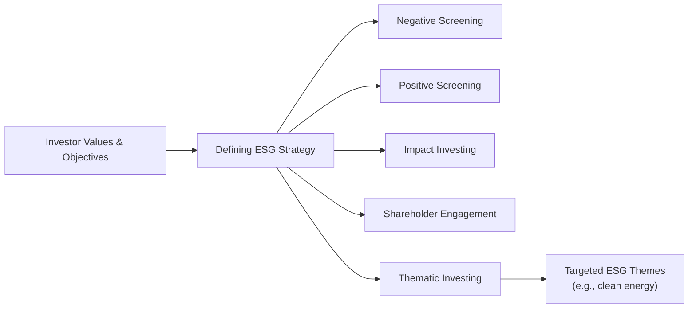
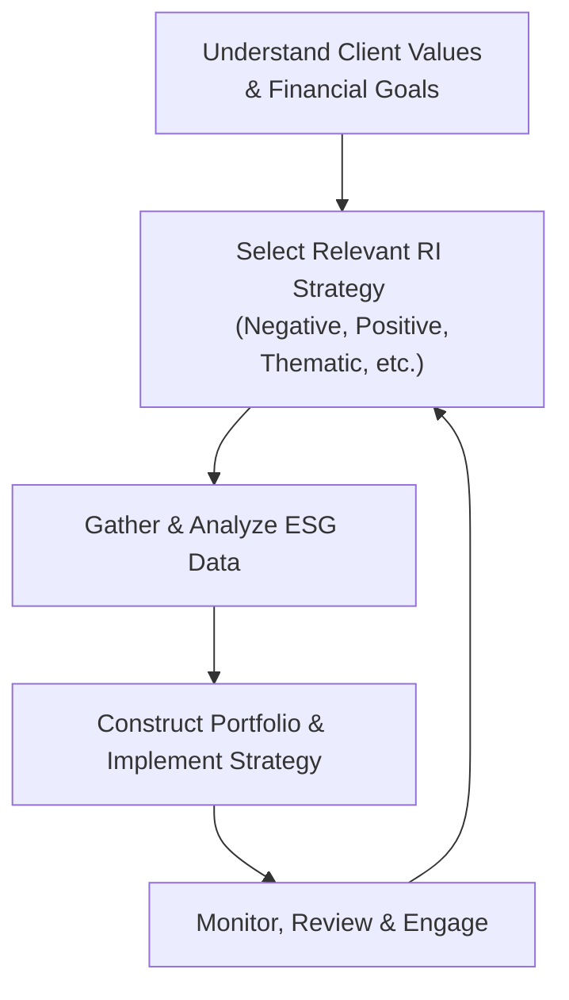

## 4.4 Responsible Investment

When I first heard about Responsible Investment—sometimes called ESG or sustainable investing—I admit I was a bit confused. The words “environmental,” “social,” and “governance” can feel pretty abstract, and I wondered how they could possibly fit into day-to-day investing. Well, as I talked to more clients who wanted to invest in ways that aligned with their values, I realized how critical it is to consider these non-financial factors. It’s not just about saving trees or championing human rights—sometimes it is—but it’s also about risk and opportunity. In other words, ESG can provide a more complete picture of an investment’s long-term potential.

Below, we’ll dive into what Responsible Investment (RI) is, why it matters, how it’s implemented, and what resources and frameworks are available to guide you. While we’re focusing on Canada’s context (where the Canadian Investment Regulatory Organization, or CIRO, oversees investment dealers), many of these ideas have global implications. And if you’re curious about how technology is pushing these developments forward, recall the other sections in Chapter 4 on Fintech, robo-advisory services, and Smart Beta ETFs; they’re part of this bigger story about how the investment world is evolving. Let’s jump in!

### Understanding Responsible Investment

At the heart of Responsible Investment is the idea that investors shouldn’t only concern themselves with financial returns. We naturally want to produce profits for our portfolios or for our clients—but ESG factors can influence whether those profits are sustainable over time. Whether you’re a brand-new investor or a seasoned portfolio manager, you’ll quickly discover that ignoring environmental risks, social impact, or governance structures can leave you exposed to serious pitfalls down the road.

• Environmental factors might include a company’s carbon footprint, resource usage, waste disposal, or approach to tackling climate change.  
• Social factors consider how companies manage staff relations, data privacy, community engagement, and diversity initiatives.  
• Governance factors are all about corporate policies, internal controls, board independence, shareholder rights, and executive compensation.  

In other words, ESG provides a lens that adds more nuance to your investment research, possibly heading off hidden risks or revealing overlooked strengths.

### Motivations for Responsible Investment

Some folks dive into RI because they genuinely want their money to do good—like funding clean energy or supporting fair labor practices. Others do it for more business-minded reasons, like mitigating the increasingly large financial risks of ignoring climate change or ignoring human-rights controversies that can erode a brand’s reputation.

For many advisors in Canada, client demand to “invest responsibly” has been speeding up each year. Investors watch the news, see controversies around environmental spills or labor disputes, and wonder: “Do I really want to be investing in that?” As an advisor, it’s part of your job to understand how to address these concerns, and how to factor them into portfolio strategies. That means mastering an array of ESG approaches, metrics, and frameworks.  

### Core ESG Approaches

There’s no one-size-fits-all approach to RI. Instead, we have different strategies that can be mixed and matched depending on your client’s objectives and values.

Negative Screening  
• This approach excludes certain industries or companies that conflict with the investor’s moral or ethical standards. Common exclusions are tobacco, firearms, gambling, or fossil fuels. They’re typically the “no-go zones.” If your client is ethically opposed to tobacco, for instance, you simply screen out any potential investment involving cigarette manufacturers.  
• It’s straightforward, but it can also limit diversification if you exclude a large swath of the market.

Positive Screening  
• Instead of excluding, positive screening homes in on responsible leaders—a “best in class” approach. For example, you might actively look for companies with exemplary environmental practices, strong worker safety records, or effective governance frameworks.  
• Many global ESG rating providers, such as MSCI ESG Research or Sustainalytics, publish best-in-class reports guiding you toward top performers in each sector.

Impact Investing  
• With impact investing, you actively seek investments that directly produce a desired positive outcome, such as affordable housing, renewable energy, or access to clean water.  
• Impact investing typically requires investors to accept a dual aim: achieve positive social or environmental outcomes while still earning financial returns. This approach might appeal to clients who are passionate about a particular cause.

Shareholder Engagement  
• Another powerful strategy is engaging with companies to influence how they run their business. Shareholders might use proxy votes, direct communication, or proposals at annual general meetings to push for better corporate governance or more robust environmental policies.  
• This approach can create real change when shareholders have enough collective influence (and a willingness to voice concerns).

Thematic Investing  
• Thematic ESG investing zeroes in on a specific theme or sector believed to have significant growth potential while addressing global challenges. Examples might be “clean water technology,” “gender equality,” or “sustainable agriculture.”  
• For instance, your client might instruct you to build an entire portfolio around companies innovating in renewable energy.  

To visualize how these different approaches fit into a broader Responsible Investment strategy, here’s a quick Mermaid diagram:

From clarifying investor values to spelling out how those values come to life in a portfolio, there’s a path for nearly any preference or ideal.

### ESG Metrics: Qualitative and Quantitative

One of the trickier parts of RI is data—what we measure, how we collect it, and how we interpret it. Environmental data might include measuring greenhouse gas emissions in metric tons of CO₂ annually, or how much water a company recycles. Social metrics can be more qualitative, like workforce diversity policies or supply chain labor practices. Governance metrics often require analyzing payment structures, board independence, or shareholder rights.

When selecting an ESG data provider, or deciding to do your own research, remember that not every rating system is the same. That’s partly because different providers weigh and measure ESG factors in different ways. My personal approach is to check at least two providers, just to see if there are major discrepancies. But that can get complicated (and time-consuming), so specialized ESG research and analytics tools often come in handy.

### Aligning Client Values and Financial Goals

Advisors sometimes worry that focusing on responsible investing means sacrificing performance. However, multiple studies—including some from the CFA Institute—suggest companies with strong ESG practices often display greater resilience and reduce downside risk in tough markets. Think of it this way: if a company has lax governance, it’s more prone to lawsuits or scandals. If it has poor environmental controls, it might face fines, higher production costs, or even permanent reputational damage.

But we should also acknowledge the other side of the coin: businesses in certain excluded industries (like oil and gas) sometimes make strong profits. If a client excludes them, are they missing out on gains they would otherwise have enjoyed? That’s a fair question. The right approach lies in clearly communicating the trade-offs, clarifying the client’s moral perspectives, and establishing an investment policy statement that merges financial targets and personal values.

### Case Study: Small Foundation with Big ESG Goals

Let me give you a quick anecdote. I once worked with a small foundation whose charter mandated support for environmental protection. Naturally, they wanted to align their investment portfolio with that same cause. We decided to adopt a thematic investing strategy in clean energy. Sure, we recognized that high volatility might come with early-stage green technology firms. But we balanced it out by choosing some more established renewable energy companies with a strong track record. Additionally, we used positive screening to include only those that performed well compared to their industry peers. Over time, that portfolio provided robust returns, and the board felt confident they were fulfilling both their fiduciary duties and their mission.  

### Regulatory Guidelines and Industry Frameworks

In Canada, you’ll find that CIRO (the Canadian Investment Regulatory Organization) now oversees regulatory compliance for investment dealers, continuing the legacy of the MFDA or IIROC (both of which are now defunct). Meanwhile, you have to keep in mind guidelines from the Canadian Securities Administrators (CSA) on ESG-related fund disclosures and labeling, ensuring that claims about “green” or “sustainable” funds aren’t misleading to stakeholders.

On the global stage, the UN Principles for Responsible Investment (UN PRI) can offer guidance. Signatories pledge to incorporate ESG factors into their investment processes and practice greater transparency. Many Canadian fund managers also look to frameworks such as:  
• The Global Reporting Initiative (GRI)  
• The Sustainability Accounting Standards Board (SASB)  

Both GRI and SASB outline how companies and funds can disclose ESG factors in a standardized manner. This is especially useful for reducing “greenwashing,” or companies inflating their sustainability credentials to attract investors.

### Greenwashing: Recognizing and Avoiding It

With the rise of ESG investing, it’s important to stay on guard against greenwashing. This happens when a company (or fund manager) intentionally misrepresents the extent of their responsible practices. Maybe you’ve heard a CEO brag about “cutting emissions” without mentioning the separate manufacturing facilities that remain dangerously polluting. Or a label claims a fund is “eco-friendly,” but it turns out that only one small part of the portfolio invests in renewable energy, and the rest is riddled with questionable holdings.

Here are some ways to check for greenwashing:

• Scrutinize the underlying holdings in an ESG-labeled mutual fund or ETF. Do they align with the stated ESG objectives?  
• Examine the track record of the sponsor. Are they transparent in reporting ESG analytics and challenges (not just successes)?  
• Look for third-party certifications like B Corp status or recognized data from credible rating agencies like Sustainalytics or MSCI ESG Research.  

### Implementation Steps for Advisors

When you’re setting up a Responsible Investment strategy for a client, you may follow these steps:

Clarify the Client’s Moral and Financial Priorities  
• Kick off by asking open-ended questions. For instance: “Is there anything you’d feel uncomfortable owning in your portfolio?” or “Are there issues you’d like your investment to support?”  

Decide on the RI Approach  
• Assess whether negative screening, positive screening, impact investing, shareholder engagement, or thematic investing suits the client’s objectives best. Often, a blended strategy works wonders.

Integrate ESG Data  
• Choose reliable, transparent data providers. It might be wise to combine data sets to reduce the risk of biased or incomplete information.

Construct the Portfolio  
• Build a well-diversified portfolio that meets both the ESG criteria and the client’s financial goals. Watch out for potential gaps or unintended exposures created by screening out certain sectors.

Monitor and Engage  
• Don’t “set it and forget it.” ESG data changes over time, and companies that look good today might face controversies tomorrow. Ongoing monitoring is central to staying on track.  
• If shareholder engagement is part of the strategy, help the client exercise their proxy voting rights or join collaborative investor initiatives.

Below is a quick Mermaid diagram capturing how an advisor’s process might look:

### Common Challenges

Responsible Investment isn’t always easy. Here are a few pitfalls and how to handle them:

• Limited Data Quality: ESG data can be inconsistent across providers. To mitigate this, use multiple data sources and be prepared for qualitative research.  
• Regulatory Ambiguity: Although progress is being made, regulations around ESG disclosures can vary. Keep an eye on CSA guidance in Canada and developments in global regulations.  
• Over-Exclusion: If you exclude too many sectors or industries, you might narrow your diversification opportunities. Communicate with the client about the trade-offs.  
• Shifting Client Preferences: A client may want to tweak their ESG priorities over time. Plan for periodic check-ins to ensure the portfolio aligns with evolving values.

### Learning and Networking Opportunities

If you’re interested in upping your game, check out some specialized training:

• [CFA Institute Certificate in ESG Investing](https://www.cfainstitute.org/): Offers a deep dive into ESG metrics, standards, and portfolio integration.  
• [RI Academy courses](https://www.unpri.org/professional-development/ri-academy): Developed by the UN PRI to bolster your knowledge of responsible investment.  
• [Responsible Investment Association (RIA)](https://www.riacanada.ca/): A Canadian organization that publishes case studies, reports, and best practices on ESG integration.  
• ESG Ratings Services: [MSCI ESG Research](https://www.msci.com/esg-investing) and [Sustainalytics](https://www.sustainalytics.com/) provide comprehensive data on thousands of companies worldwide.

On the regulatory side, keep an eye on [CIRO](https://www.ciro.ca) for updates affecting investment dealers in Canada and [the Canadian Securities Administrators (CSA)](https://www.securities-administrators.ca/) for guidance on ESG disclosures and fund labeling.  

### Bringing It All Together

Honestly, Responsible Investment can be as straightforward or as sophisticated as you make it. Maybe a small portion of a portfolio employs a negative screen on tobacco, or maybe you launch a comprehensive approach that integrates shareholder engagement, thorough ESG data analysis, and regular reporting. Slower, incremental steps are perfectly fine—sometimes it takes time for clients and advisors to get comfortable with new standards and screening approaches.

At the end of the day, though, the conversation around ESG isn’t going away. Investors—both retail and institutional—are realizing that strong environmental, social, and governance practices can often lead to more stable, long-term business performance. If you incorporate these practices in a transparent way, you can serve your clients more holistically, help them achieve both financial and moral objectives, and stay one step ahead in a rapidly evolving marketplace.

### References for Further Exploration

• [Canadian Investment Regulatory Organization (CIRO)](https://www.ciro.ca)  
• [The Canadian Securities Administrators (CSA)](https://www.securities-administrators.ca/)  
• [Global Reporting Initiative (GRI)](https://www.globalreporting.org/)  
• [Sustainability Accounting Standards Board (SASB)](https://www.sasb.org/)  
• [Responsible Investment Association (RIA)](https://www.riacanada.ca/)  
• [CFA Institute Certificate in ESG Investing](https://www.cfainstitute.org/)  
• [RI Academy (UN PRI)](https://www.unpri.org/professional-development/ri-academy)  
• [MSCI ESG Research](https://www.msci.com/esg-investing)  
• [Sustainalytics](https://www.sustainalytics.com/)

And if you want to circle back to how technology tools provide data and help automate ESG filtering, you might revisit the earlier sections on Fintech (4.1), Robo-Advisory Services (4.2), and Smart Beta ETFs (4.3) to see how modern investment management naturally intersects with responsible investing.

---

## Test Your Knowledge: Responsible Investment Strategies



### Which of the following best describes Responsible Investment (RI)?

- [x] An investment approach that integrates ESG factors into decision-making. 
- [ ] A strategy focused solely on maximizing short-term returns. 
- [ ] A passive strategy that ignores a company's social impact. 
- [ ] An approach that prohibits all technology companies from the portfolio.

> **Explanation:** Responsible Investment (RI) focuses on incorporating Environmental, Social, and Governance (ESG) considerations into the investment process, not just financial factors.

### What is an example of negative screening in ESG investing?

- [ ] Investing heavily in fossil fuel companies.
- [ ] Allocating capital only to top ESG performers.
- [x] Excluding tobacco or firearms manufacturers from a portfolio.
- [ ] Buying index funds that track the entire market without exception.

> **Explanation:** Negative screening involves cutting out certain industries or companies that go against the investor's ethical or sustainability criteria.

### Which statement is most accurate about shareholder engagement?

- [ ] It has no impact on corporate policies or decisions.
- [ ] It is only practiced in small private companies.
- [x] It involves using ownership rights (like proxy voting) to influence corporate behavior.
- [ ] It requires investors to sell their shares immediately if they disagree with management.

> **Explanation:** Shareholder engagement means actively using your rights as an investor (e.g., voting on shareholder proposals) to push for improved ESG practices.

### Impact investing is specifically characterized by:

- [ ] Achieving only financial returns, without regard to social or environmental change.
- [ ] Passive index-based investing that mirrors the market average.
- [x] Focusing on solutions that generate measurable environmental or social impact along with financial returns.
- [ ] Excluding all publicly traded companies from the portfolio.

> **Explanation:** The key hallmark of impact investing is its intention to create positive social or environmental outcomes alongside financial gain.

### Which organization provides widely used ESG-related principles for investors?

- [ ] Bank of Canada
- [ ] G8
- [x] UN PRI (United Nations Principles for Responsible Investment)
- [ ] Canada Revenue Agency

> **Explanation:** The UN PRI gives international principles and guidance for integrating ESG factors into investment processes.

### One primary challenge of using ESG metrics in portfolio construction is:

- [ ] The data is perfectly consistent across all providers.
- [x] Different ESG rating agencies often weigh and measure factors differently.
- [ ] All ESG factors can be captured using a single numeric value.
- [ ] ESG is only relevant to the largest mutual fund providers.

> **Explanation:** ESG data is often delivered in diverse formats and methodologies. This lack of uniformity can create confusion or inconsistencies in evaluating companies.

### Greenwashing can be best described as:

- [ ] A method of precisely measuring carbon emissions.
- [x] Misrepresenting how sustainable or ethical a company’s practices truly are.
- [ ] A standard governance practice to clean company finances.
- [ ] A regulatory requirement enforced by CIRO.

> **Explanation:** Greenwashing is when companies mislead stakeholders by overstating their ESG credentials, effectively painting a rosier picture than reality.

### Which approach focuses on selecting “best-in-class” ESG performers rather than excluding certain industries?

- [ ] Negative Screening
- [x] Positive Screening
- [ ] Shareholder Engagement
- [ ] Thematic Investing

> **Explanation:** Positive screening (also known as best-in-class) involves actively picking the strongest ESG performers within any given industry.

### According to studies and industry observations, companies with robust ESG practices tend to:

- [ ] Have greater short-term risks only.
- [x] Demonstrate resilience and reduced downside risk over the long term.
- [ ] Show consistently low volatility to the point of no return fluctuations.
- [ ] Always underperform traditional market benchmarks.

> **Explanation:** While performance can vary, there’s evidence that companies with strong ESG frameworks often manage risk more effectively, enhancing long-term resilience.

### In Canada’s regulatory environment, which organization is currently responsible for overseeing investment dealers and ensuring compliance with ESG fund disclosures?

- [x] CIRO (Canadian Investment Regulatory Organization)
- [ ] MFDA (Mutual Fund Dealers Association of Canada)
- [ ] IIROC (Investment Industry Regulatory Organization of Canada)
- [ ] CIPF (Canadian Investor Protection Fund)

> **Explanation:** As of 2025, CIRO is the single national self-regulatory organization that oversees investment dealers and mutual fund dealers. MFDA and IIROC are historical predecessor SROs that ceased to exist separately after their amalgamation.


