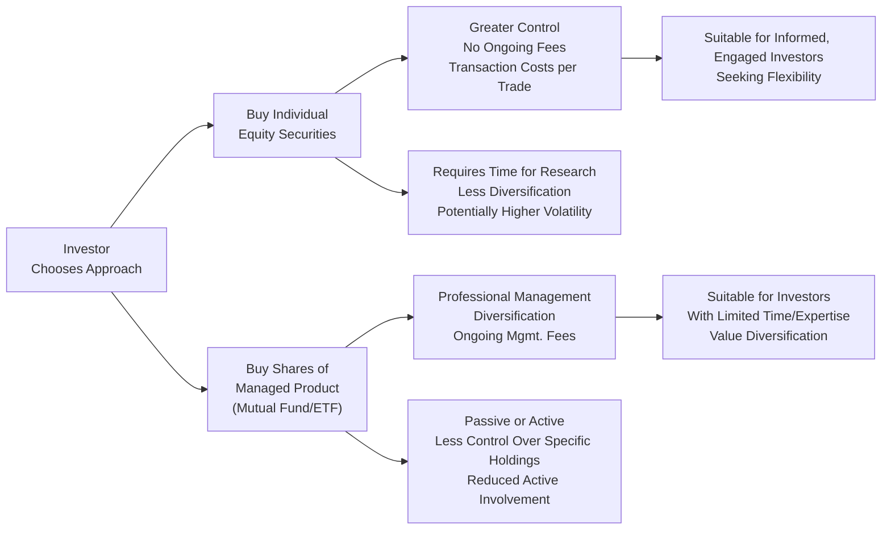

## 5.1 Factors to Consider When Deciding Between Individual Equity Securities and Managed Products

Picture this: you’ve got a chunk of savings, and you’d really like to invest in something that might grow over time. Suddenly, the internet is telling you there’s a universe of options out there—stocks, mutual funds, ETFs, segregated funds, and so on. You ask your buddy, “Should I invest in individual equities?” And maybe your friend says, “Nah, try an ETF.” But you’re not entirely sure why. That’s exactly the puzzle we’ll try to solve in this section. We’ll walk through the main factors that set individual equity securities apart from managed products. By the end, hopefully, you’ll have a clearer sense of how to match the right approach with your goals, preferences, and constraints.

Before we dive in, it’s good to note how this topic fits into the bigger picture. Chapters 1 and 2 of this book talk broadly about the portfolio management process and understanding a client’s risk profile (which, let’s be honest, is a bit like understanding your own comfort level with roller coasters). Chapter 3 then addresses asset allocation. Now, in Chapter 5, we’re talking specifically about “Equity Securities,” and here in 5.1 we’ll focus on those unique decisions around choosing to buy individual shares or to step into the world of managed products (e.g., mutual funds, ETFs, segregated funds).

Let’s do this step-by-step, exploring what exactly you should keep in mind when making your choice.

---

## Understanding Our Two Main Characters

Before comparing, let’s clarify:

• Individual Equity Securities: This means directly buying stocks of companies—say, 100 shares of a major tech giant or 50 shares of a local Canadian bank. You call the shots on each purchase or sale. It’s a bit like running your own show.  
• Managed Products: This typically includes mutual funds, exchange-traded funds (ETFs), segregated funds, and other specialized vehicles that pool money from investors and invest it according to a specific mandate (like tracking an index, focusing on particular sectors, or aiming for a balanced approach). These are overseen by professional portfolio managers or by systematic approaches.

---

## The Appeal of Individual Equity Ownership

### Control and Transparency

One of the big selling points of buying individual stocks is the control factor. Suppose you’re deeply passionate about the environment—then you might choose only environmentally friendly or impact-oriented companies. You literally get to pick the puzzle pieces that make up your portfolio. You also know exactly what you own at all times—no hidden instruments or unexpected exposures. In addition, if you own voting shares, you get voting rights, meaning you can influence corporate governance (in small ways, typically) by participating in shareholder meetings or voting by proxy.

### Cost Structure (But Mind the Transaction Fees)

Individual equities usually don’t come with ongoing management fees. Good news, right? Well, not so fast. Each time you trade, you’ll encounter transaction fees—brokerage commissions, sometimes exchange fees. If you’re not trading a lot, this might be minimal. But frequent trading can rack up a surprising bill. You also want to keep an eye on spreads (the difference between the buying price and the selling price). Over many trades, these costs add up.

### Potential for High Upside

Investing in individual stocks can, in theory, yield outsized gains if you pick a high-growth winner. If you’re an active investor who diligently researches companies, you could stumble upon the next big thing. That said, this is definitely not guaranteed—stocks can just as easily move downward.

### Suitability for Longer-Term and Short-Term Traders

Some individuals hold shares for decades (like the classic “buy and hold” approach championed by famous investors), while others trade frequently seeking short-term gains. If you like having your finger on the pulse of daily market movements and you trust your own research, you might find owning individual equities a thrilling ride.

---

## The Benefits (and Realities) of Managed Products

### Instant Diversification

Let’s say you’ve only got $1,000 to invest. Trying to build a well-diversified basket of 20 or 30 stocks might be expensive and time-consuming. But if you buy units of a mutual fund or shares of an ETF, you could spread that money across dozens—if not hundreds—of different companies or sectors. This diversification can help reduce a portfolio’s overall risk, a theme we revisit in Chapter 16 (Managing Your Client’s Investment Risk).

### Professional Management

Managed products come with the expertise of portfolio managers or a structured method (like an index strategy). If you’re someone who doesn’t want to track earnings reports or economic metrics weekly, handing over the reins to professionals might be a relief. They do the rebalancing, the deep dives into company fundamentals, and the day-to-day decision-making on your behalf.

### Lower Effort, Ongoing Fees

Sure, the convenience of managed funds isn’t free. Mutual funds typically have management expense ratios (MERs), which can incorporate both administrative fees and the manager’s cut. ETFs often come cheaper in fees, especially index-based ones, but you still pay some management cost and brokerage commissions when buying or selling. If your preference is to “set it and forget it,” managed products may be worth the price.

### Liquidity and Ease of Trading

For large, popular ETFs, liquidity is often quite good, meaning you can easily buy or sell. Mutual funds might only trade once a day at net asset value, so they’re a bit less flexible than stocks or ETFs. Segregated funds can have additional nuances, including potential insurance guarantees or maturity benefits, but typically involve redemption fees if you withdraw too soon.

---

## Key Considerations

### 1) Investment Objectives and Risk Tolerance

• Objective: Are you targeting growth, income, or a bit of both? For instance, if you’re trying to build a dividend-oriented portfolio, you might cherry-pick high-dividend stocks. Alternatively, a dividend-focused mutual fund or ETF can do this for you—but again, it’ll cost you management fees.  
• Risk Tolerance: Some folks are comfortable with big price swings (higher volatility). Others feel queasy the moment their stock drops 5%. For the latter, a broad, diversified managed product might reduce the stress. Remember, though, that diversification does not eliminate risk entirely—it just spreads it around to some degree.

### 2) Time Horizon and Liquidity Needs

• Short-Term Horizon: If you’re more of a trader, you may want the direct control and immediate trading options that come with individual stocks (or even an active trading strategy).  
• Long-Term Horizon: If you’re saving for retirement and have 10+ years, managed products might help you stay disciplined. Still, if you have a preference for direct engagement with specific companies, you might opt for individual equities.  
• Liquidity: Both individual stocks and most managed products are relatively liquid, but watch out for any redemption periods or restrictions in certain funds (like some specialized hedge funds or segregated funds).

### 3) Diversification and Portfolio Management

• Effort Required: Constructing a well-diversified portfolio using individual stocks requires analysis of multiple sectors, geographies, and risk factors. It’s doable, but time-consuming.  
• Managed Options: Many mutual funds, ETFs, and segregated funds aim for broad diversification. An ETF that tracks a major index (like the S&P/TSX Composite in Canada or the S&P 500 in the U.S.) is diversified across many companies automatically.

### 4) Cost Structures

• Transaction and Brokerage Fees: For individual equities, these can be meaningful if you trade often.  
• Management Expense Ratios (MERs) + Performance Fees: Mutual funds might charge 1% to 3% or more annually. ETFs can be as low as 0.05% for certain passive index funds or as high as 1%+ for specialized strategies. Hedge funds or certain alternative products can have performance fees, typically known as “2 and 20” (2% annual management fee and 20% of gains above a certain threshold).

### 5) Transparency and Control

• Direct Ownership: If you buy stocks directly, you know exactly what you hold. There’s no guesswork about the underlying companies.  
• Managed Products: Some mutual funds and hedge funds may not disclose their real-time holdings. While most ETFs publish holdings daily, the complexity can be high if it’s an index that rotates holdings frequently. Additionally, with managed products, you relinquish active decision-making to the manager or the investment mandate.

### 6) Regulatory Considerations

In Canada, the Canadian Investment Regulatory Organization (CIRO) oversees investment dealers, mutual fund dealers, and their trading activities. Historically, we had the Mutual Fund Dealers Association of Canada (MFDA) and the Investment Industry Regulatory Organization of Canada (IIROC), but those are now defunct predecessor SROs.  
• Suitability Analysis: Your advisor or dealer is required to ensure any recommended product aligns with your objectives, risk tolerance, and knowledge under CIRO rules.  
• Know-Your-Client (KYC) Obligations: This means brokers can’t just sell you a random product; they have to make sure it “makes sense” for you financially and personally.  
• Specialized Products: Certain private funds or alternative strategies (like some hedge funds) might require investors to be “accredited,” typically meaning a certain level of income or net worth.  

### 7) Tax Considerations

We discuss taxes more thoroughly in Chapter 15 (International Taxation) and Chapter 17 (Impediments to Wealth Accumulation). However, be aware that:  
• Capital Gains/Losses: Selling individual stocks can generate capital gains or losses. Mutual funds and ETFs can also distribute capital gains—sometimes unpredictably if the manager buys or sells underlying holdings.  
• Dividend Tax Credits: Eligible Canadian dividends from individual stocks might be more tax-efficient for Canadian investors. With funds, the manager may or may not pay out dividends in a tax-efficient manner.  
• Foreign Tax Withholding: Some ETFs or mutual funds investing internationally may face foreign withholding taxes on dividends.

---

## Personal Anecdote: My First Big Decision

I used to think I was a total stock-picking genius because I read a few annual reports and recognized some “strong brands.” So I poured money into a handful of individual companies. Well, one or two soared, but one in particular tanked after a series of really poor earnings. Ouch. Meanwhile, a broad-based ETF I also held chugged along without giving me heartburn. That experience reminded me that while individual equities can deliver great returns, you must willingly accept the possibility of big losses and the time commitment to stay on top of corporate health. That’s why diversification (through managed products or a carefully balanced personal portfolio) is a key theme.

---

## Practical Example: Building vs. Buying Diversification

Consider an investor, Maria, who has $50,000 to invest and wants exposure to the Canadian equity market.

• If Maria chooses individual stocks, she might pick 10 companies spanning different industries (finance, resources, technology, consumer goods, etc.). She’ll need to research each carefully, stay updated on earnings, and rebalance periodically. If any one company falters, her returns might take a big hit.  
• If Maria chooses a Canadian equity ETF that tracks a broad index like the S&P/TSX Composite, she’s instantly diversified across dozens of companies. She pays an annual expense ratio but doesn’t have to juggle much ongoing maintenance. Maria can comfortably revisit her positions once a quarter (or even less).

---

## Illustrative Diagram

Let’s visualize the key differences between investing in an individual equity and investing in a managed product:

In this diagram, you can see how your path forks the moment you decide to purchase individual stocks (B) or a managed product (C). One road emphasizes personal control, the other emphasizes diversification and professional management.

---

## Suitability Analysis in Action

One of the most crucial aspects of personal finance is to align what you buy with who you are—and we’re not just talking about your personality in a whimsical sense. It’s about your financial situation, goals, risk capacity, and knowledge. This alignment is known as a “suitability analysis”:

• **Quantitative Measures:** Historical returns, estimated portfolio variance, correlation, and so forth.  
• **Qualitative Considerations:** Your comfort in reading financial statements, your responsiveness to volatility, your tax situation, your personal beliefs about certain industries, and your personal biases/triggers.  

In Canada, your advisor is bound by CIRO regulations, which require them to gather your KYC information and ensure their recommendations square up with your profile.

---

## Regulatory and Compliance Frameworks

• **CIRO (Canadian Investment Regulatory Organization):** Overseeing investment and mutual fund dealers in Canada.  
• **CSA (Canadian Securities Administrators) National Instrument 31-103:** Covers registration requirements and rules around product suitability.  
• **SEDAR+ (https://www.sedarplus.ca):** The go-to database for public company disclosures and financial statements—helpful if you want to do your own deep-dive research on a company or fund.  

If you need more detail:  
• Visit CIRO at https://www.ciro.ca for rule interpretations, enforcement updates, and investor guides.  
• Check out the Canadian Securities Administrators website for national instruments and policy statements on investor protection.  

---

## Common Pitfalls and Challenges

• **Overconcentration:** Even if you think you’ve found the next big stock, going “all-in” can be dangerous if the company underperforms or if the market shifts.  
• **Fee Overload:** If you hold multiple mutual funds and don’t pay attention to their MERs, you might end up paying more than you realize each year.  
• **Chasing Performance:** Many investors jump into a hot sector or chase a top-performing fund, only to find the market cyclical and the outperformance short-lived.  
• **Ignoring Behavioral Biases:** Overconfidence can lead to holding onto losers for too long or trading too frequently. Don’t discount the emotional aspect of investing, something we explore in Chapter 2 (Understanding a Client’s Risk Profile) and Chapter 16 (Managing Your Client’s Investment Risk).

---

## Best Practices

• **Set Clear Goals:** Know what you’re saving for—retirement, a house, an emergency fund, your kid’s education—and match your investment strategy to that timeline and goal.  
• **Calculate Overall Costs:** Tally up trading commissions (if buying individual stocks frequently) vs. the ongoing management fees for funds.  
• **Stay Diversified:** Even if you love picking individual stocks, consider balancing your portfolio with some broader exposure.  
• **Review Periodically:** At least once or twice a year, re-evaluate your holdings to ensure they still align with your objectives and risk tolerance.  
• **Take Advantage of Tools:** Use free ETF screeners, online broker platforms, or financial software to test different portfolio mixes.  
• **Maintain Discipline:** Trends and fads come and go. A well-thought-out plan grounded in your personal situation often beats reactive decisions.

---

## Case Studies

### Case Study 1: The Overzealous Beginner

Meena, a recent university grad, hears her friend made a windfall on a hot tech stock. She invests her entire savings in a few tech names without fully understanding the companies’ balance sheets or future earnings potential. The result? After a short rally, the sector nosedives. Meena ends up with substantial losses. A more balanced approach (like an ETF that covers various sectors) might have reduced the downslide to a tolerable level.

### Case Study 2: The Retiree Preferring Steady Payments

George is nearing retirement and values stability. He invests in dividend-paying blue-chip stocks. While this offers consistent income, his portfolio is mostly in domestic financials and utilities. Over time, he realizes he might benefit from some international diversification to soften sector-specific risks. He adds an international equity ETF to spread his risk globally.

---

## Glossary

• **Mutual Fund:** A professionally managed fund pooling money from investors to buy securities (stocks, bonds, etc.).  
• **Exchange-Traded Fund (ETF):** A basket of securities that tracks an index or sector, trading on stock exchanges like an individual stock.  
• **Liquidity:** The ease of buying/selling an asset without drastically affecting its price.  
• **Managed Products:** Investment vehicles (e.g., mutual funds, segregated funds) overseen by professional managers, charging fees for active or passive management.  
• **Transaction Fee:** A cost incurred when buying or selling securities (broker commissions, exchange fees, etc.).  
• **Performance Fee:** A fee charged by some managers based on a percentage of profits earned.  
• **Suitability Analysis:** Ensuring an investment product or strategy aligns with a client’s objectives, risk tolerance, and time horizon.  
• **CIRO:** Canada’s national self-regulatory organization overseeing multiple facets of the country’s investment industry.

---

## Additional Resources for Deeper Insights

• **CIRO Regulations on Suitability Analysis:** https://www.ciro.ca  
• **Canadian Securities Administrators (CSA) National Instrument 31-103:** https://www.securities-administrators.ca  
• **SEDAR+:** https://www.sedarplus.ca  
• **Books:**  
  - “Common Sense on Mutual Funds” by John C. Bogle (for a straightforward look at managed products).  
  - “One Up on Wall Street” by Peter Lynch (for tips on individual stock selection).  
• **Online Courses:**  
  - “Investment Management” by the University of Geneva on Coursera.  
  - “Fundamentals of Investing” by the New York Institute of Finance on edX.

---

## Concluding Thoughts

Choosing between individual equity securities and managed products isn’t a one-size-fits-all decision. It’s more like a balancing act—your time, interest, risk tolerance, and objectives all come into play. If you love digging into company details and you’ve got the discipline, owning individual stocks can be super satisfying (and potentially very profitable). But if you’d rather spend weekends doing anything other than scrutinizing quarterly earnings, managed products likely provide a smoother ride, albeit with management fees.

Ultimately, consider working with a qualified advisor who can conduct a thorough suitability analysis, especially if you’re uncertain about your own investing style or time availability. Keep learning, keep exploring, and remember: the best investment plan suits not only your financial profile but also your lifestyle and comfort level. That’s how you can confidently harness the power of equity markets.

---

## Practice Your Knowledge on Equity Securities and Managed Products



### 1. Which of the following is typically TRUE about buying individual equity securities?

- [x] You have direct control over each stock choice.  
- [ ] You always pay lower overall fees than a managed product.  
- [ ] You never incur transaction costs.  
- [ ] You can easily diversify in one or two trades.  

> **Explanation:** When you buy individual stocks, you have control over specific companies, but you’ll also face transaction costs, and achieving broad diversification requires multiple purchases.

### 2. When comparing ETFs to mutual funds, which statement is generally correct?

- [ ] ETFs have higher expense ratios than mutual funds.  
- [x] ETFs often provide real-time pricing and intraday liquidity.  
- [ ] Mutual funds can be bought and sold any time during the trading day.  
- [ ] ETFs are not regulated in Canada.  

> **Explanation:** ETFs trade on exchanges, so you can buy or sell throughout the trading day. Mutual funds settle once daily at net asset value.

### 3. Which scenario might favor a managed product over individual stock selection?

- [x] Someone with limited time and desire to research companies.  
- [ ] An investor who wants full control of individual stock picks.  
- [ ] A day trader speculating on short-term price movements.  
- [ ] An investor with no interest in portfolio diversification.  

> **Explanation:** Managed funds can be suitable for investors who lack the time or expertise to analyze individual stocks closely.

### 4. What is a known disadvantage of investing in individual equity securities?

- [x] It can be time-consuming to research and monitor each equity.  
- [ ] There are always higher annual fees compared to a mutual fund.  
- [ ] It’s impossible to take advantage of dividends.  
- [ ] It’s not suitable for any type of investor.  

> **Explanation:** Investing in individual stocks requires significant research and monitoring, which can be a disadvantage if you have limited time or expertise.

### 5. Which of the following statements regarding diversification is accurate?

- [x] Managed products like index funds often spread risk across many underlying companies.  
- [ ] Investing in an individual gold mining company alone is highly diversified.  
- [x] ETFs tracking a broad index can help mitigate company-specific risk.  
- [ ] Buying shares of one bank sufficiently protects you against market volatility.  

> **Explanation:** Index-based ETFs or broad mutual funds typically hold multiple securities, reducing the exposure to any single company’s performance.

### 6. How should a Canadian investor approach regulatory requirements when deciding between individual stocks and managed products?

- [x] Ensure compliance with CIRO regulations and complete a suitability analysis.  
- [ ] Only research defunct organizations like MFDA and IIROC.  
- [ ] Ignore KYC obligations and invest immediately.  
- [ ] Rely solely on the company’s marketing materials.  

> **Explanation:** Under CIRO, advisors and dealers must ensure products are suitable for clients, emphasizing the importance of KYC and compliance with Canadian regulations.

### 7. What is a typical advantage of a mutual fund over a single-stock portfolio?

- [x] It’s automatically diversified across multiple securities.  
- [ ] It carries zero management fee.  
- [x] It requires less investor supervision in day-to-day corporate events.  
- [ ] It has no possibility of capital losses.  

> **Explanation:** Mutual funds offer automatic diversification and professional management, usually requiring less daily involvement from the investor.

### 8. Which best describes a primary cost consideration with individual equities?

- [x] Transaction fees and possible bid-ask spreads with frequent trades.  
- [ ] High ongoing management expense ratios (MERs).  
- [ ] Mandatory performance fees paid annually.  
- [ ] No costs, as buying a stock is always free in Canada.  

> **Explanation:** When trading individual stocks, investors often face commission costs and the hidden cost of bid-ask spreads, especially with frequent trades.

### 9. When might segregated funds be an appropriate choice for an investor?

- [x] They seek insurance benefits or guarantees.  
- [ ] They want to day-trade and frequently rebalance.  
- [ ] They demand intraday liquidity like ETFs.  
- [ ] They’re looking for zero fees.  

> **Explanation:** Segregated funds often come with insurance features, such as capital guarantees at maturity, which may appeal to certain risk-averse or estate-planning-focused investors.

### 10. True or False: A suitability analysis focuses solely on a client’s desire for high returns.

- [x] True  
- [ ] False  

> **Explanation:** Actually, this statement is False. A suitability analysis considers a client’s entire financial situation, risk tolerance, and investment objectives, not just their desire for returns.  


