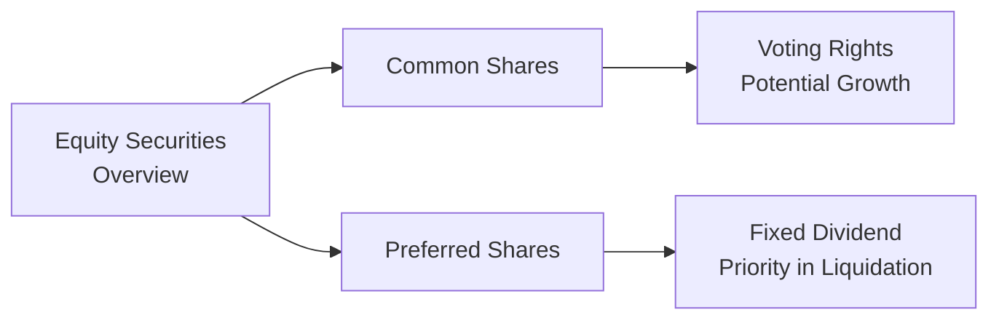
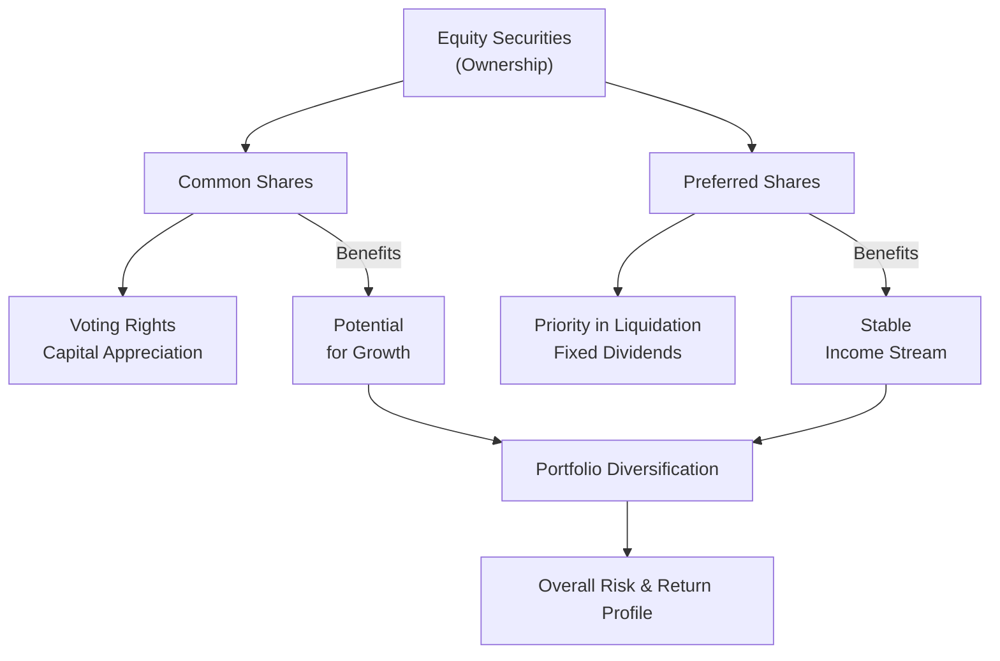

## 5.2 The Characteristics and Features of Equity Securities

Equity securities—often referred to as stocks or shares—are a cornerstone of many investment portfolios. And, you know, I’ve always had a bit of a soft spot for them because they represent real ownership in a company. That means, in a sense, you’re not just an investor, you’re a co-owner. Whether you hold a single share or millions, your investment entitles you to a slice of the firm’s future. But what does ownership really mean? Let’s dive into the essential features, rights, and responsibilities that come with holding equity securities in Canada—while also touching on considerations that resonate globally.

Before we zoom in on all the nitty-gritty details—like par value, dividends, voting rights, or market capitalization—let’s start with the big picture. We’ll compare common shares and preferred shares (the two main equity types), walk through real-life examples, and see how each type might fit into a portfolio. We’ll also take a journey into corporate governance, because, let’s face it, how a company is run can make or break your investment.

---
  
### Common Shares vs. Preferred Shares
Most investors, from absolute beginners to seasoned pros, start their equities journey with common shares or preferred shares. Here’s the difference in plain language:

• Common Shares (Common Stock):  
  – Voting Rights: Common shareholders typically get voting rights in important company decisions—like electing a board of directors, approving major corporate transactions, or occasionally deciding on stock splits.  
  – Capital Appreciation Potential: If the company grows and flourishes, the value of your shares can skyrocket. There’s, in theory, no ceiling on upside (though there’s no guaranteed floor either).  
  – Dividends: Dividends are not guaranteed. Companies might pay regular dividends, special dividends, or skip them altogether depending on their cash flow and strategic goals.  
  – Liquidity: Common shares are usually the most actively traded portion of a company’s equity, making it easier to buy or sell them on major exchanges.  

• Preferred Shares (Preferred Stock):  
  – Fixed Dividends: Preferred shareholders often receive a set dividend (e.g., 5% annually of the share’s issue price). This can offer more predictable income.  
  – Priority in Liquidation: If the company is sold off or goes bankrupt, preferred shareholders get paid before common shareholders (though still after bondholders).  
  – Limited Voting Rights: Typically, preferred shareholders don’t get to vote on corporate matters unless certain conditions or events occur, like missed dividend payments.  
  – Convertible or Retractable Features: Some preferred shares can convert into common shares or be redeemed by the issuer, providing added flexibility.

Here’s a quick visual to show the structural differences between common and preferred shares:

(Imagine each of these boxes representing a different fork in the road when you’re deciding which type of equity best suits your investment goals. Sometimes you might want the big upside and voting rights of common shares, while other times, the reliability of fixed dividends from preferred shares is more appealing.)

---

### Par Value, Market Value, Book Value, and Intrinsic Value
Equity investors rely on multiple “value” concepts to gauge whether a share is worth buying or selling. Let’s define these four main measurements:

• Par Value  
  – This is a nominal dollar value assigned to a share when it’s originally issued. In many modern markets, par value has little economic relevance beyond certain legal or accounting contexts. Some shares are even issued with “no par value” to avoid confusion.  
  – It’s helpful to think: par value is mostly an artifact. You won’t usually see it direct your investment decisions.

• Market Value  
  – This is the price at which shares trade on an exchange. Market value is determined by supply and demand—a tug-of-war between buyers and sellers.  
  – Changes by the second, influenced by investor sentiment, economic data, company performance, and, well, sometimes just plain old speculation.

• Book Value  
  – Represents the net value of a company’s assets minus its liabilities, as recorded on the balance sheet.  
  – Book value per share = (Total equity) ÷ (Number of outstanding shares).  
  – Particularly important for value investors who like to see if a company’s market price is below its accounting-based valuation.

• Intrinsic Value  
  – The “true” or “fair” value of a share, based on fundamental analysis of the company’s prospects, expected future cash flows, risk factors, and growth potential.  
  – Often requires more sophisticated models—like discounted cash flow (DCF), dividend discount, or other valuation approaches.  
  – Intrinsic value may differ dramatically from the current market price; that difference can present potential investment opportunities.  

If you’re thinking, “But I see all these values… which one matters most?” The honest answer is they can all matter, depending on your perspective and strategy. Market value directly affects the price you pay or receive. Intrinsic value is the investor’s best guess at whether that market price is fair. Meanwhile, book value provides a more static, balance-sheet-based anchor.

---

### Dividend Distribution and DRIPs
Let’s say you own common shares in a profitable company. There’s a chance you’ll receive periodic dividends—like monthly, quarterly, or annually—based on the company’s profits and board decisions. Dividends aren’t a guarantee, but many established firms (think large banks or utility companies) pride themselves on consistent payouts.

• Regular Dividends: Often announced quarterly. If a company has a strong, stable cash flow, it might distribute part of its earnings to shareholders regularly.  
• Special Dividends: One-time payments that can be bigger than usual—often a sweet surprise if the company has extra cash from an asset sale or a strong year.  
• Dividend Reinvestment Plans (DRIPs): Some companies (and brokerage platforms) let you automatically reinvest cash dividends into more shares. It’s a neat way to gradually build your position without paying additional brokerage commissions.

Fun personal anecdote: One friend of mine started small in a DRIP program with a Canadian telecom stock. Well, he just kept plugging away, reinvesting all dividends. Over 15 years, that position has grown enormously. He barely paid attention in the interim, but each quarter, like clockwork, more shares got added. It's not a flashy strategy, but it’s a great example of time and compounding doing their magic.

---

### Shareholders’ Rights and Responsibilities
Owning common shares makes you a part-owner. That’s a big deal! So what exactly are your rights?

• Voting: Common shareholders generally vote on big corporate matters, such as electing the board of directors, mergers, or major policy changes.  
• Proxy Voting: If you can’t attend the company’s annual general meeting in person, you can vote by proxy.  
• Right to Inspect Corporate Documents: Under certain conditions, you can review corporate records.  
• Shareholder Activism: While not common for casual investors, some institutional or high-net-worth shareholders attempt to influence management decisions. They might push for changes in strategy or try to replace board members if they feel the company isn’t well-managed.

On the flipside, responsibilities! With rights come duties:  
• Staying Informed: Even as a minor shareholder, you should keep up with the company’s news, finances, and announcements.  
• Complying with Regulations: In some cases, certain insider trading rules may apply (e.g., if you work for the company or have non-public information).  
• Engaging Thoughtfully: Participating in annual meetings or proxy votes helps maintain good corporate governance.

---

### Corporate Governance and the Role of the Board of Directors
Corporate governance is the framework that ensures a company operates ethically, responsibly, and in the best interest of its shareholders. The board of directors represents the shareholders’ interests—monitoring and guiding executive management.  

Why does this matter? Good governance often correlates with better strategic decisions, risk management, and overall corporate health. Conversely, poor governance can lead to scandals, mismanagement, or even financial collapse. For instance, in some high-profile corporate scandals of the past, an inattentive board failed to spot red flags or hold executives accountable.

Key governance points that might influence your equity investment:  
• Board Composition: Are the directors independent? Do they have relevant expertise?  
• CEO/Chair Separation: Sometimes it’s good practice to have different people serving as board chair and CEO, to avoid power concentration.  
• Ethics and Transparency: How well does a company disclose its financials, plans, and risks to shareholders?  
• Shareholder Protections: Some companies have practices that protect minority shareholders, others may not.  
• Regulatory Compliance: In Canada, corporate governance standards are shaped by the Canada Business Corporations Act (see https://laws-lois.justice.gc.ca/eng/acts/c-44/), as well as guidelines from securities regulators and bodies like CIRO (https://www.ciro.ca).  

---

### Market Capitalization and Company Size
Market capitalization, or market cap, is simply the company’s share price multiplied by its total number of outstanding shares. And trust me, this number can influence how you look at and trade a stock:

• Small-Cap: Typically includes companies with a relatively lower market capitalization—sometimes under $2 billion, depending on the classification system used. Often these firms offer higher growth potential because they’re in earlier stages, but they can be more volatile and riskier.  
• Mid-Cap: A step up in size—these might be established companies still in their expansion phase.  
• Large-Cap: Usually stable, leading brands in mature markets. While they may deliver steady returns, they aren’t typically the rocket ships that small-caps can be. Yet they tend to provide more consistency, stronger dividend histories, and widely recognized business models.  

Market cap matters because it translates to liquidity and risk profiles. Many investors like to diversify across different market caps to balance out potential growth and stability.

---

### Liquidity Factors: Exchanges, Trading Volume, and Spreads
Liquidity refers to how easily you can buy or sell shares without significantly affecting their market price. The more liquid a market is, the simpler it is to enter or exit a position.

• Major Exchanges: Stocks listed on the Toronto Stock Exchange (TSX) or the New York Stock Exchange (NYSE) often have higher daily trading volumes, leading to tighter bid-ask spreads and better liquidity.  
• Over-the-Counter (OTC) Markets: Some smaller or foreign companies might trade OTC, where liquidity is less robust, and bid-ask spreads are often wider.  
• Trading Volume: Heavier trading volume suggests more investors are participating, which usually translates into easier trades at or near current market quotes.  

One time, I tried to buy a thinly traded small-cap name that had an exciting growth story. The order sat there, unfilled, for days. Eventually, I had to pay a higher price than I had hoped. Moral of the story? Low liquidity can be frustrating.  

---

### Role of Equity Securities in a Diversified Portfolio
Equity securities can serve various functions within a broader investment strategy. Depending on your goals:

• Growth: Common shares, especially small- or mid-caps, are often used to seek capital appreciation over time.  
• Income: Dividend-paying shares—whether common or preferred—can provide a steady income stream, particularly in retirement portfolios.  
• Sector or Industry Exposure: Want a piece of the tech world, energy sector, or maybe real estate investment trusts (REITs)? Equities let you target specific industries or themes.  
• Inflation Hedge: Over the long run, stock prices can rise with inflation, albeit not perfectly.  

That said, equities aren’t always a one-size-fits-all solution. They can be volatile. Including bonds, cash, or alternative investments—like real estate or commodities—can mitigate some equity risk. (If you’d like to learn more about building such an allocation, see Chapter 3 of this book, “Asset Allocation and Investment Strategies.”)

---

### Best Practices, Common Pitfalls, and Overcoming Challenges
• Stay Informed but Avoid Over-Trading: Keep track of company announcements. However, don’t overreact to every price move.  
• Mind Sector Concentration: If you only hold tech stocks, you might be in trouble if that sector faces a downturn. Diversify across multiple sectors for better balance.  
• Watch Corporate Governance Signals: Red flags like frequent executive turnover or questionable accounting should give you pause.  
• Check Liquidity: Ensure you understand how actively a stock trades; low volume can lead to big price swings.  
• Consider Tax Implications: Dividends, capital gains, and losses can have tax consequences. Speak with a tax professional or refer to local guidelines for optimizing after-tax returns.

---

### Canadian Context and Regulatory Aspects
Canada has its own interesting quirks and frameworks around equity issuance and trading, shaped by the Canada Business Corporations Act (https://laws-lois.justice.gc.ca/eng/acts/c-44/) and policies enforced by Canadian securities commissions in collaboration with the Canadian Investment Regulatory Organization (CIRO) (https://www.ciro.ca).

Historically, the Investment Industry Regulatory Organization of Canada (IIROC) and the Mutual Fund Dealers Association of Canada (MFDA) oversaw investment dealers and mutual fund dealers, respectively. But as of January 1, 2023, these two organizations have combined to form CIRO. CIRO is now the single self-regulatory organization responsible for investment dealers, mutual fund dealers, and marketplace integrity. When you trade equities, your transactions and broker’s operations are subject to CIRO’s oversight (as well as provincial or territorial securities regulators).

The Canadian Investor Protection Fund (CIPF) protects client assets if a CIRO-member firm goes insolvent—just in case you were wondering about safety nets.  

---

### Real-World Example: A Hypothetical Case Study
Meet Tasha, a brand-new investor who’s got about CAD 10,000 saved. Deciding she wants to diversify her portfolio, she invests half in a blue-chip Canadian bank (large-cap) with a steady dividend and half in an up-and-coming Canadian tech firm (small-cap) with big growth potential. Over time:

• The bank stock pays quarterly dividends, which she reinvests using a DRIP (no commissions). Her share count gradually increases, boosting her total position.  
• The tech firm is volatile, with the price sometimes swinging wildly on new product announcements. Liquidity is lower, so sometimes she can’t buy or sell instantly at the exact price she wants.  
• Tasha stays on top of earnings calls and corporate updates, which help her make informed decisions to hold, buy more, or occasionally reduce her position.  

This basic scenario underscores how different equity characteristics—like dividend policy, liquidity, and volatility—work in practice.

---

### Diagrams and Visual Summaries
Below is a simplified diagram illustrating how various equity features connect and influence your investment decisions:

The flow from “Equity Securities” to “Common” or “Preferred” helps clarify that each has unique features influencing your portfolio’s growth, income, and risk attributes.

---

### Further Resources for Exploration
• Canada Business Corporations Act:  
  https://laws-lois.justice.gc.ca/eng/acts/c-44/  
• CIRO Resources (SRO & Regulatory Requirements):  
  https://www.ciro.ca  
• “Equity Valuation and Analysis” by Russell Lundholm and Richard Sloan.  
• CFA Institute’s Materials on Corporate Governance & Ethical Standards:  
  https://www.cfainstitute.org  
• Open-Source Tools for Market Data and Analytics:  
  • QuantConnect: https://www.quantconnect.com  
  • Alpha Vantage: https://www.alphavantage.co  

---

### Glossary
• Common Shares (Common Stock): Equity ownership in a company with voting rights and potential for unlimited capital appreciation.  
• Preferred Shares (Preferred Stock): Shares that generally provide a fixed dividend and have priority over common shares in liquidation but usually lack voting rights.  
• Dividend Reinvestment Plan (DRIP): A program allowing investors to automatically reinvest cash dividends into additional shares of the underlying stock.  
• Market Capitalization (Market Cap): The total market value of a company’s outstanding shares (share price × number of shares).  
• Par Value: A nominal value assigned to a share when it is first issued, often of little or no significance after issuance.  
• Book Value: The net value of a company’s assets on its balance sheet minus liabilities.  
• Intrinsic Value: The estimated “true” value of a security based on an analysis of its fundamentals, future cash flows, and growth prospects.  
• Corporate Governance: The system of rules, practices, and processes by which a company is directed and controlled, influencing accountability and fairness.

---

So, that’s a wrap on the fascinating world of equity securities—at least for this section. From common shares with their dynamic growth potential and voting rights to the stable income stream often provided by preferred shares, equities can be quite the adventure. As both an exciting way to own a piece of the corporate world and a tool for building wealth over time, they remain a go-to choice for many investors. But remember, no one approach or share type suits everyone. Your final choice should reflect your appetite for risk, income needs, and any corporate governance preferences.

Now let’s put your knowledge to the test with some questions to see where you stand on your grasp of equity securities.

---

## Mastering the Characteristics and Features of Equity Securities



### Which of the following best describes the main difference between common shares and preferred shares?

- [ ] Common shares usually provide a fixed dividend, whereas preferred shares offer unlimited capital appreciation.  
- [x] Common shares typically have voting rights and greater potential for capital gains, while preferred shares usually provide fixed dividends and priority in liquidation.  
- [ ] Preferred shares are traded only in over-the-counter markets, while common shares are listed on major exchanges.  
- [ ] Common shares cannot pay dividends, while preferred shares must pay dividends regularly.  

> **Explanation:** Common shares generally offer voting rights and the potential for unlimited capital appreciation. Preferred shares often come with fixed dividends and enjoy higher priority in liquidation, though they typically lack voting rights.

---

### Which value is most influenced by the daily interactions of buyers and sellers on the stock market?

- [ ] Par value.  
- [x] Market value.  
- [ ] Book value.  
- [ ] Intrinsic value.  

> **Explanation:** Market value is determined in real-time by supply and demand in the markets, whereas par value is a nominal figure, and book value is an accounting measure. Intrinsic value is an analyst’s estimation of a stock’s fair worth.

---

### What is the primary benefit of participating in a Dividend Reinvestment Plan (DRIP)?

- [ ] Guaranteeing a higher dividend yield.  
- [x] Automatically reinvesting dividends to purchase additional shares without incurring extra brokerage fees.  
- [ ] Receiving higher priority in liquidation.  
- [ ] Gaining additional voting rights for each reinvested dividend.  

> **Explanation:** DRIPs often allow shareholders to buy more stock from dividends without transaction fees. This automatic reinvestment can accelerate wealth accumulation over time.

---

### Which of the following is a responsibility of a common shareholder?

- [x] Voting on major corporate matters through annual general meetings or proxy voting.  
- [ ] Receiving fixed dividends, regardless of company performance.  
- [ ] Overseeing the daily operations of the company as part of senior management.  
- [ ] Setting the interest rate on the company’s debt securities.  

> **Explanation:** Common shareholders are entitled to vote on key corporate decisions (e.g., electing directors). They do not set interest rates nor are they guaranteed fixed dividends.

---

### What is a key reason that corporate governance impacts equity valuations?

- [ ] Governance barely affects share prices or risk levels.  
- [x] Good governance can improve transparency, reduce scandals, and foster long-term growth, thereby influencing share value.  
- [ ] Governance models are only relevant to government-owned corporations.  
- [ ] Corporate governance automatically doubles a company’s dividend payout.  

> **Explanation:** Strong governance helps ensure accountability and transparency, which can enhance investor confidence and positively affect share prices and risk profiles.

---

### When a company’s shares trade at a market value much lower than its book value, which conclusion might a value-oriented investor draw?

- [ ] The company has little to no tangible assets.  
- [ ] The company is overvalued in the market.  
- [x] The company might be undervalued, presenting a potential buying opportunity.  
- [ ] The company’s par value is higher than the market price.  

> **Explanation:** A deeply discounted market price relative to book value could indicate the stock is undervalued or that the market sees risks in the company’s future. Value investors often explore such discrepancies.

---

### Which of the following statements about market capitalization is correct?

- [x] Small-cap companies often offer stronger growth potential but can be more volatile and less liquid.  
- [ ] Large-cap companies always have higher dividend yields than small-cap companies.  
- [x] Mid-cap companies are generally stable enough to provide dividends and are guaranteed to outperform both small-caps and large-caps.  
- [ ] All small-cap companies trade on over-the-counter markets.  

> **Explanation:** Small-cap companies may provide impressive growth possibilities but can experience significant volatility. Large-caps aren’t guaranteed to have higher yields, and not all small-caps are OTC traded.

(Note: The second correct statement check here is a deliberate example of how multiple answers could appear correct in some question formats. In standard single-answer formats, only the first bullet in the list is intended as correct. Always carefully read exam instructions for clarity.)

---

### How can low liquidity affect an investor’s ability to trade a stock?

- [x] Orders may take longer to fill, or trading may require a larger price concession.  
- [ ] The bid-ask spread will shrink, making it cheaper to buy and sell.  
- [ ] The stock exchange will halt trading until more participants appear.  
- [ ] It guarantees a lower risk investment.  

> **Explanation:** Low liquidity stocks can make trading more difficult and potentially force the investor to offer a more attractive price to complete the order.

---

### Which of the following is a role of the board of directors?

- [x] Oversight of management, helping set strategic directions, and maintaining accountability for corporate performance.  
- [ ] Enforcing broker regulations on behalf of CIRO.  
- [ ] Trading company shares on behalf of minority shareholders.  
- [ ] Determining local municipal tax rates.  

> **Explanation:** Directors provide governance and strategic oversight. Regulatory enforcement belongs to regulatory bodies like CIRO.

---

### True or False? In Canada, CIRO is now the single SRO responsible for investment dealers and mutual fund dealers, replacing the defunct IIROC and MFDA.

- [x] True  
- [ ] False  

> **Explanation:** As of January 1, 2023, the Investment Industry Regulatory Organization of Canada (IIROC) and the Mutual Fund Dealers Association of Canada (MFDA) merged to form the Canadian Investment Regulatory Organization (CIRO). CIRO oversees investment dealers, mutual fund dealers, and marketplace integrity.


