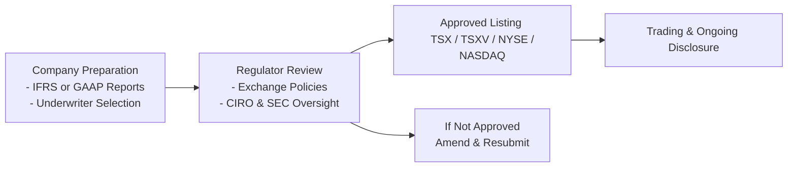

## 5.3 Canadian and U.S. Equity Markets

Have you ever felt a little unsure about the difference between Canadian and U.S. stock exchanges—or wondered if it even mattered? I sure remember the first time I tried to buy shares of a U.S. technology company using my Canadian trading account. The exchange rate alone gave me a bit of a headache, let alone the different listing standards, taxes, and regulatory guidelines. In this segment, we’ll take a close look at the primary Canadian and U.S. equity markets, their key characteristics, listing requirements, and some practical tips you can use when investing across the border. By the end, you’ll not only spot the similarities and differences between these markets but also have a few strategies in your back pocket for navigating them confidently!

---

### Major Canadian Exchanges

Canada’s two primary equity exchanges are the Toronto Stock Exchange (TSX) and the TSX Venture Exchange (TSXV). Both are owned by TMX Group, but they serve rather distinct segments of the market.

#### Toronto Stock Exchange (TSX)
The TSX is Canada’s premier stock exchange, hosting shares of large, well-established companies across various sectors—from financial services to natural resources, from technology to consumer goods. Because of its prestige and rigorous listing requirements, the TSX is often the final destination for companies that have successfully matured beyond the early growth phase.

Key features include:
• Minimum public float and market capitalization criteria.  
• Ongoing disclosure obligations, such as quarterly financial statements (commonly in IFRS format), management discussion and analysis (MD&A), and prompt reporting of material changes.  
• High liquidity—widely followed by institutional investors and fund managers.

Many Canadian investors view the TSX as the main gateway to invest in "blue chip" Canadian companies. But, as we’ll see, some of these same corporations may also cross-list on a U.S. exchange to broaden their global investor base.

#### TSX Venture Exchange (TSXV)
If you’re into smaller, early-stage companies, the TSX Venture Exchange is where you’ll see them. It’s specifically designed to serve junior and emerging issuers looking to raise capital to fuel growth or exploration (especially common in mining and energy sectors). Listing requirements on the TSXV tend to be less stringent than on the TSX, which also means the companies here, in general, come with a higher risk-return profile. But it’s not all just about risk—many iconic Canadian companies got their start on the TSXV, building brand recognition and financial track records before eventually graduating to the TSX.

---

### Major U.S. Exchanges

South of the border, you mainly run into the New York Stock Exchange (NYSE) and NASDAQ. These two giants list some of the world’s most recognizable corporations, drawing in vast liquidity and a global following of investors.

#### New York Stock Exchange (NYSE)
Whenever you see traders excitedly cheering on the famous trading floor (often in movies or business news clips), that’s the NYSE! It is one of the largest, oldest, and most prestigious stock exchanges on the planet. Companies listing here have to meet strict requirements around market capitalization, float, earnings history, and governance. On top of that, NYSE-listed companies must comply with rules set by the U.S. Securities and Exchange Commission (SEC).

#### NASDAQ
NASDAQ began as an electronic exchange, which historically attracted technology and growth-oriented companies. These days, it has evolved well beyond tech, hosting a wide variety of firms. NASDAQ focuses on an entirely electronic order-matching system, so there’s no traditional trading floor. The listing fees and market cap requirements can be more flexible than at the NYSE, which is appealing to certain high-growth firms. With globally recognized names like Microsoft, Amazon, and Apple listed here, it’s also a premier exchange for large-cap companies.

---

### Listing Requirements: A Quick Overview

To list on any exchange—TSX, TSXV, NYSE, NASDAQ—companies must follow that exchange’s “playbook” on corporate governance, financial thresholds, and continuous disclosure rules. Let’s outline some of the essentials:

• **TSX**: Larger companies with strong financial histories, established governance structures, and significant market cap. Detailed listing guidelines can be found in the [TSX Company Manual](https://tsx.com/listings/current-market-structure).  

• **TSXV**: Primarily smaller-cap or early-stage companies that do not yet meet the TSX’s financial criteria. They must still meet basic disclosure, public float, and governance guidelines, but these thresholds are more lenient.  

• **NYSE**: Requires a minimum number of shareholders, a fairly large market cap (often exceeding $100 million, though specifics can vary), and robust profitability or revenue track record. Reputation for strict corporate governance.  

• **NASDAQ**: Multiple tiers (e.g., Global Select, Global Market, Capital Market) with varying listing requirements related to market cap, share price, and governance. Known for being flexible but still demands a strong compliance effort.

Once listed, companies must continue meeting threshold requirements. If they slip, they might receive a warning or get delisted, pushing them to a more suitable market.

Here’s a quick visual that illustrates the general listing process (in very broad strokes!)

---

### Regulatory Frameworks: CIRO vs. SEC

Regulatory compliance is huge when you’re operating in or investing in the North American markets. In Canada, the regulator is the Canadian Investment Regulatory Organization (CIRO), the national self-regulatory organization that oversees investment dealers, mutual fund dealers, and market integrity on Canadian marketplaces. CIRO took form on January 1, 2023, from the amalgamation of two defunct organizations (the Mutual Fund Dealers Association and the Investment Industry Regulatory Organization of Canada).

In the U.S., the Securities and Exchange Commission (SEC) is the main regulatory authority. The SEC’s crucial job is to protect investors, maintain fair, orderly markets, and facilitate capital formation. Companies that trade in the U.S. must comply with the Exchange Act of 1934 and other relevant regulations. The SEC’s website has a lot of guidance, especially on cross-border issues and international listings: [https://www.sec.gov](https://www.sec.gov).

The bottom line is: if a Canadian firm wants to list on a U.S. exchange, they’ve got to be mindful of the SEC’s rules. Likewise, if a U.S. company is listing in Canada, or if a Canadian advisor is recommending U.S. shares to a client, the rules under CIRO will apply. For deeper insights into the differences between Canadian and U.S. securities regulation, you might check out specialized references such as the SEC’s cross-border securities guidelines or consult legal counsel familiar with both jurisdictions.

---

### Cross-Listing and Inter-Listing

Cross-listing (or inter-listing) means a company’s shares trade on multiple exchanges, often in different countries. It’s not unusual to see a Canadian mining giant or a major bank listed on both the TSX (its home base) and the NYSE (to tap into a colossal pool of global investors). This approach:

• **Broadens access to capital** – Listing in the world’s biggest markets can help companies raise more money.  
• **Increases liquidity** – Shares can trade actively in multiple time zones.  
• **Expands the investor base** – Some institutional investors might prefer or are even required to buy only from a specific exchange or region. By cross-listing, a company becomes more easily accessible.  
• **Elevates visibility** – Being on the NYSE or NASDAQ can amplify brand awareness.

But cross-listing also involves meeting two sets of listing and regulatory requirements, which can get pretty complicated (and expensive). Larger firms with robust legal and compliance departments generally handle this more effectively than smaller players.

---

### Market Benchmarks and Indices

Indices serve as performance yardsticks for investors and portfolio managers. If you recall from Chapter 1’s discussion of portfolio management process, benchmarks help us track how well (or not!) our portfolio is doing compared to the broader market.

Common Canadian and U.S. indices include:
• **S&P/TSX Composite Index** – The main gauge of Canadian stock market performance, covering about 250–300 of the largest and most liquid companies on the TSX.  
• **S&P 500** – A widely recognized measure of the U.S. large-cap space. Many people call it the heartbeat of American equities.  
• **Dow Jones Industrial Average (DJIA)** – A price-weighted index of 30 major U.S. companies. While it’s iconic, it’s sometimes called less representative of the broader market since it only holds 30 stocks.  
• **NASDAQ Composite** – Encompasses the majority of securities listed on NASDAQ, strongly tilted towards technology companies.

These benchmarks are used for portfolio construction, performance comparison, sector analysis, and even derivatives trading (like index futures and options). If you’re a Canadian investor primarily holding TSX-listed stocks in your portfolio, you might use the S&P/TSX Composite as your reference measure. However, if you hold a mix of Canadian and U.S. equities, you may consider a combined or global benchmark.

---

### Market Liquidity and Trading Volumes

Liquidity refers to how quickly and at what cost you can buy or sell a security. U.S. markets, particularly the NYSE and NASDAQ, tend to be more liquid due to higher trading volumes and broader participation from global institutional investors. This can result in:

• Tighter bid-ask spreads (meaning lower transaction costs).  
• Faster price discovery—prices tend to reflect information more swiftly.  
• Less slippage—large orders have a reduced impact on the stock’s price.

In Canada, the TSX is reasonably liquid for many large-cap stocks—particularly in sectors like finance, energy, and mining. However, many mid- or small-cap names might have thinner trading volumes, making it trickier or costlier to trade larger blocks. On the TSXV, where smaller companies list, liquidity can be quite limited, sometimes resulting in significant price moves on relatively few trades.

All of this affects your strategy: if you’re dealing in high-volume stocks, you might not spend too much time worrying about liquidity. But if you’re investing in a smaller Canadian junior mining company, you need to keep in mind that it might take longer to build or unwind your position without moving the market too much.

---

### Currency Considerations

Okay, so the next time you decide to buy shares of a U.S. technology firm, maybe you’ll remember this part! Whenever you invest across the border, you’re exposed to foreign exchange risk (FX risk). If you’re a Canadian investor receiving dividends from a U.S. company in USD, for example, currency fluctuations between CAD and USD can significantly affect your real return.

If the Canadian dollar appreciates against the U.S. dollar, your USD returns might be worth fewer loonies when converted back home, and vice versa if the CAD weakens. The [Bank of Canada](https://www.bankofcanada.ca/rates/exchange/) provides daily exchange rates and historical data that you can use to monitor these movements.

Some investors choose to hedge currency risk using currency futures, options, or specialized ETFs. Others accept the currency fluctuations as part of their diversification strategy. Either route, just be certain you’re aware of the impact that currency moves can have on your investment performance.

---

### RRSP and TFSA Implications for U.S. Equities

In Canada, Registered Retirement Savings Plans (RRSPs) and Tax-Free Savings Accounts (TFSAs) are popular vehicles for growing your investments tax-efficiently. However, buying U.S. stocks in these accounts comes with particular considerations:

1. **Withholding Tax on Dividends**  
   Under the Canada-U.S. tax treaty, U.S. dividends paid into an RRSP are typically exempt from U.S. withholding tax (which can otherwise be around 15%). However, that exemption is not automatically extended to TFSAs or Registered Education Savings Plans (RESPs). So if you hold U.S. dividend-paying stocks in a TFSA, you may still face the 15% withholding.

2. **Currency Conversion Costs**  
   If your brokerage doesn’t allow you to hold USD in your RRSP or TFSA, you may incur repeated currency conversion fees whenever you buy or sell U.S. securities or receive dividends. This can chip away at your overall returns unless you employ “Norbert’s Gambit” or other techniques to reduce forex costs.

3. **Tax Reporting Requirements**  
   While your RRSP earnings are tax-deferred, you still need to keep track of any foreign assets if you hold them in a non-registered account. For TFSAs, any U.S. withholding taxes are typically unrecoverable, and the IRS does not recognize the TFSA as a tax-free account. That said, for many Canadian investors, the convenience of the TFSA may still outweigh the partial withholding tax on U.S. dividends.

It’s often helpful to consult a cross-border tax professional or your financial advisor to ensure you’re handling these nuances properly.

---

### Best Practices and Common Pitfalls

• **Do thorough due diligence**: TSXV-listed companies, particularly in exploration or early-stage technology, can be exciting but also volatile. Always check financial statements, technical reports (for mining or other specialized ventures), and weigh the risk.  
• **Monitor currency trends**: If currency moves can make or break your investment, consider hedging your exposure or at least keep a close eye on foreign exchange rates.  
• **Pay attention to tax treaties**: The Canada-U.S. tax treaty offers some advantages, but only if you’re aware of the details and structure your investments accordingly.  
• **Be mindful of liquidity**: If you’re used to the robust volumes of the NYSE, watch out for smaller Canadian listings that might not enjoy the same order depth.  
• **Stay informed about regulatory updates**: Keep current with announcements from [CIRO](https://www.ciro.ca) (for Canada) and the [SEC](https://www.sec.gov) (for the U.S.).  

---

### Personal Experience Corner

I once held a tiny Canadian gold exploration stock that didn’t trade for weeks on the TSXV—hard to believe, but it happens. Then, in one day, the share price jumped by 50% on some promising drill results. The next day, it crumbled by 40%. The lesson? Thinly traded stocks, especially on the Venture exchange, can move in dramatic ways. If you’re prepared for that rollercoaster, great. Otherwise, a more liquid stock might better suit your risk tolerance.

---

### Glossary

- **Toronto Stock Exchange (TSX)**: Canada’s premier exchange for established companies.  
- **TSX Venture Exchange (TSXV)**: A Canadian exchange for early-stage companies looking to raise capital.  
- **NYSE (New York Stock Exchange)**: One of the largest exchanges in the world, known for strict listing standards and a historic trading floor.  
- **NASDAQ**: A U.S. electronic exchange popular with tech and growth-oriented issuers.  
- **Cross-listing**: When a company lists its securities on more than one exchange in different countries.  
- **Index (Indices)**: A measure of stock market performance (S&P/TSX Composite, S&P 500, etc.).  
- **Sector Analysis**: Evaluating industries to identify trends, opportunities, and risks.  
- **Currency Risk (FX Risk)**: Potential for returns to fluctuate due to exchange rate movements.

---

### Additional Resources

• [U.S. SEC website](https://www.sec.gov) for disclosure rules and cross-border securities regulations.  
• [Bank of Canada’s currency exchange data](https://www.bankofcanada.ca/rates/exchange/) for CAD-USD rates and trends.  
• [TSX Company Manual](https://tsx.com/listings/current-market-structure) for detailed listing requirements.  
• “Stock Trader’s Almanac” by Jeffrey A. Hirsch for North American market insights.  
• Online courses focusing on market structure, such as the “Market Structure” program on Coursera or specialized TSX training modules.  

---

### Final Thoughts

Canadian and U.S. equity markets are closely tied—and yet, each offers unique opportunities, listing requirements, and risks. Canadian investors might find the local TSX or TSXV more familiar, whereas the U.S. market is larger, more liquid, and brimming with global technology and consumer giants. By understanding how each exchange operates, paying attention to regulatory nuances under CIRO (in Canada) and the SEC (in the U.S.), and keeping on top of currency considerations, you can make informed decisions for your portfolio and feel far less intimidated about jumping across borders in your investing journey.

Feel free to revisit this section if you find yourself needing a refresher, and don’t forget that we dive even deeper into international investing considerations in Chapter 14. Now—go forth and trade wisely!

---

## Test Your Knowledge: Canadian and U.S. Equity Markets



### Which Canadian exchange is designed primarily for early-stage or smaller companies?

- [ ] Toronto Stock Exchange (TSX)
- [x] TSX Venture Exchange (TSXV)
- [ ] NASDAQ
- [ ] NYSE

> **Explanation:** TSXV focuses on junior companies that do not meet the more stringent listing requirements of TSX.

### Which U.S. regulatory body oversees corporate disclosures and enforces securities laws?

- [ ] CIRO
- [ ] TSX
- [x] SEC (Securities and Exchange Commission)
- [ ] FDIC

> **Explanation:** The SEC is the main regulatory authority for all publicly traded companies in the United States.

### What is a common reason for a company to be cross-listed on both a Canadian and a U.S. exchange?

- [ ] Increasing brokerage fees
- [x] Broadening access to capital and liquidity
- [ ] Reducing regulatory oversight
- [ ] Avoiding currency fluctuations

> **Explanation:** Cross-listing allows companies to sell shares in multiple markets, thereby increasing liquidity and exposure to a larger pool of investors.

### Which index would a Canadian investor most likely use to evaluate the performance of large-cap Canadian stocks?

- [ ] S&P 500
- [ ] Dow Jones Industrial Average
- [ ] NASDAQ Composite
- [x] S&P/TSX Composite Index

> **Explanation:** The S&P/TSX Composite Index is the benchmark index for Canada’s largest companies.

### What advantage do RRSPs typically have over TFSAs when holding U.S. dividend-paying stocks?

- [ ] No requirement for ongoing disclosure
- [ ] Higher annual contribution limit
- [x] Exemption from U.S. withholding tax on dividends
- [ ] Better currency conversion rates

> **Explanation:** Under the Canada-U.S. tax treaty, dividends paid into an RRSP are not subject to U.S. withholding tax.

### Which factor does NOT generally contribute to higher liquidity in the U.S. markets?

- [ ] Greater global investor participation
- [ ] Larger average market capitalizations
- [x] Minimal regulation and oversight
- [ ] Higher trading volumes

> **Explanation:** U.S. markets are actually quite regulated by the SEC, which helps foster trust and participation. Liquidity comes from investor numbers, volume, and market depth.

### How can a Canadian investor mitigate currency risk when investing in U.S. equities?

- [ ] Ignoring exchange rate fluctuations
- [x] Using currency hedging instruments, such as futures or options
- [ ] Refraining from all foreign investments
- [ ] Switching to only Canadian dividend stocks

> **Explanation:** Hedging instruments (currency futures, forex contracts, etc.) help control or reduce currency risk exposure.

### Why might a company get delisted from an exchange like the NYSE or TSX?

- [x] Failure to meet listing requirements or compliance standards
- [ ] Excessive liquidity
- [ ] Too many shareholders
- [ ] Obtaining a high market capitalization

> **Explanation:** Exchanges have comprehensive rules on governance, share price, and market cap thresholds. Companies that fail to comply may be delisted.

### Which role best describes CIRO under the current (2025) Canadian regulatory environment?

- [x] The national self-regulatory body that oversees investment dealers, mutual fund dealers, and market integrity.
- [ ] A private club for brokers to meet
- [ ] The primary U.S. regulator for equity markets
- [ ] The official tax authority in Canada

> **Explanation:** CIRO is the new Canadian Investment Regulatory Organization formed by the merger of the MFDA and IIROC in 2023.

### True or False: U.S. dividends received in a TFSA are typically exempt from the 15% withholding tax under the Canada-U.S. tax treaty.

- [ ] True
- [x] False

> **Explanation:** Dividends received in a TFSA do not benefit from the U.S. withholding tax exemption, whereas RRSPs generally do.


