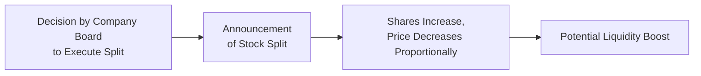
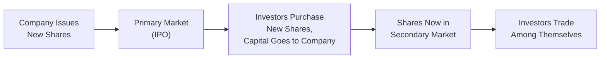

## 5.4 Additional Key Considerations for Equity Investments

Investing in equities can be thrilling and sometimes nerve-racking. All at once, you’re dealing with changing market conditions, hearing about stock splits, or maybe noticing an uptick in mergers. The universe of equities has a lot of moving pieces, and if you’re like me—someone who used to fumble around trying to understand every single corporate action—it’s easy to feel overwhelmed at first. But take heart: by understanding a handful of essential concepts, you can better navigate the equity landscape. This section explores corporate actions, short selling, margin trading, insider trading regulations, and the role of analyst coverage. We also emphasize the importance of continuous learning because, let’s face it, markets never stand still.

---

## Corporate Actions and Their Effects on Equity Holders

A corporate action is any event initiated by a company that affects its shares or shareholders. These actions might mean something as simple as a dividend being paid, or something more complex, like a substantial merger. Let’s take a look at some common corporate actions and break down why they matter.

### Stock Splits and Reverse Stock Splits

• Stock Split: This is like slicing a pizza into more but smaller slices. The total pizza size is the same, but you end up with more slices. In a stock split, each investor in the company ends up holding more shares, but each share’s price is proportionally reduced. So theoretically, your total investment value doesn’t change just because of the split. Why do companies do it? Often, it’s to make their stock price look more affordable and appealing to a broader base of investors.  
• Reverse Stock Split: This moves in the opposite direction: a company reduces the number of its outstanding shares while increasing the share price proportionally. It may be done to prop up the share price to meet certain listing requirements or to appear more stable with a higher trading price.

If you’ve ever experienced a stock split in your portfolio, you probably noticed that sense of surprise seeing your number of shares double or triple—yet the dollar value looked sort of the same. In practical terms, a split can improve liquidity and attract new investors, while a reverse split can help a company maintain a listing on certain exchanges by ensuring the stock doesn’t trade below the minimum required price.

Below is a simple diagram illustrating the dynamics of a stock split:

### Share Buybacks

Share buybacks (i.e., share repurchases) occur when a company buys its own shares from the market. This can reduce the number of outstanding shares and potentially boost the share price because each existing share might represent a greater claim on the company’s earnings and assets. Sometimes, buybacks suggest that management feels its shares are undervalued. But buybacks can also be used to manage earnings per share (EPS) figures—increasing EPS simply by reducing the number of shares outstanding. So, pay close attention to a company’s debt levels, future cash needs, and other fundamentals to figure out if a share buyback is truly a sign of confidence or merely a short-term strategy.

### Mergers and Acquisitions

Mergers and acquisitions (M&A) can dramatically transform share value and business direction. In a merger, two companies combine to form a new entity. In an acquisition, one company purchases another. Shareholders may receive shares in the new combined organization, cash, or a mix of both. While M&A can mean synergies, cost-saving advantages, or the expansion of product lines, they can also come with integration headaches and cultural clashes. Any time you see M&A headlines, it’s worth digging into the details:  
• What’s the acquirer’s real motivation?  
• How’s the new entity expected to perform in the marketplace?  
• Do the transaction’s valuation multiples make sense given industry norms?

---

## Short Selling and Margin Trading

“Short selling” and “margin trading” evoke visions of quick gains—or big potential losses—depending on how skillfully these strategies are managed. I remember the first time I tried margin trading. I was so excited about leveraging my position that I forgot to think about the downside: a swift margin call that forced me to pony up more money to cover my losses. Let’s break down these concepts more carefully so you can avoid that pitfall.

### Short Selling

Short selling is basically selling a security you don’t own. You borrow the shares from your broker, sell them at the current price, and (ideally) buy them back later at a lower price to return them to your broker. If the price falls, you profit. However, if the price rises, your losses can be unlimited because, in theory, a stock price can keep going up. This strategy can be extremely risky, so regulators and brokers impose margin requirements and restrictions to help maintain market stability.

In Canada, short selling is regulated by the Canadian Investment Regulatory Organization (CIRO), which sets margin rules and short-sale guidelines to protect both the market’s integrity and individual investors from excessive risk. If you’re curious, take a look at [CIRO’s rules on margin and short selling](https://www.ciro.ca/rules). Keep in mind, though, that rules can vary across jurisdictions, and you will need to maintain funds in your margin account sufficient to meet margin calls.

### Margin Trading

Margin trading allows you to borrow money from your broker using your existing securities as collateral. This extra capital can amplify your trading power. But it’s not all sunshine and roses:  
• If the stock price moves in your favor, you can achieve outsized gains compared to if you had used only your own cash.  
• If the price moves against you, you can lose more than your original investment and face margin calls, which require you to either deposit more cash or liquidate part of your position.

Your broker will typically set a minimum amount of equity you must maintain in your margin account, per CIRO’s margin regulations. If your equity falls below that threshold, you get a margin call. If you can’t add more funds or securities, the broker might sell your securities at market prices—sometimes at truly inconvenient times.

Use margin and short selling judiciously. Always have a plan to handle worst-case scenarios. Research thoroughly, and lean on risk-management tools such as stop-loss orders if that appropriately aligns with your strategy.

---

## Distinguishing Between Primary and Secondary Markets

When companies want to raise capital, they might choose to issue new shares. These new shares are sold for the first time in the primary market. Later, once these shares are already owned by investors, they can be freely bought and sold among investors in the secondary market.

• Primary Market: Think of an initial public offering (IPO) as the classic example. Here, an organization (public or private) sells fresh shares directly to investors—be they institutional funds or individuals. The money you pay goes to the issuing company, helping them fund expansions, acquisitions, or day-to-day operations.  
• Secondary Market: Once those new shares are out in the open, they’re traded among investors on stock exchanges or over-the-counter (OTC) platforms. The original issuing company doesn’t benefit directly from share trades in the secondary market. Instead, the funds shift among individual investors, mutual funds, pension funds, etc.

If you ever jumped into a hot IPO and seen the share price surge on the first trading day, you know the emotional rollercoaster of the primary market. But keep in mind, while IPOs can offer big upsides, they also present unique challenges such as limited historical data and the potential for overvaluation if market hype runs wild.

Below is a quick diagram highlighting the flow of capital in primary versus secondary markets:

---

## Insider Trading Regulations and Corporate Disclosure

Insider trading is the buying or selling of a security based on material, non-public information. It is illegal in most jurisdictions, including Canada, because it violates the principle of fairness in the marketplace. Regulators—like the Ontario Securities Commission (OSC) and CIRO—mandate that companies must disclose important information to all investors at the same time to preserve a level playing field.

• Material, Non-Public Information: This could be anything that a reasonable investor might see as having a significant effect on a company’s share price—from quarterly earnings not yet released to knowledge of a forthcoming merger.  
• Penalties and Enforcement: Authorities impose hefty fines or even criminal charges for individuals caught engaging in insider trading. Companies often have insider trading blackout periods just prior to releasing earnings to prevent employees from unfairly profiting.

For more details on insider trading rules, check out the [Ontario Securities Commission website](https://www.osc.ca). Even well-intentioned investors can stumble into compliance issues if they happen to know something about a company before it’s publicly released. So, tread carefully and keep your trading decisions on the right side of the law.

---

## The Importance of Analyst Coverage and Research Reports

Analyst coverage can exert a significant influence on a stock’s price. Equity analysts study a company’s financial statements, industry trends, and competitive positioning. They then publish research reports with recommendations like “Buy,” “Hold,” or “Sell.” That recommendation, along with the rest of the report, can sway investor sentiment, at least in the short term.

However, it’s crucial to remember that analyst opinions can sometimes be biased—either due to the analyst’s own investing position, or the firm’s investment banking relationships. Don’t rely solely on a single report. Try to read multiple research pieces if possible, and always blend your own due diligence with professional opinions before making an investment decision.

---

## Continuous Learning in a Dynamic Market

Equity investing is a bit like playing a never-ending puzzle game. Market dynamics change, new industries sprout up, and fresh regulations frequently get introduced. Think about how quickly the blockchain and electric vehicle spaces evolved. Staying current means reading financial news, analyzing annual reports, listening to earnings calls, and periodically reviewing your holdings to see if they still match your risk tolerance and investment objectives.

In short, never get too comfortable. Markets reward those who combine knowledge with flexibility, so keep feeding your mind with new information—whether that’s through formal courses, well-respected books, or collaborative discussions with other investors.

---

## Best Practices and Key Reminders
• Always conduct thorough due diligence, especially on corporate actions. They may fundamentally alter the long-term prospects of the company you’re investing in.  
• Use leverage (margin) with caution: The higher potential gains often come with higher risks.  
• Stay updated on the regulatory framework. Canada is currently governed by CIRO, which merged the historical IIROC and MFDA self-regulatory organizations. For margin and short-sale specifics, see [CIRO’s official website](https://www.ciro.ca).  
• Respect confidentiality: Trading on non-public information is a serious offense.  
• Seek multiple analyst opinions: No single research report has the monopoly on the truth.  
• Keep learning. Even seasoned pros get blindsided from time to time.

---

## Glossary

• **Corporate Action**: An event initiated by a company that affects its securities (e.g., dividends, splits, mergers).  
• **Stock Split**: A corporate action that increases the number of shares while proportionally reducing the share price.  
• **Reverse Stock Split**: A reduction in the number of shares outstanding that proportionally increases the share price.  
• **Short Selling**: The sale of a security not currently owned, with the intention of buying it back later at a lower price.  
• **Margin Trading**: Borrowing funds from a broker to purchase securities, using the purchased securities as collateral.  
• **Primary Market**: The market in which new securities are sold by companies to investors for the first time.  
• **Secondary Market**: The market in which previously issued securities are traded among investors.  
• **Insider Trading**: Buying or selling a security based on material, non-public information in violation of fairness and disclosure laws.

---

## References and Further Exploration

• [CIRO’s rules on margin and short selling](https://www.ciro.ca/rules)  
• [Ontario Securities Commission: Insider Trading Updates](https://www.osc.ca)  
• “One Up on Wall Street” by Peter Lynch — a user-friendly read that helps everyday investors evaluate corporate growth opportunities.  
• “Market Liquidity: Theory, Evidence, and Policy” by Thierry Foucault, Marco Pagano, and Ailsa Röell — for a deeper exploration of how markets function.  
• Brokerage platforms like Interactive Brokers, Questrade, and others provide educational resources on short sales, margin trading, and basic foundational investing strategies.

---

## Test Your Knowledge: Equity Investment Insights



### Which of the following describes a stock split?  
- [x] Shares outstanding increase, while the share price decreases proportionally.  
- [ ] Shares outstanding collapse to zero, and the company buys them back.  
- [ ] Fewer shares are available as the price proportionally increases.  
- [ ] No change in the number of outstanding shares, but the share price remains untouched.  

> **Explanation:** A stock split increases the total number of shares while proportionally lowering the share price, keeping the overall market capitalization (in theory) roughly the same.

### Which of the following situations best illustrates short selling?  
- [ ] Buying stocks on the primary market and holding them for a year.  
- [x] Borrowing shares from your broker and selling them, hoping to buy them back at a lower price.  
- [ ] Selling shares in a company you already own to lock in gains.  
- [ ] Reinvesting dividends into additional shares of stock.  

> **Explanation:** Short selling involves borrowing a security you do not own, then selling it with the hope of buying it back at a lower price later.

### Why might a company perform a reverse stock split?  
- [x] To meet exchange listing requirements or to appear more stable by boosting the share price.  
- [ ] To make shares more affordable to smaller investors.  
- [ ] To raise additional capital from new shareholders.  
- [ ] To hand out more dividends to existing shareholders.  

> **Explanation:** A reverse stock split reduces the number of shares outstanding and raises the share price, often done to maintain listing standards or improve the company’s overall appearance.

### When an investor trades in the secondary market, who typically receives the proceeds from the sale?  
- [ ] The issuing company.  
- [x] Another investor or market participant.  
- [ ] Regulators for market stabilization.  
- [ ] No one; the money is locked in a trust.  

> **Explanation:** In the secondary market, investors trade existing shares among themselves. The issuing company does not get any proceeds from those trades.

### Which of the following is NOT a potential risk of margin trading?  
- [ ] The possibility of losing more than the original investment.  
- [ ] Being subject to margin calls.  
- [ ] Potential forced liquidation by a broker.  
- [x] Guaranteed price appreciation on the borrowed securities.  

> **Explanation:** There is no guarantee that the borrowed securities will appreciate in value. Margin trading carries significant risk and can lead to large losses if the share price moves against you.

### Which description fits insider trading?  
- [x] Buying or selling stock based on material, non-public information.  
- [ ] Purchasing shares during a scheduled buying window.  
- [ ] Trading according to publicly available balance sheet data.  
- [ ] Acquiring shares for philanthropic purposes.  

> **Explanation:** Insider trading is strictly about utilizing important non-public data to get an unfair market advantage.

### Which corporate action might reduce the number of shares and potentially increase Earnings per Share (EPS)?  
- [ ] Dividend payment.  
- [ ] Merger.  
- [ ] Stock split.  
- [x] Share buyback.  

> **Explanation:** Share buybacks reduce the total number of outstanding shares, which can increase EPS if net earnings remain constant.

### What is a reason companies offer IPOs in the primary market?  
- [x] To raise capital for expansions or operations.  
- [ ] To inflate their share price in the secondary market.  
- [ ] To distribute insider-owned shares at no cost.  
- [ ] To reduce exposure to potential legal liabilities.  

> **Explanation:** In the primary market, companies sell new shares to investors, providing the firm with fresh capital for strategic initiatives.

### Which regulatory body oversees short sale and margin rules in Canada as of 2025?  
- [ ] OSC  
- [ ] The defunct IIROC  
- [x] CIRO  
- [ ] SEC  

> **Explanation:** The Canadian Investment Regulatory Organization (CIRO) is now the national self-regulatory organization responsible for oversight of investment dealers, including margin and short-sale rules. IIROC is no longer active.

### True or False: Analyst coverage can influence share prices by shaping market sentiment.  
- [x] True  
- [ ] False  

> **Explanation:** Analysts’ “Buy,” “Hold,” or “Sell” recommendations can sway public perception and potentially move share prices.


