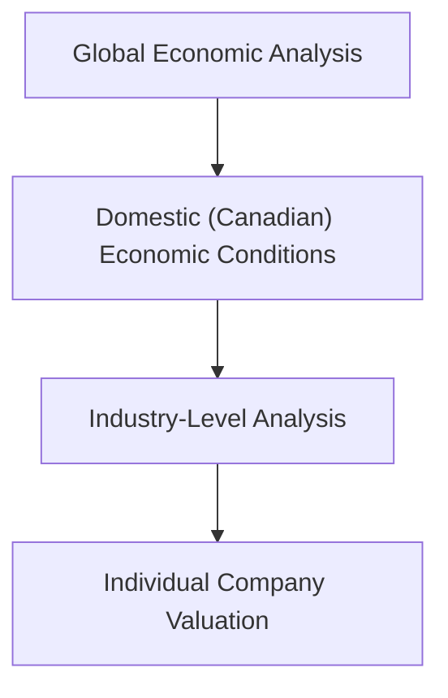

## 6.1 Economic Analysis

Imagine you’re hanging out with a friend who just got a big break at a tech company. They tell you, “I’m ready to invest, but I’m not totally sure how the stock market ties back to the overall economy. I mean, do I just pick my favorite ticker symbols, or is there more to it?” You give them that knowing grin: “Well, buddy, if you really want to understand how companies thrive or struggle, you’ve got to look at the bigger picture—like GDP growth, interest rates, and even global trade. That’s what we call Economic Analysis.” Yeah, it’s a mouthful, but trust me, it’s not as scary as it sounds.

This section is all about explaining how the health of the economy influences the value of companies and shapes your investment decisions. If you’ve ever wondered why central banks adjusting interest rates can cause the stock market to surge or plummet, or why a real-estate boom can ripple through the entire economy, then you’re in the right place.

### Why Macroeconomic Conditions Matter in Equity Valuation

When you invest in a company’s shares, you’re essentially betting on its future earnings potential. But a company’s earnings aren’t determined in isolation. They rise and fall in tandem with the business environment around them—which is shaped by factors like GDP growth, inflation, employment trends, and consumer confidence. Seriously, if unemployment rates spike and people start tightening their wallets, it’s going to affect corporate sales. Meanwhile, if the economy is booming, businesses typically rake in higher profits, and stock prices often reflect that rosy outlook.

It’s not just about local dynamics either. Canadian companies, for instance, are often deeply intertwined with the United States, European, and Asian markets—so a single interest rate hike by the U.S. Federal Reserve can quickly shift how Canadian equities perform.  

### Taking a Top-Down Approach

One popular way to incorporate these broad insights is with something called the “Top-Down” approach. Instead of leaping straight to picking individual stocks, you first assess the global economic environment, then narrow into regional or national economic conditions, then slice further into specific industries, and finally zoom in on individual companies. Think of it like a funnel:

In other words, you start from the widest scope (global macro trends) and work your way down to the more granular details.

#### Personal Anecdote: Missing Out Because of Macro Blindspots

Years ago, I got super excited about a Canadian mining stock because, well, the company’s exploration results looked incredible. But guess what? At the same time, the Chinese economy was decelerating, and metal demand was literally dropping faster than I could scramble to check the charts. The stock ended up slumping—despite all those great drilling results—because the broader market environment was unfavorable. That’s when I learned, the hard way, that ignoring economic conditions can cost you real money.

### Global vs. Domestic Economic Conditions

It’s tempting to think, “I’ll just pay attention to the Canadian economy, right?” But most sizable Canadian companies have international exposure. Even local energy or agriculture companies may rely heavily on export markets. So you want to keep tabs on both domestic and global factors.

• Domestic Factors  
  - The Bank of Canada’s overnight rate, which influences borrowing costs.  
  - Canadian government fiscal policy, such as infrastructure spending or changes to taxation.  
  - Domestic consumer sentiment and employment trends.  
  - Resource-driven factors, like oil and gas prices, which can significantly impact the TSX.

• Global Factors  
  - U.S. Federal Reserve policy (since the U.S. is Canada’s largest trading partner).  
  - Worldwide supply chain disruptions (remember how COVID-19 upended logistics everywhere?).  
  - Global trade agreements or disputes, which can shift trade routes and cost structures.  
  - Currency exchange rate fluctuations, especially USD/CAD.  

A crucial point here is that global economic interconnectivity can create ripple effects. If Europe’s economy appears headed for a recession, it could reduce demand for raw materials from Canadian resource exporters, which in turn might dampen the TSX’s overall performance.

### Monetary and Fiscal Policy: The Levers of the Economy

At the heart of economic analysis lies the interplay between monetary and fiscal policy. Central banks (like the Bank of Canada) adjust the money supply and interest rates—a process we call “monetary policy.” Governments, on the other hand, control spending and taxation—“fiscal policy.” Combined, these policies set the tone for whether the economy is stimulated or reined in.

#### Monetary Policy

If the Bank of Canada slashes its overnight interest rate, borrowing becomes cheaper. Businesses can expand more easily, consumers might take on more loans (e.g., mortgages, car financing), and investors often flock to equities in search of higher returns because bonds start yielding less. The end result can be an upswing in corporate earnings and stock valuations. Conversely, if the central bank hikes rates to fight inflation, it raises borrowing costs, slows down economic activity, and can put downward pressure on stock prices.

#### Fiscal Policy

Fiscal policy can also be a game-changer. Suppose the Canadian government decides to boost infrastructure spending—think new highways, public transit expansions, or digital connectivity projects in rural areas. Companies in construction, engineering, and raw materials might see a direct boost in revenue. On the flip side, if the government enacts austerity measures or raises taxes, certain sectors (like consumer goods or restaurants) might take a hit because people end up with less disposable income.

### The Business Cycle: Expansion, Peak, Contraction, Trough

The economy moves in cycles, from good times (expansion, where GDP grows strongly, jobs are plentiful, and consumer confidence is high) to not-so-great times (recession or contraction, where GDP shrinks, unemployment often rises, and companies struggle). Recognizing which phase we’re in can help you anticipate potential changes in stock performance.

Think of the cycle in four phases: expansion, peak, contraction (or recession), and trough.

1. Expansion: Generally a sweet spot for equities. Companies enjoy robust earnings, and consumer confidence is high.  
2. Peak: Growth may be slowing, and inflation might be climbing. Interest rates could rise, leading some investors to become more cautious.  
3. Contraction: Corporate earnings decline; consumer and business spending drops. Stocks often see downward pressure. This is a period of caution, but it can also present long-term buying opportunities if you spot undervalued quality names.  
4. Trough: This marks the lowest point. Sentiment is usually negative, but the seeds of the next expansion are planted here. Over time, the market might turn around as the cycle begins anew.

Assessing these different phases empowers you to align your investments with whichever part of the business cycle we’re currently in. This concept of “sector rotation” often involves shifting holdings between cyclical industries (like consumer discretionary or industrials) and defensive industries (like consumer staples or healthcare), depending on where we are in the cycle.

### How Global Events Interconnect

Events in one part of the world don’t always stay localized. Global interconnectivity means you can’t analyze the Canadian economy in a vacuum. For instance, a trade dispute between the U.S. and China might increase costs for Canadian manufacturers who import Chinese components for assembly or reduce export opportunities if global demand slows. Currency fluctuations are equally relevant, as a rising Canadian dollar can hurt exporters (their goods become pricier for foreign buyers), but benefit companies that import raw materials or goods denominated in foreign currency.

Supply-chain ripple effects can be felt in surprising ways. If, say, floods in Southeast Asia disrupt semiconductor production, Canadian car manufacturers could see bottlenecks and reduced output. Reading about these disruptions in real-time, you might adjust your equity positions in the auto sector or consider whether the short-term dip provides a good entry point for value-seeking investors.

### Tracking Leading Indicators and Real-Time Data

A big part of economic analysis is tracking leading indicators that may signal changes in future conditions. Some of these include:
- Purchasing Managers’ Index (PMI): A measure of manufacturing and service sector activity that can hint at economic expansion or contraction.  
- Housing starts: Often suggests whether consumers are confident enough to invest in property and whether the construction industry will be robust.  
- Consumer sentiment surveys: Reflect how optimistic or pessimistic people are about the economy, which directly affects their spending.  
- Yield curve: The difference in interest rates between short-term and long-term government bonds. An inverted yield curve can signal an impending recession.  

These leading indicators can help you spot opportunities or risks early, well before they show up in corporate earnings. Be aware that none of these data points guarantees a certain outcome, but they are vital clues in your ongoing detective work as an investor.

### Correlating Economic Conditions to Corporate Revenues

A practical step is to map out how each major economic variable might influence a company’s top line (revenue) or bottom line (profit). Let’s say the economy is expanding, and interest rates are low. That might make credit more accessible for households, thereby boosting big-ticket purchases like cars, furniture, or electronics. In retail and consumer discretionary stocks, you might see rising revenue because people have extra spending capacity.

Now, if the economy is contracting and unemployment is high, disposable incomes shrink, forcing people to reduce those same discretionary purchases. Revenue in consumer discretionary sectors might tumble, whereas consumer staples (like groceries) usually hold up better because people still need to eat and buy household essentials.

#### Case Study: Retail Sector During a Recession

When economic growth slowed sharply during the 2008 global financial crisis, many retail chains reported plunging sales in discretionary segments (home decor, luxury clothing). On the other hand, discount retailers and grocery chains displayed resilience (and in some cases, growth) because budget-conscious shoppers flocked to less expensive alternatives. Equity valuations in those thrifty businesses soared as investors recognized stable or growing revenue streams even in a down market.

### Glossary

• **GDP (Gross Domestic Product)**  
  The total monetary or market value of all finished goods and services produced within a country’s borders in a specific time period. It’s the most common measure of an economy’s size and health.

• **Monetary Policy**  
  Actions by a central bank (like the Bank of Canada) to influence the money supply and interest rates to achieve goals such as stable prices and low unemployment.

• **Fiscal Policy**  
  Government decisions on taxation and spending that affect economic activity—like infrastructure investments or social programs.

• **Business Cycle**  
  The fluctuation of economic activity over time, moving through expansion, peak, contraction, and trough phases.

• **Leading Indicators**  
  Economic variables that signal future changes in the economy (e.g., PMI, housing starts).

• **Coincident Indicators**  
  Indicators that reflect the economy’s present state (e.g., employment rates, real GDP in the current quarter).

• **Lagging Indicators**  
  Indicators that become apparent after an economic trend or pattern is already established (e.g., corporate profits reported after the quarter ends).

• **Top-Down Analysis**  
  An approach to equity selection that begins with macroeconomic factors, narrows down to sectors or industries, and finally pinpoints individual companies.

### Best Practices for Economic Analysis

• Stay Updated on Policy Announcements  
  Monitor the Bank of Canada’s rate decisions, as well as relevant statements from the Minister of Finance. Shifts in policy stances can quickly trickle down to corporate earnings.

• Use Multiple Data Sources  
  Check out Statistics Canada (https://www.statcan.gc.ca/) for national data on GDP, employment, and inflation. The International Monetary Fund (https://www.imf.org/) publishes global outlook reports that can broaden your perspective.

• Combine Quantitative and Qualitative Insights  
  Don’t just rely on numbers; pay attention to corporate guidance in earnings calls, leadership changes in government, and consumer behavior shifts. Sometimes you can glean insights from anecdotal evidence or from scouring trends on social media—though be cautious interpreting sentiment data.

• Manage Currency and Political Risk  
  If you invest in companies that do a lot of cross-border trading, sharpen your awareness of geopolitical events, currency exchange rate trends, and free trade agreements that might shift competitive advantages.

• Continually Re-Evaluate  
  Economic conditions evolve. Don’t just do an analysis once and forget about it. Keep an eye on quarterly stats, new policy pronouncements, and leading indicators so you can adjust your portfolio as needed.

### Common Pitfalls and Challenges

• Overreacting to Short-Term Noise  
  Economic data can be volatile month to month. Try not to let a single data point (like one bad jobs report) knock you off your strategy unless it signals a larger trend.

• Confirmation Bias  
  Sometimes investors look only for information that fits their pre-existing narrative. It’s important to challenge your own assumptions occasionally.

• Ignoring Global Influencers  
  A purely domestic focus can leave you vulnerable if an international crisis hits commodities or disrupts supply chains.

• Timing the Market Perfectly  
  Let’s be honest, nailing every cycle top and bottom is nearly impossible, even for professional fund managers. Aim for a well-thought-out approach grounded in economic realities—rather than chasing every twist in the macro storyline.

### Putting it All Together: A Simplified Framework

Here’s a quick method you might use to blend economic analysis into your equity strategy:

1. **Scan Macro Conditions**: Monitor major economic releases and central bank announcements.  
2. **Identify Phase**: Pinpoint the current phase of the business cycle (expansion, peak, contraction, trough).  
3. **Sector Rotation**: Select the sectors or industries likely to do well in this phase. For an expansion, you might favor cyclical sectors like consumer discretionary or industrials; in a contraction, you might focus on defensives like consumer staples or healthcare.  
4. **Company Vetting**: Now do your “bottom-up” fundamental analysis to confirm which companies within those chosen sectors have strong balance sheets, robust earnings growth, and reasonable valuations.  
5. **Monitor Leading Indicators**: Keep tabs on updated PMI, consumer sentiment, yield curve changes, etc.  
6. **Adjust Positions as Needed**: Tweak your portfolio if the economic narrative changes or if you see strong signals that future conditions are shifting.

### Regulatory and Institutional Insights

In Canada, the Canadian Investment Regulatory Organization (CIRO) oversees dealers and ensures that investment advice is suitable and aligned with clients’ best interests. While you’re analyzing macroeconomic conditions, you should remain mindful of suitability requirements to ensure your recommendations or personal investments align with your risk tolerance and investment objectives. If you’re looking for official updates or more details on regulatory responsibilities, you can visit https://www.ciro.ca for guidelines on best practices.

### Additional Resources

If you’re itching to dive deeper:

• **Bank of Canada (http://www.bankofcanada.ca/)**: Great for reading about monetary policy decisions and interest rate announcements.  
• **Statistics Canada (https://www.statcan.gc.ca/)**: The go-to source for data on GDP, employment, housing, and more.  
• **International Monetary Fund (https://www.imf.org/)**: Offers global economic outlook reports that give a broader perspective.  
• **Canadian Securities Course (CSC®) Materials**: The standard source for foundational Canadian regulatory and economic knowledge.  
• **The Economist**: Weekly publication with in-depth coverage of economic and political trends worldwide.  
• **Online Courses (Coursera, edX)**: For those wanting to systematically learn macroeconomics from leading universities.

### Closing Thoughts on Economic Analysis

Doing economic analysis can sometimes feel like herding cats—there’s always a new report, a new crisis, or an exciting technology that’s about to “change everything.” But staying informed and methodical about where the economy is headed can help you pick better investments and avoid panic selling at the worst times. If you ever feel overwhelmed, just remember that each piece of data is one small puzzle piece. The goal is to figure out the bigger picture so you can make well-informed investment decisions.

So, next time your friend says, “Dude, how come you’re reading about the yield curve? Isn’t that just for policy wonks?” you can confidently reply, “Actually, it’s because I like knowing ahead of time where the economy might be heading—and which stocks will ride that journey up or down.” And that’s how you keep your portfolio in line with the real world.

---

## Test Your Knowledge: Economic Analysis Essentials



### Which phase of the business cycle typically features rising employment and strong consumer confidence?

- [x] Expansion
- [ ] Peak
- [ ] Contraction
- [ ] Trough

> **Explanation:** During expansion, the economy grows, employment rises, and consumer sentiment is often high as businesses thrive in favorable conditions.

### Which of the following best describes the Top-Down approach to equity analysis?

- [x] An approach starting with macroeconomic trends, then industry, then company analysis
- [ ] An approach starting with company earnings, then macro factors
- [ ] A strategy focusing only on technical chart patterns
- [ ] A method that ignores macroeconomic factors

> **Explanation:** The Top-Down approach begins broadly at the macroeconomic level, moves to sector/industry-level trends, and finishes with individual company analysis.

### When the Bank of Canada cuts interest rates, what is the most likely effect on equities?

- [x] They may become more attractive, as borrowing costs decrease
- [ ] They usually fall sharply because defensive stocks outperform
- [ ] They are unaffected by central bank movements
- [ ] They always decline when interest rates drop

> **Explanation:** Lower interest rates reduce borrowing costs and can stimulate economic growth, frequently making equities more appealing compared to bonds.

### If the Canadian dollar appreciates (rises) relative to the U.S. dollar, how might this affect Canadian exporters?

- [x] It may hurt exporters by making their goods more expensive to foreign buyers
- [ ] It makes their goods cheaper abroad, thus more competitive
- [ ] It eliminates currency risk altogether
- [ ] It tends to have no impact on competitiveness

> **Explanation:** A stronger Canadian dollar can make Canadian exports more costly for foreign consumers, negatively impacting sales volumes.

### What is the primary benefit of monitoring leading economic indicators like the PMI?

- [x] They can foreshadow future economic trends
- [ ] They measure current economic trends in real time
- [ ] They are only relevant for backward-looking data
- [ ] They give precise future earnings estimates for all listed companies

> **Explanation:** Leading indicators provide early signals about where the economy may be heading, helping investors anticipate shifts in corporate profitability and market conditions.

### During which business cycle phase are investors most likely to consider moving from cyclical stocks to defensive stocks?

- [x] Peak
- [ ] Expansion
- [ ] Contraction
- [ ] Trough

> **Explanation:** At the peak, economic growth may start to slow and inflationary pressures may rise, so investors often rotate into defensive stocks to protect against potential downturns.

### Which type of policy involves government spending and taxation decisions?

- [x] Fiscal Policy
- [ ] Monetary Policy
- [ ] Exchange Rate Policy
- [ ] Regulatory Policy

> **Explanation:** Fiscal policy is about how a government taxes and spends. Monetary policy, by contrast, deals with central bank actions and interest rates.

### If global demand for Canadian commodities declines sharply, which economic variable is most directly affected?

- [x] GDP growth in resource-heavy provinces
- [ ] Consumer staples spending in Europe
- [ ] The overnight rate set by the Bank of Canada
- [ ] Imports of foreign luxury goods

> **Explanation:** Lower global demand for commodities usually decreases exports, impacting GDP growth, especially in provinces reliant on natural resource extraction.

### What is a common pitfall when incorporating macroeconomic data into equity analysis?

- [x] Overreacting to single data points
- [ ] Ignoring company valuations
- [ ] Creating a diversified portfolio
- [ ] Checking both leading and lagging indicators

> **Explanation:** Overreacting to individual data points can lead to short-sighted decisions. A more measured approach considers trends and multiple indicators.

### True or False: Sector rotation strategies only apply during periods of economic contraction.

- [x] True
- [ ] False

> **Explanation:** While sector rotation is often mentioned when transitioning from growth to contraction, investors can apply rotation strategies at any phase, moving between cyclical and defensive sectors based on perceived economic shifts and business cycle positioning.


