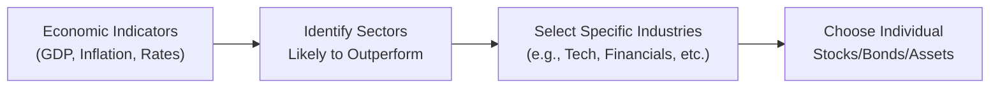
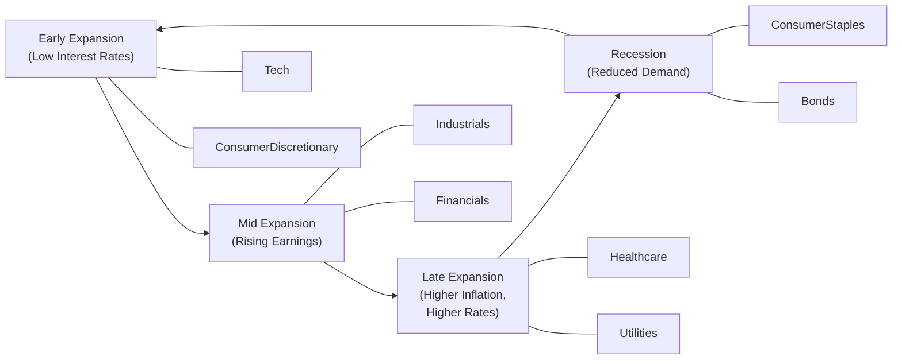

## 6.2 How Economic Analysis Drives the Development of Investment Strategies

Let’s be honest: for a lot of us, “macro data” can sound intimidating—like something meant only for economists or market wizards with complicated formulas. But you might be surprised how often everyday investing comes down to the world of interest rates, inflation, and consumer confidence. I remember having coffee with a friend who was considering a big shift into tech stocks. At first, they didn’t want to hear about GDP growth or unemployment rates. But once they realized how these factors actually shape whether growth companies might flourish or flop, it clicked. That’s what this section is all about: stepping back to see the whole economic picture (top-down analysis), then zooming in on specific industries and companies (bottom-up analysis), and ultimately using that macro lens to make well-rounded, risk-managed investment decisions.

Below, we’ll explore practical ways that economic data can influence your portfolio allocations, how sector rotation can leverage different phases of the business cycle, and how you might apply these insights in real-world scenarios. We’ll also talk about the importance of scanning for changing interest-rate trends, managing risk through macro signals, and integrating ESG considerations as regulations evolve. By the end of this reading, you’ll (hopefully!) feel more at home with big economic concepts—and more confident about applying them to your own portfolio strategies or client recommendations.

### The Significance of Macroeconomic Data in Shaping Investment Strategies

Economic analysis starts with paying attention to the broad data that shapes global and local markets—numbers like GDP growth, inflation, interest rates, consumer sentiment, and unemployment. Now, it might sound a little dry at first. But trust me, once you see how these data points translate into day-to-day stock performance, it’s like shining a spotlight on hidden trends.

• Interest Rates  
Rising interest rates generally make borrowing more expensive, which can reduce corporate profit margins (especially for heavily leveraged companies). However, banks and many financial institutions often enjoy wider lending spreads when rates go up, which can boost valuations in those sectors. If you anticipate rising rates, you might tilt your portfolio towards financials or consider short-duration bonds. Conversely, in a low-rate environment, growth-oriented stocks (particularly those in tech) often become more attractive because their future earnings are discounted at a lower rate.

• Inflation  
When inflation climbs, purchasing power decreases, potentially hurting consumer-discretionary firms. Consumer staples and utilities often hold up better because people still need essential goods and services, regardless of prices. If you see inflation picking up, you might also look to real assets like real estate or commodities (e.g., gold) that can hedge inflation risks.

• Consumer Confidence  
Consumer confidence indexes reveal how optimistic people feel about their financial conditions and the broader economy. High consumer confidence can be a plus for consumer-discretionary stocks—think retail, travel, or dining—while low consumer confidence can push capital into more defensive sectors like healthcare or utilities.

• Economic Growth and GDP  
Strong GDP growth usually correlates with rising corporate profits—validating the pursuit of growth-oriented stocks. But in a recessionary or slow-growth environment, stable dividend payers and defensive stocks can curb downside risk.

Below is a simple visualization showing how macroeconomic data flows into investment decision-making:

In this flow, what begins with a broad macro reading (A) is subsequently honed into a sector focus (B), which narrows to specific industries (C), and finally ends with particular securities (D).

### Bridging Macroeconomic Data to Specific Investment Decisions

People often think macro data is just big-picture and intangible. But, in practice, it helps shape everyday decisions on what to buy, what to avoid, and how long to hold. When you see inflation is rising, you know it might be wise to check your portfolio’s exposure to consumer sectors that are sensitive to rising costs. Or if you notice the Bank of Canada repeatedly signaling more rate hikes, you might suddenly feel more cautious about highly leveraged real estate corporations.

Another way to see this big-picture data in your daily investments is by focusing on corporate earnings calls. Let’s say a company’s CFO mentions they expect input costs to rise 5% next quarter due to inflation and supply chain constraints. That micro-level detail echoes the macro environment. If you keep hearing similar statements from multiple firms, that’s a sign that the broader economy is shifting—and your strategic asset allocation may need a corresponding tweak.

### The Connection Between Macroeconomic Cycles and Sector Rotation

Sector rotation is a popular strategy where you realign your portfolio allocations to certain market sectors based on where we are in the economic cycle. It’s a bit like shifting gears in a car: when the road (economy) changes, your engine (portfolio) needs a different gear to optimize performance. Typically, each sector has times when it’s in favor and times when it’s out of favor.

When the economy starts expanding, growth-oriented sectors often do well (e.g., technology, consumer discretionary, industrials). As the expansion matures and inflationary pressures build—often leading to interest-rate hikes—investors may shift toward defensive plays (e.g., consumer staples, utilities, healthcare). During a recession, consumer staples and utilities (along with certain government or high-quality bonds) can help preserve value. And once there’s a hint of recovery, cyclical sectors—like materials or industrials—may become appealing again.

Here is a simple diagram showing how investors might rotate sectors through the economic cycle:

### Refining Asset Allocation with Economic Insights

Economic analysis isn’t just about picking stocks within certain sectors. It also helps determine your overall mix of equities, fixed income, and alternative investments. If you see signs of a slowdown (e.g., flattening yield curve, declining consumer confidence), you might reduce your equity allocation or tilt more heavily toward lower-volatility, income-generating assets.

Additionally, international diversification decisions often hinge on macro signals. Let’s say Canada’s economy is robust but you see strong growth potential in emerging markets. You might allocate a portion to emerging market equities—perhaps even hedging currency exposure if you anticipate a volatile exchange rate environment. This holistic blend of insights, from local government deficits to global supply chain disruptions, collectively refines how you allocate capital among various asset classes.

### Neutralizing or Exploiting Interest Rate Trends

Interest rates practically sit at the heart of modern finance. A shift of just a few basis points can change bond prices, corporate borrowing costs, equity valuations, and currency exchange rates.

• If Rates Are Rising:  
  – Financial institutions (like commercial banks) may benefit from improved net interest margins.  
  – Utility and telecommunication stocks (often called “bond proxies” because of their stability and dividends) can become less attractive if bond yields rise enough to compete with their dividends.  
  – Growth stocks might take a hit because the value of their future earnings is more heavily discounted.  

• If Rates Are Falling:  
  – Bond prices generally rise, rewarding existing holders.  
  – Companies that rely on cheap debt (e.g., capital-intensive sectors like manufacturing) might expand more aggressively.  
  – Emerging markets often benefit from capital inflows seeking higher yields.  

Adapting your portfolio in light of these dynamics can offer a strategic edge. For instance, if you anticipate interest rates trending higher, you might shift toward shorter-term bonds to protect against price declines, while raising your weighting in certain financial or value stocks. On the flip side, if you suspect rates will trend lower, you could extend bond durations or lean into growth-oriented equities.

### Combining Top-Down and Bottom-Up Research

Top-down (macro) analysis sets the broad stage: it highlights which sectors or asset classes might best ride the current macroeconomic wave. But that’s just half the story. Bottom-up (micro) research helps you choose which specific companies within those favored sectors are solid plays. After all, even a strong sector can have a few weak apples.

Here’s how you might combine them:

• Start with macro trends—identify the sectors that should do well.  
• Delve into company-level metrics—earnings growth, debt levels, leadership quality, ESG credentials.  
• Filter out those that may not fit your risk tolerance or that deviate from your overall strategy.  
• Keep an eye on valuation metrics, such as price-to-earnings (P/E) or price-to-book (P/B) ratios, even if the macro backdrop is promising.  
• Revisit your thesis if macro signals or company fundamentals shift.

### Risk Management Through Macro Signals

Economic signals often act like early warning sirens. By the time you read about a recession in the mainstream news, the market might have already adjusted. So paying attention to real-time data—like bond yield spreads, central bank announcements, or leading indicators such as housing starts—can help you spot trouble ahead or pivot your strategy defensively.

If the Bank of Canada explicitly signals multiple interest-rate hikes, you might scale back your exposure to overly indebted companies or consider hedging your portfolio’s-rate sensitivity. Tools like interest-rate swaps, or even simpler vehicles like bond ETFs with shorter durations, can position you to mitigate interest-rate risk. That’s a far better alternative than ignoring macro signals and being blindsided by a sudden market correction.

### Case Studies: Economic Shifts and Real-World Impact

Sometimes the best teacher is history. Let’s consider two high-impact scenarios:

• 2008 Financial Crisis  
  – Prior to the crisis, housing markets in the U.S. (and to a lesser extent in Canada) looked unstoppable. That confidence fed reckless lending.  
  – Several macro signals (like overextended credit markets and surges in adjustable-rate mortgages) pointed to underlying fragility.  
  – Investors who recognized these red flags could have reduced exposure to financial stocks or used inverse ETFs to hedge. Those who were unprepared faced heavy losses.

• 2020 Pandemic  
  – Suddenly, entire economies shut down, consumer demand sharply dropped, and supply chains were disrupted. Travel, hospitality, and retail sectors were hit first.  
  – Central banks worldwide, including the Bank of Canada, slashed rates and launched emergency lending programs. Equities cratered, then staged a historic rebound as stimulus flooded the market.  
  – Sectors like technology soared due to remote work demand, while industries dependent on in-person interaction took time to recover.

These events remind us of how quickly markets can pivot—and how economic analysis can alert us to potential turning points. If you kept a close eye on signals like unemployment surges, government stimulus announcements, or even real-time data on consumer spending, you could have made decisions to safeguard capital or exploit newly opening opportunities (like the rapid growth in e-commerce or telehealth).

### Integrating ESG and Responsible Investing in Development of Strategies

As more governments globally push for sustainable growth, we’re seeing an influx of policies that support clean energy, electric vehicles, and other environmentally friendly industries. This trend is evident in Canada, too, where federal and provincial incentives for certain green projects have boosted the renewable-energy sector. Investors positioning around these initiatives early may see long-term gains.

Economic analysis in the ESG space often involves these questions:

• Is government policy shifting to benefit certain sectors (e.g., carbon taxes that might penalize heavy emitters while rewarding renewable projects)?  
• Does consumer sentiment favor ESG-oriented services and products?  
• Are lenders offering better financing terms to companies with high ESG scores?  

In a top-down approach, you might gauge how strong or weak these sustainability policies are. Then, bottom-up, you’d look at a company’s specific ESG metrics—like carbon footprint, labor practices, or board diversity—to decide if it’s aligned with macro trends and your personal or institutional mandate.

### Best Practices and Pitfalls

• Best Practices:  
  – Stay Informed: Regularly follow trusted sources for economic data (e.g., RBC Economics, BMO Capital Markets, TD Economics).  
  – Remain Nimble: Economic conditions can change quickly, so be prepared to rebalance.  
  – Diversify: Use macro insights for strategic tilts, but don’t go all-in on a single sector or region.  

• Pitfalls:  
  – Analysis Paralysis: Too much data can cause indecision. Learn to identify the most relevant indicators for your strategy.  
  – Overconfidence in Forecasts: Even the best economists can be wrong—build in risk management.  
  – Reactive Changes: Constantly adjusting on short-term headlines can erode returns. Keep a balanced viewpoint.

### Glossary

• Sector Rotation: Realigning portfolio allocations to capitalize on cyclical shifts in the economy.  
• Defensive Stocks: Shares of companies that tend to be stable under economic stress (e.g., utilities, consumer staples).  
• Growth Stocks: Shares of companies expected to grow earnings at an above-average rate relative to the market.  
• ESG (Environmental, Social, and Governance): Criteria used to evaluate a company’s ethical impact and sustainability practices.  
• Hedging: Using financial instruments or market strategies to offset potential losses in a portfolio.  
• Bottom-Up Analysis: Examining a company’s fundamentals—like financial statements, revenue growth, and management quality—before assessing macro trends.  
• Macroeconomic Orientation: An investment perspective that focuses primarily on broad economic conditions.  
• Portfolio Rebalancing: Adjusting the weightings of various assets in a portfolio to align with a desired level of risk and return.

### Helpful Resources

• CIRO (https://www.ciro.ca/) – For regulatory updates, compliance guidelines, and best practices in portfolio construction.  
• CFA Institute (https://www.cfainstitute.org/) – Offers deep dives into advanced macro-driven strategies and portfolio management techniques.  
• Canadian Economic Reports – RBC Economics, BMO Capital Markets, and TD Economics all provide excellent forecasts, sector outlooks, and commentary leaning on Canadian market trends.  
• “Thinking, Fast and Slow” by Daniel Kahneman – Explores common biases that can cloud our interpretation of macro and micro signals, encouraging more rational decision-making.  
• Open-Source Financial Tools (e.g., Python libraries like pandas or NumPy) – Useful for parsing and analyzing large sets of economic data.

---

It might feel like a lot, right? But the upside is huge. If you can harness macro data—interest rates, inflation, consumer confidence, you name it—and pair it with thorough company analysis, you gain a meaningful edge in designing balanced, forward-looking investment strategies. Above all, remember that economic analysis is an ongoing process: the moment you assume your analyses are “final” is the moment the economy throws you a curveball, be it a pandemic, a housing bubble, or a global supply chain disruption. Stay curious, stay adaptive, and you’ll keep finding ways to align your portfolio with the ever-changing macro winds.

## Test Your Knowledge: Economic Analysis and Investment Strategies Quiz



### Which economic indicator most directly impacts a company's borrowing costs?

- [ ] Inflation
- [x] Interest rates
- [ ] Consumer confidence
- [ ] Unemployment rate

> **Explanation:** While inflation and consumer sentiment are relevant, interest rates directly affect how expensive it is for firms to borrow money.

### An investor believes interest rates will rise sharply. Which of the following strategies might be suitable?

- [x] Shift toward short-duration bonds
- [ ] Extend bond maturities to lock in yields
- [x] Increase holdings in financial stocks
- [ ] Reduce allocation to money market funds

> **Explanation:** Short-duration bonds are less sensitive to rising interest rates, and financial stocks often benefit from higher rates, but longer-term bonds carry more price risk.

### What is sector rotation?

- [x] Shifting portfolio weightings among different sectors based on economic cycles
- [ ] Using a momentum strategy within one sector
- [ ] Only focusing on the financial sector
- [ ] Rotating leadership management among corporate sectors

> **Explanation:** Sector rotation means adjusting your allocation of market sectors to match different phases of the economic cycle.

### Why might an investor allocate more to consumer staples during a recession?

- [x] Consumer staples often see stable demand even in downturns
- [ ] Impulse buying skyrockets in recessions
- [ ] Consumer staples are highly speculative
- [ ] They are immune from market fluctuations

> **Explanation:** People still need basic goods (food, household necessities) regardless of economic conditions, making consumer staples generally more resilient.

### Which statement best describes the combination of top-down and bottom-up research?

- [x] Macro analysis identifies promising sectors; company fundamentals refine stock selection
- [ ] Macroeconomic data is irrelevant to corporate analysis
- [x] Both macro and micro data can complement each other
- [ ] Only small-cap stocks require top-down approaches

> **Explanation:** Using macro insights to identify which sectors could benefit, then drilling into specific companies’ fundamentals, is a balanced approach.

### During periods of rising inflation, which type of asset is often considered a hedge?

- [x] Commodities or real assets
- [ ] Long-term government bonds
- [ ] High-yield corporate bonds
- [ ] Growth-oriented tech stocks

> **Explanation:** Commodities and certain real assets typically rise with inflation, offering some protection compared to many fixed-rate bond or growth equities.

### Why is it useful to watch central bank announcements (like those from the Bank of Canada)?

- [x] They often signal future interest-rate moves
- [ ] They have zero impact on currency values
- [x] They guide market expectations on inflation and economic growth
- [ ] They only matter to hedge funds

> **Explanation:** Central banks’ policy guidance influences market interest rates, currency values, and overall economic sentiment.

### Which factor might prompt a shift from growth stocks to value stocks?

- [x] Rising interest rates that make future earnings less attractive
- [ ] Declining interest rates
- [ ] Periods of increasing risk appetite
- [ ] Negative consumer sentiment toward dividends

> **Explanation:** When interest rates go up, growth stocks can be hit because their future earnings are discounted more heavily, sometimes leading investors toward value stocks.

### What is a possible benefit of integrating ESG considerations into macro-driven strategies?

- [x] Investors can align portfolios with positive environmental or social trends
- [ ] ESG has no relevance to long-term investing
- [ ] ESG integration is purely a marketing gimmick
- [ ] ESG is illegal in Canada

> **Explanation:** Many investors and governments now view ESG as a lens for risk mitigation and long-term growth potential, especially amidst shifts in regulatory policies.

### The statement “Economic analysis is an ongoing process” is:

- [x] True
- [ ] False

> **Explanation:** The economy continually changes, creating new opportunities and risks. Ongoing analysis helps maintain an adaptive investment strategy.


