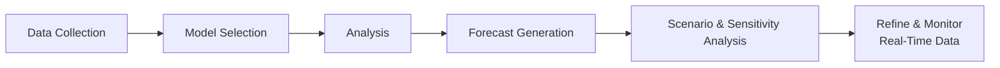

## 6.3 Economic Forecasts

Economic forecasts are essentially thoughtful guesses about where the economy might be headed, which—believe it or not—can be both an art and a science. If you’ve ever tried predicting next week's weather only to get rained on despite “blue skies” in the forecast, you know how tricky predicting the future can be. And yet, in the realm of finance, building a forward-looking perspective is considered crucial for everything from portfolio construction to equity research. After all, if you’re investing in companies or sectors, you want a sense of what the economic environment might be in the months or years to come. Let’s walk through how economic forecasts are constructed, the tools involved, and the limitations—plus a few times I personally felt a bit duped by an overly optimistic forecast!

### Introduction
When we talk about economic forecasting, we’re usually referring to predicting macroeconomic variables such as GDP growth, inflation rates, employment trends, and interest rates. Investors and analysts create forecasts to help decide which industries might boom or bust—or which individual stocks might benefit from certain conditions. Modern finance relies a lot on these forecasts for portfolio management, risk assessment, and setting investment strategies.

However, forecasting isn’t perfect. Some folks might say it’s an exercise in futility, and trust me, I’ve been there: I once overhauled my entire sector allocation based on a slightly too rosy GDP forecast. Spoiler alert: the actual GDP growth that quarter didn’t reach the same heights, and I had to rebalance my portfolio a bit sooner than planned. But that’s the reality of forecasting: it’s never a guarantee, it’s simply a data-informed estimate of the future.

### Understanding the Forecasting Process
The first step in any forecast—economic or otherwise—is to gather relevant data and then build a model or approach that attempts to explain how the economic machine works. Often, this begins with analyzing historical data for trends and patterns. We might look at relationships such as how consumer spending reacts to changes in employment or how interest rates influence inflation, among other macroeconomic variables.

Once data is gathered (from sources like government agencies, CIRO-regulated dealer reports, or open-source economic databases), analysts attempt to establish which variables truly matter and how they interrelate. These relationships can be tested using statistical tools, or supplemented with expert judgement.

Below is a simple visual flow of typical forecasting steps:

As the diagram suggests, forecasting starts with collecting data, then picking the appropriate model (quantitative or qualitative), analyzing historical relationships, generating the initial forecast, exploring different scenarios, and finally refining as new data arrives.

### Quantitative vs. Qualitative Models
Forecasting can be done using different models, broadly categorized as quantitative or qualitative. Let’s see how they differ:

#### Quantitative Models
Quantitative forecasting relies on formal, mathematical techniques. Examples include:
• Time Series Analysis: Let’s say we’re tracking Canada’s gross domestic product over many years. By using time series analysis, we look for patterns (like cycles, trends, and seasonal effects) within the data to predict future values.  
• Econometric Models: These are more sophisticated statistical frameworks that use economic theories to identify relationships among variables. For instance, an equation might express GDP as a function of consumer spending, investment, government spending, and net exports. You might also include interest rates, exchange rates, or commodity prices in there.

Quantitative models can be powerful in stable times, but they can break down if the underlying assumptions (like moderate inflation or “normal” consumer behavior) change unexpectedly. For instance, my forecasting model never saw the 2020 pandemic coming—yet it had a big effect on consumer spending and global supply chains. Yeah, so sometimes the best model in the world can't handle a black swan event.

#### Qualitative Methods
Qualitative approaches involve expert opinions, surveys, or scenario analysis without necessarily relying on complex math. Think of a “roundtable of experts” who analyze conditions and collectively agree on economic prospects. Or a scenario analysis exercise in which you hypothesize multiple futures: from a mild recession scenario to a robust economic boom. Although these methods can capture subjective insights and factor in intangible aspects (like shifts in consumer sentiment), potential biases from experts or incomplete information might creep in.

### Assumptions vs. Accuracy in Forecasting
All forecasting models rely on certain assumptions, and these assumptions can color the accuracy of your final prediction. Some typical assumptions might be:
• Interest Rates: The Bank of Canada will keep rates stable (or lower them slightly).  
• Inflation: Inflation will remain within a certain target range.  
• Trade Policies: No major tariff wars or disruptions will occur (I’ve learned the hard way about trade policy surprises!).  
• Consumer Confidence: Consumer sentiment remains robust.

When reality strays from these assumptions—like when a central bank decides to raise rates sooner than consensus expected—it can throw off the entire forecast. That’s why it’s so important to keep updating assumptions as new data emerges. In my investing journey, I’ve often found that the difference between a good forecast and a not-so-good one is how quickly you adapt it when the facts change.

### Scenario Planning and Sensitivity Analysis
To help mitigate the risk of inaccurate assumptions, many analysts use scenario planning and sensitivity analysis:

• Scenario Planning: Consider multiple “what-if” pathways. For instance, “Scenario A” might assume stable CPI inflation, “Scenario B” includes a mild recession, and “Scenario C” might factor in a spike in energy prices leading to higher inflation. By examining all three, you can see how different outcomes affect corporate earnings or stock prices.  
• Sensitivity Analysis: Done by changing one variable at a time—like interest rates or inflation—to measure how sensitive the outcome is. For instance, “What if inflation is 3% instead of 2%?” This helps you gauge the risk of big changes in each driver.

### Short-Term vs. Long-Term Perspectives
It’s also useful to differentiate between short-term and long-term forecasts:

• Short-Term (months to a year): Often used by traders or portfolio managers who want to make quick, tactical adjustments—like rotating into certain sectors that might benefit from near-term interest rate shifts.  
• Long-Term (multiple years): Important for strategic allocations in retirement portfolios or for big corporate investment decisions. Even though it’s harder to nail down with precision, these forecasts guide general market outlooks and help shape “buy-and-hold” or “core allocation” decisions.

Sometimes bridging the gap between these horizons can be challenging. If you’re investing in an equity that pays dividends, short-term economic downturns might not matter much if you’re convinced of its long-term growth potential. On the flip side, if your model warns of a rocky quarter or two, you might decide to hedge your positions using options or futures (see Chapter 16 on risk management for more about these tools).

### Monitoring Real-Time Data & Adjusting Forecasts
In today’s digital age, one of the coolest shifts (at least for data nerds like me) is the availability of real-time economic data. Gone are the days when we had to wait for monthly or quarterly official reports to update models. We can now track things like credit card spending, traffic congestion, or online job postings to gauge economic activity in near real-time.

Examples of real-time economic dashboards include the Bank of Canada’s daily exchange rates and money market trends, or global data from platforms like Bloomberg Terminal and Refinitiv Eikon. By feeding new data into forecasting models on a rolling basis, analysts can refine their numbers more frequently—making them somewhat more agile when a surprise hits.

### Consensus Forecast vs. Contrarian Views
The “consensus” forecast is essentially the average of many economists' opinions. While it often represents a sort of wisdom of crowds, it can sometimes be clouded by groupthink. Contrarian investors specifically look for situations where they believe the consensus has drastically mispriced future outcomes. For example, if the consensus expects 2% inflation but a contrarian sees signs of a 5% spike, that contrarian might buy inflation-protected securities or short bonds ahead of the surprise. This strategy can be risky, of course, because going against the consensus essentially bets that you see something others do not.

### Limitations of Forecasting
Events like global financial crises, pandemics, or geopolitical upheavals can undermine even the most robust forecasting model. These so-called “black swan events” can bring abrupt shifts in market sentiment. Human biases also play a role, whether it’s overconfidence or anchoring on prior assumptions. It’s helpful to remember that forecasts are not fortune-telling devices. They’re best used as directional guides, not unbreakable rules.

#### The Role of Regulatory and Policy Changes
Another huge wildcard is government policy. We’ve seen examples where previously stable interest rates got hiked surprisingly to tame inflation, or where free trade agreements changed how companies source materials. In Canada, for instance, new guidelines from the Canadian Investment Regulatory Organization (CIRO) might influence investor protections, product distributions, or risk profiling. Even changes to CIPF coverage can shape investor behavior if they feel safer (or less safe) with certain account structures.

In short, policy shifts can spark major changes in economic conditions—and these can be notoriously hard to forecast. That’s why it’s so critical to keep an eye on the policy environment alongside your core economic data.

### Putting it All Together
Economic forecasts integrate data, theory, and informed speculation to help investors imagine potential futures. By combining quantitative tools (like time series analysis) with qualitative insights (like expert roundtables), analysts can build layered forecasts that consider both hard numbers and nuanced, real-world dynamics. Moreover, scenario analysis and real-time data updates can help refine big-picture strategies as conditions evolve.

Nevertheless, no forecast is set in stone. Making a forecast is like charting a path through an ever-changing landscape: you’d better be ready to alter course if the terrain shifts. That’s exactly why ongoing monitoring is so important. Ultimately, robust forecasting is as much about planning for various outcomes as it is about picking “the one outcome” you think is certain.

### Glossary
• **Econometric Models**: Statistical models that integrate economic theory, historical data, and mathematical equations to forecast economic activity.  
• **Time Series Analysis**: Techniques for examining data points gathered over time, identifying patterns (e.g., trends, cycles), and projecting future values.  
• **Scenario Analysis**: Evaluating potential future events by analyzing a range of different, plausible outcomes.  
• **Sensitivity Analysis**: Testing how changes in one variable (like interest rates) affect the broader forecast, letting you see which assumptions are most crucial.  
• **Black Swan Event**: An unpredictable event with massive impact, like a global crisis or pandemic, that falls outside standard expectations.  
• **Consensus Forecast**: The average of a set of forecasts or opinions from economists or analysts about future economic or market conditions.  
• **Contrarian Investing**: Strategy that involves betting against prevailing market sentiment, hoping to capitalize on mispriced assets due to herd mentalities.  
• **Real-Time Economic Dashboards**: Digital tools that compile and present continuously updated data, allowing analysts to see immediate changes in economic indicators.

### References & Further Exploration
• [Bank of Canada’s Monetary Policy Report](https://www.bankofcanada.ca/publications/) – for official policy stances and economic projections relevant to Canada.  
• [IMF World Economic Outlook Database](https://www.imf.org/en/Data) – for a broader global view, including growth and inflation forecasts by country.  
• Bloomberg Terminal or Refinitiv Eikon – widely used professional platforms offering real-time data, news, and analytics.  
• “Forecasting: Principles and Practice” by Rob J Hyndman and George Athanasopoulos – an open-source textbook that dives deeply into forecasting methods, from simple to advanced.  
• [CIRO website](https://www.ciro.ca) – to stay updated on current investment regulatory guidelines in Canada, reflecting changes after the amalgamation of IIROC and MFDA.  

And if you’re a fan of learning by doing, try building a small forecasting model yourself. You can find open-source data from government websites or from the IMF database. Start simple—maybe a spreadsheet for GDP growth—then layer in inflation or interest rates. It’s an awesome way to get familiar with how assumptions drive results, and it’s a lot less scary than it sounds.

## Test Your Knowledge: Economic Forecasting Essentials



### Which statement best describes the nature of economic forecasting?

- [x] It uses data and models to make informed estimates about future macroeconomic conditions.
- [ ] It guarantees that market predictions will be accurate.
- [ ] It focuses solely on past data without regard to future indicators.
- [ ] It prohibits the use of real-time data to update predictions.

> **Explanation:** Economic forecasting involves analyzing both historical data and forward-looking indicators to estimate future macroeconomic conditions. It does not guarantee accuracy, but it does help form an informed outlook.

### Which of the following is a characteristic of a quantitative forecasting model?

- [ ] It is purely based on the subjective judgments of analysts.
- [x] It relies on statistical techniques like time series analysis or econometric models.
- [ ] It ignores historical data.
- [ ] It is never affected by unexpected events.

> **Explanation:** Quantitative models rely on statistical and mathematical tools such as time series analysis and econometrics, leveraging historical data to uncover relationships and trends.

### One possible downside of relying solely on consensus forecasts is:

- [ ] They capture a wide set of viewpoints, ensuring zero bias.
- [ ] They always respond quickly to new economic data.
- [ ] They tend to consistently overshoot predictions.
- [x] They may reflect groupthink and overlook unique perspectives.

> **Explanation:** Consensus forecasts can be diluted by averaging many viewpoints. This sometimes results in groupthink, which can miss contrarian insights or outlying perspectives that could more accurately predict an economic shift.

### Scenario analysis in forecasting is primarily used to:

- [ ] Eliminate the need for historical data.
- [x] Examine how different potential events or outcomes could affect forecasts.
- [ ] Guarantee a single correct prediction.
- [ ] Replace both qualitative and quantitative models.

> **Explanation:** Scenario analysis helps in visualizing alternative futures and “what-if” contexts to understand how different events (e.g., changes in inflation or interest rates) might alter market outcomes.

### Contrarian analysts typically:

- [x] Go against the prevailing market sentiment to find potential mispriced assets.
- [ ] Always align with the consensus forecast for added certainty.
- [x] Believe that groupthink may create opportunities for profit.
- [ ] Rely solely on time series for all predictions.

> **Explanation:** Contrarian analysts look for discrepancies between widely accepted forecasts and their own assessments. They hope to capitalize on points where they believe the consensus view is incorrect or overly optimistic/pessimistic.

### Which of the following factors can invalidate a set of forecasting assumptions?

- [x] A sudden change in government policy or central bank steps to raise interest rates unexpectedly.
- [ ] A model’s reliance on multiple variables.
- [ ] Continuously stable inflation rates.
- [ ] The existence of a consensus among economists.

> **Explanation:** Policy changes, like abrupt shifts in interest rates or unexpected government actions, often undermine the assumptions that underlie forecasting models.

### What is a “black swan event” in the context of economic forecasts?

- [ ] An expected downturn in the stock market.
- [x] An unpredictable, high-impact event that deviates dramatically from standard trends.
- [x] A scenario that rarely occurs, but can have huge consequences when it does.
- [ ] A standard assumption made in all consensus forecasts.

> **Explanation:** Black swan events are rare, unpredictable occurrences (e.g., global financial crises, pandemics) with potentially enormous impacts that can blindside even robust forecasting models.

### Short-term economic forecasts:

- [x] Focus on upcoming quarters or a year to guide tactical decisions.
- [ ] Are generally useless for any investment decision.
- [ ] Have a longer horizon than strategic (multi-year) outlooks.
- [ ] Are not influenced by real-time data.

> **Explanation:** Short-term forecasts are generally oriented toward near-future economic conditions, helping investors and analysts make tactical adjustments to their strategies over the next few months or year.

### Which statement best describes sensitivity analysis?

- [x] It involves changing one variable at a time to see how it impacts the overall forecast.
- [ ] It renames quantitative forecasting variables to keep them hidden.
- [ ] It assigns the same weight to every possible outcome.
- [ ] It guarantees perfect accuracy in forecasting.

> **Explanation:** Sensitivity analysis tests how the final projection shifts when you tweak each key variable individually, helping identify which assumptions are most influential in the forecast.

### Econometric models:

- [x] Utilize statistical methods underpinned by economic theory and data.
- [ ] Ignore macroeconomic relationships and rely only on surveys.
- [ ] Are exclusively qualitative in nature.
- [ ] Never require updates once built.

> **Explanation:** Econometric models combine economic theories and real-world data using statistical methods. They do require periodic updates as new data is collected and economic conditions evolve.


