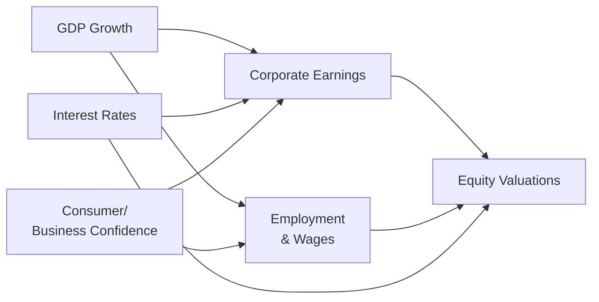

## 6.4 Key Economic Metrics

Have you ever walked into a grocery store, noticed the rising prices of everyday items, and wondered how this would impact your investment in, say, a large consumer goods company? Well, that’s where understanding key economic metrics can really help. Economic indicators—such as gross domestic product (GDP), inflation rates, unemployment figures, and the shape of the yield curve—not only let us see the “big picture” but also guide us in forming better equity strategies. Let’s dive into some of these metrics that can be especially revealing for analyzing equities and industries.

### Why Economic Indicators Matter for Equity Investors

Equity prices aren’t formed in a vacuum. They move in response to:
• Consumer demand,  
• Corporate earnings,  
• Credit conditions, and  
• Market sentiment.

It’s the interplay of these factors—against a broader economic backdrop—that ultimately shapes the environment in which stocks are priced. By paying attention to the macroeconomic signals, we can anticipate possible shifts in corporate revenue and risk levels. In other words, economic indicators act like a set of navigational tools, making sure our equity investment boat doesn’t inadvertently crash into an iceberg we didn’t see coming.

Below, you’ll find a summary of key economic indicators that often influence equity performance. We’ll unpack what each metric is, why it’s important, and how you can interpret it in an investment management setting.

---

### Gross Domestic Product (GDP) Growth

GDP is possibly the most well-known metric for measuring a country’s total economic output. In a nutshell, it reflects the market value of all final goods and services produced within a nation’s borders during a specific period.

• When GDP growth is robust, people tend to have more disposable income, businesses see rising profits, and overall investment confidence often improves. Equity markets usually perform better in such an environment because higher GDP growth implies higher corporate earnings potential.  
• Conversely, a stagnant or declining GDP indicates potential economic troubles—like weakened consumer spending or stalled corporate investment—which typically depresses stock prices across the board.

In Canada, you can track GDP figures via [Statistics Canada](https://www.statcan.gc.ca/). They offer quarterly updates breaking down GDP by industry, which is particularly handy if you want to assess which sectors might experience a surge or slowdown.

#### Practical Case Study

Let’s say the GDP growth for Canada is projected to reach 3.2% next year, higher than the previous year’s 2.0%. This signal might encourage you to invest in stocks or sectors expected to thrive in an expanding economy, such as consumer discretionary or technology. You might also see banks benefiting from increased lending activities as businesses expand.

---

### Inflation (Consumer Price Index, CPI)

You’ve definitely noticed how your favorite coffee brand costs more now than it did a couple of years ago, right? That’s inflation in action. Inflation is the rate at which the general price level of goods and services is rising, and it’s typically measured by metrics like the Consumer Price Index (CPI). The CPI tracks the price changes of a consistent “basket” of goods and services over time.

1. **Moderate Inflation:** A bit of inflation often indicates a healthy economy. It implies increased demand, growing wages, and, typically, rising corporate profits.  
2. **High Inflation:** This can trigger uncertainty among investors because rising costs might eat into corporate profit margins. Think of a manufacturer that depends on commodities; when raw material costs surge, it may reduce profitability unless the company raises prices.  
3. **Deflation (Negative Inflation):** Although it sounds more affordable for consumers, deflation corresponds to significant drops in demand or falling wages—often leading to lower profitability.

From an equity strategy viewpoint, inflation directly impacts equity valuations. Central banks—like the Bank of Canada—manage inflation via interest rate adjustments. If inflation runs high, they often tighten monetary policy by raising interest rates, which can weigh on stock valuations. By contrast, looser monetary policy in times of controlled inflation can boost market liquidity and encourage equity investments.

#### Real-World Example

In 2022, many major economies experienced inflation spikes, generally attributed to supply chain disruptions and surging commodity prices. Investors who recognized this trend early might have strategically positioned portfolios toward firms with strong pricing power (like consumer staples) or those in industries that benefit from inflation (such as energy or mining).

---

### Interest Rates and Yield Curves

If you were to observe the bond market, you’d see a classic tool for gauging economic outlooks: the yield curve. Here’s the gist:

- **Yield Curve:** Shows the yields (annualized returns) on government bonds across different maturities (short-term vs. long-term).  
- **Normal Yield Curve:** Short-term rates are lower than long-term rates, signaling expectations of future economic growth.  
- **Inverted Yield Curve:** Short-term rates exceed long-term rates. This scenario frequently hints at recessionary fears.  
- **Flat Yield Curve:** Little difference between short- and long-term rates, often indicating a transitionary economic phase.

These shapes matter because bond yields greatly influence corporate borrowing costs. And if you think of a business that needs to finance expansion or refinance debt, higher borrowing costs can dampen profitability. That, in turn, matters to equity investors.

#### Practical Interpretation for Equity Investors

A normal yield curve environment often correlates with growth-friendly conditions—good for equity prices overall. However, when the yield curve inverts, conventional wisdom suggests a more cautious approach to stock-picking. Historically, an inverted yield curve has been one of the more reliable (though not definitive) indicators of economic downturn, which often ends up pressuring corporate earnings and stock valuations.

You can track yield curves, alongside the key policy rate, via the [Bank of Canada](https://www.bankofcanada.ca/rates/).

---

### Consumer and Business Confidence Measures

Numbers are crucial, but so is sentiment. After all, if companies feel pessimistic about the future, they may freeze hiring or delay capital projects, no matter what the raw numbers say. Similarly, if consumers lack confidence in economic stability, they’ll likely cut spending to prepare for uncertain times.

1. **Consumer Confidence Index (CCI):** Surveys households about their perceptions of current conditions and future expectations. Low confidence often spells reduced spending.  
2. **Business Barometer:** Measures the sentiment of corporate decision-makers. A negative outlook from business leaders may put a freeze on capital expenditures and expansions.

These confidence indexes often correlate with near-term changes in spending patterns and investment flows. Equity investors can use them to gauge future demand or potential expansions in specific sectors.

---

### Labor Market Data

The strength of the labor market—unemployment rates, wage growth, and labor force participation—often influences consumer spending and, by extension, corporate revenues. A tight labor market (low unemployment) means businesses are competing for talent, potentially boosting wages. While that’s great for consumer spending, it also raises costs for employers.

#### Key Labor Metrics

• **Unemployment Rate:** If unemployment is low, it points to strong economic health, generally supportive of equity valuations.  
• **Wage Growth:** Rapid wage growth can cut into corporate profitability if not matched by productivity gains.  
• **Labor Force Participation Rate:** This metric shows the portion of working-age individuals who are employed or actively seeking employment. A high rate could expand the consumer base and overall spending capacity.

For Canadian data, you can keep an eye on monthly Labor Force Survey releases from [Statistics Canada](https://www.statcan.gc.ca/).

---

### Currency Exchange Rates and Trade Balances

When a country’s currency depreciates, its exports become cheaper abroad, which can stimulate business for export-oriented companies. Meanwhile, imports become more expensive, possibly affecting the cost of production for companies reliant on components or materials sourced overseas. A stronger currency has the opposite effect.

#### Trade Balance

Trade balance—essentially exports minus imports—tells us whether a country is a net exporter or importer. For example, a resource-rich economy like Canada can see its trade balance shift significantly with changes in global commodity prices.

##### Example  
If the Canadian dollar (CAD) weakens against the U.S. dollar (USD), companies exporting lumber or automotive parts to the U.S. might enjoy a revenue boost in CAD terms. But they might also pay more for any imported materials priced in USD.

---

### Credit Conditions and Banking Data

Equity markets don’t live in isolation from the credit environment. One crucial factor is how easy or hard it is for companies and consumers to borrow. Lending growth, interest rate spreads, and corporate credit defaults can all hint at the direction of broader economic momentum.

- **Lending Growth:** When banks are comfortable extending credit, businesses can fund expansions, buy back stock, or engage in mergers and acquisitions—often supportive of equity prices.  
- **Loan Defaults:** Rising defaults may indicate that individuals and enterprises are under financial stress, often a sign of potential economic trouble.  
- **Interbank Lending Rates:** Spreads between risk-free benchmarks and interbank rates (such as LIBOR or, for the Canadian environment, CDOR) reveal how confident banks are in lending to each other.

Monitoring credit conditions can offer timely insights. If you notice banks tightening their lending standards, that might foreshadow reduced earnings growth, pressuring stock prices.

---

### Combining Multiple Indicators for Clarity

No single metric has a monopoly on telling you where the economy is headed. In fact, relying on just one figure—like GDP or the unemployment rate—might give you a dangerously incomplete view. Economies are multifaceted, influenced by consumer behavior, business sentiment, government policy, and global trade flows.

**Example:** Suppose GDP growth is looking strong, but consumer confidence is dipping and inflation is creeping upwards. Those mixed signals might indicate a temporary bump in overall economic output that could be undone if inflation cuts into consumers’ pockets or if consumer sentiment deteriorates further.

---

### Visualizing the Economic Interplay

Below is a simple Mermaid.js diagram showing how some major indicators connect to each other and flow through to equity valuations.

In plain terms: Higher GDP growth generally leads to higher corporate earnings and better employment prospects, both of which support equity values. Interest rates work in tandem—too high, and they constrain growth and earnings; moderate or low, and they typically boost them. Confidence levels (from consumers or businesses) can serve as catalysts, amplifying spending and investment or, conversely, holding it back.

---

### Best Practices for Using Economic Indicators

1. **Use Data from Reliable Sources:** Government repositories like [Statistics Canada](https://www.statcan.gc.ca/) or reference sources such as the [Bank of Canada](https://www.bankofcanada.ca/rates/) and the [Organisation for Economic Co-operation and Development (OECD)](https://www.oecd.org/) provide authoritative data sets.  
2. **Use Open-Source Tools for Analysis:** Excel, Python libraries (like Pandas), or R packages (like `tidyverse`) can efficiently manage, visualize, and interpret these large data sets.  
3. **Cross-Verify:** If GDP data and yield curve signals diverge wildly, dig a little deeper to understand the discrepancy. Maybe the economy is expanding, but bond investors might be anticipating future rate cuts due to inflation concerns.  
4. **Stay Alert to Policy Shifts:** Governments and central banks can—and often do—change fiscal or monetary policies to stabilize the economy, influencing indicators like interest rates and foreign exchange rates.  
5. **Monitor Regulatory Changes:** With CIRO now being the main self-regulatory organization (SRO) responsible for overseeing the investment industry, stay updated on any changes it introduces regarding compliance or disclosure—particularly if these could impact how market participants respond to macroeconomic data.

---

### Real-Life Anecdote: Personal Experience with Mixed Indicators

A few years back, I recall analyzing a mid-cap Canadian tech firm. GDP growth data was promising, but I also noticed corporate defaults ticking upwards in the broader economy. When diving deeper, it became obvious that some businesses were struggling with higher leverage costs—suggesting a creeping credit problem. That mismatch (strong GDP but higher default rates) highlighted a narrower tech-driven expansion that wasn’t broadly shared across the economy. Ultimately, I adjusted my exposure to more resilient sectors, which paid off when broader market volatility surfaced. In short, peeling back the layers on conflicting indicators helped me avoid an untimely shock.

---

### Glossary of Key Terms

- **Consumer Price Index (CPI):** Measures changes in the price level of a standard “basket” of consumer goods and services, capturing inflation trends.  
- **Yield Curve:** A graph that plots yields (interest rates) for bonds of equal credit quality but different maturities.  
- **Inverted Yield Curve:** Occurs when short-term bond yields exceed long-term yields; often interpreted as a harbinger of recession.  
- **Business Barometer:** An index derived from surveys of companies’ sentiment or reported conditions, used to gauge business confidence.  
- **Trade Balance:** Examines the difference between a country’s exports and its imports, indicating net export or import status.  
- **Purchasing Power:** Refers to the amount of goods/services that can be purchased with a unit of currency, often eroded by inflation.  
- **Labor Force Participation Rate:** The share of working-age individuals employed or actively seeking a job.  
- **Wage Growth:** The percentage increase in average wage levels over time; can influence inflation and consumer spending power.

---

### Additional Resources and References

• **Statistics Canada:** [https://www.statcan.gc.ca/](https://www.statcan.gc.ca/)  
  Track Canadian GDP, inflation, employment, and other macroeconomic data.  

• **Bank of Canada:** [https://www.bankofcanada.ca/rates/](https://www.bankofcanada.ca/rates/)  
  Stay updated on policy rates, yield curves, and other monetary policy information.  

• **CIRO (Canadian Investment Regulatory Organization):** [https://www.ciro.ca](https://www.ciro.ca)  
  Canada’s current self-regulatory organization for investment dealers, mutual fund dealers, and market integrity, following the merger of the MFDA and IIROC.  

• **OECD:** [https://www.oecd.org/](https://www.oecd.org/)  
  Provides global economic data and comparisons.  

• **Open-Source Analysis Tools:**  
  - **Excel:** Traditional for data storage and simple analysis.  
  - **Python (Pandas, NumPy, Matplotlib):** Excellent for big data tasks and visualization.  
  - **R (tidyverse, ggplot2):** Particularly strong for statistical work and data manipulation.  

---

Even though this chapter might feel like it’s heavy on numbers and charts, you can think of these metrics as separate puzzle pieces. When you fit them together—GDP, inflation, unemployment, interest rates—you reveal a bigger economic picture. This mosaic helps inform whether to lean into equities, rotate into different sectors, or perhaps shift assets to manage risk. The more comfortable you get reading macro tea leaves, the better you can position stock portfolios to thrive in the face of economic changes.

Remember, macroeconomics isn’t an exact science (plenty of experts disagree on both the significance and the implications of the same data releases!). But learning to parse indicators and watch how they interact can fine-tune your equity allocation and risk management strategies.

---

## Test Your Knowledge: Key Economic Metrics for Equities Quiz



### Which metric is most associated with the total value of goods and services produced by a nation?

- [ ] Consumer Price Index (CPI)
- [ ] Unemployment rate
- [ ] Yield curve
- [x] Gross Domestic Product (GDP)

> **Explanation:** GDP represents the total value of goods and services produced within a country over a certain period.  

### Why is moderate inflation often viewed positively within an economy?

- [x] It can indicate healthy demand and manageable cost structures
- [ ] It always lowers interest rates
- [ ] It guarantees higher stock valuations
- [ ] It ensures trade balance surpluses

> **Explanation:** Moderate inflation signals growth in demand and suggests the economy is not stagnating. That said, too much inflation can harm corporate margins, and extremely low inflation can indicate stagnation.  

### What does an inverted yield curve often suggest?

- [ ] Higher consumer demand
- [ ] A strengthening currency
- [x] A potential recession
- [ ] Lower interest rates for retirement accounts

> **Explanation:** Historically, an inverted yield curve has frequently preceded recessions, reflecting bond market expectations that short-term rates may decline in the future due to economic weakness.  

### Which factor is most directly measured by the Consumer Confidence Index?

- [ ] Corporate monetary policy
- [ ] Central bank interest rates
- [x] Household optimism about the economy
- [ ] Credit spreads among banks

> **Explanation:** The Consumer Confidence Index specifically measures how optimistic or pessimistic consumers are regarding their expected financial situation and the broader economy.  

### Which statement best characterizes the effect of a weaker domestic currency on export-oriented companies?

- [x] A weaker currency may raise these companies’ international competitiveness
- [ ] A weaker currency guarantees a real GDP decline
- [ ] A weaker currency means lower inflation
- [x] Exports priced in foreign currency can increase reported revenue when converted back to the domestic currency

> **Explanation:** A weakened currency can help exporters by making their products cheaper abroad, thus more competitive. Additionally, any foreign income realized can be worth more when converted back into the weaker home currency.  

### Which labor market metric might be helpful in assessing whether wage growth is outpacing inflation?

- [x] Labor Force Participation Rate and wage growth data compared to CPI
- [ ] Currency exchange rate only
- [ ]Yield curve shape only
- [ ]Trade balance alone

> **Explanation:** Wage growth data compared against CPI or general inflation indicators reveals if real wages are improving. Including the labor force participation rate gives a broader picture of how many are employed or seeking employment.  

### If consumer confidence is high but interest rates are also skyrocketing, what could this imply for equities?

- [x] A mixed environment where consumers want to spend but borrowing costs are high
- [ ] A guaranteed long-term bull market
- [x] The potential for tension between positive sentiment and negative effects of expensive borrowing
- [ ] A guaranteed economic slump

> **Explanation:** High consumer confidence suggests near-term spending, but high rates can stifle or eventually reverse that enthusiasm as borrowing becomes more expensive. Equities could see short-term gains but might face challenges if rates continue to rise.  

### Why is it important to cross-verify multiple economic indicators before making investment decisions?

- [x] Because relying on one indicator alone can give an incomplete or misleading outlook
- [ ] To ensure exact returns
- [ ] To track only the yield curve and inflation
- [ ] To avoid cyclical companies altogether

> **Explanation:** Single indicators only provide isolated snapshots. Blending GDP, inflation, unemployment, and more offers a more holistic perspective for sound decision-making.  

### Which of the following indicators do central banks typically adjust to control inflation?

- [ ] The unemployment rate
- [ ] GDP
- [x] Policy interest rates
- [ ] Currency exchange rates

> **Explanation:** Central banks (like the Bank of Canada) typically adjust policy interest rates (e.g., raising them to tame rising inflation or lowering them to stimulate growth).  

### When examining the effect of economic data on stock valuations, it’s usually considered best to:

- [x] Combine multiple data points to understand the broader story
- [ ] Rely on credit conditions as the only key metric
- [ ] Dismiss official data as unreliable
- [ ] Only focus on corporate earnings

> **Explanation:** Combining multiple data points—GDP, unemployment, inflation, interest rates, consumer confidence, and so on—paints a well-rounded picture that can guide more accurate equity valuations.  


