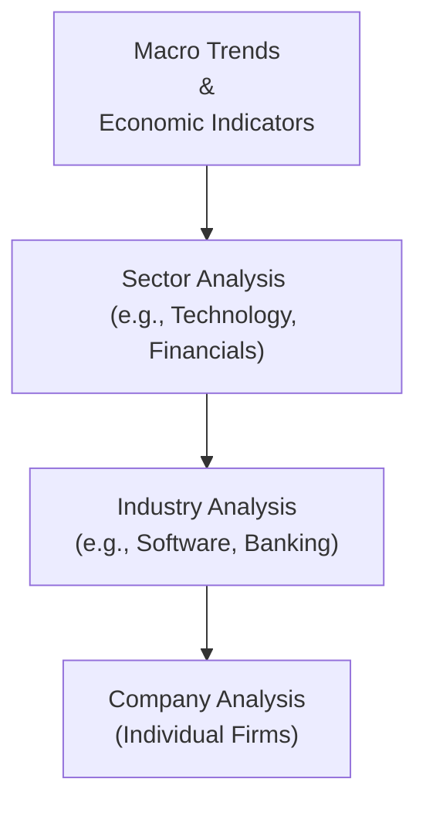
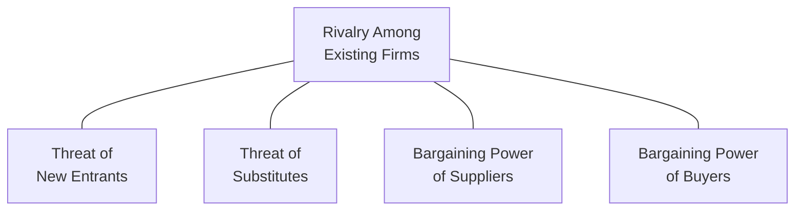

## 6.5 Industry Analysis

Imagine you have just identified a mega-trend in renewable energy after poring over economic data and hearing about new government incentives. The next step might be to look at the broader sector—Energy in this case—and then find the specific industries or niches (Hydro, Solar, Wind, etc.) that seem poised to grow. This movement from big-picture macro trends to narrower, specific industries is what we mean by “industry analysis.” Let’s take a closer look at how it all fits together.

### Understanding Sectors vs. Industries

If someone says, “I’m looking into the Financials sector,” they might be talking about insurance, banking, or asset management. A “sector” is a broad classification—think Energy, Healthcare, Financials, Technology. An “industry,” on the other hand, is more specific. Within Technology, for example, you’ll find industries like Software, Hardware, and Semiconductors. Within Financials, you might focus on Insurance or Investment Brokerage. 

At a high level:
• Sector: A broad grouping of similar businesses (Healthcare, Energy, Financials).  
• Industry: A narrower, more precise classification within a sector (Oil & Gas Production under Energy, or Banking under Financials).

### The Top-Down Approach

Industry analysis is usually done within the context of a top-down approach. Start macro, looking at economic growth, interest rates, inflation, consumer confidence, and fiscal or monetary policies. Next, you identify which sectors are likely to flourish (or at least remain resilient) under these conditions. Finally, you zero in on the most promising industries inside those sectors. 

Using a top-down approach can be visualized like this:

If, for instance, the Bank of Canada is expected to keep interest rates low, you might predict strong growth in a Technology sector that relies on cheap financing to fund research and development. From there, you might narrow your focus to Software or Data Analytics.

### Using Porter’s Five Forces

Let’s say you identify “Semiconductors” or “Specialty Retail” as industries you want to explore. An excellent tool for deeper analysis is Porter’s Five Forces. Developed by Michael E. Porter, this framework helps you figure out how profitable an industry could be based on five main forces:

1. Rivalry Among Existing Firms:  
   How intense is the competition among existing players? If there’s a fierce price war or the products are pretty similar, it’s tough to maintain healthy profit margins.

2. Threat of New Entrants:  
   Is it easy for new companies to enter? Maybe in software, barriers to entry are not that high. But in industries like airlines, with heavy regulation and capital costs, it’s more difficult for new competitors to pop up.

3. Threat of Substitutes:  
   Are there alternative products that can replace what the industry offers? If substitutes exist—think Netflix substituting for traditional cable television—companies in that industry may face shrinking demand.

4. Bargaining Power of Suppliers:  
   Consider a smartphone manufacturer relying on a few specialized chipmakers. If the chipmakers have unique technology patents and limited competition, they can set higher prices, pressuring the smartphone industry’s profit margins.

5. Bargaining Power of Buyers:  
   This force asks if buyers have the leverage to demand lower prices or improved product features at no additional cost. A single, large retail chain, for instance, can force suppliers across multiple industries to compete heavily on price.

### Industry Life Cycle

Industries aren’t static; they evolve through time. One simple (though not perfect) way to picture this is via the “industry life cycle.” Typically, it has four phases:

• Introduction: When an industry is brand-new, possibly with just a few pioneer firms. Early adopters and R&D spending tend to dominate.  
• Growth: The industry experiences rising demand, better profitability, and often more new entrants.  
• Maturity: Growth flattens, competition is intense, and companies must innovate or find new markets to sustain profitability.  
• Decline: Demand wanes, newer industries or technologies replace old ones, and companies may exit or pivot.

Take the cannabis industry in Canada, for example. Around 2018, it moved from an “early growth” to a more “mature” phase. Regulatory changes, competition, and capital constraints shaped its path. At first, it felt a bit like the Wild West—funding pouring in, new companies forming, excitement skyrocketing. Over time, we observed consolidation, competition, and the need for differentiation.

### Regulatory and Technological Changes

You can’t examine an industry effectively if you ignore the legal and technological environments. Canadian cannabis, again, probably stands out as an example of how new regulations gave birth to an entirely fresh industry. Fintech (financial technology) is another. Rapid shifts in technology can suddenly alter how companies deliver products or serve customers.

It’s also important to keep in mind that Canada has unique regulatory nuances compared to, say, the U.S. or the EU. Government oversight (through CIRO, for instance) can require certain disclosures, licensing steps, or compliance costs that impact profitability. In addition, changes in environmental regulations might drastically affect the Energy sector’s growth potential.

### Key Performance Indicators (KPIs)

Once you’ve identified an interesting industry, you’ll want to track the metrics or “KPIs” that are most relevant. The precise KPIs differ by industry. For example:  
• Retail: Same-store sales, foot traffic, inventory turnover.  
• Oil & Gas: Rig counts, production costs, proven reserves, commodity pricing decks.  
• Tech: R&D expenditures, user growth rates, daily active users (DAU), monthly recurring revenue (MRR).  
• Telecommunications: Subscriber churn rates, average revenue per user (ARPU), licensing of spectrum frequencies.  

These specialized data points often indicate how healthy or risky an industry might be. If you notice that, over the last four quarters, major retailers consistently report lower same-store sales, well, that’s a sign the industry may be under pressure.

### Global Competition and Supply Chain Factors

We live in a globalized world, so competition doesn’t just come from domestic players. Canadian technology firms might be up against large U.S. firms with bigger budgets. Supply chain disruptions—like we saw in shipping during the COVID-19 pandemic—can choke off raw materials for manufacturers or cause shipping delays for retailers. Fluctuations in currency (CAD vs. USD) might also impact the attractiveness of Canadian exports or the cost of imported supplies.

In the automotive industry, for example, a shortage of semiconductors can significantly reduce production capacity—Audi, GM, Toyota all faced hardships that cascaded across the supply/demand balance. The same supply chain challenge also trickled into smaller industries dependent on microchips.

### Combining Quantitative and Qualitative Analysis

Numbers alone rarely tell the entire story. While analyzing an industry, read industry reports from well-known consulting firms (Deloitte, PwC, KPMG). Check specialized news sources. Look at management comments in corporate filings on SEDAR+ (https://www.sedarplus.ca/). A thorough approach merges:  
• Quantitative: Financial statements, growth rates, profit margins, price-to-earnings ratios for the sector, historical demand.  
• Qualitative: Innovations, brand reputation, leadership, customer loyalty, regulatory risks, and industry sentiment.

Striking the right mix helps you avoid missing key signals. Maybe a particular Fintech industry is showing tremendous growth in user adoption (quantitative) while the press highlights serious data security concerns (qualitative).  

### Practical Example: Technology Industry

Let’s say you’re doing a deep dive on the Canadian Technology sector. Maybe you notice that software providers with cloud-based solutions have been in especially high demand. You apply Porter’s Five Forces to see if barriers to entry are moderately high (due to specialized expertise needed) and if suppliers—like big cloud hosting services—wield only moderate leverage. You discover that the key metric is monthly user churn. Then you glean from a Deloitte sector report that companies under $50 million in revenue often see sharply higher churn than bigger, more established peers. As a result, you focus on mid- to large-sized software firms with stable finances and mature processes.

### Personal Anecdote: When Industries Surprise Us

I remember a few years back, I got really excited about the drone-delivery industry. It seemed like something out of a sci-fi movie—packages dropped straight onto your lawn by a hovering device. The biggest challenge was regulation, and it turned out transporting commercial goods with drones faced a mountain of red tape and safety concerns. Suddenly, what I assumed would be a quick “growth stage” leveled off into an extended “introduction phase.” The moral? Industry life cycles aren’t always predictable, especially when new regulations or safety concerns pop up.

### Best Practices and Pitfalls

• Best Practices:  
  - Stay updated with authoritative industry reports.  
  - Cross-check financial data with market sentiment.  
  - Consider both micro- and macro-level factors.  

• Pitfalls:  
  - Overreliance on historical data. Industries can shift quickly due to new technology or government policies.  
  - Ignoring the competitive landscape. Just because demand is high doesn’t mean the industry will be profitable if competition is fierce.  
  - Neglecting currency or supply chain issues. A big currency swing might unravel the economics of an entire industry.  

### Industry Analysis in the Canadian Context

As of 2025, Canadian financial regulators have consolidated under the Canadian Investment Regulatory Organization (CIRO). For deeper insights:
• CIRO (https://www.ciro.ca) is Canada’s national self-regulatory body overseeing investment dealers, mutual fund dealers, and equity/debt marketplaces.  
• SEDAR+ (https://www.sedarplus.ca/) is your main portal for Canadian corporate filings.  
• The Canadian Investor Protection Fund (CIPF) is the sole investor protection fund if a member firm goes insolvent. Note that CIPF and CIRO remain distinct.  

Industries like cannabis, fintech, or green energy are especially susceptible to new licensing requirements or environmental laws that can dramatically alter the costs and profit margins for companies operating here.

### Putting It All Together

At the end of the day, the goal of industry analysis is to help you figure out if an industry stands a good chance of generating robust returns for its businesses (and, by extension, for you as an investor). Whenever you’re deciding on an equity investment, consider the broader macro environment, pick a sector that suits those conditions, and then delve into the industry’s competitive landscape, life cycle, regulatory environment, and key metrics. Finally, be flexible—things can (and often do) change fast.

### Glossary

• Sector: A broad grouping of similar businesses, such as Energy, Healthcare, or Financials.  
• Industry: A narrower classification within a sector (e.g., Software within Technology).  
• Porter’s Five Forces: A framework for analyzing competition and profitability in an industry, focusing on rivalry, new entrants, substitutes, suppliers, and buyers.  
• Industry Life Cycle: The stages an industry moves through—introduction, growth, maturity, and decline.  
• Competitive Rivalry: The intensity of competition among existing businesses in the same industry.  
• Threat of New Entrants: The likelihood of new competitors entering and reducing profits for existing firms.  
• KPIs (Key Performance Indicators): Specific metrics used to measure progress or performance in an industry or firm.  
• Regulatory Environment: The laws, rules, and guidelines that govern business operations within an industry.  
• Supply Chain: The series of processes involved in producing and distributing goods or services.

### References and Further Exploration

• CIRO (https://www.ciro.ca) – for up-to-date rules, compliance, and regulatory guidelines.  
• SEDAR+ (https://www.sedarplus.ca/) – official Canadian repository for corporate disclosures.  
• Harvard Business Review on Porter’s Five Forces – for a deeper dive into competitive strategy frameworks.  
• Google Finance / Yahoo Finance – free tools for screening industry metrics.  
• Deloitte, PwC, KPMG – for specialized industry research, market forecasts, and consulting-level reports.  

Let this be a starting point for your own investigative journey. Analyzing an industry thoroughly is a lot like detective work—keep your senses open, ask tough questions, and follow the clues until you have a comprehensive understanding.  

Remember: nothing here is a guarantee or official investment advice. Industry analysis is one (crucially important) step in the bigger puzzle of portfolio management. Keep learning, stay curious, and good luck.

---

## Test Your Knowledge: Industry Analysis Insights



### Which of the following best describes the difference between a sector and an industry?

- [ ] A sector is narrower than an industry.  
- [ ] A sector covers the same classification size as an industry.  
- [x] A sector is broader, and an industry is a more specific grouping within that sector.  
- [ ] An industry always includes multiple sectors.  

> **Explanation:** The sector-then-industry classification means sectors are broad (e.g., Financials), while industries (e.g., Banking) are narrower categories within each sector.

### In a top-down analysis approach, which stage generally comes immediately before industry analysis?

- [ ] Company analysis.  
- [ ] Portfolio rebalancing.  
- [x] Sector analysis.  
- [ ] Security pricing.  

> **Explanation:** You begin macroeconomic analysis, then examine sectors, then move to industries, and finally dig into individual companies.

### Which of these is NOT one of Porter’s Five Forces?

- [ ] Threat of New Entrants.  
- [ ] Bargaining Power of Buyers.  
- [ ] Threat of Substitutes.  
- [x] Macroeconomic Growth Rate.  

> **Explanation:** Porter’s Five Forces are rivalry among existing competitors, threat of new entrants, threat of substitutes, bargaining power of suppliers, and bargaining power of buyers.

### Suppose you’re analyzing the oil and gas industry. Which KPI might be most relevant?

- [ ] Customer churn.  
- [ ] Same-store sales.  
- [x] Rig counts.  
- [ ] Foot traffic.  

> **Explanation:** In oil and gas, rig counts can indicate levels of production activity and are widely used by industry analysts to gauge performance and outlook.

### Which of the following best characterizes the growth phase in an industry life cycle?

- [x] Rapid expansion, higher demand, and more entrants.  
- [ ] Flat revenues, regulatory headwinds, and little innovation.  
- [ ] Stabilization in profits, limited entry from new firms.  
- [ ] Substantial capacity reduction and exit of competitors.  

> **Explanation:** The growth phase typically features rising demand, new players entering, and higher potential for profit margins.

### Which of the following is a possible impact of strong supplier bargaining power?

- [x] Suppliers can charge higher prices, squeezing industry margins.  
- [ ] Industry competitors become more collaborative.  
- [ ] Rivalry among existing firms decreases.  
- [ ] Industry life cycle accelerates.  

> **Explanation:** When suppliers can demand higher input costs, companies in the industry see reduced profit margins unless they find ways to pass costs on or secure alternative suppliers.

### What might you watch for if the threat of new entrants is high?

- [x] Possible erosion of existing firms’ profitability as competition increases.  
- [ ] Reduced competition that boosts profitability.  
- [x] The potential for falling prices due to more players in the market.  
- [ ] Higher legal barriers preventing new competition.  

> **Explanation:** High threat of new entrants can mean more competition, often pressuring margins and leading to price competition.

### In a top-down approach, if you identify robust economic growth and low interest rates, which sector might receive greater focus?

- [x] Technology, because low rates can fuel innovation and financing.  
- [ ] Utilities, due to stable dividends.  
- [ ] Consumer staples, due to fixed consumer demand.  
- [ ] There is no direct link between macro trends and specific sectors.  

> **Explanation:** Low interest rates often benefit growth-driven sectors like Technology, allowing them access to cheaper capital for R&D and expansion.

### Which of the following describes a “mature” industry?

- [x] Stable demand, intense competition, slow growth, and modest profits.  
- [ ] Early-stage industry with limited competitors.  
- [ ] Rapidly expanding demand and many new entries.  
- [ ] Declining demand, excess capacity, and frequent business exits.  

> **Explanation:** A mature industry is characterized by relatively stable demand, slower rates of growth, and a well-established competitive environment.

### When performing industry analysis, it’s crucial to consider qualitative factors like brand reputation and regulatory changes.

- [x] True  
- [ ] False  

> **Explanation:** Qualitative aspects (like brand strength, technological leadership, or regulatory shifts) can be pivotal in assessing future profitability and viability.


