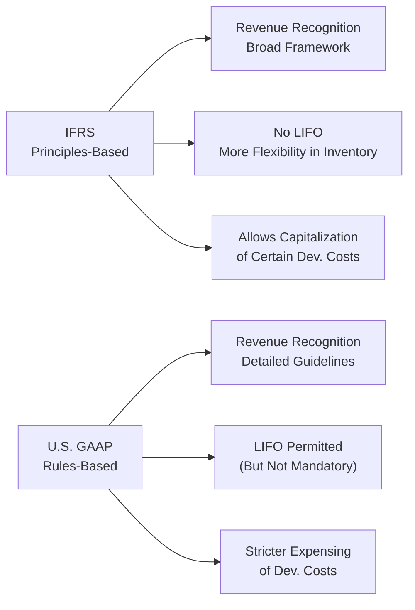

## 7.1 The Difference Between IFRS and GAAP?

Have you ever compared two different companies—maybe one listed in Toronto and another listed in New York—and wondered why the numbers on their financial statements don’t quite line up? It can be borderline frustrating, right? I remember back when I was just starting out in the investment field. I had a friend who invested in a U.S.-based distributor and compared its financials against a Canadian tech startup without any real adjustments or awareness of the different reporting frameworks. Let’s just say confusion ensued.

In this article, we’re going to break down why, in Canada, publicly accountable enterprises (basically companies with a public presence) generally use International Financial Reporting Standards (IFRS), while in the U.S., companies follow Generally Accepted Accounting Principles (U.S. GAAP). These frameworks share a common goal of producing coherent and comparable financial statements, but each has its own unique style and approach. If you’re advising clients or managing your own cross-border investments, understanding these distinctions might save you from plenty of head-scratching.

By the way, if you’re looking for authoritative info on who enforces what in Canada, check out the Canadian Investment Regulatory Organization (CIRO) at https://www.ciro.ca/. They’re responsible for overseeing investment dealers, mutual fund dealers, and the equity- and debt-market integrity. But let’s dig into the actual accounting differences.

## IFRS and GAAP: Background and Philosophy

IFRS is issued by the International Accounting Standards Board (IASB). Many countries around the world (including Canada for publicly accountable entities) have adopted IFRS, so if a Canadian firm is publicly traded, you can expect its financial reporting to align with IFRS. Prior to 2011—yes, that’s not so long ago—publicly listed Canadian companies primarily used “Canadian GAAP.” But that was replaced by IFRS for most public companies, aligning Canada with a global reporting standard.

In the U.S., the Financial Accounting Standards Board (FASB) is responsible for U.S. GAAP. This approach is generally more rules-based, meaning it outlines detailed guidance for various industries and scenarios, so companies in the U.S. have a pretty structured and prescriptive set of rules. IFRS, meanwhile, is more principles-based. That means IFRS provides central principles to guide accountants and management in determining how to handle transactions based on the “economic substance.” That can allow for more interpretation but often requires more disclosures in the financial statements.

### Why It Matters

If you’re an investment advisor or portfolio manager, you might be advising a Canadian client who is eyeing a U.S.-based company or vice versa. The difference in frameworks can lead to discrepancies in reported revenue, net income, equity, or just about any key figure you rely on to make those big decisions. Without knowing these differences, comparing a Canadian IFRS-based statement to a U.S. GAAP-based statement can be like comparing apples to something that only sort of resembles apples.

## Key Areas of Difference

Let’s dive into some of the big-ticket items where IFRS and U.S. GAAP diverge. Just a heads-up: not every difference might come up in your daily routine, but it’s good to have a mental map of potential hotspots.

### Revenue Recognition
Under IFRS (specifically IFRS 15), revenue recognition revolves around identifying distinct performance obligations within a contract and recognizing revenue when (or as) those obligations are satisfied. U.S. GAAP has a somewhat similar model in ASC Topic 606 but can include more explicit details or industry-specific guidance. You might wonder, “Does that matter?” You bet. If you’re someone trying to figure out an e-commerce company’s actual revenue timeline, small differences in how each step is recognized can lead to noticeable variations in quarterly or annual revenue numbers.

### Inventory Accounting (LIFO vs. FIFO)
A personal anecdote: once, I was trying to compare cost of goods sold (COGS) for two retail companies—one Canadian, one American. I nearly fell off my chair when I discovered the U.S. one was using LIFO (Last-In, First-Out), which IFRS doesn’t allow. Under IFRS, you can use FIFO (First-In, First-Out) or weighted average cost, but not LIFO. U.S. GAAP permits LIFO, although not all U.S. companies opt to use it. If a U.S. company uses LIFO in times of rising prices, reported earnings might be relatively lower because the most recent (and presumably higher) inventory costs get recognized first. This could affect how you interpret profitability and even some key ratios like gross margin.

### Development Costs (Capitalization vs. Expense)
IFRS tends to allow the capitalization of development costs—provided certain economic feasibility criteria are met—while U.S. GAAP is stricter and usually requires companies to expense development costs in most scenarios until they pass a certain viability threshold. So if you’re analyzing tech or pharmaceutical companies with substantial R&D, it’s important to note that IFRS might let them reflect a more “asset-based” approach on the balance sheet, whereas U.S. GAAP might push more of those costs straight to the income statement early on.

### Financial Instruments
We don’t always think about how big “financial instruments” are in the world of accounting, but for banks, insurers, or any investment-heavy organization, IFRS 9 (under IFRS) and ASC Topic 825 (under U.S. GAAP) can produce materially different outcomes. IFRS focuses heavily on the business model for holding the instruments and the contractual cash flow characteristics, while U.S. GAAP might impose more rigid classification rules. You’ll want to watch out for differences in how impairments are recognized, especially in cyclical economic times.

### Lease Accounting
Both IFRS (IFRS 16) and U.S. GAAP (ASC 842) have updated lease accounting in recent years, pushing more leases onto the balance sheet. The difference? IFRS lumps most leases into one accounting model for lessees, while U.S. GAAP still distinguishes between finance leases and operating leases on the income statement presentation side. Practically, if you’re analyzing cash flow or EBIT(DA), subtle classification differences can swirl up confusion.

### Disclosures and Principles vs. Rules
IFRS’s principles-based approach might allow for considerable managerial judgment, which often means you’ll see more disclosures in the notes to the financial statements. Meanwhile, U.S. GAAP’s rules-based approach might walk you through explicit instructions for certain transactions, leaving a bit less room for interpretation, though the standards themselves can become long and detailed. 

### A Quick Visual Overview

Below is a simple Mermaid diagram providing a high-level look at IFRS vs. GAAP approaches in a few areas:

This diagram, though simplistic, highlights some of the main differences we’ve been talking about.

## Why This All Matters for Investment Management

### Comparing Apples to… IFRS Apples
To be consistent, you need to be aware of which framework is being used—but also how it’s being applied. Something as simple as an EBITDA figure might look different if a company capitalizes certain development costs under IFRS versus a GAAP-reporting company that expensed them. When you weigh companies against each other, you’re not always seeing an “apples-to-apples” comparison if the underlying accounting assumptions differ.

### Cross-Border Portfolio Decisions
If your client is excited about investing in both Canadian and U.S. markets, you might do a side-by-side ratio comparison—like Price-to-Book (P/B) or Price-to-Earnings (P/E)—only to discover the ratio is skewed by different accounting treatments for intangible assets, revenue recognition timing, or inventory. This is particularly relevant in globalization and cross-border M&A, where synergy calculations might be impacted by how intangible values are carried under each framework.

### The Notes to Financial Statements Are Your Friend
Sometimes, you just have to read the footnotes in the annual or quarterly reports. That’s where companies reveal their key accounting policies, changes in assumptions, or any unusual items. If a company uses IFRS, it might highlight how it transitioned from a local GAAP. And if it’s a U.S. issuer that also lists in Canada (or vice versa), it might provide a reconciliation. Those notes can help you adjust your valuations or interpret the numbers carefully.

### Best Practices for Advisors and Analysts
• Know which standard you’re dealing with.  
• Identify specific areas of difference: revenue recognition, inventory valuation, intangible assets, lease accounting, and so forth.  
• Use normalized or adjusted metrics if making cross-company comparisons.  
• When in doubt, go to the source: the notes to the financial statements.  

## Potential Pitfalls and Challenges

• Overlooking LIFO vs. FIFO: might inflate or deflate reported income in changing market conditions.  
• Missing intangible assets or capitalized development costs: can distort R&D and operational figures.  
• Not reading footnotes: the real story often lives in the accounting policy disclosures.  
• Overconfidence in “one-size-fits-all” ratios: An ROE of 15% under IFRS might not be the same beast as an ROE of 15% under U.S. GAAP.  

## Real-World Scenarios and Examples

### Tech Startups
Many Canadian tech startups spend a chunk of money on software development. IFRS can let them capitalize some of those costs if certain profitability and feasibility thresholds are met. Meanwhile, a comparable U.S.-based startup might expense a larger portion of those costs right away under GAAP, potentially reducing net income early on. If you’re trying to weigh them equally for an investment capital injection, be aware these differences could influence net margin metrics.

### Resource Extraction Companies
For resource companies—oil, mining, natural gas—the difference in how exploration and evaluation costs are treated can be massive. IFRS often provides broad guidance, whereas U.S. GAAP for resource industries can contain more specific rules. If you advise clients in Alberta or in Texas, be sure to investigate how the companies handle these upfront exploration and development costs.

### Retailers and Manufacturer
With a U.S. retailer using LIFO in an inflationary environment, cost of goods sold might be higher (most recent inventory is recognized first). Contrast that with a Canadian retailer using FIFO, which might lead to higher reported profits in a similar environment. This difference can impact everything from net income to tax expense to your ratio analysis.

## Practical Tips: How to Adapt Your Analysis

If you’re reading all this and thinking: “Um, so do I need two sets of analysis now?” Possibly. But it doesn’t have to be complicated:

• Make note of the inventory valuation method: especially relevant if you’re analyzing cyclical industries or high-inflation scenarios.  
• Check how intangible assets are recognized: especially for tech, biotech, and pharma.  
• Pay attention to how leases are broken out: IFRS lumps them, while GAAP might separate them.  
• Add or remove capitalized costs in your own “adjusted” analysis if you want a more apples-to-apples approach across different frameworks.  

## Further Resources and Learning

If you want to dive deeper, consider dropping by:

• [CIRO](https://www.ciro.ca/) – for regulatory guidance in Canada regarding disclosures.  
• [IFRS Foundation](https://www.ifrs.org/) – for the text of IFRS standards and additional guidance.  
• [U.S. SEC](https://www.sec.gov/) – for U.S. GAAP reporting requirements, not to mention cross-border listing details.  
• Open-source financial databases like [Yahoo! Finance](https://finance.yahoo.com/) or [Google Finance](https://www.google.com/finance/) – you can see how companies report in real-time, and possibly find references to the accounting frameworks they use.  

### Recommended Books
• “Wiley IFRS: Practical Implementation Guide and Workbook” by Abbas A. Mirza, Graham Holt, and Liesel Knorr.  
• “Financial Statement Analysis and Security Valuation” by Stephen Penman.  

### Suggested Online Courses
• Coursera has a range of courses under “Accounting and Financial Statements” that compare IFRS vs. GAAP.  
• IFRS Foundation’s free online modules on the IFRS website—a great place for case studies and interactive exercises.

## Encouraging Continuous Learning

It’s easy to get stuck in one domain—maybe you’re comfortable with IFRS because you’ve mostly dealt with Canadian companies. But in an increasingly global marketplace, remember that your clients, or even your personal portfolio, might be exposed to companies from multiple jurisdictions. The more you grasp these frameworks, the more confidently you can discuss valuations, performance metrics, and investment decisions. In short, this knowledge is a strong ally—don’t be shy to revisit these concepts regularly.

Just remember: even if these differences seem minor, they can tell a big story when you’re dealing with large sums of money or major swings in reported earnings. If something doesn’t quite add up when you compare a Vancouver-based potash producer against a Houston-based oil-and-gas business, it might not be your imagination. It could just be IFRS vs. GAAP.

## Professional IFRS vs. GAAP Knowledge Quiz



### Which organization issues the IFRS standards?

- [ ] The Financial Accounting Standards Board (FASB)
- [x] The International Accounting Standards Board (IASB)
- [ ] The Canadian Investment Regulatory Organization (CIRO)
- [ ] The U.S. Securities and Exchange Commission (SEC)

> **Explanation:** IFRS standards are developed and issued by the IASB, whereas U.S. GAAP is overseen by the FASB.

### Under which framework is LIFO (Last-In, First-Out) permitted?

- [ ] IFRS only
- [x] U.S. GAAP only
- [ ] Both IFRS and U.S. GAAP
- [ ] Neither IFRS nor U.S. GAAP

> **Explanation:** LIFO is allowed under U.S. GAAP but explicitly not permitted under IFRS.

### Which of the following is a known characteristic of IFRS?

- [x] It is principles-based.
- [ ] It contains more detailed, rules-based guidance than U.S. GAAP.
- [ ] It is only used by private companies in Canada.
- [ ] It is developed by the FASB.

> **Explanation:** IFRS is known for its principles-based approach, providing overarching guidelines rather than extremely detailed rules.

### When analyzing a Canadian public company and a U.S. public company, what is the best first step regarding their financial statements?

- [ ] Assume the standards are the same and start comparing net income directly.
- [ ] Change both statements to IFRS for consistency without further disclosure.
- [x] Verify which framework each company uses and examine how that might affect reported metrics.
- [ ] Only compare the liabilities section, as revenues are always the same.

> **Explanation:** Always confirm which standard each company follows and consider how IFRS vs. GAAP can alter figures, particularly concerning net income, inventory, etc.

### Which of the following is required to be capitalized under IFRS (when certain criteria are met) but is often expensed immediately under U.S. GAAP?

- [x] Development costs
- [ ] All intangible assets
- [x] Certain intangible assets meeting feasibility criteria
- [ ] Goodwill from acquisitions

> **Explanation:** IFRS allows capitalization of some development costs once certain feasibility and future economic benefit criteria are met, while U.S. GAAP is more restrictive. Goodwill from acquisitions is capitalized under both frameworks, but the nuance lies in development costs.

### Under IFRS 15, how is revenue generally recognized?

- [x] When performance obligations in a contract are satisfied
- [ ] Immediately upon signing a contract
- [ ] After concluding an entire multi-year agreement
- [ ] It is recognized on an as-desired basis by management

> **Explanation:** IFRS 15 uses a five-step model focusing on identifying performance obligations and recognizing revenue when control of goods or services passes to the customer.

### Which advisory body replaced the MFDA and IIROC in Canada to oversee investment dealers and mutual fund dealers?

- [x] The Canadian Investment Regulatory Organization (CIRO)
- [ ] The IFRS Foundation
- [ ] The U.S. Securities and Exchange Commission
- [ ] The Financial Accounting Standards Board

> **Explanation:** Effective June 1, 2023, CIRO is the national self-regulatory organization that replaced the Mutual Fund Dealers Association and the Investment Industry Regulatory Organization of Canada.

### Which of the following is a valid resource to check official IFRS documentation?

- [x] The IFRS Foundation website (ifrs.org)
- [ ] The U.S. Securities and Exchange Commission website (sec.gov)
- [ ] Yahoo! Finance
- [ ] Canadian Investment Regulatory Organization website (ciro.ca)

> **Explanation:** The IFRS Foundation website publishes official IFRS standards and related guides. SEC.gov mainly covers U.S. GAAP and U.S. securities regulation.

### Why should analysts read the notes to the financial statements?

- [x] To understand specific accounting policies and assumptions
- [ ] Because they are required reading by law, even if they add no real value
- [ ] Because they always repeat the same details as the main statements
- [ ] Only to check for the external auditor’s signature

> **Explanation:** The footnotes provide critical explanations about accounting policies, judgments, estimates, and one-off items that aren’t obvious in the core statements.

### Under both IFRS and U.S. GAAP, companies must generally bring most leases onto the balance sheet. True or False?

- [x] True
- [ ] False

> **Explanation:** Following recent updates (IFRS 16 and ASC 842), the majority of leases, with some exceptions, are recognized on the balance sheet. The treatment in the income statement, however, can differ slightly between IFRS and U.S. GAAP.


