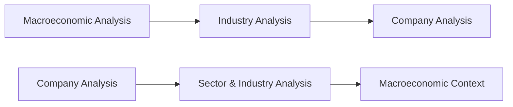

## 7.2 Company Analysis

Analyzing a company might seem like a mammoth task—like trying to figure out why a certain donut shop in your neighborhood does so well when there’s another donut shop just a block away struggling to stay open. Company analysis aims to answer questions like: “What’s special about this firm?” “Why does it succeed (or fail) in the marketplace?” and “Is investing in it a good idea?” In essence, you’re looking at the firm from multiple angles: financial statements, strategic outlook, market competitiveness, management quality—yes, even the intangible “vibe” of its corporate culture.

Below, we’ll walk through the key components of a company analysis. We’ll talk about how to dig into a firm’s operations, the difference between top-down and bottom-up analysis, best practices in financial statement evaluation, ratio analysis, management assessment, brand strength, and even environmental, social, and governance (ESG) factors. We’ll also keep an eye on important regulatory considerations, especially for the Canadian market where CIRO (the Canadian Investment Regulatory Organization) ensures transparent practices. And hey, I might share a few personal anecdotes along the way. Let’s get started.

---

### Why Company Analysis Matters

If you’ve ever wondered why two companies in the same industry can have vastly different stock valuations and reputations, you’ve essentially pondered the core question behind company analysis. By peeking under the hood of a corporation’s financials, strategy, and management, you gain insights into what truly makes it tick. This helps in:

• Identifying whether a company is well-managed and financially sound.  
• Pinpointing growth opportunities and anticipating risks.  
• Determining a fair valuation range for the company’s shares.  
• Understanding how broader economic and industry trends could affect that business.

Gone are the days when reading only the headlines would suffice. Company analysis serves as your magnifying glass, letting you zoom in and see the details.

---

### Approaches to Company Analysis

There are generally two main “routes” you can take: top-down and bottom-up. While they both end at the same destination—understanding a firm’s prospects—they start from opposite directions.

**Top-Down Analysis**  
Top-down starts with the “big picture” and drills downward. You first look at the macroeconomic environment (economic growth, interest rates, consumer confidence, global trade patterns). Then, you examine the specific industry: Are you dealing with an industry in decline or is it booming? Only after building that context do you finally focus on the company. This approach can be helpful when you believe broad economic factors or industry trends will have a massive impact on corporate profitability.

**Bottom-Up Analysis**  
If you’re more interested in an individual firm’s fundamentals and less concerned about short-term macro events, a bottom-up approach might be your style. Here, you scrutinize the firm first—its revenue drivers, its balance sheet, its growth plan—then you step back to see how it fits into the industry and broader economic environment. This method is common among value investors who relish digging into company-specific data in search of undervalued (or overlooked) gems.

Below is a quick visual of how these two approaches flow:

Left to right: The top path shows a top-down progression (A→B→C), and the bottom path shows a bottom-up progression (D→E→F).

---

### Dissecting a Company’s Financial Statements

For me, one of the most fun (yes, I said “fun”) parts of company analysis is looking at financial statements. Sure, it can be intimidating at first—numbers, footnotes, columns that might make your head spin—but it’s like reading a fascinating story of how money moves in and out of a company.

Here’s the basic lineup you’ll encounter:

• **Balance Sheet:** This tells you what the company owns (assets) and what it owes (liabilities), plus the net worth (shareholders’ equity).  
• **Income Statement:** This shows revenues, expenses, and net income over a period. Also known as the profit and loss statement.  
• **Statement of Cash Flows:** Tracks cash inflows and outflows from operations, investing, and financing activities.  
• **Notes to the Financial Statements:** Often overlooked, but these notes can contain gold nuggets of information about accounting methods, major risks, and off-balance-sheet items.

When you look closely, you’ll assess a few things: Does the business generate enough profit from its core operations? Are its profit margins consistent, growing, or shrinking? Are there big liabilities that might jeopardize solvency down the road? What about its cash situation—can it pay employees and suppliers easily?

Remember, in Canada, all public companies listed on stock exchanges must comply with CSA (Canadian Securities Administrators) guidelines for financial reporting. You can find their filings on [SEDAR+](https://www.sedarplus.ca/)—a great resource if you want to geek out on public company data.

---

### Key Ratio Analysis

Numbers on their own are just that—numbers. You need context to make those numbers speak. Ratio analysis gives them a voice, letting you gauge trends and compare companies across the same industry. Let’s look at the four main categories:

**Liquidity Ratios**  
• **Current Ratio (Current Assets / Current Liabilities):** Measures the firm’s ability to meet short-term obligations. A ratio above 1 could indicate good short-term financial health, but context is queen—some industries have inherently lower current ratios.  
• **Quick Ratio (Cash + Marketable Securities + Receivables) / Current Liabilities:** More stringent than the current ratio because it excludes inventory and other less-liquid assets.

**Profitability Ratios**  
• **Gross Margin (Gross Profit / Sales):** Illustrates how effectively a company is managing its production costs relative to its sales. A stable or rising gross margin often signals strong operational efficiency.  
• **Net Margin (Net Income / Sales):** Reflects the profit left after all expenses, interest, and taxes. And trust me, you can learn a lot about a firm’s operational discipline by looking at its net margin trends.  
• **Return on Equity – ROE (Net Income / Shareholders’ Equity):** Focuses on how effectively a company uses shareholders’ money to generate profits.

**Leverage Ratios**  
• **Debt-to-Equity (Total Debt / Shareholders’ Equity):** Higher ratios can mean higher risk if earnings decline; however, some industries thrive on higher leverage (like utilities).  
• **Interest Coverage (EBIT / Interest Expense):** Tells you how many times a company’s earnings can cover its interest payments. An interest coverage ratio below 1 is a major red flag.

**Efficiency Ratios**  
• **Asset Turnover (Net Sales / Average Total Assets):** How well a company uses its assets to generate revenue.  
• **Inventory Turnover (Cost of Goods Sold / Average Inventory):** Useful for understanding how quickly inventory is converted into sales. In some industries, it’s normal to have slow turnover (think luxury cars), whereas in others (like groceries), you want to see those shelves empty and restocked often.

Let’s not forget intangible factors. If you want to measure intangible customer loyalty, brand strength, or IP, you might consider additional metrics like R&D spending as a percentage of sales or brand equity measures. They won’t show up cleanly on every balance sheet, but they’re crucial to the broader story.

---

### Qualitative Analysis

Numbers are important, but so are the stories behind the numbers. You can’t quantify everything—yet these qualitative cues might just be why one donut shop thrives and the other struggles.

**Management and Governance**  
• **Effectiveness:** Do the executives have a track record of creating value?  
• **Credibility:** Do they communicate openly and clearly with shareholders?  
• **Governance Structure:** Are there robust checks and balances? Do independent directors truly act independently?

**Corporate Culture**  
We’re talking everything from employee satisfaction to the company’s approach toward customers, suppliers, and the community. Sometimes you’ll see intangible synergy that leads to innovation. Other times, a demoralized culture leads to toxic workplaces that hamper growth.

**Brand Reputation and Competitive Advantage**  
Think about it. Would you pick a no-name coffee chain over Starbucks if prices and convenience were the same? Brand equity often translates into pricing power and customer loyalty. If a firm’s competitive advantage (like patented technology, an iconic brand, or an exclusive licensing agreement) acts as a durable moat, that’s a strong plus for long-term investors.

**Market Positioning**  
Even if the company has a good product, how is it positioned relative to peers? Are new entrants cropping up, threatening to chip away market share? Is government regulation or a shift in technology about to upend the playing field?

Often, the place to look for these cues is the **Management Discussion and Analysis (MD&A)** section of annual reports, along with investor presentations and transcripts from earnings calls. Just be sure to keep a skeptical eye. While these documents are valuable, they can sometimes lean toward rosy optimism—dig deeper and cross-reference with independent news sources.

---

### Assessing the Competitive Landscape

Imagine you have a spectacularly talented runner competing in the Olympics. Even if they’re top-notch, they still need to beat equally talented or more talented peers. A company with an outstanding product or service must contend with a fierce marketplace.

• **Industry Conditions:** Is the industry cyclical? Does it run on commodity prices or interest rate sensitivities?  
• **Market Share Trends:** Has the firm been steadily growing its market share, or is it losing ground?  
• **Barriers to Entry:** High capital requirements, complex licensing, brand loyalty—these can shield a company from competition.  
• **Regulatory Constraints:** In sectors like banking or telecom, government rules can heavily shape profitability.

One small anecdote: I once analyzed a Canadian telecommunications provider that seemed like a sure bet. Great dividends, strong brand awareness. Yet, after reading about upcoming legislation that would open the market to more foreign competition, I realized the playing field was about to shift drastically. That’s the kind of insight you can glean by monitoring the competitive landscape.

---

### ESG Considerations

In recent years, **ESG (Environmental, Social, Governance)** metrics have moved from a “nice-to-have” to a core component of long-term analysis. These factors influence a company’s ability to adapt to environmental changes, social expectations, and governance best practices.

• **Environmental:** Resource usage, greenhouse gas emissions, waste management.  
• **Social:** Employee relations, community impact, diversity, and inclusion.  
• **Governance:** Board independence, executive compensation, shareholder rights.

Companies that ignore ESG concerns risk damaging their brand and facing lawsuits or regulatory fines. On the flip side, strong ESG practices can attract socially conscious investors and consumers. Keep your eyes peeled for sustainability reports, carbon footprint data, and philanthropic track records. They may not show immediate financial returns, but over the long haul, these factors can affect risk and valuation.

---

### Regulatory Considerations and Compliance

Let’s talk about the Canadian angle. Considering we’re dealing with the CIRO era (post-2023 after IIROC and MFDA merged), companies and their advisors must adhere to the highest standards for disclosure and transparency. On top of that, the **CSA (Canadian Securities Administrators)** sets the rules for corporate filings, investor protections, and so on. A few key points:

• **Transparent Financial Reporting:** Companies must comply with International Financial Reporting Standards (IFRS) or other accepted accounting frameworks.  
• **Disclosure of Material Risks:** If something significantly affects the company’s outlook, it must be disclosed faithfully.  
• **CIRO Oversight:** CIRO is your go-to for guidelines on compliance, dispute resolution, and advisor conduct.  
• **SEDAR+ Filings:** Your best friend for deep-diving is [SEDAR+](https://www.sedarplus.ca/). You’ll find annual reports, quarterly statements, material change reports, and more.

The big takeaway: Do not overlook regulatory filings. They can reveal everything from class-action lawsuits to changes in executive compensation. Such disclosures can seriously shift your investment perspective.

---

### Best Practices and Potential Pitfalls

**Stay Inquisitive**  
When reading financial statements, don’t just accept the reported numbers at face value. Check the footnotes. Watch for changes in accounting policies. If the management is suddenly capitalizing expenses that used to be expensed, ask why.

**Beware of Confirmation Bias**  
If you’re already in love with a stock, you might gloss over negative data. Be aware of your own biases. Look for contradictory evidence that might poke holes in your thesis.

**Track the Trend**  
One quarter’s stellar results might be an anomaly. Always compare year-over-year and quarter-over-quarter data. This builds a broader perspective that smooths out short-term blips.

**Economic and Industry Cycles**  
Some companies are more sensitive to economic cycles than others. For instance, luxury goods producers often see big sales dips when consumer confidence falls. Meanwhile, discount retailers sometimes thrive in a downturn. Know where your target company sits on the cyclical spectrum.

**Use Multiple Sources**  
Beyond the company’s own statements, check industry reports, analyst research, competitor filings, and economic data. Sometimes, you’ll find a valuable tidbit in a competitor’s MD&A—like an emerging market threat or a new technology that could disrupt the industry.

---

### A Personal Take on Importance

I recall a time I was analyzing a small manufacturing firm that, on paper, looked downright average. Moderate ROE, decent liquidity, stable but unexciting profit margins—pretty much a “plain vanilla” stock. However, after seeing the new leadership’s discussion in the MD&A, it became clear they were about to pivot into a rapidly growing niche market (medical devices). It took a year for the pivot to be reflected in reported numbers, but after thorough analysis and comparing them to peers already in that niche, I realized the potential. That stock soared two years later because the market recognized the pivot’s success. This story always reminds me that good company analysis is part science, part art.

---

### Additional Tools and Resources

• **CIRO:** [https://www.ciro.ca/](https://www.ciro.ca/) – For rules and guidance on how investment dealers must operate in Canada.  
• **Canadian Securities Administrators:** [https://www.securities-administrators.ca/](https://www.securities-administrators.ca/) – Explore securities regulations, disclosures, and filings.  
• **SEDAR+:** [https://www.sedarplus.ca/](https://www.sedarplus.ca/) – Access continuous disclosure documents, prospectuses, and financial statements for Canadian public companies.  
• **“Security Analysis” by Benjamin Graham and David Dodd** – A seminal work on fundamental analysis. Yes, it’s old-school, but it’s a classic for a reason.  
• **“The Intelligent Investor” by Benjamin Graham** – Another gem focusing on the psychology of investing and the concept of “margin of safety.”  
• **CFA Institute Resources** – Dive deeper into corporate finance, ethics, capital markets, and more.  
• **Canadian Securities Institute (CSI) Materials** – Offers specialized courses on corporate analysis, portfolio management, and advanced financial statement interpretation.

---

### Concluding Thoughts

Company analysis isn’t just about crunching ratios or reading glossy annual reports—it’s a holistic and sometimes creative process. You meld quantitative data with qualitative insights, remain attentive to external industry trends, and watch carefully for changes in consumer sentiment or regulatory environments. By doing so, you’ll be far better equipped to separate the great investments from the mediocre ones.

Now that we’ve covered the essential building blocks of company analysis, the next step is to practice. Pick a public company you’re curious about—maybe one whose product you genuinely enjoy—and start your deep dive. Read the annual report, listen to the latest earnings call, run the key ratios, and see if anything stands out. It can be a rewarding process that gives you confidence in making informed investment decisions or advising your clients.

And hey, who knows? You might just find the next big winner.

---

## Test Your Knowledge: Company Analysis Essentials



### What is a major benefit of performing a top-down company analysis?

- [x] It helps you understand the macroeconomic climate and industry factors before focusing on the individual company.
- [ ] It forces you to ignore broader economic trends.
- [ ] It eliminates the need for ratio analysis.
- [ ] It only considers the company’s financial statements and ignores qualitative data.

> **Explanation:** A top-down approach starts with macro factors like economic growth, interest rates, and industry trends. This provides context before narrowing in on the specific company.

### Which financial statement provides insights into a company’s liquidity and solvency by listing what it owns and owes?

- [ ] The Income Statement
- [x] The Balance Sheet
- [ ] The Statement of Cash Flows
- [ ] The MD&A Section

> **Explanation:** The balance sheet shows assets, liabilities, and shareholders’ equity, giving a snapshot of a company’s short-term and long-term financial health.

### What is the primary focus of the Quick Ratio?

- [x] Determining a firm’s ability to meet short-term obligations using only the most liquid assets.
- [ ] Measuring the overall profitability of the company.
- [ ] Evaluating long-term solvency using long-term liabilities.
- [ ] Measuring operational efficiency in inventory management.

> **Explanation:** The Quick Ratio excludes less liquid assets like inventory and focuses on cash, marketable securities, and receivables.

### What does a company’s net margin reveal to analysts?

- [ ] The percentage of sales going to pay off interest on debt.
- [ ] The revenue generated per employee in the company.
- [ ] How quickly inventory is turned into sales.
- [x] The amount of profit left after all expenses, interest, and taxes.

> **Explanation:** Net margin (net income / sales) indicates how much actual profit remains after deducting all costs and expenses.

### Why might an interest coverage ratio of less than 1 be a red flag?

- [x] It suggests the company’s earnings may not be sufficient to cover its interest obligations.
- [ ] It indicates the company is reinvesting most of its profits in growth.
- [ ] It means the company has zero debt on its balance sheet.
- [ ] It shows the company’s brand is weak.

> **Explanation:** Interest coverage below 1 often means the firm cannot generate enough earnings to meet interest payments, heightening risk of default.

### Which qualitative factor is most associated with an internal corporate environment and employee satisfaction?

- [ ] Debt-to-equity ratio
- [ ] Price-to-earnings ratio
- [ ] Inventory turnover
- [x] Corporate culture

> **Explanation:** Corporate culture influences how employees engage with their work, potentially affecting innovation, productivity, and overall firm health.

### Why are ESG factors becoming increasingly important in company analysis?

- [ ] They guarantee higher shareholder dividends.
- [x] They can signal long-term sustainability and reduce certain risks.
- [ ] They immediately boost short-term earnings.
- [ ] They are required for all companies regardless of industry.

> **Explanation:** Strong ESG practices help companies adapt to evolving regulations, social pressures, and environmental challenges, potentially reducing long-term risks.

### Which organization primarily oversees investment dealers in Canada post-2023?

- [ ] IIROC
- [ ] MFDA
- [x] CIRO
- [ ] CSA

> **Explanation:** CIRO is Canada’s national self-regulatory body that replaced the former IIROC and MFDA.

### Where can you find detailed disclosures and financial filings for Canadian public companies?

- [ ] The Federal Economic Database (FED)
- [ ] The Bank of Canada website
- [x] SEDAR+
- [ ] The MD&A section only

> **Explanation:** SEDAR+ hosts annual and quarterly reports, prospectuses, and other continuous disclosure documents for Canadian public companies.

### True or False: A bottom-up approach prioritizes a company’s fundamentals first, then situates it within the broader economic context.

- [x] True
- [ ] False

> **Explanation:** A bottom-up methodology starts with individual company metrics and then expands to understand industry and macro factors.


