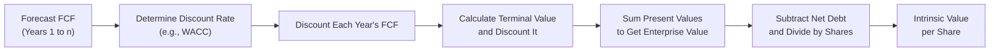

## 7.3 Models for Valuing Stocks

Sometimes, you pick up a company’s annual report or an analyst note, and you see a well-known piece of advice: “Buy below intrinsic value and sell when the price matches (or exceeds) fair value.” But how on earth do you figure out what that “intrinsic value” might be? It’s not like the company balloons have a price tag attached to them at the local store. Instead, we rely on valuation models—carefully crafted frameworks that try to capture what a share of a company is really worth based on its future prospects, industry trends, and various risk factors.

Valuation models aren’t perfect. If I had to pick the biggest lesson from my own (sometimes clumsy) attempts at valuing new tech startups, it’s that conditions and assumptions change all the time. That said, these approaches give us a structured way to think about the price we’re willing to pay. And when you’re advising clients, especially in a Canadian setting, keeping an eye on formal guidelines by the Canadian Investment Regulatory Organization (CIRO) is key. Suitability matters, so you want to ensure your valuation approach stands on solid ground.

Below, we’ll explore five of the most common ways to value a company’s stock. We’ll also talk about sensitivity analysis and some best practices (and pitfalls) you may want to keep in mind. Let’s start with a classic.

Discounted Cash Flow (DCF) Analysis  
DCF is arguably one of the most respected methods for stock valuation. The core idea is: if you can predict (or, well, attempt to predict) how much free cash flow a company will generate in the future, you can discount those cash flows back to the present day at some “required rate of return.” The sum of those discounted future cash flows gives you the firm’s “intrinsic value” (or at least one estimate of it).

Let’s break this down in more detail:

• Projecting Future Free Cash Flows (FCF). FCF is essentially the cash a company can generate after spending the money required to maintain or expand its asset base. It’s often used because it’s more difficult to manipulate than earnings, and it’s cash that is available to all capital providers (equity and debt holders).  
• Calculating the Discount Rate. In many DCF models, the discount rate used is the Weighted Average Cost of Capital (WACC), reflecting both the cost of equity and the cost of debt—and factoring in the capital structure. If a company is all equity-funded, you might simply use the cost of equity.  
• Determining Terminal Value. At some point, we often project out five or ten years of detailed FCF, and then we make an assumption about what happens beyond that “discrete projection period.” The “terminal value” (TV) tries to approximate the value of cash flows from that point onward, either by treating them as a perpetuity with some growth rate or by applying an exit multiple consistent with industry norms.  
• Finding Present Value. The last step is to discount each projected cash flow and the terminal value back to the present using your chosen discount rate. Summing those present values together gives you an intrinsic value of the entire enterprise. And if you’re seeking specifically the “per share” value, you’d subtract out net debt and then divide by the number of shares outstanding.

Here’s a tiny visual flowchart using Mermaid, just to visualize the process:

One of the biggest advantages of DCF is how comprehensive it is: it forces you to consider all the relevant factors that affect future cash generation. However, forecasting future cash flows is tricky business—if your growth estimates or discount rates are off, you might get a valuation worthy of a fairytale. Sensitivity analysis, which we’ll discuss later, helps you see just how large an impact small changes to your assumptions can have.

Dividend Discount Model (DDM)  
DDM is a neat little approach if the company you’re analyzing regularly pays dividends and intends to keep paying them into the future. The logic is straightforward: the value of a stock is basically the present value of all future dividends. The classic Gordon Growth Model (GGM) is the best-known flavor of DDM. It works under the assumption that dividends keep growing at a constant rate indefinitely. The formula for GGM is:


P_0 = \frac{D_1}{r - g}


where:  
• \\( P_0 \\) is the current intrinsic value of the stock.  
• \\( D_1 \\) is the dividend expected next period.  
• \\( r \\) is the required rate of return (often the cost of equity).  
• \\( g \\) is the constant growth rate of dividends.

If the company has multiple growth phases—like a high-growth period followed by a stable growth period—then a multi-stage DDM might be better. For high-growth companies that plan to grow dividends at, say, 12% for five years, then 6% thereafter, a multi-stage model captures that changing growth dynamic. You just project those dividend streams differently for set intervals and discount each stage at your chosen cost of equity.

Relative Valuation (Multiples Approach)  
Relative valuation is all about comparing apples to apples—or at least trying to. Instead of predicting absolute cash flows, you compare a company to its competitors or to an industry average using valuation ratios like:  
• Price-to-Earnings (P/E)  
• Price-to-Book (P/B)  
• Enterprise Value / EBITDA (EV/EBITDA)

The rationale is that if Company X is in the same industry and has similar risk and growth prospects as Company Y, then their multiples should be roughly in line. If not, maybe one is undervalued or overvalued relative to the other. A typical approach is:

• Identify peer group or relevant benchmark.  
• Calculate the average or median multiple for that group.  
• Multiply that average multiple by the target company’s measure (like earnings, book value, or EBITDA).  
• Arrive at the implied value (or price) for the target.

This approach can be super handy when you need a quick “sanity check.” It’s also used heavily by investment bankers. But it has pitfalls: no two companies are exactly the same, and short-term market swings can distort multiples. In cyclical industries (like mining or energy), comparing P/E at a single low or high point in the cycle might be misleading. That’s why people often prefer using normalized earnings or forward-looking multiples.

Residual Income Model  
In the real world, not every company pays dividends or has easy-to-forecast free cash flows. The residual income model takes another tack: it looks at whether the company is generating returns above (or below) its required rate of return on equity.

The formula usually begins with book value per share and then adds on the present value of all residual income (which is net income minus the required return on equity times the beginning book value). If a company’s return on equity is above its cost of equity, that residual income is positive. This approach can be effective if the company invests heavily in projects that generate returns in excess of the cost of equity. However, if accounting metrics like net income or book value are subject to big distortions or unusual figures, your results might be skewed.

Sum-of-the-Parts (SOTP) Valuation  
If you ever run into a conglomerate—a large firm with diverse, separate business lines—SOTP can help you value each segment individually instead of forcing you to latch on to a single, blended multiple or approach. For instance, if “ConglomoCorp” has a consumer goods division, a media division, and a small tech startup, valuing them separately with their own multiples or DCF analyses might yield a clearer picture. Then you add up those segment valuations, adjust for net debt, and hopefully arrive at a more accurate total. Some folks call it a “break-up analysis,” because it’s like slicing the company into smaller pieces to see if the sum of those pieces is actually greater than the combined whole.

Choosing the Appropriate Model  
Which approach should you actually use? It depends on the nature of the company, data availability, and how stable (or erratic) its cash flows and dividends might be. For a young biotech startup that doesn’t pay dividends, a DDM is probably not your first choice. For a mature Canadian bank with a stable dividend policy, DDM might be a great approach. Many analysts use a blend of models—because let’s be honest, sometimes relying on a single theoretical approach can be risky. In practice, you could create a weighted average of your valuations from DCF, DDM, and relative multiples to get a range of potential values.

Sensitivity Analysis  
Want to see how big a deal your assumptions are? Sensitivity analysis will let you tweak your growth rate, discount rate, or terminal multiple by a small fraction and see how that impacts your final valuation. It can be eye-opening (or terrifying) to discover that a 1% change in your assumed perpetual growth rate can swing your share price estimate by 10% or more. That’s actually good news because it forces you to ask: “How confident am I in my assumptions?” In real life, confidence is rarely 100%. That’s why you often hear the phrase, “Valuation is both an art and a science.”

Below is a small table that shows how a minor tweak in the discount rate or growth rate can drastically change the DCF value for a hypothetical company. Numbers here are for illustration only:

| Discount Rate | Growth Rate | Intrinsic Value (per share) |
|---------------|------------|------------------------------|
| 8%            | 2%         | $50                          |
| 8%            | 3%         | $58                          |
| 8%            | 4%         | $68                          |
| 9%            | 2%         | $45                          |
| 9%            | 3%         | $52                          |
| 9%            | 4%         | $60                          |

As you can see, a single percentage point can have a big impact. That’s why analysts commonly present their valuations in ranges, like “We estimate the fair value to be between $48 and $62,” rather than giving a single number.

Best Practices and Common Pitfalls  
• Scrutinize Your Inputs. Whether you’re building a DCF or computing a relative multiple, be sure your earnings and cash flow figures are accurate, or at least consistent with how the industry measures them.  
• Avoid Blindly Trusting Peers. Relative valuation is only as reliable as your peer group. If the whole industry is overvalued, your “fair” multiple might also be inflated.  
• Don’t Overcomplicate. Some folks love adding complexity—multiple growth phases, hyper-detailed cost of capital estimates, etc. That can lead to “analysis paralysis,” especially if you have limited data.  
• Revisit Your Model Regularly. Valuation is not a one-and-done exercise. Company conditions, industry landscapes, and macro factors can change. Regularly updating your model ensures you’re not clinging to outdated assumptions.  
• Check for Circular Assumptions. In certain cases, folks use the model’s output to drive inputs (like using the stock price to infer the discount rate). This can lead to a circular reference with suspicious results.  
• Document Everything. Particularly in a regulated environment like Canada, with oversight by CIRO, ensure your assumptions, data sources, and rationale are well documented.

Regulatory Context in Canada  
CIRO (the Canadian Investment Regulatory Organization) is our national self-regulatory body overseeing investment dealers, mutual fund dealers, and market integrity on equity and debt marketplaces. When you’re recommending stocks to clients, it’s crucial to show that you thoroughly understand the investment’s risks and valuation. This especially matters for more complex or volatile stocks. Historical references to the MFDA or IIROC are just that—historical. Now, CIRO is the single entity responsible for the regulatory environment. Always double-check the latest guidelines on suitability and risk management at their website: [https://www.ciro.ca](https://www.ciro.ca).

Practical Tools and Additional Resources  
• Financial Modeling Prep ([https://financialmodelingprep.com/](https://financialmodelingprep.com/)): Great open-source APIs to pull company financials, so you can quickly run multiples or DCF analyses.  
• Investopedia’s “Stock Valuation” Section: Perfect for quick refreshers on how different models work.  
• Coursera or edX: Platforms that offer advanced modeling courses. These can help if you’re ready to level-up your modeling skills.  
• “Equity Asset Valuation” by Jerald E. Pinto et al. (CFA Institute Investment Series): A classic that offers a deep dive into valuation models.  
• “Valuation: Measuring and Managing the Value of Companies” (McKinsey & Company): Another essential read, especially if you want to refine your DCF approach.

There was a time I tried to value a mid-cap Canadian mining stock using DCF, only to realize that commodity prices throw a huge twist into the forecasting game (who can predict gold prices, anyway?). Ultimately, I ended up using a blend of a resource-based model (estimating proven and probable reserves) and a multiples approach (comparing it to peers). This anecdote highlights that real-life valuation is often about mixing different methods to arrive at the best guess. And guess is the operative word—always with a dash of caution. Because as market conditions change, so too will your perceived fair values.

The takeaway: stay flexible, use multiple models, and keep an eye on how your assumptions might be off. That’s the real hallmark of a savvy investor or advisor.

---

## Test Your Knowledge: Stock Valuation Models Quiz



### Which valuation method projects a company's future cash flows and discounts them back to the present to determine intrinsic value?

- [x] Discounted Cash Flow (DCF) Analysis
- [ ] Residual Income Model
- [ ] Dividend Discount Model
- [ ] Sum-of-the-Parts Valuation

> **Explanation:** DCF focuses on estimating all future free cash flows, then discounting them to present value using an appropriate discount rate such as the WACC.

### Why might the Gordon Growth Model be unsuitable for certain companies?

- [ ] It doesn't use discount rates.
- [x] It assumes a constant dividend growth rate indefinitely.
- [ ] It relies on company debt levels only.
- [ ] It cannot be applied to dividend-paying firms.

> **Explanation:** The Gordon Growth Model (a variant of DDM) assumes a constant growth rate for dividends, so it's best suited for mature companies with stable dividend policies.

### In a Relative Valuation approach, which of the following multiples is used to compare a company’s overall value to its operating performance?

- [ ] P/E
- [ ] P/B
- [x] EV/EBITDA
- [ ] PEG ratio

> **Explanation:** EV/EBITDA compares Enterprise Value to EBITDA, offering a measure of the company’s overall value relative to its operating performance.

### Which valuation model is most useful for companies that do not pay dividends or have unpredictable cash flow but may still generate excess returns on shareholder equity?

- [ ] Gordon Growth Model
- [x] Residual Income Model
- [ ] Free Cash Flow to Equity
- [ ] Sum-of-the-Parts Valuation

> **Explanation:** The Residual Income Model focuses on a company’s excess returns over its required return on equity, making it useful for firms lacking stable dividends or predictable free cash flow.

### What is the term for the assumed value of a firm’s cash flows beyond a forecast period in a DCF analysis?

- [ ] Residual income
- [x] Terminal value
- [ ] Fair value
- [ ] Perpetuity factor

> **Explanation:** Terminal value estimates the value of all projected future cash flows after the discrete forecast period, discounted back to the present.

### In a sum-of-the-parts valuation, which of the following might you do?

- [x] Value each business segment separately and then combine those values.
- [ ] Combine all business segments as if they were one entity and apply a single multiple.
- [ ] Disregard any minor segments and focus only on the main segment.
- [ ] Rely exclusively on dividends to calculate the company’s total worth.

> **Explanation:** SOTP breaks the company into separate units, values them each individually, and sums the results to get an overall value.

### Why is sensitivity analysis particularly important in stock valuation?

- [x] Small changes in assumptions can lead to large differences in the final valuation.
- [x] It enhances confidence in one single “exact” valuation figure.
- [ ] It ensures the company always looks undervalued.
- [ ] It eliminates market sentiment from the pricing process.

> **Explanation:** Valuations are heavily influenced by assumptions like growth rates and discount rates. Sensitivity analysis reveals how changing these assumptions affects the company’s estimated fair value.

### Which of the following is NOT a key component of the Discounted Cash Flow (DCF) approach?

- [x] Using only historical dividends
- [ ] Forecasting future cash flows
- [ ] Calculating a terminal value
- [ ] Discounting projected cash flows to present value

> **Explanation:** DCF is driven by projected free cash flows, not just historical dividends.

### Which is a major disadvantage of a pure relative valuation approach?

- [ ] It doesn't allow for immediate comparisons across peers.
- [x] If an entire industry is overvalued, it might suggest an overvalued stock is “fairly” priced.
- [ ] It requires a deep understanding of dividend policies.
- [ ] It disregards the need for discount rates.

> **Explanation:** A relative valuation might erroneously label a stock as “fairly priced” if the peer group itself is trading at inflated levels.

### True or False: The Canadian Investment Regulatory Organization (CIRO) replaced both the Mutual Fund Dealers Association (MFDA) and the Investment Industry Regulatory Organization of Canada (IIROC) on January 1, 2023.

- [x] True
- [ ] False

> **Explanation:** MFDA and IIROC historically governed respective segments of the Canadian investment industry, but they amalgamated into CIRO effective 2023, making CIRO the single national self-regulatory organization.


