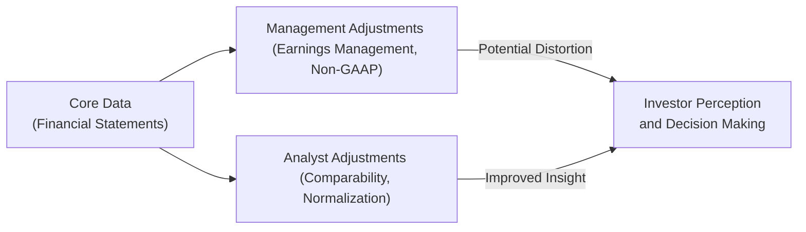

## 7.5 The Limits of Accounting Data

So, let me just say right off the bat: If you've ever tried to evaluate a company just by looking at its financial statements, you know it can be a little bit like trying to judge a movie by its trailer alone. Sure, that two-minute snippet can give you an idea of what’s going on, but it seldom tells the whole story. Likewise, accounting data in company filings might look all neat and tidy at first glance, but the numbers often hide a world of complexity. In this chapter, we’ll check out the most critical limitations of accounting data, explore why that matters, and discuss how to deal with it while making informed investment decisions.

Before diving into specifics, let’s outline the main reasons accounting data might not perfectly reflect a company’s true performance or potential:

• Financial statements are often historical in nature.  
• Some important assets and risks remain off the balance sheet.  
• There’s room for judgment (and, sadly, manipulation) in accounting policies.  
• Differences in accounting standards can make apples-to-apples comparisons tricky.  
• Non-GAAP measures, while helpful sometimes, can also introduce inconsistency.  

### The Historical Nature of Accounting Data

First off, it’s key to remember that accounting data usually looks backward. By the time annual or quarterly results are published, they’re already “old news” in a fast-paced market. Managers and investors may talk about “trends and forecasts,” but actual reported data still follows what already happened. In many ways, it’s similar to rearview mirror driving—you see what happened but might be missing those telltale signs of what’s around the next bend.

• Historical Cost vs. Fair Value – Some assets, like property or equipment, may sit on the books at their historical cost, potentially ignoring market appreciation or depreciation. Sure, IFRS (International Financial Reporting Standards) sometimes advocates fair value accounting for certain assets, but it’s not comprehensive. This means the reported value might understate or overstate current market worth.  

• Rapidly Changing Industries – For companies in tech, biotech, or other innovation-driven sectors, the past may provide limited insights into future revenue streams. Accounting measures might just not keep pace with intangible elements such as brand strength, platform scalability, or intellectual property breakthroughs.  

### Earnings Management and Management Bias

You’ve probably heard the term “earnings management.” That’s essentially when managers give their reported results a gentle nudge (or, in some worse cases, a pretty forceful shove). These moves can include altering assumptions about:

• Revenue Recognition: When exactly do you consider revenue “earned?” Different interpretations or judgments shift figures between reporting periods.  
• Depreciation and Amortization: The lifespan over which you depreciate assets can cause big swings in net income.  
• Asset Impairments: Deciding when an asset is truly impaired can be subjective—did technology truly become obsolete in Q3, or was that a convenient time to take a write-down?

Sometimes, these minor adjustments are done with the best intentions—like smoothing out unusual spikes or removing one-time events to provide a clearer picture of underlying operations. But be aware that these adjustments can also be used to game earnings and influence investor perceptions.

#### Example: An “Overly Convenient” Write-Down  
Consider a hypothetical electronics manufacturer that’s about to launch a major product in Q4. It could decide Q3 is the “perfect” time to book a large impairment on an old manufacturing facility, so the next quarter’s net income looks extra healthy by comparison. This is a subtle, but not uncommon scenario, showing how management’s discretion can make one quarter look worse (or better) than another.

### Intangible Assets: Hidden Value and Unrecorded Strengths

Let me tell you a quick personal memory: I once analyzed an e-commerce startup that had a relatively small physical footprint but a massive brand following. The financial statements didn’t show much in the way of tangible assets—they rented warehouse space, they had minimal equipment, and so on. But their brand loyalty was off the charts, which was definitely not—at least not fully—reflected in the balance sheet. This is what we mean by unrecorded intangible assets.

Accounting rules generally favor purchased intangibles (like patents you buy from another firm) over internally developed intangibles. Internally developed intangibles—like brand, reputation, or original R&D—are often expensed as they occur instead of capitalized. That means you might only see the cost on the income statement, but not the corresponding intangible asset on the balance sheet.

• Brand Equity: Whether we’re talking about a small niche brand or a globally recognized name like Coca-Cola, brand can be a huge determinant of future profitability. Yet, brand is not always something you see explicitly on financial statements as a line item.  
• Research & Development (R&D): Companies actively engaged in R&D might be building future revenue streams with significant economic potential, yet their balance sheet remains silent about the intangible asset’s real value.  
• Intellectual Property: Patents, trademarks, and proprietary software can be a game-changer for a company, but you might not see their full impact, especially if developed in-house.

### Off-Balance Sheet Items

Financial statements are supposed to present a comprehensive story, but the reality is that certain arrangements may stay off the balance sheet:

• Operating Leases (Under Older Standards): Historically, renting stuff like office space or equipment could be left out of the balance sheet if it was considered an operating lease rather than a capital lease. While recent IFRS and other standard updates have changed some of this, some complexities still remain.  
• Special Purpose Entities or Partnerships: A company might shift some liabilities or assets to these entities, reducing the visibility of financial risk on the main balance sheet.  
• Contingent Liabilities: These are liabilities that only come to fruition if specific events occur. By definition, they may be absent from the company’s primary liabilities section, but if triggered, they can have a significant impact.

### Differences in Accounting Standards (IFRS vs. U.S. GAAP)

Even if you’re savvy enough to dig beyond the superficial numbers, you still need to reconcile apples to apples. IFRS and U.S. GAAP each have their particular guidelines for how to recognize revenue, value inventories, measure intangible assets, and so on.

• Revenue Recognition: IFRS uses a five-step revenue recognition model, while U.S. GAAP also uses a similar approach but can differ in implementation details. The timing and classification of revenue can vary, which impacts top-line numbers.  
• Inventory Accounting: Under IFRS, LIFO (Last-In-First-Out) is prohibited, creating differences in reported cost of goods sold compared to some U.S. companies that might still use LIFO.  
• Development Costs: IFRS permits capitalization of certain development costs if specific criteria are met. U.S. GAAP tends to expense more of these costs, altering net income.

These differences can cause confusion if you’re comparing two businesses—one using IFRS, the other using U.S. GAAP—side by side. You might have to make your own adjustments to ensure you’re comparing “like with like.”

### Non-GAAP Measures and “Core” Earnings

Let’s face it: reading a company’s quarterly press release, you might see emphasis on “adjusted EBITDA,” “core earnings,” or “non-GAAP net income.” These measures sometimes point to relevant insights—like ignoring one-time charges that don’t reflect ongoing operations. However, each company defines its own “adjustments.” Consequently:

• The good: Non-GAAP measures can focus your attention on the underlying business trends by stripping out short-term anomalies.  
• The bad: Companies can effectively cherry-pick items to exclude, potentially making them look more profitable or stable than they are.  

So, always dig deeper. Make sure you understand:

• What’s the company adding back (or subtracting)?  
• How consistent are these adjustments from one period to the next?  
• Are these truly one-off items, or do they reappear frequently?

### Qualitative Analysis Is Essential

When you rely solely on the numbers presented in the financials, you risk losing context. Qualitative analysis—examining management’s track record, strategy, competitive positioning, regulatory environment, and macroeconomic headwinds—complements the quantitative side. Factors like employee skill sets, corporate culture, brand reputation, and the innovative capacity of a firm often escape neat measurement but have a huge impact on a company’s worth.

Moreover, an understanding of the industry dynamics is key. For instance, a steel manufacturer may have stable physical assets but is heavily exposed to commodity price fluctuations, while a software company might have intangible assets like software platforms that drive user engagement.

### Ongoing Monitoring and Regulatory Oversight

One of the reasons we harp on about the “limits of accounting data” is because numbers can change quickly if a company changes its assumptions or approach. That’s why continuous monitoring matters. In Canada, the Canadian Investment Regulatory Organization (CIRO) provides guidelines to ensure investment advisors act with integrity and maintain consistent disclosure standards. Financial statements, management discussion and analysis (MD&A), and other regulatory filings are updated periodically to reflect new accounting rules or company decisions. 

In addition, the following resources can help in your ongoing education and due diligence:

• CIRO Guidelines on Professional Conduct:  
  Visit [CIRO’s official website](https://www.ciro.ca/) for updates and guidelines on ethical reporting and best practices for disclosure.  
• IFRS Foundation:  
  [IFRS Foundation](https://www.ifrs.org/) offers a wealth of information on IFRS updates and insights into how fair value is used.  
• Further Reading:  
  - “Creative Cash Flow Reporting: Uncovering Sustainable Financial Performance” by Charles Mulford and Eugene Comiskey.  
  - “Financial Shenanigans: How to Detect Accounting Gimmicks & Fraud in Financial Reports” by Howard M. Schilit and Jeremy Perler.  
• Courses/Certifications:  
  - Canadian Securities Institute courses on advanced financial statement analysis.  
  - Online “Forensic Accounting and Fraud Examination” courses on Coursera or edX.

### Putting It All Together in Visual Form

Below is a simple diagram showing how core accounting data, management judgments, and analyst considerations feed into investor perception. The takeaway? You’ve got to watch out for potential distortions and do your own due diligence.

In this diagram:  
• A is “Core Data” from the financial statements.  
• B represents “Management Adjustments” that can shift how that data appears to outsiders.  
• D represents “Analyst Adjustments” to bring clarity and comparability.  
• C is the resulting “Investor Perception,” which ultimately drives investment decisions.

### Key Takeaways and Best Practices

1. Don’t Rely on Numbers Alone: Always interpret financial data with a dash of skepticism and a big scoop of qualitative research.  
2. Understand the Context: Delve into the management discussion and analysis (MD&A) to see what’s behind the numbers.  
3. Check Consistency: Compare accounting policies over time. If a company changes a policy mid-stream, understand the reason.  
4. Keep an Eye on Non-GAAP: Non-GAAP measures can dwell in a gray area. Know exactly what’s included and excluded—and why.  
5. Investigate Off-Balance Sheet Items: Make sure to read the fine print to see if there are hidden liabilities or obligations.  
6. Watch for Red Flags: Sudden large one-time expenses, repeated “unusual” charges, or a pattern of over-optimistic revenue recognition can be signs of earnings management.  
7. Stay Updated: Keep track of evolving IFRS, local tax rules, and other standards to ensure you’re always looking at current practices.  

### Personal Reflection

I remember a time early in my career when I was analyzing a manufacturing company. I was super impressed by its net cash position and stable net income growth. But guess what? I missed a big chunk of off-balance sheet liabilities tied to operating leases for specialized equipment. Once I discovered those obligations in the footnotes, the company’s future obligations and actual financial position looked completely different. That moment was a wake-up call—numbers can be misleading if not placed in the correct context.

Ultimately, trust your analytical instincts. Use the numbers as a starting point, but always explore the underlying judgments and qualitative signals to form a complete picture. Because, at the end of the day, the real “value” of a company is so much more than the sum of its reported financials.

---

## Test Your Knowledge: The Limits of Accounting Data Quiz



### 1. Why is accounting data often considered “historical” in nature?

- [ ] It only includes future-based projections and forecasts.  
- [x] It mainly reflects past transactions and events already completed.  
- [ ] It ignores any revenue recognition practices.  
- [ ] It exclusively focuses on intangible assets.  

> **Explanation:** Accounting data primarily records events that have already happened, such as past sales and expenses, and therefore provides a backward-looking perspective rather than a forward-focused one.

### 2. Which of the following best defines “earnings management”?

- [ ] The process of randomly changing accounting standards.  
- [x] The practice of manipulating financial statements to present results favorably.  
- [ ] The creation of intangible assets through R&D activities.  
- [ ] The method of eliminating all off-balance sheet items.  

> **Explanation:** Earnings management refers to managers using accounting discretion or certain assumptions to alter financial statements—often to meet specific performance targets or shape investor perceptions.

### 3. What is one major drawback of internally developed intangible assets?

- [ ] They generate no economic benefit.  
- [ ] They are subject to no accounting standards.  
- [x] They often remain off-balance sheet, understating the company’s real value.  
- [ ] They can never form the basis of brand equity.  

> **Explanation:** Internally developed intangibles like brand value or R&D typically aren’t fully capitalized on the balance sheet, which can obscure a company’s true worth in the eyes of investors relying solely on reported figures.

### 4. Under IFRS, how are development costs generally treated?

- [ ] They are always expensed as incurred, with no exceptions.  
- [ ] They are treated exactly the same as under U.S. GAAP.  
- [ ] They can never be recognized if intangible.  
- [x] They can be capitalized under certain criteria, unlike some treatments in U.S. GAAP.  

> **Explanation:** IFRS permits capitalizing development costs when specific conditions are met (e.g., technical feasibility, likelihood of future economic benefits), whereas U.S. GAAP often requires expensing.

### 5. Why might Non-GAAP measures be considered both helpful and risky?

- [x] They can clarify underlying business trends but also allow companies to cherry-pick adjustments.  
- [ ] They are always fully reliable and standardized across companies.  
- [x] They require minimal disclosure and combine multiple accounting standards into one measure.  
- [ ] They have no relation to GAAP or IFRS financial statements.  

> **Explanation:** While Non-GAAP measures can give additional insight into a firm’s core operations by excluding items that might be one-off or non-recurring, the lack of standardization means companies could define them in ways that make direct comparisons difficult.

### 6. What best describes off-balance sheet items?

- [x] Obligations or assets not directly recorded on the main balance sheet.  
- [ ] Tangible assets like machinery and property.  
- [ ] Company profit that hasn’t been distributed as dividends.  
- [ ] Revenue streams recognized in the period they are earned.  

> **Explanation:** Off-balance sheet items typically include things like operating leases (under older standards), partnerships, or contingent liabilities which do not appear as direct line items on the main balance sheet.

### 7. Why is “historical cost” sometimes considered a limitation?

- [ ] Historical cost always starts out at zero, making comparisons impossible.  
- [ ] It is only used for intangible assets.  
- [x] It may not reflect current market value, causing assets to be understated (or overstated).  
- [ ] It is illegal under IFRS and U.S. GAAP.  

> **Explanation:** When assets are held at their purchase price indefinitely, fluctuations in their real market value are not captured, creating discrepancies between the recorded value and true economic worth.

### 8. How can ongoing monitoring help investors manage the limitations of accounting data?

- [ ] By replacing all GAAP standards with private spreadsheets.  
- [x] By identifying changes in accounting assumptions and revising valuation models in real time.  
- [ ] By eliminating the need for management discussion and analysis.  
- [ ] By removing intangible assets from consideration.  

> **Explanation:** Continuous review of financial statements, footnotes, and management commentary helps detect shifts in accounting policies or assumptions, aiding analysts in maintaining an accurate understanding of a company’s financial health.

### 9. What is one reason for potential inconsistency in Non-GAAP measures?

- [ ] They are audited by external accountants using IFRS.  
- [ ] They always align perfectly with fair value accounting.  
- [x] Each company can define its own “adjusted” calculations, making apples-to-apples comparisons difficult.  
- [ ] They are governed by strict global standards that never change.  

> **Explanation:** Since Non-GAAP measures are not standardized across the board, each company’s definition and calculation can be unique, limiting the measures’ comparability across different firms.

### 10. True or False: Intangible assets acquired through a business combination are often recognized on the balance sheet, while those developed internally may not be.

- [x] True  
- [ ] False  

> **Explanation:** Accounting rules generally let companies record purchased intangibles, such as patents acquired in an acquisition, on the balance sheet. However, self-developed intangibles are usually expensed, leading to a discrepancy in how intangible assets appear on financial statements.


