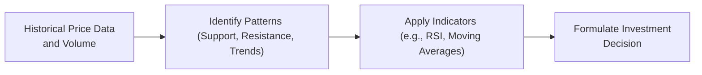

## 8.1 The Basics of Technical Analysis

It’s funny—whenever I hear the phrase “technical analysis,” I’m reminded of the time I stared at a chart so long, I began seeing shapes and lines that felt as vivid as a child’s doodles. At first glance, technical analysis can look a bit mystical, as if we’re leaning on shapes, volume bars, and patterns to glimpse the future. But rest assured, there’s an underlying logic behind all those candlesticks and indicators.

Technical analysis is the study of historical price and volume data. The main idea? The price of a security—be it a stock, bond, commodity, or currency—already reflects all relevant information. Practitioners look at patterns, trends, and signals in that data to guess what might happen next. So, let’s break down how it works.

---

### Understanding Technical Analysis

Technical analysis is all about reading the story the market is telling in its price action. Instead of deep-diving into a company’s financial statements or analyzing corporate earnings (as we often do in fundamental analysis), we focus more on the security’s historical price, trading volume, and other market-derived data. The rationale is that if a significant event occurs (like a key product launch or surprising quarterly earnings), it’ll show up in the market’s buying and selling behavior long before the news is fully digested by the majority of market participants.

• Key principle: All known information is “baked into” the price.  
• This approach is heavily influenced by behavioral finance. Prices reflect human fear, greed, and herd behavior.  

Technical analysts watch how prices move in specific patterns and compare that movement to historical price behavior. In essence, if conditions look like a previous situation that led to a certain price move, the same outcome may occur again.

---

### Market Psychology

To me, market psychology is what makes technical analysis so interesting—and occasionally thrilling. The premise is that investors often act in predictable, repetitive ways. When many buyers start jumping into a trending stock, it’s not just about the underlying value. It might be fear of missing out or the excitement around a hot new technology.

People’s emotions can exaggerate movements or create repeating chart patterns because similar psychological triggers tend to produce similar trading behaviors. Herd behavior—where everybody piles into a stock simply because others are doing so—underpins many classic price patterns. If you think it through, a chart that looks like a “head and shoulders” pattern, or a “double bottom,” is essentially displaying how a large group of individuals reacts to price changes over time.

---

### The Supply and Demand Factor

Remember those high school economics classes where you learned about supply and demand? Well, that concept rings loud and clear in technical analysis. When supply (sellers) overwhelms demand (buyers), prices fall. When demand outstrips supply, prices rise. Technical analysts pay careful attention to points where these forces are in equilibrium, resulting in sideways price movement or “consolidation.”

• **Support Level**: A specific price level where demand tends to show up, stopping the price from falling further.  
• **Resistance Level**: A price ceiling at which sellers show up in force, preventing the price from rising further.

As an investment advisor, I remember a client who once excitedly said, “Well, if the support is at $50, it’ll never dip below that, right?” That’s a classic misconception. “Support” is simply an area where buyers have historically emerged, not a magic line set in stone. Still, these levels can offer insights into where the market’s equilibrium points might lie.

---

### Time Frames

One aspect of technical analysis that often confuses people is that it can be applied across multiple time horizons. Some traders look at intraday charts (e.g., 5-minute or 1-minute intervals) to find quick price moves––this is common among day traders. Others might stick to daily or weekly charts—perhaps the more typical approach for an investment advisor looking to make a medium- to long-term allocation decision.

If you’re working with retail clients or are a portfolio manager, you might find that monthly or weekly time frames are more meaningful. After all, you generally make adjustments over weeks or months, not hours or minutes. But it’s important to know that charting can scale up or down. A trend visible on a weekly chart might be hidden on a 5-minute chart, and vice versa. The key is consistency––pick a time frame that matches your investment goals.

---

### Confirmation and Divergence

• **Confirmation**: When multiple technical indicators or chart patterns all point to the same potential direction, it’s called confirmation. For example, if the price is trending upward while volume and a relative strength index (RSI) indicator both move in support of that trend, analysts see this as a “confirmed” move.

• **Divergence**: Sometimes you’ll see a gap between price action and a trend indicator. For instance, if the price makes a higher high but RSI fails to make a higher high, that’s called a bearish divergence. It suggests the upward momentum may be weakening. 

These confirmations and divergences are like traffic lights. When everything’s “go” (green lights), the market could continue in the same direction. When you see major divergences (yellow lights), it’s time to slow down, watch carefully, and maybe ease off the gas.

One concept that’s constantly thrown around is “moving averages.” A **moving average** smooths out price data, helping us see the bigger trend. It’s typically categorized as a “lagging indicator” (meaning it follows price movements). A commonly used leading indicator, on the other hand, would be something like the **RSI**, which can offer signals before the actual price move. By combining the two—maybe checking a moving average cross (lagging) alongside an RSI reading (leading)—you can form a more confident view.

If you’re curious about the math of RSI, the formula is often written as:


\text{RSI} = 100 - \frac{100}{1 + RS}


where RS (Relative Strength) generally compares average gains and average losses in price over a specified period (often 14 days).

---

### Strengths and Critiques

As someone who’s spent a fair bit of time on both fundamental and technical approaches, I admit I often rely on the phrase, “Use the right tool for the right job.” Technical analysis helps you see potential trends, support/resistance zones, and short-term turning points that fundamental analysis might miss. But critics note that:

1. **Subjectivity**: Two analysts might look at the same chart and see different patterns.  
2. **Over-focus on Short-Term**: Some critics argue it’s best suited for short-term trades rather than long-term investments.  
3. **Cherry-Picking**: It’s easy to latch onto patterns in hindsight (the “I saw it coming!” phenomenon).

Still, most investment professionals who use technical analysis combine it with fundamental analysis or rely on well-defined rules to avoid guesswork. They might say something like, “When the 50-day moving average crosses above the 200-day moving average, consider buying.” This approach is more systematic.

---

### The Regulatory Context in Canada

Under the supervision of the Canadian Investment Regulatory Organization (CIRO), advisors in Canada must ensure that any recommendations—technical, fundamental, or otherwise—comply with rules around KYP (Know Your Product) and KYC (Know Your Client). Essentially, even if a chart screams “buy,” that buy should still fit your client’s risk tolerance, investment horizon, and overall financial situation.

• **CIRO** (https://www.ciro.ca) oversees investment dealers, mutual fund dealers, and market integrity.  
• While many advisors use chart analysis in day-to-day discussions with clients, any recommendations should align with the client’s objectives and constraints.  

One more note: Canada-wide, the **Canadian Securities Administrators (CSA)** (https://www.securities-administrators.ca) provides further guidance for harmonized regulations. Always cross-reference these guidelines to make sure your technical analysis usage aligns with both the letter and spirit of regulatory requirements.

---

### Real-World Applications

Let’s take the example of a Canadian mining stock, often subject to cyclical price swings. You might notice that its price just broke out of a resistance level that’s held for two months. Volume soared above its 20-day average. That’s a “breakout” in classic technical terms. Does this mean you’ll run out and buy? Perhaps not automatically. But it’s a signal that something meaningful is happening in market psychology for that security.

During a breakout, “pullbacks” or short-term dips might occur. Technicians call these retracements. If the stock pulls back slightly but stays above the old resistance-turned-support, that might be an even stronger confirmation of the breakout. You might see a “higher low” forming, which could suggest an uptrend is taking shape.

Anyway, these are the sorts of decisions you’d confirm with fundamental data (e.g., the company has healthy earnings, rising commodity prices). Once the narrative line up, it can be a powerful clue to act.

---

### A Visual Overview of Basic Technical Analysis

Below is a simple mermaid flowchart to visualize how technical analysis can lead from raw data to a conclusion or action:

• **Step A**: Gather historical price data and volume information.  
• **Step B**: Identify patterns such as support and resistance zones or major trends.  
• **Step C**: Check leading or lagging indicators to confirm or show divergences.  
• **Step D**: Decide whether to buy, sell, or hold, ensuring alignment with client objectives and risk appetite.

---

### Glossary

**Trend**  
The general direction in which a security’s price moves (upward, downward, or sideways) over a given period.  

**Support Level**  
A price level where buyers historically appear, preventing further declines.  

**Resistance Level**  
A price level where sellers historically appear, preventing further increases.  

**Lagging Indicator**  
A technical tool that follows price movements and helps confirm a trend (e.g., moving averages).  

**Leading Indicator**  
An indicator that tries to predict future price movements before they occur (e.g., RSI or Stochastics).  

**Breakout**  
When a security’s price moves decisively above a key resistance level or below a key support level, potentially signaling a new trend.  

**Pullback (Retracement)**  
A temporary reversal in the direction of a prevailing trend, often used by traders to find better entry points.  

**Consolidation**  
A period of indecisive price movement characterized by narrow, sideways trades, signaling equilibrium between buyers and sellers.

---

### Best Practices and Additional Resources

• **Combine Approaches**: Don’t rely exclusively on technicals. Look at fundamentals, macroeconomic data, and risk management.  
• **Stay Objective**: Use consistent rules for analyzing charts (e.g., “Buy if the price closes 5% above the 50-day moving average and volume is 50% above average”).  
• **Mind the Time Frame**: Match your analysis with your investing horizon—short-term signals can be less relevant for a retirement portfolio that’s rebalanced yearly.  
• **Check the Rules**: Always ensure compliance with CIRO’s guidelines and the broader CSA framework.  

**Open-Source Tools**  
• **Chart.js** or **Plotly (Python)**: Great for interactive charting and visual analytics.  
• **TA-Lib (Python)**: A popular library for algorithmic trading and technical indicators.

**Books and Online Courses**  
• “Technical Analysis of the Financial Markets” by John J. Murphy – A classic text covering everything from chart construction to indicators.  
• **Investopedia Academy**’s Technical Analysis Course – Great for structured online learning, offers quizzes and modules.  
• Coursera’s **“Trading Basics”** course – Provides foundational technical skills, very beginner-friendly.

**Regulatory References**  
• [CIRO](https://www.ciro.ca) – Canada’s national self-regulatory body overseeing dealers and marketplaces.  
• [Canadian Securities Administrators (CSA)](https://www.securities-administrators.ca) – The umbrella organization of provincial and territorial securities regulators.

---

### Conclusion

All in all, technical analysis isn’t a crystal ball—it’s a set of tools. And like any tools, they can be incredibly useful when wielded with skill and caution. Will you occasionally see patterns that mislead you? Absolutely. Will you jump the gun on a breakout that turns into a fake-out? It happens. But pairing the psychology of price action with solid fundamental checks can sharpen your investment decisions.

Whether you’re scanning weekly charts or tracking daily trends, remember that the market is a constant interplay of supply, demand, and investor sentiment. Technical analysis can offer a lens into these dynamic forces, guiding you in anticipating potential price moves—and hopefully helping you steer clear of some nasty surprises along the way.

---

## Test Your Knowledge: The Basics of Technical Analysis Quiz



### Which statement best describes the core principle of technical analysis?

- [x] All relevant information is reflected in a security’s current price.
- [ ] Price changes are unpredictable and random.
- [ ] Technical patterns do not repeat over time.
- [ ] Only fundamental data can determine market sentiment.

> **Explanation:** Technical analysis is founded on the idea that all publicly available information—including investor psychology—is already accounted for in the current price.

### Market psychology is important in technical analysis mainly because:

- [x] Investor emotions and herd behavior often create recurring price patterns.
- [ ] Professional traders never follow technical patterns.
- [ ] Markets are always fully efficient at all times.
- [ ] Long-term fundamentals don’t matter once a short-term pattern appears.

> **Explanation:** Technical analysis often focuses on how fear, greed, and groupthink drive the formation of recognizable patterns in charts.

### A price level where buyers historically enter the market, preventing further price declines, is called:

- [x] Support.
- [ ] Resistance.
- [ ] Consolidation.
- [ ] Pullback.

> **Explanation:** Support occurs where demand (buyers) materializes with enough momentum to keep prices from dropping further.

### Which of the following is an example of a lagging indicator?

- [x] Moving Average.
- [ ] RSI (Relative Strength Index).
- [ ] Stochastics.
- [ ] Momentum Index (as a leading signal).

> **Explanation:** Moving averages are considered lagging indicators because they rely on past price data to confirm trends.

### When multiple technical indicators align in pointing to the same directional move, it is referred to as:

- [x] Confirmation.
- [ ] Divergence.
- [x] Breakout.
- [ ] Consolidation.

> **Explanation:** “Confirmation” indicates that various signs and signals agree on the likely direction of the trend.

### A situation where the price hits new highs but an oscillator like RSI fails to reach corresponding highs is best described as:

- [x] Bearish divergence.
- [ ] Bullish confirmation.
- [ ] Resistance test.
- [ ] Breakout trigger.

> **Explanation:** This signals momentum might be weakening, even though price continues upward.

### In the Canadian regulatory environment, an advisor making a recommendation based on technical analysis must:

- [x] Ensure alignment with KYC (Know Your Client) and KYP (Know Your Product) requirements.
- [ ] Avoid using fundamental data completely.
- [x] Only rely on leading indicators.
- [ ] All of the above.

> **Explanation:** Advisors must verify that all recommendations are suitable for the client’s financial objectives and risk tolerance, per CIRO regulations.

### The phenomenon where a possible new upward trend stalls right at prior high levels is typically known as:

- [x] Resistance.
- [ ] Support.
- [ ] Divergence.
- [ ] Consolidation.

> **Explanation:** Resistance is a level where selling pressure often appears, hindering further upward movement.

### A brief reversal of price movement within an established uptrend is commonly called a:

- [x] Pullback (Retracement).
- [ ] Breakout.
- [ ] Consolidation.
- [ ] Divergence.

> **Explanation:** A pullback is a short-term counter move in the opposite direction of a prevailing trend.

### True or False: Technical analysis can be equally applied to daily and monthly charts.

- [x] True
- [ ] False

> **Explanation:** Technical methods can scale across various time frames, though they’re typically adjusted to suit the investor’s or trader’s horizon and goals.


