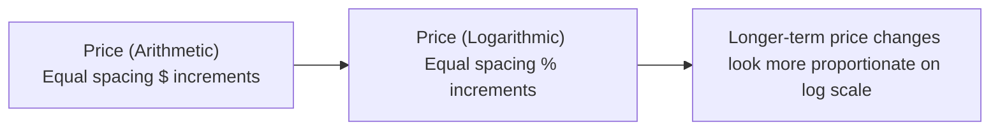
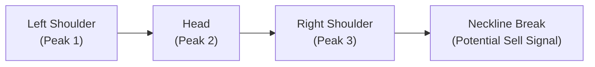

## 8.2 Chart Analysis

So, let’s talk about chart analysis. You know, when I first got into finance—long before I understood what “pivot points” meant—I stared at these squiggly lines and bar graphs for hours, hoping to figure out exactly where the market was going to go. Chart analysis, a cornerstone of technical analysis, is all about reading those lines, bars, and candlesticks in a way that helps you predict market trends, pinpoint turning points, and manage investment risk (even if you might feel a bit overwhelmed at first).

Below, we'll dive deep into the different chart types, shine a light on candlestick patterns, talk about time horizons, touch on chart scales, highlight volume, and explore common patterns—like head and shoulders. We’ll pepper in some personal experiences, show some diagrams, and keep it real. Whether you're a complete beginner who finds all these lines a bit dizzying or a seasoned pro looking to refine your approach, I hope you’ll find value in this discussion. Let’s jump in.

---

### Why Chart Analysis Matters

Chart analysis forms a major component of technical analysis, which is the study of historical price and volume data to forecast future price movements. Technical analysts believe that “the trend is your friend,” meaning you can often ride a price trend to potential profits, and charts are how you identify those trends visually.

- In retail contexts, advisors often prefer longer-term daily or weekly charts, which can provide clarity for clients who have moderate to long investing horizons.
- Institutional traders or algorithmic quants might slice data into minute-by-minute or even second-by-second charts to take advantage of short-term price movements.

From a Canadian regulatory standpoint, whenever you apply technical analysis or implement a trading strategy inspired by chart signals, keep in mind that all investment recommendations should coincide with a client’s risk profile. Under the guidelines of the Canadian Investment Regulatory Organization (CIRO), members must ensure suitability and product knowledge, meaning you cannot just rely on a doji or head and shoulders pattern if it goes against the client’s overall financial plan and risk tolerance. If you’d like more info, feel free to visit [CIRO’s official site](https://www.ciro.ca).

---

### Types of Charts

When it comes to chart analysis, the first step is understanding the types of charts out there. Each one offers a unique perspective on price action. Let’s walk through four of the most common types: line charts, bar charts, candlestick charts, and point-and-figure charts.

#### Line Charts
A line chart is the simplest way to visualize price movements. Usually, a line chart only plots the closing prices over a certain period. That’s it—just a single line connecting each closing price to the next. It’s a great tool for beginners or for folks who just want to see overall price trends without a lot of clutter.

- Pros: Super easy to read, clearly shows the trend over time.
- Cons: Lacks detail about intraday swings (high, low, or opening prices).

#### Bar Charts
Bar charts and I, well, we got acquainted during my first few months of studying technicals. A bar chart plots four crucial pieces of data for each time period: the high, low, open, and close. Each “bar” basically extends from the lowest traded price to the highest traded price. The horizontal lines on the left and right indicate open and close, respectively.

- Pros: Provides more details than a line chart.
- Cons: Can get visually busy if you’re looking at a lot of data at once.

A typical daily bar might look like this:

```
        High
         |
Open -   |   - Close
         |
        Low
```

#### Candlestick Charts
Candlestick charts are similar to bar charts in that they also show the open, high, low, and close (OHLC) for a particular day (or hour, or minute, depending on your time frame). Each candlestick has a “body,” which spans from the open price to the close price, and “wicks” (sometimes called shadows) that show the range of the high and low.

Candlestick charts are one of the most popular chart types among retail traders today because they make it easy to spot bullish versus bearish days:  
- A green (or white) candlestick typically indicates the close was higher than the open (bullish).  
- A red (or black) candlestick typically indicates the close was lower than the open (bearish).  

Case in point: If you see a series of green candlesticks, it might be a sign of upward momentum, whereas a sea of red candlesticks could indicate a downward sentiment.

#### Point-and-Figure Charts
Point-and-figure (P&F) charts look entirely different from the other charts. Instead of time on the x-axis, P&F charts simply focus on price movements, recording X’s if price goes up by a certain predefined amount (the box size) or O’s if price goes down by that amount.

- Pros: Filters out “noise” by ignoring minor moves below a certain threshold.
- Cons: Some traders feel it removes too much detail, especially with intraday swings.

---

### Candlestick Patterns

Now, let’s drill deeper into candlestick patterns—these are short-term signals that can be quite powerful. Fun story: I remember the first time a friend of mine told me about doji candles. I squinted at the chart, saw what looked like a little plus sign, and was fascinated to learn this could indicate an impending change in market sentiment. Let’s talk about a few big hitters:

• **Doji:** The open and close are nearly the same, so the candlestick’s body is basically a line. It can signal indecision in the market.  
• **Hammer:** A small body near the top of the candle, with a long wick to the downside. Often suggests a bullish reversal if found at the end of a downward trend.  
• **Engulfing Pattern:** A candlestick that completely engulfs the body of the prior candlestick. A bullish engulfing (where a green candle engulfs a smaller red candle) likely signals an upcoming price rise.

Candlestick patterns can form over one, two, or sometimes three trading sessions, and each pattern can offer clues about who’s winning the tug of war between buyers and sellers. However, be cautious of reading too much into any single candle out of context; volume, trend direction, and other factors matter.

---

### Time Horizons

Different traders and advisors use different time horizons for their charts, depending on the strategy:

• **Intraday Charts:** From scalpers to high-frequency traders, these folks might look at 1-minute or even tick charts.  
• **Daily/Weekly Charts:** The sweet spot for many retail investors, including typical advisory clients who want a mid- to long-term perspective.  
• **Monthly/Quarterly Charts:** Perfect for big-picture analysis—maybe for major life events or multi-decade retirement planning.

Choosing the right time horizon often depends on how quickly you plan to enter and exit trades. If your client has a two-year horizon, it probably doesn’t make much sense to hyper-focus on minute-by-minute chart movements.

---

### Chart Scales: Arithmetic vs. Logarithmic

Charts can use either arithmetic or logarithmic (log) scales on the price axis. The difference affects how price moves are visually represented.

• **Arithmetic Scale:** Each unit (say $1) has the same vertical spacing. A move from $10 to $20 looks exactly the same as a move from $140 to $150, even though they differ in percentage change.  
• **Logarithmic Scale:** Here, equal distances on the vertical axis represent equal percentage changes. A move from $10 to $20 (a 100% increase) will be displayed the same as a move from $140 to $280 (also a 100% increase in that latter case).  

Over longer periods, especially if prices have grown significantly, a log scale can be a better choice because it places price moves in context. If you’re analyzing a stock that soared from just $2 to $200, a standard arithmetic scale might give you a weirdly skewed perspective on the chart.

Below is a simple visualization of how arithmetic vs. logarithmic scales might compare. This is not an actual price series but a conceptual layout:



---

### Importance of Volume

Volume represents how many shares, contracts, or units were traded over a particular period. We typically plot volume bars along the bottom of the chart. Here’s why volume is so crucial:

• **Confirmation of Breakouts or Breakdowns:** If the price “breaks out” of a trading range on heavy volume, it’s more likely to be a real shift in market sentiment, rather than a head fake.  
• **Trend Validation:** Significant trends often go hand-in-hand with high volume as more and more participants jump in.  
• **Indication of Investor Psychology:** Sudden volume spikes can indicate panic selling or exuberant buying.

In fact, if you see a breakout but the volume is suspiciously low, it might be wise to wait for more confirmation—this could be a false breakout.  

---

### Pattern Recognition

Technical analysts often say that “history doesn’t always repeat, but it does rhyme.” In that spirit, chart pattern recognition is the art of spotting recurring shapes that often signal future price movements. Let’s check out a few big ones:

#### Head and Shoulders Pattern
This is a classic. In a traditional (bearish) head and shoulders, you see three distinct peaks, with the middle peak (the “head”) higher than the two “shoulders.” Once price falls below the “neckline,” it signals a potential reversal from bullish to bearish. There’s also an inverted head and shoulders that can indicate a reversal from bearish to bullish.

Here’s a rough mermaid diagram:



Think of it like a silhouette of a person’s shoulders and head. Many analysts view the break of the neckline on strong volume as a sign to exit long positions or initiate short positions, depending on your strategy.

#### Triangles
Triangles come in several flavors—ascending, descending, and symmetrical. They represent a period of price consolidation where the trading range gets narrower. Typically, price breaks out either above or below the triangle lines, often indicating the start of a new trend.

#### Flags and Pennants
Flags and pennants are continuation patterns that form after a strong price move. The market then “consolidates” in a small channel (flag) or triangle (pennant) before continuing the move in the same direction.

Pattern recognition can feel a bit like cloud-gazing: the shapes appear subjective at times, so it’s wise to look for strong supporting evidence (like volume spikes) that confirm the pattern.

---

### Putting It All Together: Practical Tips and Pitfalls

• **Always Check Volume:** A breakout without volume might be a trap.  
• **Consider Multiple Time Frames:** Even if you love daily charts, glancing at weekly or monthly charts can help you see the bigger trend.  
• **Set Clear Entry and Exit Points:** Draw support and resistance zones. Notice I said “zones,” because real market behavior isn’t always pinned to a single exact level.  
• **Avoid Analysis Paralysis:** It’s easy to get lost in hundreds of indicators. Focus on a few that make sense and align with your investment horizon.  
• **Combine Fundamentals and Technicals:** Many professionals merge fundamental analysis (see Chapter 7 on Company Analysis and Valuation) with chart signals to gain a fuller picture.  

Under CIRO guidelines, it’s crucial that your chart-based insights are consistent with the underlying risk profile and financial goals of the client. If you’re only focusing on short-term fluctuations but the client’s objective is long-term capital preservation, you might be doing them a disservice.

---

### Real-World Example: Support and Resistance

Let’s say you’ve been tracking shares of a Canadian energy company listed on the Toronto Stock Exchange (data easily found on [TMX](https://www.tmx.com)). Over the past few months, the stock has frequently “bounced” off $25—a classic support zone. You might plot a horizontal line around $24.50–$25.50. Imagine the stock breaks below $24 on heavy volume. This breakdown could indicate that sellers are gaining control. As soon as it dips below that support zone, it could be a warning sign for further downside, so you might want to adjust your positions or hedge accordingly.

For ongoing monitoring, you might consult official filings on [SEDAR+](https://www.sedarplus.ca), check fundamentals, or reference analysis from open-source charting platforms like TradingView (which has a big community discussing these breakdowns). If you notice that your client, who has a fairly low risk tolerance, is heavily overweight in this position, you’d reference CIRO’s guidelines on suitability and consider rebalancing.

---

### References and Resources

• **CIRO**: [https://www.ciro.ca](https://www.ciro.ca) – Canada’s self-regulatory organization, ensuring compliance and protecting investor interests.  
• **Encyclopedia of Chart Patterns** by Thomas N. Bulkowski – A highly regarded resource for deep-diving into chart patterns.  
• **TradingView**: [https://www.tradingview.com](https://www.tradingview.com) – An open-source-based platform providing extensive charting tools, analytics, and a vibrant community.  
• **TMX**: [https://www.tmx.com](https://www.tmx.com) – For real-time data on Canadian equities and indexes.  
• **SEDAR+**: [https://www.sedarplus.ca](https://www.sedarplus.ca) – The official site for Canadian corporate filings, offering fundamental data for deeper context.

Feel free to cross-reference this with Chapter 8.1 on Technical Analysis Basics for a broader foundational view, or Chapter 8.7 on Combining Technical and Fundamental Analysis for an even more holistic approach.

---

### Final Thoughts

Well, that was quite a journey, wasn’t it? Chart analysis may seem intimidating at first—like peering into an abstract painting where only the “art experts” know what’s going on. But the more you study patterns, incorporate volume data, and refine your time horizons, the more these lines and shapes start to tell a story about the market’s psychology. Always remember to anchor any technical insights with a client’s overall financial goals and risk tolerance, especially under the Canadian regulatory environment overseen by CIRO.

If you ever feel stuck, keep it simple—focus on the basics, check that volume, and watch for repeated patterns that history suggests might be good predictive signals. And yes, occasionally, you’ll see the pattern fail because the market can be chaotic. But with a disciplined approach (and maybe a bit of intuition), chart analysis can be a valuable arrow in your quiver of investment management techniques.

---

## Test Your Knowledge: Technical Analysis Charting Quiz



### Which of the following chart types plots only the closing prices over time?

- [x] Line chart
- [ ] Bar chart
- [ ] Candlestick chart
- [ ] Point-and-figure chart

> **Explanation:** A line chart connects only the closing prices for each interval, making it the simplest method for showing overall price trends.


### Which best describes a candlestick chart?

- [ ] It only plots the daily closing price of a security.
- [x] It uses bodies and wicks to show the open, high, low, and close.
- [ ] It does not illustrate intraday highs or lows.
- [ ] It discards any minor price movements below the box size.

> **Explanation:** A candlestick chart displays the open, high, low, and close within each candle, often coloring candles green (bullish) or red (bearish).


### A “hammer” candlestick pattern is often interpreted as:

- [ ] A confirmed continuation of a downtrend.
- [x] A potential bullish reversal sign.
- [ ] A pattern with open = close in the middle of the price range.
- [ ] A potential long-term breakout signal in a sideways market.

> **Explanation:** A hammer has a long lower wick and a small body near the top, suggesting buyers are stepping in after a downtrend.


### Which of the following best explains the difference between arithmetic and logarithmic scales?

- [x] An arithmetic scale shows equal dollar increments, while a log scale shows equal percentage increments.
- [ ] A log scale and an arithmetic scale look the same and convey identical meaning.
- [ ] Only daily charts can use arithmetic scales; long-term charts must use log scales.
- [ ] A log scale plots volume instead of price.

> **Explanation:** Arithmetic scales visually treat each dollar increment the same, whereas log scales correct for percentage differences in price movement.


### When analyzing a breakout on a chart, why is volume considered important?

- [x] Rising volume can confirm that the breakout is genuine.
- [ ] Volume never affects the validity of a breakout.
- [x] High volume suggests broad market participation in a move.
- [ ] Volume data is too unpredictable to be significant.

> **Explanation:** Technical analysts often look for volume spikes as confirmation of serious buying or selling interest behind a breakout. Low volume breakouts are more susceptible to failure.


### Which of the following statements about point-and-figure (P&F) charts is true?

- [x] They ignore the passage of time on the horizontal axis and focus on price movements.
- [ ] They are identical to bar charts.
- [ ] They show open-high-low-close within each X and O.
- [ ] They cannot record bearish price moves.

> **Explanation:** P&F charts concentrate on price moves that exceed a predetermined threshold (box size), marking X’s for up moves and O’s for down moves, while ignoring time.


### What is the “neckline” in a head and shoulders pattern?

- [x] It’s the level connecting the lows beneath the left and right shoulders.
- [ ] It’s a horizontal line that connects only the peaks of the shoulders.
- [x] It serves as a key support or resistance line for confirming a reversal.
- [ ] It’s the measuring tool for chart scaling.

> **Explanation:** In a traditional head and shoulders, the neckline links the troughs following each peak. When price breaks below this line, it often confirms a reversal signal.


### Which chart pattern usually suggests a continuation of a preceding trend after a brief consolidation?

- [x] Flag
- [ ] Head and shoulders
- [ ] Doji reversal
- [ ] Double top

> **Explanation:** A flag is a continuation pattern that occurs when price consolidates and then generally resumes its trend upon a breakout from the flag region.


### In the context of technical analysis, why is it crucial for investment advisors in Canada to align trades with clients’ risk profiles?

- [x] CIRO regulations require that trades be suitable based on client objectives and tolerance.
- [ ] Technical analysis is inherently illegal if used with retail clients.
- [ ] Suitability rules do not apply to chart-based investing approaches.
- [ ] Candlestick patterns automatically consider a client’s risk capacity.

> **Explanation:** CIRO (Canada’s self-regulatory organization) mandates that advisors ensure investments align with a client’s investment objectives, risk tolerance, and constraints—irrespective of the analysis method used.


### A bullish engulfing pattern consists of:

- [x] True
- [ ] False

> **Explanation:** Bullish engulfing occurs when a green (up) candlestick’s body completely engulfs the previous red (down) candlestick’s body, suggesting a potential upward momentum shift.


